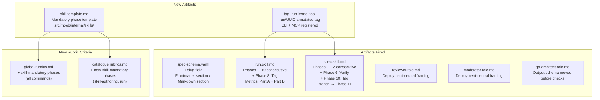

# AI-First Artifact Refinement

## Raw Requirement

Audit and refine moeb's internal harness artifacts for AI-First compliance. Several
artifacts predate the AI-First principles formalised in `moeb.ai-first-principles.md`
and exhibit context-locality and grep-discoverability gaps. Required changes:

- `spec-schema.yaml`: Add missing `slug` field; restructure into clearly labelled
  Frontmatter and Markdown body sections so an agent can tell which fields are YAML
  and which are markdown headings without cross-referencing the skill file.
- `run.skill.md`: Renumber all phases consecutively 1–10 (two unnumbered phases
  currently break the sequence). Add mandatory Phase 8 — Tag (new `tag_run` kernel
  tool, `run/<run_id>` annotated with spec identity). Add Part A / Part B
  sub-headings to the Metrics Recording phase.
- `spec.skill.md`: Reorder and renumber phases 1–12. Add Phase 6 — Verify
  (`verify_rubrics` against command baseline and the authored spec's rubric). Move
  Branch to Phase 11 (post-Commit, skill-specific VCS). Add mandatory Phase 10 — Tag.
  Add Part A / Part B to Metrics Recording.
- `reviewer.role.md` and `moderator.role.md`: Replace "You will receive:" with
  deployment-neutral "When adopting this persona, the following are in scope:" framing.
- `qa-architect.role.md`: Move the output schema before the Mandatory signal checks
  section so category names are defined before they are first used.
- `skill.template.md` (new): Concrete copyable template in
  `src/moeb/internal/skills/` showing mandatory phase structure for skill authors.
- `global.rubrics.md`: Add `skill-mandatory-phases` criterion — every run of any
  command checks its own loaded skill context for the mandatory phase heading names.
- `catalogue.rubrics.md`: Add `new-skill-mandatory-phases` entry (trait:
  `skill-authoring`, Applies At: run) — when a run produces a new `*.skill.md` file,
  verify it contains all mandatory phase headings.
- `tag_run` (new kernel tool): Thin tool accepting `run_id`, `domain`, `slug`;
  creates git tag `run/<run_id>` annotated with spec identity and timestamp. Registered
  in CLI and MCP server tool lists.

## Description

The four AI-First principles require context locality (information used together lives
together) and grep-discoverable names (identifiers findable by search). Three groups of
internal artifacts fail these principles.

**Spec schema.** `spec-schema.yaml` presents all spec structure under a flat `spec:`
YAML key, mixing frontmatter fields (`domain`, `slug`, `status`, `supersedes`, `skill`,
`role`) with markdown section equivalents (`raw_requirement`, `description`, `steps`,
etc.). An agent reading the schema cannot distinguish fields that belong in the YAML
`---` block from headings that go in the markdown body. Additionally, `slug` — present
in every spec's frontmatter — is missing from the schema entirely.

**Skill files.** `run.skill.md` and `spec.skill.md` have broken phase numbering: two
unnumbered phases (End-of-Skill Review and Metrics Recording) were inserted by
`moeb.composable-review-wrapper` between numbered phases, producing the sequence
1,2,3,4,[gap],5,6,7. An agent counting phases or searching for a phase by number
navigates incorrectly. Additionally, `spec.skill.md` has no `verify_rubrics` call,
meaning `moeb.rubric-integrity-enforcement` has no effect on spec runs. The Metrics
Recording phase conflates two distinct operations (recording results and detecting
regressions) with no internal boundary.

**Role files.** `reviewer.role.md` and `moderator.role.md` carry "You will receive:"
framing written for `query_agent` sub-agent invocation. Since `moeb.inline-persona-review`
replaced `query_agent` with inline reasoning, this framing implies a delivery mechanism
that no longer exists in the standard workflow. `qa-architect.role.md` uses signal
categories before defining them.

This spec also introduces `skill.template.md` and the `tag_run` kernel tool. The
template standardises mandatory phases for all future skills and drives two new rubric
criteria: one checking every run's active skill for mandatory phases (global-baseline,
all commands), and one checking newly written skill files for mandatory phases
(catalogue, trait-selected, run-time). The `tag_run` tool creates a traceability git
tag for every moeb run, independent of semantic versioning.



## Backlinks

### Parents

| Label | Path | Purpose |
|-------|------|---------|
| Harness README | README.md | Root index |
| AI-First Organisation Principles | specifications/moeb/moeb.ai-first-principles.md | Formalised the four AI-first principles this spec applies to internal artifacts |
| Agent Skills | specifications/moeb/moeb.agent-skills.md | Establishes run.skill.md and spec.skill.md as binary-bundled defaults |
| Composable Review Wrapper | specifications/moeb/moeb.composable-review-wrapper.md | Introduced the unnumbered review phases now being renumbered |
| Inline Persona Review | specifications/moeb/moeb.inline-persona-review.md | Replaced query_agent with inline personas; role file framing updated for consistency |
| Task-List Tools | specifications/moeb/moeb.task-list-tools.md | Introduced verify_rubrics; spec.skill.md now calls it in Phase 6 |
| Rubric Integrity Enforcement | specifications/moeb/moeb.rubric-integrity-enforcement.md | Kernel enforces rubric integrity via verify_rubrics; spec.skill.md now participates |
| Run Command: Post-Completion Git Commit | specifications/moeb/moeb.run-git-commit.md | Established git_commit in skills; tag_run follows same registration pattern |
| Run Command: SemVer Version Bump and Candidate Tag | specifications/moeb/moeb.run-semver-bump-and-candidate-tag.md | Established create_candidate_tag; tag_run is complementary traceability tag |
| Rubric Context Layers | specifications/moeb/moeb.rubric-context-layers.md | Defines five-layer rubric model; global.rubrics.md and catalogue.rubrics.md extended here |
| Schema Split: Documentation and Validation | specifications/harness/harness.schema-split.md | Introduced spec-schema-validation.json; slug addition requires updating the derived JSON |

## Steps

### Step 1 — Restructure `src/moeb/internal/spec-schema.yaml`

Read `src/moeb/internal/spec-schema.yaml` in full. Rewrite it with two clearly labelled
top-level sections separated by a divider comment. Apply using `write_file` with the
complete new content.

**Section A — FRONTMATTER BLOCK** (fields that go between `---` markers):

```yaml
# =============================================================================
# FRONTMATTER BLOCK
# These fields appear between the opening --- and closing --- markers of a spec.
# =============================================================================

spec_frontmatter:

  domain: string
  # The domain or feature area this spec belongs to.
  # Must match the folder name under specifications/.
  # Example: "auth"

  slug: string
  # Kebab-case identifier for this specification.
  # Must match the filename slug (between the domain prefix and .md extension).
  # Example: "token-rotation" in specifications/auth/auth.token-rotation.md

  status: string
  # Lifecycle state. Required. One of: active, superseded, draft.
  #   active     — currently governing the codebase.
  #   superseded — overridden by a later specification; retained as historical record.
  #   draft      — being authored; not yet part of the harness.

  supersedes:          # optional
  # Machine-readable record of decisions in parent specs overridden here.
  # Omit entirely if this spec overrides no named decision.
  # Prose rationale in the Decisions section is still required.
    - path: string     # relative path to the superseded spec from the .moeb/ root
      decision: string # exact title of the overridden decision

  skill: string        # optional
  # Name of the skill file for running this specification.
  # Kernel looks in .moeb/skills/ then binary assets. Default: run.skill.md.

  role: string         # optional
  # Name of the role file for running this specification.
  # Kernel looks in .moeb/roles/ then binary assets. Default: run.role.md.
```

**Section B — MARKDOWN BODY SECTIONS** (H1 and H2 headings in the document body,
in mandatory order):

```yaml
# =============================================================================
# MARKDOWN BODY SECTIONS
# These are headings in the .md file body — NOT YAML fields.
# Required sections must appear in this exact order after the closing ---.
# =============================================================================

spec_body:

  title: string
  # The H1 heading: # <Title>
  # Human-readable name. NOT a YAML frontmatter field — it is the first line
  # of the markdown body after the closing --- delimiter.

  raw_requirement: section
  # ## Raw Requirement
  # The verbatim requirement as received. Do not paraphrase.

  description: section
  # ## Description
  # Technical summary of the approach — the how, not the what.

  diagram: required
  # A fenced Mermaid block embedded in the markdown body. Required.
  # ```mermaid
  # graph TD
  #   A --> B
  # ```

  backlinks: section
  # ## Backlinks
  # ### Parents table: label, path, purpose for each parent spec or README.
  # ### External table: label, url, purpose for external citations (omit if none).

  steps: section
  # ## Steps
  # Ordered implementation tasks, each numbered and detailed enough for an agent
  # to execute without ambiguity.

  decisions: section
  # ## Decisions
  # Settled design choices with rationale, rejected alternatives, and consequences.

  rubric: section
  # ## Rubric
  # ### Structured table: name, description, threshold, pass_condition.
  # ### Qualitative: free-form quality criteria specific to this specification.
```

After rewriting the schema, read `src/moeb/internal/spec-schema-validation.json` (if
it exists) and add `"slug"` to the list of required frontmatter fields so the derived
validation schema remains consistent with the documentation schema.

### Step 2 — Renumber and extend `src/moeb/internal/skills/run.skill.md`

Read `src/moeb/internal/skills/run.skill.md` in full. Apply the following changes and
write the complete new content using `write_file`:

**a. Phase renumbering** — replace phase headings to produce a consecutive 1–10
sequence:

| Old heading | New heading |
|---|---|
| `## Phase 1 — Plan` | `## Phase 1 — Plan` |
| `## Phase 2 — Scope` | `## Phase 2 — Scope` |
| `## Phase 3 — Implement` | `## Phase 3 — Implement` |
| `## Phase 4 — Verify` | `## Phase 4 — Verify` |
| `## Phase — End-of-Skill Review` | `## Phase 5 — End-of-Skill Review` |
| `## Phase — Metrics Recording` | `## Phase 6 — Metrics Recording` |
| `## Phase 5 — Commit` | `## Phase 7 — Commit` |
| `## Phase 6 — Version and Tag` | `## Phase 9 — Version and Tag` |
| `## Phase 7 — Complete` | `## Phase 10 — Complete` |

**b. Add Phase 8 — Tag** — insert the following section between Phase 7 (Commit) and
Phase 9 (Version and Tag):

```markdown
## Phase 8 — Tag

Call `tag_run` with:
- `run_id`: the current run identifier (`{{run_id}}`)
- `domain`: the value of the `domain` field from the spec frontmatter
- `slug`: the value of the `slug` field from the spec frontmatter

The tool creates an annotated git tag `run/{{run_id}}` with annotation body
`moeb <domain>/<slug> @ <ISO 8601 timestamp>`. This tag is independent of semantic
versioning and provides per-run traceability: any commit produced by moeb can be
identified by its run tag.
```

**c. Add Part A / Part B sub-headings to Phase 6 — Metrics Recording** — insert
`### Part A — Record` immediately before the existing steps 1–3 (assemble RunMetrics,
write metrics file, write run file) and `### Part B — Regression Detection` immediately
before the existing steps 4–7 (load prior metrics, compute rolling average, compare,
conditionally append DegradationSignal). Existing step content and numbering within
the phase are unchanged.

### Step 3 — Reorder and extend `src/moeb/internal/skills/spec.skill.md`

Read `src/moeb/internal/skills/spec.skill.md` in full. Apply the following changes and
write the complete new content using `write_file`:

**a. Full phase renumbering and reordering:**

| Old heading | New heading | Notes |
|---|---|---|
| `## Phase 1 — Contradiction check` | `## Phase 1 — Contradiction check` | unchanged |
| `## Phase 2 — Author` | `## Phase 2 — Author` | unchanged |
| `## Phase 3 — Validate before writing` | `## Phase 3 — Validate before writing` | unchanged |
| `## Phase 4 — Write` | `## Phase 4 — Write` | unchanged |
| `## Phase 5 — Branch` | *(removed from here; becomes Phase 11)* | |
| `## Phase 6 — Link README` | `## Phase 5 — Link README` | moved up |
| *(new)* | `## Phase 6 — Verify` | new — see §b below |
| `## Phase — End-of-Skill Review` | `## Phase 7 — End-of-Skill Review` | |
| `## Phase — Metrics Recording` | `## Phase 8 — Metrics Recording` | |
| `## Phase 7 — Commit` | `## Phase 9 — Commit` | |
| *(new)* | `## Phase 10 — Tag` | new — see §c below |
| *(moved)* | `## Phase 11 — Branch` | moved from old Phase 5 |
| *(renamed)* | `## Phase 12 — Complete` | was unlabelled summary |

**b. Add Phase 6 — Verify** — insert the following section between Phase 5 (Link
README) and Phase 7 (End-of-Skill Review):

```markdown
## Phase 6 — Verify

Collect all rubric criteria from two sources:

1. The injected `{{command_rubrics}}` section. Every row is mandatory and must receive
   a verdict.
2. The `## Rubric / ### Structured` table of the specification authored in Phase 2.
   Every row is mandatory.

For each criterion, evaluate pass, fail, or na:

- `spec-schema-compliance`: verify the authored spec has all required frontmatter fields
  (domain, slug, status) and all required body sections in the correct order.
- `no-drift`: verify the authored spec does not contradict any decision in its linked
  parent specifications.
- `ai-first-org`: verify the spec's Steps prescribe file layouts, naming, and helper
  placement consistent with the four AI-First principles.
- `tool-errors`: kernel-authoritative — do not supply a verdict.
- `rubric-qualification`: kernel-authoritative — do not supply a verdict.
- `kernel-thin-and-parity`: verify no proposed step places workflow logic in Rust;
  verify any new tool is registered in both CLI and MCP server lists.
- All other criteria from the spec's own `## Rubric / ### Structured` table: apply the
  stated Pass Condition. Mark `na` only when the criterion genuinely does not apply.

Call `verify_rubrics` with the complete list of verdicts. Do not call with a partial list.
```

**c. Add Phase 10 — Tag** — insert the following section between Phase 9 (Commit) and
Phase 11 (Branch):

```markdown
## Phase 10 — Tag

Call `tag_run` with:
- `run_id`: the current run identifier (`{{run_id}}`)
- `domain`: the value of the `domain` field from the spec frontmatter
- `slug`: the value of the `slug` field from the spec frontmatter

The tool creates an annotated git tag `run/{{run_id}}` with annotation body
`moeb <domain>/<slug> @ <ISO 8601 timestamp>`.
```

**d. Update Phase 11 — Branch** — the existing Branch phase content (calling
`create_branch` with domain and slug) is preserved. Append one sentence to its
description: "This branch is created after the spec commit so that it points to the
committed spec, making the implementation branch derivable from the spec's git history."

**e. Add Part A / Part B sub-headings to Phase 8 — Metrics Recording** — same pattern
as Step 2c: insert `### Part A — Record` before steps 1–3 and `### Part B — Regression
Detection` before steps 4–7.

### Step 4 — Update `src/moeb/internal/roles/reviewer.role.md`

Read `src/moeb/internal/roles/reviewer.role.md` in full. Locate the paragraph beginning
`You will receive:`. Replace it and its bullet list with:

```markdown
When adopting this persona, the following are in scope:
- The artifact path and its current content.
- The step intent (title and description of what this step was supposed to produce).
- Rubric criteria applicable to this artifact (may be empty if none apply).
- Iteration history: prior review decisions for this step as JSON.
```

Apply using `patch_file`. No other content changes.

### Step 5 — Update `src/moeb/internal/roles/moderator.role.md`

Read `src/moeb/internal/roles/moderator.role.md` in full. Locate the paragraph
beginning `You will receive:`. Replace it and its bullet list with:

```markdown
When adopting this persona, the following are in scope:
- The artifact's current content (after any prior accepted changes in this iteration).
- The proposed diff from the Reviewer.
- Rubric criteria applicable to this artifact.
- Iteration history: prior review decisions for this step as JSON
  (each entry: { "delta_score": float, "accepted": bool }).
```

Apply using `patch_file`. No other content changes.

### Step 6 — Update `src/moeb/internal/roles/qa-architect.role.md`

Read `src/moeb/internal/roles/qa-architect.role.md` in full. Move the output schema
block — the paragraph beginning `Return a JSON object matching this schema exactly:`
through the closing `}` of the schema, plus the severity definition sentence (`Critical
severity is reserved for...`) — to immediately after the `Your values:` block and before
the `Definition of a valid improvement signal` paragraph. The `Mandatory signal checks`
section remains in its current position after all other non-check content.

Apply using `write_file` with the complete reordered content. The text of every section
is unchanged; only the order of sections changes.

### Step 7 — Create `src/moeb/internal/skills/skill.template.md`

Create a new file at `src/moeb/internal/skills/skill.template.md` with the following
content (preserve comment lines exactly — they instruct future skill authors):

```markdown
---
review: true
---
# SKILL TEMPLATE
#
# Copy this file and fill in the command-specific phases below.
# Mandatory phases (marked MANDATORY) must appear in every skill with these exact
# heading names — the skill-mandatory-phases rubric criterion checks for them by
# searching the loaded skill context for: "Verify", "End-of-Skill Review",
# "Metrics Recording", "Commit", "Tag", "Complete".
#
# Skill-specific VCS phases (e.g. Branch for spec, Version and Tag for run) go in
# the [SKILL-SPECIFIC VCS] slot between Tag and Complete.
#
# Delete all comment lines (lines beginning with #) before deploying as a real skill.

## [Command-Specific Phases]

# Replace this section with the phases that perform the command's actual work.
# Example for a two-phase implementation command:
#
# ## Phase 1 — Scope
#   (list_directory, search_files, grep_files, read_file_range)
#
# ## Phase 2 — Implement
#   (write_file / patch_file + Per-Step Review Sub-Loop)

## Phase N — Verify                                            <!-- MANDATORY -->

Collect all rubric criteria from two sources:
1. The injected `{{command_rubrics}}` section — every row is mandatory.
2. The specification's `## Rubric / ### Structured` table — every row is mandatory.

Evaluate pass, fail, or na for each criterion. Call `verify_rubrics` with the complete
list. Do not call with a partial list.

Note: `tool-errors` and `rubric-qualification` are kernel-authoritative — do not
supply verdicts for these; any agent-supplied values are overridden.

## Phase N+1 — End-of-Skill Review                            <!-- MANDATORY -->

Without calling any tool, adopt the **QA Architect Persona** pre-loaded in your context.
Evaluate all artifacts produced in this run, accumulated StepMetrics, and the
specification's full `## Rubric` section. Produce a ReviewSignalReport JSON matching
the schema defined in the QA Architect Persona. Hold the result in working memory.

If `[PARSE_WARNING]` prefix is present, treat as Critical error signal with title
"QA Architect response parse failure" and continue.

Parse the ReviewSignalReport JSON:
1. Assign `signal_id` (UUID v4), `run_id`, `timestamp` to each signal.
2. Write the complete array to `.moeb/signals/{{run_id}}.signals.json`.
3. Continue regardless of critical signal presence.

## Phase N+2 — Metrics Recording                              <!-- MANDATORY -->

### Part A — Record

1. Assemble RunMetrics:
   - `run_id`: current run identifier
   - `timestamp`: ISO 8601 run-start time
   - `rubric_score`: kernel-written from RunState — do NOT compute or write this field
   - `step_metrics`: all StepMetric records accumulated across steps
   - `end_review_error_count`: kernel-written from RunState — do NOT compute or write
   - `wall_time_ms`: elapsed milliseconds since run start

2. Write to `.moeb/metrics/{{run_id}}.metrics.json`.

3. Write run file to `{{run_file_path}}`:
   ```json
   {
     "run_id": "{{run_id}}",
     "timestamp": "<ISO 8601 start time>",
     "command": "<command name>",
     "spec_path": "<path of the spec file>",
     "signals_path": ".moeb/signals/{{run_id}}.signals.json",
     "metrics_path": ".moeb/metrics/{{run_id}}.metrics.json",
     "rubric_score": <from verify_rubrics output>,
     "end_review_error_count": <count of Critical signals>
   }
   ```

### Part B — Regression Detection

4. Load last `{{metrics_window}}` `.metrics.json` files from `.moeb/metrics/` ordered
   by `timestamp` ascending. If fewer than 2 exist, skip regression detection.

5. Compute `rolling_avg = mean(rubric_score for each loaded file)`.

6. If `rubric_score < rolling_avg * (1 - {{metrics_degradation_margin}})`:
   Append a DegradationSignal to `.moeb/signals/{{run_id}}.signals.json`:
   ```json
   {
     "signal_id": "<UUID v4>",
     "run_id": "{{run_id}}",
     "timestamp": "<ISO 8601>",
     "category": "Error",
     "severity": "Critical",
     "title": "Rubric score degraded below rolling baseline",
     "description": "rubric_score is more than {{metrics_degradation_margin}}% below the rolling average.",
     "proposed_resolution": "Revert to the git tag preceding this run, diagnose the regression cause, and branch from the pre-regression version.",
     "gating_condition": "NoCandidateBranch"
   }
   ```

7. Emit `MetricsEvent { metrics: <RunMetrics> }` to the trace.

## Phase N+3 — Commit                                         <!-- MANDATORY -->

Call `git_commit` with the appropriate parameters for this command (kind, domain, slug,
and any additional fields required by the command). Stages all working-tree changes and
commits with the conventional message for this command type.

## Phase N+4 — Tag                                            <!-- MANDATORY -->

Call `tag_run` with:
- `run_id`: `{{run_id}}`
- `domain`: value of `domain` from the spec frontmatter
- `slug`: value of `slug` from the spec frontmatter

The tool creates annotated git tag `run/{{run_id}}` with annotation
`moeb <domain>/<slug> @ <ISO 8601 timestamp>`.

## [Skill-Specific VCS Phases]                                <!-- OPTIONAL SLOT -->

# Insert any command-specific VCS phases here, between Tag and Complete.
# Examples:
#   - Branch (create_branch) — for spec command
#   - Version and Tag (bump_version + create_candidate_tag) — for run command
# Omit this section if the command has no skill-specific VCS steps.

## Phase N+5 — Complete                                       <!-- MANDATORY -->

Respond with a concise summary of every file created or updated during this run.
```

### Step 8 — Add `skill-mandatory-phases` to `src/moeb/internal/rubrics/global.rubrics.md`

Read `src/moeb/internal/rubrics/global.rubrics.md`. Append the following row to the
criteria table using `patch_file`:

```
| `skill-mandatory-phases` | The skill loaded for this run contains all mandatory phase headings. The agent checks its own prompt context (the loaded skill content is already present) for the exact strings: "Verify", "End-of-Skill Review", "Metrics Recording", "Commit", "Tag", "Complete". No file read is required. | All six mandatory headings present | Agent scans skill content in its loaded context; fails if any mandatory heading string is absent |
```

### Step 9 — Add `new-skill-mandatory-phases` to `.moeb/rubrics/catalogue.rubrics.md`

Read `.moeb/rubrics/catalogue.rubrics.md`. Append the following row to the catalogue
table using `patch_file`:

```
| `new-skill-mandatory-phases` | New Skill Mandatory Phases | Any `*.skill.md` file written during this run contains all mandatory phase heading strings: "Verify", "End-of-Skill Review", "Metrics Recording", "Commit", "Tag", "Complete" | All six strings present in the written skill file | moeb | skill-authoring | run | active |
```

The trait `skill-authoring` is detected when the agent's task list includes writing a
file with the `.skill.md` extension.

### Step 10 — Add `tag_run` kernel tool

**10a. Create `src/moeb/src/tools/tag_run.rs`.**

```rust
#[derive(Debug, Deserialize)]
pub struct TagRunInput {
    pub run_id: String,
    pub domain: String,
    pub slug: String,
}
```

Implementation:
1. Construct tag name: `format!("run/{}", input.run_id)`
2. Construct annotation: `format!("moeb {}/{} @ {}", input.domain, input.slug, Utc::now().to_rfc3339())`
3. Execute `git tag -a <tag_name> -m <annotation>` via `std::process::Command` in the
   current working directory, using the same git invocation pattern as `git_commit.rs`.
4. On success: return `format!("{{ \"tag\": \"{}\", \"annotation\": \"{}\" }}", tag_name, annotation)`.
5. On failure: return the stderr content as the tool result string. Do not use `?` or
   `.unwrap()` — errors are returned as the result so the agent observes the failure
   without the run aborting (non-termination invariant from
   `moeb.rubric-integrity-enforcement`).

**10b. Register in `src/moeb/src/tools/mod.rs`.**

Add `tag_run` to the `standard()` registry following the existing handler registration
pattern. Locate the `standard()` function, read it to confirm the pattern, and add:
```rust
registry.register("tag_run", TagRunHandler);
```

**10c. Register in the MCP server tool list.**

Locate the MCP server tool listing (grep for `list_tools` or the tools array in
`src/moeb/src/commands/serve.rs` or the MCP server module). Add `tag_run` with:

```json
{
  "name": "tag_run",
  "description": "Create an annotated git tag for this run. Tag: run/<run_id>. Annotation: moeb <domain>/<slug> @ <timestamp>.",
  "inputSchema": {
    "type": "object",
    "properties": {
      "run_id": { "type": "string" },
      "domain": { "type": "string" },
      "slug": { "type": "string" }
    },
    "required": ["run_id", "domain", "slug"]
  }
}
```

## Decisions

### Decision 1 — spec-schema.yaml split into Frontmatter and Markdown sections

**Rationale:** The original schema presented all spec structure under a single `spec:`
YAML key, indistinguishably mixing YAML frontmatter fields with markdown section
equivalents. An agent reading the schema cannot tell whether `domain` goes in the `---`
block or is a markdown heading. Splitting into two labelled sections (`spec_frontmatter`
and `spec_body`) makes the distinction structural and self-evident. The `slug` field —
present in every real spec file but absent from the schema — is added to
`spec_frontmatter`.

**Rejected alternatives:**
- Add inline comments only: fragile; the section structure makes the distinction load-bearing, not documentary.
- Two separate files: splits one conceptual document; the schema is read as a unit.

**Consequences:** The `spec_frontmatter` and `spec_body` YAML keys are documentation
organisers, not valid spec fields. `spec-schema-validation.json` must be updated to
include `slug` as a required frontmatter field.

### Decision 2 — Consecutive phase numbering; unnumbered phases numbered in sequence

**Rationale:** Unnumbered phases are not grep-discoverable by position and break
unambiguous phase references in rubric criteria and signals. Consecutive numbering
ensures every phase is uniquely identifiable by number or by name.

**Rejected alternatives:**
- Name-only phases (remove numbers): loses searchability by position.
- Keep unnumbered phases, add anchors: markdown anchors are not universally parsed.

**Consequences:** Any existing references to "Phase 5" in `run.skill.md` now refer to
End-of-Skill Review rather than Commit. Skill files are mutable harness documents; this
is a documentation change only.

### Decision 3 — Branch moved to Phase 11 in spec.skill.md, after Commit and Tag

**Rationale:** The spec authoring commit is a documentation record that belongs on the
main branch. The `feat/<domain>-<slug>` branch is the starting point for implementation
work. Creating the branch after the spec commit means the branch points to the committed
spec, making the implementation branch derivable from the spec's git history.

**Rejected alternatives:**
- Keep Branch before Commit: commits the spec to the feat branch instead of main;
  downstream tooling that expects specs on main would need updating.
- Remove Branch from spec.skill.md: loses the automated implementation-branch creation.

**Consequences:** Phase 9 (Commit) runs on the current branch (typically main). Phase
11 (Branch) creates `feat/<domain>-<slug>` from that commit. Implementation work begins
on the feat branch.

### Decision 4 — Verify phase added to spec.skill.md

**Rationale:** `spec.skill.md` had no `verify_rubrics` call, so
`moeb.rubric-integrity-enforcement` had no effect on spec runs — signals were not
kernel-written and `rubric_score` was never kernel-computed for spec commands. Adding
Phase 6 — Verify brings spec runs into the rubric-integrity-enforcement contract.

**Rejected alternatives:**
- Embed verify_rubrics in the spec write sub-loop: tangles artifact review with rubric
  compliance verification; the dedicated phase matches the run.skill.md pattern.

**Consequences:** Spec runs now produce kernel-written signals and kernel-computed
`rubric_score`. The `rubric-qualification` and `tool-errors` criteria are enforced.

### Decision 5 — Deployment-neutral framing in reviewer and moderator role files

**Rationale:** "You will receive:" implies a tool-call delivery event absent in inline
persona mode. "When adopting this persona, the following are in scope:" is accurate for
both inline reasoning (content in working memory) and sub-agent invocation (content
delivered as tool input), supporting both current and potential future deployment modes.

**Rejected alternatives:**
- Separate role files per deployment mode: doubles maintenance; persona identity, values,
  and output format are identical across modes.

**Consequences:** Both role files describe inputs without implying a delivery mechanism.
Output format contracts (unified diff, JSON verdict) are unchanged.

### Decision 6 — skill.template.md in `src/moeb/internal/skills/`

**Rationale:** The template is moeb-development context, not a template for user
projects. Placing it in `internal/skills/` alongside the default skills makes it
available to moeb's own run agents without requiring `moeb init` changes. It is
discoverable via `list_directory` on the internal skills directory.

**Rejected alternatives:**
- `assets/skills/` + init copy: requires extending `moeb init` to copy skills (currently
  only rubrics are copied); premature until the broader skills-init story is designed.
- Section in assets/README.md: not a concrete copyable starting point.

**Consequences:** New skill authors reference the template by reading
`src/moeb/internal/skills/skill.template.md`. The mandatory phase headings in the
template are the source of truth for both rubric criteria.

### Decision 7 — Two rubric criteria: global `skill-mandatory-phases` and catalogue `new-skill-mandatory-phases`

**Rationale:** Two distinct checks are needed. The global criterion verifies that every
run uses a skill already containing the mandatory phases — catching stale custom skills
missing new mandatory phases. The catalogue criterion verifies that newly written skill
files are born compliant. The global layer applies to all current and future commands
without per-command configuration, which is why `Applies At: all` is used rather than
`both` (which implies only spec+run).

**Rejected alternatives:**
- Single criterion for new skill files only: does not catch runs using pre-existing
  stale skills.
- Both criteria in the catalogue: requires traits on all runs; incorrectly burdens
  non-skill-producing runs.

**Consequences:** Every moeb run includes `skill-mandatory-phases` in its rubric
verification. A non-compliant skill produces a rubric fail signal.

### Decision 8 — `tag_run` as a new dedicated thin tool

**Rationale:** The run UUID tag is a per-run traceability record, not a release
artefact. Extending `create_candidate_tag` with a mode flag would mix two unrelated
concerns. A dedicated `tag_run` tool is one concern per file and grep-discoverable by
name. Errors are returned as the tool result string (not propagated via `?`) per the
non-termination invariant from `moeb.rubric-integrity-enforcement`.

**Rejected alternatives:**
- Extend `create_candidate_tag`: mixes release tagging and traceability tagging; input
  schemas differ (run tag needs `run_id`; candidate tag does not).
- Raw git in skill: violates kernel-thin-and-parity; MCP mode cannot execute raw git.

**Consequences:** `tag_run` is `tools/tag_run.rs`, registered in CLI and MCP. Every
`moeb run` and `moeb spec` produces a `run/<uuid>` git tag on its commit.

### Decision 9 — Part A / Part B sub-headings in Metrics Recording, not a phase split

**Rationale:** The two operations (recording results and detecting regressions) are
coupled — Part B uses the `rubric_score` established in Part A. A phase split implies
independence that does not exist. Sub-headings make each obligation scannable while
keeping the two operations together.

**Rejected alternatives:**
- Full phase split: implies independence; lengthens phase list.
- No internal structure: the current single-block format made it hard to identify
  which step had failed mid-phase.

**Consequences:** Metrics Recording is one phase with two labelled parts. Agents
interrupted mid-phase can identify their position by the Part heading.

## Rubric

### Structured

| Name | Description | Threshold | Pass Condition |
|------|-------------|-----------|----------------|
| `no-drift` | The specification does not violate any decision recorded in a linked parent specification | Zero contradictions | Manual review of every decision in every parent spec listed in Backlinks |
| `spec-schema-compliance` | All required frontmatter fields and body sections are present and correctly ordered | 100% of required fields and sections | Validation in `domain/spec.rs` exits 0 during `moeb spec` |
| `ai-first-org` | The specification's Steps prescribe file layouts, naming, and helper placement that satisfy the four AI-first organisation principles | All four principles followed | spec-schema.yaml split creates exactly two named top-level sections; phase headings are numbered and grep-distinct; tag_run.rs is one concern co-located with other tool files; skill.template.md is a single-concern document |
| `tool-errors` | No ToolHandler errors were recorded during this command invocation | Zero tool errors | Kernel-authoritative |
| `rubric-qualification` | No Pass verdicts with acknowledged failures | Zero qualified Pass verdicts | Kernel-authoritative |
| `kernel-thin-and-parity` | No workflow logic in kernel Rust; tag_run registered in both CLI and MCP | Zero violations | grep confirms tag_run in tools/mod.rs standard() and in MCP server tool list |
| `schema-slug-present` | `spec-schema.yaml` `spec_frontmatter` section contains a `slug` field with description | slug field present | grep for "slug" in src/moeb/internal/spec-schema.yaml returns a match in the FRONTMATTER BLOCK section |
| `schema-sections-labelled` | `spec-schema.yaml` has two sections labelled FRONTMATTER BLOCK and MARKDOWN BODY SECTIONS | Both labels present | grep for "FRONTMATTER BLOCK" and "MARKDOWN BODY SECTIONS" each return 1 |
| `run-skill-phases-consecutive` | `run.skill.md` phases are numbered 1–10 with no gaps and no unnumbered phase headings | Ten numbered phases, zero unnumbered | grep for "## Phase" in run.skill.md returns exactly 10 lines each containing a number |
| `spec-skill-phases-consecutive` | `spec.skill.md` phases are numbered 1–12 with no gaps and no unnumbered phase headings | Twelve numbered phases, zero unnumbered | grep for "## Phase" in spec.skill.md returns exactly 12 lines each containing a number |
| `spec-skill-has-verify` | `spec.skill.md` Phase 6 calls `verify_rubrics` | verify_rubrics present in Phase 6 section | grep for "verify_rubrics" in spec.skill.md returns at least one match |
| `tag-run-phases-present` | Both `run.skill.md` and `spec.skill.md` contain a phase calling `tag_run` | tag_run called in both skill files | grep for "tag_run" in each skill file returns a match |
| `skill-template-created` | `src/moeb/internal/skills/skill.template.md` exists with all six mandatory phase heading strings | File present with all six headings | File readable; grep for each of: "Verify", "End-of-Skill Review", "Metrics Recording", "Commit", "Tag", "Complete" in the template returns a match |
| `global-rubric-skill-mandatory-phases` | `skill-mandatory-phases` row present in `src/moeb/internal/rubrics/global.rubrics.md` | Row present | grep for "skill-mandatory-phases" in global.rubrics.md returns a match |
| `catalogue-new-skill-mandatory-phases` | `new-skill-mandatory-phases` row present in `.moeb/rubrics/catalogue.rubrics.md` | Row present | grep for "new-skill-mandatory-phases" in catalogue.rubrics.md returns a match |
| `tag-run-tool-registered` | `tag_run` registered in both `tools/mod.rs` standard registry and MCP server tool list | Registered in both | grep for "tag_run" in tools/mod.rs and in the MCP server file each return a match |

### Qualitative

- The `spec_frontmatter` section of the restructured `spec-schema.yaml` must contain
  no markdown section equivalents (`steps`, `decisions`, `rubric`, `description`,
  `raw_requirement`). The `spec_body` section must contain no YAML frontmatter fields
  (`domain`, `slug`, `status`, `supersedes`, `skill`, `role`).
- Phase 6 — Verify in `spec.skill.md` must reference both `{{command_rubrics}}` and the
  authored spec's own `## Rubric / ### Structured` table as criteria sources, matching
  the pattern in `run.skill.md` Phase 4.
- `skill.template.md` must clearly distinguish mandatory phases (MANDATORY comments)
  from optional/skill-specific slots so a skill author copying the template knows what
  must be kept and what can be replaced.
- The reviewer and moderator role files must contain no remaining instances of "You will
  receive:" after Steps 4 and 5 are applied.
- `tag_run.rs` must not propagate errors via `?` or `.unwrap()` on the git invocation —
  errors are returned as the tool result string, consistent with the non-termination
  invariant from `moeb.rubric-integrity-enforcement`.
