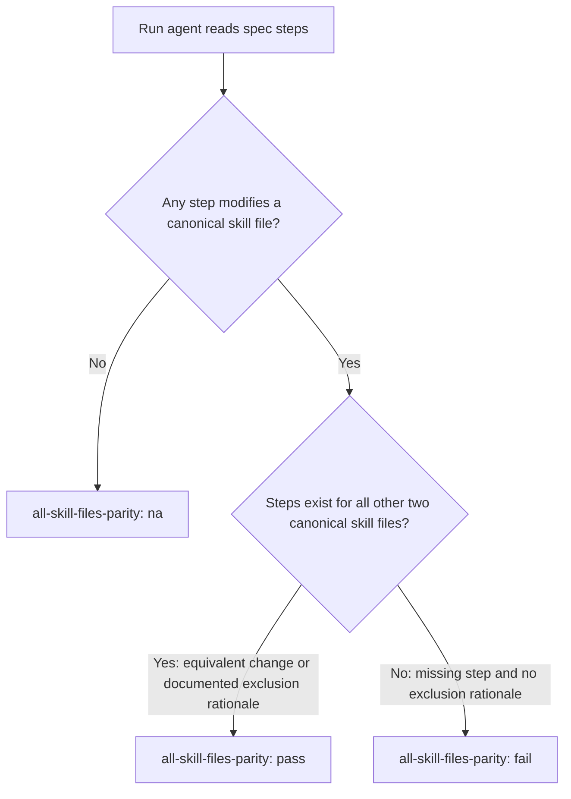

# Add `all-skill-files-parity` Rubric Criterion to Global Baseline

## Raw Requirement

Add a rubric criterion `all-skill-files-parity` to the global rubric (src/moeb/internal/rubrics/global.rubrics.md) that mandates: whenever a spec adds, removes, or modifies a workflow phase in any one of the three canonical skill files (run.skill.md, spec.skill.md, fix_signal.skill.md), the spec must contain an explicit Step for each of the other two files — either applying the equivalent change or documenting with rationale why that file is intentionally excluded. The criterion fails if a phase change appears in only one skill file with no documented exclusion rationale for the other two.

## Description

This specification adds one new row — `all-skill-files-parity` — to the criteria table in `src/moeb/internal/rubrics/global.rubrics.md` (the binary-bundled Layer 1 global baseline). The criterion is evaluated at run time by the implementing agent. When a spec modifies a workflow phase in any of the three canonical skill files (`run.skill.md`, `spec.skill.md`, `fix_signal.skill.md`), the run agent verifies that the spec contains an explicit step for each of the other two files — either applying the equivalent change or documenting with rationale why that file is intentionally excluded. The criterion is marked `na` when the spec under implementation makes no changes to any canonical skill file.

Placing the criterion in the binary-bundled global baseline ensures it fires unconditionally for every run in every project, preventing silent divergence between the three canonical skill files without relying on accurate trait detection at spec-authoring time.



## Backlinks

### Parents

| Label | Path | Purpose |
|-------|------|---------|
| Harness README | [README.md](README.md) | Parent policy document governing the rubric system |
| Rubric System Rationalisation: Five-Layer Model and Trait-Keyed Catalogue | [specifications/harness/harness.rubric-index-rationalisation.md](specifications/harness/harness.rubric-index-rationalisation.md) | Defines the five-layer rubric model; Layer 1 global baseline is extended here |
| Rubric Context Layers: Binary-Bundled Baseline Criteria per Command Context | [specifications/moeb/moeb.rubric-context-layers.md](specifications/moeb/moeb.rubric-context-layers.md) | Establishes the placement policy for binary-bundled rubric criteria |

## Steps

1. Read `src/moeb/internal/rubrics/global.rubrics.md` to obtain the current file content and identify the final row of the existing criteria table.

2. Append the following row to the criteria table in `src/moeb/internal/rubrics/global.rubrics.md`:

   ```
   | `all-skill-files-parity` | Whenever a spec adds, removes, or modifies a workflow phase in any one of the three canonical skill files (run.skill.md, spec.skill.md, fix_signal.skill.md), the spec must contain an explicit Step for each of the other two files — either applying the equivalent change or documenting with rationale why that file is intentionally excluded. | Zero unaddressed canonical skill files when any canonical skill file phase is modified | Run agent reviews the steps of the spec under implementation. If no canonical skill file phase is added, removed, or modified, mark `na`. If one or more canonical skill file phases are modified, verify that the spec contains a step for each of the other two canonical skill files (addressing the equivalent change or stating an exclusion rationale). Fail if any of the other two files has neither a qualifying step nor a documented exclusion rationale. |
   ```

3. No other source files require modification. The updated `global.rubrics.md` will be compiled into the binary at the next build.

## Decisions

### Decision 1 — Binary-bundled global baseline over trait-keyed catalogue

The `all-skill-files-parity` criterion is placed in `src/moeb/internal/rubrics/global.rubrics.md` (Layer 1, binary-bundled global baseline) rather than in `.moeb/rubrics/rubrics.catalogue.md` as a trait-keyed `skill-authoring` entry. The requirement explicitly targets `global.rubrics.md`. A global-baseline placement also offers a stronger correctness guarantee: the criterion fires unconditionally for every run, and agents implementing non-skill-file specs mark it `na` — no trait-detection step is required. If placed in the catalogue, an agent that fails to detect the `skill-authoring` trait at spec-authoring time silently omits the criterion from the spec's rubric table, creating an undetected gap.

Rejected alternative: Add as a `skill-authoring` trait entry in `.moeb/rubrics/rubrics.catalogue.md`. Rejected because trait omission at spec time would silently suppress the criterion at run time.

Consequence: The criterion appears in every run agent's rubric. Agents implementing non-skill-file specs will mark it `na`. This is an acceptable overhead for the correctness guarantee.

### Decision 2 — Run-time verification; `na` when no skill file in scope

The criterion is designed for run-time verification: the run agent reads the spec it is implementing and checks whether skill-file steps are present. At spec-authoring time, the check would be circular — the spec agent would have to evaluate its own in-progress steps while still writing them. Marking the criterion `na` when no canonical skill file is modified prevents false failures in the vast majority of runs that operate on Rust source, configuration, or non-skill markdown files.

Rejected alternative: Evaluate at spec time. Rejected because spec-time evaluation is circular and the spec agent cannot reliably verify its own in-progress output against this criterion.

### Decision 3 — Criterion fails on absence of step or rationale, not on outcome identity

The criterion fails when a canonical skill file is modified in the spec but the other two files have neither a qualifying step nor a documented exclusion rationale. It does not require the changes to be identical — a step that explains "fix_signal.skill.md does not require this phase because it is not a long-running command" satisfies the criterion. This design allows intentional asymmetry between skills while preventing silent omission.

Rejected alternative: Require identical changes across all three skill files. Rejected because the three skill files have genuinely different workflows; identical changes are often inappropriate (for example, a token-budget phase in run.skill.md is irrelevant to spec.skill.md).

## Rubric

### Structured

| Name | Description | Threshold | Pass Condition |
|------|-------------|-----------|----------------|
| `tool-errors` | No ToolHandler errors were recorded during this command invocation. Covers all tool calls on both CLI and MCP paths via `RealToolExecutor::execute`. Applies to every moeb command. | Zero tool errors | Kernel-authoritative: injected by `verify_rubrics` from `RunState.tool_errors`. Do not supply a verdict — any agent-supplied entry is overridden. |
| `rubric-qualification` | No Pass verdicts with acknowledged failures were issued during this command invocation. An agent that observes a failure but passes a criterion must populate `acknowledged_failures` in the verdict object. Applies to every moeb command. | Zero qualified Pass verdicts | Kernel-authoritative: injected by `verify_rubrics` by scanning `acknowledged_failures` on incoming Pass verdicts. Do not supply a verdict — any agent-supplied entry is overridden. |
| `skill-mandatory-phases` | The skill loaded for this run contains all mandatory phase headings. The agent checks its own prompt context (the loaded skill content is already present) for the exact strings: "Verify", "End-of-Skill Review", "Metrics Recording", "Commit", "Tag", "Complete". No file read is required. | All six mandatory headings present | Agent scans skill content in its loaded context; fails if any mandatory heading string is absent |
| `no-drift` | The specification does not violate any decision recorded in a linked parent specification | Zero contradictions | Manual review of every decision in every parent spec listed in Backlinks |
| `spec-schema-compliance` | All required frontmatter fields and body sections are present and correctly ordered | 100% of required fields and sections | Validation in `domain/spec.rs` exits 0 during `moeb spec` |
| `ai-first-org` | The specification's Steps prescribe file layouts, naming, and helper placement that satisfy the four AI-first organisation principles: one concern per file, context locality, grep-discoverable names, no cross-cutting helpers. | All four principles followed | Manual review: no step produces a file that mixes concerns, no name is generic across the codebase, all helpers are co-located with their callers or promoted to a precisely named module |
| `branch-clean-at-exit` | After Phase 9 (Commit), the working tree contains no uncommitted changes; any dirty state detected in Phase 9a has been resolved by retry commit (Case A) or by signal emission and cleanup commit (Case B) | Zero uncommitted changes at spec skill exit | Agent verifies that `git_status` returned empty output after Phase 9, or that a retry (Case A) or cleanup commit (Case B) was issued and the branch is clean |
| `kernel-thin-and-parity` | No domain-specific or workflow-specific coordination logic may be placed in kernel Rust code when it can live in skill markdown or role files. Every tool registered in the CLI tool registry must also be registered in the MCP stdio server tool list. | Zero violations | Spec review: no proposed step places review/coordination logic in Rust; Run review: grep confirms no skill-specific logic in kernel tools; tool lists in tools/mod.rs and the MCP server match exactly |
| `moeb-tool-origin` | All tool calls made during this invocation must originate from moeb's own tool registry. If an external tool (not in the moeb registry) was used because no moeb equivalent exists, the agent must write a MissingMoebTool signal immediately after each such call. The criterion always fails when any external tool is used, whether or not a signal was written. | Zero external tool calls | Agent reviews the conversation for calls to non-moeb tools (e.g. Bash, Edit, Write, Read, Glob, Grep, WebFetch, WebSearch in Claude Code MCP mode). Supplies Pass if none were made. If external tools were used with MissingMoebTool signals, supplies Fail with `acknowledged_failures` listing each signal title. If external tools were used without signals, supplies Fail with the unlogged tool names in the note. |
| `thin-kernel` | New Rust code in tools/, commands/, or domain/ must be either (a) a primitive operation wrapper (filesystem, git, or HTTP with no domain logic) or (b) a thin dispatcher that calls into skills, tools, or agents and returns the result unchanged. Workflow logic — sequencing, conditionals, review loops, retry strategy, branching decisions — must live in skill markdown or role files, not in compiled Rust. If the same capability can be achieved by updating a skill file, that path is mandatory. | Zero workflow-logic functions in new Rust | Spec review: no Step proposes placing sequencing or conditional workflow logic in Rust when a skill-file change would suffice; Run review: every new function in tools/ or commands/ either wraps a single OS/VCS/HTTP call or contains no domain-specific branching |

### Qualitative

- The new `all-skill-files-parity` row must be syntactically consistent with existing rows in `src/moeb/internal/rubrics/global.rubrics.md`: four pipe-delimited columns, criterion name in backticks, no trailing whitespace.
- The `Pass Condition` cell must explicitly cover all three verdict paths: `na` (no skill file modified), `pass` (all other files addressed), and `fail` (any file unaddressed with no documented rationale).
- The criterion wording must not reference specific phase numbers, which change as new phases are inserted; it must reference phase content (add, remove, or modify a workflow phase).
