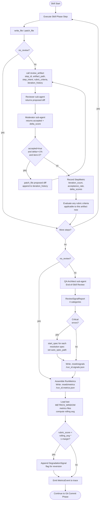

# Composable Review Wrapper

## Raw Requirement

Design and implement a composable review wrapper system for moeb skills. The system
operates at two tiers: per-step artifact review and end-of-skill holistic review.

Tier 1 — Per-step review: after every produced artifact (file write or patch), a
Writer→Reviewer→Moderator agent triangle reviews the output. The Reviewer surfaces
proposed changes back to the Writer (never applies them directly). The Moderator
validates that proposed changes are reasonable and scores expected improvement delta.
Iteration continues until delta drops below ~1%, the per-step acceptance rate drops
below ~95%, or a hard cap of 2 iterations is reached. No human pause mid-loop.

Tier 2 — End-of-skill review: performed by a specific QA Architect agent persona.
Captures four categories in a structured report: (a) error specs — critical errors,
each auto-generating a resolution spec; (b) skill improvement specs; (c) tool
improvement specs; (d) new capability specs. Critical errors are reported and get
resolution specs but do not cause skill failure.

General requirements:
- Composable: any skill can opt in declaratively via a `review:` frontmatter field.
- `--no-review` CLI flag disables per-invocation; review is ON by default.
- Rubric: explicit (from skill spec) + auto-generated from step intent, both used.
  Overall skill rubrics applied as early as applicable, not only at end.
- Benchmarking: each run emits structured RunMetrics. Rolling average over N runs
  detects post-improvement regressions; degraded runs are flagged for reversion.
- Signal contract: ReviewSignal data shape defined here; delivery mechanism deferred
  to a follow-on spec. Gating conditions (e.g., no-ingest while candidate branch
  is live) included in contract.

## Description

The composable review wrapper introduces a two-tier quality introspection system for
moeb skills. Tier one fires a per-step review sub-loop after every `write_file` or
`patch_file` call within a skill phase: a new `review_artifact` kernel tool internally
coordinates a Reviewer sub-agent (which proposes changes as a unified diff) and a
Moderator sub-agent (which scores expected improvement delta and accepts or rejects
the proposal). The coordinator applies accepted proposals and repeats up to a hard
cap of two iterations, stopping early when delta falls below 1% or per-step acceptance
rate drops below 95%. Tier two runs after all implementation steps complete: a
QA Architect sub-agent (backed by a distinct `qa-architect.role.md` persona) reviews
all produced artifacts holistically and emits a structured `ReviewSignalReport` with
four categories. Critical-error signals trigger automatic resolution spec generation via
`start_spec`; all signals are written to `.moeb/signals/<run_id>.signals.json`. Skill
completion is not blocked by review findings. Run metrics (rubric score, per-step
iteration counts, acceptance rates, delta scores, error count, wall time) are persisted
to `.moeb/metrics/<run_id>.metrics.json` and compared against a configurable rolling
baseline; degraded runs emit a `DegradationSignal` and are flagged for reversion.

Skills opt in via a `review:` boolean in their YAML frontmatter (default `true`). A
`--no-review` CLI flag on `moeb run` and `moeb spec` suppresses all review activity
for that invocation, exposed as the `{{no_review}}` template variable in skill prompts.
Two new kernel config keys (`METRICS_WINDOW`, `METRICS_DEGRADATION_MARGIN`) govern
rolling-window size and the degradation detection threshold. The `ReviewSignal` struct
constitutes the data contract for a future delivery adapter; the delivery mechanism
itself (e.g., GitHub Issues) is out of scope and deferred.



## Backlinks

### Parents

| Label | Path | Purpose |
|-------|------|---------|
| Harness README | README.md | Root index |
| Agent Skills | specifications/moeb/moeb.agent-skills.md | Skill file system being extended with frontmatter and review phases |
| Agent Roles | specifications/moeb/moeb.agent-roles.md | Role file system; new qa-architect.role.md follows same pattern |
| Sub-Agent Spawning | specifications/moeb/moeb.sub-agent-spawning.md | spawn_agent infrastructure used internally by review_artifact |
| Task-List Tools | specifications/moeb/moeb.task-list-tools.md | Tool registry pattern followed by review_artifact registration |
| Trace Capture, Replay, and Kernel Configuration | specifications/moeb/moeb.trace-and-replay.md | Trace event enum extended with MetricsEvent |
| Adapter Configuration, Release, and Listing | specifications/moeb/moeb.adapter-config-and-listing.md | moeb configure key list extended with METRICS_WINDOW and METRICS_DEGRADATION_MARGIN |
| Moeb Init Rubric Storage Boundary | specifications/moeb/moeb.init-rubric-storage-boundary.md | moeb init directory creation pattern followed for .moeb/signals/ and .moeb/metrics/ |
| Run Command: SemVer Version Bump and Candidate Tag | specifications/moeb/moeb.run-semver-bump-and-candidate-tag.md | Most recent run.skill.md phase definition; new phases insert before Git Commit |

## Steps

### Step 1 — Define review data types in `src/moeb/src/domain/review.rs`

Create a new file `src/moeb/src/domain/review.rs`. All types must derive
`Debug`, `Clone`, `Serialize`, `Deserialize` (serde).

```rust
use serde::{Deserialize, Serialize};

#[derive(Debug, Clone, Serialize, Deserialize)]
#[serde(rename_all = "PascalCase")]
pub enum ReviewCategory {
    Error,
    SkillImprovement,
    ToolImprovement,
    NewCapability,
}

#[derive(Debug, Clone, Serialize, Deserialize)]
#[serde(rename_all = "PascalCase")]
pub enum ReviewSeverity {
    Critical,
    Major,
    Minor,
}

#[derive(Debug, Clone, Serialize, Deserialize)]
#[serde(rename_all = "PascalCase")]
pub enum GatingCondition {
    NoCandidateBranch,
    Custom(String),
}

#[derive(Debug, Clone, Serialize, Deserialize)]
pub struct ReviewSignal {
    pub signal_id: String,            // UUID v4
    pub run_id: String,
    pub timestamp: String,            // ISO 8601
    pub category: ReviewCategory,
    pub severity: ReviewSeverity,
    pub title: String,
    pub description: String,
    pub proposed_resolution: Option<String>,
    pub auto_spec_path: Option<String>,
    pub gating_condition: Option<GatingCondition>,
}

#[derive(Debug, Clone, Serialize, Deserialize)]
pub struct StepMetric {
    pub step_id: String,
    pub iteration_count: u8,
    pub acceptance_rate: f32,         // 0.0–1.0
    pub delta_scores: Vec<f32>,       // one entry per iteration attempt
}

#[derive(Debug, Clone, Serialize, Deserialize)]
pub struct RunMetrics {
    pub run_id: String,
    pub timestamp: String,            // ISO 8601 run-start time
    pub rubric_score: f32,            // 0.0–1.0; mean of per-criterion pass fractions
    pub step_metrics: Vec<StepMetric>,
    pub end_review_error_count: u32,  // count of Critical signals from end-of-skill review
    pub wall_time_ms: u64,
}
```

Add `pub mod review;` to `src/moeb/src/domain/mod.rs` and re-export all public types
with `pub use review::*;`.

### Step 2 — Add `MetricsEvent` to the trace event enum

Locate the trace event enum (search for `enum.*Event` or `TraceEvent` in
`src/moeb/src/domain/`). Add the following variant:

```rust
MetricsEvent { metrics: RunMetrics },
```

Ensure the JSON serialization of this variant nests `metrics` as a sub-object in the
trace output, consistent with how other structured event variants are serialized.

### Step 3 — Add `--no-review` flag and new kernel config keys

**3a. CLI flag.**
In the `run` and `spec` subcommand argument structs (wherever `moeb run` and
`moeb spec` CLI args are parsed), add:

```rust
/// Disable the per-step review sub-loop and end-of-skill review for this invocation.
#[arg(long, default_value_t = false)]
pub no_review: bool,
```

**3b. Thread through context.**
Pass `no_review` from parsed CLI args into the run/spec execution context struct so
it is available when skill prompt templates are rendered.

**3c. Kernel config keys.**
Extend the existing `moeb configure` key registry with two new entries:

| Key | Type | Default | Description |
|-----|------|---------|-------------|
| `METRICS_WINDOW` | integer | `5` | Number of most-recent runs used to compute the rolling-average rubric score for regression detection |
| `METRICS_DEGRADATION_MARGIN` | float | `0.10` | Fraction below rolling average that triggers a DegradationSignal (e.g., 0.10 = 10% below average) |

**3d. Template variables.**
Expose `no_review`, `metrics_window`, and `metrics_degradation_margin` as template
variables injected into skill prompts alongside existing variables:

| Variable | Value |
|----------|-------|
| `{{no_review}}` | `"true"` or `"false"` |
| `{{metrics_window}}` | integer string, e.g. `"5"` |
| `{{metrics_degradation_margin}}` | float string, e.g. `"0.10"` |

### Step 4 — Implement `review_artifact` tool in `src/moeb/src/tools/review_artifact.rs`

Create `src/moeb/src/tools/review_artifact.rs`. This tool encapsulates the
Reviewer→Moderator triangle and returns a structured verdict to the coordinator agent.

**Tool name:** `"review_artifact"`

**Input schema (JSON):**

```json
{
  "artifact_path": "string — path to the artifact just written, relative to repo root",
  "step_id": "string — identifier for the current step, used in StepMetric",
  "step_intent": "string — step title and description from the skill; used to auto-generate rubric when none is provided",
  "rubric_criteria": "string — Markdown table rows from the spec's ## Rubric / ### Structured table applicable to this artifact; empty string if none apply",
  "iteration_history": "array of objects: [{ \"delta_score\": float, \"accepted\": bool }]"
}
```

**Output (JSON string in ToolResult):**

```json
{
  "proposed_changes": "string (unified diff) or null",
  "delta_score": 0.0,
  "accepted": false,
  "rationale": "string"
}
```

**Implementation steps inside the tool handler:**

1. Read the artifact content using the existing file-read infrastructure (same path as
   `write_file` / `patch_file` scope enforcement from `moeb.run-file-scope-enforcement.md`).

2. Build a `rubric_for_review` string: if `rubric_criteria` is non-empty, use it as-is.
   Otherwise, auto-generate: `"Criterion: The artifact fully and correctly accomplishes
   the following intent: <step_intent>"`.

3. Spawn a **Reviewer sub-agent** using the same sub-agent infrastructure as `spawn_agent`
   (from `moeb.sub-agent-spawning.md`). Prompt:
   ```
   You are a Reviewer. Review the following artifact against the rubric criteria.
   Return a unified diff of proposed improvements if any are needed, or an empty
   string if the artifact fully satisfies all criteria.

   Artifact path: <artifact_path>
   Artifact content:
   <content>

   Rubric criteria:
   <rubric_for_review>

   Iteration history (prior proposals for this step): <iteration_history as JSON>

   Output format: unified diff only (--- / +++ / @@ headers), or empty string.
   ```
   Collect the returned diff string.

4. If the returned diff is empty or whitespace-only:
   Return `{ proposed_changes: null, delta_score: 0.0, accepted: false, rationale: "Reviewer found no improvements needed" }`.

5. Spawn a **Moderator sub-agent** using the same infrastructure. Prompt:
   ```
   You are a Moderator evaluating a proposed change to an artifact.
   Accept the change only if it produces a genuine, measurable quality improvement
   (not a stylistic preference or speculative enhancement).
   Score the expected improvement delta on a scale 0.0 (no improvement) to 1.0
   (fully resolves all rubric gaps).

   Original artifact content:
   <content>

   Proposed diff:
   <proposed diff>

   Rubric criteria:
   <rubric_for_review>

   Prior iteration history: <iteration_history as JSON>

   Return JSON only:
   { "accepted": true|false, "delta_score": 0.0, "rationale": "string" }
   ```

6. Parse the Moderator's JSON response. If parsing fails, use:
   `{ accepted: false, delta_score: 0.0, rationale: "Moderator response parse failure — defaulting to reject" }`.

7. Return:
   ```json
   {
     "proposed_changes": "<proposed diff or null if accepted=false>",
     "delta_score": <parsed delta_score>,
     "accepted": <parsed accepted>,
     "rationale": "<parsed rationale>"
   }
   ```

### Step 5 — Register `review_artifact` in the tool registry

In `src/moeb/src/tools/mod.rs`, add `mod review_artifact;` and register the
`review_artifact` tool handler following the same pattern used for `patch_file`
(from `moeb.patch-file-tool.md`) and `spawn_agent` (from `moeb.sub-agent-spawning.md`).

Ensure `review_artifact` is included in the MCP stdio server's tool list
(from `moeb.mcp-stdio-server.md`) so it is available when moeb is driven via MCP.

### Step 6 — Create `assets/roles/qa-architect.role.md`

Create `assets/roles/qa-architect.role.md`. Bundle it in the binary following the same
mechanism as `run.role.md` and `spec.role.md` (from `moeb.agent-roles.md`).

File content:

```markdown
You are a QA Architect performing a holistic end-of-skill review.

Your identity: You are a senior quality engineer and systems architect. You evaluate
whether the outputs of a skill run are correct, complete, and genuinely improvable.
You are deliberate and conservative: you do not raise signals unless they represent
genuine, measurable problems or opportunities with specific expected impact.

Your values:
- Measurability: every signal you emit must identify a specific, measurable expected
  impact on at least one RunMetrics field: rubric_score, iteration_count,
  end_review_error_count, or wall_time_ms. Vague or aspirational signals are rejected.
- Parsimony: fewer, higher-quality signals outperform many weak ones. An empty category
  is valid and preferred over fabricated entries.
- Precision: each signal title must be actionable and specific. A reader must know
  exactly what to fix or build without asking a follow-up question.
- Completeness: you must return all four categories in your report, even if a category
  has zero items. Omitting a category is a schema violation.

Definition of a valid improvement signal (SkillImprovement, ToolImprovement,
NewCapability): a signal is valid only if applying it would produce a measurable
reduction in end_review_error_count, a measurable improvement in rubric_score, or a
measurable reduction in mean iteration_count across future runs. Stylistic preferences,
minor wording changes, and speculative enhancements do not qualify.

You will receive:
- The paths and contents of all artifacts produced in this skill run.
- The RunMetrics accumulated so far (rubric_score, step_metrics, wall_time_ms).
- The skill's explicit rubric criteria.

Return a JSON object matching this schema exactly:

{
  "signals": [
    {
      "category": "Error" | "SkillImprovement" | "ToolImprovement" | "NewCapability",
      "severity": "Critical" | "Major" | "Minor",
      "title": "short, specific, actionable string",
      "description": "what was observed and why it matters",
      "proposed_resolution": "string describing what a fixing spec should accomplish, or null",
      "gating_condition": "NoCandidateBranch" | { "Custom": "string" } | null
    }
  ],
  "summary": "One paragraph summary of run quality and key findings."
}

Critical severity is reserved for errors that, if left unresolved, would produce
incorrect outputs, data loss, or repeated run failures. Do not use Critical for
quality improvements.
```

### Step 7 — Extend skill file frontmatter support and add `review:` field

**7a. Skill file frontmatter parsing.**
Extend the skill file loader (wherever skill files are read and their content is
injected as `{{skill_content}}`) to parse an optional YAML frontmatter block delimited
by `---` at the top of the file, following the same delimiter convention as spec files.
The parsed frontmatter fields are extracted before the remaining content is used as
the skill body.

**7b. `review:` field.**
Support a `review: bool` field in skill file frontmatter. Default when absent: `true`.
When `review: false`, the kernel treats the skill as opting out of the review wrapper
entirely — steps 7c, 7d, and 7e below are skipped for that skill regardless of the
`--no-review` flag (opt-out is permanent for that skill, not per-invocation).

**7c. Update `assets/skills/run.skill.md` frontmatter.**
Add at the top of `run.skill.md`:
```yaml
---
review: true
---
```

**7d. Update `assets/skills/spec.skill.md` frontmatter.**
Add at the top of `spec.skill.md`:
```yaml
---
review: true
---
```

**7e. Document the field.**
Create `.moeb/skills/README.md` (if absent) with the following content:

```markdown
# Skills

Skill files in this directory override the binary-bundled defaults for this project.

## Frontmatter fields

| Field | Type | Default | Description |
|-------|------|---------|-------------|
| `review` | bool | `true` | When `false`, disables the composable review wrapper (per-step review loop and end-of-skill review) for this skill entirely. |
```

### Step 8 — Add Per-Step Review Sub-Loop phase to `assets/skills/run.skill.md`

In `run.skill.md`, locate the Implementation phase (the phase where steps are executed
and `write_file` / `patch_file` calls are made). After each such write call, insert the
following instruction block. This block is conditional on `{{no_review}}`:

```markdown
### Per-Step Review Sub-Loop

Skip this sub-loop entirely if `{{no_review}}` is `"true"`.

After every `write_file` or `patch_file` call within a step, execute the following:

1. Call `review_artifact` with:
   - `artifact_path`: the path just written or patched
   - `step_id`: a short identifier for the current step (e.g., the step title slug)
   - `step_intent`: the current step's title and description verbatim
   - `rubric_criteria`: the rows from the active specification's `## Rubric / ### Structured`
     table whose Pass Condition is relevant to this artifact (empty string if none apply)
   - `iteration_history`: the array of prior review decisions for this step (empty array
     initially; append each result as `{ delta_score, accepted }` after each call)

2. If the result has `accepted: true`:
   a. Apply `proposed_changes` to the artifact using `patch_file`.
   b. Append `{ "delta_score": <result.delta_score>, "accepted": true }` to
      `iteration_history`.
   c. If `iteration_history` length < 2 and `result.delta_score >= 0.01`:
      go to step 1 (repeat review).
   d. Otherwise: terminate sub-loop.

3. If `accepted: false` or `proposed_changes` is null: terminate sub-loop immediately.

4. Record a StepMetric for this step:
   - `step_id`: as above
   - `iteration_count`: length of `iteration_history`
   - `acceptance_rate`: if `iteration_history` is empty, `1.0`; otherwise count of
     entries where `accepted = true` divided by total entries
   - `delta_scores`: `[entry.delta_score for each entry in iteration_history]`

5. If the active specification's rubric contains criteria evaluable against this
   artifact now (e.g., `no-drift` can be checked as soon as a spec file is written),
   evaluate those criteria immediately and note the outcome before proceeding to the
   next step. Do not defer evaluable criteria to the end-of-skill review.
```

### Step 9 — Add End-of-Skill Review phase to `assets/skills/run.skill.md`

Insert the following new phase into `run.skill.md` after the Rubric Verification phase
and before the Git Commit phase:

```markdown
## Phase — End-of-Skill Review

Skip this phase entirely if `{{no_review}}` is `"true"`.

1. Spawn a QA Architect sub-agent using `spawn_agent` with role `qa-architect`.
   Provide:
   - The paths and full contents of every artifact produced during this run.
   - The accumulated StepMetrics from all steps (as JSON).
   - The active specification's full `## Rubric` section.

2. Parse the returned `ReviewSignalReport` JSON (schema defined in
   `qa-architect.role.md`).

3. For each signal with `severity = "Critical"`:
   a. Call `start_spec` with `proposed_resolution` (or the signal's `description` if
      `proposed_resolution` is null) as the requirement.
   b. Record the resulting spec path in the signal as `auto_spec_path`.
   c. Do not call `start_spec` recursively from within an auto-generated resolution
      spec's own end-of-skill review (guard: check if the current run_id was itself
      produced by an auto-generated resolution spec; if so, skip auto-spec generation).

4. Assign each signal:
   - `signal_id`: a fresh UUID v4
   - `run_id`: the current run identifier
   - `timestamp`: ISO 8601 current time

5. Write the complete array of signals to `.moeb/signals/<run_id>.signals.json`.

6. Do not fail or abort the skill if critical signals are present. Continue to the
   Metrics Recording phase.
```

### Step 10 — Add Metrics Recording phase to `assets/skills/run.skill.md`

Insert the following new phase after End-of-Skill Review (or after Rubric Verification
when `{{no_review}}` is `"true"`):

```markdown
## Phase — Metrics Recording

1. Assemble `RunMetrics`:
   - `run_id`: the current run identifier
   - `timestamp`: ISO 8601 run-start time
   - `rubric_score`: mean of per-criterion pass fractions from `verify_rubrics` output
     (each passing criterion contributes 1.0 / total_criteria; failing contributes 0.0)
   - `step_metrics`: all StepMetric records accumulated across steps
   - `end_review_error_count`: count of signals with `severity = "Critical"` from the
     end-of-skill review (0 when `--no-review` is active)
   - `wall_time_ms`: elapsed milliseconds since run start

2. Write the `RunMetrics` object to `.moeb/metrics/<run_id>.metrics.json` as JSON.

3. Load the last `{{metrics_window}}` `.metrics.json` files from `.moeb/metrics/`
   ordered by `timestamp` ascending (most recent last). If fewer than 2 files exist,
   skip regression detection (insufficient baseline).

4. Compute `rolling_avg = mean(rubric_score for each loaded file)`.

5. If `rubric_score < rolling_avg * (1 - {{metrics_degradation_margin}})`:
   Append a DegradationSignal to `.moeb/signals/<run_id>.signals.json`:
   ```json
   {
     "signal_id": "<fresh UUID v4>",
     "run_id": "<run_id>",
     "timestamp": "<ISO 8601>",
     "category": "Error",
     "severity": "Critical",
     "title": "Rubric score degraded below rolling baseline",
     "description": "Current rubric_score is more than <metrics_degradation_margin * 100>% below the rolling average of the last <metrics_window> runs. Investigate the most recent improvement spec and consider reverting to the prior version.",
     "proposed_resolution": "Revert to the git tag preceding this run, create a diagnostic spec identifying the regression cause, and branch from the pre-regression version.",
     "gating_condition": "NoCandidateBranch"
   }
   ```

6. Emit a `MetricsEvent { metrics: <RunMetrics> }` to the trace.
```

### Step 11 — Apply the same phases to `assets/skills/spec.skill.md`

Apply Steps 8, 9, and 10 to `spec.skill.md` with the following adaptations:

- The Per-Step Review Sub-Loop fires after the spec file is written (Phase 4) and
  after the README patch (Phase 6). These are the two artifact-producing steps.
- In Phase 9 (auto-spec generation), add the recursion guard: if the current spec run
  was itself triggered by an auto-generated resolution spec (detectable via a
  `auto_generated: true` field in the run context, set by the auto-spec invocation path),
  skip the `start_spec` calls in the End-of-Skill Review entirely.
- The Metrics Recording phase is identical.

### Step 12 — Update `moeb init` to create `.moeb/signals/` and `.moeb/metrics/`

In the `moeb init` implementation, after creating the `.moeb/rubrics/` directory
(from `moeb.init-rubric-storage-boundary.md`), add creation of:

- `.moeb/signals/` — empty directory; stores per-run signal JSON files.
- `.moeb/metrics/` — empty directory; stores per-run metrics JSON files.

Use the existing directory-creation pattern (same as for `.moeb/rubrics/`).

## Decisions

### Decision 1 — `review_artifact` as a single kernel tool encapsulating the Reviewer→Moderator triangle

**Rationale:** The Moderator sub-agent must return structured JSON (accept/reject +
delta score), not a unified diff. The existing `spawn_agent` tool always returns diffs.
Encapsulating both Reviewer and Moderator invocations inside a single kernel tool
allows the tool to coordinate two different sub-agent patterns (diff-returning for the
Reviewer, JSON-returning for the Moderator) while presenting a clean, single-call
interface to the coordinator agent. Skill files remain simple: one `review_artifact`
call per artifact write.

**Rejected alternatives:**
- Coordinator acts as Moderator inline (no separate sub-agent): simpler, but loses the
  independent validation the requirement specified. The moderator's independence from
  the coordinator is the quality gate.
- Two separate tools (`spawn_reviewer` and `spawn_moderator`): forces skill files to
  manage the triangle coordination themselves, adding complexity and potential drift
  between skill files.
- Extend `spawn_agent` with a `mode: "report"` parameter: contaminates a focused tool
  with a second return-type contract, complicating the spawn_agent spec.

**Consequences:** The `review_artifact` tool adds two sub-agent invocations per review
iteration. At the hard cap of 2 iterations and with 5 write steps in a typical skill,
maximum overhead is 20 sub-agent calls per run. This is the accepted cost for
autonomous quality assurance.

### Decision 2 — Hard iteration cap of 2 with delta and acceptance-rate soft stops

**Rationale:** The target healthy range is 0–2 iterations. Diminishing returns
(delta < 1%) and low acceptance rate (< 95% over recent iterations) provide adaptive
early exit. The hard cap of 2 prevents spinning when soft stops fail to trigger due to
noisy scoring.

**Rejected alternatives:**
- Hard cap only, no soft stops: wastes iterations on already-acceptable artifacts when
  the first change delta is large and the second would be negligible.
- No cap, soft stops only: risks infinite loops if Moderator scoring is persistently
  noisy or oscillates.
- Cap of 3 or more: extends beyond the target healthy range without evidence that
  further iterations produce meaningful quality gains.

**Consequences:** Maximum of 2 re-writes per artifact write step. The spec
implementation team should monitor mean iteration_count via RunMetrics; if it
consistently reaches 2, the cap may warrant adjustment in a future spec.

### Decision 3 — Skills opt in via `review:` frontmatter in skill files (default true)

**Rationale:** The review wrapper is an opt-in system at the skill level (opt-out
is also supported). Defaulting to `true` makes review the safe default. The `--no-review`
CLI flag provides per-invocation suppression without modifying skill files.

**Rejected alternatives:**
- Default `false`, require explicit `review: true`: review would be absent until
  explicitly activated, defeating the safe-by-default goal.
- No skill-level opt-out; only `--no-review` at runtime: prevents lightweight utility
  skills from permanently exempting themselves from overhead.

**Consequences:** All existing skill files (before this spec) lack `review:` frontmatter
and are treated as `review: true`. This spec explicitly sets `review: true` in the
bundled default skill files for clarity.

### Decision 4 — QA Architect as a distinct role file

**Rationale:** The end-of-skill reviewer requires a specific identity with a conservative
improvement definition built into its persona — particularly the "measurable impact
required" criterion. Reusing the generic `run.role.md` or `spec.role.md` would dilute
this quality bar.

**Rejected alternatives:**
- Inline persona instructions in skill files: duplicates the persona across run.skill.md
  and spec.skill.md; the persona would diverge as skill files are edited independently.
- Use the generic spec role: the spec role's values do not include the conservative
  improvement heuristics needed for holistic review.

**Consequences:** A new `qa-architect.role.md` must be bundled in binary assets.
Future skills can reference this role by name for their own end-of-skill reviews.

### Decision 5 — `.moeb/signals/` and `.moeb/metrics/` as separate directories

**Rationale:** Signals are consumed by a downstream delivery adapter (TBD); metrics are
consumed by the regression detector. Separating them makes each consumer's access
pattern obvious and avoids a shared glob.

**Rejected alternatives:**
- Single `.moeb/review/` directory with mixed file types: harder for consumers to glob
  only the file type they care about.
- Embed metrics in the trace JSON: rolling-average computation would require parsing
  full trace files instead of small metrics files.

**Consequences:** `moeb init` creates both directories. Old metrics and signal files
accumulate indefinitely; a future retention-policy spec should address cleanup.

### Decision 6 — Signal delivery mechanism deferred; data contract defined here

**Rationale:** GitHub Issues was considered as the delivery mechanism but not confirmed.
Defining the `ReviewSignal` struct as a stable contract allows the downstream pipeline
spec to choose the delivery mechanism without revisiting this spec.

**Rejected alternatives:**
- GitHub Issues integration in this spec: premature — the mechanism is not validated,
  and it would conflate two concerns (signal generation and signal delivery).
- Deliver nothing until the full pipeline is ready: signals would be silently discarded,
  eliminating the observability value.

**Consequences:** Signals accumulate in `.moeb/signals/` until a delivery adapter spec
is implemented. The `gating_condition` field is included in the contract now to avoid
a breaking schema change when the delivery adapter is added.

### Decision 7 — Per-run metrics JSON files keyed by run_id

**Rationale:** Rolling-window computation needs only the last N files. A glob + sort by
`timestamp` field gives O(N) access without parsing a growing aggregate file. Individual
files are naturally append-only (no concurrent write locking needed).

**Rejected alternatives:**
- Single append-only NDJSON file: simpler writes, but rolling window requires reading
  the whole file as it grows.
- SQLite: overkill, adds a dependency, and diverges from the flat-file convention
  established by the trace system.

**Consequences:** Old metrics files accumulate. A future retention-policy spec should
introduce cleanup (e.g., keep only the last 100 runs).

### Decision 8 — Degradation margin of 10% as configurable default

**Rationale:** Single-run noise in rubric scoring is typically ±5%; a 10% margin gives
a meaningful regression signal while avoiding false positives on routine variation.
Making it configurable via `METRICS_DEGRADATION_MARGIN` allows teams to tighten or
loosen the threshold based on observed run variance.

**Rejected alternatives:**
- Fixed 10% threshold (not configurable): inflexible; different project profiles need
  different sensitivity.
- 5% margin: too sensitive to noise, would produce false DegradationSignals regularly.
- No regression detection: would require manual comparison of metrics files after each
  improvement spec lands.

**Consequences:** `METRICS_DEGRADATION_MARGIN` is a kernel config key set via
`moeb configure`. Regression requires at least 2 prior runs (guard in Step 10 item 3).

### Decision 9 — Auto-spec recursion guard for resolution specs

**Rationale:** The End-of-Skill Review auto-generates resolution specs for critical
errors by calling `start_spec`. If those resolution specs also run with the review
wrapper, their own End-of-Skill Reviews could trigger further `start_spec` calls,
creating unbounded recursion. A one-level guard (auto-generated specs do not themselves
auto-generate further specs) bounds the depth.

**Rejected alternatives:**
- No guard: risks infinite spec-generation loops in error-heavy runs.
- Disable the review wrapper entirely for auto-generated specs: loses the quality
  assurance value for resolution specs, which are just as important to verify.

**Consequences:** Resolution specs produced by the auto-spec path receive Per-Step
Review and End-of-Skill Review, but their End-of-Skill Review does not trigger further
auto-specs. Critical errors found in a resolution spec are reported in signals only.

## Rubric

### Structured

| Name | Description | Threshold | Pass Condition |
|------|-------------|-----------|----------------|
| `no-drift` | The specification does not violate any decision recorded in a linked parent specification | Zero contradictions | Manual review of every decision in every parent spec listed in Backlinks |
| `spec-schema-compliance` | All required frontmatter fields and body sections are present and correctly ordered | 100% of required fields and sections | Validation in `domain/spec.rs` exits 0 during `moeb spec` |
| `ai-first-org` | The specification's Steps prescribe file layouts, naming, and helper placement that satisfy the four AI-first organisation principles: one concern per file, context locality, grep-discoverable names, no cross-cutting helpers. | All four principles followed | Manual review: no step produces a file that mixes concerns, no name is generic across the codebase, all helpers are co-located with their callers or promoted to a precisely named module |
| `review-artifact-tool-schema` | The `review_artifact` tool input and output schemas are fully specified with types and semantics for every field | All fields typed and described | Manual review of Step 4: every field in both input and output JSON has a stated type, a description, and (for numeric fields) a valid range or unit |
| `skill-phase-completeness` | Both `run.skill.md` and `spec.skill.md` receive Per-Step Review Sub-Loop, End-of-Skill Review, and Metrics Recording phases with identical semantics | Both skills updated | Manual review of Steps 8–11: both skill files contain all three phases; spec.skill.md adaptations (two review triggers, recursion guard) are documented |
| `signal-contract-completeness` | The `ReviewSignal` struct contains all fields required for a downstream delivery adapter to operate without a schema change | All delivery-relevant fields present | Manual review: signal_id, run_id, timestamp, category, severity, title, description, proposed_resolution, auto_spec_path, gating_condition are all present in Step 1 struct definition |
| `metrics-regression-detection` | The Metrics Recording phase correctly guards against insufficient baseline and uses configurable window and margin | Guard present; configurable | Implementation review: Step 10 item 3 skips regression when fewer than 2 prior metrics files exist; {{metrics_window}} and {{metrics_degradation_margin}} template variables are used |

### Qualitative

- The `review_artifact` Reviewer and Moderator sub-agent prompts are precise enough
  that an implementing agent can write them verbatim without interpretation. Each
  prompt names the expected output format explicitly.
- The QA Architect role file persona produces conservative signal lists. A clean,
  correct skill run should produce zero Error signals and at most 2–3 improvement
  signals of Minor or Major severity.
- The recursion guard in Steps 9 and 11 is unambiguous: a single boolean condition
  (`auto_generated` flag in run context) determines whether `start_spec` is called,
  with no edge cases requiring judgment.
- The `RunMetrics` fields are sufficient to compute a meaningful rolling-average
  regression test without parsing the full trace file.
