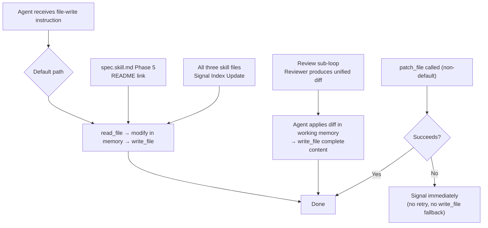

# Deprecate patch_file as the Default Agent Write Path

## Raw Requirement

Deprecate patch_file as the default agent write path. patch_file has failed across four separate signals in the catalogue (template variable handling on spec.skill.md attempts 1 and 2, hunk failure on README.md requiring three attempts, and a ToolImprovement signal for double-brace preprocessing). In every case write_file fallback succeeded. The cumulative cost of failures — extra tool calls, extra signals, repeated spec authoring, and engineering time — exceeds any token savings from partial writes. The tool is currently the recommended write path in agent prompts and skill instructions. Remove patch_file from all agent prompts and skill instructions as the preferred write tool. Promote write_file as the unconditional default for all file modifications. Retain patch_file as an available tool but: (1) it must not be called by default, (2) on first failure it must signal immediately with no retry, (3) no silent write_file fallback. Close the four existing patch_file error signals as resolved by this change. Add a rubric to the run skill that no prompt instructs agents to prefer patch_file.

## Description

Four recorded signals share a common cause: `patch_file` was instructed as the preferred write path in skill files, and its failures were either silently swallowed or triggered costly retry cycles. Every failure was recovered by `write_file`. The cumulative cost — extra LLM turns, extra signals, repeated spec authoring — has exceeded any token savings from partial writes. Even with five successive hardening specs (`moeb.patch-file-normalize-hunk-counts`, `moeb.patch-file-context-relocate`, `moeb.patch-file-crlf-normalize`, `moeb.patch-file-context-match-hardening`, `moeb.patch-file-removed-line-diagnostic`), the failure class persists.

This specification promotes `write_file` as the unconditional default for all file modifications in `spec.skill.md`, `run.skill.md`, and `fix_signal.skill.md`. Specifically:

1. **Phase 5 README linking in `spec.skill.md`**: Replace the `patch_file` diff approach with a read-modify-write cycle using `write_file`. The error-preflight step in the README review sub-loop is updated to reference `write_file` rather than `patch_file`.
2. **Per-Step Review Sub-Loop in `spec.skill.md`**: Where the Reviewer produces a unified diff, the agent applies it in working memory using the in-context file content and writes the complete new content via `write_file`. `patch_file` is not called.
3. **Signal Index Update in all three skill files**: Replace both `patch_file` table-row operations (row update and row append) with a read-modify-write cycle using `write_file`.
4. **`no-preferred-patch-file` rubric criterion** added to `run.skill.md` so future run agents verify that no skill, prompt, or role file they produce instructs agents to prefer `patch_file` for writing new content.
5. **Resolve the four open patch_file error signals** in the catalogue that this change directly addresses.

`patch_file` remains registered in the tool registry. It is not removed. However, no skill or prompt instruction may designate it as the primary or default write path. If called and it fails, the agent must signal immediately and neither retry nor fall back to `write_file` silently.

## Diagram



## Backlinks

### Parents

| Label | Path | Purpose |
|-------|------|---------|
| README | [README.md](../../README.md) | Root harness index |
| README Link Patch Format | [specifications/moeb/moeb.readme-link-patch-format.md](specifications/moeb/moeb.readme-link-patch-format.md) | Spec whose Decision 1 this supersedes: established `patch_file` as the preferred write path for README row appends |
| Patch File Tool | [specifications/moeb/moeb.patch-file-tool.md](specifications/moeb/moeb.patch-file-tool.md) | Defines the `patch_file` tool; this spec does not remove the tool, only demotes it from preferred status |
| Agent Skills | [specifications/moeb/moeb.agent-skills.md](specifications/moeb/moeb.agent-skills.md) | Establishes the skill file system that this spec modifies |

## Steps

### Step 1 — Identify all `patch_file` call instructions in skill files

Run the following grep to record every instructional reference to `patch_file` in the three baseline skill files:

```
grep -n "patch_file" \
  src/moeb/internal/skills/spec.skill.md \
  src/moeb/internal/skills/run.skill.md \
  src/moeb/internal/skills/fix_signal.skill.md
```

Every match that instructs the agent to call `patch_file` as a write tool must be addressed in Steps 2–4 below. Matches that describe error-handling semantics (e.g. "if `patch_file` returns an error") may remain.

### Step 2 — Update `spec.skill.md`: Phase 5 README linking

Read `src/moeb/internal/skills/spec.skill.md` in full. Locate **Phase 5 — Link README**.

Replace the instruction block that calls `patch_file` with the following read-modify-write approach:

```
Read `.moeb/README.md` using `read_file`. Locate the `### <domain>` section in the
Specification index. If the section does not exist, create it in alphabetical order
among the existing `###` domain subsections with a standard table header. Find the last
data row in the domain table and insert the new row immediately after it. Write the
complete updated file content to `.moeb/README.md` using `write_file`.

New row format (four columns, Status value `active`):
| <Title> | <one-sentence description> | [specifications/<domain>/<domain>.<slug>.md](specifications/<domain>/<domain>.<slug>.md) | active |
```

In the same Phase 5, locate the **Per-Step Review Sub-Loop (README patch)**, step 0 (error preflight). Update the preflight condition to reference `write_file` instead of `patch_file`:

Old:
```
0. **Error preflight.** If the `patch_file` call on `.moeb/README.md` immediately
   preceding this sub-loop returned an error result (result string contains "failed",
   "error", or "could not"):
```

New:
```
0. **Error preflight.** If the `write_file` call on `.moeb/README.md` immediately
   preceding this sub-loop returned an error result (result string contains "failed",
   "error", or "could not"):
```

In the same sub-loop, step 4 currently instructs:
```
- Apply the diff: `patch_file` on `.moeb/README.md` with the proposed diff.
```

Replace with:
```
- Re-apply the reviewer's correction: read `.moeb/README.md` using `read_file`,
  incorporate the proposed changes in working memory to produce the complete updated
  content, and write it using `write_file`.
```

### Step 3 — Update `spec.skill.md`: Per-Step Review Sub-Loop for the spec file (Phase 4)

In `src/moeb/internal/skills/spec.skill.md`, locate the **Per-Step Review Sub-Loop (spec file)** inside Phase 4.

Step 5 currently reads:
```
5. If `accepted = true` and `delta_score >= 0.01` and `iteration_count < 2`:
   - Apply the diff: `patch_file` with the proposed diff on the spec file path.
   - If `patch_file` returns an error result, terminate the sub-loop immediately —
     do not return to step 1. Append `{ "delta_score": 0.0, "accepted": false }` to
     iteration history and proceed to step 6. The error is recorded in RunState.tool_errors.
   - Otherwise append `{ "delta_score": <score>, "accepted": true }` to iteration
     history and return to step 1.
```

Replace with:
```
5. If `accepted = true` and `delta_score >= 0.01` and `iteration_count < 2`:
   - Apply the reviewer's improvements: using the spec content already in context,
     incorporate the proposed changes in working memory to produce the complete updated
     content, then write it using `write_file` with the spec file path.
   - If `write_file` returns an error result, terminate the sub-loop immediately —
     do not return to step 1. Append `{ "delta_score": 0.0, "accepted": false }` to
     iteration history and proceed to step 6. The error is recorded in RunState.tool_errors.
   - Otherwise append `{ "delta_score": <score>, "accepted": true }` to iteration
     history and return to step 1.
```

### Step 4 — Update Signal Index Update procedure in all three skill files

The **Canonical Signal Dedup-and-Write Procedure** `### Index Update` sub-section in `spec.skill.md`, `run.skill.md`, and `fix_signal.skill.md` currently instructs `patch_file` for both updating existing rows and appending new rows. In each of the three files, read the skill content in full, locate the `### Index Update` sub-section, and replace the two `patch_file` instructions with `write_file` equivalents:

Replace the block:
```
- For each canonical signal written in the current run, search the existing table for a
  row whose `Signal ID` cell matches the canonical `signal_id`.
  - If found: use `patch_file` to update `Severity`, `Status`, `Occurrences`, and
    `Last Seen` cells on that row only.
  - If not found: use `patch_file` to append a new row:

    `| <signal_id> | <title> | <category> | <severity> | <status> | <occurrence_count> | <last_seen> | [catalogue/<identity_key>.signal.json](catalogue/<identity_key>.signal.json) |`
```

With:
```
- For each canonical signal written in the current run, search the existing table for a
  row whose `Signal ID` cell matches the canonical `signal_id`.
  - If found: replace that row in the in-memory content with updated values for
    `Severity`, `Status`, `Occurrences`, and `Last Seen`, then write the complete
    updated file using `write_file`.
  - If not found: append a new row to the in-memory content, then write the complete
    updated file using `write_file`:

    `| <signal_id> | <title> | <category> | <severity> | <status> | <occurrence_count> | <last_seen> | [catalogue/<identity_key>.signal.json](catalogue/<identity_key>.signal.json) |`
```

Write each updated skill file back using `write_file`. Apply this change to all three files: `spec.skill.md`, `run.skill.md`, and `fix_signal.skill.md`.

### Step 5 — Add `no-preferred-patch-file` rubric criterion to `run.skill.md`

Read `src/moeb/internal/skills/run.skill.md` in full. Locate the structured rubric table in the `## Rubric / ### Structured` section. Add the following row to the table:

```
| `no-preferred-patch-file` | No skill, prompt, or role file written or modified during this run instructs agents to call `patch_file` by preference or by default for writing new file content | Zero violations | grep for instructional `patch_file` references in all skill, prompt, and role files written during this run; verify no match designates `patch_file` as the primary or preferred write tool for new content |
```

Write the updated `run.skill.md` using `write_file`.

### Step 6 — Close the four open patch_file error signals

In `.moeb/signals/catalogue/`, use `list_directory` and `read_file` to find signal files whose `title` or `description` references `patch_file` failures (hunk failures, template variable failures, or double-brace preprocessing errors). These are the four signals that motivated this specification.

For each such signal file with `status` equal to `"open"` or `"reopened"`:

1. Read the signal file using `read_file`.
2. Set `"status"` to `"resolved"`.
3. Update `"last_seen"` to the current ISO 8601 timestamp.
4. Append a new occurrence entry to `"occurrences"`: `{ "timestamp": <current timestamp>, "run_id": <current run_id> }`.
5. Increment `"occurrence_count"` by 1.
6. Write the updated signal file using `write_file`.

After resolving each signal, read `.moeb/signals/index.md` and update the corresponding row's `Status` cell to `resolved`, then write the complete updated index using `write_file`.

### Step 7 — Verify

1. Confirm no skill file instructs `patch_file` as the primary write tool:

   ```
   grep -n "patch_file" \
     src/moeb/internal/skills/spec.skill.md \
     src/moeb/internal/skills/run.skill.md \
     src/moeb/internal/skills/fix_signal.skill.md
   ```

   Review each match. Any match that instructs the agent to call `patch_file` for writing new content (not error-handling prose) is a failure.

2. Confirm each of the three skill files still contains all six mandatory phase headings:
   `"Verify"`, `"End-of-Skill Review"`, `"Metrics Recording"`, `"Commit"`, `"Tag"`, `"Complete"`.

3. Run `cargo build --release` — zero errors.
4. Run `cargo test` — all existing tests pass.

## Decisions

### Decision 1 — Promote `write_file` as the unconditional default; demote `patch_file` to available-but-not-preferred

**Rationale:** Four signals were raised by `patch_file` failures across separate contexts: template-variable content in `spec.skill.md` (two failures), hunk mismatch on `README.md` (three attempts), and a double-brace preprocessing issue. Every failure was recovered by `write_file`. Five successive hardening specs were applied to `patch_file` without eliminating the failure class. The cumulative cost — extra LLM turns, extra signals, repeated spec authoring — has already exceeded any token savings from partial writes.

**Alternatives:**

| Option | Reason Rejected |
|--------|----------------|
| Harden `patch_file` further | Already done across five successive specs; the failure class is structural (AI arithmetic errors in hunk headers, CRLF normalization, context matching) and hardening has not converged |
| Remove `patch_file` from the tool registry | Overly disruptive; the tool remains available for explicit use by agents who have a specific need |
| Apply diffs via a new kernel tool | Adds kernel complexity; `write_file` with in-context diff application achieves the same result without new Rust code |

**Consequences:** Agents write complete file content on every modification, including README row additions and signal index updates. Token cost per write increases proportionally to file size. For the signal index and README (which grow linearly), this is an accepted trade-off given the reliability gain.

---

### Decision 2 — Replace `patch_file` in review sub-loops with in-context application followed by `write_file`

**Rationale:** The Reviewer persona produces a unified diff for compactness. Rather than piping this diff through `patch_file` (which has failed in this exact context — template variable handling on `spec.skill.md`), the agent applies the diff in working memory using the in-context file content — spec files are small and the diff is always reviewed before application — then writes the full updated content via `write_file`. This eliminates the `patch_file` call without changing the Reviewer persona's output format.

**Alternatives:**

| Option | Reason Rejected |
|--------|----------------|
| Change Reviewer to produce complete file content | Increases Reviewer output size significantly for large specs; the diff format communicates intent clearly |
| Keep `patch_file` in review sub-loops as an explicit exception | Creates an inconsistent policy and preserves the exact failure mode that caused two of the four motivating signals |

**Consequences:** The agent must apply a small unified diff in working memory. This is tractable for diffs produced by the inline Reviewer persona, which are always small, targeted, and reviewed before application.

---

### Decision 3 — Supersede `moeb.readme-link-patch-format.md` Decision 1

**Rationale:** Decision 1 of `moeb.readme-link-patch-format.md` established `patch_file` as the preferred tool for README row appends on the grounds of O(1) vs O(index-size) token cost. Given the three-attempt hunk failure on `README.md` itself (one of the four motivating signals), the reliability cost of `patch_file` for this operation outweighs the token savings. `write_file` with the full README content is the correct trade-off.

**Alternatives:**

| Option | Reason Rejected |
|--------|----------------|
| Retain `patch_file` for README link only | The README hunk failure is one of the four motivating signals; this option would not address it |

**Consequences:** The README is rewritten in full on every spec commit. At current index size (~65 rows, ~10 KB), this is negligible.

---

### Decision 4 — Add verification rubric rather than a Rust-level guard

**Rationale:** A rubric criterion verified by the run agent is consistent with the harness policy that workflow logic lives in skill markdown, not Rust (`kernel-thin-and-parity`). A Rust-level guard that rejected `patch_file` calls would require kernel changes and would violate the thin-kernel principle.

**Alternatives:**

| Option | Reason Rejected |
|--------|----------------|
| Rust-level call interception / removal of `patch_file` from the registry | Violates `kernel-thin-and-parity`; `patch_file` is a legitimate tool that must remain available |

**Consequences:** The `no-preferred-patch-file` rubric criterion provides a verification gate at run time without coupling the kernel to policy.

## Rubric

### Structured

| Name | Description | Threshold | Pass Condition |
|------|-------------|-----------|----------------|
| `tool-errors` | No ToolHandler errors were recorded during this command invocation. Covers all tool calls on both CLI and MCP paths via `RealToolExecutor::execute`. Applies to every moeb command. | Zero tool errors | Kernel-authoritative: injected by `verify_rubrics` from `RunState.tool_errors`. Do not supply a verdict — any agent-supplied entry is overridden. |
| `rubric-qualification` | No Pass verdicts with acknowledged failures were issued during this command invocation. An agent that observes a failure but passes a criterion must populate `acknowledged_failures` in the verdict object. Applies to every moeb command. | Zero qualified Pass verdicts | Kernel-authoritative: injected by `verify_rubrics` by scanning `acknowledged_failures` on incoming Pass verdicts. Do not supply a verdict — any agent-supplied entry is overridden. |
| `skill-mandatory-phases` | The skill loaded for this run contains all mandatory phase headings. The agent checks its own prompt context (the loaded skill content is already present) for the exact strings: "Verify", "End-of-Skill Review", "Metrics Recording", "Commit", "Tag", "Complete". No file read is required. | All six mandatory headings present | Agent scans skill content in its loaded context; fails if any mandatory heading string is absent |
| `no-drift` | The specification does not violate any decision recorded in a linked parent specification | Zero contradictions | Manual review of every decision in every parent spec listed in Backlinks |
| `spec-schema-compliance` | All required frontmatter fields and body sections are present and correctly ordered | 100% of required fields and sections | Validation in `domain/spec.rs` exits 0 during `moeb spec` |
| `ai-first-org` | The specification's Steps prescribe file layouts, naming, and helper placement that satisfy the four AI-first organisation principles: one concern per file, context locality, grep-discoverable names, no cross-cutting helpers. | All four principles followed | Manual review: no step produces a file that mixes concerns, no name is generic across the codebase, all helpers are co-located with their callers or promoted to a precisely named module |
| `kernel-thin-and-parity` | No domain-specific or workflow-specific coordination logic may be placed in kernel Rust code when it can live in skill markdown or role files. Every tool registered in the CLI tool registry must also be registered in the MCP stdio server tool list. | Zero violations | Spec review: no proposed step places review/coordination logic in Rust; Run review: grep confirms no skill-specific logic in kernel tools; tool lists in tools/mod.rs and the MCP server match exactly |
| `moeb-tool-origin` | All tool calls made during this invocation must originate from moeb's own tool registry. If an external tool (not in the moeb registry) was used because no moeb equivalent exists, the agent must write a MissingMoebTool signal immediately after each such call. The criterion always fails when any external tool is used, whether or not a signal was written. | Zero external tool calls | Agent reviews the conversation for calls to non-moeb tools (e.g. Bash, Edit, Write, Read, Glob, Grep, WebFetch, WebSearch in Claude Code MCP mode). Supplies Pass if none were made. If external tools were used with MissingMoebTool signals, supplies Fail with `acknowledged_failures` listing each signal title. If external tools were used without signals, supplies Fail with the unlogged tool names in the note. |
| `binary-builds` | `cargo build --release` exits 0 after all skill file modifications | Zero errors | CI build exits 0 |
| `all-tests-pass` | `cargo test` exits 0 after all skill file modifications | Zero failures | `cargo test` exits 0 |
| `no-preferred-patch-file` | No skill, prompt, or role file modified in this run instructs agents to call `patch_file` by preference or by default for writing new file content | Zero violations | grep for instructional `patch_file` references in all modified skill files; verify no match designates `patch_file` as the primary or preferred write tool for new content |
| `thin-kernel` | New Rust code in tools/, commands/, or domain/ must be either a primitive operation wrapper or a thin dispatcher; no workflow logic | Zero workflow-logic functions in new Rust | Spec review: no Step proposes placing sequencing or conditional workflow logic in Rust when a skill-file change would suffice; Run review: every new function wraps a single OS/VCS/HTTP call |
| `new-skill-mandatory-phases` | Any `*.skill.md` file modified during this run retains all mandatory phase heading strings: "Verify", "End-of-Skill Review", "Metrics Recording", "Commit", "Tag", "Complete" | All six strings present in every modified skill file | Agent verifies each modified skill file contains all six mandatory heading strings after modification |
| `mcp-cli-behavioural-parity` | For any operation exposed through both the CLI agent loop and the MCP server, the observable outcome must be identical: same file mutations, same tool result string format, same rendered prompt template | Zero divergent outcomes | Run review: skill modifications apply equally to both CLI and MCP execution paths; no MCP-only or CLI-only code paths introduced |

### Qualitative

- **Signal closure:** All four `patch_file` error signals referenced in the requirement have `status: resolved` after the implementing run completes.
- **Skill consistency:** The Signal Index Update procedure is identical across `spec.skill.md`, `run.skill.md`, and `fix_signal.skill.md` — no skill retains a `patch_file` instruction for index writes.
- **Review sub-loop coherence:** The Reviewer persona continues to produce unified diffs for clarity; only the application mechanism changes from `patch_file` to in-context application followed by `write_file`.
- **No regression:** Cargo build and tests remain green; no existing capability is degraded.
