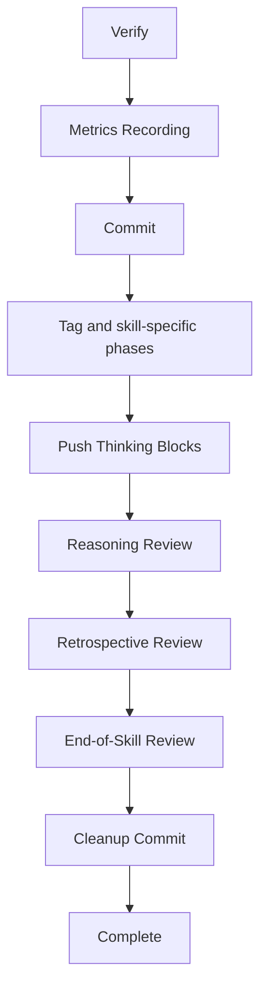

# End-of-Skill Review Phases Reorder: Review Triad After Commit, Tag, and Archive

## Raw Requirement

Title: End-of-skill review phases run before post-Verify artifacts exist; cleanup commit and complete event must be last

Problem: In all three canonical skill files, Phases 7 (QA Architect), 7a (Push Thinking Blocks), and 7b (Reasoning Review) execute before Metrics Recording, Commit, Tag, Signal Tag, and Archive. This means: (1) the QA Architect cannot assess archive failures, emitted signals, or the run file — the artifacts that matter most for quality assessment; (2) thinking blocks from late phases are never captured by the reasoning reviewer; (3) signals emitted by the review are written to loose files that are never committed before the Complete event fires. The Complete event is also written before the working directory is clean. The correct ordering is: Verify → Metrics → Commit → Tag → Signal Tag → Archive → Push Thinking Blocks → Reasoning Review → QA Architect Review → emit review signals → cleanup amend commit → Complete event.

Proposed resolution: Reorder all three canonical skill files so the review triad (Push Thinking Blocks → Reasoning Review → QA Architect) runs after Metrics Recording, Commit, Tag, Signal Tag, and Archive. Follow the review triad with a Cleanup Commit phase that stages all uncommitted .moeb/ harness files (signals, metrics, run file, new signal catalogue entries) and amends them into the preceding run commit. The Complete event must be the final action — after the cleanup commit — as it signals to external watchers that the working directory is stable and committed. The Complete event currently writes a file but must remain the terminal action even if the delivery mechanism changes.

## Description

All three binary-bundled protected baseline skill files — `run.skill.md`, `spec.skill.md`, and `fix_signal.skill.md` — are edited to move the end-of-skill review triad (Push Thinking Blocks → Reasoning Review → Retrospective Review → End-of-Skill Review / QA Architect) to run after Metrics Recording, Commit, and Tag (and, where present, Signal Tag and Archive). A new Cleanup Commit phase is inserted immediately after the review triad in all three skill files, using `git_commit` with `kind: "run"` to commit all `.moeb/` files written during the review phases (signals, metrics, run file) before the Complete event fires.

This reordering gives the QA Architect full visibility into the committed run file and signal catalogue, ensures thinking blocks from Metrics and Commit phases are captured before the Reasoning Reviewer evaluates them, and guarantees the working directory is clean when the Complete event is written.



## Backlinks

### Parents

| Label | Path | Purpose |
|-------|------|---------|
| Harness README | [.moeb/README.md](.moeb/README.md) | Parent harness index; spec is registered here |
| Agent Skills | [specifications/moeb/moeb.agent-skills.md](specifications/moeb/moeb.agent-skills.md) | Establishes skill file system and protected baseline skills |
| Composable Review Wrapper | [specifications/moeb/moeb.composable-review-wrapper.md](specifications/moeb/moeb.composable-review-wrapper.md) | Introduced End-of-Skill QA Architect review and StepMetrics |
| MCP Thinking Block Capture | [specifications/moeb/moeb.mcp-thinking-block-capture.md](specifications/moeb/moeb.mcp-thinking-block-capture.md) | Introduced Push Thinking Blocks phase in all canonical skill files |
| Reasoning Reviewer | [specifications/moeb/moeb.reasoning-reviewer.md](specifications/moeb/moeb.reasoning-reviewer.md) | Introduced Reasoning Review phase in run.skill.md |
| QA Architect Mandatory Checks | [specifications/moeb/moeb.qa-architect-mandatory-checks-cover-correctness-on.md](specifications/moeb/moeb.qa-architect-mandatory-checks-cover-correctness-on.md) | Introduced Retrospective Review phase in all canonical skill files |
| Run Skill Git Commit | [specifications/moeb/moeb.run-git-commit.md](specifications/moeb/moeb.run-git-commit.md) | Introduced Commit phase in run.skill.md |
| Spec Skill Exit Cleanliness | [specifications/moeb/moeb.spec-skill-must-not-exit-with-uncommitted-changes.md](specifications/moeb/moeb.spec-skill-must-not-exit-with-uncommitted-changes.md) | Introduced Exit Cleanliness Check in spec.skill.md |
| Signal Status Lifecycle | [specifications/moeb/moeb.signal-status-lifecycle-tracking.md](specifications/moeb/moeb.signal-status-lifecycle-tracking.md) | Introduced Signal Status Update phase across canonical skill files |
| Run Skill Retrospective and Signal Schema | [specifications/moeb/moeb.run-skill-retrospective-and-signal-schema.md](specifications/moeb/moeb.run-skill-retrospective-and-signal-schema.md) | Introduced Archive phase in run.skill.md |
| Fix Signal Skill Hardening | [specifications/moeb/moeb.fix-signal-skill-hardening.md](specifications/moeb/moeb.fix-signal-skill-hardening.md) | Introduced Signal Tag phase in fix_signal.skill.md |

## Steps

All three target files are binary-bundled protected baseline skills located at:
- `src/moeb/internal/skills/run.skill.md`
- `src/moeb/internal/skills/spec.skill.md`
- `src/moeb/internal/skills/fix_signal.skill.md`

Read each file in full before modifying it. Use `patch_file` for targeted phase-block relocations where the `old_string` context is unique; fall back to `write_file` with the complete updated content on any `patch_file` failure.

### Step 1 — Modify `src/moeb/internal/skills/run.skill.md`

1. Read `src/moeb/internal/skills/run.skill.md`.
2. Identify the phase blocks for: **End-of-Skill Review** (QA Architect), **Push Thinking Blocks**, **Reasoning Review**, and **Retrospective Review**. These currently appear before Metrics Recording.
3. Remove those four phase blocks from their current positions.
4. Locate the position immediately after all of the following phases (whichever are present in the file): Metrics Recording, Commit, Version and Tag (SemVer bump and candidate tag), Signal Status Update, Signal Tag, Archive, and Partial Resolution Check. Insert the four removed blocks at that position in this order:
   1. Push Thinking Blocks
   2. Reasoning Review
   3. Retrospective Review
   4. End-of-Skill Review (QA Architect)
5. After the End-of-Skill Review block, insert the new **Cleanup Commit** phase (canonical text in Step 4).
6. Confirm that the **Complete** phase heading is the last `## ` heading in the file; move it if necessary.

### Step 2 — Modify `src/moeb/internal/skills/spec.skill.md`

1. Read `src/moeb/internal/skills/spec.skill.md`.
2. Identify the phase blocks for: **End-of-Skill Review** (QA Architect), **Push Thinking Blocks**, **Reasoning Review**, and **Retrospective Review**. These currently appear before Metrics Recording (Phase 8 in the current file).
3. Remove those four phase blocks from their current positions.
4. Locate the position immediately after all of the following phases: Metrics Recording, Commit, Exit Cleanliness Check, Tag, and Branch. Insert the four removed blocks at that position in this order:
   1. Push Thinking Blocks
   2. Reasoning Review
   3. Retrospective Review
   4. End-of-Skill Review (QA Architect)
5. After the End-of-Skill Review block, insert the new **Cleanup Commit** phase.
6. Confirm that the **Complete** phase heading is the last `## ` heading in the file; move it after Cleanup Commit if necessary.

### Step 3 — Modify `src/moeb/internal/skills/fix_signal.skill.md`

1. Read `src/moeb/internal/skills/fix_signal.skill.md`.
2. Identify the phase blocks for: **End-of-Skill Review** (QA Architect), **Push Thinking Blocks**, **Reasoning Review**, and **Retrospective Review**.
3. Remove those four phase blocks from their current positions.
4. Locate the position immediately after all of the following phases (whichever are present): Metrics Recording, Commit, Tag, Signal Tag, and Archive. Insert the four removed blocks at that position in this order:
   1. Push Thinking Blocks
   2. Reasoning Review
   3. Retrospective Review
   4. End-of-Skill Review (QA Architect)
5. After the End-of-Skill Review block, insert the new **Cleanup Commit** phase.
6. Confirm that the **Complete** phase heading is the last `## ` heading in the file.

### Step 4 — Cleanup Commit Phase Text

Insert the following phase block verbatim after the End-of-Skill Review block in each of the three skill files. Use the skill file's existing heading style (e.g. `## Phase N — Cleanup Commit` with a sequential number, or a lettered sub-phase if the surrounding headings use that convention):

```
## Cleanup Commit

Call `git_commit` with `kind: "run"`. This stages all uncommitted working-tree changes — signals, metrics, run file, and signal catalogue entries written during the review phases — and commits them, keeping the branch clean before the Complete event fires.

If the working tree is already clean (nothing to commit), `git_commit` with `kind: "run"` is a no-op; proceed to Complete without error.
```

### Step 5 — Verify Mandatory Phase Heading Strings Are Retained

After all edits, confirm that each modified skill file still contains all six mandatory phase heading strings: `Verify`, `End-of-Skill Review`, `Metrics Recording`, `Commit`, `Tag`, `Complete`. These strings are checked by the `skill-mandatory-phases` rubric criterion. A phase renaming during the move that removes any of these strings is a defect that must be corrected before the run completes.

## Decisions

### Decision 1 — New commit rather than amend for Cleanup Commit

The proposed resolution specified "amend" the preceding run commit. This spec prescribes a new `git_commit` with `kind: "run"` instead. Rationale: the moeb tool registry has no `git_commit_amend` tool; adding one solely for this use would require new Rust kernel code without adding a distinct capability. A new cleanup commit achieves the same goal: all review-phase artifacts are committed before the Complete event fires. Rejected: using `run_command` with `git commit --amend --no-edit` — this uses an external tool for a workflow-critical operation, violates moeb-tool-origin, and introduces platform-specific shell syntax that differs between Windows (`cmd.exe`) and Unix (`sh`).

### Decision 2 — Phase content is unchanged during the move

Moved phase blocks retain their exact existing instruction text. Only their position within the file changes. Phase numbers in headings and `enter_phase` call arguments may be updated to maintain sequential numbering, but no instruction text may be altered during the relocation. This minimises the diff and eliminates the risk of introducing unintended behavioural changes.

### Decision 3 — Exit Cleanliness Check retained in spec.skill.md at its current position

spec.skill.md's Exit Cleanliness Check (immediately after Commit) handles unexpected dirty state from non-review sources at Commit time and is retained in place. This is a distinct concern from the Cleanup Commit (which handles dirty state from review phases). The two-stage arrangement — Commit → Exit Cleanliness Check → [Tag, Branch] → Review Triad → Cleanup Commit — is correct: each stage cleans its own scope.

### Decision 4 — All three canonical skill files modified in one spec

`all-skill-files-parity` requires that a spec modifying any one canonical skill file must address all three. This spec addresses all three in a single authoring action with the identical structural change, satisfying the criterion without cross-spec dependency.

### Decision 5 — Retrospective Review precedes QA Architect within the review triad

The sub-ordering within the triad (Push Thinking Blocks → Reasoning Review → Retrospective Review → End-of-Skill Review / QA Architect) is preserved from the existing phase ordering. Running QA Architect last maximises its observational scope: it sees both the Reasoning Review findings and the Retrospective Review signals before issuing its own verdict.

### Decision 6 — Cleanup Commit text is identical across all three skill files

The Cleanup Commit phase text prescribes a single unconditional `git_commit kind:run` call with identical wording in all three files. Divergence between files would create maintenance burden without adding capability. A note covers the no-op case when the working tree is already clean.

## Rubric

### Structured

| Name | Description | Threshold | Pass Condition |
|------|-------------|-----------|----------------|
| `tool-errors` | No ToolHandler errors were recorded during this command invocation. Covers all tool calls on both CLI and MCP paths via `RealToolExecutor::execute`. Applies to every moeb command. | Zero tool errors | Kernel-authoritative: injected by `verify_rubrics` from `RunState.tool_errors`. Do not supply a verdict — any agent-supplied entry is overridden. |
| `rubric-qualification` | No Pass verdicts with acknowledged failures were issued during this command invocation. An agent that observes a failure but passes a criterion must populate `acknowledged_failures` in the verdict object. Applies to every moeb command. | Zero qualified Pass verdicts | Kernel-authoritative: injected by `verify_rubrics` by scanning `acknowledged_failures` on incoming Pass verdicts. Do not supply a verdict — any agent-supplied entry is overridden. |
| `skill-mandatory-phases` | The skill loaded for this run contains all mandatory phase headings. The agent checks its own prompt context (the loaded skill content is already present) for the exact strings: "Verify", "End-of-Skill Review", "Metrics Recording", "Commit", "Tag", "Complete". No file read is required. | All six mandatory headings present | Agent scans skill content in its loaded context; fails if any mandatory heading string is absent |
| `moeb-tool-origin` | All tool calls made during this invocation must originate from moeb's own tool registry. If an external tool (not in the moeb registry) was used because no moeb equivalent exists, the agent must write a MissingMoebTool signal immediately after each such call. The criterion always fails when any external tool is used, whether or not a signal was written. | Zero external tool calls | Agent reviews the conversation for calls to non-moeb tools (e.g. Bash, Edit, Write, Read, Glob, Grep, WebFetch, WebSearch in Claude Code MCP mode). Supplies Pass if none were made. If external tools were used with MissingMoebTool signals, supplies Fail with `acknowledged_failures` listing each signal title. If external tools were used without signals, supplies Fail with the unlogged tool names in the note. |
| `no-drift` | The specification does not violate any decision recorded in a linked parent specification | Zero contradictions | Manual review of every decision in every parent spec listed in Backlinks |
| `spec-schema-compliance` | All required frontmatter fields and body sections are present and correctly ordered | 100% of required fields and sections | Validation in `domain/spec.rs` exits 0 during `moeb spec` |
| `ai-first-org` | The specification's Steps prescribe file layouts, naming, and helper placement that satisfy the four AI-first organisation principles: one concern per file, context locality, grep-discoverable names, no cross-cutting helpers. | All four principles followed | Manual review: no step produces a file that mixes concerns, no name is generic across the codebase, all helpers are co-located with their callers or promoted to a precisely named module |
| `branch-clean-at-exit` | After Phase 9 (Commit), the working tree contains no uncommitted changes; any dirty state detected in Phase 9a has been resolved by retry commit (Case A) or by signal emission and cleanup commit (Case B) | Zero uncommitted changes at spec skill exit | Agent verifies that `git_status` returned empty output after Phase 9, or that a retry (Case A) or cleanup commit (Case B) was issued and the branch is clean |
| `kernel-thin-and-parity` | No domain-specific or workflow-specific coordination logic may be placed in kernel Rust code when it can live in skill markdown or role files. Every tool registered in the CLI tool registry must also be registered in the MCP stdio server tool list. | Zero violations | Spec review: no proposed step places review/coordination logic in Rust; Run review: grep confirms no skill-specific logic in kernel tools; tool lists in tools/mod.rs and the MCP server match exactly |
| `all-skill-files-parity` | Whenever a spec adds, removes, or modifies a workflow phase in any one of the three canonical skill files (run.skill.md, spec.skill.md, fix_signal.skill.md), the spec must contain an explicit Step for each of the other two files — either applying the equivalent change or documenting with rationale why that file is intentionally excluded. | Zero unaddressed canonical skill files when any canonical skill file phase is modified | Run agent reviews the steps of the spec under implementation. If no canonical skill file phase is added, removed, or modified, mark `na`. If one or more canonical skill file phases are modified, verify that the spec contains a step for each of the other two canonical skill files (addressing the equivalent change or stating an exclusion rationale). Fail if any of the other two files has neither a qualifying step nor a documented exclusion rationale. |
| `review-triad-after-commit-tag` | In each of the three modified skill files, the End-of-Skill Review (QA Architect) phase heading appears after the Metrics Recording, Commit, and Tag phase headings. | End-of-Skill Review follows Metrics Recording, Commit, and Tag in all three files | Run agent greps each modified file for line numbers of "Metrics Recording", "Commit", "Tag", and "End-of-Skill Review" headings and confirms End-of-Skill Review line number is greater than all three. Fail if any production-phase heading appears after End-of-Skill Review. |
| `cleanup-commit-before-complete` | In each of the three modified skill files, a Cleanup Commit phase heading appears after End-of-Skill Review and before Complete. | Cleanup Commit exists and is positioned between End-of-Skill Review and Complete in all three files | Run agent greps each modified file for "Cleanup Commit" and "Complete" headings and confirms Cleanup Commit line number falls between End-of-Skill Review and Complete. Fail if Cleanup Commit is absent or mispositioned in any file. |
| `complete-event-last` | In each of the three modified skill files, the Complete phase is the last `## `-level heading in the file. | Complete is the terminal phase heading | Run agent greps each modified file for all `## ` headings and verifies no `## ` heading appears after Complete. Fail if any heading follows Complete in any file. |

### Qualitative

- **Minimal content change**: The only changes in each modified file should be (a) relocation of the four review-triad phase blocks, (b) insertion of the Cleanup Commit block, and (c) optional renumbering of phase headings and `enter_phase` `phase_id` arguments. No instruction text within a moved phase may be altered during relocation.
- **skill-mandatory-phases strings preserved**: After editing, each modified file must still contain all six mandatory strings: "Verify", "End-of-Skill Review", "Metrics Recording", "Commit", "Tag", "Complete".
- **Cleanup Commit text consistent**: The Cleanup Commit phase block must be functionally identical across all three skill files.
