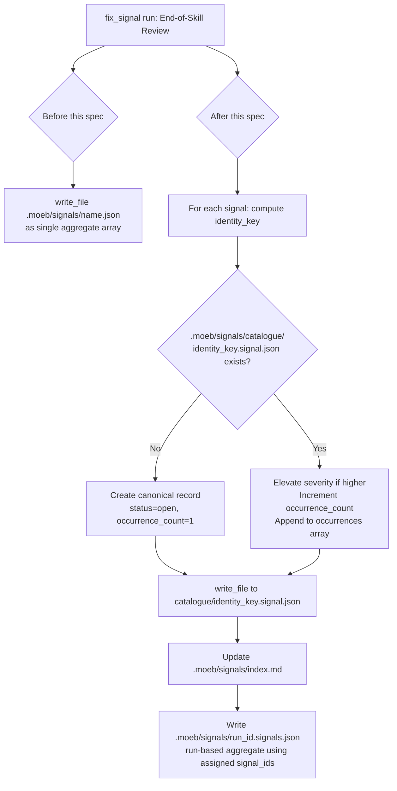

# Fix Signal Skill: Signal Catalogue Alignment

## Raw Requirement

fix_signal signals are written to .moeb/signals/ directly as a file instead of individual files linked to catalogue

Description: The fix_signal skill appears to have lost consistency with run and spec, it should write individual .signal.json files to .moeb/signals/catalogue/ and not write a single .signals.json file to .moeb/signals/. This causes issues with signal discovery and management, as the current implementation does not align with the expected structure for signals in the project.

Proposed resolution: Examine the fix_signal implementation and bring it in line with the skill template and project conventions. Specifically here, ensure that each signal is either written as a new individual file in .moeb/signals/catalogue/ or that the existing .signals.json file is updated correctly for occurrences etc. Refactor signal file 864339f1-48a9-4607-8fd2-16823813f3db.signals.json into individual signal files or update existing signals if duplicates.

## Description

The `fix_signal` skill's End-of-Skill Review phase writes all signals from a run into a single aggregate file directly under `.moeb/signals/`, bypassing the Canonical Signal Dedup-and-Write Procedure that governs `run.skill.md` and `spec.skill.md`. This divergence was introduced when `moeb.skill-baseline-sync.md` merged the canonical procedure into the `run` and `spec` baseline skills but did not include `fix_signal.skill.md`.

This specification prescribes two corrective actions:

1. **Skill correction** — Replace the non-canonical signal-writing section in `src/moeb/internal/skills/fix_signal.skill.md` with the Canonical Signal Dedup-and-Write Procedure and Index Update sub-procedure, textually consistent with the same section already present in `run.skill.md`, and add the `no-signal-reoccurrence` criterion to the skill's rubric table.

2. **Data migration** — Process the non-canonical signals file `.moeb/signals/skill-normalisation.json` (produced by run `864339f1-48a9-4607-8fd2-16823813f3db`) through the Dedup-and-Write Procedure to produce correctly-keyed individual records under `.moeb/signals/catalogue/` and update `.moeb/signals/index.md`. After migration, remove the source file.

No Rust code changes are required.



## Backlinks

### Parents

| Label | Path | Purpose |
|-------|------|---------|
| Harness README | README.md | Policy and specification index governing this change |
| Signal Deduplication, Occurrence Tracking, and Lifecycle Reopening | specifications/moeb/moeb.signal-deduplication-and-lifecycle.md | Defines the Canonical Signal Dedup-and-Write Procedure that fix_signal must adopt |
| Skill Baseline Sync: Merge Canonical Signal Dedup into Binary-Bundled Skills | specifications/moeb/moeb.skill-baseline-sync.md | Prior sync that merged the canonical procedure into run and spec skills but omitted fix_signal |
| Fix Signal Skill: Post-Trial Hardening | specifications/moeb/moeb.fix-signal-skill-hardening.md | Defines the current phase structure of fix_signal.skill.md that must be preserved |

## Steps

### Step 1 — Read the current fix_signal.skill.md

Using `read_file`, read `src/moeb/internal/skills/fix_signal.skill.md`. Identify the phase responsible for writing signal output (End-of-Skill Review or equivalent signal-writing block) and the exact line(s) containing the non-canonical `write_file` call that writes a single aggregate signals file to `.moeb/signals/` root.

### Step 2 — Read the canonical procedure from run.skill.md

Using `read_file`, read `src/moeb/internal/skills/run.skill.md`. Locate the **Canonical Signal Dedup-and-Write Procedure** section (beginning with the comment `# Identity key:`) and the **Index Update** sub-procedure that follows it, including the run-based signals file write at the end. Buffer both sections verbatim — they are the authoritative source for what must be inserted into fix_signal.skill.md.

### Step 3 — Replace the non-canonical signal-writing section in fix_signal.skill.md

Using `patch_file`, apply a unified diff to `src/moeb/internal/skills/fix_signal.skill.md` that:

- Removes the existing non-canonical single-file `write_file` call(s) identified in Step 1.
- Inserts the Canonical Signal Dedup-and-Write Procedure and Index Update sub-procedure buffered in Step 2, placed at the same position within the End-of-Skill Review phase.
- Retains the run-based signals file write (`.moeb/signals/{{run_id}}.signals.json`) after the per-signal catalogue writes, consistent with the pattern in `run.skill.md`.
- Preserves all surrounding phase structure (phase headings, commit, tag, and branch steps, review sub-loops) unchanged.

### Step 4 — Add no-signal-reoccurrence criterion to fix_signal.skill.md rubric

Inspect the `## Rubric / ### Structured` table in `src/moeb/internal/skills/fix_signal.skill.md`. If the `no-signal-reoccurrence` row is absent, add it via `patch_file` with a minimal diff that appends the following row to the Structured table:

```
| `no-signal-reoccurrence` | No Signal Reoccurrence | No canonical signal in `.moeb/signals/catalogue/` has `status: reopened` due to this run | Zero reopened signals introduced by this run | Agent confirms no `"status": "reopened"` in any catalogue entry written or updated during this run. |
```

### Step 5 — Migrate .moeb/signals/skill-normalisation.json

Using `read_file`, read `.moeb/signals/skill-normalisation.json`. For each signal object in the array:

1. Compute `identity_key`: lowercase the concatenation of `category` and `title`, replace every run of characters matching `[^a-z0-9]+` with `-`, strip leading and trailing `-`, truncate to 80 characters.
2. Attempt `read_file` on `.moeb/signals/catalogue/<identity_key>.signal.json`.
3. **If not found:** create a new canonical record using all fields from the source signal plus:
   - `status: "open"`
   - `occurrence_count: 1`
   - `first_seen`: source signal's `timestamp` field, or current ISO 8601 time if absent
   - `last_seen`: same as `first_seen`
   - `occurrences: [{"timestamp": <first_seen>, "run_id": "<source run_id or migration>"}]`
   Write the record to `.moeb/signals/catalogue/<identity_key>.signal.json` using `write_file`.
4. **If found:** parse existing record `E`. If the source signal's severity rank is higher than `E.severity`, update `E.severity`. Increment `E.occurrence_count`. Update `E.last_seen` to current ISO 8601 time. Append `{"timestamp": <last_seen>, "run_id": "<source run_id>"}` to `E.occurrences`. Write the updated record back via `write_file`.

After processing all signals, update `.moeb/signals/index.md` per the Index Update sub-procedure: for each canonical signal, search the existing table for a row matching `signal_id`; if found update it via `patch_file`, if not found append a new row.

### Step 6 — Remove .moeb/signals/skill-normalisation.json

After successful migration of all signals in Step 5, remove `.moeb/signals/skill-normalisation.json`. If the moeb tool registry does not expose a `delete_file` tool, write an empty JSON array `[]` to the file as a migration tombstone using `write_file`, and buffer a MissingMoebTool signal:

```json
{
  "category": "NewCapability",
  "severity": "Major",
  "title": "Missing moeb tool: delete_file",
  "description": "Used write_file to zero-out .moeb/signals/skill-normalisation.json because no delete_file tool exists.",
  "proposed_resolution": "Add a delete_file tool to the moeb registry to allow agents to remove stale or migrated files.",
  "gating_condition": null
}
```

### Step 7 — Verify post-migration state

Using `list_directory` and `read_file`, confirm:
- Each signal from `.moeb/signals/skill-normalisation.json` has a corresponding `.signal.json` file in `.moeb/signals/catalogue/` with valid canonical format.
- `.moeb/signals/index.md` has a row for each migrated signal with the correct `signal_id`, `title`, `category`, `severity`, `status`, `occurrence_count`, and file link.
- `.moeb/signals/skill-normalisation.json` has been removed or zeroed out.
- `src/moeb/internal/skills/fix_signal.skill.md` contains the Canonical Signal Dedup-and-Write Procedure section and the `no-signal-reoccurrence` rubric row.

## Decisions

### Decision 1 — Targeted patch over full rewrite of fix_signal.skill.md

The skill's phase structure (branch creation, event emission, commit, tag, review sub-loops) was established by `moeb.fix-signal-event-emission.md` and `moeb.fix-signal-skill-hardening.md` and is correct; only the signal-writing section diverges. A minimal patch isolates the change and preserves all prior-spec behaviour.

**Rejected alternative:** Full rewrite of `fix_signal.skill.md`. Rejected because it risks silently removing hardening, phase ordering, and review sub-loops introduced by prior specifications.

**Consequence:** The implementing agent reads `fix_signal.skill.md` and applies a diff scoped to the signal-writing section only.

### Decision 2 — Copy canonical procedure verbatim from run.skill.md

The canonical procedure's authoritative source is embedded in `run.skill.md`. Directing the implementing agent to read `run.skill.md` and copy from there ensures byte-for-byte consistency without introducing a second source of truth in this spec.

**Rejected alternative:** Embed the full canonical procedure text in the spec steps. Rejected because it duplicates the procedure, creating a divergence risk if either the spec or the skill is updated independently.

**Consequence:** The implementing agent must read `run.skill.md` as part of the implementation, adding one tool call.

### Decision 3 — Data migration is in-scope

`.moeb/signals/skill-normalisation.json` contains real signal records that must enter the dedup lifecycle to prevent silent duplication on the next fix_signal run. Without migration, the signal would reappear as a duplicate on the next run, violating `no-signal-reoccurrence`.

**Rejected alternative:** Delete the file without migrating. Rejected because signal data loss eliminates the historical occurrence record needed for `no-signal-reoccurrence` semantics.

**Consequence:** The implementing agent migrates signals into `catalogue/`, then removes or tombstones the source file.

### Decision 4 — No Rust changes required

Signal writing is agent-driven via skill markdown instructions and moeb file tools. The Canonical Dedup-and-Write Procedure operates entirely through `write_file`, `read_file`, and `patch_file`; no kernel code change is needed.

**Rejected alternative:** Add a kernel-side migration utility. Rejected because workflow logic in compiled Rust violates the `thin-kernel` principle established by `moeb.kernel-thin-and-mcp-parity-rubrics.md`.

**Consequence:** All changes are confined to `src/moeb/internal/skills/fix_signal.skill.md` and `.moeb/signals/` harness data files.

## Rubric

### Structured

| Name | Description | Threshold | Pass Condition |
|------|-------------|-----------|----------------|
| `tool-errors` | No ToolHandler errors were recorded during this command invocation. Covers all tool calls on both CLI and MCP paths via `RealToolExecutor::execute`. Applies to every moeb command. | Zero tool errors | Kernel-authoritative: injected by `verify_rubrics` from `RunState.tool_errors`. Do not supply a verdict — any agent-supplied entry is overridden. |
| `rubric-qualification` | No Pass verdicts with acknowledged failures were issued during this command invocation. An agent that observes a failure but passes a criterion must populate `acknowledged_failures` in the verdict object. Applies to every moeb command. | Zero qualified Pass verdicts | Kernel-authoritative: injected by `verify_rubrics` by scanning `acknowledged_failures` on incoming Pass verdicts. Do not supply a verdict — any agent-supplied entry is overridden. |
| `skill-mandatory-phases` | The skill loaded for this run contains all mandatory phase headings. The agent checks its own prompt context (the loaded skill content is already present) for the exact strings: "Verify", "End-of-Skill Review", "Metrics Recording", "Commit", "Tag", "Complete". No file read is required. | All six mandatory headings present | Agent scans skill content in its loaded context; fails if any mandatory heading string is absent. |
| `no-drift` | The specification does not violate any decision recorded in a linked parent specification. | Zero contradictions | Manual review of every decision in every parent spec listed in Backlinks. |
| `spec-schema-compliance` | All required frontmatter fields and body sections are present and correctly ordered. | 100% of required fields and sections | Validation in `domain/spec.rs` exits 0 during `moeb spec`. |
| `ai-first-org` | The specification's Steps prescribe file layouts, naming, and helper placement that satisfy the four AI-first organisation principles: one concern per file, context locality, grep-discoverable names, no cross-cutting helpers. | All four principles followed | Manual review: no step produces a file that mixes concerns, no name is generic across the codebase, all helpers are co-located with their callers or promoted to a precisely named module. |
| `kernel-thin-and-parity` | No domain-specific or workflow-specific coordination logic may be placed in kernel Rust code when it can live in skill markdown or role files. Every tool registered in the CLI tool registry must also be registered in the MCP stdio server tool list. | Zero violations | Spec review: no proposed step places review/coordination logic in Rust; Run review: grep confirms no skill-specific logic in kernel tools; tool lists in tools/mod.rs and the MCP server match exactly. |
| `moeb-tool-origin` | All tool calls made during this invocation must originate from moeb's own tool registry. If an external tool (not in the moeb registry) was used because no moeb equivalent exists, the agent must write a MissingMoebTool signal immediately after each such call. The criterion always fails when any external tool is used, whether or not a signal was written. | Zero external tool calls | Agent reviews the conversation for calls to non-moeb tools (e.g. Bash, Edit, Write, Read, Glob, Grep, WebFetch, WebSearch in Claude Code MCP mode). Supplies Pass if none were made. If external tools were used with MissingMoebTool signals, supplies Fail with `acknowledged_failures` listing each signal title. If external tools were used without signals, supplies Fail with the unlogged tool names in the note. |
| `no-signal-reoccurrence` | No canonical signal in `.moeb/signals/catalogue/` has `status: reopened` due to this run | Zero reopened signals introduced by this run | Agent confirms no `"status": "reopened"` in any catalogue entry written or updated during this run. |
| `new-skill-mandatory-phases` | Any `*.skill.md` file written during this run contains all mandatory phase heading strings: "Verify", "End-of-Skill Review", "Metrics Recording", "Commit", "Tag", "Complete". | All six strings present in the written skill file. | Agent confirms the patched `fix_signal.skill.md` contains all six mandatory heading strings after the patch is applied. |
### Qualitative

- The Canonical Signal Dedup-and-Write Procedure section inserted into `fix_signal.skill.md` must be textually identical to the corresponding section in `run.skill.md`, differing only in the `{{run_id}}` template variable injection point.
- The data migration must preserve all fields from `.moeb/signals/skill-normalisation.json`; no signal data may be silently dropped or altered beyond the canonical schema additions (`status`, `occurrence_count`, `first_seen`, `last_seen`, `occurrences`).
- After migration, `.moeb/signals/index.md` must contain exactly one row per canonical signal file in `catalogue/`, with no duplicate `signal_id` entries.
