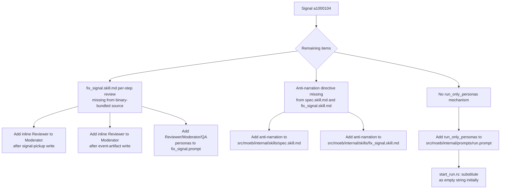

# fix_signal.skill.md Per-Step Inline Review, Anti-Narration Directive, and Run-Only Persona Gate

## Raw Requirement

Title: spec.skill.md and fix_signal.skill.md are missing the per-step write-review-moderate sub-loop; no mechanism exists to gate future run-only personas

Problem: The per-step write->review->moderate sub-loop (Writer produces output, Reviewer critiques, Moderator adjudicates) exists only in run.skill.md. spec.skill.md and fix_signal.skill.md both produce file writes — spec files, signal JSON, git commits — without per-step review coverage. All three commands have QA Architect end-of-skill review, but the intermediate per-write quality gate is absent from two of them. Separately, planned future personas (behavioural reviewer, structural reviewer) will be required only in moeb run. No mechanism currently exists to inject personas conditionally by command; all personas are substituted unconditionally via template variables in all prompt templates regardless of which command is executing. Additionally, run.skill.md opens with an explicit anti-narration directive ('IMPORTANT — DO NOT narrate, plan, or summarise before calling tools. Your FIRST action must be a tool call.') that is absent from spec.skill.md and fix_signal.skill.md, causing the spec agent to narrate context ingestion (e.g. 'I've now read the entire spec prompt file. I have all the context I need. Let me summarize what I found:') before its first tool call.

Proposed resolution: 1. Add per-step write->review->moderate sub-loop phases to spec.skill.md and fix_signal.skill.md, mirroring the pattern already established in run.skill.md. Apply the sub-loop to each file write operation in both skills (spec file writes, signal JSON writes, git commits). 2. Introduce a command-scoped persona injection mechanism in the prompt rendering path: a {{run_only_personas}} template variable populated only when rendering run.prompt, substituted as an empty string in spec.prompt and fix_signal.prompt. Future run-only personas (behavioural reviewer, structural reviewer, and any others designated run-only) are added to this block rather than to the shared persona template variables. 3. Audit existing persona template variables across all three prompt templates; move any that are exclusively used in the run skill's per-step sub-loop into the new {{run_only_personas}} block. 4. Add the anti-narration directive from run.skill.md's opening lines to spec.skill.md and fix_signal.skill.md so all three skills suppress pre-tool preamble.

## Description

This specification addresses the remaining unresolved items from signal a1000104. The per-step review for `spec.skill.md` (Phases 4 and 5) was already added by `moeb.inline-persona-review.md` (active) and is confirmed present in the loaded spec.skill.md workflow content. The per-step review for `fix_signal.skill.md` was specified in `moeb.fix-signal-skill-hardening.md` but was written to the project-level `.moeb/skills/fix_signal.skill.md` path. Because `moeb.protected-baseline-skills.md` subsequently blocked project-level overrides for protected skills, and `moeb.skill-baseline-sync.md` migrated only the signal-dedup procedure (not the review loops) when deleting those project-level files, the per-step review is absent from the binary-bundled source at `src/moeb/internal/skills/fix_signal.skill.md`. Three changes remain unresolved:

1. **fix_signal.skill.md per-step review**: The binary-bundled `src/moeb/internal/skills/fix_signal.skill.md` needs the inline Reviewer to Moderator sub-loop added after each file write (signal pickup status update and event artifact write), matching the template used in `run.skill.md` and `spec.skill.md`. The Reviewer, Moderator, and QA Architect persona content must also be injected into `fix_signal.prompt` via template variables, following the pattern established by `moeb.inline-persona-review.md` for `run.prompt` and `spec.prompt`.

2. **Anti-narration directive**: `spec.skill.md` and `fix_signal.skill.md` lack the opening directive present in `run.skill.md`: "IMPORTANT — DO NOT narrate, plan, or summarise before calling tools. Your FIRST action must be a tool call." This directive prevents pre-tool preamble narration. Both files need the directive inserted immediately after the skill frontmatter closing delimiter.

3. **`{{run_only_personas}}` gate**: `run.prompt` needs a `{{run_only_personas}}` template variable appended after the existing shared persona sections. The rendering path in `start_run.rs` substitutes it as an empty string initially. Future specs for behavioural reviewer and structural reviewer populate this block. `spec.prompt` and `fix_signal.prompt` do not include this variable, keeping run-only personas absent from those commands.



## Backlinks

### Parents

| Label | Path | Purpose |
|-------|------|---------|
| Harness README | README.md | Harness index |
| Inline Persona Review | specifications/moeb/moeb.inline-persona-review.md | Established inline Reviewer to Moderator template for run.skill.md and spec.skill.md; added persona template variables to run.prompt and spec.prompt |
| Fix Signal Skill Hardening | specifications/moeb/moeb.fix-signal-skill-hardening.md | Specified per-step review for fix_signal.skill.md; implementation targeted project-level path that was later made inoperative by the protected-baseline-skills guard |
| Protected Baseline Skills | specifications/moeb/moeb.protected-baseline-skills.md | Blocks project-level .moeb/skills/ overrides for spec, run, fix_signal; all changes to these skills must target src/moeb/internal/skills/ |
| Skill Baseline Sync | specifications/moeb/moeb.skill-baseline-sync.md | Merged signal-dedup from deleted project-level overrides into binary-bundled skills; per-step review loops were not included |
| MCP Thinking Block Capture | specifications/moeb/moeb.mcp-thinking-block-capture.md | Added push_thinking_blocks phases to all three canonical skill files |
| Reasoning Review Inline Persona | specifications/moeb/moeb.reasoning-review-inline-persona.md | Added Reasoning Reviewer persona to all three prompt templates and skill files |

## Steps

### Step 1 — Read fix_signal.skill.md to establish baseline

Call `read_file` on `src/moeb/internal/skills/fix_signal.skill.md` to load the current binary-bundled content. This establishes the exact text for subsequent `patch_file` calls in Steps 2, 3, and 7. Note the positions of:
- The signal pickup write step (where signal status is set to `in_progress`)
- The event artifact write step (where `.moeb/events/<signal_id>.event.json` is written)
- The opening lines (for anti-narration insertion in Step 7)

### Step 2 — Add Per-Step Review Sub-Loop after signal pickup write in fix_signal.skill.md

File: `src/moeb/internal/skills/fix_signal.skill.md`

Locate the write step that updates the selected signal's status to `in_progress` in the signal catalogue. Immediately after that write step and before the next major step (isolation branch creation via `create_branch`), insert the following sub-loop via `patch_file`. If `patch_file` fails, use `write_file` with the complete updated content.

```
### Per-Step Review Sub-Loop (signal pickup)

0. **Error preflight.** If the preceding write returned an error result (result string contains "failed", "error", or "could not"):
   - Record StepMetric with `step_id: "signal-pickup"`, `iteration_count = 0`, `acceptance_rate = 1.0`, `delta_scores = []`.
   - Do NOT call `complete_review` for this path.
   - Proceed to the next step. The error is recorded in RunState.tool_errors.
   Skip steps 1–8 below for this invocation.

1. **Inline Reviewer.** Without calling any tool, adopt the **Reviewer Persona** pre-loaded in your context. Evaluate the signal pickup catalogue file: the selected signal's `status` field must be set to `in_progress` and no other fields must have been altered. Produce a unified diff if the update is incorrect, or an empty string if correct. Hold the result in working memory.

2. If the diff is empty or whitespace: terminate sub-loop. Record StepMetric with `step_id: "signal-pickup"`, `iteration_count = 0`, `acceptance_rate = 1.0`, `delta_scores = []`.

3. **Inline Moderator.** Without calling any tool, adopt the **Moderator Persona** pre-loaded in your context. Evaluate the proposed diff against the catalogue file content, rubric criteria, and iteration history. Produce JSON: `{ "accepted": bool, "delta_score": float, "rationale": string }`. Hold in working memory.

4. Parse Moderator JSON. If `[PARSE_WARNING]` prefix is present, treat as `{ "accepted": false, "delta_score": 0.0, "rationale": "Moderator parse failure" }`.

5. If `accepted = true` and `delta_score >= 0.01` and `iteration_count < 2`:
   - Apply the diff via `patch_file` on the signal catalogue file path. If `patch_file` returns an error, terminate immediately; append `{ "delta_score": 0.0, "accepted": false }` to iteration history and proceed to step 6.
   - Otherwise append `{ "delta_score": <score>, "accepted": true }` to iteration history and return to step 1.

6. Otherwise: terminate sub-loop.

7. Record StepMetric for `step_id: "signal-pickup"`.

8. Call `complete_review` with the signal catalogue file path.
```

### Step 3 — Add Per-Step Review Sub-Loop after event artifact write in fix_signal.skill.md

File: `src/moeb/internal/skills/fix_signal.skill.md`

Locate the write step that emits the event artifact to `.moeb/events/<signal_id>.event.json`. Immediately after that write step and before the next major step (Verify / `verify_rubrics`), insert the following sub-loop via `patch_file`. If `patch_file` fails, use `write_file` with the complete updated content.

```
### Per-Step Review Sub-Loop (event artifact)

0. **Error preflight.** If the preceding write returned an error result (result string contains "failed", "error", or "could not"):
   - Record StepMetric with `step_id: "event-artifact"`, `iteration_count = 0`, `acceptance_rate = 1.0`, `delta_scores = []`.
   - Do NOT call `complete_review` for this path.
   - Proceed to the next step. The error is recorded in RunState.tool_errors.
   Skip steps 1–8 below for this invocation.

1. **Inline Reviewer.** Without calling any tool, adopt the **Reviewer Persona** pre-loaded in your context. Evaluate the event artifact JSON: it must contain all required fields (`signal_id`, `fix_branch`, `timestamp`, `event_type`) with correct values matching the selected signal and isolation branch. Produce a unified diff if any required field is missing or incorrect, or an empty string if the artifact is correct. Hold the result in working memory.

2. If the diff is empty or whitespace: terminate sub-loop. Record StepMetric with `step_id: "event-artifact"`, `iteration_count = 0`, `acceptance_rate = 1.0`, `delta_scores = []`.

3. **Inline Moderator.** Without calling any tool, adopt the **Moderator Persona** pre-loaded in your context. Evaluate the proposed diff against the event artifact content, rubric criteria, and iteration history. Produce JSON: `{ "accepted": bool, "delta_score": float, "rationale": string }`. Hold in working memory.

4. Parse Moderator JSON. If `[PARSE_WARNING]` prefix is present, treat as `{ "accepted": false, "delta_score": 0.0, "rationale": "Moderator parse failure" }`.

5. If `accepted = true` and `delta_score >= 0.01` and `iteration_count < 2`:
   - Apply the diff via `patch_file` on `.moeb/events/<signal_id>.event.json`. If `patch_file` returns an error, terminate immediately; append `{ "delta_score": 0.0, "accepted": false }` to iteration history and proceed to step 6.
   - Otherwise append `{ "delta_score": <score>, "accepted": true }` to iteration history and return to step 1.

6. Otherwise: terminate sub-loop.

7. Record StepMetric for `step_id: "event-artifact"`.

8. Call `complete_review` with `.moeb/events/<signal_id>.event.json`.
```

### Step 4 — Add Reviewer, Moderator, and QA Architect persona sections to fix_signal.prompt

Locate the fix_signal prompt template by calling `grep_files` with pattern `reasoning_reviewer_role_content` under `src/` to identify the prompt file that already receives the Reasoning Reviewer persona injection (added by `moeb.reasoning-review-inline-persona.md`). This file is the fix_signal prompt template.

Read the identified file. Append the following three persona sections immediately after the existing `=== Reasoning Reviewer Persona ===` section (or at the end of the file if Reasoning Reviewer is the last section), using `patch_file`. If `patch_file` fails, use `write_file` with the complete updated content.

```
=== Reviewer Persona ===
{{reviewer_role_content}}

=== Moderator Persona ===
{{moderator_role_content}}

=== QA Architect Persona ===
{{qa_architect_role_content}}
```

### Step 5 — Add role loading and substitution to fix_signal rendering path

Locate the Rust source file that renders the fix_signal prompt by calling `grep_files` with pattern `reasoning_reviewer_role_content` under `src/` to find the file in the rendering path that already substitutes the Reasoning Reviewer variable.

In that file, following the pattern from `start_spec.rs` which loads and substitutes `reviewer_role_content`, `moderator_role_content`, and `qa_architect_role_content`, add the same three role loads:

```rust
let reviewer_role = crate::skills::load_role(&moeb_dir, "reviewer");
let moderator_role = crate::skills::load_role(&moeb_dir, "moderator");
let qa_architect_role = crate::skills::load_role(&moeb_dir, "qa-architect");
```

In the prompt substitution chain, add after the existing substitutions:

```rust
.replace("{{reviewer_role_content}}", &reviewer_role)
.replace("{{moderator_role_content}}", &moderator_role)
.replace("{{qa_architect_role_content}}", &qa_architect_role)
```

Use `patch_file` for the targeted insertion. If `patch_file` fails, use `write_file` with the complete updated file content.

### Step 6 — Add anti-narration directive to spec.skill.md

Read `src/moeb/internal/skills/run.skill.md` and extract the exact wording of the anti-narration directive at the beginning of the file (the "IMPORTANT — DO NOT narrate..." string). This wording must be used verbatim in this step and Step 7.

Read `src/moeb/internal/skills/spec.skill.md`. Locate the closing `---` delimiter of the skill frontmatter block. The line immediately following the closing `---` is the first content line (beginning with "The harness README" or similar). Insert a blank line and the anti-narration directive between the closing `---` and the first content line:

```
---

IMPORTANT — DO NOT narrate, plan, or summarise before calling tools. Your FIRST action must be a tool call.

The harness README, ...
```

Use `patch_file` with `old_string` set to the exact closing `---` delimiter line plus the following newline and first content characters. If `patch_file` fails, use `write_file` with the complete updated content.

### Step 7 — Add anti-narration directive to fix_signal.skill.md

Using the file content read in Step 1 and the anti-narration wording confirmed in Step 6, apply the identical change to `src/moeb/internal/skills/fix_signal.skill.md`. If the file has a `---\nreview: ...\n---` frontmatter block, insert the directive immediately after the closing `---`. If no such frontmatter block exists, insert the directive as the very first line of the file.

The wording must be byte-for-byte identical to Step 6. Use `patch_file`. If `patch_file` fails, use `write_file` with the complete updated content.

### Step 8 — Document run.skill.md exclusion (all-skill-files-parity)

No changes are made to `run.skill.md`. This step documents the exclusion rationale to satisfy the `all-skill-files-parity` rubric criterion:

- `run.skill.md` already opens with the anti-narration directive (as stated in the signal problem description and confirmed by the run agent reading the file).
- `run.skill.md` already contains the Per-Step Reviewer to Moderator sub-loop in its write steps (added by `moeb.inline-persona-review.md`).

Both changes addressed in Steps 2–7 are intentionally excluded from `run.skill.md` because the target state is already present. No modification of `run.skill.md` is required.

### Step 9 — Add {{run_only_personas}} placeholder to run.prompt

Locate `run.prompt` by calling `grep_files` with pattern `reviewer_role_content` under `src/` to find the prompt file that receives reviewer persona content (added by `moeb.inline-persona-review.md` Step 3).

Read the identified `run.prompt`. Find the last existing persona section (the `=== Reasoning Reviewer Persona ===` section or whichever persona section appears last). After the last persona section, append the `{{run_only_personas}}` placeholder before any terminal content:

```
{{run_only_personas}}
```

This placeholder must appear after all shared persona sections so that future run-only persona content is appended rather than interleaved. Use `patch_file` to insert the placeholder after the last persona section's closing content. If `patch_file` fails, use `write_file` with the complete updated content.

`spec.prompt` and `fix_signal.prompt` must NOT contain `{{run_only_personas}}`. The run agent must verify via `grep_files` that neither file contains this string after completing Step 9.

### Step 10 — Add {{run_only_personas}} substitution to start_run.rs

Locate `start_run.rs` (or the equivalent file that renders run.prompt) by calling `grep_files` with pattern `reviewer_role_content` under `src/` to find the rendering source file updated by `moeb.inline-persona-review.md` Step 1.

In the prompt substitution chain, add the following replacement after the last existing `.replace()` call:

```rust
.replace("{{run_only_personas}}", "")
```

This substitutes the placeholder with an empty string for all current runs. The value remains `""` until a future spec introduces a concrete run-only persona. Use `patch_file` for the targeted insertion. If `patch_file` fails, use `write_file` with the complete updated file content.

### Step 11 — Verify build and tests

Run `cargo build --release` via `run_command` from the repository root. If the build fails, diagnose the error and apply a corrective fix before proceeding. Run `cargo test` via `run_command`. If any tests fail, diagnose and fix before proceeding to rubric verification.

## Decisions

### Decision 1 — Scope limited to fix_signal per-step review, anti-narration, and run_only_personas; spec.skill.md per-step review already complete

**Rationale**: `moeb.inline-persona-review.md` (active) confirmed that spec.skill.md Phases 4 and 5 already use the inline Reviewer to Moderator sub-loop. The loaded spec.skill.md workflow content confirms this — Phases 4 and 5 contain the sub-loop template (error preflight, Inline Reviewer, Inline Moderator, patch decision, StepMetric, `complete_review`). Re-specifying this change would produce duplicate instructions and risk contradicting active decisions.

**Rejected**: Author a superset spec restating all four signal items regardless of existing coverage. Rejected: violates minimal-scope policy and risks contradicting `moeb.inline-persona-review.md` Decision 1.

**Consequences**: The run agent implementing this spec must verify that spec.skill.md Phase 4/5 sub-loops are present and not re-insert them.

### Decision 2 — fix_signal per-step review targets src/moeb/internal/skills/; project-level implementation was lost in skill-baseline-sync

**Rationale**: `moeb.fix-signal-skill-hardening.md` (active) wrote per-step review loops to `.moeb/skills/fix_signal.skill.md` (project-level). `moeb.protected-baseline-skills.md` (active, authored later) introduced a kernel guard blocking project-level overrides for the three protected skills (spec, run, fix_signal). `moeb.skill-baseline-sync.md` (active) subsequently merged only the canonical signal-dedup procedure from deleted project-level overrides into the binary-bundled source; the per-step review loops from fix-signal-skill-hardening were not included in that merge. As a result, the binary-bundled `src/moeb/internal/skills/fix_signal.skill.md` lacks per-step review. This spec targets the correct authoritative source path.

**Rejected**: Treat moeb.fix-signal-skill-hardening.md's original steps as already implemented. Rejected: the implementation evidence demonstrates the change was never applied to the binary-bundled source file.

**Consequences**: The per-step review sub-loops for signal pickup and event artifact write are added to `src/moeb/internal/skills/fix_signal.skill.md` for the first time in the binary-bundled source. The decisions from `moeb.fix-signal-skill-hardening.md` are honoured — they are being applied to the correct file path.

### Decision 3 — Reviewer/Moderator/QA Architect personas must be injected into fix_signal.prompt

**Rationale**: `moeb.inline-persona-review.md` added persona template variables to `start_run.rs` and `start_spec.rs`, and persona sections to `run.prompt` and `spec.prompt`. No equivalent step existed for `fix_signal.prompt` because `fix_signal.skill.md` did not yet have per-step review at that time. Now that per-step review is being added (Steps 2–3), the Reviewer and Moderator personas must be available in context for fix_signal agents to perform inline reasoning. The QA Architect persona is required for the mandatory End-of-Skill Review phase.

**Rejected**: Rely on the Reasoning Reviewer persona injection as a proxy for all review personas. Rejected: the Reasoning Reviewer persona has a different purpose and output format (JSON array of signals) from the Reviewer (unified diff) and Moderator (JSON verdict) personas.

**Consequences**: `fix_signal.prompt` will have four persona sections after this change: Reasoning Reviewer (existing), Reviewer, Moderator, and QA Architect (added by this spec). The Rust rendering path for fix_signal must be updated in the same run as the prompt template.

### Decision 4 — Anti-narration directive wording is verbatim from run.skill.md; run agent must grep to confirm exact string

**Rationale**: The directive must be byte-for-byte identical across all three skill files to ensure consistent interpretation. Future changes to the directive wording must update all three files simultaneously. The run agent is required to read `run.skill.md` to extract the current exact string before applying it, so that any future drift in phrasing is caught and propagated correctly.

**Rejected**: Hardcode the directive wording in this spec's Steps without requiring the run agent to verify against run.skill.md. Rejected: if run.skill.md's directive is ever changed, hardcoded wording in this spec would cause future re-runs to introduce divergence.

**Consequences**: All three canonical skill files open with the same anti-narration directive. Step 6 of the implementation requires a read of `run.skill.md` before patching spec.skill.md.

### Decision 5 — {{run_only_personas}} substitutes as empty string initially; variable is absent from spec.prompt and fix_signal.prompt

**Rationale**: Introducing the variable with empty-string substitution is a safe, non-breaking change that wires the mechanism without altering any current behaviour. Keeping `{{run_only_personas}}` absent from spec.prompt and fix_signal.prompt means those commands can never accidentally receive run-only persona content, even if the substitution value is later changed in start_run.rs. Explicit absence provides stronger isolation than empty substitution.

**Rejected**: Add `{{run_only_personas}}` to all three prompt templates and substitute empty in spec and fix_signal. Rejected: explicit absence is a cleaner contract — future developers cannot accidentally leak run-only persona content into spec or fix_signal prompts by changing start_run.rs.

**Consequences**: `run.prompt` contains `{{run_only_personas}}` that expands to nothing until a future spec populates it. `spec.prompt` and `fix_signal.prompt` are unchanged by Steps 9–10.

### Decision 6 — Existing personas remain in shared template variables; none migrate to {{run_only_personas}}

**Rationale**: Audit of the signal's proposed resolution item 3 confirms that all four existing personas are used in all three canonical skills. Reviewer and Moderator are used in per-step review sub-loops. QA Architect is used in the mandatory End-of-Skill Review phase. Reasoning Reviewer is used in Phase 7b of all three skills. Migrating any of them to `{{run_only_personas}}` would break spec.skill.md and fix_signal.skill.md persona availability.

**Rejected**: Migrate QA Architect or Reasoning Reviewer to `{{run_only_personas}}`. Rejected: both are actively referenced in spec and fix_signal skill phases; removing them from those prompts would break those skills.

**Consequences**: The four shared persona variables (`{{reviewer_role_content}}`, `{{moderator_role_content}}`, `{{qa_architect_role_content}}`, `{{reasoning_reviewer_role_content}}`) remain in all three rendering paths. `{{run_only_personas}}` is reserved for future net-new run-only content only.

## Rubric

### Structured

| Name | Description | Threshold | Pass Condition |
|------|-------------|-----------|----------------|
| `tool-errors` | No ToolHandler errors were recorded during this command invocation. Covers all tool calls on both CLI and MCP paths via `RealToolExecutor::execute`. Applies to every moeb command. | Zero tool errors | Kernel-authoritative: injected by `verify_rubrics` from `RunState.tool_errors`. Do not supply a verdict — any agent-supplied entry is overridden. |
| `rubric-qualification` | No Pass verdicts with acknowledged failures were issued during this command invocation. An agent that observes a failure but passes a criterion must populate `acknowledged_failures` in the verdict object. Applies to every moeb command. | Zero qualified Pass verdicts | Kernel-authoritative: injected by `verify_rubrics` by scanning `acknowledged_failures` on incoming Pass verdicts. Do not supply a verdict — any agent-supplied entry is overridden. |
| `skill-mandatory-phases` | The skill loaded for this run contains all mandatory phase headings. The agent checks its own prompt context (the loaded skill content is already present) for the exact strings: "Verify", "End-of-Skill Review", "Metrics Recording", "Commit", "Tag", "Complete". No file read is required. | All six mandatory headings present | Agent scans skill content in its loaded context; fails if any mandatory heading string is absent |
| `moeb-tool-origin` | All tool calls made during this invocation must originate from moeb's own tool registry. If an external tool (not in the moeb registry) was used because no moeb equivalent exists, the agent must write a MissingMoebTool signal immediately after each such call. The criterion always fails when any external tool is used, whether or not a signal was written. | Zero external tool calls | Agent reviews the conversation for calls to non-moeb tools (e.g. Bash, Edit, Write, Read, Glob, Grep, WebFetch, WebSearch in Claude Code MCP mode). Supplies Pass if none were made. If external tools were used with MissingMoebTool signals, supplies Fail with `acknowledged_failures` listing each signal title. If external tools were used without signals, supplies Fail with the unlogged tool names in the note. |
| `no-drift` | The specification does not violate any decision recorded in a linked parent specification | Zero contradictions | Manual review of every decision in every parent spec listed in Backlinks |
| `spec-schema-compliance` | All required frontmatter fields and body sections are present and correctly ordered | 100% of required fields and sections | Validation in `domain/spec.rs` exits 0 during `moeb spec` |
| `ai-first-org` | The specification's Steps prescribe file layouts, naming, and helper placement that satisfy the four AI-first organisation principles: one concern per file, context locality, grep-discoverable names, no cross-cutting helpers. | All four principles followed | Manual review: no step produces a file that mixes concerns, no name is generic across the codebase, all helpers are co-located with their callers or promoted to a precisely named module |
| `branch-clean-at-exit` | After Phase 9 (Commit), the working tree contains no uncommitted changes; any dirty state detected in Phase 9a has been resolved by retry commit (Case A) or by signal emission and cleanup commit (Case B) | Zero uncommitted changes at spec skill exit | Agent verifies that `git_status` returned empty output after Phase 9, or that a retry (Case A) or cleanup commit (Case B) was issued and the branch is clean |
| `kernel-thin-and-parity` | No domain-specific or workflow-specific coordination logic may be placed in kernel Rust code when it can live in skill markdown or role files. Every tool registered in the CLI tool registry must also be registered in the MCP stdio server tool list. | Zero violations | Spec review: no proposed step places review/coordination logic in Rust; Run review: grep confirms no skill-specific logic in kernel tools; tool lists in tools/mod.rs and the MCP server match exactly |
| `all-skill-files-parity` | Whenever a spec adds, removes, or modifies a workflow phase in any one of the three canonical skill files (run.skill.md, spec.skill.md, fix_signal.skill.md), the spec must contain an explicit Step for each of the other two files — either applying the equivalent change or documenting with rationale why that file is intentionally excluded. | Zero unaddressed canonical skill files when any canonical skill file phase is modified | Run agent reviews the steps of the spec under implementation. If no canonical skill file phase is added, removed, or modified, mark `na`. If one or more canonical skill file phases are modified, verify that the spec contains a step for each of the other two canonical skill files (addressing the equivalent change or stating an exclusion rationale). Fail if any of the other two files has neither a qualifying step nor a documented exclusion rationale. |
| `thin-kernel` | New Rust code in tools/, commands/, or domain/ must be either (a) a primitive operation wrapper (filesystem, git, or HTTP with no domain logic) or (b) a thin dispatcher that calls into skills, tools, or agents and returns the result unchanged. Workflow logic — sequencing, conditionals, review loops, retry strategy, branching decisions — must live in skill markdown or role files, not in compiled Rust. | Zero workflow-logic functions in new Rust | Run review: every new line in fix_signal rendering path and start_run.rs is either a `load_role()` call or a `.replace()` chain addition with a literal string value; no domain-specific branching is introduced |
| `binary-builds` | `cargo build --release` completes without error after all file modifications | Zero build errors | Run agent executes `run_command` with `cargo build --release`; exit code 0 |
| `all-tests-pass` | `cargo test` completes without failure after all file modifications | Zero test failures | Run agent executes `run_command` with `cargo test`; exit code 0 |
| `review-sub-loop-completeness` | The updated `fix_signal.skill.md` contains the Per-Step Review Sub-Loop (error preflight, Inline Reviewer, Inline Moderator, patch decision, StepMetric, `complete_review`) for both the signal-pickup write and the event-artifact write | Both sub-loops present and structurally complete | Run agent reads the updated `fix_signal.skill.md` and confirms both sub-loops contain all eight steps; `grep_files` for `complete_review` in fix_signal.skill.md returns at least two matches in the skill body |
| `anti-narration-consistency` | The anti-narration directive string in spec.skill.md and fix_signal.skill.md is byte-for-byte identical to the existing directive in run.skill.md | Zero wording divergences | Run agent greps run.skill.md for the anti-narration directive and confirms the exact same string appears at the opening of spec.skill.md and fix_signal.skill.md after implementation |
| `persona-gate-absent-from-spec-and-fix-signal` | `spec.prompt` and `fix_signal.prompt` do not contain the string `run_only_personas` | Zero occurrences in both files | Run agent calls `grep_files` with pattern `run_only_personas` across `src/`; no matches in spec.prompt or fix_signal.prompt template files |

### Qualitative

- The per-step review sub-loop prose inserted into `fix_signal.skill.md` must use the same headings ("Inline Reviewer", "Inline Moderator") and the same eight-step structure (steps 0–8) as the sub-loops in `spec.skill.md` Phase 4 and `run.skill.md`. Structural divergence from this template must be flagged as a signal.
- The `{{run_only_personas}}` placeholder in `run.prompt` must appear after all existing persona sections so that future run-only persona content is appended to the context rather than interleaved between shared personas.
- After implementation, the opening of `spec.skill.md` and `fix_signal.skill.md` must follow the pattern: frontmatter block, blank line, anti-narration directive, blank line, first content line. The directive must not appear before the frontmatter closing delimiter.
