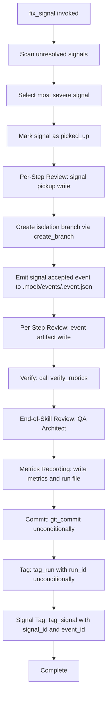

# Fix Signal Skill: Post-Trial Hardening

## Raw Requirement

First trial run of fix_signal highlighted some areas that need fixed
1. The uses of tools should be reviewed per the step as is done in moeb_run
2. A broader issue, on failure through QA we should always commit with a tag for the run, moeb_run skill has unique tagging phase for a valid candidate, on a failed QA it will not commit a candidate tag, but it will still have committed the mandatory run_id tag as should all skills
3. We need a unique tag phase for the branch produced here that indicates which which signal_id was chosen by fix_signal, it should be annotated with the event_id

## Description

This specification hardens `fix_signal.skill.md` after its first trial run by making three targeted additions. First, it inserts Per-Step Reviewer→Moderator review sub-loops after each file-write step (signal pickup update and event artifact), using the identical sub-loop template established in `run.skill.md`. Second, it adds an unconditional Commit phase and a mandatory `run_id` Tag phase so that every fix_signal invocation — including those that fail QA — produces a durable git record, matching the convention that all skills always emit the run_id tag regardless of QA outcome. Third, it introduces a Signal Tag phase that creates an annotated git tag `signal/<signal_id>` on the isolation branch with the annotation body containing the `event_id` from the emitted event artifact, making the signal selection decision traceable in git history. A new primitive kernel tool `tag_signal` is specified to support the Signal Tag phase and must be registered in both the CLI tool registry and the MCP stdio server tool list.



## Backlinks

### Parents

| Label | Path | Purpose |
|-------|------|---------|
| Harness README | README.md | Specification index and harness policies |
| Signal Fix Command | specifications/moeb/moeb.signal-fix-command.md | Original fix_signal skill and MCP tool definition |
| Fix Signal Event Emission | specifications/moeb/moeb.fix-signal-event-emission.md | Replaced start_spec/start_run orchestration with event artifact emission |
| Run SemVer Bump and Candidate Tag | specifications/moeb/moeb.run-semver-bump-and-candidate-tag.md | Establishes the pattern: candidate tag is conditional on QA; run_id tag is unconditional |
| AI-First Artifact Refinement | specifications/moeb/moeb.ai-first-artifact-refinement.md | Introduced tag_run tool and the six mandatory skill phase headings |
| Inline Persona Review | specifications/moeb/moeb.inline-persona-review.md | Defines the Per-Step Reviewer→Moderator sub-loop template used in run.skill.md |

## Steps

### Step 1 — Read fix_signal.skill.md

Call `read_file` with path `.moeb/skills/fix_signal.skill.md` to load the current skill content before making any changes. This is the only file read required; all other referenced content is already in context.

### Step 2 — Add Per-Step Review Sub-Loop after signal pickup write

Locate the step in `fix_signal.skill.md` that writes the signal pickup update (marking the selected signal's status as `in_progress` or `picked_up` in the signals file). Immediately after that write call, insert the following Per-Step Review Sub-Loop using `patch_file` on `.moeb/skills/fix_signal.skill.md`:

```
### Per-Step Review Sub-Loop (signal pickup)

0. **Error preflight.** If the preceding write returned an error result (result string contains "failed", "error", or "could not"):
   - Record StepMetric with `step_id: "signal-pickup"`, `iteration_count = 0`, `acceptance_rate = 1.0`, `delta_scores = []`.
   - Do NOT call `complete_review` for this path.
   - Proceed to the next step. The error is recorded in RunState.tool_errors.
   Skip steps 1–8 below for this invocation.

1. **Inline Reviewer.** Without calling any tool, adopt the Reviewer Persona. Evaluate the signal pickup artifact: the signal status field must be set to the in-progress marker and the signal_id must match the selected signal. Produce a unified diff if improvements are needed, or an empty string if correct.

2. If the diff is empty or whitespace: terminate sub-loop. Record StepMetric with `step_id: "signal-pickup"`, `iteration_count = 0`, `acceptance_rate = 1.0`, `delta_scores = []`.

3. **Inline Moderator.** Without calling any tool, adopt the Moderator Persona. Evaluate the proposed diff. Produce JSON: `{ "accepted": bool, "delta_score": float, "rationale": string }`.

4. Parse Moderator JSON. If `[PARSE_WARNING]` prefix is present, treat as `{ "accepted": false, "delta_score": 0.0, "rationale": "Moderator parse failure" }`.

5. If `accepted = true` and `delta_score >= 0.01` and `iteration_count < 2`:
   - Apply the diff: `patch_file` on the signal file path.
   - On error: terminate; append `{ "delta_score": 0.0, "accepted": false }` to iteration history; proceed to step 6.
   - Otherwise: append `{ "delta_score": <score>, "accepted": true }` to iteration history and return to step 1.

6. Otherwise: terminate sub-loop.

7. Record StepMetric for `step_id: "signal-pickup"`.

8. Call `complete_review` with the signal file path.
```

### Step 3 — Add Per-Step Review Sub-Loop after event artifact write

Locate the step in `fix_signal.skill.md` that writes the event artifact to `.moeb/events/<signal_id>.event.json`. Immediately after that write call, insert the following Per-Step Review Sub-Loop using `patch_file` on `.moeb/skills/fix_signal.skill.md`:

```
### Per-Step Review Sub-Loop (event artifact)

0. **Error preflight.** If the preceding write returned an error result (result string contains "failed", "error", or "could not"):
   - Record StepMetric with `step_id: "event-artifact"`, `iteration_count = 0`, `acceptance_rate = 1.0`, `delta_scores = []`.
   - Do NOT call `complete_review` for this path.
   - Proceed to the next step. The error is recorded in RunState.tool_errors.
   Skip steps 1–8 below for this invocation.

1. **Inline Reviewer.** Without calling any tool, adopt the Reviewer Persona. Evaluate the event artifact: the JSON must contain `signal_id`, `event_id`, `timestamp`, and `status: "accepted"` fields with correct values. Produce a unified diff if any required field is missing or malformed, or an empty string if correct.

2. If the diff is empty or whitespace: terminate sub-loop. Record StepMetric with `step_id: "event-artifact"`, `iteration_count = 0`, `acceptance_rate = 1.0`, `delta_scores = []`.

3. **Inline Moderator.** Without calling any tool, adopt the Moderator Persona. Evaluate the proposed diff. Produce JSON: `{ "accepted": bool, "delta_score": float, "rationale": string }`.

4. Parse Moderator JSON. If `[PARSE_WARNING]` prefix is present, treat as `{ "accepted": false, "delta_score": 0.0, "rationale": "Moderator parse failure" }`.

5. If `accepted = true` and `delta_score >= 0.01` and `iteration_count < 2`:
   - Apply the diff: `patch_file` on `.moeb/events/<signal_id>.event.json`.
   - On error: terminate; append `{ "delta_score": 0.0, "accepted": false }` to iteration history; proceed to step 6.
   - Otherwise: append `{ "delta_score": <score>, "accepted": true }` to iteration history and return to step 1.

6. Otherwise: terminate sub-loop.

7. Record StepMetric for `step_id: "event-artifact"`.

8. Call `complete_review` with `.moeb/events/<signal_id>.event.json`.
```

### Step 4 — Add unconditional Commit phase

Using `patch_file` on `.moeb/skills/fix_signal.skill.md`, add a `## Commit` phase (one of the six mandatory phase headings) positioned after the Metrics Recording phase and before the Tag phase. This phase must execute unconditionally — it must not be gated on QA outcome or `end_review_error_count`. The phase content:

```
## Commit

Call `git_commit` with:
- `spec_path`: `.moeb/events/<signal_id>.event.json`
- `readme_path`: `.moeb/signals/<signal_id>.signals.json`
- `domain`: `"moeb"`
- `slug`: `"fix-signal"`

This commit is unconditional. It executes regardless of whether QA produced errors, capturing all changes made during the fix_signal run.
```

If a Commit phase already exists in the skill, verify that it is not gated on a QA condition and that it references both the event artifact and signal pickup file. Patch away any conditional guard.

### Step 5 — Add unconditional run_id Tag phase

Using `patch_file` on `.moeb/skills/fix_signal.skill.md`, add a `## Tag` phase immediately after the Commit phase. This phase must execute unconditionally. The phase content:

```
## Tag

Call `tag_run` with:
- `run_id`: `{{run_id}}` (injected by the kernel)
- `domain`: `"moeb"`
- `slug`: `"fix-signal"`

This creates the annotated tag `run/{{run_id}}` with annotation body `moeb moeb/fix-signal @ <ISO 8601 timestamp>`. The tag is created unconditionally — even when `end_review_error_count` is non-zero — providing a durable git trace for every fix_signal invocation including failed runs.
```

### Step 6 — Add Signal Tag phase

Using `patch_file` on `.moeb/skills/fix_signal.skill.md`, add a `## Signal Tag` phase immediately after the `## Tag` phase and before the `## Complete` phase. The phase content:

```
## Signal Tag

Call `tag_signal` with:
- `signal_id`: the ID of the signal selected during the scan phase
- `event_id`: the `event_id` field from the emitted event artifact (`.moeb/events/<signal_id>.event.json`)

This creates an annotated git tag `signal/<signal_id>` with annotation body
`fix_signal selected <signal_id> event:<event_id>` on the isolation branch,
making the signal selection decision and its corresponding event traceable in git history.
```

### Step 7 — Implement `tag_signal` kernel tool

Create `src/moeb/src/tools/tag_signal.rs` implementing the `tag_signal` tool. The tool is a thin primitive wrapper with no domain logic:

- **Input schema:** `{ "signal_id": string, "event_id": string }`
- **Effect:** executes `git tag -a "signal/<signal_id>" -m "fix_signal selected <signal_id> event:<event_id>"` in the repository root.
- **Success result:** `"Tagged signal/<signal_id> with annotation event:<event_id>"`
- **Failure result:** the verbatim error string from the git subprocess.

The implementation must follow the same pattern as `tag_run.rs`: extract inputs, build a `std::process::Command` for git, execute, and return the result string. No conditional branching on tag name format. No domain-specific logic beyond constructing the two string interpolations.

### Step 8 — Register `tag_signal` in both tool registries

Register `tag_signal` in:

1. **CLI registry** — `src/moeb/src/tools/mod.rs`: add `tag_signal` to `ToolRegistry::standard()` with its input schema matching Step 7.
2. **MCP stdio server tool list** — locate the MCP server tool registration file (identified by grepping for `tag_run` registration to find the parallel entry point) and add `tag_signal` with the identical input schema and result contract.

Both registrations must be applied in the same implementation step to satisfy `kernel-thin-and-parity`.

### Step 9 — Verify mandatory phase headings in updated skill

After all patches have been applied to `.moeb/skills/fix_signal.skill.md`, call `read_file` on the updated skill and confirm that all six mandatory phase heading strings are present: `"Verify"`, `"End-of-Skill Review"`, `"Metrics Recording"`, `"Commit"`, `"Tag"`, `"Complete"`. If any heading is absent, apply a corrective `patch_file` before proceeding to rubric verification.

## Decisions

### Decision 1 — Per-step review sub-loop template is identical to run.skill.md

The Per-Step Review Sub-Loop prose inserted into `fix_signal.skill.md` for both the signal pickup and event artifact steps is word-for-word consistent with the template in `run.skill.md` (error preflight → Inline Reviewer → Inline Moderator → patch decision → StepMetric → `complete_review`).

**Rationale:** Identical templates across skills eliminate the need for agents to learn variant patterns. Any agent that has processed run.skill.md can apply the sub-loop in fix_signal.skill.md without re-learning the structure. Consistency also reduces the risk of introducing subtle behavioral differences between skills.

**Rejected:** A simplified two-step variant (no error preflight, no `complete_review` call) — rejected because omitting error preflight means patch failures silently proceed rather than being captured in RunState.tool_errors. Omitting `complete_review` breaks write-review compliance tracking established in `moeb.write-review-compliance.md`.

**Consequences:** Both sub-loops (signal-pickup and event-artifact) produce StepMetric records and `complete_review` calls, contributing to the same run metrics and trace that run.skill.md sub-loops produce.

### Decision 2 — Commit and run_id Tag phases are unconditional

The `## Commit` and `## Tag` phases in `fix_signal.skill.md` execute regardless of `end_review_error_count` or any other QA outcome signal.

**Rationale:** The run_id tag is the mandatory traceability artifact for every moeb run. A failed fix_signal run must still be findable in git history via `git tag -l 'run/*'`. Gating commit/tag on QA success would mean failed runs leave no permanent git record, making debugging and retrospective analysis impossible. The pattern established in `moeb.run-semver-bump-and-candidate-tag.md` confirms this: the candidate tag is conditional; the run_id tag is not.

**Rejected:** Gating `## Commit` and `## Tag` on `end_review_error_count == 0` — rejected because it violates the cross-skill convention that every run produces a tagged commit, regardless of quality outcome.

**Consequences:** Every fix_signal invocation produces a `run/<run_id>` annotated tag. Failed runs are permanently tagged and distinguishable from successful runs (which additionally receive a `signal/<signal_id>` tag).

### Decision 3 — Signal tag format: `signal/<signal_id>` annotated with event_id

The signal-choice tag name is `signal/<signal_id>`. The annotation body is `fix_signal selected <signal_id> event:<event_id>`.

**Rationale:** The `signal/` prefix creates a distinct git tag namespace for signal-selection events, separate from `run/` (execution tracing) and `v*-candidate.*` (version candidates). The annotation body embeds the event_id, tying the tag to the emitted event artifact and making the selection decision auditable from git log alone without reading any file.

**Rejected:** Encoding signal_id in the run_id tag name — rejected because the run_id tag already exists for run tracing. Merging concerns into one tag name makes it harder to filter signal-resolution history independently of general run history.

**Rejected:** Encoding event_id in the run_id tag annotation — rejected because the run_id tag annotation format (`moeb <domain>/<slug> @ <timestamp>`) is fixed by `moeb.ai-first-artifact-refinement.md` and treating it as a variable container would introduce an undocumented format extension.

**Consequences:** A new `signal/<signal_id>` tag namespace appears in git history after this spec is implemented. Agents and operators can `git tag -l 'signal/*'` to audit the history of signal resolutions independently of run history.

### Decision 4 — New `tag_signal` primitive tool rather than extension of `tag_run`

A dedicated `tag_signal(signal_id, event_id)` kernel tool is introduced in `tools/tag_signal.rs` rather than adding optional parameters to `tag_run`.

**Rationale:** `tag_run` has a fixed contract: it creates `run/<run_id>` tags with a specific annotation format. Adding optional parameters to override the tag name and annotation body would blur its single-responsibility and risk breaking existing callers that pass no overrides. A dedicated `tag_signal` tool is grep-discoverable by name, schema-unambiguous, and keeps `tag_run`'s contract stable. The new tool is a thin primitive wrapper (single git subprocess call, no domain logic), which is the only class of new Rust code permitted by the thin-kernel constraint.

**Rejected:** Extending `tag_run` with optional `tag_name` and `annotation` parameters — rejected because optional-parameter proliferation in tool schemas increases ambiguity for agents reading the schema cold and creates a risk that callers omit required context.

**Rejected:** Using an external git shell command inside the skill — rejected because it would violate the `moeb-tool-origin` criterion, forcing a MissingMoebTool signal and a permanent Fail verdict on that criterion for every fix_signal run.

**Consequences:** `tag_signal` must be registered in both the CLI tool registry and the MCP stdio server list in the same implementation step. This is verified by `kernel-thin-and-parity` and `mcp-cli-behavioural-parity` rubric criteria.

## Rubric

### Structured

| Name | Description | Threshold | Pass Condition |
|------|-------------|-----------|----------------|
| `tool-errors` | No ToolHandler errors were recorded during this command invocation. Covers all tool calls on both CLI and MCP paths via `RealToolExecutor::execute`. Applies to every moeb command. | Zero tool errors | Kernel-authoritative: injected by `verify_rubrics` from `RunState.tool_errors`. Do not supply a verdict — any agent-supplied entry is overridden. |
| `rubric-qualification` | No Pass verdicts with acknowledged failures were issued during this command invocation. An agent that observes a failure but passes a criterion must populate `acknowledged_failures` in the verdict object. Applies to every moeb command. | Zero qualified Pass verdicts | Kernel-authoritative: injected by `verify_rubrics` by scanning `acknowledged_failures` on incoming Pass verdicts. Do not supply a verdict — any agent-supplied entry is overridden. |
| `skill-mandatory-phases` | The skill loaded for this run contains all mandatory phase headings. The agent checks its own prompt context (the loaded skill content is already present) for the exact strings: "Verify", "End-of-Skill Review", "Metrics Recording", "Commit", "Tag", "Complete". No file read is required. | All six mandatory headings present | Agent scans skill content in its loaded context; fails if any mandatory heading string is absent |
| `no-drift` | The specification does not violate any decision recorded in a linked parent specification | Zero contradictions | Manual review of every decision in every parent spec listed in Backlinks |
| `spec-schema-compliance` | All required frontmatter fields and body sections are present and correctly ordered | 100% of required fields and sections | Validation in `domain/spec.rs` exits 0 during `moeb spec` |
| `ai-first-org` | The specification's Steps prescribe file layouts, naming, and helper placement that satisfy the four AI-first organisation principles: one concern per file, context locality, grep-discoverable names, no cross-cutting helpers. | All four principles followed | Manual review: no step produces a file that mixes concerns, no name is generic across the codebase, all helpers are co-located with their callers or promoted to a precisely named module |
| `kernel-thin-and-parity` | No domain-specific or workflow-specific coordination logic may be placed in kernel Rust code when it can live in skill markdown or role files. Every tool registered in the CLI tool registry must also be registered in the MCP stdio server tool list. | Zero violations | Spec review: no proposed step places review/coordination logic in Rust; Run review: grep confirms no skill-specific logic in kernel tools; tool lists in tools/mod.rs and the MCP server match exactly |
| `moeb-tool-origin` | All tool calls made during this invocation must originate from moeb's own tool registry. If an external tool (not in the moeb registry) was used because no moeb equivalent exists, the agent must write a MissingMoebTool signal immediately after each such call. The criterion always fails when any external tool is used, whether or not a signal was written. | Zero external tool calls | Agent reviews the conversation for calls to non-moeb tools (e.g. Bash, Edit, Write, Read, Glob, Grep, WebFetch, WebSearch in Claude Code MCP mode). Supplies Pass if none were made. If external tools were used with MissingMoebTool signals, supplies Fail with `acknowledged_failures` listing each signal title. If external tools were used without signals, supplies Fail with the unlogged tool names in the note. |
| `thin-kernel` | New Rust code in tools/, commands/, or domain/ must be either (a) a primitive operation wrapper (filesystem, git, or HTTP with no domain logic) or (b) a thin dispatcher that calls into skills, tools, or agents and returns the result unchanged. Workflow logic — sequencing, conditionals, review loops, retry strategy, branching decisions — must live in skill markdown or role files, not in compiled Rust. | Zero workflow-logic functions in new Rust | Run review: the new `tag_signal` function in tools/ wraps a single git subprocess call with no domain-specific branching; all per-step review and phase-ordering logic lives in the updated fix_signal.skill.md |
| `new-skill-mandatory-phases` | The updated `fix_signal.skill.md` contains all mandatory phase heading strings: "Verify", "End-of-Skill Review", "Metrics Recording", "Commit", "Tag", "Complete" | All six strings present in the written skill file | Run review: agent reads fix_signal.skill.md after all patches are applied and confirms all six mandatory strings are present |
| `mcp-cli-behavioural-parity` | For any operation exposed through both the CLI agent loop and the MCP server, the observable outcome must be identical: same file mutations, same tool result string format, same rendered prompt template. Any tool registered in the standard registry must be registered in the MCP registry with an identical input schema and result contract. | Zero divergent outcomes | Run review: `tag_signal` is registered in both `ToolRegistry::standard()` and the MCP server tool list with identical input schema (`signal_id`, `event_id`) and identical result string format |

### Qualitative

- The Per-Step Review Sub-Loop prose inserted into `fix_signal.skill.md` for both the signal-pickup and event-artifact steps must be structurally identical to the sub-loop template in `run.skill.md`: error preflight at step 0, Inline Reviewer at step 1, early-exit at step 2, Inline Moderator at step 3, JSON parse at step 4, conditional patch at step 5, termination at step 6, StepMetric at step 7, `complete_review` at step 8. Any deliberate deviation must be documented in the implementing run's signals.
- The `## Commit`, `## Tag`, and `## Signal Tag` phases in the updated `fix_signal.skill.md` must appear in this exact order after `## Metrics Recording` and before `## Complete`, with no conditional guards on any of the three phases.
- The `tag_signal.rs` implementation must contain exactly one git subprocess invocation. Any additional subprocess calls or domain-conditional branches constitute a thin-kernel violation.
- The annotation body of the `signal/<signal_id>` tag must embed the literal `event_id` value from the emitted event artifact — not the run_id, signal severity, or any other field.
