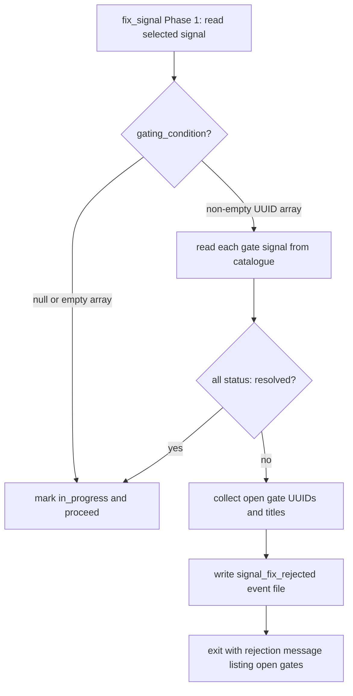

# Gating Condition: Array of Signal UUIDs and fix_signal Enforcement

## Raw Requirement

Signal: gating_condition must be an array of full signal UUIDs

1. Update the signal JSON schema: `gating_condition` changes type from `string | null` to `string[] | null` (array of full UUID strings matching signal_id values in the catalogue, or null if no gate).
2. Update the `fix_signal` tool: before marking a signal as picked up, read its `gating_condition` array and verify each listed UUID has `status: resolved` in the catalogue; if any are unresolved, reject the pick-up with a clear message listing which gates are still open.
3. Migrate all existing signal files that have a non-null string `gating_condition` to the new array format — convert prose references to their corresponding full UUIDs, or to null if the reference cannot be resolved.
4. Update `moeb introspect` (signal a1000042) to emit `gating_condition` as an array in all proposed signal JSON files.
5. Update `spec.skill.md`, `run.skill.md`, and `fix_signal.skill.md` to document the array format with a concrete example.

## Description

This specification formalises the `gating_condition` field in catalogue signal records as a machine-enforceable dependency list. The field type changes from `string | null` to `string[] | null`, where each element is the full UUID of another signal that must reach `status: resolved` before `fix_signal` may select the gated signal. A null value or empty array means no gate.

Enforcement is placed in `fix_signal.skill.md` (Phase 1, signal selection) rather than in Rust kernel code, maintaining the `thin-kernel` invariant. The skill reads the selected signal's `gating_condition` array and, for each referenced UUID, reads the corresponding catalogue entry to verify `status: resolved`. If any gate is unresolved, the skill exits with a rejection message and writes a `signal_fix_rejected` event file — it does not mark the signal `in_progress`.

The migration step converts all existing catalogue signal files: string values that are valid UUID v4 patterns are wrapped in a single-element array; all other string values (including the QA Architect's controlled-vocabulary tokens `"NoCandidateBranch"` and serialised `{ "Custom": "..." }` objects) are replaced with `null` because no UUID resolution exists for them.

The QA Architect persona (in its role file and in the inline blocks within the canonical skill files) is updated to emit `null` for `gating_condition` in ReviewSignalReport objects. Its prior controlled vocabulary was never enforced programmatically and is not compatible with the UUID-based gate model.



## Backlinks

### Parents

| Label | Path | Purpose |
|-------|------|---------|
| Harness README | .moeb/README.md | Root specification index governing all specifications |
| Signal Fix Command | specifications/moeb/moeb.signal-fix-command.md | Establishes fix_signal MCP tool and its skill-driven workflow |
| Fix Signal Skill Hardening | specifications/moeb/moeb.fix-signal-skill-hardening.md | Defines fix_signal.skill.md phase structure including Phase 1 signal selection |
| Signal Deduplication and Lifecycle | specifications/moeb/moeb.signal-deduplication-and-lifecycle.md | Defines canonical signal record schema including the gating_condition field |
| Run Skill: Signal Retrospective and Signal Schema | specifications/moeb/moeb.run-skill-retrospective-and-signal-schema.md | Bootstraps signal.schema.json and wires it into the binary bundling mechanism |

## Steps

### Step 1 — Update signal.schema.json

Read `src/moeb/internal/signal.schema.json`. Locate the `gating_condition` property definition. Replace its type definition with the following, which accepts an array of UUID strings or null:

```json
"gating_condition": {
  "oneOf": [
    {
      "type": "array",
      "items": {
        "type": "string",
        "pattern": "^[0-9a-f]{8}-[0-9a-f]{4}-[0-9a-f]{4}-[0-9a-f]{4}-[0-9a-f]{12}$"
      }
    },
    { "type": "null" }
  ],
  "description": "Array of signal_id UUIDs that must each have status: resolved before fix_signal may pick up this signal. null or empty array means no gate. Example: [\"a1000040-0601-4000-8000-000000000040\"]"
}
```

Write the updated file back to `src/moeb/internal/signal.schema.json`.

### Step 2 — Add gating enforcement to fix_signal.skill.md

Read `src/moeb/internal/skills/fix_signal.skill.md`. Locate Phase 1 (signal selection). Identify the step that reads the selected signal's catalogue record. After that read step and before the step that marks the signal as `in_progress`, insert the following **Gating Check** sub-step verbatim:

```
**Gating Check**: Inspect the selected signal's `gating_condition` field.
- If `gating_condition` is `null` or an empty array `[]`, proceed to the next step.
- If `gating_condition` is a non-empty array, for each UUID `gate_id` in the array:
  1. Read `.moeb/signals/catalogue/<gate_id>.signal.json`.
     If the file does not exist, treat it as unresolved.
  2. If the file's `status` field is not `"resolved"`, add `gate_id` to the open-gates list.
- If the open-gates list is non-empty, do NOT proceed. Instead:
  a. Write `.moeb/events/<ISO8601timestamp>_<signal_id>.event.json` with content:
     { "event_type": "signal_fix_rejected", "signal_id": "<signal_id>",
       "open_gates": [<list of unresolved UUIDs>], "timestamp": "<ISO 8601>" }
  b. Exit with message: "Signal <signal_id> cannot be picked up: the following gate
     signals are not yet resolved: <comma-separated list of UUID — title pairs>."
```

This change to `fix_signal.skill.md` must be combined in a single `write_file` call with the Step 5c and Step 6d changes to that file.

### Step 3 — Migrate existing catalogue signal files

3a. Read `.moeb/signals/index.md` to obtain the complete list of signal IDs in the catalogue.

3b. For each signal ID from the index:
  - Read `.moeb/signals/catalogue/<signal_id>.signal.json`.
  - Inspect the `gating_condition` field.
  - If `gating_condition` is already `null` or an array, skip this file (no migration needed).
  - If `gating_condition` is a string:
    - If the string matches the UUID v4 pattern `^[0-9a-f]{8}-[0-9a-f]{4}-[0-9a-f]{4}-[0-9a-f]{4}-[0-9a-f]{12}$`, replace the field value with `["<uuid>"]`.
    - Otherwise (prose text, `"NoCandidateBranch"`, serialised-object strings such as `"{\"Custom\":\"...\"}"` ), replace the field value with `null`.
  - Write the modified JSON back to the same path using `write_file`, preserving all other fields and their order.

### Step 4 — Update moeb introspect signal template output

Use `grep_files` with pattern `gating_condition` in `src/` to locate all source files that produce or template signal JSON output (including any introspect command implementation). For each matching file:
  - If a hardcoded or template `gating_condition` value is set to a non-null, non-array value, change it to `null`.
  - If `gating_condition` is already `null` or uses an array literal, no change is needed for that occurrence.

Write updated files using `write_file`. If no occurrences requiring change are found, this step produces no file writes.

### Step 5 — Document array format in canonical skill files

5a. Read `src/moeb/internal/skills/spec.skill.md`. In the **Canonical Signal Dedup-and-Write Procedure** section, find the canonical signal record schema comment block (the `#`-prefixed comment listing the fields in order). Update the `gating_condition` comment line to:

```
#   "gating_condition": string[] | null  -- UUIDs of signals that must be resolved
#     before fix_signal may pick up this signal. null = no gate.
#     Example: ["a1000040-0601-4000-8000-000000000040"]
```

Combine this change with the Step 6c update to `spec.skill.md` in a single `write_file` call.

5b. Apply the identical comment update to the **Canonical Signal Dedup-and-Write Procedure** section in `src/moeb/internal/skills/run.skill.md`. Combine with the Step 6b update to `run.skill.md` in a single `write_file` call.

5c. Apply the identical comment update to the signal-writing section in `src/moeb/internal/skills/fix_signal.skill.md`. Combine with the Step 2 and Step 6d updates in a single `write_file` call.

### Step 6 — Update QA Architect persona gating_condition field

6a. Read `src/moeb/internal/roles/qa-architect.role.md`. Locate the ReviewSignalReport JSON schema block and the `gating_condition` field. Replace the existing type annotation (`"NoCandidateBranch" | { "Custom": "string" } | null`) with `null`. Add an inline comment after the field: `// Always null — programmatic gates use UUID arrays in catalogue records, not in review reports.` Write the updated file.

6b. Locate the inline QA Architect Persona block in `src/moeb/internal/skills/run.skill.md`. Apply the same `gating_condition` → `null` substitution. Combine with the Step 5b write into a single `write_file` for `run.skill.md`.

6c. Apply the same substitution to the inline QA Architect Persona block in `src/moeb/internal/skills/spec.skill.md`. Combine with the Step 5a write into a single `write_file` for `spec.skill.md`.

6d. Apply the same substitution to the inline QA Architect Persona block in `src/moeb/internal/skills/fix_signal.skill.md`. Combine with the Step 2 and Step 5c writes into a single `write_file` for `fix_signal.skill.md`.

## Decisions

### Decision 1 — Enforcement in fix_signal.skill.md, not Rust

The gating check is placed in `fix_signal.skill.md` Phase 1, not in the Rust backing of the `fix_signal` tool. Placing conditional workflow logic (read gate signals, check status, branch on result) in compiled Rust would violate the `thin-kernel` invariant, which prohibits domain-specific sequencing logic in kernel code when a skill-file change achieves the same result. The protected-baseline-skills policy ensures `fix_signal.skill.md` cannot be overridden by project-level files, providing equivalent robustness to a Rust guard.

Rejected: Rust-level enforcement in the fix_signal tool handler. Would place workflow logic in the kernel, violate `thin-kernel`, and make the gate harder to evolve without a recompile.

### Decision 2 — Prose and controlled-vocabulary gating_condition values migrate to null

Existing `gating_condition` values that are not valid UUID v4 strings (including `"NoCandidateBranch"`, serialised JSON objects, and descriptive prose) are replaced with `null` rather than preserved or translated to custom vocabulary. These values carry no machine-enforceable meaning under the new schema; no UUID exists in the catalogue that represents concepts like "candidate branch not yet created." Setting them to null is safe: null means no gate, and any signal that genuinely requires a dependency gate can be re-authored with explicit UUID references.

Rejected: Introducing a secondary `gating_label` string field alongside `gating_condition` for prose values. Adds schema complexity for a field with no execution path — no code reads prose gating values and acts on them.

### Decision 3 — QA Architect always emits null for gating_condition

The QA Architect's controlled vocabulary (`"NoCandidateBranch"`, `{ "Custom": "..." }`) was never read and acted upon by any skill or tool implementation. Removing it simplifies the ReviewSignalReport schema and eliminates schema conflicts when QA-emitted signals are written to the catalogue via the Canonical Signal Dedup-and-Write Procedure. The concept of "block this signal until a candidate branch exists" does not map to any UUID in the catalogue, so the vocabulary cannot be preserved in the new model.

Rejected: Mapping `"NoCandidateBranch"` to a special catalogue UUID. No such signal exists and creating a synthetic one would be misleading; the gating mechanism is intended for real dependency signals, not lifecycle markers.

### Decision 4 — UUID string migration wraps to single-element array without catalogue validation

An existing `gating_condition` that is already a valid UUID v4 string is wrapped into `["<uuid>"]` without verifying that the UUID exists in the catalogue. Verifying existence would require reading an additional file per signal during migration, adding I/O overhead with no benefit. The fix_signal gating enforcement already handles a missing gate signal gracefully (treats it as unresolved), so a dangling UUID after migration surfaces as an open gate the next time fix_signal attempts to select the gated signal rather than silently disappearing.

### Decision 5 — Combine multi-step edits to the same skill file into single write_file calls

Steps 2, 5c, and 6d all modify `fix_signal.skill.md`; Steps 5a and 6c both modify `spec.skill.md`; Steps 5b and 6b both modify `run.skill.md`. These are combined into single `write_file` calls per file to avoid re-reading a file that was already read and to keep the working tree unambiguous. Each combined write incorporates all changes for that file in one pass.

## Rubric

### Structured

| Name | Description | Threshold | Pass Condition |
|------|-------------|-----------|----------------|
| `tool-errors` | No ToolHandler errors were recorded during this command invocation. Covers all tool calls on both CLI and MCP paths via `RealToolExecutor::execute`. Applies to every moeb command. | Zero tool errors | Kernel-authoritative: injected by `verify_rubrics` from `RunState.tool_errors`. Do not supply a verdict — any agent-supplied entry is overridden. |
| `rubric-qualification` | No Pass verdicts with acknowledged failures were issued during this command invocation. An agent that observes a failure but passes a criterion must populate `acknowledged_failures` in the verdict object. Applies to every moeb command. | Zero qualified Pass verdicts | Kernel-authoritative: injected by `verify_rubrics` by scanning `acknowledged_failures` on incoming Pass verdicts. Do not supply a verdict — any agent-supplied entry is overridden. |
| `skill-mandatory-phases` | The skill loaded for this run contains all mandatory phase headings. The agent checks its own prompt context (the loaded skill content is already present) for the exact strings: "Verify", "End-of-Skill Review", "Metrics Recording", "Commit", "Tag", "Complete". No file read is required. | All six mandatory headings present | Agent scans skill content in its loaded context; fails if any mandatory heading string is absent |
| `no-drift` | The specification does not violate any decision recorded in a linked parent specification | Zero contradictions | Manual review of every decision in every parent spec listed in Backlinks |
| `spec-schema-compliance` | All required frontmatter fields and body sections are present and correctly ordered | 100% of required fields and sections | Validation in `domain/spec.rs` exits 0 during `moeb spec` |
| `ai-first-org` | The specification's Steps prescribe file layouts, naming, and helper placement that satisfy the four AI-first organisation principles: one concern per file, context locality, grep-discoverable names, no cross-cutting helpers. | All four principles followed | Manual review: no step produces a file that mixes concerns, no name is generic across the codebase, all helpers are co-located with their callers or promoted to a precisely named module |
| `branch-clean-at-exit` | After Phase 9 (Commit), the working tree contains no uncommitted changes; any dirty state detected in Phase 9a has been resolved by retry commit (Case A) or by signal emission and cleanup commit (Case B) | Zero uncommitted changes at spec skill exit | Agent verifies that `git_status` returned empty output after Phase 9, or that a retry (Case A) or cleanup commit (Case B) was issued and the branch is clean |
| `kernel-thin-and-parity` | No domain-specific or workflow-specific coordination logic may be placed in kernel Rust code when it can live in skill markdown or role files. Every tool registered in the CLI tool registry must also be registered in the MCP stdio server tool list. | Zero violations | Spec review: no proposed step places review/coordination logic in Rust; Run review: grep confirms no skill-specific logic in kernel tools; tool lists in tools/mod.rs and the MCP server match exactly |
| `moeb-tool-origin` | All tool calls made during this invocation must originate from moeb's own tool registry. If an external tool (not in the moeb registry) was used because no moeb equivalent exists, the agent must write a MissingMoebTool signal immediately after each such call. The criterion always fails when any external tool is used, whether or not a signal was written. | Zero external tool calls | Agent reviews the conversation for calls to non-moeb tools (e.g. Bash, Edit, Write, Read, Glob, Grep, WebFetch, WebSearch in Claude Code MCP mode). Supplies Pass if none were made. If external tools were used with MissingMoebTool signals, supplies Fail with `acknowledged_failures` listing each signal title. If external tools were used without signals, supplies Fail with the unlogged tool names in the note. |
| `thin-kernel` | New Rust code in tools/, commands/, or domain/ must be either (a) a primitive operation wrapper (filesystem, git, or HTTP with no domain logic) or (b) a thin dispatcher that calls into skills, tools, or agents and returns the result unchanged. Workflow logic — sequencing, conditionals, review loops, retry strategy, branching decisions — must live in skill markdown or role files, not in compiled Rust. | Zero workflow-logic functions in new Rust | Spec review: no Step proposes placing sequencing or conditional workflow logic in Rust when a skill-file change would suffice; Run review: every new function in tools/ or commands/ either wraps a single OS/VCS/HTTP call or contains no domain-specific branching |
| `mcp-cli-behavioural-parity` | For any operation exposed through both the CLI agent loop and the MCP server, the observable outcome must be identical: same file mutations, same tool result string format, same rendered prompt template. No MCP-only or CLI-only code paths may alter the final output. Any tool registered in the standard registry must be registered in the MCP registry with an identical input schema and result contract. | Zero divergent outcomes | Run review: for every tool added or modified, both ToolRegistry::standard() and the MCP server carry identical registrations; start_run and domain/run.rs render from the same run.prompt template with the same rubric layers |
| `no-signal-reoccurrence` | No canonical signal in `.moeb/signals/catalogue/` has `status: reopened` due to this run | Zero reopened signals introduced by this run | Verify that no signal file updated during Step 3 migration had `status: resolved` before migration ran |

### Qualitative

- The migration step (Step 3) is fully mechanical: enumerate from index, read, inspect type, apply one of two transformation rules, write. An agent should complete it in a single pass with no ambiguity.
- The gating enforcement sub-step (Step 2) specifies the exact Phase 1 insertion point, the complete conditional logic, the event file path pattern, and the rejection message format — no implementation decision is left open.
- Steps 5 and 6 changes to the same skill file are combined into single write_file calls (Decision 5), preventing partial-update states and redundant reads.
- No new Rust source files are introduced; all gating logic lives in skill markdown, satisfying `thin-kernel` at both spec and run time.
