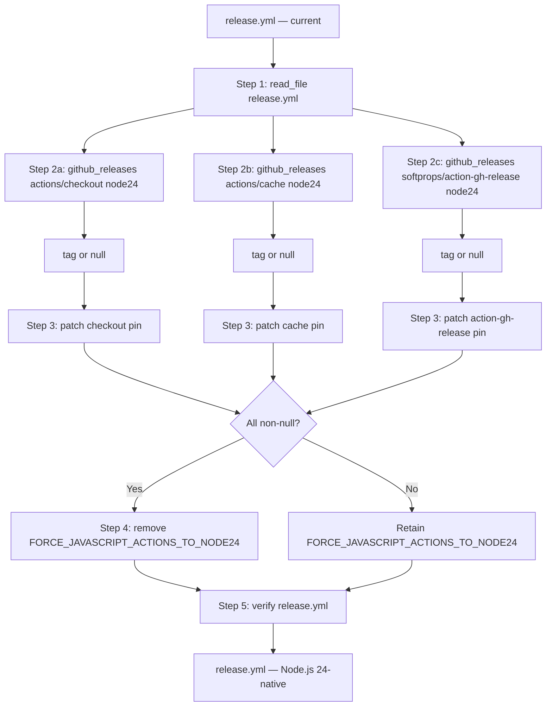

# GitHub Actions: Release Actions Native Node.js 24 Upgrade via GitHub Releases Tool

## Raw Requirement

Release pipeline GitHub Actions require Node.js 24-compatible version updates and FORCE_JAVASCRIPT_ACTIONS_TO_NODE24 removal.

Description: The release pipeline (.github/workflows/release.yml) pins actions/checkout@v4, actions/cache@v4, and softprops/action-gh-release@v2. All three run on Node.js 20, which GitHub Actions runners will force to Node.js 24 from 2026-06-02, breaking the pipeline. FORCE_JAVASCRIPT_ACTIONS_TO_NODE24=true is an existing workaround in the workflow env block; the correct fix is to upgrade each action to a version whose 'runs' statement natively targets Node.js 24, then remove the workaround env var. dtolnay/rust-toolchain@stable uses a shell script, not a JS action, and does not require a version change.

Proposed resolution: Use github_releases to look up the latest release of each affected action (actions/checkout, actions/cache, softprops/action-gh-release) and confirm its 'runs: using' value is 'node24'. Update .github/workflows/release.yml to pin those versions. Remove the FORCE_JAVASCRIPT_ACTIONS_TO_NODE24=true env block entirely. Verify no other workflows in .github/workflows/ reference the deprecated versions.

## Description

`moeb.github-actions-release-actions-inline-version-resolution.md` established the approach of using inline AI training knowledge to determine the latest stable Node.js 24-native action version tags. This approach carries a correctness risk: the implementing agent's training knowledge may be stale, producing tags that do not exist, were never released with `runs.using: node24`, or have since been superseded by newer versions. The `github_releases` tool (added by `moeb.github-releases-tool.md`) queries the GitHub Releases API directly, iterating releases newest-first and fetching each tag's `action.yml` until it finds one declaring the requested `runs.using` value. This eliminates the staleness risk and grounds version selection in live API data at implementation time.

This specification supersedes Decision 3 of the prior spec by replacing the inline-knowledge version lookup with three `github_releases` calls — one for each of `actions/checkout`, `actions/cache`, and `softprops/action-gh-release`. Decisions 1 and 2 (upgrade action pins; remove `FORCE_JAVASCRIPT_ACTIONS_TO_NODE24` once all are upgraded) are unchanged. Decision 4 (graceful `query_agent` MCP guard) was implemented by the prior run and is not repeated here.

## Backlinks

### Parents

| Label | Path | Purpose |
|-------|------|---------|
| Harness README | README.md | Governing harness for all specifications |
| GitHub Actions: Release Actions Upgrade via Inline Version Resolution | specifications/moeb/moeb.github-actions-release-actions-inline-version-resolution.md | Prior specification whose Decision 3 this spec supersedes |
| GitHub Releases Query Tool | specifications/moeb/moeb.github-releases-tool.md | Provides the `github_releases` tool used in Step 2 |

## Steps

### Step 1 — Read the workflow file

Call `read_file` on `.github/workflows/release.yml`. Confirm the following are present:
- `actions/checkout` pinned at a `@v4`-series tag
- `actions/cache` pinned at a `@v4`-series tag
- `softprops/action-gh-release` pinned at a `@v2`-series tag
- `FORCE_JAVASCRIPT_ACTIONS_TO_NODE24: true` in the workflow-level `env:` block
- `dtolnay/rust-toolchain@stable` is present and must remain unchanged

### Step 2 — Look up current Node.js 24-native versions using `github_releases`

Call the `github_releases` tool three times, one per affected action:

1. `github_releases` with `repo: "actions/checkout"`, `runs_using: "node24"`
2. `github_releases` with `repo: "actions/cache"`, `runs_using: "node24"`
3. `github_releases` with `repo: "softprops/action-gh-release"`, `runs_using: "node24"`

Record the returned `tag` field for each action. If the tool returns an error string or a response with no `tag` field for any action, set that action's tag to `null` and note the reason. Do not fabricate a tag. A `null` value means that action cannot be upgraded in this run and `FORCE_JAVASCRIPT_ACTIONS_TO_NODE24: true` must be retained.

### Step 3 — Patch action version pins

For each action with a non-null tag from Step 2, call `patch_file` on `.github/workflows/release.yml` to replace the current version pin with the confirmed Node.js 24-native tag. Apply one minimal unified-diff patch per action. Do not modify any other line of the file.

### Step 4 — Remove `FORCE_JAVASCRIPT_ACTIONS_TO_NODE24`

If and only if all three actions returned non-null tags in Step 2, call `patch_file` on `.github/workflows/release.yml` to remove the `FORCE_JAVASCRIPT_ACTIONS_TO_NODE24: true` line from the `env:` block. If removing this line leaves the `env:` block empty, remove the entire `env:` block including its key. If any action could not be upgraded (null tag from Step 2), skip this step and leave `FORCE_JAVASCRIPT_ACTIONS_TO_NODE24: true` unchanged.

### Step 5 — Verify

Call `read_file` on `.github/workflows/release.yml` and confirm:
- Each upgraded action pin matches the exact tag returned by `github_releases` in Step 2.
- `FORCE_JAVASCRIPT_ACTIONS_TO_NODE24` is absent if all three actions were upgraded; still present and unchanged if any action could not be upgraded.
- No structural YAML regressions: no duplicate keys, no indentation errors, `on:`, `permissions:`, `jobs:` sections and all workflow steps remain intact.
- `dtolnay/rust-toolchain@stable` is unchanged.

Also call `list_directory` on `.github/workflows/`. For each workflow file found other than `release.yml`, call `read_file` on it and check whether it references `FORCE_JAVASCRIPT_ACTIONS_TO_NODE24` or the pre-upgrade action version pins. If any such reference is found, do not modify those files; instead, emit a signal for each affected workflow file noting the remaining reference.

## Decisions

### Decision 1 — Upgrade action versions to eliminate the Node.js 20 deprecation warning natively

**Rationale:** `FORCE_JAVASCRIPT_ACTIONS_TO_NODE24: true` causes the runner to execute actions under Node.js 24 but does not eliminate the deprecation warning, which fires because the action manifests themselves still declare `node20`. Upgrading to versions whose `action.yml` natively declares `node24` removes the warning at its source and produces a correctly configured pipeline before the 2026-06-02 forced migration deadline.

**Rejected alternatives:**
- _Retain `FORCE_JAVASCRIPT_ACTIONS_TO_NODE24: true` without upgrading_: Insufficient — the deprecation warning fires in every release run despite the override, and the override becomes a no-op once GitHub enforces Node.js 24 by default.

**Consequences:** After this run, each upgraded action pin references a version confirmed by `github_releases` to declare `runs.using: node24`. If the API returns null for any action, `FORCE_JAVASCRIPT_ACTIONS_TO_NODE24: true` is retained for that action as a partial mitigation.

### Decision 2 — Remove `FORCE_JAVASCRIPT_ACTIONS_TO_NODE24: true` once all three actions are upgraded

**Rationale:** The environment variable was an explicitly interim measure. Retaining it after all three actions natively target Node.js 24 adds configuration noise and could silently mask future deprecation warnings for newly added actions.

**Rejected alternatives:**
- _Keep `FORCE_JAVASCRIPT_ACTIONS_TO_NODE24: true` as a defensive override_: If all manifests declare `node24`, the variable has no effect. If a future action manifest declares an older runtime, retaining the variable would suppress the warning rather than surfacing it for remediation.

**Consequences:** Partial upgrades retain `FORCE_JAVASCRIPT_ACTIONS_TO_NODE24: true` as a partial mitigation. A follow-up signal or specification is required to complete the migration once remaining actions publish Node.js 24-native versions.

### Decision 3 — Use `github_releases` for version lookup instead of inline AI training knowledge

**Rationale:** `moeb.github-actions-release-actions-inline-version-resolution.md` Decision 3 chose inline training knowledge over `query_agent` because `query_agent` is unavailable in MCP serve mode. Inline knowledge has a correctness risk: the agent's training cutoff may be earlier than the release dates of the Node.js 24-native versions, producing stale or non-existent version tags. The `github_releases` tool (from `moeb.github-releases-tool.md`) queries the live GitHub Releases API and returns the latest release tag confirmed to declare `runs.using: node24` at implementation time. It is both adapter-independent and immune to training-cutoff staleness — it is strictly superior to inline knowledge for this task.

**Rejected alternatives:**
- _Retain inline AI training knowledge_: Training cutoff risk: the agent may select a tag that has since been superseded, never existed, or was not released with `node24`. `github_releases` eliminates all three risks.
- _Use `query_agent` for version lookup_: `query_agent` requires a locally configured adapter and is unavailable in MCP serve mode (per `moeb.inline-persona-review.md` Decision 3). `github_releases` is a first-party moeb tool available on all paths.
- _Hardcode specific version tags in the spec_: Accurate at authoring time but potentially stale at implementation time. `github_releases` achieves correctness at implementation time.

**Consequences:** The implementing agent's version selection is grounded in live GitHub API data at implementation time. If the GitHub API is unavailable or returns no `node24` release for any action, that action's tag is set to `null` and the upgrade for that action is deferred to a follow-up run.

## Rubric

### Structured

| Name | Description | Threshold | Pass Condition |
|------|-------------|-----------|----------------|
| `tool-errors` | No ToolHandler errors were recorded during this command invocation. Covers all tool calls on both CLI and MCP paths via `RealToolExecutor::execute`. Applies to every moeb command. | Zero tool errors | Kernel-authoritative: injected by `verify_rubrics` from `RunState.tool_errors`. Do not supply a verdict — any agent-supplied entry is overridden. |
| `rubric-qualification` | No Pass verdicts with acknowledged failures were issued during this command invocation. An agent that observes a failure but passes a criterion must populate `acknowledged_failures` in the verdict object. Applies to every moeb command. | Zero qualified Pass verdicts | Kernel-authoritative: injected by `verify_rubrics` by scanning `acknowledged_failures` on incoming Pass verdicts. Do not supply a verdict — any agent-supplied entry is overridden. |
| `skill-mandatory-phases` | The skill loaded for this run contains all mandatory phase headings. The agent checks its own prompt context for the exact strings: "Verify", "End-of-Skill Review", "Metrics Recording", "Commit", "Tag", "Complete". No file read is required. | All six mandatory headings present | Agent scans skill content in its loaded context; fails if any mandatory heading string is absent |
| `no-drift` | The specification does not violate any decision recorded in a linked parent specification | Zero contradictions | Manual review of every decision in every parent spec listed in Backlinks |
| `spec-schema-compliance` | All required frontmatter fields and body sections are present and correctly ordered | 100% of required fields and sections | Validation in `domain/spec.rs` exits 0 during `moeb spec` |
| `ai-first-org` | The specification's Steps prescribe file layouts, naming, and helper placement that satisfy the four AI-first organisation principles: one concern per file, context locality, grep-discoverable names, no cross-cutting helpers. | All four principles followed | Manual review: no step produces a file that mixes concerns, no name is generic across the codebase, all helpers are co-located with their callers or promoted to a precisely named module |
| `kernel-thin-and-parity` | No domain-specific or workflow-specific coordination logic may be placed in kernel Rust code when it can live in skill markdown or role files. Every tool registered in the CLI tool registry must also be registered in the MCP stdio server tool list. | Zero violations | Spec review: no proposed step places review/coordination logic in Rust; Run review: grep confirms no skill-specific logic in kernel tools; tool lists in tools/mod.rs and the MCP server match exactly |
| `moeb-tool-origin` | All tool calls made during this invocation must originate from moeb's own tool registry. | Zero external tool calls | Agent reviews the conversation for calls to non-moeb tools. Supplies Pass if none were made. If external tools were used with MissingMoebTool signals, supplies Fail with `acknowledged_failures` listing each signal title. |
| `action-versions-confirmed-node24` | Each action tag applied by the implementing agent was returned by `github_releases` with `runs.using: node24` confirmed in the API response | All non-null tags confirmed via `github_releases` | Run review: `github_releases` result for each action shows a `tag` field; no version pin was applied without a successful `github_releases` response |
| `workflow-yaml-valid` | The patched `.github/workflows/release.yml` remains structurally valid YAML with no regressions | Zero YAML structural errors | Agent reads the file after all patches and confirms no duplicate keys, no indentation errors, all top-level sections intact |
| `force-node24-removed-when-all-upgraded` | `FORCE_JAVASCRIPT_ACTIONS_TO_NODE24` is absent from `.github/workflows/release.yml` if and only if all three actions were successfully upgraded | Absent iff all three tags non-null | Agent checks final state of the env block; fails if the var is present when all three tags were non-null, or absent when any tag was null |

### Qualitative

- All three action pins in `.github/workflows/release.yml` must reference the exact version tags returned by `github_releases`; any deviation constitutes a failure.
- If all three actions are upgraded, `FORCE_JAVASCRIPT_ACTIONS_TO_NODE24` must be absent from the workflow file after patching.
- If any action lookup returns a null tag, `FORCE_JAVASCRIPT_ACTIONS_TO_NODE24: true` must remain and a signal must be emitted identifying which action could not be upgraded and the reason.
- The YAML structure of `release.yml` must remain valid after all patches: no duplicate keys, no indentation errors, workflow-level sections in their correct positions.
- `dtolnay/rust-toolchain@stable` must remain unchanged.
