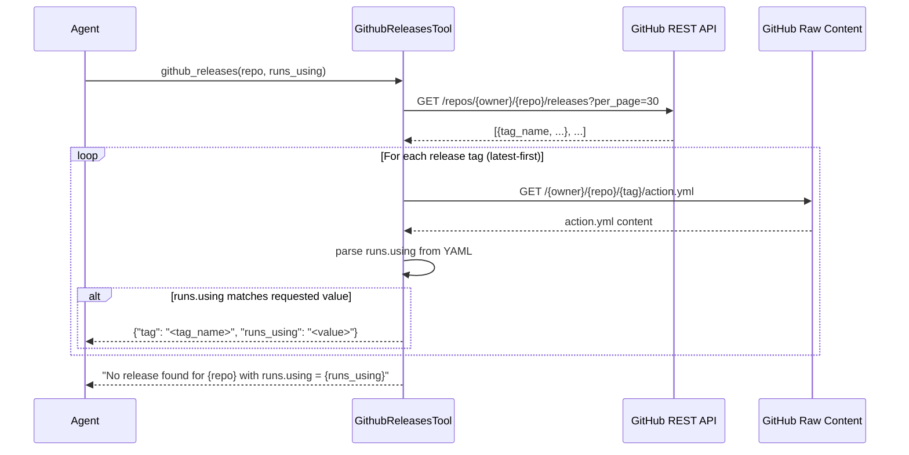

# GitHub Releases Query Tool

## Raw Requirement

Add a web_search or github_releases moeb tool that queries the GitHub releases API for a given action repository and returns the latest tag whose action.yml declares a specified runs.using version.

## Description

Adds a `github_releases` tool to the moeb tool registry that accepts a GitHub action repository identifier (e.g. `actions/checkout`) and a target `runs_using` string (e.g. `node20`), queries the GitHub REST API for the repository's releases ordered by descending recency, and for each release tag fetches the raw `action.yml` from that tag's source tree via the GitHub raw-content endpoint. The first release whose `action.yml` declares the requested `runs.using` value is returned as a structured JSON result string. This enables moeb agents to resolve the correct pinned version of a GitHub Action during workflow generation or upgrade tasks, eliminating the need for external browsing tools.

The implementation adds one new source file `src/moeb/tools/github_releases.rs` implementing the `ToolHandler` trait, registers the tool in both `ToolRegistry::standard()` and the MCP stdio server tool list, and uses the existing `reqwest` HTTP client already present in the project alongside the `serde_yaml` crate for YAML parsing.



## Backlinks

### Parents

| Label | Path | Purpose |
|-------|------|---------|
| Harness README | README.md | Parent specification index governing all moeb specifications |
| Tool Executor Extraction | specifications/moeb/moeb.tool-executor-extraction.md | Establishes the ToolHandler trait and ToolRegistry that this tool extends |
| MCP Stdio Server | specifications/moeb/moeb.mcp-stdio-server.md | Requires all tools registered in the CLI to also be registered in the MCP server |

## Steps

### Step 1 — Verify or add `serde_yaml` dependency

In `src/moeb/Cargo.toml`, check whether `serde_yaml` is already listed under `[dependencies]`. If it is absent, add:

```toml
serde_yaml = "0.9"
```

Do not change any other dependency entry.

### Step 2 — Create `src/moeb/tools/github_releases.rs`

Create a new file at `src/moeb/tools/github_releases.rs`. This file must contain only the `GithubReleasesTool` struct, its `ToolHandler` implementation, and private helper `fn` declarations scoped to the same file. Do not import symbols from other moeb tool files.

**Tool name**: `github_releases`

**Description string**: `"Query the GitHub Releases API for a given action repository and return the latest release tag whose action.yml declares a specified runs.using value."`

**Input schema** (return this JSON value from the `ToolHandler::input_schema` method):

```json
{
  "type": "object",
  "properties": {
    "repo": {
      "type": "string",
      "description": "GitHub repository in owner/repo format, e.g. actions/checkout"
    },
    "runs_using": {
      "type": "string",
      "description": "The runs.using value to match, e.g. node20"
    }
  },
  "required": ["repo", "runs_using"]
}
```

**`execute` implementation** — all failure paths must return a descriptive error string, never panic:

1. Extract `repo` and `runs_using` as strings from the input `serde_json::Value`. Return `"Missing required field: repo"` or `"Missing required field: runs_using"` if either field is absent or not a string.
2. Split `repo` on the first `/` to obtain `owner` and `repo_name`. Return `"Invalid repo format: expected owner/repo"` if either part is empty after the split.
3. Build a `reqwest::blocking::Client` configured with a 30-second connection timeout, a 30-second read timeout, and a `User-Agent` header of `"moeb-agent"`.
4. Send `GET https://api.github.com/repos/{owner}/{repo_name}/releases?per_page=30` with the header `Accept: application/vnd.github+json`. On network failure return `"GitHub API request failed: {error}"`. On a non-2xx HTTP status return `"GitHub API error: HTTP {status}"`.
5. Deserialise the response body as `Vec<serde_json::Value>`. On deserialisation failure return `"Failed to parse GitHub releases response: {error}"`.
6. Iterate over the releases array in order (GitHub returns newest-first by default). For each element:
   a. Extract `tag_name` as a string; skip the element if the field is absent or not a string.
   b. Fetch `https://raw.githubusercontent.com/{owner}/{repo_name}/{tag_name}/action.yml` using the same client. Skip this tag if the request fails or returns a non-200 status.
   c. Read the response body as a UTF-8 string.
   d. Parse the string with `serde_yaml::from_str::<serde_yaml::Value>`. Skip this tag if parsing fails.
   e. Navigate to `value["runs"]["using"]`. If this field is a `serde_yaml::Value::String` equal to `runs_using`, return `serde_json::json!({"tag": tag_name, "runs_using": runs_using}).to_string()`.
7. After exhausting all fetched releases, return `"No release found for {repo} with runs.using = {runs_using}"`.

### Step 3 — Declare module and register in `src/moeb/tools/mod.rs`

In `src/moeb/tools/mod.rs`:

1. Add `pub mod github_releases;` alongside the existing tool module declarations.
2. Append `Box::new(github_releases::GithubReleasesTool)` (or the equivalent constructor matching the pattern used by other tools in the file) as the **last** entry in the `Vec` returned by `ToolRegistry::standard()`. Do not reorder existing entries.

### Step 4 — Register in the MCP stdio server

Locate the source file that registers tools for `moeb serve` (the file constructing tool descriptors or `InputSchema` entries for each tool in the MCP server). Add a registration for `github_releases` using the identical name, description, and input schema as defined in Step 2. The registration must follow the same pattern as existing MCP tool entries.

### Step 5 — Update the standard-registry count assertion

In the file containing the `ToolRegistry::standard()` count assertion (typically `src/moeb/tools/tool_executor_tests.rs`), increment the expected tool count by 1 to account for the newly registered `GithubReleasesTool`.

### Step 6 — Build and test

1. Run `cargo build --package moeb` from the repository root. Resolve any compilation errors before proceeding. Do not modify files unrelated to Steps 1–5.
2. Run `cargo test --package moeb` from the repository root. All tests must pass. Fix any failures caused by the new registration or count assertion change only.

## Decisions

### Decision 1 — Introduce a dedicated `github_releases` tool rather than a generic `web_search` tool

**Rationale**: The raw requirement offers two alternatives. A general-purpose `web_search` tool requires a third-party search API key, introduces an additional external dependency, and returns nondeterministic unstructured results requiring further agent reasoning. The `github_releases` tool uses only the public GitHub REST API (no credentials required for public repos), produces a structured deterministic result, and fully satisfies the stated requirement. A focused tool is preferred over a broader one when the focused capability covers the use case completely.

**Rejected alternative**: A `web_search` tool backed by a search engine API (Brave Search, Bing, Tavily) would satisfy the requirement indirectly but adds credential management overhead and variable output structure.

**Consequence**: Moeb agents can resolve GitHub Action release tags without external tool calls. A separate `web_search` tool may be introduced in a future specification if broader web query capability is needed.

### Decision 2 — Use `reqwest::blocking` (synchronous HTTP client)

**Rationale**: All existing moeb tool handlers execute synchronously inside `RealToolExecutor::execute`. Introducing async execution in a single tool would require restructuring the agent loop around an async runtime. Synchronous HTTP is sufficient for the sequential single-request-per-release traversal, and the 30-second timeout bounds worst-case latency.

**Rejected alternative**: Async `reqwest` with `tokio::task::block_in_place` avoids blocking the async executor thread but adds complexity not justified for a sequential tool in a synchronous handler context.

**Consequence**: The tool blocks the current thread for up to 30 seconds per HTTP request. Given the sequential nature of the agent loop, this is acceptable.

### Decision 3 — Fetch `action.yml` via the GitHub raw-content endpoint

**Rationale**: The raw-content endpoint (`raw.githubusercontent.com`) returns file content directly as a UTF-8 string, requires no authentication for public repositories, and avoids the Base64 decoding step required by the GitHub Contents API.

**Rejected alternative**: The Contents API (`/repos/{owner}/{repo}/contents/action.yml?ref={tag}`) returns Base64-encoded content with metadata overhead. Both approaches are functionally equivalent, but the raw endpoint is simpler and lower-latency.

**Consequence**: The tool is compatible only with public repositories. Private repository support would require a GitHub personal access token, which is out of scope for this specification.

### Decision 4 — Parse `action.yml` with `serde_yaml`

**Rationale**: `serde_yaml` is the standard YAML parsing crate in the Rust ecosystem, has broad YAML specification coverage, no native-library linking requirements on Linux or Windows, and is already used in similar Rust projects targeting GitHub Action files. Plain-text line matching on `runs.using:` would fail on multi-line YAML, leading whitespace variations, and YAML anchors.

**Rejected alternative**: Plain-text string matching (e.g. scanning for a line beginning with `  using:`) is fragile and incorrect for non-trivial YAML.

**Consequence**: `serde_yaml = "0.9"` must be added to the moeb binary's `Cargo.toml` if not already present. The crate is well-maintained and widely used; this is a low-risk dependency.

## Rubric

### Structured

| Name | Description | Threshold | Pass Condition |
|------|-------------|-----------|----------------|
| `tool-errors` | No ToolHandler errors were recorded during this command invocation. Covers all tool calls on both CLI and MCP paths via `RealToolExecutor::execute`. Applies to every moeb command. | Zero tool errors | Kernel-authoritative: injected by `verify_rubrics` from `RunState.tool_errors`. Do not supply a verdict — any agent-supplied entry is overridden. |
| `rubric-qualification` | No Pass verdicts with acknowledged failures were issued during this command invocation. An agent that observes a failure but passes a criterion must populate `acknowledged_failures` in the verdict object. Applies to every moeb command. | Zero qualified Pass verdicts | Kernel-authoritative: injected by `verify_rubrics` by scanning `acknowledged_failures` on incoming Pass verdicts. Do not supply a verdict — any agent-supplied entry is overridden. |
| `skill-mandatory-phases` | The skill loaded for this run contains all mandatory phase headings. The agent checks its own prompt context (the loaded skill content is already present) for the exact strings: "Verify", "End-of-Skill Review", "Metrics Recording", "Commit", "Tag", "Complete". No file read is required. | All six mandatory headings present | Agent scans skill content in its loaded context; fails if any mandatory heading string is absent |
| `no-drift` | The specification does not violate any decision recorded in a linked parent specification | Zero contradictions | Manual review of every decision in every parent spec listed in Backlinks |
| `spec-schema-compliance` | All required frontmatter fields and body sections are present and correctly ordered | 100% of required fields and sections | Validation in `domain/spec.rs` exits 0 during `moeb spec` |
| `ai-first-org` | The specification's Steps prescribe file layouts, naming, and helper placement that satisfy the four AI-first organisation principles: one concern per file, context locality, grep-discoverable names, no cross-cutting helpers. | All four principles followed | Manual review: no step produces a file that mixes concerns, no name is generic across the codebase, all helpers are co-located with their callers or promoted to a precisely named module |
| `kernel-thin-and-parity` | No domain-specific or workflow-specific coordination logic may be placed in kernel Rust code when it can live in skill markdown or role files. Every tool registered in the CLI tool registry must also be registered in the MCP stdio server tool list. | Zero violations | Spec review: no proposed step places review/coordination logic in Rust; Run review: grep confirms no skill-specific logic in kernel tools; tool lists in tools/mod.rs and the MCP server match exactly |
| `moeb-tool-origin` | All tool calls made during this invocation must originate from moeb's own tool registry. If an external tool (not in the moeb registry) was used because no moeb equivalent exists, the agent must write a MissingMoebTool signal immediately after each such call. The criterion always fails when any external tool is used, whether or not a signal was written. | Zero external tool calls | Agent reviews the conversation for calls to non-moeb tools (e.g. Bash, Edit, Write, Read, Glob, Grep, WebFetch, WebSearch in Claude Code MCP mode). Supplies Pass if none were made. If external tools were used with MissingMoebTool signals, supplies Fail with `acknowledged_failures` listing each signal title. If external tools were used without signals, supplies Fail with the unlogged tool names in the note. |
| `thin-kernel` | New Rust code in tools/, commands/, or domain/ must be either (a) a primitive operation wrapper (filesystem, git, or HTTP with no domain logic) or (b) a thin dispatcher. Workflow logic must live in skill markdown or role files, not in compiled Rust. | Zero workflow-logic functions in new Rust | Spec review: no Step proposes placing sequencing or conditional workflow logic in Rust when a skill-file change would suffice; Run review: every new function in github_releases.rs is a single-purpose HTTP or YAML-parse call with no domain-specific branching beyond input validation |
| `mcp-cli-behavioural-parity` | For any operation exposed through both the CLI agent loop and the MCP server, the observable outcome must be identical: same tool result string format. Any tool in the standard registry must be in the MCP registry with an identical input schema and result contract. | Zero divergent outcomes | Run review: `github_releases` is registered in both `ToolRegistry::standard()` and the MCP server with identical name, description, and input schema; result format is identical on both paths |

### Qualitative

- Error messages returned by the tool must be specific enough for an implementing agent to distinguish between: network failure, non-2xx GitHub API response, missing `action.yml` at a tag, YAML parse failure, and no matching release.
- The tool must not panic on any valid or malformed input; every failure path must produce a descriptive string result.
- Steps must be precise enough for an implementing agent to follow without consulting source files beyond those named in the spec.
