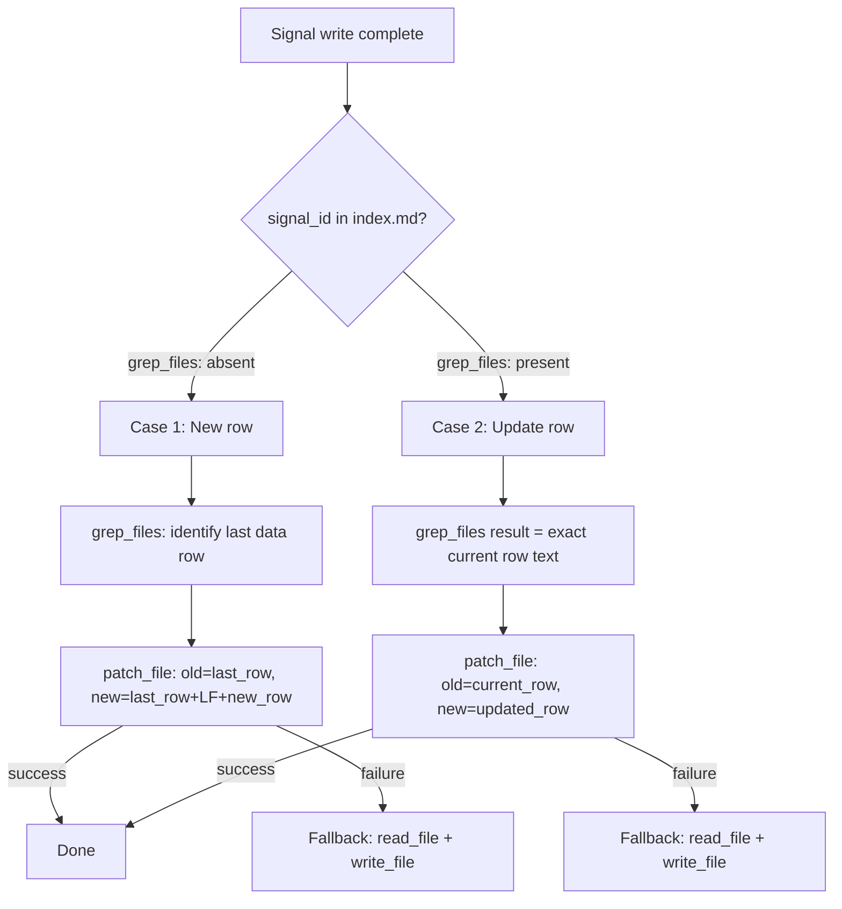

# Index Update Sub-procedure: Targeted patch_file Instead of Full-File Rewrite

## Raw Requirement

Title: Index Update sub-procedure rewrites full signals/index.md on every signal emit instead of patching the affected row

Problem: The Index Update sub-procedure called after every signal write in run.skill.md, spec.skill.md, fix_signal.skill.md, and accept_candidate.skill.md reads the entire signals/index.md, rebuilds the complete markdown table, and calls write_file to replace the whole file. For a catalogue of n signals this is O(n) on every emit regardless of how many rows changed — always exactly one. As the catalogue grows the operation becomes observably slow and disproportionate to the work being done.

The sub-procedure has two distinct cases that each have a cheaper path:
1. New signal: the row does not yet exist in the index — append one line.
2. Existing signal update (status change, occurrence count increment, severity upgrade): the row already exists — find and replace that single row in-place.

Neither case requires reading or regenerating any other row.

Proposed resolution: Replace the full-file-rewrite strategy in the Index Update sub-procedure with a targeted patch approach:

Case 1 — new signal (row absent from index): Append the new row to the end of the table body using `patch_file` with the last existing table row as the anchor. Do not read or rewrite any other row.

Case 2 — existing signal update (row present in index): Locate the row by signal_id (the first column is the signal_id; use a targeted `patch_file` replacing the matched row with the updated row). Do not read or rewrite any other row.

Implementation: The sub-procedure first checks whether the signal_id appears in the current index (a single grep_files scan of the id column is sufficient — no full parse needed). If absent: append. If present: patch the matching row.

Apply this change to the Index Update sub-procedure definition wherever it is defined (in run.skill.md, spec.skill.md, and fix_signal.skill.md) and verify all three canonical skill files carry the updated procedure.

## Description

This specification replaces the O(n) full-file-rewrite strategy in the `### Index Update` sub-procedure across all three canonical skill files (`run.skill.md`, `spec.skill.md`, `fix_signal.skill.md`) with two targeted `patch_file` operations — one for the append case (new row) and one for the in-place update case (existing row). A `grep_files` check on the signal_id string selects the case before any file write is attempted. Fallback to the current `read_file` + `write_file` approach is preserved for `patch_file` failures. The Phase 5a inline index update in `spec.skill.md` is also converted to the targeted approach, since that phase always performs a Case 2 operation (the row was written by the same or a prior run). The `accept_candidate` MCP tool's index update executes in Rust kernel code and is explicitly excluded from this skill-level change.

## Backlinks

### Parents

| Label | Path | Purpose |
|-------|------|---------|
| Harness README | .moeb/README.md | Governing harness policy and specification index |

## Steps

### Step 1 — Update `### Index Update` sub-procedure in `src/moeb/internal/skills/run.skill.md`

Read `src/moeb/internal/skills/run.skill.md`. Locate the `### Index Update` section within the Canonical Signal Dedup-and-Write Procedure. Replace the body of this section with a procedure that implements the following logic:

1. If `.moeb/signals/index.md` does not exist, create it with `write_file` using the standard header (# Signal Index, followed by the column-header row and separator row). Then process each signal as Case 1 below.
2. For each canonical signal written in the current run, call `grep_files` with `path: ".moeb/signals/index.md"` and `pattern: "<signal_id>"` (the literal UUID string). If `grep_files` returns a match, treat as Case 2; otherwise treat as Case 1.
3. **Case 1 — row absent (new signal):** Call `grep_files` on the index to locate the last `| ` line in the table body to obtain the exact last data row text. Call `patch_file` with `old_string` set to that last data row and `new_string` set to that same row followed immediately by a newline and the new row in the standard format `| <signal_id> | <title> | <category> | <signal_source> | <severity> | <status> | <occurrence_count> | <last_seen> | [catalogue/<signal_id>.signal.json](catalogue/<signal_id>.signal.json) |`. If `patch_file` fails (including when no data rows exist yet), fall back to `read_file` + `write_file` with the full updated content.
4. **Case 2 — row present (existing signal update):** Use the matching line returned by `grep_files` as the exact current row text. Call `patch_file` with `old_string` set to that exact row and `new_string` set to the updated row with refreshed values for `Severity`, `Status`, `Occurrences`, and `Last Seen`. If `patch_file` fails, fall back to `read_file` + `write_file` with the full updated content.

Remove the previous unconditional `read_file` + in-memory reconstruction + `write_file` of the entire index.

Use `patch_file` to replace the existing `### Index Update` section heading and body in `run.skill.md`. If `patch_file` fails on `run.skill.md` itself, use `read_file` + `write_file` with the full updated `run.skill.md` content.

### Step 2 — Update `### Index Update` sub-procedure in `src/moeb/internal/skills/spec.skill.md`

Read `src/moeb/internal/skills/spec.skill.md`. Locate the `### Index Update` section within the Canonical Signal Dedup-and-Write Procedure. Apply the identical four-step replacement described in Step 1, bringing `spec.skill.md` into parity with the updated `run.skill.md` procedure.

Use `patch_file` to replace the existing `### Index Update` section in `spec.skill.md`. If `patch_file` fails, use `read_file` + `write_file` with the full updated `spec.skill.md` content.

### Step 3 — Update Phase 5a inline index update in `src/moeb/internal/skills/spec.skill.md`

Within `spec.skill.md`, locate Phase 5a (`Signal Status Update`). Step 4 of that phase currently instructs the agent to read `.moeb/signals/index.md`, find the matching row in-memory, update the `Status` cell to `spec_written`, and write the complete updated `index.md` using `write_file`.

Replace step 4 with the following instruction: call `grep_files` with `path: ".moeb/signals/index.md"` and `pattern: "<signal_id>"` to obtain the exact current row text. Call `patch_file` with `old_string` set to that exact row and `new_string` set to the updated row with `Status` changed to `spec_written`. If `patch_file` fails, or if no matching row is found, fall back to `read_file` + `write_file` with the full updated content (appending a new row if the signal is absent).

Use `patch_file` to replace the Phase 5a step 4 text. If `patch_file` fails, use `read_file` + `write_file` on the full `spec.skill.md` content.

### Step 4 — Update `### Index Update` sub-procedure in `src/moeb/internal/skills/fix_signal.skill.md`

Read `src/moeb/internal/skills/fix_signal.skill.md`. Locate the `### Index Update` section within the Canonical Signal Dedup-and-Write Procedure. Apply the identical four-step replacement described in Step 1, bringing `fix_signal.skill.md` into parity with the updated `run.skill.md` procedure.

Use `patch_file` to replace the existing `### Index Update` section in `fix_signal.skill.md`. If `patch_file` fails, use `read_file` + `write_file` with the full updated `fix_signal.skill.md` content.

### Step 5 — Exclusion note: `accept_candidate` Rust implementation

The `accept_candidate` MCP tool performs its index update in Rust kernel code, not via a skill file. This Rust-level update is excluded from this specification's scope. No Rust changes are required by this specification. A separate kernel-scoped specification may address the Rust-side index update if O(n) writes in `accept_candidate` become a performance concern.

## Decisions

### Decision 1 — Use patch_file for targeted row operations

**Rationale:** The full-file-rewrite approach is O(n) per signal emit. Using `patch_file` for both the append case (new row) and the in-place update case (existing row) reduces each write to O(1) — only the affected row text is modified. This directly addresses the proposed resolution in the triggering signal.

**Rejected alternatives:**
- Keeping `write_file` with in-memory reconstruction: still O(n) reads and writes with no performance improvement.
- A dedicated kernel tool for row-level index updates: adds Rust complexity and violates the thin-kernel policy when a skill-file `patch_file` approach is sufficient.

**Consequences:** If `patch_file` fails due to stale row content (a TOCTOU edge case in sequential single-agent execution), the fallback to `read_file` + `write_file` ensures correctness at the cost of one O(n) write on that rare path.

### Decision 2 — grep_files as the case-selection check

**Rationale:** `grep_files` performs a substring scan for the UUID signal_id string without loading the full file into the agent's context window. The UUID format ensures no false positives within the index file. This avoids O(n) context growth that a full `read_file` before every index update would cause.

**Rejected alternatives:**
- `read_file` + in-memory scan: reads the full file into context unnecessarily before every update.
- `read_file_range` of a fixed window: signal rows are appended chronologically and could appear at any position in the file.

**Consequences:** One additional `grep_files` tool call is incurred per index update, but this is offset by eliminating the full `read_file` + `write_file` pair that previously ran unconditionally.

### Decision 3 — Identical update applied to all three canonical skill files

**Rationale:** The `### Index Update` sub-procedure is embedded independently in all three canonical protected skill files with no shared include mechanism. All three must carry the same targeted-patch text to prevent divergence where one skill uses the efficient approach and another uses the full-file-rewrite.

**Rejected alternatives:**
- Updating only `run.skill.md` and deferring the others: risks divergence and leaves the index update O(n) in spec and fix_signal runs.

**Consequences:** Steps 1, 2, and 4 perform three parallel patch operations; each file is explicitly addressed, satisfying the `all-skill-files-parity` criterion.

### Decision 4 — Exclusion of accept_candidate Rust implementation

**Rationale:** The `accept_candidate` MCP tool's index update is implemented in Rust kernel code, not in a skill file. Modifying Rust code to use a different file-update strategy is a kernel concern that would require a separate kernel-scoped specification following the thin-kernel policy. This specification is scoped to skill-file changes only.

**Rejected alternatives:**
- Including a Rust refactor in this spec: would broaden scope beyond skill-file changes and risk violating the thin-kernel principle by prescribing internal Rust implementation details in a skill-focused spec.

**Consequences:** The `accept_candidate` index update remains O(n) until addressed by a dedicated kernel-scoped spec. Given that `accept_candidate` is called at most once per signal resolution rather than per signal emit, the runtime impact is negligible compared to the high-frequency emit path addressed here.

## Rubric

### Structured

| Name | Description | Threshold | Pass Condition |
|------|-------------|-----------|----------------|
| `tool-errors` | No ToolHandler errors were recorded during this command invocation. Covers all tool calls on both CLI and MCP paths via `RealToolExecutor::execute`. Applies to every moeb command. | Zero tool errors | Kernel-authoritative: injected by `verify_rubrics` from `RunState.tool_errors`. Do not supply a verdict — any agent-supplied entry is overridden. |
| `rubric-qualification` | No Pass verdicts with acknowledged failures were issued during this command invocation. An agent that observes a failure but passes a criterion must populate `acknowledged_failures` in the verdict object. Applies to every moeb command. | Zero qualified Pass verdicts | Kernel-authoritative: injected by `verify_rubrics` by scanning `acknowledged_failures` on incoming Pass verdicts. Do not supply a verdict — any agent-supplied entry is overridden. |
| `skill-mandatory-phases` | The skill loaded for this run contains all mandatory phase headings. The agent checks its own prompt context (the loaded skill content is already present) for the exact strings: "Verify", "End-of-Skill Review", "Metrics Recording", "Commit", "Tag", "Complete". No file read is required. | All six mandatory headings present | Agent scans skill content in its loaded context; fails if any mandatory heading string is absent |
| `moeb-tool-origin` | All tool calls made during this invocation must originate from moeb's own tool registry. If an external tool (not in the moeb registry) was used because no moeb equivalent exists, the agent must write a MissingMoebTool signal immediately after each such call. The criterion always fails when any external tool is used, whether or not a signal was written. | Zero external tool calls | Agent reviews the conversation for calls to non-moeb tools (e.g. Bash, Edit, Write, Read, Glob, Grep, WebFetch, WebSearch in Claude Code MCP mode). Supplies Pass if none were made. If external tools were used with MissingMoebTool signals, supplies Fail with `acknowledged_failures` listing each signal title. If external tools were used without signals, supplies Fail with the unlogged tool names in the note. |
| `no-drift` | The specification does not violate any decision recorded in a linked parent specification | Zero contradictions | Manual review of every decision in every parent spec listed in Backlinks |
| `spec-schema-compliance` | All required frontmatter fields and body sections are present and correctly ordered | 100% of required fields and sections | Validation in `domain/spec.rs` exits 0 during `moeb spec` |
| `ai-first-org` | The specification's Steps prescribe file layouts, naming, and helper placement that satisfy the four AI-first organisation principles: one concern per file, context locality, grep-discoverable names, no cross-cutting helpers. | All four principles followed | Manual review: no step produces a file that mixes concerns, no name is generic across the codebase, all helpers are co-located with their callers or promoted to a precisely named module |
| `branch-clean-at-exit` | After Phase 9 (Commit), the working tree contains no uncommitted changes; any dirty state detected in Phase 9a has been resolved by retry commit (Case A) or by signal emission and cleanup commit (Case B) | Zero uncommitted changes at spec skill exit | Agent verifies that `git_status` returned empty output after Phase 9, or that a retry (Case A) or cleanup commit (Case B) was issued and the branch is clean |
| `kernel-thin-and-parity` | No domain-specific or workflow-specific coordination logic may be placed in kernel Rust code when it can live in skill markdown or role files. Every tool registered in the CLI tool registry must also be registered in the MCP stdio server tool list. | Zero violations | Spec review: no proposed step places review/coordination logic in Rust; Run review: grep confirms no skill-specific logic in kernel tools; tool lists in tools/mod.rs and the MCP server match exactly |
| `all-skill-files-parity` | Whenever a spec adds, removes, or modifies a workflow phase in any one of the three canonical skill files (run.skill.md, spec.skill.md, fix_signal.skill.md), the spec must contain an explicit Step for each of the other two files — either applying the equivalent change or documenting with rationale why that file is intentionally excluded. | Zero unaddressed canonical skill files when any canonical skill file phase is modified | Run agent reviews the steps of the spec under implementation. If no canonical skill file phase is added, removed, or modified, mark `na`. If one or more canonical skill file phases are modified, verify that the spec contains a step for each of the other two canonical skill files (addressing the equivalent change or stating an exclusion rationale). Fail if any of the other two files has neither a qualifying step nor a documented exclusion rationale. |
| `thin-kernel` | New Rust code in tools/, commands/, or domain/ must be either (a) a primitive operation wrapper (filesystem, git, or HTTP with no domain logic) or (b) a thin dispatcher that calls into skills, tools, or agents and returns the result unchanged. Workflow logic — sequencing, conditionals, review loops, retry strategy, branching decisions — must live in skill markdown or role files, not in compiled Rust. If the same capability can be achieved by updating a skill file, that path is mandatory. | Zero workflow-logic functions in new Rust | Spec review: no Step proposes placing sequencing or conditional workflow logic in Rust when a skill-file change would suffice; Run review: every new function in tools/ or commands/ either wraps a single OS/VCS/HTTP call or contains no domain-specific branching |
| `mcp-cli-behavioural-parity` | For any operation exposed through both the CLI agent loop and the MCP server, the observable outcome must be identical: same file mutations, same tool result string format, same rendered prompt template. No MCP-only or CLI-only code paths may alter the final output. Any tool registered in the standard registry must be registered in the MCP registry with an identical input schema and result contract. | Zero divergent outcomes | Run review: for every tool added or modified, both ToolRegistry::standard() and the MCP server carry identical registrations; start_run and domain/run.rs render from the same run.prompt template with the same rubric layers; start_spec and domain/spec.rs render from the same spec.prompt template |

### Qualitative

- The updated `### Index Update` section body must be textually identical across all three canonical skill files (run.skill.md, spec.skill.md, fix_signal.skill.md), with no divergence between the three embedded copies.
- The fallback path (`read_file` + `write_file`) must be explicitly stated for both Case 1 and Case 2 in each updated skill file. It must not be omitted as an optimisation.
- After this spec is implemented, Phase 5a of `spec.skill.md` must reference `grep_files` + `patch_file` rather than the former `read_file` + full-content `write_file` pattern.
- No step may introduce a Rust code change. All implementation changes are confined to `src/moeb/internal/skills/` markdown files.
