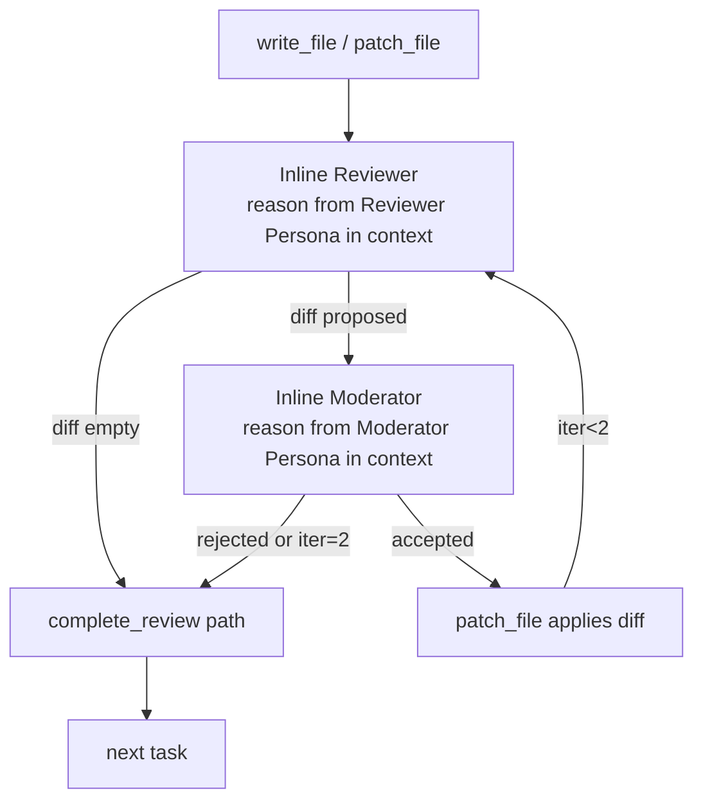

# Inline Persona Review: In-Context Reviewer and Moderator Reasoning

## Raw Requirement

Replace the `query_agent`-based Per-Step Review Sub-Loop, End-of-Skill Review, and Phase 1a
Delegation in `run.skill.md` and `spec.skill.md` with inline persona reasoning. The reviewer,
moderator, and qa-architect role content is pre-loaded into `run.prompt` and `spec.prompt`
via three new template variables (`{{reviewer_role_content}}`, `{{moderator_role_content}}`,
`{{qa_architect_role_content}}`), resolved using the existing `load_role()` function in
`start_run.rs` and `start_spec.rs`. The skill files are updated to instruct the agent to
reason from those personas inline between tool calls — no `query_agent` calls for review,
no sub-agent spawning, no adapter required. `serve.rs` reverts from `new_mcp_with_adapter`
to `new_mcp`, removing the adapter requirement at stdio server startup. Phase 1a delegation
(`query_agent` with role `"run"`) is removed from `run.skill.md`. The `complete_review`
calls and write-review-compliance enforcement are unchanged. `query_agent` remains registered
as a tool but is no longer called by the standard skill workflow.

## Description

The three review-related `query_agent` calls in `run.skill.md` (Per-Step Reviewer,
Per-Step Moderator, End-of-Skill QA Architect) and equivalent calls in `spec.skill.md`
spawn isolated sub-agent loops that use moeb's locally configured AI adapter. When moeb
runs as an MCP server driven by an external coordinator such as Claude Code, this adapter
may be unconfigured or point to a different provider, causing failures. The external
coordinator is already a frontier LLM capable of multi-perspective reasoning within its
own context window.

This specification eliminates the adapter dependency for review by pre-loading reviewer,
moderator, and QA-architect role content into the rendered prompt via three new template
variables injected by `start_run.rs` and `start_spec.rs`. The updated skill files instruct
the agent to reason from those personas inline — no tool calls, no sub-agent spawns.
`serve.rs` reverts to `new_mcp`, starting the stdio MCP server without requiring a
configured adapter. Phase 1a delegation is removed; the agent performs all analysis inline
in Phases 2–3.

The `complete_review` tool calls, write-review-compliance enforcement, StepMetric recording,
signal processing, and metrics persistence are all unchanged — only the mechanism for
obtaining reviewer/moderator verdicts changes from a `query_agent` call to inline reasoning.



## Backlinks

### Parents

| Label | Path | Purpose |
|-------|------|---------|
| Harness README | README.md | Root index |
| Review Adapter Wiring and QA Clarity | specifications/moeb/moeb.review-adapter-wiring-and-qa-clarity.md | Introduced eager adapter build in serve.rs — Decision 1 superseded here |
| Composable Review Wrapper | specifications/moeb/moeb.composable-review-wrapper.md | Established the Reviewer→Moderator framework preserved by inline reasoning |
| Reviewer and Moderator Roles | specifications/moeb/moeb.reviewer-and-moderator-roles.md | Role files whose content this spec pre-loads into the prompt |
| Write→Review Compliance Enforcement | specifications/moeb/moeb.write-review-compliance.md | complete_review calls and verify_rubrics gate are unchanged |
| Agent Skills | specifications/moeb/moeb.agent-skills.md | Skill file system governing run.skill.md and spec.skill.md |
| Agent Roles | specifications/moeb/moeb.agent-roles.md | Role file system whose load_role() function is reused here |
| Query Agent Tool | specifications/moeb/moeb.query-agent-tool.md | query_agent tool remains registered; this spec removes it from standard skill usage |

## Steps

### Step 1 — Add role template variables to `start_run.rs`

File: `src/moeb/src/tools/start_run.rs`

After the existing `role_content` load (`let role_content = crate::skills::load_role(&moeb_dir, &role_name);`), add three additional loads:

```rust
let reviewer_role = crate::skills::load_role(&moeb_dir, "reviewer");
let moderator_role = crate::skills::load_role(&moeb_dir, "moderator");
let qa_architect_role = crate::skills::load_role(&moeb_dir, "qa-architect");
```

In the `prompt` template substitution chain, append three replacements after the existing
`.replace("{{metrics_degradation_margin}}", &metrics_margin_str)`:

```rust
.replace("{{reviewer_role_content}}", &reviewer_role)
.replace("{{moderator_role_content}}", &moderator_role)
.replace("{{qa_architect_role_content}}", &qa_architect_role)
```

### Step 2 — Add role template variables to `start_spec.rs`

File: `src/moeb/src/tools/start_spec.rs`

After the existing `role_content` load (`let role_content = crate::skills::load_role(&moeb_dir, "spec");`), add:

```rust
let reviewer_role = crate::skills::load_role(&moeb_dir, "reviewer");
let moderator_role = crate::skills::load_role(&moeb_dir, "moderator");
let qa_architect_role = crate::skills::load_role(&moeb_dir, "qa-architect");
```

In the `prompt` substitution chain, append after `.replace("{{input}}", requirement)`:

```rust
.replace("{{reviewer_role_content}}", &reviewer_role)
.replace("{{moderator_role_content}}", &moderator_role)
.replace("{{qa_architect_role_content}}", &qa_architect_role)
```

### Step 3 — Add persona sections to `run.prompt`

File: `src/prompts/run.prompt`

Append the following three sections at the end of the file, after the existing HARD RULES block:

```
=== Reviewer Persona ===
{{reviewer_role_content}}

=== Moderator Persona ===
{{moderator_role_content}}

=== QA Architect Persona ===
{{qa_architect_role_content}}
```

### Step 4 — Add persona sections to `spec.prompt`

File: `src/prompts/spec.prompt`

Append the following three sections at the end of the file, after the `{{input}}` line:

```
=== Reviewer Persona ===
{{reviewer_role_content}}

=== Moderator Persona ===
{{moderator_role_content}}

=== QA Architect Persona ===
{{qa_architect_role_content}}
```

### Step 5 — Rewrite Per-Step Review Sub-Loop in `run.skill.md`

File: `src/moeb/internal/skills/run.skill.md`

**5a. Remove Phase 1a.** Delete the entire `## Phase 1a — Delegate (optional)` section
(from the `## Phase 1a` heading line through the closing paragraph before `## Phase 2`).
Phase 2 (`## Phase 2 — Scope`) must immediately follow Phase 1 in the updated file.

**5b. Replace step 1 of the Per-Step Review Sub-Loop (Reviewer call).**

Replace:
```
1. **Reviewer call.** Call `query_agent` with:
   - `role`: `"reviewer"`
   - `prompt`: Provide the artifact path, its current content, the step intent
     (title + description), rubric criteria (explicit rows from the spec's
     `## Rubric / ### Structured` table applicable to this artifact; empty string
     if none apply), and the iteration history as JSON.
     Instruct the Reviewer: "Propose a unified diff of improvements if any are
     needed. Return an empty string if the artifact fully satisfies all criteria."
   - `expected_response_type`: `"diff"`
```

with:

```
1. **Inline Reviewer.** Without calling any tool, adopt the **Reviewer Persona**
   pre-loaded in your context. Evaluate the artifact against the step intent and the
   applicable rubric criteria. Produce a unified diff if improvements are needed, or
   an empty string if the artifact fully satisfies all criteria. Hold this result in
   working memory — do not output it as a standalone message before continuing.
```

**5c. Replace step 3 of the Per-Step Review Sub-Loop (Moderator call).**

Replace:
```
3. **Moderator call.** Call `query_agent` with:
   - `role`: `"moderator"`
   - `prompt`: Provide the artifact's current content, the proposed diff from step 1,
     the rubric criteria, and the iteration history as JSON.
     Instruct the Moderator: "Score the expected quality improvement from this diff on
     a scale 0.0–1.0. Accept only if the change is a genuine, measurable improvement
     (not stylistic or speculative). Return JSON: { \"accepted\": bool,
     \"delta_score\": float, \"rationale\": string }"
   - `expected_response_type`: `"json"`
```

with:

```
3. **Inline Moderator.** Without calling any tool, adopt the **Moderator Persona**
   pre-loaded in your context. Evaluate the proposed diff against the artifact content,
   rubric criteria, and iteration history. Produce a JSON verdict:
   `{ "accepted": bool, "delta_score": float, "rationale": string }`. Hold this result
   in working memory.
```

### Step 6 — Replace End-of-Skill QA Review in `run.skill.md`

File: `src/moeb/internal/skills/run.skill.md`

In the `## Phase — End-of-Skill Review` section, replace:

```
Call `query_agent` with:
- `role`: `"qa-architect"`
- `prompt`: Provide the paths and contents of all artifacts produced in this run,
  the accumulated StepMetrics as JSON, and the active specification's full `## Rubric`
  section. Instruct the QA Architect to return a ReviewSignalReport JSON as defined
  in `qa-architect.role.md`.
- `expected_response_type`: `"json"`
```

with:

```
Without calling any tool, adopt the **QA Architect Persona** pre-loaded in your context.
Evaluate the paths and contents of all artifacts produced in this run, the accumulated
StepMetrics as JSON, and the active specification's full `## Rubric` section. Produce a
ReviewSignalReport JSON matching the schema defined in the QA Architect Persona. Hold
the result in working memory and continue with parsing and signal processing below.
```

### Step 7 — Replace Per-Step Review Sub-Loops in `spec.skill.md`

File: `src/moeb/internal/skills/spec.skill.md`

**7a. Spec-file sub-loop (Phase 4 review).**

Replace step 1:
```
1. **Reviewer call.** Call `query_agent` with:
   - `role`: `"reviewer"`
   - `prompt`: Provide the spec file path, its current content, the specification title
     and description as step intent, the full `## Rubric / ### Structured` table as
     rubric criteria, and `[]` as iteration history.
     Instruct the Reviewer: "Propose a unified diff of improvements if any are needed.
     Return an empty string if the artifact fully satisfies all criteria."
   - `expected_response_type`: `"diff"`
```

with:

```
1. **Inline Reviewer.** Without calling any tool, adopt the **Reviewer Persona**
   pre-loaded in your context. Evaluate the spec file against its `## Rubric / ###
   Structured` criteria and the specification title and description as step intent.
   Produce a unified diff if improvements are needed, or an empty string if the
   artifact fully satisfies all criteria. Hold this result in working memory.
```

Replace step 3:
```
3. **Moderator call.** Call `query_agent` with:
   - `role`: `"moderator"`
   - `prompt`: Provide the spec file content, the proposed diff, the rubric criteria,
     and the iteration history as JSON.
     Instruct the Moderator: "Score the expected quality improvement from this diff on
     a scale 0.0–1.0. Accept only if the change is a genuine, measurable improvement.
     Return JSON: { \"accepted\": bool, \"delta_score\": float, \"rationale\": string }"
   - `expected_response_type`: `"json"`
```

with:

```
3. **Inline Moderator.** Without calling any tool, adopt the **Moderator Persona**
   pre-loaded in your context. Evaluate the proposed diff against the spec content,
   rubric criteria, and iteration history. Produce a JSON verdict:
   `{ "accepted": bool, "delta_score": float, "rationale": string }`. Hold this result
   in working memory.
```

**7b. README-patch sub-loop (Phase 6 review).**

Replace step 1:
```
1. **Reviewer call.** Call `query_agent` with:
   - `role`: `"reviewer"`
   - `prompt`: Provide the README path, its current content, step intent
     "README index row for <title> added to ### <domain> section", empty rubric
     criteria, and `[]` as iteration history.
     Instruct the Reviewer: "Propose a unified diff if the row is incorrectly formatted
     or missing. Return an empty string if the row is correct."
   - `expected_response_type`: `"diff"`
```

with:

```
1. **Inline Reviewer.** Without calling any tool, adopt the **Reviewer Persona**
   pre-loaded in your context. Evaluate the README patch for correctness: the row must
   be correctly formatted and present in the right `### <domain>` section. Produce a
   unified diff if the row is incorrectly formatted or missing, or an empty string if
   the row is correct. Hold this result in working memory.
```

Replace step 3:
```
3. **Moderator call.** Call `query_agent` with:
   - `role`: `"moderator"`
   - `prompt`: Provide the README content, proposed diff, rubric criteria, and iteration
     history. Instruct the Moderator to score and return JSON.
   - `expected_response_type`: `"json"`
```

with:

```
3. **Inline Moderator.** Without calling any tool, adopt the **Moderator Persona**
   pre-loaded in your context. Evaluate the proposed diff against the README content,
   rubric criteria, and iteration history. Produce a JSON verdict:
   `{ "accepted": bool, "delta_score": float, "rationale": string }`. Hold this result
   in working memory.
```

### Step 8 — Replace End-of-Skill QA Review in `spec.skill.md`

File: `src/moeb/internal/skills/spec.skill.md`

In the `## Phase — End-of-Skill Review` section, replace:

```
Call `query_agent` with:
- `role`: `"qa-architect"`
- `prompt`: Provide the spec file path, README.md path, their contents, and the
  accumulated StepMetrics as JSON. Instruct the QA Architect to return a
  ReviewSignalReport JSON as defined in `qa-architect.role.md`.
- `expected_response_type`: `"json"`
```

with:

```
Without calling any tool, adopt the **QA Architect Persona** pre-loaded in your context.
Evaluate the spec file, README.md, their contents, and the accumulated StepMetrics as
JSON. Produce a ReviewSignalReport JSON matching the schema defined in the QA Architect
Persona. Hold the result in working memory and continue with parsing and signal processing
below.
```

### Step 9 — Revert `serve.rs` to `new_mcp`

File: `src/moeb/src/commands/serve.rs`

In the `Transport::Stdio` arm, replace the adapter-eager block:

```rust
let session = McpSession::new(working_dir);
let state = Arc::clone(&session.state);
let adapter = {
    use crate::ports::AdapterFactoryPort;
    use crate::trace::{FileContentMode, TraceCommand, TraceConfig, TraceContext};
    let noop_trace = Arc::new(TraceContext::new(TraceConfig {
        command: TraceCommand::Run,
        spec: String::new(),
        adapter: String::new(),
        model: String::new(),
        retention: 0,
        file_content_mode: FileContentMode::Embed,
    }));
    crate::adapters::DefaultAdapterFactory.build(noop_trace)?
};
let executor = RealToolExecutor::new_mcp_with_adapter(state, adapter);
let mut server = McpServer::new(session, executor);
```

with:

```rust
let session = McpSession::new(working_dir);
let state = Arc::clone(&session.state);
let executor = RealToolExecutor::new_mcp(Arc::clone(&state));
let mut server = McpServer::new(session, executor);
```

Remove any `use` imports in the file that are no longer referenced after this change
(`AdapterFactoryPort`, trace types). Retain the `use std::sync::Arc;` import and all
other imports that remain in use.

## Decisions

### Decision 1 — Inline reasoning over sub-agent spawning for review

**Rationale:** In MCP mode, the external coordinator (Claude Code) is already a frontier
LLM running the skill. Spawning a sub-agent via `query_agent` introduces a dependency on
moeb's locally configured adapter, which may be unconfigured or point to an unsuitable
provider. Modern frontier LLMs are capable of multi-perspective reasoning within a single
context window; isolation in a separate context window is not required for review quality.
Pre-loading role content as template variables keeps the role files as the single source
of truth while making them available without tool calls.

**Rejected alternatives:**
- MCP `sampling/createMessage`: adds significant protocol and Rust complexity, requires
  the client to declare the sampling capability, and changes the server's I/O architecture.
  Inline reasoning achieves the same outcome with no new infrastructure.
- Configure adapter to anthropic in moeb config: requires API key management the user
  should not need when running moeb as an MCP server driven by a subscribed AI client.
- Keep sub-agents, add `--no-review` flag to `moeb serve`: masks the problem rather than
  fixing it; loses review quality for MCP users entirely.

**Consequences:** Reviewer, moderator, and QA-architect reasoning occurs within the running
agent's context window. The agent has access to full run history when reviewing, which
may improve review quality by providing more context. The context window grows by the
combined size of the three role files (approximately 3 KB), which is negligible for
frontier model context limits.

### Decision 2 — Remove Phase 1a delegation

**Rationale:** Phase 1a was optional and used `query_agent` with role `"run"` to
parallelise independent analysis tasks. In MCP mode this also required the configured
adapter. Since Phase 1a was marked optional and the agent can always perform analysis
inline in Phases 2–3, removing it simplifies the skill without any loss of mandatory
capability.

**Rejected alternatives:**
- Mark Phase 1a as CLI-only with a conditional: adds branching to the skill, conflicting
  with the principle that skill files describe a single coherent workflow without
  transport-specific logic.

**Consequences:** The standard run skill no longer delegates analysis sub-tasks via
`query_agent`. Custom skills authored by users may still use `query_agent` for delegation
if an adapter is configured; `query_agent` remains in the tool registry.

### Decision 3 — Supersede eager adapter wiring in `serve.rs`

**Rationale:** The eager `DefaultAdapterFactory.build()` call in `serve.rs` was introduced
by `moeb.review-adapter-wiring-and-qa-clarity` Decision 1 to supply `query_agent` with a
wired adapter at MCP server startup. Since `query_agent` is no longer called by the
standard skill workflow for review, this startup requirement is removed. `moeb serve`
now starts successfully regardless of adapter configuration, which is the correct behaviour
when the external coordinator provides all LLM reasoning.

**Rejected alternatives:**
- Keep `new_mcp_with_adapter` as a fallback for custom skills: adds complexity with no
  benefit to the standard workflow. Custom skill authors who need `query_agent` can
  configure an adapter; the kernel need not enforce this at startup.

**Consequences:** `moeb serve --transport stdio` no longer fails at startup when no adapter
is configured. If a custom skill calls `query_agent`, `resolve_adapter()` is invoked
on-demand and will return a clear "No adapter configured. Run `moeb use <adapter>` first."
error if the adapter is absent.

## Rubric

### Structured

| Name | Description | Threshold | Pass Condition |
|------|-------------|-----------|----------------|
| `context-budget` | All implementation files created or modified during this run are ≤ 300 lines; `*_tests.rs` companion files are ≤ 400 lines | Zero over-budget files | Agent checks line counts of every file written; refactors any over-budget file before marking pass |
| `binary-builds` | `cargo build --release` completes without error | Zero errors | CI build exits 0 |
| `all-tests-pass` | `cargo test` completes without failure | Zero failures | `cargo test` exits 0 |
| `no-test-regression` | All tests present before this change pass without modification to test code | Zero failures | `cargo test` exits 0; no test file edited beyond compilation-required changes |
| `thin-kernel` | New Rust code in `start_run.rs` and `start_spec.rs` is limited to `load_role` calls and `.replace()` chain additions; `serve.rs` change removes a code block and adds nothing | Zero workflow logic in new Rust | Code review: every new line in start_run.rs and start_spec.rs is a `load_role` call or `.replace()`; serve.rs diff only removes lines |
| `skill-update-completeness` | `run.skill.md` has no Phase 1a section and no `query_agent` calls with role `"reviewer"`, `"moderator"`, or `"qa-architect"`; `spec.skill.md` has no `query_agent` calls with those roles | Zero remaining sub-agent review calls | grep for `query_agent` across both skill files returns zero matches for reviewer, moderator, qa-architect roles; Phase 1a heading absent from run.skill.md |
| `persona-content-reachable` | The three persona sections (`{{reviewer_role_content}}`, `{{moderator_role_content}}`, `{{qa_architect_role_content}}`) appear in `run.prompt` and `spec.prompt`; `start_run.rs` and `start_spec.rs` inject all three variables | Both templates updated, both Rust files updated | grep for `reviewer_role_content` in run.prompt, spec.prompt, start_run.rs, start_spec.rs returns matches in all four files |
| `serve-no-adapter-at-startup` | The `Transport::Stdio` arm of `serve.rs` does not call `DefaultAdapterFactory.build()` at startup | Zero adapter build calls in stdio arm | Code review: Transport::Stdio arm uses `RealToolExecutor::new_mcp`; no `DefaultAdapterFactory`, `AdapterFactoryPort`, or noop TraceContext construction in that arm |

### Qualitative

- Each inline reviewer instruction must reference the persona by its heading name
  ("Reviewer Persona", "Moderator Persona", "QA Architect Persona") matching the section
  headers added to the prompt templates, so the agent can locate them in context.
- The inline moderator JSON format (`{ "accepted": bool, "delta_score": float, "rationale": string }`)
  must be identical to the existing format so downstream parsing logic in the skill is unchanged.
- Phase 1a removal must leave Phase 2 (Scope) as the immediately following section after
  Phase 1 (Plan) in the updated `run.skill.md`, with no gap or orphaned content.
- The `complete_review` call at the end of each Per-Step Review Sub-Loop must remain
  present and unchanged in both skill files.
