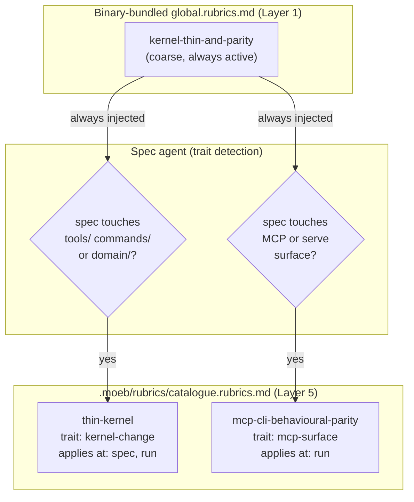

# Kernel Thinness and MCP/CLI Parity Rubrics

## Raw Requirement

A new rubric(s) for the project set contained in .moeb/rubrics. The rubric(s) should cover
two related concerns:

1. Kernel/MCP behavioural parity: the kernel (Rust binary) and the MCP server must expose
   the same observable behaviour for equivalent operations. Where the kernel performs an
   action, the MCP layer must produce the same result through its own surface.

2. Thin kernel principle: the kernel must remain a thin orchestration layer. Adding logic
   directly in Rust is only permitted when the capability genuinely cannot be achieved
   through AI infrastructure (skills, tools, agents). If a capability can be delegated to a
   skill, tool, or agent it MUST be. Only when no AI-infrastructure path exists is direct
   Rust implementation allowed.

## Description

The binary-bundled `global.rubrics.md` carries a coarse `kernel-thin-and-parity` criterion
that fires on every command in every project. That baseline criterion is deliberately broad;
it cannot encode project-specific test conditions or nuanced pass/fail definitions without
coupling the binary to the project.

This specification adds two targeted entries to the project-specific
`.moeb/rubrics/catalogue.rubrics.md` to complement that baseline with precise, testable
criteria:

- **`thin-kernel`** — a trait-keyed criterion (trait: `kernel-change`) selected whenever a
  spec adds or modifies Rust in `tools/`, `commands/`, or `domain/`. It requires that any
  new Rust code be either a primitive operation wrapper (filesystem, git, HTTP) or a thin
  dispatcher with zero workflow branching. If the same result can be achieved by updating a
  skill file, doing so is mandatory. Applies at both `spec` (design check) and `run`
  (implementation check).

- **`mcp-cli-behavioural-parity`** — a trait-keyed criterion (trait: `mcp-surface`) selected
  whenever a spec touches the MCP or serve surface. It requires that the observable outcome
  of every operation is identical whether invoked through the CLI agent loop or the MCP
  server: same file mutations, same tool result format, same rendered prompt. Applies at
  `run` (implementation check).

Both catalogue entries are additive and do not supersede the binary-bundled
`kernel-thin-and-parity` global baseline.



## Backlinks

### Parents

| Label | Path | Purpose |
|-------|------|---------|
| Harness README | .moeb/README.md | Root index |
| Rubric System Rationalisation | specifications/harness/harness.rubric-index-rationalisation.md | Defines five-layer model and catalogue format |
| Query Agent Tool | specifications/moeb/moeb.query-agent-tool.md | Introduced kernel-thin-and-parity binary baseline this spec complements |
| MCP Serve / CLI Parity | specifications/moeb/moeb.serve-cli-parity.md | Established the parity requirement this spec formalises as a rubric |

## Steps

### Step 1 — Append `thin-kernel` and `mcp-cli-behavioural-parity` to `.moeb/rubrics/catalogue.rubrics.md`

Read `.moeb/rubrics/catalogue.rubrics.md`. Append two rows to the `## Criteria` table
using `patch_file`. Both rows must be appended in a single `patch_file` call to keep the
diff minimal.

The rows to append are:

```
| `thin-kernel` | New Rust code in tools/, commands/, or domain/ must be either (a) a primitive operation wrapper (filesystem, git, or HTTP with no domain logic) or (b) a thin dispatcher that calls into skills, tools, or agents and returns the result unchanged. Workflow logic — sequencing, conditionals, review loops, retry strategy, branching decisions — must live in skill markdown or role files, not in compiled Rust. If the same capability can be achieved by updating a skill file, that path is mandatory. | Zero workflow-logic functions in new Rust | Spec review: no Step proposes placing sequencing or conditional workflow logic in Rust when a skill-file change would suffice; Run review: every new function in tools/ or commands/ either wraps a single OS/VCS/HTTP call or contains no domain-specific branching | `moeb` | `kernel-change` | `spec, run` | active |
| `mcp-cli-behavioural-parity` | For any operation exposed through both the CLI agent loop and the MCP server, the observable outcome must be identical: same file mutations, same tool result string format, same rendered prompt template. No MCP-only or CLI-only code paths may alter the final output. Any tool registered in the standard registry must be registered in the MCP registry with an identical input schema and result contract. | Zero divergent outcomes | Run review: for every tool added or modified, both ToolRegistry::standard() and the MCP server carry identical registrations; start_run and domain/run.rs render from the same run.prompt template with the same rubric layers; start_spec and domain/spec.rs render from the same spec.prompt template | `moeb` | `mcp-surface` | `run` | active |
```

**Verification:** After patching, read `.moeb/rubrics/catalogue.rubrics.md` and confirm
both rows are present and the table remains well-formed (header row + separator + existing
row + two new rows).

## Decisions

### Decision 1 — Catalogue entries, not additions to the project-level run rubric

**Rationale:** The project-level `run.rubrics.md` applies to every `moeb run` execution
in this project regardless of what the spec concerns. Adding `thin-kernel` and
`mcp-cli-behavioural-parity` there would inject them even for specs that modify only
prompt templates or rubric files — contexts where the criteria are vacuously true and
waste reviewer attention. The catalogue's trait-keyed selection mechanism exists precisely
to avoid this: a spec touching `tools/` gains `thin-kernel` automatically; a spec touching
`mcp/` or `serve` gains `mcp-cli-behavioural-parity` automatically; a rubric-file-only
spec gains neither.

**Rejected alternatives:**
- Add both to `run.rubrics.md`: always active, noisy on irrelevant specs, cannot be
  suppressed without editing the project rubric file.
- Add both to `global.rubrics.md` (binary): couples the binary to project-specific pass
  conditions; binary rubrics should be universally applicable across all moeb projects.
- Add a single combined entry: combining distinct concerns into one criterion makes
  pass/fail ambiguous when one concern passes and the other fails.

**Consequences:** Spec agents must detect `kernel-change` and `mcp-surface` traits from
the requirement and include the relevant catalogue entries in the active rubric set. If an
agent fails to detect the trait, the criterion is not applied — this is the accepted
trade-off of a trait-driven catalogue versus always-active rules.

### Decision 2 — `thin-kernel` applies at both `spec` and `run`; `mcp-cli-behavioural-parity` applies at `run` only

**Rationale:** The thin-kernel principle is a design constraint: a spec that proposes
placing workflow logic in Rust should be corrected before implementation begins. Catching
it at spec-authoring time (`spec`) prevents wasted implementation effort. Parity, by
contrast, is an implementation outcome — it cannot be verified until the code exists — so
it belongs only at `run` time.

**Rejected alternatives:**
- Both at `run` only: misses the opportunity to catch kernel-heavy designs at authoring
  time before implementation.
- Both at `spec` and `run`: applying `mcp-cli-behavioural-parity` at spec time would
  produce vacuous checks against a spec that has not yet produced any code.

**Consequences:** Spec agents applying `thin-kernel` at authoring time must evaluate
proposed Steps against the criterion, not the resulting code. The pass condition for the
`spec` context is necessarily design-level: "no Step proposes workflow logic in Rust."

### Decision 3 — `mcp-surface` and `kernel-change` as the trait identifiers

**Rationale:** Trait names are free-form strings matched by the spec agent. Short,
hyphenated, lowercase identifiers following the pattern already established by `ai-adapter`
(from the existing catalogue entry) are easiest to match and remember. `mcp-surface`
precisely identifies specs that expose new surface area via the MCP server. `kernel-change`
identifies specs that modify compiled Rust in the orchestration layer.

**Rejected alternatives:**
- `mcp`: too broad; could match unrelated MCP documentation specs.
- `rust-kernel`: redundant ("kernel" already implies Rust in this project context);
  `kernel-change` is more action-oriented and matches "a spec that *changes* the kernel."
- A single shared trait for both entries: the two criteria have independent applicability
  (a spec can touch the kernel without touching MCP, and vice versa); a shared trait would
  conflate them.

**Consequences:** Spec agents must be able to infer `kernel-change` from requirements
that mention adding tools, commands, or domain logic; and `mcp-surface` from requirements
that mention serve, MCP, Claude Desktop, or tool registration. This is the same inference
the spec agent already performs for `ai-adapter`.

## Rubric

### Structured

| Name | Description | Threshold | Pass Condition |
|------|-------------|-----------|----------------|
| `no-drift` | The specification does not violate any decision recorded in a linked parent specification | Zero contradictions | Manual review of every decision in every parent spec listed in Backlinks |
| `spec-schema-compliance` | All required frontmatter fields and body sections are present and correctly ordered | 100% of required fields and sections | Validation in domain/spec.rs exits 0 during moeb spec |
| `catalogue-well-formed` | After Step 1, catalogue.rubrics.md contains valid table rows with all seven required columns (id, Name, Description, Threshold, Pass Condition, Domain, Traits, Applies At, Status) populated for both new entries | Both rows complete and parseable | Read file after patch; confirm header + separator + all rows present; no column missing |
| `additive-only` | This spec adds rows to catalogue.rubrics.md and modifies no other file | Zero other files modified | grep_files and write_file call list confirm only catalogue.rubrics.md was written |

### Qualitative

- The `thin-kernel` pass condition distinguishes primitive-operation wrappers (acceptable
  Rust) from domain-branching logic (must live in skill markdown). The boundary is clear:
  a function that calls one OS/VCS/HTTP primitive and returns its result is acceptable; a
  function containing an `if` or `match` that discriminates on domain concepts (spec slug,
  adapter name, review verdict) is not.
- The `mcp-cli-behavioural-parity` pass condition is verifiable by inspection of the two
  registry sites (`tools/mod.rs` and the MCP server) without running the binary.
- Neither new entry contradicts the binary-bundled `kernel-thin-and-parity` baseline; they
  narrow and operationalise it for specific spec contexts.
