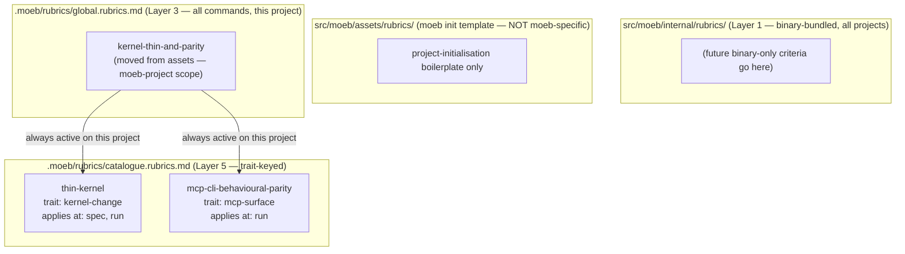

# Kernel Thinness and MCP/CLI Parity Rubrics

## Raw Requirement

A new rubric(s) for the project set contained in .moeb/rubrics. The rubric(s) should cover
two related concerns:

1. Kernel/MCP behavioural parity: the kernel (Rust binary) and the MCP server must expose
   the same observable behaviour for equivalent operations. Where the kernel performs an
   action, the MCP layer must produce the same result through its own surface.

2. Thin kernel principle: the kernel must remain a thin orchestration layer. Adding logic
   directly in Rust is only permitted when the capability genuinely cannot be achieved
   through AI infrastructure (skills, tools, agents). If a capability can be delegated to a
   skill, tool, or agent it MUST be. Only when no AI-infrastructure path exists is direct
   Rust implementation allowed.

## Description

This specification makes three changes to the rubric system for the moeb project.

**Correction: misplaced `kernel-thin-and-parity` criterion.** The `moeb.query-agent-tool`
spec added `kernel-thin-and-parity` to `src/moeb/assets/rubrics/global.rubrics.md`. That
file is the template that `moeb init` copies into newly initialised user projects — it is
not the right home for a moeb-design-specific criterion. The criterion does not apply to
arbitrary moeb-governed projects; it applies only when moeb is being developed against
itself. It must be removed from `assets/rubrics/global.rubrics.md` and placed instead in
`.moeb/rubrics/global.rubrics.md` (the project-scope Layer 3 file, which governs all
commands run against this project only). This file does not currently exist and must be
created.

**Policy: internal binary rubrics go to `src/moeb/internal/rubrics/`, not `src/moeb/assets/rubrics/`.** The
repository has two distinct rubric-bearing directories under `src/moeb/`:

- `src/moeb/assets/rubrics/` — templates materialised into user projects during
  `moeb init`. Content here is project-initialisation boilerplate, not moeb-specific logic.
- `src/moeb/internal/rubrics/` — binary-bundled baseline rubrics loaded by the kernel at
  runtime and injected via `{{command_rubrics}}`. These apply to all moeb-governed projects
  and are never copied during init.

Future specifications that add binary-bundled baseline criteria must target
`src/moeb/internal/rubrics/`, not `src/moeb/assets/rubrics/`.

**Two new project-scope catalogue entries.** Two trait-keyed criteria are added to
`.moeb/rubrics/catalogue.rubrics.md` to provide precise, testable rubric coverage
complementing the project-global `kernel-thin-and-parity`:

- **`thin-kernel`** — trait `kernel-change`, applies at `spec, run`. Selected whenever a
  spec adds or modifies Rust in `tools/`, `commands/`, or `domain/`. Requires that any new
  Rust code be either a primitive operation wrapper (filesystem, git, HTTP) or a thin
  dispatcher with zero workflow branching. If the capability can be achieved by updating a
  skill file, that path is mandatory.

- **`mcp-cli-behavioural-parity`** — trait `mcp-surface`, applies at `run`. Selected
  whenever a spec touches the MCP or serve surface. Requires that the observable outcome
  of every operation is identical whether invoked through the CLI agent loop or the MCP
  server: same file mutations, same tool result format, same rendered prompt.



## Backlinks

### Parents

| Label | Path | Purpose |
|-------|------|---------|
| Harness README | .moeb/README.md | Root index |
| Rubric System Rationalisation | specifications/harness/harness.rubric-index-rationalisation.md | Defines five-layer model and catalogue format |
| Moeb Init Rubric Storage Boundary | specifications/harness/harness.init-rubric-storage-boundary.md | Defines init rubric layout; assets/ vs internal/ boundary established here |
| Query Agent Tool | specifications/moeb/moeb.query-agent-tool.md | Added kernel-thin-and-parity to wrong location (assets); this spec corrects that |
| MCP Serve / CLI Parity | specifications/moeb/moeb.serve-cli-parity.md | Established the parity requirement this spec formalises as a rubric |

## Steps

### Step 1 — Create `.moeb/rubrics/global.rubrics.md` with `kernel-thin-and-parity`

Create the file `.moeb/rubrics/global.rubrics.md` using `write_file`. This is the
project-scope Layer 3 rubric file for the moeb project; it does not currently exist.

Content:

```markdown
## Project global rubric criteria

The following criteria apply to every `moeb` command executed in this project. Include them
in your `verify_rubrics` call along with any criteria in the specification's own `## Rubric`
section.

| Name | Description | Threshold | Pass Condition |
|------|-------------|-----------|----------------|
| `kernel-thin-and-parity` | No domain-specific or workflow-specific coordination logic may be placed in kernel Rust code when it can live in skill markdown or role files. Every tool registered in the CLI tool registry must also be registered in the MCP stdio server tool list. | Zero violations | Spec review: no proposed step places review/coordination logic in Rust; Run review: grep confirms no skill-specific logic in kernel tools; tool lists in tools/mod.rs and the MCP server match exactly |
```

### Step 2 — Remove `kernel-thin-and-parity` from `src/moeb/assets/rubrics/global.rubrics.md`

Read `src/moeb/assets/rubrics/global.rubrics.md`. The file currently contains only the
`kernel-thin-and-parity` row in the criteria table. Remove that row using `patch_file`,
leaving the table header and separator intact so the file remains structurally valid.

After patching the file must contain:

```markdown
| Name | Description | Threshold | Pass Condition |
|------|-------------|-----------|----------------|
```

**Verification:** Read `src/moeb/assets/rubrics/global.rubrics.md` after patching and
confirm the `kernel-thin-and-parity` row is absent and the table header remains.

### Step 3 — Append `thin-kernel` and `mcp-cli-behavioural-parity` to `.moeb/rubrics/catalogue.rubrics.md`

Read `.moeb/rubrics/catalogue.rubrics.md`. Append two rows to the `## Criteria` table
using `patch_file`. Both rows must be appended in a single `patch_file` call.

The rows to append:

```
| `thin-kernel` | New Rust code in tools/, commands/, or domain/ must be either (a) a primitive operation wrapper (filesystem, git, or HTTP with no domain logic) or (b) a thin dispatcher that calls into skills, tools, or agents and returns the result unchanged. Workflow logic — sequencing, conditionals, review loops, retry strategy, branching decisions — must live in skill markdown or role files, not in compiled Rust. If the same capability can be achieved by updating a skill file, that path is mandatory. | Zero workflow-logic functions in new Rust | Spec review: no Step proposes placing sequencing or conditional workflow logic in Rust when a skill-file change would suffice; Run review: every new function in tools/ or commands/ either wraps a single OS/VCS/HTTP call or contains no domain-specific branching | `moeb` | `kernel-change` | `spec, run` | active |
| `mcp-cli-behavioural-parity` | For any operation exposed through both the CLI agent loop and the MCP server, the observable outcome must be identical: same file mutations, same tool result string format, same rendered prompt template. No MCP-only or CLI-only code paths may alter the final output. Any tool registered in the standard registry must be registered in the MCP registry with an identical input schema and result contract. | Zero divergent outcomes | Run review: for every tool added or modified, both ToolRegistry::standard() and the MCP server carry identical registrations; start_run and domain/run.rs render from the same run.prompt template with the same rubric layers; start_spec and domain/spec.rs render from the same spec.prompt template | `moeb` | `mcp-surface` | `run` | active |
```

**Verification:** After patching, read `.moeb/rubrics/catalogue.rubrics.md` and confirm
both rows are present and the table remains well-formed (header + separator + existing row
+ two new rows).

## Decisions

### Decision 1 — `kernel-thin-and-parity` moves to project scope, not to `internal/rubrics/`

**Rationale:** `kernel-thin-and-parity` enforces a design principle specific to moeb's own
architecture. It has no meaning for a project that uses moeb as a tool — a Rails app
governed by moeb has no kernel, no skill files, and no MCP server of its own. Placing it
in `internal/rubrics/global.rubrics.md` (binary-bundled, all projects) would inject an
irrelevant criterion into every project that runs moeb. Placing it in
`.moeb/rubrics/global.rubrics.md` (project scope, Layer 3) confines it to executions
against moeb itself, which is the correct scope.

**Rejected alternatives:**
- Retain it in `assets/rubrics/global.rubrics.md`: this file is copied into user projects
  during `moeb init` and is not the right vehicle for runtime-injected criteria at all;
  the placement in assets was itself the bug being corrected.
- Move it to `internal/rubrics/global.rubrics.md`: would apply to all moeb-governed
  projects, not just moeb's own development; violates the moeb-specificity of the
  criterion.
- Move it to `.moeb/rubrics/run.rubrics.md` (run-only): the criterion applies at both
  `spec` authoring time (catch kernel-heavy designs early) and `run` time; a run-only
  file would lose the spec-time gate.

**Consequences:** Future work on other moeb-governed projects will not see
`kernel-thin-and-parity` injected into their rubric set. Any moeb-project that needs a
comparable criterion must add it to its own `.moeb/rubrics/global.rubrics.md`.

### Decision 2 — Binary-bundled internal rubrics belong in `src/moeb/internal/rubrics/`, not `src/moeb/assets/rubrics/`

**Rationale:** The `assets/` directory serves one purpose: providing template files that
`moeb init` materialises into a new user project. Putting runtime-injected criteria there
was a category error — the files are treated as init templates by the kernel, not as
runtime-injected rubric layers. `internal/` is the correct home for binary-bundled files
that the kernel reads at runtime without copying them to the user's project. This
distinction is load-bearing: criteria placed in `assets/` end up in every new project's
`.moeb/rubrics/` as project-editable files, undermining the binary-baseline layer model.

**Rejected alternatives:**
- Keep using `assets/` for binary-bundled criteria: perpetuates the category error and
  causes every `moeb init` to seed user projects with criteria that may be irrelevant or
  wrong for their context.

**Consequences:** All future specifications that add binary-bundled baseline rubric
criteria (Layer 1 global or Layer 2 command) must target `src/moeb/internal/rubrics/`,
not `src/moeb/assets/rubrics/`. The harness README and spec-schema documentation should
be updated to reflect this when next revised.

### Decision 3 — Catalogue entries for `thin-kernel` and `mcp-cli-behavioural-parity`, not additions to the project run rubric

**Rationale:** The project-level `run.rubrics.md` applies to every `moeb run` execution
in this project regardless of what the spec concerns. Adding `thin-kernel` and
`mcp-cli-behavioural-parity` there would inject them even for specs that modify only
prompt templates or rubric files — contexts where the criteria are vacuously true and
waste reviewer attention. The catalogue's trait-keyed selection mechanism exists precisely
to avoid this: a spec touching `tools/` gains `thin-kernel` automatically; a spec touching
`mcp/` or `serve` gains `mcp-cli-behavioural-parity` automatically; a rubric-file-only
spec gains neither.

**Rejected alternatives:**
- Add both to `run.rubrics.md`: always active, noisy on irrelevant specs.
- Fold both into the project-global `kernel-thin-and-parity` row: a single row mixing
  two distinct concerns makes pass/fail ambiguous when one passes and the other fails.

**Consequences:** Spec agents must detect `kernel-change` and `mcp-surface` traits from
the requirement and include the relevant catalogue entries in the active rubric set.

### Decision 4 — `thin-kernel` applies at both `spec` and `run`; `mcp-cli-behavioural-parity` applies at `run` only

**Rationale:** The thin-kernel principle is a design constraint: a spec that proposes
placing workflow logic in Rust should be corrected before implementation begins. Catching
it at spec-authoring time (`spec`) prevents wasted implementation effort. Parity is an
implementation outcome — it cannot be verified until code exists — so it belongs only at
`run` time.

**Rejected alternatives:**
- Both at `run` only: misses the opportunity to catch kernel-heavy designs at authoring
  time.
- `mcp-cli-behavioural-parity` at `spec` and `run`: applying it at spec time produces
  vacuous checks against a spec that has not yet produced any code.

**Consequences:** Spec agents applying `thin-kernel` at authoring time evaluate proposed
Steps against the criterion, not the resulting code. The pass condition at `spec` context
is design-level: "no Step proposes workflow logic in Rust."

## Rubric

### Structured

| Name | Description | Threshold | Pass Condition |
|------|-------------|-----------|----------------|
| `no-drift` | The specification does not violate any decision recorded in a linked parent specification | Zero contradictions | Manual review of every decision in every parent spec listed in Backlinks |
| `spec-schema-compliance` | All required frontmatter fields and body sections are present and correctly ordered | 100% of required fields and sections | Validation in domain/spec.rs exits 0 during moeb spec |
| `project-global-created` | `.moeb/rubrics/global.rubrics.md` is created with kernel-thin-and-parity as its sole criterion row | File exists with correct table structure | Read file after Step 1; header + separator + exactly one data row containing kernel-thin-and-parity |
| `assets-global-cleaned` | `kernel-thin-and-parity` row is absent from `src/moeb/assets/rubrics/global.rubrics.md` after Step 2 | Zero data rows in that file | Read file after Step 2; only header and separator remain |
| `catalogue-well-formed` | After Step 3, catalogue.rubrics.md contains valid table rows for both new entries with all required columns populated | Both rows complete and parseable | Read file after patch; confirm header + separator + all rows present; no column missing |
| `files-changed` | Exactly three files are written: `.moeb/rubrics/global.rubrics.md` (created), `src/moeb/assets/rubrics/global.rubrics.md` (patched), `.moeb/rubrics/catalogue.rubrics.md` (patched) | Exactly three files | write_file and patch_file call list matches this set; no other file modified |

### Qualitative

- The `thin-kernel` pass condition distinguishes primitive-operation wrappers (acceptable
  Rust) from domain-branching logic (must live in skill markdown). The boundary is clear:
  a function that calls one OS/VCS/HTTP primitive and returns its result is acceptable; a
  function containing an `if` or `match` that discriminates on domain concepts (spec slug,
  adapter name, review verdict) is not.
- The `mcp-cli-behavioural-parity` pass condition is verifiable by inspection of the two
  registry sites (`tools/mod.rs` and the MCP server) without running the binary.
- After this spec is implemented, `grep_files` for `kernel-thin-and-parity` in
  `src/moeb/assets/` returns zero matches.
