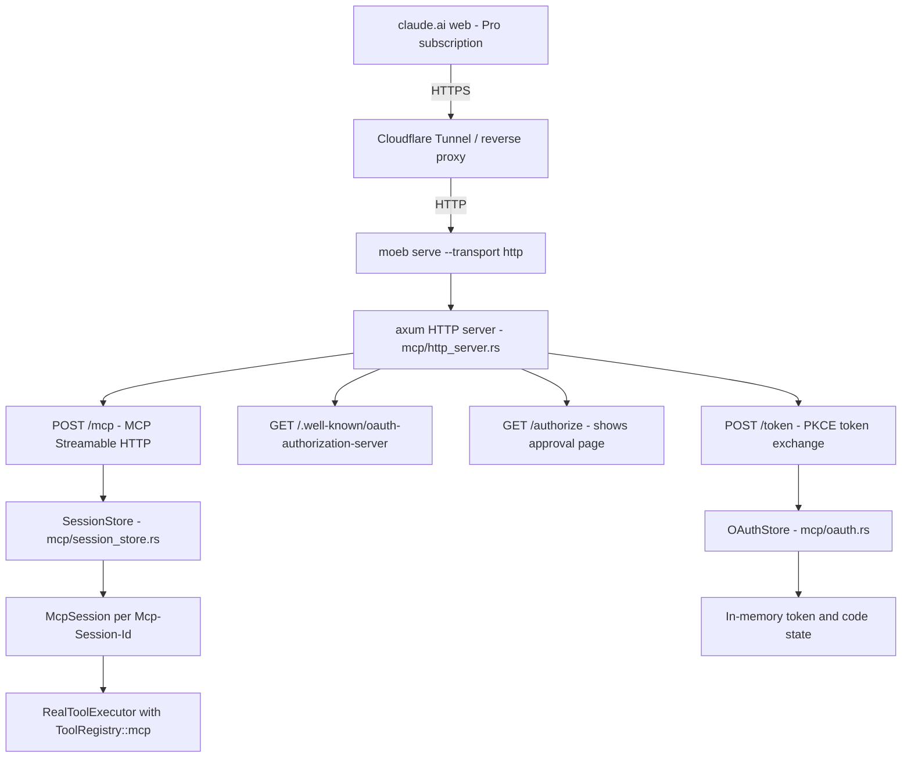

# MCP HTTP + OAuth Server

## Raw Requirement

Extend `moeb serve` to support an HTTP transport with OAuth 2.0 authorisation so that claude.ai (Claude Pro web subscription) can connect to moeb as a remote MCP server without requiring a separate API key. The stdio transport added in the previous specification must remain intact. The full moeb tool set and session constraints must be preserved.

## Description

Extends the `moeb serve` command with a `--transport http` mode that runs an HTTP MCP server using the MCP Streamable HTTP transport (2025-03-26 specification). The server handles concurrent sessions, each with independent `SharedRunState` and `RealToolExecutor` instances keyed by `Mcp-Session-Id`. An embedded minimal OAuth 2.0 authorisation server (Authorization Code + PKCE, RFC 6749 / RFC 7636) allows claude.ai to authenticate without pre-shared secrets. The server binds to localhost by default; HTTPS termination is handled externally by Cloudflare Tunnel or a reverse proxy. A `--public-url` flag provides the public HTTPS base URL used in OAuth metadata and redirect URIs. The `axum` crate and a `tokio` runtime are introduced as new dependencies for this mode only; all existing sync tool code executes inside `tokio::task::spawn_blocking`. The stdio mode in `commands/serve.rs` is unchanged; transport selection is driven by a new `--transport` flag defaulting to `stdio`.

## Diagram

## Backlinks

### Parents

| Label | Path | Purpose |
|-------|------|---------|
| README | README.md | root index |
| MCP Stdio Server | specifications/moeb/moeb.mcp-stdio-server.md | parent spec introducing the MCP server mode, tool registry, and session model this spec extends |
| Moeb Hexagonal Architecture | specifications/moeb/moeb.hex-architecture.md | constrains new modules to the adapter/command layer |
| AI-First Organisation Principles | specifications/moeb/moeb.ai-first-principles.md | mandates one concern per file, context locality, grep-discoverable names |

### External

| Label | URL | Purpose |
|-------|-----|---------|
| MCP Streamable HTTP transport | https://modelcontextprotocol.io/specification/2025-03-26/basic/transports#streamable-http | protocol reference for the HTTP transport this spec implements |
| RFC 6749 — OAuth 2.0 | https://datatracker.ietf.org/doc/html/rfc6749 | authorisation framework |
| RFC 7636 — PKCE | https://datatracker.ietf.org/doc/html/rfc7636 | PKCE extension for public clients |
| RFC 8414 — OAuth Server Metadata | https://datatracker.ietf.org/doc/html/rfc8414 | well-known metadata endpoint format |
| Cloudflare Tunnel quickstart | https://developers.cloudflare.com/cloudflare-one/connections/connect-networks/get-started/ | recommended HTTPS termination method for personal deployments |

## Steps

1. Add `axum`, `tokio`, `tower-http`, and `uuid` to `src/moeb/Cargo.toml`.
   - `axum = "0.7"` — HTTP server and routing.
   - `tokio = { version = "1", features = ["full"] }` — async runtime for HTTP mode only.
   - `tower-http = { version = "0.5", features = ["cors"] }` — CORS middleware so claude.ai browser origin is accepted.
   - `uuid = { version = "1", features = ["v4"] }` — session IDs, authorisation codes, and access tokens.
   - The `sha2` and `base64` crates are already present; use them for PKCE verification. If `base64` is not present, add `base64 = "0.22"`.
   - Gate the new dependencies under `[features]` only if cargo feature flags are already used in the project; otherwise add them unconditionally.

2. Add `src/moeb/src/mcp/oauth.rs` — in-memory OAuth 2.0 authorisation server state and logic.
   - Define `PendingAuth { client_id: String, redirect_uri: String, code_challenge: String, state: String }` — stored while the user has been redirected to the approval page but has not yet clicked Approve.
   - Define `IssuedCode { code_challenge: String, client_id: String, redirect_uri: String }` — stored after the user approves and a one-time authorisation code is issued; expires after 60 seconds.
   - Define `TokenInfo { session_id: String, expires_at: std::time::Instant }` — stored after a code is exchanged for an access token; expires after 24 hours.
   - Define `OAuthStore` holding three `Mutex<HashMap<String, _>>` fields, one per struct above, keyed by `state`, auth code, and access token respectively.
   - Implement `OAuthStore::new() -> Self`.
   - Implement `begin_auth(&self, params: AuthRequest) -> String` — validates `code_challenge_method == "S256"`, stores `PendingAuth` keyed by a new UUID `state` value (or the client-supplied `state` — store both), returns the `state` to embed in the approval page.
   - Implement `approve(&self, state: &str, session_id: &str) -> Result<(String, String)>` — looks up `PendingAuth` by state, issues a one-time `code` (UUID v4), stores `IssuedCode` keyed by that code, returns `(code, redirect_uri)` for the redirect response.
   - Implement `exchange_code(&self, code: &str, code_verifier: &str, client_id: &str) -> Result<String>` — looks up `IssuedCode`, verifies PKCE (`base64url(sha256(code_verifier)) == code_challenge`), removes the code entry, issues an access token (UUID v4) stored as `TokenInfo` with a 24-hour expiry, returns the access token.
   - Implement `validate_token(&self, token: &str) -> bool` — looks up the token, returns false if absent or expired.
   - Implement `purge_expired(&self)` — removes expired `IssuedCode` and `TokenInfo` entries; called before each validate.
   - No HTTP logic in this file — state and validation only.

3. Add `src/moeb/src/mcp/session_store.rs` — thread-safe multi-session registry.
   - Define `SessionEntry { session: McpSession, executor: RealToolExecutor }`.
   - Define `SessionStore(Arc<Mutex<HashMap<String, SessionEntry>>>)`.
   - Implement `SessionStore::new() -> Self`.
   - Implement `get_or_create(&self, session_id: Option<&str>, working_dir: &Path) -> (String, bool)` — if `session_id` is `Some` and the ID exists in the map, return `(id, false)`; otherwise generate a new UUID v4 ID, construct `McpSession::new(working_dir.to_path_buf())`, construct `RealToolExecutor::new_mcp(session.state.clone())`, insert the entry, return `(new_id, true)`.
   - Implement `with_session<F, R>(&self, id: &str, f: F) -> Option<R> where F: FnOnce(&mut SessionEntry) -> R` — locks the store and calls `f` with the entry if found.
   - No HTTP logic in this file — session lifecycle only.

4. Add `src/moeb/src/mcp/http_server.rs` — axum route handlers and server startup.
   - Define `AppState { session_store: Arc<SessionStore>, oauth: Arc<OAuthStore>, working_dir: Arc<PathBuf>, public_url: Arc<String> }`.
   - Route table (all registered on an `axum::Router`):
     - `GET /.well-known/oauth-authorization-server` → `handle_oauth_metadata`
     - `GET /authorize` → `handle_authorize_page`
     - `POST /authorize` → `handle_authorize_submit`
     - `POST /token` → `handle_token`
     - `POST /mcp` → `handle_mcp`
   - `handle_oauth_metadata(State(state))`: return JSON conforming to RFC 8414 with `issuer`, `authorization_endpoint`, `token_endpoint`, `response_types_supported: ["code"]`, `grant_types_supported: ["authorization_code"]`, `code_challenge_methods_supported: ["S256"]` — all URLs constructed from `state.public_url`.
   - `handle_authorize_page(Query(params), State(state))`: validate that `response_type == "code"` and `code_challenge_method == "S256"` are present; call `state.oauth.begin_auth(params)` to get a `state` token; return an HTML response containing a simple approval form with a hidden `state` field and a single "Authorise moeb" submit button. The HTML must render in a browser without external dependencies (inline styles only).
   - `handle_authorize_submit(Form(body), State(state))`: call `state.oauth.approve(&body.state, &uuid_v4())` to get `(code, redirect_uri)`; redirect the browser to `redirect_uri?code=<code>&state=<body.state>`.
   - `handle_token(Form(body), State(state))`: parse `grant_type`, `code`, `code_verifier`, `client_id`; call `state.oauth.exchange_code`; on success return JSON `{ "access_token": "...", "token_type": "Bearer", "expires_in": 86400 }`; on error return HTTP 400 with JSON `{ "error": "invalid_grant" }`.
   - `handle_mcp(headers, body, State(state))`: extract `Authorization: Bearer <token>` header; call `state.oauth.validate_token`; if invalid return HTTP 401. Extract `Mcp-Session-Id` header. Call `state.session_store.get_or_create(session_id_opt, &state.working_dir)` to obtain a session ID. Deserialise the request body as `JsonRpcRequest`. Dispatch to the same handler methods defined in the stdio spec (`handle_initialize`, `handle_list_tools`, `handle_call_tool`) — these methods must be factored into a free function module or trait so both stdio and HTTP share them without duplication. Return the `JsonRpcResponse` as `application/json`. Include `Mcp-Session-Id: <id>` in the response headers.
   - `pub async fn run_http_server(working_dir: PathBuf, public_url: String, host: String, port: u16) -> Result<()>`: construct `AppState`, build the router with `tower_http::cors::CorsLayer::permissive()`, bind `TcpListener` to `host:port`, call `axum::serve`.
   - No OAuth state logic in this file — delegates entirely to `OAuthStore` and `SessionStore`.

5. Refactor `src/moeb/src/mcp/server.rs` to extract shared dispatch logic.
   - Extract `dispatch_request(request: &JsonRpcRequest, session: &mut McpSession, executor: &mut RealToolExecutor) -> JsonRpcResponse` as a `pub` free function in `server.rs`. This function contains the match on `method` and calls to `handle_initialize`, `handle_list_tools`, `handle_call_tool`.
   - The existing `McpServer::run` in stdio mode calls this function on each parsed line.
   - The HTTP handler in `http_server.rs` calls this same function inside `session_store.with_session(...)`.
   - This eliminates duplication of dispatch logic between the two transports. The refactor must not change the behaviour of the existing stdio server.

6. Update `src/moeb/src/commands/serve.rs` — add transport selection.
   - Change the signature to `pub fn serve(working_dir: PathBuf, transport: Transport, port: u16, host: String, public_url: Option<String>) -> Result<()>`.
   - Define `pub enum Transport { Stdio, Http }`.
   - For `Transport::Stdio`: behaviour is identical to the current implementation (construct `McpSession`, `RealToolExecutor::new_mcp`, `McpServer`, call `server.run()`).
   - For `Transport::Http`: require `public_url` to be `Some`; return an error if absent. Call `tokio::runtime::Runtime::new()?.block_on(run_http_server(working_dir, public_url, host, port))`.
   - No async in this file beyond the `block_on` call; all async lives in `http_server.rs`.

7. Update `src/moeb/src/main.rs` — expose new flags on the `serve` subcommand.
   - Add `--transport <stdio|http>` (default `stdio`).
   - Add `--port <u16>` (default `3000`, only used when `--transport http`).
   - Add `--host <string>` (default `127.0.0.1`, only used when `--transport http`).
   - Add `--public-url <string>` (no default, required when `--transport http`; the CLI should surface a clear error if omitted in HTTP mode).
   - Pass all values to `commands::serve::serve`.

8. Add tests.
   - `src/moeb/src/mcp/oauth_tests.rs` (via `#[path]` in `oauth.rs`):
     - `pkce_valid_verifier_exchanges_successfully`: construct `OAuthStore`, call `begin_auth` with a computed `code_challenge`, call `approve`, call `exchange_code` with the matching `code_verifier`, assert a token is returned.
     - `pkce_wrong_verifier_returns_error`: same as above but pass a different `code_verifier`; assert `exchange_code` returns an error.
     - `expired_token_fails_validation`: insert a `TokenInfo` with `expires_at` in the past; assert `validate_token` returns false.
   - `src/moeb/src/mcp/session_store_tests.rs` (via `#[path]` in `session_store.rs`):
     - `new_session_created_when_id_absent`: call `get_or_create(None, dir)`, assert `is_new == true` and an ID is returned.
     - `existing_session_reused_when_id_present`: call `get_or_create(None, dir)` to get an ID, then call again with `Some(&id)`, assert `is_new == false` and the same ID is returned.
   - `src/moeb/src/mcp/http_server_tests.rs` (via `#[path]` in `http_server.rs`):
     - `oauth_metadata_contains_required_fields`: call `handle_oauth_metadata` directly with a test `AppState`; assert JSON response contains `authorization_endpoint`, `token_endpoint`, and `code_challenge_methods_supported`.
     - `mcp_request_without_token_returns_401`: issue a `POST /mcp` with no `Authorization` header using `axum::test` helpers; assert HTTP 401.
     - `mcp_initialize_with_valid_token_returns_protocol_version`: insert a valid token into `OAuthStore`, issue `POST /mcp` with `initialize` body; assert response contains `protocolVersion`.

## Decisions

1. **HTTP transport uses the MCP Streamable HTTP specification (2025-03-26), not the earlier HTTP+SSE transport (2024-11-05).**
   - Rationale: Streamable HTTP is simpler — a plain POST/JSON response cycle without a persistent SSE connection. claude.ai supports the newer transport and it eliminates the complexity of managing a long-lived SSE stream.
   - Alternatives:
     - Target the 2024-11-05 HTTP+SSE transport; rejected because it requires a persistent GET /sse connection per client and complicates session lifecycle management.
   - Consequences: Clients using only the 2024-11-05 transport cannot connect. Claude Desktop (stdio) is unaffected.

2. **OAuth 2.0 state is in-memory only; tokens reset on server restart.**
   - Rationale: moeb is a personal single-user tool. The authorisation approval is a one-time browser interaction per server restart. Persisting tokens to disk adds filesystem coupling and secret-handling complexity for negligible benefit.
   - Alternatives:
     - Persist tokens to the moeb config directory; rejected because secret material on disk requires encryption and key management not in scope for this specification.
     - Use an external identity provider (Auth0, Cloudflare Access); rejected because it introduces an external dependency and third-party account requirement.
   - Consequences: Restarting `moeb serve` invalidates all existing claude.ai connections; the user must re-authorise in the browser. For a personal tool running continuously, this is acceptable.

3. **OAuth does not require client registration; any `client_id` is accepted.**
   - Rationale: This is a personal single-owner server. PKCE (RFC 7636) ensures the token can only be used by the client that initiated the authorisation flow, providing the security guarantees that client registration normally provides for public clients.
   - Alternatives:
     - Require a pre-configured `client_id` matching claude.ai's identifier; rejected because claude.ai's `client_id` is not publicly documented and may change.
     - Implement dynamic client registration (RFC 7591); rejected because it is unnecessary complexity for a single-user deployment.
   - Consequences: Any client that can reach the server and complete the PKCE flow can obtain a token. Mitigation: the server binds to `127.0.0.1` by default; exposure is controlled by the operator's Cloudflare Tunnel or reverse proxy configuration.

4. **HTTPS termination is handled externally; moeb binds plain HTTP to localhost.**
   - Rationale: Implementing TLS inside moeb requires certificate provisioning, renewal, and key storage. Cloudflare Tunnel and reverse proxies (nginx, caddy) solve this reliably as existing tools. moeb does not need to duplicate that infrastructure.
   - Alternatives:
     - Embed a TLS stack (rustls) and auto-provision Let's Encrypt certificates via ACME; rejected because ACME requires a publicly routable IP and domain, and adds significant implementation scope.
   - Consequences: The operator must run a Cloudflare Tunnel or configure a reverse proxy before claude.ai can connect. The `--public-url` flag must match the external HTTPS URL, not the localhost URL.

5. **The dispatch logic is extracted from `McpServer` into a shared free function so both stdio and HTTP transports reuse it without duplication.**
   - Rationale: Duplicating `handle_initialize`, `handle_list_tools`, and `handle_call_tool` across two transport implementations would create a maintenance hazard where a bug fix or new tool in one transport is not applied to the other.
   - Alternatives:
     - Duplicate the dispatch logic; rejected because any future tool addition or protocol change would need to be applied twice.
     - Define a `McpDispatcher` trait implemented by both servers; rejected because a free function with the same parameters is simpler and avoids trait object overhead.
   - Consequences: `server.rs` exposes `dispatch_request` as `pub`. Both `McpServer::run` and `handle_mcp` in `http_server.rs` call it.

6. **Each HTTP session has its own independent `McpSession` and `RealToolExecutor`.**
   - Rationale: Each claude.ai conversation tab is an independent context. Sharing state between sessions would cause read-path caches and task lists from one conversation to corrupt another.
   - Alternatives:
     - Share one `RealToolExecutor` across sessions; rejected because the read-path and content-dedup caches are per-run state, not global state.
   - Consequences: Memory usage scales linearly with open sessions. For personal use the number of concurrent sessions is expected to be small (one per open claude.ai tab).

7. **`tokio::runtime::Runtime::new()?.block_on(...)` is used in `serve.rs` rather than making `main` async.**
   - Rationale: The rest of moeb is synchronous. Converting `main` to async would require every command handler to be async-compatible, a pervasive change beyond the scope of this specification.
   - Alternatives:
     - Make `main` async with `#[tokio::main]`; rejected because it would force all existing sync command code through the async executor and risk subtle blocking issues.
   - Consequences: The HTTP server's async tasks run inside a manually created runtime. The stdio path remains fully synchronous and unaffected.

## Rubric

### Structured

| Name | Description | Threshold | Pass Condition |
|------|-------------|-----------|----------------|
| `binary-builds` | Binary builds cleanly | `cargo build --release` completes without error | Zero errors |
| `all-tests-pass` | All unit tests pass | `cargo test` completes without failure | Zero failures |
| `no-test-regression` | No existing test regression | All tests present before this change pass without modification | Zero failures; no existing test file edited |
| `no-drift` | No contradiction with parent specs | Implementation does not violate any decision recorded in linked parent specs | Zero contradictions |
| `spec-schema-compliance` | Spec conforms to schema | All required frontmatter fields and body sections present | Validation exits 0 |
| `stdio-mode-unchanged` | stdio transport continues to work | `moeb serve` (no flags) behaves identically to before this change | Existing stdio unit tests pass; stdio path in `serve.rs` is unchanged |
| `oauth-pkce-enforced` | PKCE is correctly validated | Token exchange with wrong `code_verifier` is rejected | Unit test `pkce_wrong_verifier_returns_error` passes |
| `unauthenticated-mcp-rejected` | Bearer token is required | POST /mcp without Authorization header returns HTTP 401 | Unit test `mcp_request_without_token_returns_401` passes |
| `session-isolation` | Each HTTP session has independent state | Two sessions with different IDs maintain independent task lists | Unit test via `SessionStore` confirms independent `SharedRunState` |
| `dispatch-not-duplicated` | Dispatch logic appears once | `handle_initialize`, `handle_list_tools`, `handle_call_tool` are defined once and called from both transports | Code review finds a single definition; both call sites use it |
| `ai-first-file-organisation` | Each new file addresses exactly one concern | `oauth.rs` has state/logic only, `session_store.rs` has session lifecycle only, `http_server.rs` has HTTP routes only | Code review finds no file mixing two unrelated concerns |

### Qualitative

- The authorisation approval page must be usable from a standard browser with no JavaScript — a plain HTML form with a submit button is sufficient.
- Startup output (bound address, public URL reminder) must go to stderr; stdout must remain clean for any future stdio-mode use in the same binary.
- Error responses at the OAuth endpoints must conform to RFC 6749 Section 5.2 (`{"error": "<code>"}`) so that claude.ai can surface meaningful failure messages to the user.
- The operator instructions in this specification (Cloudflare Tunnel, `--public-url`) should be surfaced in `moeb --help serve` output so the user does not need to consult external documentation for basic setup.
