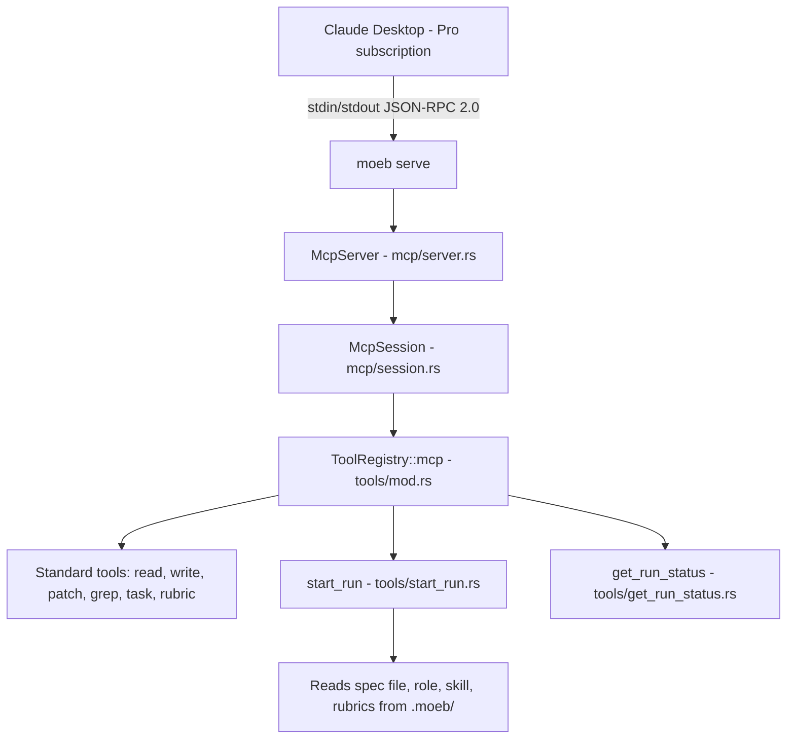

# MCP Stdio Server

## Raw Requirement

I have a subscription to Claude Pro and want to use authorised connections to connect my MCP through to models in preference to using API calls. I want to keep the full agent loop of moeb. Implement the simpler hybrid: add a `moeb serve` command that runs moeb as a stdio MCP server so that Claude Desktop (using a Claude Pro subscription) can drive a spec implementation with moeb's tools, without requiring a moeb API key.

## Description

Introduces a `moeb serve` command that starts moeb as a stdio MCP (Model Context Protocol) server. The server speaks JSON-RPC 2.0 over stdin/stdout, implements the MCP `initialize` handshake, and exposes moeb's standard file and task-management tools via `tools/list` and `tools/call`. Two new session tools — `start_run` and `get_run_status` — allow Claude Desktop to load a specification's full context (spec file, role, skill, rubrics) as a formatted prompt and to query session state (task list, rubric verifications). The existing `ToolRegistry`, `RealToolExecutor`, and all enforcement constraints (read-before-write, task-list-before-write, content deduplication) are reused unchanged. The `spawn_agent` tool is excluded because it requires an internal `AiPort` that is incompatible with MCP mode. This specification covers stdio transport only; HTTP transport with OAuth for claude.ai web is deferred.

## Diagram

## Backlinks

### Parents

| Label | Path | Purpose |
|-------|------|---------|
| README | README.md | root index |
| Moeb Kernel | specifications/moeb/moeb.kernel.md | establishes the command structure this spec extends |
| Moeb Hexagonal Architecture | specifications/moeb/moeb.hex-architecture.md | constrains the implementation to ports-and-adapters boundaries |
| Tool Executor Extraction | specifications/moeb/moeb.tool-executor-extraction.md | defines the ToolHandler trait and ToolRegistry that this spec reuses |
| Task-List Tools | specifications/moeb/moeb.task-list-tools.md | defines SharedRunState and RunState that MCP session state wraps |
| Run-Time File Scope Enforcement | specifications/moeb/moeb.run-file-scope-enforcement.md | defines read-before-write enforcement that must remain active in MCP mode |
| AI-First Organisation Principles | specifications/moeb/moeb.ai-first-principles.md | mandates one concern per file, context locality, and grep-discoverable names |

### External

| Label | URL | Purpose |
|-------|-----|---------|
| MCP Specification | https://modelcontextprotocol.io/specification/2024-11-05 | protocol reference for JSON-RPC 2.0 message format and method names |
| Claude Desktop MCP Config | https://modelcontextprotocol.io/quickstart/user | reference for claude_desktop_config.json registration format |

## Steps

1. Add `src/moeb/src/mcp/protocol.rs` — MCP JSON-RPC 2.0 type definitions only.
   - Define `JsonRpcRequest` with fields `jsonrpc: String`, `id: Option<serde_json::Value>`, `method: String`, `params: Option<serde_json::Value>`.
   - Define `JsonRpcResponse` with fields `jsonrpc: String`, `id: serde_json::Value`, and an `outcome` that serialises as either `result: serde_json::Value` or `error: JsonRpcError` (use `#[serde(flatten)]` on a dedicated enum).
   - Define `JsonRpcError` with `code: i32` and `message: String`.
   - Define `InitializeResult` with `protocolVersion: String`, `serverInfo: ServerInfo { name, version }`, and `capabilities: ServerCapabilities { tools: ToolsCapability {} }`.
   - Define `ToolInfo` with `name: String`, `description: String`, `inputSchema: serde_json::Value`.
   - Define `ListToolsResult` with `tools: Vec<ToolInfo>`.
   - Define `CallToolParams` with `name: String`, `arguments: Option<serde_json::Value>`.
   - Define `CallToolResult` with `content: Vec<TextContent>` where `TextContent` has `r#type: String` (always `"text"`) and `text: String`.
   - No logic in this file — types and `serde` derivations only.

2. Add `src/moeb/src/mcp/session.rs` — per-session state.
   - Define `McpSession` holding `state: SharedRunState`, `working_dir: PathBuf`, `turn_count: u32`.
   - `new(working_dir: PathBuf) -> Self` calls `new_shared_run_state()` from `run_state.rs`, sets `turn_count` to 0.
   - `increment_turn(&mut self) -> u32` increments `turn_count` and returns the new value.
   - No IO in this file — state only.

3. Add `src/moeb/src/tools/start_run.rs` — `start_run` ToolHandler.
   - Implement `ToolHandler` for `StartRunTool`.
   - `name()` returns `"start_run"`.
   - `definition()` returns a `ToolDef` with description `"Load a moeb specification and return the full run-context prompt (spec, role, skill, rubrics). Call this at the start of a session before using file or task tools."` and a single required string parameter `spec_path` (relative path to the spec file from the working directory, e.g. `.moeb/specifications/moeb/moeb.kernel.md`).
   - `execute(args, working_dir)`:
     1. Read `args["spec_path"]` as a string; resolve it relative to `working_dir`.
     2. Read the spec file to a string; return an error if it does not exist.
     3. Read `.moeb/README.md` relative to `working_dir`; include a `"(not found)"` placeholder if absent.
     4. Extract `role:` and `skill:` frontmatter values from the spec with a simple line scan over the YAML block (lines between the opening and closing `---`); default to `"run"` for each if the field is absent.
     5. Locate the role file at `.moeb/roles/<role>.role.md`; read it if present, use a short fallback string `"(no role file found for '<role>')"` if absent.
     6. Locate the skill file at `.moeb/skills/<skill>.skill.md`; read it if present, use a short fallback string `"(no skill file found for '<skill>')"` if absent.
     7. Locate and read `.moeb/rubrics/global.rubrics.md` and `.moeb/rubrics/run.rubrics.md`; concatenate present files separated by a blank line; use an empty string if neither exists.
     8. Assemble and return a formatted string with the following labelled sections in order: `## Role`, `## Skill`, `## Specification Index (README)`, `## Specification`, `## Rubrics`. Each section heading is followed by the corresponding content.
   - No dependency on `RunService`, `MoebConfig`, or any adapter type.

4. Add `src/moeb/src/tools/get_run_status.rs` — `get_run_status` ToolHandler.
   - Implement `ToolHandler` for `GetRunStatusTool { state: SharedRunState }`.
   - `name()` returns `"get_run_status"`.
   - `definition()` returns a `ToolDef` with description `"Return current session state: task list, task statuses, and rubric verifications."` with no required parameters.
   - `execute(args, working_dir)`: lock `state`, then format and return a human-readable string reporting: whether the task list has been created, total/pending/done/skipped task counts, each task's id, description, and status, and each rubric verification's name and status.

5. Update `src/moeb/src/tools/mod.rs` — add `ToolRegistry::mcp()` and `RealToolExecutor::new_mcp()`.
   - Add `pub mod start_run;` and `pub mod get_run_status;` declarations.
   - Add `ToolRegistry::mcp(state: SharedRunState) -> Self`: register the same eleven tools as `standard()` plus `StartRunTool` and `GetRunStatusTool { state: Arc::clone(&state) }`. `StartRunTool` has no state field and requires no Arc argument.
   - Add `RealToolExecutor::new_mcp(state: SharedRunState) -> Self`: identical constructor pattern to `new` and `new_sub_agent`, but calling `ToolRegistry::mcp(Arc::clone(&state))`.
   - Do not modify any existing registry factory methods or the existing `standard()`, `sub_agent()`, or `with_spawn_agent()` methods.

6. Add `src/moeb/src/mcp/server.rs` — stdio message loop.
   - Define `McpServer { session: McpSession, executor: RealToolExecutor }`.
   - `new(session: McpSession, executor: RealToolExecutor) -> Self`.
   - `run(&mut self) -> Result<()>`: read newline-delimited JSON from `std::io::stdin()` line by line, deserialise each line as `JsonRpcRequest`, dispatch, write the `JsonRpcResponse` as compact JSON followed by `'\n'` to `std::io::stdout()`, flush after every write. Stop when stdin is closed (EOF).
   - `handle_initialize(&self, id) -> JsonRpcResponse`: return `InitializeResult` with `protocolVersion: "2024-11-05"`, `serverInfo.name: "moeb"`, `serverInfo.version: env!("CARGO_PKG_VERSION")`, and `capabilities.tools` set to an empty object.
   - `handle_list_tools(&self, id) -> JsonRpcResponse`: call `self.executor.registry.definitions()` — expose `registry` as `pub` on `RealToolExecutor` — map each `ToolDef` to `ToolInfo { name, description, inputSchema: parameters }`, return `ListToolsResult`.
   - `handle_call_tool(&mut self, id, params) -> JsonRpcResponse`: deserialise `params` as `CallToolParams`; call `self.session.increment_turn()` to obtain the current turn number; call `self.executor.execute(&name, &name, &args, &self.session.working_dir, turn)`; on `Ok((text, _))` return a `CallToolResult` with a single `TextContent`; on `Err(e)` return a `CallToolResult` with the error string as the single `TextContent` (tool errors are content, not JSON-RPC errors, per the MCP specification).
   - `notifications/initialized`: deserialise and discard; no response is sent (it is a notification, not a request).
   - Any unrecognised method: return JSON-RPC error with code `-32601` and message `"Method not found"`.
   - The `registry` field on `RealToolExecutor` must be made `pub` (it is currently private) to allow `handle_list_tools` to call `definitions()` directly.

7. Add `src/moeb/src/mcp/mod.rs` — module declaration only.
   - `pub mod protocol;`
   - `pub mod session;`
   - `pub mod server;`

8. Add `src/moeb/src/commands/serve.rs` — serve command entrypoint.
   - `pub fn serve(working_dir: std::path::PathBuf) -> anyhow::Result<()>`.
   - Construct `McpSession::new(working_dir.clone())`.
   - Arc-clone `session.state` and pass it to `RealToolExecutor::new_mcp(state)`.
   - Construct `McpServer::new(session, executor)`.
   - Call `server.run()` and propagate errors with context `"MCP stdio server error"`.

9. Wire into `src/moeb/src/main.rs` and the module tree.
   - Add `mod mcp;` to `src/moeb/src/lib.rs` (or wherever the top-level module declarations live).
   - Add `mod serve;` (or `pub use`) in `src/moeb/src/commands/mod.rs`.
   - Add a `serve` subcommand to the CLI parser. It takes no arguments; the working directory is `std::env::current_dir()?`.
   - Route the `serve` arm to `commands::serve::serve(working_dir)`.

10. Add tests in companion `*_tests.rs` files.
    - `src/moeb/src/mcp/server_tests.rs` (declare via `#[path]` in `server.rs`):
      - `initialize_returns_correct_protocol_version`: construct `McpServer` with a temp-dir session, call `handle_initialize`, assert `protocolVersion == "2024-11-05"` and `capabilities` contains a `tools` key.
      - `list_tools_includes_start_run_and_get_run_status`: assert both names appear in the `tools` list.
      - `call_tool_on_unread_existing_file_returns_rejection`: create a temp dir with a real file, call `write_file` via `handle_call_tool` without a prior `read_file`, assert the result content contains the rejection message.
    - `src/moeb/src/tools/start_run_tests.rs` (declare via `#[path]` in `start_run.rs`):
      - `start_run_returns_context_sections`: create a temp dir with a minimal spec file (with `---` frontmatter and `# Title`) and a `.moeb/README.md`; call `execute`; assert the returned string contains `## Role`, `## Skill`, `## Specification`, `## Rubrics`.
      - `start_run_uses_frontmatter_role_and_skill`: write frontmatter with `role: custom` and `skill: custom`; assert the returned string references `custom` in the role/skill section content (fallback string contains the name).
    - `src/moeb/src/tools/get_run_status_tests.rs` (declare via `#[path]` in `get_run_status.rs`):
      - `get_run_status_reports_no_task_list_before_create`: fresh `SharedRunState`; assert output contains `"task list: not created"` (or equivalent phrasing).
      - `get_run_status_reports_tasks_after_create`: push a task directly into `RunState`; assert output contains the task description.

## Decisions

1. **stdio transport only; HTTP transport with OAuth is deferred to a follow-on specification.**
   - Rationale: stdio is the simplest MCP transport and requires no networking, TLS, or OAuth infrastructure. Claude Desktop supports local MCP servers via stdio without any authorization mechanism. This delivers the core value (Pro subscription use, no API key in moeb) at minimal implementation cost.
   - Alternatives:
     - Implement HTTP with OAuth 2.0 in the same specification; rejected because it would triple the scope and block delivery of the tool-exposure value.
     - Use SSE transport instead of stdio; rejected because SSE requires HTTP and is therefore out of scope.
   - Consequences: Claude.ai web (not Claude Desktop) requires HTTP transport and OAuth, which must be specified separately. Users must use Claude Desktop for stdio access.

2. **Single session per process; all session state is in-memory.**
   - Rationale: Claude Desktop spawns moeb as a fresh subprocess per conversation, making multi-session or persistent-state infrastructure unnecessary. In-memory state is consistent with how `moeb run` handles `SharedRunState`.
   - Alternatives:
     - Persist session state to disk; rejected because it adds complexity for a use case (cross-conversation resume) that was not requested.
     - Support multiple concurrent sessions; rejected because stdio is inherently single-session.
   - Consequences: Restarting moeb or beginning a new Claude Desktop conversation resets all session state including task lists and rubric verifications.

3. **`spawn_agent` is excluded from the MCP tool registry.**
   - Rationale: `spawn_agent` requires an internal `AiPort` to call a configured AI adapter. In MCP mode, Claude Desktop is the model; including `spawn_agent` would require moeb to hold a separate API key, defeating the purpose of the feature.
   - Alternatives:
     - Include `spawn_agent` and return a fixed error if called; rejected because an always-erroring tool misleads the model.
     - Add a no-op stub; rejected for the same reason.
   - Consequences: Sub-agent delegation is unavailable in `moeb serve` mode. Specifications that rely on `spawn_agent` are better served by `moeb run` with an API adapter.

4. **`start_run` performs direct file reads and does not call `RunService`.**
   - Rationale: `RunService` is coupled to the adapter layer and the agent loop. `start_run` only needs to load context files, which it can do with direct filesystem reads, keeping the MCP layer independent of the adapter infrastructure.
   - Alternatives:
     - Refactor `RunService` to expose a context-loading function reusable by `start_run`; rejected because it would introduce cross-layer coupling and scope creep beyond this specification's boundary.
   - Consequences: Future changes to how `RunService` loads role, skill, or rubric files must also be reflected in `start_run.rs`. Both files must be kept aligned by future specifications.

5. **MCP tool errors are returned as content, not as JSON-RPC error responses.**
   - Rationale: The MCP specification requires that tool-call failures be returned as content entries so the model can see and recover from them in the conversation. JSON-RPC error responses indicate protocol-level failures, not tool-level failures.
   - Alternatives:
     - Return JSON-RPC error objects for tool failures; rejected because Claude Desktop would treat them as protocol errors and surface them as fatal rather than as recoverable tool output.
   - Consequences: Tool error messages (including rejection messages from `RealToolExecutor`) are visible to Claude Desktop as tool results, consistent with how existing adapters surface tool errors today.

6. **`RealToolExecutor.registry` is made `pub` to enable `handle_list_tools` to call `definitions()`.**
   - Rationale: The MCP server needs to enumerate all registered tools without duplicating the definitions logic. Making `registry` pub on `RealToolExecutor` is the minimal change; no new method or trait is needed.
   - Alternatives:
     - Add a `tool_definitions()` method to `RealToolExecutor`; acceptable but unnecessary indirection for one call site.
     - Duplicate the `ToolDef` list in the server; rejected because it would desync from the actual registry.
   - Consequences: `registry` being `pub` means callers can read but not mutate (the field type `ToolRegistry` has no public mutation API).

## Rubric

### Structured

| Name | Description | Threshold | Pass Condition |
|------|-------------|-----------|----------------|
| `binary-builds` | Binary builds cleanly | `cargo build --release` completes without error | Zero errors |
| `all-tests-pass` | All unit tests pass | `cargo test` completes without failure | Zero failures |
| `no-test-regression` | No existing test regression | All tests present before this change pass without modification to test code | Zero failures; no test file edited |
| `no-drift` | No contradiction with parent specs | Implementation does not violate any decision recorded in a linked parent spec | Zero contradictions |
| `spec-schema-compliance` | Spec conforms to schema | All required frontmatter fields and body sections present and correctly ordered | Validation exits 0 during `moeb spec` |
| `mcp-initialize-handshake` | initialize handshake completes correctly | McpServer responds to initialize with protocolVersion `2024-11-05` and a `tools` capability | Unit test passes |
| `tools-list-includes-mcp-tools` | tools/list returns all MCP tools | All standard tools plus `start_run` and `get_run_status` appear in `tools/list` response | Unit test enumerating tool names passes |
| `read-before-write-enforced-in-mcp` | Write scope enforcement remains active | Calling `write_file` via `tools/call` on an unread existing file returns the rejection message as content | Unit test with temp dir passes |
| `start-run-returns-all-sections` | start_run loads and returns spec context | Response contains `## Role`, `## Skill`, `## Specification`, `## Rubrics` headings | Unit test with temp dir fixture passes |
| `ai-first-file-organisation` | Each new file addresses exactly one concern | `protocol.rs` has types only, `session.rs` has state only, `server.rs` has message loop only, `start_run.rs` has one tool, `get_run_status.rs` has one tool, `serve.rs` has the command entry point | Code review finds no file mixing two unrelated concerns |

### Qualitative

- `moeb serve` should start silently (no banner to stdout) and begin responding to JSON-RPC messages immediately; any startup messages must go to stderr to avoid corrupting the JSON-RPC stream.
- Tool error messages returned via MCP content must be the same strings `moeb run` would produce — no MCP-specific wrapping that obscures the original message from the model.
- The implementation must not add any new direct dependencies between the `mcp/` module and the `adapters/` module or the `domain/` module (other than `domain/run.rs` types that `start_run` might already share with existing tool code).
