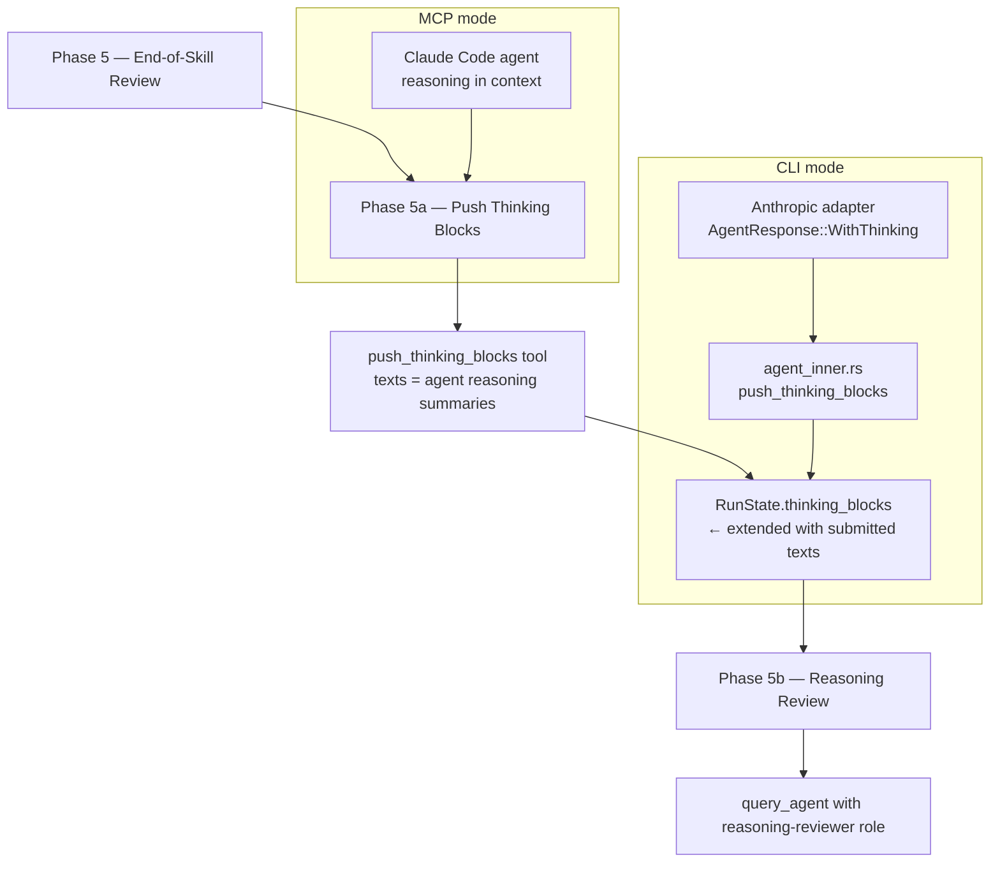

# MCP Mode Thinking Block Capture

## Raw Requirement

In CLI mode the moeb agent runs through an Anthropic adapter that intercepts `thinking` content blocks from the API response and stores them in `RunState.thinking_blocks`, enabling Phase 5b (Reasoning Review) to evaluate the agent's internal reasoning. In MCP mode the agent (Claude Code) drives tool calls directly; no adapter intercepts its thinking, so `RunState.thinking_blocks` is always empty and Phase 5b is always skipped. Add a `push_thinking_blocks` tool to the moeb registry (both CLI tool registry and MCP stdio server) that the agent can call to explicitly submit reasoning text into `RunState.thinking_blocks`. Update all three canonical skill files to include a Phase 5a — Push Thinking Blocks step that calls this tool immediately before Phase 5b, enabling the Reasoning Reviewer to evaluate agent reasoning in both MCP and CLI sessions.

## Description

The Reasoning Reviewer (introduced in `moeb.reasoning-reviewer.md`) evaluates `RunState.thinking_blocks` at the end of every run. That field is populated by `agent_inner.rs` when the Anthropic adapter returns an `AgentResponse::WithThinking` response. This path is only active in CLI mode, where moeb controls the agent loop and can intercept the API response. In MCP mode Claude Code is the agent; its reasoning text exists in the conversation context but never passes through `agent_inner.rs`, so `RunState.thinking_blocks` is always empty and the reviewer always skips.

The fix is a new primitive tool `push_thinking_blocks` that writes caller-supplied strings into `RunState.thinking_blocks`. The tool is thin: it takes an array of strings, calls `run_state.lock().unwrap().push_thinking_blocks(texts)`, and returns a confirmation. The existing `push_thinking_blocks` method on `RunState` (added by `moeb.reasoning-reviewer.md`) is the only mutation point — no new RunState fields are required.

A new **Phase 5a — Push Thinking Blocks** step is inserted into all three canonical skill files immediately before the existing Phase 5b — Reasoning Review. The step instructs the agent to call `push_thinking_blocks` with key reasoning text from the current run — decision rationale, deliberation about signals, and any non-obvious implementation choices. Mechanical steps (file reads, build output) are excluded. After calling the tool, Phase 5b runs as normal against the now-populated `RunState.thinking_blocks`, whether the session is MCP or CLI mode.



## Backlinks

### Parents

| Label | Path | Purpose |
|-------|------|---------|
| Reasoning Reviewer | [specifications/moeb/moeb.reasoning-reviewer.md](specifications/moeb/moeb.reasoning-reviewer.md) | Introduces RunState.thinking_blocks, push_thinking_blocks method, and Phase 5b; this spec extends capture to MCP mode |
| MCP Stdio Server | [specifications/moeb/moeb.mcp-stdio-server.md](specifications/moeb/moeb.mcp-stdio-server.md) | Defines MCP tool registration; new tool must be registered here |
| Task-List Tools | [specifications/moeb/moeb.task-list-tools.md](specifications/moeb/moeb.task-list-tools.md) | Establishes the tool handler pattern followed by the new tool |
| Kernel Thin and MCP Parity Rubrics | [specifications/moeb/moeb.kernel-thin-and-mcp-parity-rubrics.md](specifications/moeb/moeb.kernel-thin-and-mcp-parity-rubrics.md) | Requires every new CLI tool to also appear in the MCP server registry |

### External

*(none)*

## Steps

### Step 1 — Add `push_thinking_blocks` tool handler

Create `src/moeb/src/tools/push_thinking_blocks.rs`:

```rust
use std::sync::Arc;
use anyhow::Result;
use serde_json::Value;
use crate::run_state::SharedRunState;
use crate::tools::ToolHandler;

pub struct PushThinkingBlocksTool {
    pub state: Arc<SharedRunState>,
}

impl ToolHandler for PushThinkingBlocksTool {
    fn name(&self) -> &str {
        "push_thinking_blocks"
    }

    fn execute(&self, input: Value) -> Result<String> {
        let texts: Vec<String> = input["texts"]
            .as_array()
            .unwrap_or(&vec![])
            .iter()
            .filter_map(|v| v.as_str().map(str::to_owned))
            .collect();
        let count = texts.len();
        self.state.lock().unwrap().push_thinking_blocks(texts);
        Ok(format!("pushed {} thinking block(s) into RunState", count))
    }
}
```

The tool implementation must be entirely free of domain logic. It is a thin write wrapper: receive strings, call `push_thinking_blocks`, return count confirmation.

Note: `SharedRunState` is `Arc<Mutex<RunState>>`. The tool handler holds an `Arc<SharedRunState>` cloned from the run-level state. Follow the same ownership pattern as `EnterPhaseTool` and `GetRunStatusTool`.

### Step 2 — Register in the standard tool registry and MCP server

**Standard tool registry** (`src/moeb/src/tools/mod.rs`):

Add `push_thinking_blocks` to the standard registry under the same conditional guard as other run-state tools:

```rust
pub mod push_thinking_blocks;
```

In the `ToolRegistry::standard` constructor (or wherever `EnterPhaseTool` and `GetRunStatusTool` are registered), add:

```rust
registry.register(Arc::new(push_thinking_blocks::PushThinkingBlocksTool {
    state: Arc::clone(&run_state),
}));
```

The tool must only be registered when a `SharedRunState` is available (i.e. in the run command path, not in the spec-only or query-agent paths).

**MCP stdio server** (`src/moeb/src/serve/` or wherever MCP tool handlers are registered):

Add a matching MCP handler entry for `push_thinking_blocks` with the following JSON schema:

```json
{
  "name": "push_thinking_blocks",
  "description": "Push reasoning text into RunState.thinking_blocks so the Reasoning Reviewer can evaluate it in Phase 5b. Call this in Phase 5a with key decision rationale and deliberation from the current run.",
  "inputSchema": {
    "type": "object",
    "properties": {
      "texts": {
        "type": "array",
        "items": { "type": "string" },
        "description": "Array of reasoning block strings to append to RunState.thinking_blocks"
      }
    },
    "required": ["texts"]
  }
}
```

The MCP handler delegates to the same `PushThinkingBlocksTool::execute` path used by the CLI registry. No separate MCP-only implementation.

### Step 3 — Add Phase 5a to all three canonical skill files

Insert Phase 5a immediately before the existing Phase 5b — Reasoning Review in each of the three skill files. The heading uses `5a` to avoid renumbering downstream phases.

**Content to insert in each file** (replace `Phase 6 — Metrics Recording` reference with the correct downstream phase label for each file):

```markdown
## Phase 5a — Push Thinking Blocks

This phase runs when `{{no_review}}` is `"false"` (the default). Skip ONLY if
`{{no_review}}` is the exact string `"true"`.

Call `push_thinking_blocks` with the key reasoning text produced during this run.
Include:

- Decision rationale for any non-obvious implementation choice (why this signal
  category, why this fix approach, why a deviation from the skill default was taken).
- Deliberation about whether any signal should or should not be emitted.
- Any uncertainty that was resolved and how it was resolved.
- Reasoning about tradeoffs between alternatives that were considered.

Do not include mechanical steps: file reads, build output, cargo test results, or
descriptions of what was done rather than why.

Submit all reasoning as a single `push_thinking_blocks` call with one string element
per distinct decision point. Each element should be 2–6 sentences.

After `push_thinking_blocks` returns, proceed to Phase 5b — Reasoning Review.
```

**Target locations:**

- `src/moeb/internal/skills/run.skill.md`: insert after Phase 5 (End-of-Skill Review) and before Phase 5b (Reasoning Review).
- `src/moeb/internal/skills/spec.skill.md`: insert after the End-of-Skill Review phase and before the Reasoning Review phase.
- `src/moeb/internal/skills/fix_signal.skill.md`: insert after the End-of-Skill Review phase and before the Reasoning Review phase.

### Step 4 — Compile and test

Run `cargo build --release` in `src/moeb/` with zero errors.
Run `cargo test` in `src/moeb/` with zero new failures.

Write unit tests in `src/moeb/src/tools/push_thinking_blocks.rs` (under `#[cfg(test)]`) covering:

1. Calling `push_thinking_blocks` with a two-element `texts` array appends both strings to `RunState.thinking_blocks` and returns `"pushed 2 thinking block(s) into RunState"`.
2. Calling `push_thinking_blocks` with an empty `texts` array leaves `RunState.thinking_blocks` unchanged and returns `"pushed 0 thinking block(s) into RunState"`.
3. Calling `push_thinking_blocks` twice in sequence accumulates strings from both calls in `RunState.thinking_blocks`.

## Decisions

### Decision 1 — New tool rather than a skill-only instruction

**Rationale:** Phase 5b reads `RunState.thinking_blocks`. The only authoritative way to write to that field from within an MCP session is through a registered tool that holds a reference to the shared `RunState`. A skill-only instruction (e.g. "include your reasoning in the Phase 5b query_agent call") would bypass `RunState` entirely, require duplicating the accumulation logic in skill text, and diverge from the CLI-mode path where `thinking_blocks` are populated by the adapter. A thin tool preserves the same data flow in both modes.

**Rejected alternatives:**

| Option | Reason Rejected |
|--------|-----------------|
| Modify Phase 5b to accept inline reasoning text without using RunState | Diverges from CLI-mode path; `reasoning-reviewer.role.md` is already defined to receive thinking blocks from RunState, not inline text |
| Add a mode flag to RunState and modify Phase 5b to collect reasoning differently per mode | Adds branching logic to Rust kernel; violates `thin-kernel` policy |
| MCP-only capture path that reads agent messages from the MCP server context | MCP server does not have access to the full conversation history; the agent is the only party that can summarise its reasoning |

**Consequences:** The tool must be registered in both the standard tool registry and the MCP stdio server (per `kernel-thin-and-parity`). In CLI mode, the tool is available but Phase 5a instructions produce a small amount of additional token spend summarising reasoning already captured by the adapter. This duplication is acceptable and may provide richer context to the reviewer than raw thinking blocks alone.

---

### Decision 2 — Phase 5a rather than per-phase push calls

**Rationale:** Inserting a `push_thinking_blocks` call into every phase of each skill file would double the number of tool calls per run and scatter reasoning capture across the entire skill. A single Phase 5a consolidation point has lower overhead, is easier to audit, and gives the agent a dedicated moment to reflect on the full run before the reviewer evaluates it.

**Rejected alternatives:**

| Option | Reason Rejected |
|--------|-----------------|
| Push at the end of each phase | Doubles tool call count; reasoning is typically available at run end anyway |
| Push only from certain high-decision phases | Requires judgement about which phases are "high-decision"; changes to skill phase layout would silently omit new phases |
| Automatic push at run end without a skill step | Cannot be implemented without kernel logic; violates `thin-kernel` |

**Consequences:** The reviewer receives a consolidated summary rather than per-turn granularity. This matches the advisory role's existing interface, which receives a flat `Vec<String>` and evaluates cross-run patterns rather than per-turn behaviour.

---

### Decision 3 — Phase 5a numbering (before 5b, after 5)

**Rationale:** The existing Phase 5b — Reasoning Review must remain the reviewer invocation point; it already exists in all three skill files. Phase 5a as the data-population step immediately before 5b makes the ordering explicit: populate then review. Using `5a` avoids renumbering any downstream phases and keeps the mandatory-phases rubric checks intact.

**Rejected alternatives:**

| Option | Reason Rejected |
|--------|-----------------|
| Merge into Phase 5b as a pre-step | Phase 5b's skip condition ("if RunState.thinking_blocks is empty") would skip the push call too; the phases must be separate |
| Number as Phase 4b | Semantically incorrect; this phase belongs to the review cluster (5, 5a, 5b), not to implementation |

**Consequences:** All three skill files gain a `## Phase 5a` heading. The mandatory-phases rubric checks for specific heading strings ("Verify", "End-of-Skill Review", "Metrics Recording", "Commit", "Tag", "Complete"); "Phase 5a" is not a mandatory heading string and introduces no rubric conflict.

---

### Decision 4 — Agent summarises reasoning rather than copying raw context

**Rationale:** In MCP mode there is no structured "thinking block" object — the agent's reasoning exists as implicit knowledge developed during the run. Instructing the agent to copy large amounts of raw context text into `push_thinking_blocks` would produce noisy, expensive reviewer input. The Phase 5a instruction explicitly scopes the submission to decision rationale and deliberation (2–6 sentences per point), producing reviewer input that matches the density of actual CLI-mode thinking blocks.

**Rejected alternatives:**

| Option | Reason Rejected |
|--------|-----------------|
| Copy raw conversation segments verbatim | Expensive; reviewer receives hundreds of lines of mechanical tool-call output mixed with reasoning |
| Require a fixed number of thinking blocks | Arbitrary; some runs have few decisions, others many |

**Consequences:** The quality of Phase 5b in MCP mode depends on the agent accurately identifying and summarising its key reasoning points. This is an inherent limitation of MCP mode versus CLI mode, where thinking blocks are captured directly from the model API.

## Rubric

### Structured

| Name | Description | Threshold | Pass Condition |
|------|-------------|-----------|----------------|
| `tool-errors` | No ToolHandler errors were recorded during this command invocation. Covers all tool calls on both CLI and MCP paths via `RealToolExecutor::execute`. Applies to every moeb command. | Zero tool errors | Kernel-authoritative: injected by `verify_rubrics` from `RunState.tool_errors`. Do not supply a verdict — any agent-supplied entry is overridden. |
| `rubric-qualification` | No Pass verdicts with acknowledged failures were issued during this command invocation. An agent that observes a failure but passes a criterion must populate `acknowledged_failures` in the verdict object. Applies to every moeb command. | Zero qualified Pass verdicts | Kernel-authoritative: injected by `verify_rubrics` by scanning `acknowledged_failures` on incoming Pass verdicts. Do not supply a verdict — any agent-supplied entry is overridden. |
| `skill-mandatory-phases` | The skill loaded for this run contains all mandatory phase headings. The agent checks its own prompt context (the loaded skill content is already present) for the exact strings: "Verify", "End-of-Skill Review", "Metrics Recording", "Commit", "Tag", "Complete". No file read is required. | All six mandatory headings present | Agent scans skill content in its loaded context; fails if any mandatory heading string is absent |
| `no-drift` | The specification does not violate any decision recorded in a linked parent specification | Zero contradictions | Manual review of every decision in every parent spec listed in Backlinks |
| `spec-schema-compliance` | All required frontmatter fields and body sections are present and correctly ordered | 100% of required fields and sections | Validation in `domain/spec.rs` exits 0 during `moeb spec` |
| `ai-first-org` | The specification's Steps prescribe file layouts, naming, and helper placement that satisfy the four AI-first organisation principles: one concern per file, context locality, grep-discoverable names, no cross-cutting helpers. | All four principles followed | Manual review: no step produces a file that mixes concerns, no name is generic across the codebase, all helpers are co-located with their callers or promoted to a precisely named module |
| `kernel-thin-and-parity` | No domain-specific or workflow-specific coordination logic may be placed in kernel Rust code when it can live in skill markdown or role files. Every tool registered in the CLI tool registry must also be registered in the MCP stdio server tool list. | Zero violations | Spec review: no proposed step places review/coordination logic in Rust; Run review: grep confirms no skill-specific logic in kernel tools; tool lists in tools/mod.rs and the MCP server match exactly |
| `moeb-tool-origin` | All tool calls made during this invocation must originate from moeb's own tool registry. If an external tool (not in the moeb registry) was used because no moeb equivalent exists, the agent must write a MissingMoebTool signal immediately after each such call. The criterion always fails when any external tool is used, whether or not a signal was written. | Zero external tool calls | Agent reviews the conversation for calls to non-moeb tools (e.g. Bash, Edit, Write, Read, Glob, Grep, WebFetch, WebSearch in Claude Code MCP mode). Supplies Pass if none were made. If external tools were used with MissingMoebTool signals, supplies Fail with `acknowledged_failures` listing each signal title. If external tools were used without signals, supplies Fail with the unlogged tool names in the note. |
| `thin-kernel` | New Rust code in tools/, commands/, or domain/ must be either (a) a primitive operation wrapper (filesystem, git, or HTTP with no domain logic) or (b) a thin dispatcher that calls into skills, tools, or agents and returns the result unchanged. Workflow logic — sequencing, conditionals, review loops, retry strategy, branching decisions — must live in skill markdown or role files, not in compiled Rust. | Zero workflow-logic functions in new Rust | Spec review: no Step proposes placing sequencing or conditional workflow logic in Rust when a skill-file change would suffice; Run review: every new function in tools/ or commands/ either wraps a single OS/VCS/HTTP call or contains no domain-specific branching |
| `mcp-cli-behavioural-parity` | For any operation exposed through both the CLI agent loop and the MCP server, the observable outcome must be identical: same file mutations, same tool result string format, same rendered prompt template. | Zero divergent outcomes | Run review: `push_thinking_blocks` in the CLI registry and MCP server share the same handler; both produce the identical result string format |
| `binary-builds` | `cargo build --release` exits 0 | Zero errors | CI build exits 0 |
| `all-tests-pass` | `cargo test` exits 0 | Zero failures | `cargo test` exits 0 |
| `no-test-regression` | All pre-existing tests pass without modification to test code | Zero failures | `cargo test` exits 0; no test file edited beyond compilation-required changes |
| `phase-5a-in-all-skills` | All three canonical skill files contain a `## Phase 5a — Push Thinking Blocks` heading immediately before `## Phase 5b — Reasoning Review` | Present in all three files | grep for `Phase 5a` in `run.skill.md`, `spec.skill.md`, and `fix_signal.skill.md` |
| `new-skill-mandatory-phases` | All three canonical skill files updated during this run retain all mandatory phase heading strings: "Verify", "End-of-Skill Review", "Metrics Recording", "Commit", "Tag", "Complete" | All six strings present in all three updated skill files | grep for all six heading strings in each of the three updated skill files; fail if any string is absent from any file |

### Qualitative

- `push_thinking_blocks` must contain zero domain logic. The only operation in its body is: deserialise `texts` array, call `run_state.push_thinking_blocks(texts)`, return count string.
- Phase 5a instructions must be explicit that mechanical steps (build output, file reads, test results) are excluded. The goal is reasoning and decision rationale only.
- The existing Phase 5b — Reasoning Review must remain completely unchanged in all three skill files. Phase 5a is purely additive.
- In CLI mode, both the adapter capture path (agent_inner.rs → push_thinking_blocks method) and the Phase 5a tool call path may populate `RunState.thinking_blocks` in the same run. This is acceptable — the reviewer receives all accumulated text regardless of source.
