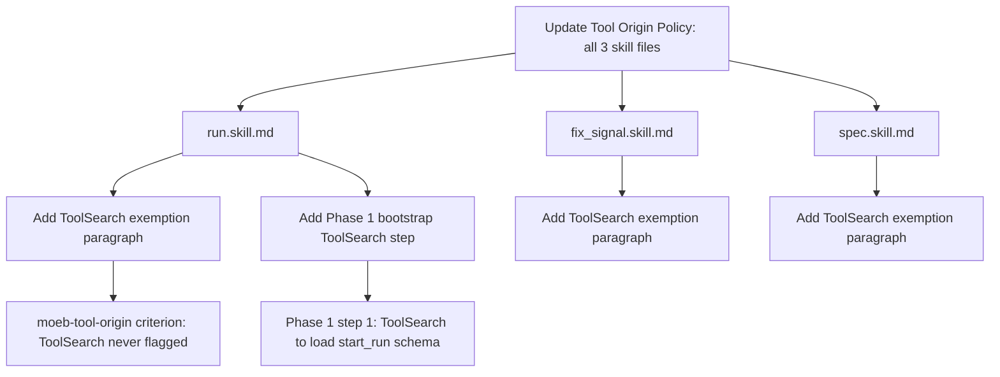

# Moeb-Tool-Origin Rubric: ToolSearch Exemption and run.skill.md Phase 1 Bootstrap

## Raw Requirement

1. Update run.skill.md and fix_signal.skill.md moeb-tool-origin rubric to: (a) exempt ToolSearch unconditionally — it is a session bootstrapping tool with no moeb equivalent; (b) enforce the moeb-tool-origin boundary from Phase 1 onwards for all other Claude Code native tools that have moeb equivalents (Read → read_file, Bash → run_command, Glob → list_directory/search_files).
2. Remove MissingMoebTool signal emission requirement for ToolSearch from all skill files.
3. Ensure run.skill.md Phase 1 explicitly calls ToolSearch to load start_run schema — this is the canonical pre-skill setup step.

## Description

The `moeb-tool-origin` rubric criterion in the canonical skill files (run.skill.md, fix_signal.skill.md, spec.skill.md) currently treats every external tool call — including ToolSearch — as a violation unless a MissingMoebTool signal is buffered. ToolSearch is a Claude Code session-level schema resolver used to load deferred tool schemas from `<system-reminder>` entries; it has no moeb equivalent because it operates at the MCP session protocol layer, not on project files or data. Requiring a MissingMoebTool signal for ToolSearch is incorrect and creates noise in the signal catalogue.

This specification corrects the Tool Origin Policy sections in all three canonical skill files by unconditionally exempting ToolSearch from the moeb-tool-origin boundary check and removing the MissingMoebTool signal emission requirement for ToolSearch. It also adds an explicit Phase 1 ToolSearch bootstrap instruction to run.skill.md documenting the canonical pre-skill setup step for `moeb run` sessions.



## Backlinks

### Parents

| Label | Path | Purpose |
|-------|------|---------|
| Harness README | .moeb/README.md | Index of all specifications governing this harness |
| MCP/CLI Tool Origin Rubric | specifications/moeb/moeb.moeb-tool-origin-rubric.md | Parent spec introducing the moeb-tool-origin criterion enforced by this change |
| Add `all-skill-files-parity` Rubric Criterion | specifications/moeb/moeb.all-skill-files-parity-rubric.md | Mandates all three canonical skill files are updated when any one is modified |
| Protected Baseline Skills | specifications/moeb/moeb.protected-baseline-skills.md | Requires changes to protected skills to target src/moeb/internal/skills/ via moeb spec |

## Steps

### Step 1 — Read run.skill.md

Read `src/moeb/internal/skills/run.skill.md`. Note the exact location and wording of:
- The Tool Origin Policy section (typically before Phase 1).
- The numbered list of steps within Phase 1 (the first phase heading in the file).

### Step 2 — Add ToolSearch exemption to run.skill.md Tool Origin Policy

In `src/moeb/internal/skills/run.skill.md`, in the Tool Origin Policy section, insert the following paragraph immediately before the closing of that section (i.e., before the first `## Phase` heading that follows the policy). The paragraph must read:

```
**ToolSearch is unconditionally exempt from this policy.** ToolSearch is a session-level
schema resolver built into the Claude Code MCP client — it loads deferred tool schemas from
`<system-reminder>` entries and cannot be replaced by any moeb tool. Do not buffer a
MissingMoebTool signal for ToolSearch calls. The moeb-tool-origin boundary applies from
Phase 1 onwards for all other external tools that have moeb equivalents (e.g. Read →
read_file, Bash → run_command, Glob → list_directory/search_files, Grep → grep_files).
```

### Step 3 — Add Phase 1 bootstrap step to run.skill.md

In `src/moeb/internal/skills/run.skill.md`, locate Phase 1 (the first `## Phase` heading). Insert the following as the first numbered sub-step within Phase 1, before any existing numbered steps:

```
1. **Bootstrap (if schemas not yet loaded).** If the moeb tool schemas are not yet active
   in this session, call ToolSearch with query `"select:start_run"` to load the `start_run`
   tool schema before proceeding. This is the canonical pre-skill setup step; skip if
   start_run was already called to initiate this skill session.
```

If existing Phase 1 steps are numbered, shift their numbering by 1 (i.e., old step 1 becomes step 2, etc.).

### Step 4 — Read fix_signal.skill.md

Read `src/moeb/internal/skills/fix_signal.skill.md`. Note the exact location and wording of the Tool Origin Policy section.

### Step 5 — Add ToolSearch exemption to fix_signal.skill.md Tool Origin Policy

In `src/moeb/internal/skills/fix_signal.skill.md`, in the Tool Origin Policy section, insert the same exemption paragraph (verbatim from Step 2) immediately before the first `## Phase` heading that follows the policy block.

### Step 6 — Read spec.skill.md

Read `src/moeb/internal/skills/spec.skill.md`. Note the exact location and wording of the Tool Origin Policy section.

### Step 7 — Add ToolSearch exemption to spec.skill.md Tool Origin Policy

In `src/moeb/internal/skills/spec.skill.md`, in the Tool Origin Policy section, insert the same exemption paragraph (verbatim from Step 2) immediately before the first `## Phase` heading that follows the policy block.

### Step 8 — Verify changes across all three skill files

After all writes, grep for `ToolSearch` across all three files:
```
grep -n "ToolSearch" src/moeb/internal/skills/run.skill.md
grep -n "ToolSearch" src/moeb/internal/skills/fix_signal.skill.md
grep -n "ToolSearch" src/moeb/internal/skills/spec.skill.md
```

Verify:
- Each file contains at least one line matching `ToolSearch`.
- The exemption paragraph (`unconditionally exempt`) appears in all three files.
- `run.skill.md` contains a bootstrap step referencing `"select:start_run"`.
- No file contains a `MissingMoebTool` instruction paired with `ToolSearch` on adjacent lines.

### Step 9 — Build

Run `cargo build` from the repository root (`cargo build -p moeb`) to confirm the skill file changes compile without errors. Skill files are embedded string assets — no Rust API changes are required, but the build must succeed to confirm no other changes broke the compilation.

## Decisions

### Decision 1 — ToolSearch exempt unconditionally, not conditionally

**Rationale**: ToolSearch has no moeb equivalent and cannot have one — it is a session-level schema resolver intrinsic to the Claude Code MCP client protocol. Making the exemption conditional (e.g., only in Phase 1, or only before `start_run`) would re-introduce ambiguity. An agent might call ToolSearch at any point to re-activate a schema, and any such call should not trigger a signal. Unconditional exemption eliminates false positives without weakening the boundary for tools that do have moeb equivalents.

**Rejected alternatives**:
- *Conditional exemption (Phase 1 only)*: Would cause false-positive MissingMoebTool signals if ToolSearch is called after Phase 1 for legitimate schema loading.
- *Add ToolSearch to the moeb tool registry*: Technically impossible — ToolSearch is a Claude Code intrinsic, not a server-registered tool.
- *Suppress signals post-hoc in verify_rubrics*: Would require kernel Rust changes; a skill-file policy change achieves the same result with zero kernel modification.

**Consequences**: The moeb-tool-origin criterion will never flag ToolSearch calls. Agents remain required to buffer MissingMoebTool signals for all other external tools that have moeb equivalents.

### Decision 2 — Phase 1 bootstrap step added to run.skill.md only

**Rationale**: `start_run` is the session entry point for `moeb run` and is the tool whose schema must be loaded before the skill can proceed. `start_spec` and `fix_signal` also require schema loading, but the requirement explicitly targets run.skill.md Phase 1 as the canonical documentation point. Adding redundant bootstrap steps to the other two skill files would over-specify without providing additional value, since `start_spec` and `fix_signal` already embed tool schemas in their preloaded output per `moeb.start-commands-tool-schema-preload.md`.

**Rejected alternatives**:
- *Add bootstrap step to all three skill files*: Not required by the signal. Adds maintenance surface without benefit.
- *Remove bootstrap documentation entirely, relying on schema preload*: The Phase 1 step is advisory documentation making the canonical pattern explicit, guarding against sessions where schema preload may not have fired.

**Consequences**: run.skill.md Phase 1 gains a conditional bootstrap step that agents skip when `start_run` already loaded the schemas. The other two skill files gain only the exemption paragraph.

### Decision 3 — All three canonical skill files updated (parity)

**Rationale**: The `all-skill-files-parity` rubric requires that any spec modifying a workflow phase or policy section in one canonical skill file includes steps for the other two. The Tool Origin Policy section exists in all three skill files. Requirement item 2 explicitly states "all skill files", which includes spec.skill.md. Updating only run.skill.md and fix_signal.skill.md would fail the parity rubric and leave spec.skill.md with an inconsistent policy.

**Rejected alternatives**:
- *Update only run.skill.md and fix_signal.skill.md*: Would violate the all-skill-files-parity rubric and leave spec.skill.md with stale ToolSearch policy.

**Consequences**: All three canonical skill files receive an identical ToolSearch exemption paragraph, ensuring consistent moeb-tool-origin enforcement across all skill entry points.

## Rubric

### Structured

| Name | Description | Threshold | Pass Condition |
|------|-------------|-----------|----------------|
| `tool-errors` | No ToolHandler errors were recorded during this command invocation. Covers all tool calls on both CLI and MCP paths via `RealToolExecutor::execute`. Applies to every moeb command. | Zero tool errors | Kernel-authoritative: injected by `verify_rubrics` from `RunState.tool_errors`. Do not supply a verdict — any agent-supplied entry is overridden. |
| `rubric-qualification` | No Pass verdicts with acknowledged failures were issued during this command invocation. An agent that observes a failure but passes a criterion must populate `acknowledged_failures` in the verdict object. Applies to every moeb command. | Zero qualified Pass verdicts | Kernel-authoritative: injected by `verify_rubrics` by scanning `acknowledged_failures` on incoming Pass verdicts. Do not supply a verdict — any agent-supplied entry is overridden. |
| `skill-mandatory-phases` | The skill loaded for this run contains all mandatory phase headings. The agent checks its own prompt context (the loaded skill content is already present) for the exact strings: "Verify", "End-of-Skill Review", "Metrics Recording", "Commit", "Tag", "Complete". No file read is required. | All six mandatory headings present | Agent scans skill content in its loaded context; fails if any mandatory heading string is absent |
| `no-drift` | The specification does not violate any decision recorded in a linked parent specification | Zero contradictions | Manual review of every decision in every parent spec listed in Backlinks |
| `spec-schema-compliance` | All required frontmatter fields and body sections are present and correctly ordered | 100% of required fields and sections | Validation in `domain/spec.rs` exits 0 during `moeb spec` |
| `ai-first-org` | The specification's Steps prescribe file layouts, naming, and helper placement that satisfy the four AI-first organisation principles: one concern per file, context locality, grep-discoverable names, no cross-cutting helpers. | All four principles followed | Manual review: no step produces a file that mixes concerns, no name is generic across the codebase, all helpers are co-located with their callers or promoted to a precisely named module |
| `branch-clean-at-exit` | After Phase 9 (Commit), the working tree contains no uncommitted changes; any dirty state detected in Phase 9a has been resolved by retry commit (Case A) or by signal emission and cleanup commit (Case B) | Zero uncommitted changes at spec skill exit | Agent verifies that `git_status` returned empty output after Phase 9, or that a retry (Case A) or cleanup commit (Case B) was issued and the branch is clean |
| `kernel-thin-and-parity` | No domain-specific or workflow-specific coordination logic may be placed in kernel Rust code when it can live in skill markdown or role files. Every tool registered in the CLI tool registry must also be registered in the MCP stdio server tool list. | Zero violations | Spec review: no proposed step places review/coordination logic in Rust; Run review: grep confirms no skill-specific logic in kernel tools; tool lists in tools/mod.rs and the MCP server match exactly |
| `moeb-tool-origin` | All tool calls made during this invocation must originate from moeb's own tool registry. If an external tool (not in the moeb registry) was used because no moeb equivalent exists, the agent must write a MissingMoebTool signal immediately after each such call. The criterion always fails when any external tool is used, whether or not a signal was written. | Zero external tool calls | Agent reviews the conversation for calls to non-moeb tools (e.g. Bash, Edit, Write, Read, Glob, Grep, WebFetch, WebSearch in Claude Code MCP mode). Supplies Pass if none were made. If external tools were used with MissingMoebTool signals, supplies Fail with `acknowledged_failures` listing each signal title. If external tools were used without signals, supplies Fail with the unlogged tool names in the note. |
| `all-skill-files-parity` | Any spec modifying a workflow phase or policy section in one canonical skill file must include steps for all three canonical skill files (run.skill.md, fix_signal.skill.md, spec.skill.md) | Steps present for all three skill files | Run agent confirms Steps 1–7 target each of the three canonical skill files and Step 8 verifies all three |
| `mcp-cli-behavioural-parity` | For any operation exposed through both the CLI agent loop and the MCP server, the observable outcome must be identical: same file mutations, same tool result string format, same rendered prompt template. No MCP-only or CLI-only code paths may alter the final output. Any tool registered in the standard registry must be registered in the MCP registry with an identical input schema and result contract. | Zero divergent outcomes | Run review: the ToolSearch exemption paragraph is identical in all three skill files; no MCP-only or CLI-only wording is introduced |

### Qualitative

- The ToolSearch exemption paragraph is character-for-character identical across all three skill files.
- The bootstrap step in run.skill.md Phase 1 is the first numbered item in that phase, with a conditional guard ("if schemas not yet loaded / skip if start_run was already called").
- No existing moeb-tool-origin enforcement wording is weakened for tools other than ToolSearch.
- `cargo build -p moeb` succeeds with no new errors or warnings.
