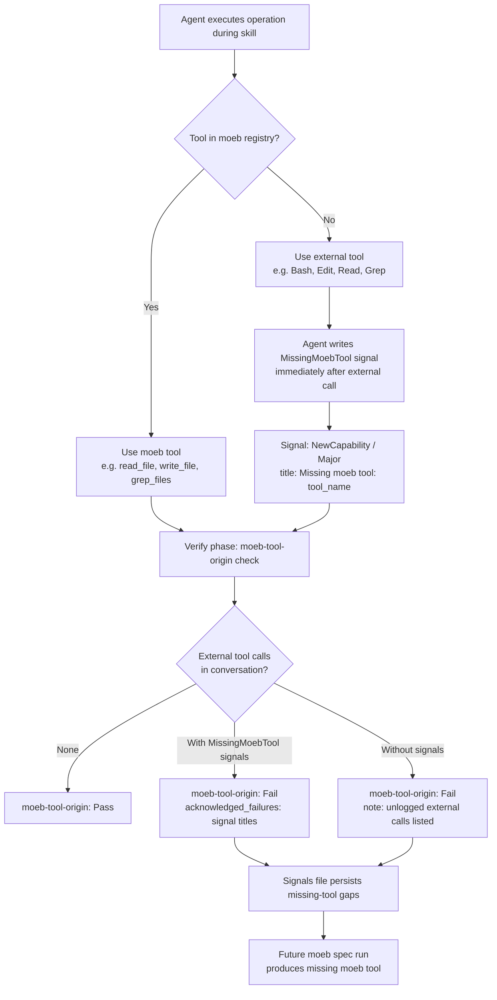

# MCP/CLI Tool Origin Rubric

## Raw Requirement

When we run with MCP and have claude agent orchestrating, I can see the tools being used as part of the skill, to allow for as much parity as possible between mcp and cli I believe we should have a rubric introduced that ensures tools used as part of moeb invocations all originate from moeb itself rather than external commands, if we do not have a command we should use the external version and mark down a failure i.e. missing moeb tool that will get signaled and can later have a spec run to produce the new tool

## Description

Introduces a `moeb-tool-origin` rubric criterion applied globally to every moeb command. The criterion enforces that the orchestrating agent uses only moeb-registered tools during skill execution. When no moeb equivalent exists for a required operation, the agent uses the external tool but must immediately write a `MissingMoebTool` signal capturing the tool name and operation performed. The criterion always fails when any external tool is used — this is intentional: the failure creates pressure for future spec runs that produce the missing moeb tool. Enforcement lives entirely in skill instructions and agent-supplied verdicts; no Rust kernel changes are required.



## Backlinks

### Parents

| Label | Path | Purpose |
|-------|------|---------|
| Harness README | README.md | Root governance document and specification index |
| Kernel Thinness and MCP/CLI Parity Rubrics | specifications/moeb/moeb.kernel-thin-and-mcp-parity-rubrics.md | Establishes global.rubrics.md as placement for project-scope criteria and the catalogue entry policy |
| Rubric Integrity Enforcement | specifications/moeb/moeb.rubric-integrity-enforcement.md | Defines acknowledged_failures mechanism and kernel-authoritative rubric injection |
| MCP Serve / CLI Parity | specifications/moeb/moeb.serve-cli-parity.md | Establishes the MCP/CLI parity goal and spec/run skill-driven execution model |
| Agent Skills | specifications/moeb/moeb.agent-skills.md | Introduces skill files in assets/skills/ as the authoritative workflow layer |
| Rubric Context Layers: Binary-Bundled Baseline Criteria per Command Context | specifications/moeb/moeb.rubric-context-layers.md | Defines the five-layer rubric model and project-level layer boundaries |

## Steps

### Step 1 — Add `moeb-tool-origin` to global project rubric

File: `.moeb/rubrics/global.rubrics.md`

Read the file first to confirm the current table structure and that `moeb-tool-origin` is not already present. Then append a new row to the existing criteria table using `patch_file`:

```
| `moeb-tool-origin` | All tool calls made during this invocation must originate from moeb's own tool registry. If an external tool (not in the moeb registry) was used because no moeb equivalent exists, the agent must write a MissingMoebTool signal immediately after each such call. The criterion always fails when any external tool is used, whether or not a signal was written. | Zero external tool calls | Agent reviews the conversation for calls to non-moeb tools (e.g. Bash, Edit, Write, Read, Glob, Grep, WebFetch, WebSearch in Claude Code MCP mode). Supplies Pass if none were made. If external tools were used with MissingMoebTool signals, supplies Fail with `acknowledged_failures` listing each signal title. If external tools were used without signals, supplies Fail with the unlogged tool names in the note. |
```

Confirm after patching that the table row is syntactically valid (pipe-delimited, five columns matching the header).

### Step 2 — Add tool-origin instructions to `run.skill.md`

Locate the bundled default run skill source file. From prior specs (moeb.agent-skills.md, moeb.ai-first-artifact-refinement.md) the path is inside `src/` under the moeb crate's assets directory. Use `grep_files` with pattern `Tool Origin` or `## Tool Origin` to confirm the file has not already received this section; then use `search_files` with `run.skill.md` to locate the exact path.

**2a — Add Tool Origin Policy section**

Insert the following section into `run.skill.md` immediately after any opening role/identity block and before the first numbered implementation phase heading. If no clear preamble block exists, insert it as the first level-2 heading:

```markdown
## Tool Origin Policy

Prefer moeb tools for every operation during this run. The complete list of available moeb tools is visible in your tool schema (read_file, read_files, read_file_range, write_file, patch_file, grep_files, list_directory, search_files, create_task_list, update_task, verify_rubrics, complete_review, query_agent, git_commit, tag_run, create_branch, bump_version, get_version). If you need an operation and no moeb tool exists for it:

1. Use the external tool (e.g. Bash, Edit, Read) to complete the operation.
2. Immediately after the external call, buffer a MissingMoebTool signal entry to be incorporated into the signals file during the End-of-Skill Review phase:

```json
{
  "category": "NewCapability",
  "severity": "Major",
  "title": "Missing moeb tool: <external_tool_name>",
  "description": "Used <external_tool_name> to perform <description of operation>. No moeb equivalent exists.",
  "proposed_resolution": "Run moeb spec to introduce a moeb equivalent of <external_tool_name> covering <operation>.",
  "gating_condition": null
}
```
```

**2b — Extend the Verify phase**

In the Verify phase of `run.skill.md`, within the instructions for supplying verdicts to `verify_rubrics`, add the following entry for `moeb-tool-origin`:

```
- `moeb-tool-origin`: Review this conversation for tool calls to non-moeb tools (tools whose names are not in the moeb tool schema, such as Bash, Edit, Write, Read, Glob, Grep, WebFetch, or WebSearch). If no external tool calls appear in the conversation, supply Pass. If external tool calls appear and MissingMoebTool signals were buffered for each one, supply Fail with `acknowledged_failures` listing each signal title. If external tool calls appear without corresponding buffered signals, supply Fail and list the unlogged tool names in the note field.
```

### Step 3 — Add tool-origin instructions to `spec.skill.md`

Locate `spec.skill.md` using the same search approach as Step 2.

**3a — Add Tool Origin Policy section**

Insert the identical Tool Origin Policy section (from Step 2a verbatim) into `spec.skill.md` at the same structural position: after any opening preamble and before the first numbered phase heading.

**3b — Extend Phase 6 (Verify)**

In Phase 6 of `spec.skill.md`, within the verify_rubrics evaluation guidance, add the same `moeb-tool-origin` entry (from Step 2b verbatim).

### Step 4 — Regression check

After all patches are applied, verify:

1. `run.skill.md` still contains all six mandatory phase heading strings: `Verify`, `End-of-Skill Review`, `Metrics Recording`, `Commit`, `Tag`, `Complete`. Use `grep_files` to confirm.
2. `spec.skill.md` still contains all six mandatory phase heading strings. Use `grep_files` to confirm.
3. `.moeb/rubrics/global.rubrics.md` contains `moeb-tool-origin` in a pipe-delimited table row. Use `grep_files` to confirm.

## Decisions

### Decision 1 — Global rubric, not catalogue

`moeb-tool-origin` is placed in `.moeb/rubrics/global.rubrics.md` (project global layer, Layer 3) rather than the rubrics catalogue.

**Rationale:** The criterion must apply to every moeb command in this project regardless of traits. A catalogue entry requires trait detection to trigger selection, introducing a risk that the criterion is omitted from runs that don't carry the expected trait. Universal placement removes that gap.

**Rejected alternative:** Trait-keyed catalogue entry with `mcp-surface` or `tool-authoring` traits. Rejected because the criterion is meaningful in CLI mode too (where it is a free pass, confirming the agent used only moeb tools) and because omitting it in any invocation would silently allow unchecked external tool use.

**Consequence:** Every run must supply a verdict for `moeb-tool-origin`. In CLI mode this is always Pass (the agent's tool list contains only moeb tools). In MCP mode failures surface capability gaps that drive new spec runs.

### Decision 2 — Skill-side enforcement, no kernel Rust changes

External-tool detection and verdict supply are implemented as skill instructions only. No changes are made to Rust code.

**Rationale:** In MCP mode, the orchestrating agent's calls to external tools (Bash, Edit, Read, etc.) are routed through the MCP client's own tool system and never pass through moeb's `RealToolExecutor`. The kernel cannot observe these calls at runtime. Enforcement via skill instructions and agent self-reporting is the only viable approach that does not require modifying the MCP protocol.

**Rejected alternative:** Extending `RunState` to track external-tool call events by intercepting the agent loop. Rejected because the CLI agent loop only invokes moeb's own ToolRegistry and does not expose hooks for calls made by the orchestrating agent to its own toolset. Adding such hooks would place behavioural detection logic in Rust, violating `kernel-thin-and-parity`.

**Consequence:** The criterion relies on agent self-reporting and is not kernel-authoritative. An agent could theoretically supply a false Pass verdict. This is acceptable because the design goal is observability and gap-signalling, not tamper-proof enforcement.

### Decision 3 — Always Fail when external tools are used

The criterion fails whenever any external tool call appears in the conversation, whether or not a MissingMoebTool signal was written.

**Rationale:** A Pass verdict when external tools are used would reduce pressure to build moeb equivalents. The failing rubric is the driver: each run using external tools produces a visible rubric failure that surfaces in metrics and creates an unambiguous record that a spec run is needed. Writing the MissingMoebTool signal is a courtesy to the signals system, not a mitigation that converts the verdict to Pass.

**Rejected alternative:** Pass when a MissingMoebTool signal is written (treating the signal as full mitigation). Rejected because it would allow indefinite use of external tools without incentive to close the gap.

**Consequence:** Projects using moeb in MCP mode with a full Claude Code toolset will see `moeb-tool-origin: Fail` on early runs. This is expected and intended. Each failure drives one new moeb tool specification.

### Decision 4 — MissingMoebTool signals use NewCapability category

MissingMoebTool signals are emitted under the `NewCapability` category with `Major` severity.

**Rationale:** A missing moeb tool is not an error in the current run — the operation succeeded via the external tool. It represents a capability gap that should be closed by a future spec run. `NewCapability` communicates exactly that intent.

**Rejected alternative:** `ToolImprovement` category. Rejected because `ToolImprovement` implies an existing moeb tool needs improvement; a missing tool is a net-new capability, not an incremental enhancement.

**Consequence:** Signals appear in the `NewCapability` section of QA reports, making them filterable as a batch to seed a dedicated spec session for new tool creation.

## Rubric

### Structured

| Name | Description | Threshold | Pass Condition |
|------|-------------|-----------|----------------|
| `tool-errors` | No ToolHandler errors were recorded during this command invocation. Covers all tool calls on both CLI and MCP paths via `RealToolExecutor::execute`. Applies to every moeb command. | Zero tool errors | Kernel-authoritative: injected by `verify_rubrics` from `RunState.tool_errors`. Do not supply a verdict — any agent-supplied entry is overridden. |
| `rubric-qualification` | No Pass verdicts with acknowledged failures were issued during this command invocation. An agent that observes a failure but passes a criterion must populate `acknowledged_failures` in the verdict object. Applies to every moeb command. | Zero qualified Pass verdicts | Kernel-authoritative: injected by `verify_rubrics` by scanning `acknowledged_failures` on incoming Pass verdicts. Do not supply a verdict — any agent-supplied entry is overridden. |
| `skill-mandatory-phases` | The skill loaded for this run contains all mandatory phase headings. The agent checks its own prompt context for the exact strings: "Verify", "End-of-Skill Review", "Metrics Recording", "Commit", "Tag", "Complete". No file read is required. | All six mandatory headings present | Agent scans skill content in its loaded context; fails if any mandatory heading string is absent |
| `no-drift` | The specification does not violate any decision recorded in a linked parent specification | Zero contradictions | Manual review of every decision in every parent spec listed in Backlinks |
| `spec-schema-compliance` | All required frontmatter fields and body sections are present and correctly ordered | 100% of required fields and sections | Validation in `domain/spec.rs` exits 0 during `moeb spec` |
| `ai-first-org` | The specification's Steps prescribe file layouts, naming, and helper placement that satisfy the four AI-first organisation principles: one concern per file, context locality, grep-discoverable names, no cross-cutting helpers. | All four principles followed | Manual review: no step produces a file that mixes concerns, no name is generic across the codebase, all helpers are co-located with their callers or promoted to a precisely named module |
| `kernel-thin-and-parity` | No domain-specific or workflow-specific coordination logic may be placed in kernel Rust code when it can live in skill markdown or role files. Every tool registered in the CLI tool registry must also be registered in the MCP stdio server tool list. | Zero violations | Spec review: no proposed step places review/coordination logic in Rust; Run review: grep confirms no skill-specific logic in kernel tools; tool lists in tools/mod.rs and the MCP server match exactly |
| `mcp-cli-behavioural-parity` | For any operation exposed through both the CLI agent loop and the MCP server, the observable outcome must be identical: same file mutations, same tool result string format, same rendered prompt template. No MCP-only or CLI-only code paths may alter the final output. | Zero divergent outcomes | Run review: verify that the `moeb-tool-origin` verdict instructions added to run.skill.md and spec.skill.md produce the same criterion evaluation logic regardless of whether the agent is running in CLI or MCP mode |
| `new-skill-mandatory-phases` | Any `*.skill.md` file written or patched during this run still contains all mandatory phase heading strings: "Verify", "End-of-Skill Review", "Metrics Recording", "Commit", "Tag", "Complete" | All six strings present in every modified skill file | After patching run.skill.md and spec.skill.md, grep_files confirms all six mandatory heading strings are present in each file |

### Qualitative

- The Tool Origin Policy section in `run.skill.md` and `spec.skill.md` must appear early enough in the skill document that an agent reading it sees the policy before beginning any implementation phase.
- The MissingMoebTool signal JSON template in the skill must be complete and self-contained — an agent must be able to copy it verbatim, substituting only the two angle-bracket placeholders, without needing to infer any additional fields.
- The pass condition text for `moeb-tool-origin` in the Verify phase must be specific enough that an agent can apply it mechanically: enumerate non-moeb tool names from the conversation, match against buffered signals, supply the appropriate verdict without ambiguity.
- Decision 2 explicitly acknowledges that this criterion is agent-supplied and not kernel-authoritative, preventing a future implementer from attempting to add kernel-level tracking that would violate `kernel-thin-and-parity`.
