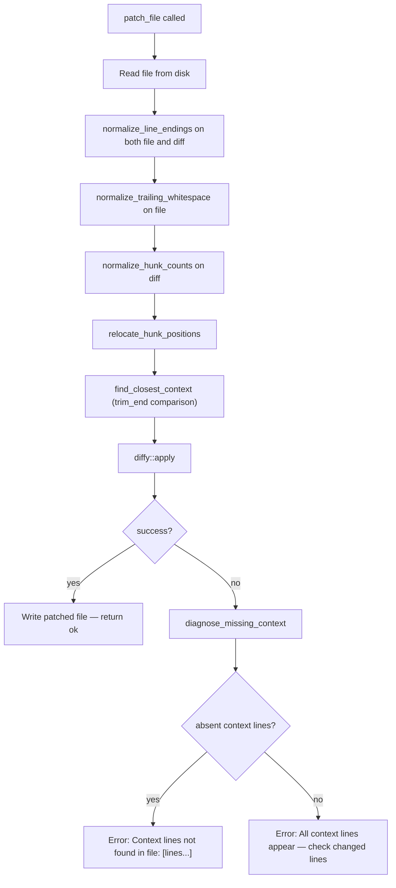

# Patch File: Trailing-Whitespace Tolerance and Apply-Failure Diagnostics

## Raw Requirement

Harden patch_file context matching to eliminate the multi-iteration failure pattern seen when patching files with long markdown table rows. Even with CRLF normalization in place, context lines containing long markdown table rows (200+ chars with pipe characters and backticks) fail to match, requiring the agent to iterate through progressively simpler context until it finds one that works. Two problems: (1) trailing whitespace differences between the actual file lines and the agent-generated context lines cause exact-match failure in find_closest_context; (2) when the patch fails, the error message gives no indication of which specific context lines were not found, so the agent must blindly guess a simpler context on each retry. Fix: (a) normalize trailing whitespace from the file content before diffing, and add trim_end comparison in find_closest_context as defense-in-depth; (b) when diffy::apply fails, emit a diagnostic that identifies which context lines from the hunk are absent from the file — giving the agent precise guidance for the next attempt.

## Description

`find_closest_context` (added by `moeb.patch-file-context-relocate`) uses exact string equality to match context lines from the diff against lines in the file. Editors, git tooling, and copy-paste workflows frequently add trailing spaces to lines — especially in markdown table rows — while agent-generated diffs consistently omit them. The byte-level mismatch causes `find_closest_context` to fail even when the context is semantically correct, so the hunk is passed through at its declared (wrong) line number, and `diffy::apply` then fails.

This specification adds a `normalize_trailing_whitespace` function that is applied to the original file content immediately after `normalize_line_endings`, stripping trailing spaces from every line before the file is used for context matching or diffing. A `.trim_end()` comparison is also introduced inside `find_closest_context` as defense-in-depth for cases where the diff itself carries trailing whitespace on context or removal lines.

A second problem compounds the first: when `diffy::apply` fails, the existing error message says only "re-read the file and regenerate the diff." The agent cannot determine whether the context is absent from the file entirely, present at a different position the relocator missed, or present but surrounded by different lines. A new `diagnose_missing_context` helper scans the failing diff and reports which context lines are absent from the file, giving the agent immediate, actionable information for the next attempt.



## Backlinks

### Parents

| Label | Path | Purpose |
|-------|------|---------|
| Harness README | .moeb/README.md | Root specification index |
| Patch File Tool | specifications/moeb/moeb.patch-file-tool.md | Original patch_file implementation |
| Patch File: Context Relocate | specifications/moeb/moeb.patch-file-context-relocate.md | Introduces find_closest_context and relocate_hunk_positions |
| Patch File: CRLF Normalize | specifications/moeb/moeb.patch-file-crlf-normalize.md | Establishes normalize_line_endings and the pipeline order |

## Steps

### Step 1 — Add `normalize_trailing_whitespace` to `patch_file.rs`

Read `src/moeb/src/tools/patch_file.rs` in full.

Add the following function immediately after `normalize_line_endings`:

```rust
fn normalize_trailing_whitespace(s: &str) -> String {
    let mut result = String::with_capacity(s.len());
    for line in s.lines() {
        result.push_str(line.trim_end());
        result.push('\n');
    }
    if !s.ends_with('\n') && result.ends_with('\n') {
        result.pop();
    }
    result
}
```

The function iterates over logical lines (using `.lines()`, which handles LF after the preceding `normalize_line_endings` step), strips trailing whitespace from each, and reassembles the string. The trailing-newline logic preserves the original file's final-newline state: if the input ended with `\n`, the output does too; if it did not, the extra `\n` pushed for the last line is removed.

### Step 2 — Apply `normalize_trailing_whitespace` in the execute pipeline

In `PatchFileTool::execute`, locate the two existing normalization lines:

```rust
        let diff = normalize_line_endings(diff);
        let original = normalize_line_endings(&original);
```

Replace them with:

```rust
        let diff = normalize_line_endings(diff);
        let original = normalize_line_endings(&original);
        let original = normalize_trailing_whitespace(&original);
```

No other change to the call sequence. The pipeline order is now:
`normalize_line_endings` → `normalize_trailing_whitespace` (file only) → `normalize_hunk_counts` → `relocate_hunk_positions` → `diffy::apply` → write.

### Step 3 — Add `.trim_end()` comparison in `find_closest_context`

In `find_closest_context`, locate the inner equality check:

```rust
            if orig_lines[i + j] != c {
                continue 'outer;
            }
```

Replace it with:

```rust
            if orig_lines[i + j].trim_end() != c.trim_end() {
                continue 'outer;
            }
```

No other change to this function. This provides defense-in-depth: even when the caller supplies a diff whose context lines carry trailing whitespace, relocation can still find the correct position in the (already trailing-whitespace-stripped) file.

### Step 4 — Add `diagnose_missing_context` helper

Immediately before the `pub struct PatchFileTool;` declaration, add:

```rust
/// Returns the context lines from `relocated_diff` that are absent from `original`
/// (using exact equality after trimming trailing whitespace on both sides — consistent
/// with the comparator in `find_closest_context`).  Called only on the apply-failure
/// path to produce an actionable diagnostic.
fn diagnose_missing_context<'a>(relocated_diff: &'a str, original: &str) -> Vec<&'a str> {
    let orig_lines: Vec<&str> = original.lines().collect();
    let mut absent = Vec::new();
    for line in relocated_diff.lines() {
        if line.starts_with('@')
            || line.starts_with('-')
            || line.starts_with('+')
            || line.starts_with('\\')
        {
            continue;
        }
        let ctx = if line.starts_with(' ') { &line[1..] } else { line };
        let ctx_t = ctx.trim_end();
        if ctx_t.is_empty() {
            continue;
        }
        if !orig_lines.iter().any(|l| l.trim_end() == ctx_t) {
            absent.push(ctx);
        }
    }
    absent
}
```

### Step 5 — Emit diagnostic on apply failure

In `PatchFileTool::execute`, locate the `diffy::apply` error mapping:

```rust
        let patched = diffy::apply(&original, &patch)
            .map_err(|e| anyhow::anyhow!(
                "patch_file: failed to apply diff to '{}': {}. \
                 The diff context lines may not match the current file content — \
                 re-read the file and regenerate the diff.",
                path, e
            ))?;
```

Replace it with:

```rust
        let patched = diffy::apply(&original, &patch)
            .map_err(|e| {
                let absent = diagnose_missing_context(&relocated, &original);
                if absent.is_empty() {
                    anyhow::anyhow!(
                        "patch_file: failed to apply diff to '{}': {}. \
                         All context lines appear in the file — check that the \
                         removed lines (-) exactly match the file content, and that \
                         no duplicate context block is selecting the wrong hunk. \
                         Re-read the file and regenerate the diff.",
                        path, e
                    )
                } else {
                    anyhow::anyhow!(
                        "patch_file: failed to apply diff to '{}': {}. \
                         Context lines not found in file: [{}]. \
                         Re-read the file and use only lines that appear verbatim.",
                        path, e,
                        absent.join("; ")
                    )
                }
            })?;
```

### Step 6 — Add regression tests

In `src/moeb/src/tools/patch_file_tests.rs`, add three new tests after the existing tests:

**Test 1 — trailing whitespace on file lines is tolerated:**

```rust
#[test]
fn patch_file_tolerates_trailing_whitespace_in_file() {
    // File lines have trailing spaces (common in markdown tables);
    // diff context lines do not — patch must still apply successfully.
    let dir = temp_dir();
    let file = dir.path().join("target.md");
    std::fs::write(&file, "| col1 | col2 |   \n| old  | val  |   \n").unwrap();

    let tool = PatchFileTool;
    let diff = "@@ -1,2 +1,2 @@\n | col1 | col2 |\n-| old  | val  |\n+| new  | val  |\n";
    let args = serde_json::json!({"path": "target.md", "diff": diff});
    let result = tool.execute(&args, dir.path()).unwrap();

    assert!(result.contains("applied"), "expected success: {}", result);
    let content = std::fs::read_to_string(&file).unwrap();
    assert!(content.contains("new"), "patched content must contain new row");
    assert!(!content.contains("| old"), "old row must be removed");
}
```

**Test 2 — diagnostic names absent context lines:**

```rust
#[test]
fn patch_file_diagnostic_names_absent_context_line() {
    // Context line does not exist in the file; error message must name it.
    let dir = temp_dir();
    let file = dir.path().join("target.md");
    std::fs::write(&file, "| real | row |\n").unwrap();

    let tool = PatchFileTool;
    let diff = "@@ -1,2 +1,2 @@\n | phantom | row |\n-| old | val |\n+| new | val |\n";
    let args = serde_json::json!({"path": "target.md", "diff": diff});
    let err = tool.execute(&args, dir.path()).unwrap_err();
    let msg = err.to_string();
    assert!(
        msg.contains("phantom"),
        "error must name the absent context line: {}",
        msg
    );
}
```

**Test 3 — diagnostic says "all present" when context is found but changed lines mismatch:**

```rust
#[test]
fn patch_file_diagnostic_all_present_when_context_found() {
    // Context line exists but the removal line (-) does not match the file,
    // so diffy::apply fails. The diagnostic must report all context lines present.
    let dir = temp_dir();
    let file = dir.path().join("target.rs");
    std::fs::write(&file, "fn foo() {}\nfn bar() {}\n").unwrap();

    let tool = PatchFileTool;
    let diff = "@@ -1,2 +1,2 @@\n fn foo() {}\n-fn baz() {}\n+fn qux() {}\n";
    let args = serde_json::json!({"path": "target.rs", "diff": diff});
    let err = tool.execute(&args, dir.path()).unwrap_err();
    let msg = err.to_string();
    assert!(
        msg.contains("All context lines appear"),
        "expected all-present diagnostic: {}",
        msg
    );
}
```

### Step 7 — Verify

Run `cargo test -p moeb` and confirm all tests pass including the three new tests. Run `cargo build --release` and confirm zero errors.

Verify the new symbols are present:

```
grep -n "normalize_trailing_whitespace\|diagnose_missing_context\|trim_end" src/moeb/src/tools/patch_file.rs
```

Expect: at least one match for each of the three patterns.

## Decisions

### Decision 1 — Normalize trailing whitespace from the original file content before diffing

**Rationale:** Editors and git tooling frequently add trailing spaces to lines — particularly in markdown table rows. Agent-generated diff context lines consistently omit trailing spaces. The resulting byte mismatch causes `find_closest_context` to fail (no match → hunk passes through at wrong line) and `diffy::apply` to fail (context at declared line does not match file). Stripping trailing whitespace from all file lines before applying the patch removes this entire class of failure. This follows the same precedent as `moeb.patch-file-crlf-normalize.md`: normalize the file to a canonical form, apply the patch against the canonical form, write back the canonical form.

**Rejected alternatives:**

| Option | Reason Rejected |
|--------|-----------------|
| Normalize only the diff's context lines | Addition lines (+) must be preserved exactly; a function that selectively strips trailing whitespace from space- and dash-prefixed lines while preserving plus-prefixed lines is significantly more complex. The file-side normalization is simpler and sufficient for the primary failure mode |
| Trim inside `find_closest_context` only | Relocation would succeed, but `diffy::apply` would still fail because it compares context lines byte-for-byte against the file. The trim must reach the `diffy` input |
| No normalization — require agents to reproduce trailing whitespace exactly | Trailing spaces on table rows are invisible and unpredictable; agents cannot reliably reproduce them |

**Consequences:** Files with trailing whitespace on lines are written back with trailing whitespace removed after a successful patch. This is consistent with standard linting practice and with the `\r\n` → `\n` normalization already applied by `normalize_line_endings`.

---

### Decision 2 — Add `.trim_end()` comparison in `find_closest_context` as defense-in-depth

**Rationale:** Even with `normalize_trailing_whitespace` applied to the original file, an agent-supplied diff whose context lines carry trailing whitespace would fail to match the now-stripped file lines under exact comparison. Adding `.trim_end()` to the equality check in `find_closest_context` makes relocation resilient against trailing whitespace on either side, regardless of which side introduces it.

**Rejected alternatives:**

| Option | Reason Rejected |
|--------|-----------------|
| Rely solely on file normalization | Leaves a residual failure mode when the diff itself has trailing whitespace on context lines — uncommon but not impossible |
| Trim both leading and trailing whitespace | Leading whitespace is significant in source code (indentation) and in diff line semantics (space prefix = context, not addition). Trimming the left side would silently conflate indented and unindented versions of the same text |

**Consequences:** Context matching tolerates trailing-whitespace differences on either side of the comparison. Lines that differ in leading whitespace or content are still correctly rejected as non-matching.

---

### Decision 3 — Emit a diagnostic identifying absent context lines on apply failure

**Rationale:** When `diffy::apply` fails, the current message gives the agent no information about which specific context lines are the problem. In the incident that motivated this spec, the agent cycled through four different context strategies across four iterations before finding one that worked. A post-failure scan that names the absent context lines gives the agent immediate, actionable information: it can remove or replace those specific lines on the very next attempt. When all context lines are found but apply still fails (mismatch on removed or surrounding lines), a distinct "all context lines appear" message directs the agent to inspect the changed lines instead.

**Rejected alternatives:**

| Option | Reason Rejected |
|--------|-----------------|
| Always-on diagnostic (happy path too) | No value on success; adds O(n·m) work to every successful patch call |
| Separate `diagnose_patch` tool | Adds an extra tool call round-trip; the actionable information is most useful in-line with the failing call |
| Richer structured error with per-line presence flags | Tool API is a single string result; the prose message is sufficient for an agent to act on |

**Consequences:** Error messages on apply failure are longer and more specific. The diagnostic scan (O(n·m): context lines × file lines) runs only on the failure path.

---

### Decision 4 — Private `diagnose_missing_context` in `patch_file.rs`, not inline

**Rationale:** Extracting the logic to a named function makes it independently reachable from tests via `super::diagnose_missing_context` and keeps the `map_err` closure readable. The function is called only from `execute` in `patch_file.rs`; it has a single caller and no reason to be promoted to a shared module. This follows the same co-location principle established for `normalize_line_endings` in `moeb.patch-file-crlf-normalize.md` (Decision 3).

**Rejected alternatives:**

| Option | Reason Rejected |
|--------|-----------------|
| Inline in the `map_err` closure | Closure body would exceed 15 lines and cannot be tested in isolation |
| Promote to a shared `utils.rs` module | Single caller; premature generalisation |

**Consequences:** One new private function in `patch_file.rs`. No new files.

## Rubric

### Structured

| Name | Description | Threshold | Pass Condition |
|------|-------------|-----------|----------------|
| `tool-errors` | No ToolHandler errors were recorded during this command invocation. Covers all tool calls on both CLI and MCP paths via `RealToolExecutor::execute`. Applies to every moeb command. | Zero tool errors | Kernel-authoritative: injected by `verify_rubrics` from `RunState.tool_errors`. Do not supply a verdict — any agent-supplied entry is overridden. |
| `rubric-qualification` | No Pass verdicts with acknowledged failures were issued during this command invocation. An agent that observes a failure but passes a criterion must populate `acknowledged_failures` in the verdict object. Applies to every moeb command. | Zero qualified Pass verdicts | Kernel-authoritative: injected by `verify_rubrics` by scanning `acknowledged_failures` on incoming Pass verdicts. Do not supply a verdict — any agent-supplied entry is overridden. |
| `skill-mandatory-phases` | The skill loaded for this run contains all mandatory phase headings. The agent checks its own prompt context (the loaded skill content is already present) for the exact strings: "Verify", "End-of-Skill Review", "Metrics Recording", "Commit", "Tag", "Complete". No file read is required. | All six mandatory headings present | Agent scans skill content in its loaded context; fails if any mandatory heading string is absent |
| `no-drift` | The specification does not violate any decision recorded in a linked parent specification | Zero contradictions | Manual review of every decision in every parent spec listed in Backlinks |
| `spec-schema-compliance` | All required frontmatter fields and body sections are present and correctly ordered | 100% of required fields and sections | Validation in `domain/spec.rs` exits 0 during `moeb spec` |
| `ai-first-org` | The specification's Steps prescribe file layouts, naming, and helper placement that satisfy the four AI-first organisation principles: one concern per file, context locality, grep-discoverable names, no cross-cutting helpers. | All four principles followed | Manual review: no step produces a file that mixes concerns, no name is generic across the codebase, all helpers are co-located with their callers or promoted to a precisely named module |
| `kernel-thin-and-parity` | No domain-specific or workflow-specific coordination logic may be placed in kernel Rust code when it can live in skill markdown or role files. Every tool registered in the CLI tool registry must also be registered in the MCP stdio server tool list. | Zero violations | Spec review: no proposed step places review/coordination logic in Rust; Run review: grep confirms no skill-specific logic in kernel tools; tool lists in tools/mod.rs and the MCP server match exactly |
| `moeb-tool-origin` | All tool calls made during this invocation must originate from moeb's own tool registry. | Zero external tool calls | Agent reviews the conversation for calls to non-moeb tools. Supplies Pass if none were made. If external tools were used with MissingMoebTool signals, supplies Fail with `acknowledged_failures`. |
| `all-tests-pass` | `cargo test -p moeb` exits 0 | Zero failures | `cargo test -p moeb` exits 0 |
| `binary-builds` | `cargo build --release` exits 0 | Zero errors | Build exits 0 |
| `normalize-trailing-whitespace-defined` | `normalize_trailing_whitespace` is defined in `patch_file.rs` | Present | `grep -n "fn normalize_trailing_whitespace" src/moeb/src/tools/patch_file.rs` returns 1 match |
| `normalize-trailing-whitespace-called` | `normalize_trailing_whitespace` is called in `PatchFileTool::execute` on the original file content | Present | `grep -n "normalize_trailing_whitespace" src/moeb/src/tools/patch_file.rs` returns ≥ 2 matches |
| `trim-end-in-find-closest-context` | `find_closest_context` uses `.trim_end()` on both sides of its comparison | Present | `grep -n "trim_end" src/moeb/src/tools/patch_file.rs` returns ≥ 1 match inside the `find_closest_context` function body |
| `diagnose-missing-context-defined` | `diagnose_missing_context` is defined in `patch_file.rs` | Present | `grep -n "fn diagnose_missing_context" src/moeb/src/tools/patch_file.rs` returns 1 match |
| `diagnose-called-on-apply-failure` | `diagnose_missing_context` is called in the `diffy::apply` error mapping | Present | `grep -n "diagnose_missing_context" src/moeb/src/tools/patch_file.rs` returns ≥ 2 matches |

### Qualitative

- `normalize_trailing_whitespace` strips trailing whitespace from each line without altering leading whitespace or blank lines, and preserves the original file's final-newline state.
- `find_closest_context` uses `.trim_end()` on both the file line and the context line; leading whitespace is not modified.
- `diagnose_missing_context` uses the same `.trim_end()` comparison as `find_closest_context`, ensuring consistent absent-line reporting.
- When `diffy::apply` fails and context lines are absent, the error message names each absent line so the agent can immediately identify which context to replace.
- When `diffy::apply` fails and all context lines are found, the error message says so explicitly, directing the agent to inspect the removed (-) lines rather than the context.
- All pre-existing tests (`patch_file_applies_single_hunk`, `patch_file_returns_error_on_context_mismatch`, `patch_file_normalizes_wrong_counts_context_mismatch`, `patch_file_normalizes_wrong_counts_and_applies`, `patch_file_returns_error_on_missing_file`, `patch_file_relocates_wrong_start_and_applies`, `patch_file_does_not_relocate_absent_context`, `test_patch_crlf_file_with_lf_diff`) pass without modification.
- Changes are strictly confined to `src/moeb/src/tools/patch_file.rs` and `src/moeb/src/tools/patch_file_tests.rs`. No other files are modified.
