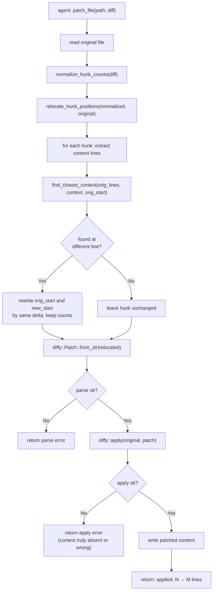

# Patch File Tool: Relocate Hunk Start Positions to Match File Content

## Raw Requirement

> patch_file: failed to apply diff to 'E:\Code\Moeb\src\moeb\src\vcs.rs': error applying hunk
> #1. The diff context lines may not match the current file content — re-read the file and
> regenerate the diff.
>
> The diff declared `@@ -112,4 +112,37 @@` but the context lines (`fn domain_slug_combination`)
> actually appear at line 118 in the file — a 7-line offset outside diffy's search window.
> After `normalize_hunk_counts` fixed the count arithmetic, `diffy::apply` still failed because
> the declared start line was too far from the real location.

## Description

`normalize_hunk_counts` (added by `moeb.patch-file-normalize-hunk-counts`) recalculates `@@`
header line counts from the actual hunk body, eliminating parse failures caused by AI arithmetic
errors. A second class of apply failure remains: the start line numbers in the hunk headers
are wrong. When the file has been modified since the agent last read it, all line numbers shift,
and if the shift exceeds `diffy`'s internal search window the apply fails even though the
context lines themselves are perfectly correct.

This specification adds a `relocate_hunk_positions(diff: &str, original: &str) -> String`
function to `src/moeb/src/tools/patch_file.rs` that is called after `normalize_hunk_counts`
and before `diffy::Patch::from_str`. For each hunk, the function extracts the context lines
(space-prefixed or blank body lines, leading space stripped), searches the original file for
the closest consecutive occurrence of those context lines to the declared `orig_start`, and
rewrites the hunk header's start positions by the measured delta — keeping the counts that
`normalize_hunk_counts` already fixed. A `find_closest_context` helper implements the
proximity-ranked search. Hunks whose context cannot be located in the file are passed through
unchanged so `diffy` surfaces a clear apply error.

## Diagram



## Backlinks

### Parents

| Label | Path | Purpose |
|-------|------|---------|
| Patch File Tool | [specifications/moeb/moeb.patch-file-tool.md](specifications/moeb/moeb.patch-file-tool.md) | Original implementation of patch_file.rs, diffy dependency, and unit test suite |
| Patch File Tool: Normalize Hunk Header Counts Before Parsing | [specifications/moeb/moeb.patch-file-normalize-hunk-counts.md](specifications/moeb/moeb.patch-file-normalize-hunk-counts.md) | Predecessor fix; adds normalize_hunk_counts called before diffy::Patch::from_str |
| README | [README.md](../../README.md) | Root index |

### External

*(none)*

## Steps

### Step 1 — Add `find_closest_context` helper to `src/moeb/src/tools/patch_file.rs`

Read `src/moeb/src/tools/patch_file.rs` in full.

Add the following function immediately before `normalize_hunk_counts`:

```rust
/// Search `orig_lines` for the first consecutive run of `context` lines closest to
/// `near` (1-indexed).  Returns the 1-indexed start line of that run, or `None` if
/// `context` does not appear consecutively anywhere in `orig_lines`.
fn find_closest_context(orig_lines: &[&str], context: &[&str], near: usize) -> Option<usize> {
    if context.is_empty() || orig_lines.len() < context.len() {
        return None;
    }
    let mut best: Option<(usize, usize)> = None; // (distance, 1-indexed line)
    let max_start = orig_lines.len() - context.len();
    'outer: for i in 0..=max_start {
        for (j, &c) in context.iter().enumerate() {
            if orig_lines[i + j] != c {
                continue 'outer;
            }
        }
        let line = i + 1; // 1-indexed
        let dist = if line >= near { line - near } else { near - line };
        if best.map_or(true, |(d, _)| dist < d) {
            best = Some((dist, line));
        }
    }
    best.map(|(_, line)| line)
}
```

### Step 2 — Add `relocate_hunk_positions` to `src/moeb/src/tools/patch_file.rs`

Add the following function immediately after `find_closest_context` and before `normalize_hunk_counts`:

```rust
/// For each hunk in `diff`, extract the context lines and search `original` for the
/// closest consecutive occurrence.  If found at a line other than the declared
/// `orig_start`, rewrite both `orig_start` and `new_start` in the hunk header by the
/// same delta, preserving the counts that `normalize_hunk_counts` already set.
/// Hunks whose context cannot be located are passed through unchanged.
fn relocate_hunk_positions(diff: &str, original: &str) -> String {
    let diff_lines: Vec<&str> = diff.lines().collect();
    let orig_lines: Vec<&str> = original.lines().collect();
    let mut out: Vec<String> = Vec::with_capacity(diff_lines.len());
    let mut i = 0;

    while i < diff_lines.len() {
        let line = diff_lines[i];

        if !line.starts_with("@@") {
            out.push(line.to_string());
            i += 1;
            continue;
        }

        // Parse the hunk header produced by normalize_hunk_counts:
        // @@ -orig_start,orig_count +new_start,new_count @@ [suffix]
        let inner = line.trim_start_matches('@').trim_start().trim_end_matches('@').trim();
        let (ranges, suffix) = if let Some(idx) = inner.find("@@") {
            (inner[..idx].trim(), inner[idx + 2..].trim())
        } else {
            (inner, "")
        };

        let mut parts = ranges.split_whitespace();
        let orig_range = parts.next().unwrap_or("");
        let new_range  = parts.next().unwrap_or("");

        let parse_start = |r: &str, prefix: char| -> Option<usize> {
            r.trim_start_matches(prefix).split(',').next()?.parse().ok()
        };
        let parse_count = |r: &str, prefix: char| -> Option<usize> {
            r.trim_start_matches(prefix).split(',').nth(1)?.parse().ok()
        };

        let orig_start = parse_start(orig_range, '-');
        let new_start  = parse_start(new_range,  '+');
        let orig_count = parse_count(orig_range, '-');
        let new_count  = parse_count(new_range,  '+');

        // Collect the hunk body.
        i += 1;
        let body_start = i;
        while i < diff_lines.len() && !diff_lines[i].starts_with("@@") {
            i += 1;
        }
        let body = &diff_lines[body_start..i];

        // Attempt relocation only when the header was fully parseable.
        if let (Some(os), Some(ns), Some(oc), Some(nc)) = (orig_start, new_start, orig_count, new_count) {
            // Context lines: not removal, addition, or no-newline marker.
            let context: Vec<&str> = body
                .iter()
                .filter(|l| !l.starts_with('-') && !l.starts_with('+') && !l.starts_with('\\'))
                .map(|l| if l.starts_with(' ') { &l[1..] } else { *l })
                .collect();

            if !context.is_empty() {
                if let Some(found) = find_closest_context(&orig_lines, &context, os) {
                    if found != os {
                        let delta: i64 = (found as i64) - (os as i64);
                        let new_ns = (ns as i64) + delta;
                        if new_ns >= 1 {
                            let new_header = if suffix.is_empty() {
                                format!("@@ -{},{} +{},{} @@", found, oc, new_ns, nc)
                            } else {
                                format!("@@ -{},{} +{},{} @@ {}", found, oc, new_ns, nc, suffix)
                            };
                            out.push(new_header);
                            for bl in body {
                                out.push(bl.to_string());
                            }
                            continue;
                        }
                    }
                }
            }
        }

        // No relocation: emit hunk unchanged.
        out.push(line.to_string());
        for bl in body {
            out.push(bl.to_string());
        }
    }

    let mut result = out.join("\n");
    if diff.ends_with('\n') {
        result.push('\n');
    }
    result
}
```

### Step 3 — Call `relocate_hunk_positions` in `PatchFileTool::execute`

In `PatchFileTool::execute`, replace:

```rust
        let normalized = normalize_hunk_counts(diff);
        let patch = diffy::Patch::from_str(&normalized)
```

with:

```rust
        let normalized = normalize_hunk_counts(diff);
        let relocated = relocate_hunk_positions(&normalized, &original);
        let patch = diffy::Patch::from_str(&relocated)
```

No other changes to `execute`.

### Step 4 — Add unit tests

In the `#[cfg(test)]` block of `patch_file.rs`, add two new tests after the existing tests:

```rust
    #[test]
    fn patch_file_relocates_wrong_start_and_applies() {
        // Content is at line 6 but the diff declares line 1.
        // relocate_hunk_positions finds the context at line 6 and adjusts the header;
        // diffy::apply then succeeds.
        let dir = temp_dir();
        let file = dir.path().join("target.rs");
        std::fs::write(
            &file,
            "fn a() {}\nfn b() {}\nfn c() {}\nfn d() {}\nfn e() {}\nfn foo() {}\nfn old() {}\n",
        )
        .unwrap();

        let tool = PatchFileTool;
        // Declares start at line 1, but fn foo() is at line 6.
        let diff = "@@ -1,2 +1,2 @@\n fn foo() {}\n-fn old() {}\n+fn new() {}\n";
        let args = serde_json::json!({"path": "target.rs", "diff": diff});
        let result = tool.execute(&args, dir.path()).unwrap();

        assert!(result.contains("applied"), "expected success: {}", result);
        let content = std::fs::read_to_string(&file).unwrap();
        assert!(content.contains("fn new() {}"), "added line must be present");
        assert!(!content.contains("fn old() {}"), "removed line must be absent");
    }

    #[test]
    fn patch_file_does_not_relocate_absent_context() {
        // Context line does not exist anywhere in the file; relocation cannot help.
        // The hunk is passed through unchanged and diffy returns an apply error.
        let dir = temp_dir();
        let file = dir.path().join("target.rs");
        std::fs::write(&file, "fn foo() {}\n").unwrap();

        let tool = PatchFileTool;
        let diff = "@@ -99,2 +99,2 @@\n fn nonexistent() {}\n-fn old() {}\n+fn new() {}\n";
        let args = serde_json::json!({"path": "target.rs", "diff": diff});
        let err = tool.execute(&args, dir.path()).unwrap_err();
        assert!(
            err.to_string().contains("failed to apply"),
            "expected apply error: {}",
            err
        );
        assert_eq!(std::fs::read_to_string(&file).unwrap(), "fn foo() {}\n");
    }
```

### Step 5 — Verify

Run `cargo build --release` — zero errors. Run `cargo test` — all tests pass including the two new tests.

Confirm both functions are present and `relocate_hunk_positions` is called in `execute`:

```
grep -n "relocate_hunk_positions\|find_closest_context" src/moeb/src/tools/patch_file.rs
```

Should return at least three matches: the two function definitions and the call site in `execute`.

## Decisions

### Decision 1 — Relocate rather than instruct the agent to re-read and retry

**Rationale:** The same principle that motivated `normalize_hunk_counts` applies here: AI agents
reliably produce correct context lines but frequently produce wrong start line numbers, especially
when the file has been modified by a prior tool call in the same run, shifting all subsequent line
numbers. Fixing start lines in the tool eliminates this entire class of failure regardless of model
or prompt. Requiring the agent to re-read and regenerate imposes a whole extra round-trip with no
guarantee the regenerated diff will have the correct line number.

**Alternatives:**

| Option | Reason Rejected |
|--------|-----------------|
| Improve error message only | Agent is already told to re-read; the extra round-trip is wasteful and still fails if the agent miscalculates again |
| Update run.skill.md with line-number calculation rules | Prompt guidance reduces frequency but cannot eliminate off-by-N errors across thousands of model calls |
| Increase diffy's internal fuzz factor | `diffy` does not expose a fuzz configuration parameter; patching or forking the crate would be disproportionate |

**Consequences:** `patch_file` now accepts diffs with incorrect start line numbers provided the
context lines themselves are present and consecutive in the file. The two new unit tests document
this behaviour.

---

### Decision 2 — Search for the closest occurrence to `orig_start`, not the first occurrence

**Rationale:** Choosing the occurrence nearest to the declared line number is consistent with how
`patch` and `diffy` already orient their search, and avoids selecting a distant match in a file
that contains repeated identical context (e.g., a closing `}` that appears on many lines). The
proximity preference minimises the chance of misidentifying the target hunk.

**Alternatives:**

| Option | Reason Rejected |
|--------|-----------------|
| Use the first occurrence (lowest line number) | May match an identical context block earlier in the file that is not the intended target |
| Use the last occurrence | Same problem in the opposite direction |

**Consequences:** In files with duplicate context, the relocation targets whichever occurrence is
closest to the declared line. If the declared line is equidistant from two occurrences, the
lower-numbered one wins (since the loop visits in ascending order and records the first minimum).

---

### Decision 3 — Pass hunks with absent context through unchanged

**Rationale:** If none of the context lines appear consecutively in the file, relocation cannot
help; the diff is genuinely wrong. Passing the hunk through unchanged lets `diffy` emit its own
apply error, which the existing error message already provides clear guidance for ("re-read the
file and regenerate the diff"). Introducing a new error code here would be redundant.

**Alternatives:**

| Option | Reason Rejected |
|--------|-----------------|
| Return a custom error immediately | Duplicates diffy's error path; the existing message is clear |

**Consequences:** Completely wrong context (context that does not exist in the file) still surfaces
as an apply error from diffy, unchanged from pre-relocation behaviour.

---

### Decision 4 — Only relocate when the header is fully parseable

**Rationale:** `relocate_hunk_positions` is called after `normalize_hunk_counts`, which already
rewrites every parseable header. A header that still cannot be parsed after normalization is
fundamentally malformed; attempting relocation on it would produce unpredictable results. Passing
it through unchanged preserves the safe fallback behaviour from both functions.

**Alternatives:**

| Option | Reason Rejected |
|--------|-----------------|
| Error immediately on unparseable header | Duplicates diffy's error path unnecessarily |

**Consequences:** A hunk with an unparseable `@@` line after normalization is passed to diffy
unchanged. Diffy returns a parse error as it would without either preprocessing step.

## Rubric

### Structured

| Name | Description | Threshold | Pass Condition |
|------|-------------|-----------|----------------|
| `binary-builds` | `cargo build --release` exits 0 | Zero errors | CI build exits 0 |
| `all-tests-pass` | `cargo test` exits 0 | Zero failures | `cargo test` exits 0 |
| `relocator-called-in-execute` | `relocate_hunk_positions` is called in `PatchFileTool::execute` between `normalize_hunk_counts` and `diffy::Patch::from_str` | Present | `grep -n "relocate_hunk_positions" src/moeb/src/tools/patch_file.rs` returns ≥ 2 matches |
| `find-closest-context-defined` | `find_closest_context` function is defined in `patch_file.rs` | Present | `grep -n "fn find_closest_context" src/moeb/src/tools/patch_file.rs` returns 1 match |
| `relocate-happy-path-test` | `patch_file_relocates_wrong_start_and_applies` passes: wrong start line but correct context → applied | Pass | `cargo test patch_file_relocates_wrong_start_and_applies` exits 0 |
| `relocate-absent-context-test` | `patch_file_does_not_relocate_absent_context` passes: context absent from file → apply error, file unchanged | Pass | `cargo test patch_file_does_not_relocate_absent_context` exits 0 |

### Qualitative

- **Existing test suite unaffected:** All tests present before this spec (`patch_file_applies_single_hunk`, `patch_file_returns_error_on_context_mismatch`, `patch_file_normalizes_wrong_counts_context_mismatch`, `patch_file_normalizes_wrong_counts_and_applies`, `patch_file_returns_error_on_missing_file`) must continue to pass without modification.
- **Pipeline order preserved:** The call order in `execute` must remain: read file → `normalize_hunk_counts` → `relocate_hunk_positions` → `diffy::Patch::from_str` → `diffy::apply` → write file. No step may be reordered.
- **File unchanged on apply failure:** When relocation finds the context but `diffy::apply` still fails (e.g., the content following the context has changed), the target file on disk must remain identical to its pre-call state.
- **No behaviour change for correct diffs:** A diff with correct start lines passes through `relocate_hunk_positions` with `found == orig_start` and is emitted unchanged.
