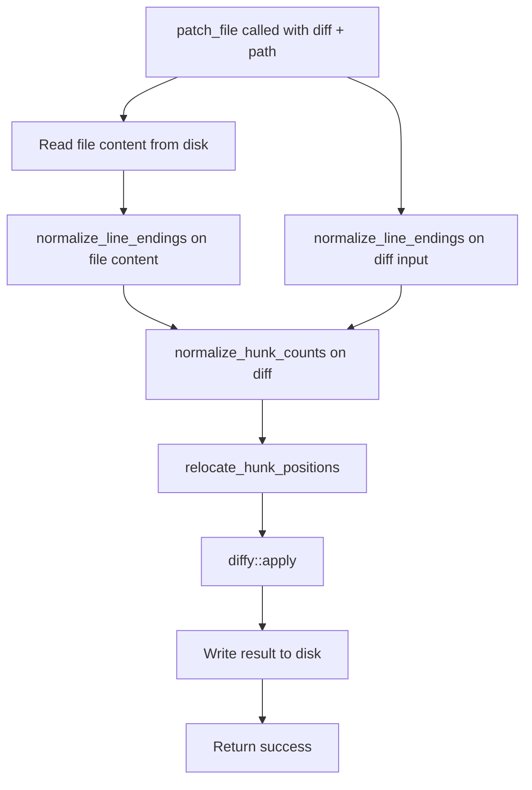

# Patch File Tool: Normalize CRLF Line Endings Before Applying Diffs

## Raw Requirement

Investigate and fix patch_file hunk relocation logic for CRLF files on Windows, or normalise line endings before applying diffs.

## Description

On Windows, files frequently use CRLF (`\r\n`) line endings. The `patch_file` tool reads file content and diff input as raw strings and passes them through hunk-count normalization, context relocation (`find_closest_context` / `relocate_hunk_positions`), and finally `diffy::apply`. When the diff's context lines use LF (`\n`) but the file on disk contains CRLF, string-equality comparisons inside `find_closest_context` fail to match, causing relocation to produce wrong line positions and `diffy::apply` to return an error.

The fix adds a `normalize_line_endings` function in `patch_file.rs` that converts both `\r\n` and bare `\r` to `\n`. This function is applied to the incoming diff string and the file content read from disk before any further processing. The pipeline order becomes: `normalize_line_endings` → `normalize_hunk_counts` → `relocate_hunk_positions` → `diffy::apply`. The result is written back with LF line endings, which is the diffy crate's native output format.



## Backlinks

### Parents

| Label | Path | Purpose |
|-------|------|---------|
| Harness README | .moeb/README.md | Root specification index |
| Patch File Tool | specifications/moeb/moeb.patch-file-tool.md | Original patch_file implementation using diffy |
| Patch File: Normalize Hunk Counts | specifications/moeb/moeb.patch-file-normalize-hunk-counts.md | Pre-parse hunk count normalization |
| Patch File: Context Relocate | specifications/moeb/moeb.patch-file-context-relocate.md | Hunk start-position relocation via context matching |

## Steps

1. **Add `normalize_line_endings` to `src/moeb/src/tools/patch_file.rs`**

   Add the following private function alongside `normalize_hunk_counts`:

   ```rust
   fn normalize_line_endings(s: &str) -> String {
       s.replace("\r\n", "\n").replace('\r', '\n')
   }
   ```

   The double-pass handles both `\r\n` (Windows CRLF) and bare `\r` (legacy Mac CR). The first replacement must run before the second to avoid leaving stray `\n` pairs.

2. **Apply normalization before the existing pipeline in the patch_file handler**

   In the handler body, immediately after reading the file content from disk and before calling `normalize_hunk_counts`, shadow both the diff string and the file content with their normalized equivalents:

   ```rust
   let diff = normalize_line_endings(&diff);
   let original = normalize_line_endings(&original);
   ```

   Ensure all downstream calls — `normalize_hunk_counts`, `relocate_hunk_positions`, `diffy::apply` — receive the LF-normalized values.

3. **Add a CRLF regression test in the patch_file test file**

   In `src/moeb/src/tools/patch_file_tests.rs` (the companion test file per `moeb.test-file-separation.md`), add a test named `test_patch_crlf_file_with_lf_diff`:

   - Construct file content with CRLF line endings, e.g.:
     ```
     "fn foo() {\r\n    bar();\r\n}\r\n"
     ```
   - Construct a LF-only unified diff that replaces `bar()` with `baz()` with correct context.
   - Invoke the patch logic through the public or test-accessible entry point (use `super::` to access `normalize_line_endings`, `normalize_hunk_counts`, `relocate_hunk_positions`, and `diffy::apply` in sequence, or call the full handler via a tempfile).
   - Assert the result contains `baz()` and no apply error is returned.

4. **Run `cargo test -p moeb` and confirm all tests pass**

   No pre-existing test must regress. The new CRLF test must pass. If any pre-existing test fails, do not proceed; diagnose and fix before marking the run complete.

## Decisions

### Decision 1 — Normalize both diff input and file content to LF before processing

**Rationale:** `find_closest_context` (introduced by `moeb.patch-file-context-relocate.md`) compares context lines using string equality. A file with `\r\n` endings produces lines that differ byte-for-byte from LF-only diff context lines even when semantically identical. Normalizing both inputs at the earliest stage removes the mismatch and ensures `normalize_hunk_counts`, context relocation, and `diffy::apply` all operate on a canonical LF-only representation.

**Rejected alternatives:**
- Normalize only the file content: fails when the agent-supplied diff itself contains embedded `\r` characters (e.g. when the agent runs on Windows and produces CRLF diff text).
- Normalize only the diff: fails when the file has CRLF and the diff has correct LF context that still does not match the raw file bytes.
- Trim `\r` inside `find_closest_context` only: does not fix `diffy::apply` which also requires LF-consistent input; more invasive and fragile.

**Consequences:** Files originally using CRLF will be written back with LF endings after a successful patch. This is the diffy crate's native output format and standard for cross-platform source code.

### Decision 2 — Apply normalization before `normalize_hunk_counts`

**Rationale:** `normalize_hunk_counts` counts lines in the diff string. If the diff contains embedded `\r` characters, the line iterator may miscount, producing incorrect `@@` arithmetic. Normalizing first guarantees the arithmetic is correct.

**Rejected alternatives:**
- Apply after `normalize_hunk_counts`: hunk line counts may already be wrong if computed from a CRLF diff.

**Consequences:** The fixed pipeline order is: `normalize_line_endings` → `normalize_hunk_counts` → `relocate_hunk_positions` → `diffy::apply`.

### Decision 3 — Private function in `patch_file.rs`, not a shared utility

**Rationale:** AI-First organisation: one concern per file; helpers co-located with their callers. `normalize_line_endings` is called only inside `patch_file.rs`. Promoting it to a shared module would introduce a cross-cutting helper with a single caller, violating the no-cross-cutting-helpers principle.

**Rejected alternatives:**
- Inline `str::replace` calls at each use site: duplicated logic, harder to test in isolation.
- Promote to `src/moeb/src/utils.rs`: no other file currently needs this function; premature generalisation.

**Consequences:** If a future spec requires the same normalization in another tool, a targeted spec may promote the function at that time.

## Rubric

### Structured

| Name | Description | Threshold | Pass Condition |
|------|-------------|-----------|----------------|
| `tool-errors` | No ToolHandler errors were recorded during this command invocation. Covers all tool calls on both CLI and MCP paths via `RealToolExecutor::execute`. Applies to every moeb command. | Zero tool errors | Kernel-authoritative: injected by `verify_rubrics` from `RunState.tool_errors`. Do not supply a verdict — any agent-supplied entry is overridden. |
| `rubric-qualification` | No Pass verdicts with acknowledged failures were issued during this command invocation. An agent that observes a failure but passes a criterion must populate `acknowledged_failures` in the verdict object. Applies to every moeb command. | Zero qualified Pass verdicts | Kernel-authoritative: injected by `verify_rubrics` by scanning `acknowledged_failures` on incoming Pass verdicts. Do not supply a verdict — any agent-supplied entry is overridden. |
| `skill-mandatory-phases` | The skill loaded for this run contains all mandatory phase headings. | All six mandatory headings present | Agent scans skill content in loaded context for the exact strings: "Verify", "End-of-Skill Review", "Metrics Recording", "Commit", "Tag", "Complete". |
| `no-drift` | The specification does not violate any decision recorded in a linked parent specification. | Zero contradictions | Manual review of every decision in every parent spec listed in Backlinks. |
| `spec-schema-compliance` | All required frontmatter fields and body sections are present and correctly ordered. | 100% of required fields and sections | Validation in `domain/spec.rs` exits 0 during `moeb spec`. |
| `ai-first-org` | The specification's Steps prescribe file layouts, naming, and helper placement that satisfy the four AI-first organisation principles: one concern per file, context locality, grep-discoverable names, no cross-cutting helpers. | All four principles followed | Manual review: no step produces a file that mixes concerns, no name is generic across the codebase, all helpers are co-located with their callers. |
| `kernel-thin-and-parity` | No domain-specific or workflow-specific coordination logic may be placed in kernel Rust code when it can live in skill markdown or role files. Every tool registered in the CLI tool registry must also be registered in the MCP stdio server tool list. | Zero violations | Spec review: no proposed step places sequencing or conditional workflow logic in Rust when a skill-file change would suffice. Run review: grep confirms no skill-specific logic in kernel tools; tool lists in tools/mod.rs and the MCP server match exactly. |
| `moeb-tool-origin` | All tool calls made during this invocation must originate from moeb's own tool registry. | Zero external tool calls | Agent reviews the conversation for calls to non-moeb tools. Supplies Pass if none were made. If external tools were used with MissingMoebTool signals, supplies Fail with `acknowledged_failures`. |
| `thin-kernel` | New Rust code in tools/, commands/, or domain/ must be either (a) a primitive operation wrapper (filesystem, git, or HTTP with no domain logic) or (b) a thin dispatcher. Workflow logic must live in skill markdown or role files, not in compiled Rust. | Zero workflow-logic functions in new Rust | Run review: `normalize_line_endings` in `patch_file.rs` wraps a single string operation with no domain-specific branching; confirmed by grep of the function body. |

### Qualitative

- The `normalize_line_endings` function handles both `\r\n` and isolated `\r` by applying the two-pass replacement in the correct order.
- The CRLF regression test demonstrates that a file with CRLF line endings is successfully patched by a LF-only unified diff with no apply error.
- Changes are strictly confined to `src/moeb/src/tools/patch_file.rs` and `src/moeb/src/tools/patch_file_tests.rs`. No other files are modified.
