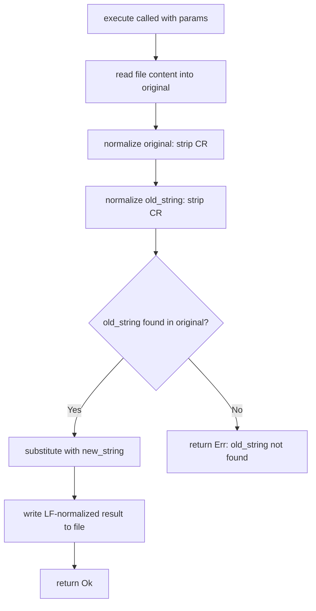

# Patch File Exact-String: CRLF Normalization

## Raw Requirement

Add CRLF normalization to patch_file.rs in the execute method, immediately after reading the file: strip \r from both `original` and `old_string` before the substring search, then write the normalized (LF) content back. This is a three-line change. Also add a regression test in patch_file_tests.rs: write a CRLF file, call patch_file with LF old_string, assert success and correct output.

## Description

The `moeb.patch-file-exact-string-rewrite` specification replaced the unified-diff (diffy) implementation with exact-string matching (`old_string`/`new_string` substring replacement). The prior CRLF normalization introduced by `moeb.patch-file-crlf-normalize` applied to the unified-diff processing pipeline and was not carried forward to the exact-string implementation. This specification adds CRLF normalization directly to the `execute` method in `patch_file.rs`: immediately after reading the file content, both `original` and `old_string` have `\r` stripped before the substring search. The normalized (LF-only) content is written back to disk on success. A companion regression test in `patch_file_tests.rs` verifies the cross-line-ending matching scenario where a CRLF file is patched using a LF-only `old_string`.



## Backlinks

### Parents

| Label | Path | Purpose |
|-------|------|---------|
| Harness README | [.moeb/README.md](.moeb/README.md) | Top-level harness index |
| Patch File Exact-String Rewrite | [specifications/moeb/moeb.patch-file-exact-string-rewrite.md](specifications/moeb/moeb.patch-file-exact-string-rewrite.md) | Parent spec introducing the exact-string replace; this spec extends it with CRLF input tolerance |
| Patch File CRLF Normalize | [specifications/moeb/moeb.patch-file-crlf-normalize.md](specifications/moeb/moeb.patch-file-crlf-normalize.md) | Prior CRLF normalization for the diffy-based implementation; this spec re-applies the same principle to the exact-string path |

## Steps

### Step 1 — Add CRLF normalization in `patch_file.rs` execute method

File: `src/moeb/tools/patch_file.rs`

Locate the `execute` method body. Find the line where `original` is assigned by reading the file (e.g. `let original = fs::read_to_string(&path)?;` or equivalent). Immediately after that assignment, insert these two lines:

```rust
let original = original.replace('\r', "");
let old_string = params.old_string.replace('\r', "");
```

Replace all subsequent references to `params.old_string` within this method with the local `old_string` binding. The `new_string` field (`params.new_string`) does not need normalization — it is agent-supplied and assumed LF-only.

The content written back to the file will be LF-normalized because `original` has had `\r` stripped before the substitution is applied.

### Step 2 — Add regression test in `patch_file_tests.rs`

File: `src/moeb/tools/patch_file_tests.rs`

Add a test function named `test_patch_file_crlf_normalization`. Follow the invocation pattern used by existing tests in that file for constructing params and calling the handler:

1. Create a temporary file and write content `"line1\r\nline2\r\nline3\r\n"` (CRLF line endings) to it.
2. Build params with:
   - `path`: the temp file path (as a string)
   - `old_string`: `"line2\n"` (LF-only)
   - `new_string`: `"replaced\n"` (LF-only)
3. Invoke the `patch_file` handler or `PatchFileTool::execute` with these params.
4. Assert the result indicates success (no error).
5. Read the output file content and assert it equals `"line1\nreplaced\nline3\n"` — all CRLF converted to LF and the middle line replaced.

### Step 3 — Verify: run `cargo test`

Run `cargo test -p moeb` and confirm:
- `test_patch_file_crlf_normalization` passes.
- No pre-existing tests regress.

## Decisions

### Decision 1 — Inline normalization in execute, not a named helper

The requirement specifies a three-line change inline in the execute method. Two `.replace('\r', "")` calls are self-documenting at their call site and do not warrant a named function at this scope. If a third normalization site appears in a future spec, extracting a helper is appropriate then.

**Rejected alternative**: Reuse or restore the `normalize_line_endings` function from the prior diffy-based implementation. The exact-string rewrite removed that function's context; reintroducing it as a named helper called only twice adds indirection without benefit.

**Consequence**: If a future spec adds a third normalization site, that spec should extract and name the helper.

### Decision 2 — Write LF-normalized content back to disk

After normalization, the output file contains only LF line endings regardless of what the original file contained. This intentionally converts CRLF → LF on every successful patch. Normalization is an input-tolerance mechanism, not a line-ending preservation mechanism.

**Rejected alternative**: Reconstruct the original CRLF content with only the changed lines substituted. This would require tracking the pre-normalization original separately and re-inserting `\r` on unchanged lines. The added complexity is not warranted given that moeb tool output is consistently LF-only.

**Consequence**: Files that were CRLF before a patch become LF after it. Callers that need CRLF-preserved output should not rely on `patch_file` for that invariant.

### Decision 3 — Regression test uses LF old_string against CRLF file content

The primary failure mode addressed is: the run agent generates LF-only `old_string` values (tools produce LF output), but the file on disk has CRLF line endings (common on Windows). Testing with a LF `old_string` against a CRLF file directly exercises this scenario and would fail without the normalization change.

**Rejected alternative**: Test with CRLF `old_string`. Post-normalization both sides become LF regardless, so the test would pass even if the normalization were removed. The LF-vs-CRLF combination provides stronger evidence that normalization is the mechanism making the match succeed.

**Consequence**: A complementary test with CRLF `old_string` would also be valid but is not required by this specification.

## Rubric

### Structured

| Name | Description | Threshold | Pass Condition |
|------|-------------|-----------|----------------|
| `tool-errors` | No ToolHandler errors were recorded during this command invocation. Covers all tool calls on both CLI and MCP paths via `RealToolExecutor::execute`. Applies to every moeb command. | Zero tool errors | Kernel-authoritative: injected by `verify_rubrics` from `RunState.tool_errors`. Do not supply a verdict — any agent-supplied entry is overridden. |
| `rubric-qualification` | No Pass verdicts with acknowledged failures were issued during this command invocation. An agent that observes a failure but passes a criterion must populate `acknowledged_failures` in the verdict object. Applies to every moeb command. | Zero qualified Pass verdicts | Kernel-authoritative: injected by `verify_rubrics` by scanning `acknowledged_failures` on incoming Pass verdicts. Do not supply a verdict — any agent-supplied entry is overridden. |
| `skill-mandatory-phases` | The skill loaded for this run contains all mandatory phase headings. The agent checks its own prompt context (the loaded skill content is already present) for the exact strings: "Verify", "End-of-Skill Review", "Metrics Recording", "Commit", "Tag", "Complete". No file read is required. | All six mandatory headings present | Agent scans skill content in its loaded context; fails if any mandatory heading string is absent |
| `no-drift` | The specification does not violate any decision recorded in a linked parent specification | Zero contradictions | Manual review of every decision in every parent spec listed in Backlinks |
| `spec-schema-compliance` | All required frontmatter fields and body sections are present and correctly ordered | 100% of required fields and sections | Validation in `domain/spec.rs` exits 0 during `moeb spec` |
| `ai-first-org` | The specification's Steps prescribe file layouts, naming, and helper placement that satisfy the four AI-first organisation principles: one concern per file, context locality, grep-discoverable names, no cross-cutting helpers. | All four principles followed | Manual review: no step produces a file that mixes concerns, no name is generic across the codebase, all helpers are co-located with their callers or promoted to a precisely named module |
| `branch-clean-at-exit` | After Phase 9 (Commit), the working tree contains no uncommitted changes; any dirty state detected in Phase 9a has been resolved by retry commit (Case A) or by signal emission and cleanup commit (Case B) | Zero uncommitted changes at spec skill exit | Agent verifies that `git_status` returned empty output after Phase 9, or that a retry (Case A) or cleanup commit (Case B) was issued and the branch is clean |
| `kernel-thin-and-parity` | No domain-specific or workflow-specific coordination logic may be placed in kernel Rust code when it can live in skill markdown or role files. Every tool registered in the CLI tool registry must also be registered in the MCP stdio server tool list. | Zero violations | Spec review: no proposed step places review/coordination logic in Rust; Run review: grep confirms no skill-specific logic in kernel tools; tool lists in tools/mod.rs and the MCP server match exactly |
| `moeb-tool-origin` | All tool calls made during this invocation must originate from moeb's own tool registry. If an external tool (not in the moeb registry) was used because no moeb equivalent exists, the agent must write a MissingMoebTool signal immediately after each such call. The criterion always fails when any external tool is used, whether or not a signal was written. | Zero external tool calls | Agent reviews the conversation for calls to non-moeb tools (e.g. Bash, Edit, Write, Read, Glob, Grep, WebFetch, WebSearch in Claude Code MCP mode). Supplies Pass if none were made. If external tools were used with MissingMoebTool signals, supplies Fail with `acknowledged_failures` listing each signal title. If external tools were used without signals, supplies Fail with the unlogged tool names in the note. |
| `thin-kernel` | New Rust code in tools/, commands/, or domain/ must be either (a) a primitive operation wrapper (filesystem, git, or HTTP with no domain logic) or (b) a thin dispatcher. Workflow logic — sequencing, conditionals, review loops, retry strategy — must live in skill markdown or role files, not in compiled Rust. | Zero workflow-logic functions in new Rust | Spec review: no Step proposes placing sequencing or conditional workflow logic in Rust when a skill-file change would suffice; Run review: every new function in tools/ or commands/ either wraps a single OS/VCS/HTTP call or contains no domain-specific branching |
| `mcp-cli-behavioural-parity` | For any operation exposed through both the CLI agent loop and the MCP server, the observable outcome must be identical: same file mutations, same tool result string format, same rendered prompt template. Any tool modified in the standard registry must carry an identical registration and result contract in the MCP server. | Zero divergent outcomes | Run review: patch_file registration is unchanged; only the implementation body changes; ToolRegistry::standard() and MCP server continue to carry identical registrations |

### Qualitative

- The implementation change must be minimal: two normalization assignments and the replacement of `params.old_string` references with the local `old_string`. No other changes to the `execute` method body are permitted by this specification.
- The regression test must fail without the normalization change (a CRLF file with LF-only `old_string` would produce "not found") and pass with it, demonstrating the fix is not a no-op.
- No existing tests may regress after applying the change.
