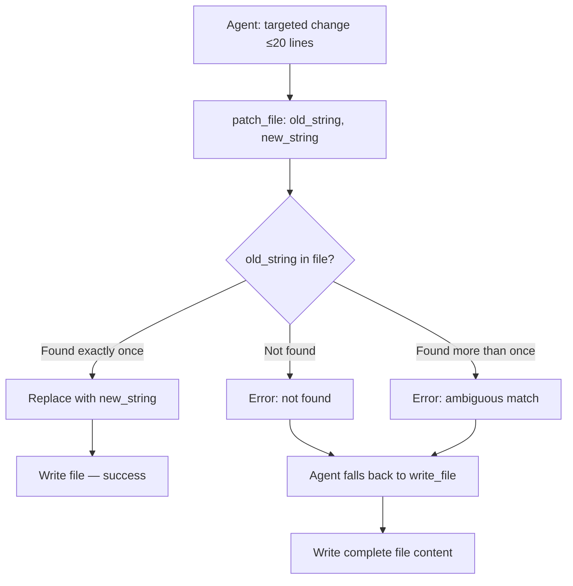

# Rewrite patch_file with Exact String Matching

## Raw Requirement

Rewrite the `patch_file` tool to accept `old_string` and `new_string` parameters and apply changes by exact substring replacement, removing the unified-diff and `diffy`-crate approach. Delete `patch_file_impl.rs`. Remove the `diffy` dependency from `Cargo.toml`. Update `run.skill.md` and `fix_signal.skill.md` Phase 3 guidance and all Per-Step Review Sub-Loop step 5 occurrences across all skill files to use the new interface with a single-attempt fallback to `write_file`. Update `sub-agent.skill.md` to return complete file content instead of unified diffs, removing the broken coordinator-applies-patch workflow.

## Description

The current `patch_file` implementation in `src/moeb/src/tools/patch_file.rs` and `patch_file_impl.rs` depends on the third-party `diffy` crate for unified-diff application. This approach requires the model to produce a syntactically precise artefact — hunk headers, context lines, exact line counts — that must align exactly with the current file content. Any deviation (wrong context lines, CRLF vs LF mismatch, stale line numbers) causes apply failure. Nine or more signals in the catalogue document distinct failure modes: template variable conflicts, pure-insertion diffs, hunk relocation errors, and read-set enforcement conflicts. Each required a separate spec to partially address, and the fundamental fragility remains.

Claude Code's `Edit` tool demonstrates the reliable alternative: locate an exact substring (`old_string`) in the file, replace it with `new_string`, and fail immediately with a clear error if the substring is not found exactly once. This reduces failure modes to one actionable error and makes success or failure unambiguous.

Removing `diffy` also eliminates an opaque third-party dependency from the tool layer. Since moeb is designed to iteratively optimise itself through future runs, all tools must be inspectable and modifiable by the system itself. A third-party dependency breaks this property — the system cannot reason about or improve logic it does not own.

The skill update closes the spin-loop failure mode: on a single `patch_file` failure the agent switches to `write_file` immediately, with no retry and no deliberation.



## Backlinks

### Parents
- [README.md](../../README.md)

### Related Specifications
- [moeb.deprecate-patch-file-as-default-write-path.md](moeb.deprecate-patch-file-as-default-write-path.md)
- [moeb.patch-file-tool.md](moeb.patch-file-tool.md)
- [moeb.patch-file-context-match-hardening.md](moeb.patch-file-context-match-hardening.md)

## Steps

### Step 1 — Rewrite patch_file.rs

Replace the complete contents of `src/moeb/src/tools/patch_file.rs` with a new implementation.

**ToolDef parameters schema**:
```json
{
  "type": "object",
  "properties": {
    "path": {
      "type": "string",
      "description": "Path to the file to patch, relative to the working directory. The file should have been read via read_file or read_files earlier in this run."
    },
    "old_string": {
      "type": "string",
      "description": "The exact substring to replace. Must appear exactly once in the file."
    },
    "new_string": {
      "type": "string",
      "description": "The replacement content."
    }
  },
  "required": ["path", "old_string", "new_string"]
}
```

**ToolDef description**:
> Apply a targeted replacement to an existing file. Locates `old_string` as an exact substring match and replaces it with `new_string`. Fails immediately if `old_string` is not found, or if it appears more than once (provide more surrounding context to make the match unique). Use for changes of up to ~20 lines when the exact content to replace is known. On failure, fall back to `write_file` with the complete new file content — do not retry `patch_file`.

**Execution logic** (implement in `execute`):
1. Validate `path`, `old_string`, `new_string` are present strings; return an error if any is missing.
2. Read the file at `working_dir.join(path)` into `original: String`. Return an error if the file cannot be read.
3. Count non-overlapping occurrences of `old_string` in `original` (exact byte match, no normalisation).
4. If count == 0: return `Err(anyhow!("patch_file: old_string not found in '{}'. Re-read the file and provide the exact substring to replace.", path))`.
5. If count > 1: return `Err(anyhow!("patch_file: old_string matches {} locations in '{}'. Add more surrounding context to make the match unique.", count, path))`.
6. Produce `patched = original.replacen(old_string, new_string, 1)`.
7. Compute `lines_before = original.lines().count()` and `lines_after = patched.lines().count()`.
8. Write `patched` to disk.
9. Return `Ok(format!("patch_file: applied to '{}' ({} → {} lines).", path, lines_before, lines_after))`.

Remove all code related to `diffy`, `normalize_hunk_counts`, `relocate_hunk_positions`, `find_closest_context`, `diagnose_missing_context`, `diagnose_non_matching_removed_lines`, `normalize_line_endings`, `normalize_trailing_whitespace`, and the `#[path = "patch_file_impl.rs"] mod patch_file_impl;` declaration. The resulting file must have no reference to `patch_file_impl`.

### Step 2 — Delete patch_file_impl.rs

Delete `src/moeb/src/tools/patch_file_impl.rs`. No replacement file is needed.

### Step 3 — Remove diffy from Cargo.toml

Remove the `diffy` entry from `src/moeb/Cargo.toml`. Run `cargo build` to confirm the build succeeds and Cargo drops the entry from `Cargo.lock`.

### Step 4 — Rewrite patch_file_tests.rs

Replace `src/moeb/src/tools/patch_file_tests.rs` with tests covering the new interface:

- **basic replacement**: `old_string` present exactly once → patched content written, success message returned.
- **multi-line replacement**: `old_string` spans multiple lines → correctly replaced.
- **not found**: `old_string` absent from file → error result containing "not found".
- **ambiguous match**: `old_string` appears twice in file → error result containing the occurrence count.

Remove all unified-diff test cases and any tests that import from `patch_file_impl`.

### Step 5 — Update run.skill.md Phase 3 write guidance

In `src/moeb/internal/skills/run.skill.md`, within Phase 3, replace the three-line block:

```
   - If changing fewer than ~20 lines in a file already read in full, use `patch_file`
     with a unified diff — only the changed lines are transmitted rather than the complete file
     content.
   - Otherwise use `write_file` with the complete new content.
   Never use `patch_file` on a file you have not read via `read_file` or `read_files`
   in this run.
```

with:

```
   - If changing fewer than ~20 lines in a file already read in full, use `patch_file`
     with `old_string` set to the exact current content to replace and `new_string` set
     to the replacement. If `patch_file` returns an error, use `write_file` with the
     complete new content immediately — do not retry `patch_file`.
   - Otherwise use `write_file` with the complete new content.
   Never use `patch_file` on a file you have not read via `read_file` or `read_files`
   in this run.
```

### Step 6 — Update run.skill.md Per-Step Review Sub-Loop step 5

In `src/moeb/internal/skills/run.skill.md` Per-Step Review Sub-Loop, replace step 5 in its entirety:

```
5. If `accepted = true` and `delta_score >= 0.01` and `iteration_count < 2`:
   - Apply the diff: `patch_file` with the proposed diff on the artifact path.
   - If `patch_file` returns an error result, terminate the sub-loop immediately —
     do not return to step 1. Append `{ "delta_score": 0.0, "accepted": false }` to
     iteration history and proceed to step 6. The kernel records this as a tool error.
   - Otherwise append `{ "delta_score": <score>, "accepted": true }` to iteration
     history and return to step 1.
```

with:

```
5. If `accepted = true` and `delta_score >= 0.01` and `iteration_count < 2`:
   - Apply the patch: call `patch_file` with `old_string` set to the content being
     replaced and `new_string` set to the updated content. If `patch_file` returns an
     error, call `write_file` with the complete updated artifact content immediately —
     do not retry `patch_file`.
   - If the write tool returns an error result, terminate the sub-loop immediately —
     do not return to step 1. Append `{ "delta_score": 0.0, "accepted": false }` to
     iteration history and proceed to step 6. The kernel records this as a tool error.
   - Otherwise append `{ "delta_score": <score>, "accepted": true }` to iteration
     history and return to step 1.
```

### Step 7 — Update fix_signal.skill.md Phase 3 mark step

In `src/moeb/internal/skills/fix_signal.skill.md` Phase 3, the mark step uses `patch_file` with a unified diff to add `picked_up_at` and `fix_branch` fields to the signal file. Replace this section:

```
Call `read_file` on the source file path. Construct a minimal unified diff adding
`"picked_up_at": "<current ISO 8601 timestamp>"` and `"fix_branch": "<fix_branch>"` as
new fields after the last existing field of the chosen signal object, before its closing
`}`. Call `patch_file` with this diff.

If `patch_file` returns an error, add the two fields in memory and call `write_file` to
overwrite the source file.
```

with:

```
Call `read_file` on the source file path. Locate the closing `}` of the chosen signal
object. Call `patch_file` with `old_string` set to the closing `}` of the signal object
and `new_string` set to the same closing `}` preceded by the two new fields:

  `,\n  "picked_up_at": "<current ISO 8601 timestamp>",\n  "fix_branch": "<fix_branch>"\n}`

If `patch_file` returns an error, add the two fields in working memory and call
`write_file` to overwrite the source file with the complete updated content.
```

### Step 8 — Update fix_signal.skill.md Per-Step Review Sub-Loops

`fix_signal.skill.md` has two Per-Step Review Sub-Loops — one in Phase 3 (signal pickup) and one in Phase 5 (event artifact). Both have a step 5 that calls `patch_file` with a unified diff. In both locations, replace:

```
5. If `accepted = true` and `delta_score >= 0.01` and `iteration_count < 2`:
   - Call `patch_file` on the signal file path with the proposed diff.
   - On error: terminate; append `{ "delta_score": 0.0, "accepted": false }` to history;
     proceed to step 6.
   - Otherwise: append `{ "delta_score": <score>, "accepted": true }` to history;
     return to step 1.
```

with (adjusting "the signal file path" / `.moeb/events/<signal_id>.event.json` to match each sub-loop's context):

```
5. If `accepted = true` and `delta_score >= 0.01` and `iteration_count < 2`:
   - Apply the patch: call `patch_file` with `old_string` set to the content being
     replaced and `new_string` set to the updated content. If `patch_file` returns an
     error, call `write_file` with the complete updated artifact content immediately —
     do not retry `patch_file`.
   - If the write tool returns an error result, terminate the sub-loop immediately —
     append `{ "delta_score": 0.0, "accepted": false }` to history; proceed to step 6.
   - Otherwise: append `{ "delta_score": <score>, "accepted": true }` to history;
     return to step 1.
```

### Step 9 — Update spec.skill.md Phase 5 README row insertion

In `src/moeb/internal/skills/spec.skill.md` Phase 5, replace the sentence:

```
Find the last data row in the domain table and insert the new row immediately after it. Write the
complete updated file content to `.moeb/README.md` using `write_file`.
```

with:

```
Find the last data row in the domain table. Call `patch_file` with `old_string` set to
the exact text of that last row and `new_string` set to that row immediately followed by
the new row on the next line. If `patch_file` returns an error, read the complete README
content, apply the row insertion in working memory, and write the full updated content
using `write_file` — do not retry `patch_file`.
```

### Step 10 — Update sub-agent.skill.md to eliminate unified diff output

`sub-agent.skill.md` currently instructs sub-agents to return unified diffs which the coordinator then applies via `patch_file`. After the interface change, the coordinator no longer accepts unified diffs. Update `src/moeb/internal/skills/sub-agent.skill.md`:

In Phase 3, replace the existing "Compose diffs" instructions with:

```
## Phase 3 — Compose changes

For each file that needs changing, produce the complete new file content. Rules:

1. Include the complete updated file content in a code block with a `// FILE: path`
   comment on the first line. Use the appropriate language tag (e.g. ```rust, ```toml).
2. Precede each block with one sentence explaining what it changes and why.
3. Never produce unified diffs — the coordinator applies changes using `write_file`
   and requires complete file content, not a diff.
```

In Phase 4, replace the sentence "The coordinator will apply your diffs using `patch_file`." with "The coordinator will apply your changes using `write_file` with the complete file content you provide."

### Step 11 — Compile and test

Run `cargo test` in `src/moeb/` and confirm zero new test failures.

## Decisions

### Decision 1 — Exact string matching over unified-diff format

**Rationale**: Unified diffs require the model to produce a syntactically precise artefact. Any deviation causes apply failure. Exact substring matching has exactly one failure mode (string not found or ambiguous), which is immediately actionable. This aligns with Claude Code's `Edit` tool, which the model already understands and reliably uses.

**Rejected alternatives**:
- Fuzzy matching with a similarity threshold: introduces ambiguity about which occurrence is selected. The existing `relocate_hunk_positions` logic already demonstrated that fuzzy matching produces subtle bugs.
- Patching the unified-diff implementation further: `patch_file_impl.rs` has been modified across five or more separate specs. Each fix introduced new edge cases. The surface area is too large for reliable autonomous improvement.

**Consequences**: Callers must supply the exact substring to replace. The agent must have read the file first, which the existing tool description already requires.

### Decision 2 — Fail immediately; single fallback to write_file

**Rationale**: Agents spinning in `patch_file` retry loops generate extra tool calls, extra signals, and extra tokens with no recovery benefit — a second attempt with the same `old_string` on the same unchanged file produces the same error. Immediate failure with a clear error message gives the agent one unambiguous signal. One fallback to `write_file` then completes the task.

**Rejected alternatives**:
- Two attempts before fallback: produces the same error twice. Additional context (re-reading the file) is the only path to recovery, and that leads directly to `write_file`.

**Consequences**: Agents must be prepared to write the complete file content on `patch_file` failure. This was already implied by existing guidance and is made explicit here.

### Decision 3 — Remove diffy dependency entirely

**Rationale**: The new implementation requires no diff library. Removing the dependency reduces build surface, eliminates third-party update obligations, and makes the patch_file implementation fully inspectable and modifiable by autonomous moeb runs — a prerequisite for self-optimisation.

**Rejected alternatives**:
- Keep diffy as an optional fallback codepath: no benefit. The unified-diff path is replaced end-to-end.

**Consequences**: `Cargo.lock` changes. Callers constructing unified diffs for `patch_file` must switch to `old_string`/`new_string`.

### Decision 4 — Sub-agents return complete file content; coordinator uses write_file

**Rationale**: Sub-agents currently return unified diffs and the coordinator applies them via `patch_file`. After the interface change, `patch_file` no longer accepts unified diffs. The simplest and most reliable replacement is for sub-agents to return complete file content and for the coordinator to use `write_file`. This removes all diff-format ambiguity from the coordinator–sub-agent boundary and makes the interaction format consistent with the rest of the system.

**Rejected alternatives**:
- Sub-agents return `old_string`/`new_string` pairs as structured text: requires a new parsing convention at the coordinator boundary, adds complexity, and sub-agents may not always know the exact current content to supply as `old_string`.

**Consequences**: Sub-agent responses are larger (full file content rather than diffs). For small targeted changes this is less token-efficient, but reliability outweighs the cost.

## Rubric

### Structured

| Criterion | Description | Pass Condition | Verification Method |
|-----------|-------------|----------------|---------------------|
| `no-preferred-patch-file` | No skill, prompt, or role file written or modified during this run instructs agents to call `patch_file` by preference or by default for writing new file content | Zero violations | grep for instructional `patch_file` references in all skill, prompt, and role files written; verify none designates `patch_file` as the primary or preferred write tool |
| `context-budget` | No implementation file exceeds 300 lines; no `*_tests.rs` file exceeds 400 lines | All files within budget | Count lines in `patch_file.rs` and `patch_file_tests.rs` |
| `no-diffy-dependency` | The `diffy` crate is absent from `src/moeb/Cargo.toml` after this run | Zero occurrences of `diffy` in `Cargo.toml` | grep for `diffy` in `Cargo.toml` |
| `patch-file-impl-deleted` | `src/moeb/src/tools/patch_file_impl.rs` does not exist | File absent | `search_files` confirms absence |
| `new-interface` | `patch_file` ToolDef parameters contain `old_string` and `new_string`; `diff` parameter absent | Correct parameters present | Inspect `ToolDef` in `patch_file.rs` |
| `skill-fallback-guidance` | `run.skill.md` Phase 3 and Per-Step Review Sub-Loop both instruct the agent to fall back to `write_file` on a single `patch_file` failure without retrying | Correct instruction present in both locations | grep for fallback instruction in `run.skill.md` |
| `fix-signal-skill-updated` | `fix_signal.skill.md` Phase 3 mark step and both Per-Step Review Sub-Loops use the new `old_string`/`new_string` interface with `write_file` fallback | Correct instructions present | grep for `old_string` in `fix_signal.skill.md` |
| `spec-skill-phase5-updated` | `spec.skill.md` Phase 5 README row insertion tries `patch_file` first and falls back to `write_file` on a single failure | Correct instruction present | grep for patch_file fallback in spec.skill.md Phase 5 |
| `sub-agent-skill-updated` | `sub-agent.skill.md` no longer references unified diffs or `patch_file`; instructs complete file content return | Unified diff instructions absent | grep for `patch_file` and `unified diff` in `sub-agent.skill.md` |
| `cargo-tests-pass` | `cargo test` passes with zero new failures | All tests green | Run `cargo test` in `src/moeb/` |

### Qualitative

- The rewritten `patch_file.rs` must be self-contained with no reference to `patch_file_impl.rs`.
- The `ToolDef` description must clearly explain the `old_string`/`new_string` interface and when to use `patch_file` versus `write_file`.
