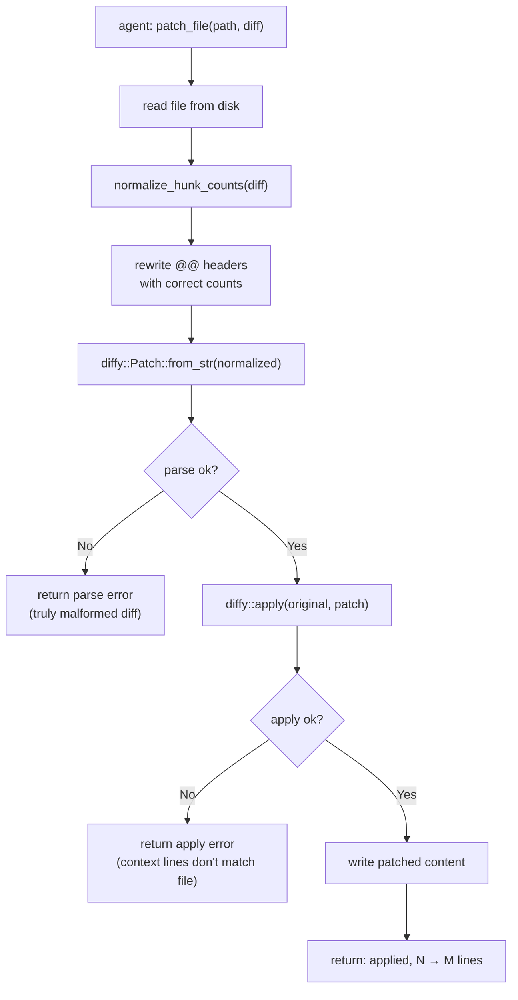

# Patch File Tool: Normalize Hunk Header Counts Before Parsing

## Raw Requirement

> Looks like the patch tool still has issues accepting patch requests. I have added an example
> return that was given running a specification.
>
> Request: `patch_file` called with a multi-hunk diff whose `@@` header declares `-175,11 +175,24`
> but the hunk body contains only 11 original lines and 17 result lines (5 context + 6 added + 6
> context). Response: `patch_file: failed to parse diff for '...spec.rs': error parsing patch:
> Hunk header does not match hunk. Ensure the diff uses @@ hunk headers with context lines.`

## Description

The `diffy` crate validates that the line counts in each `@@` hunk header exactly match the
actual number of context, removed, and added lines in the hunk body. When they do not match,
it returns "Hunk header does not match hunk" — a parse failure, not an apply failure.

AI agents reliably produce correct hunk content (the right context, removed, and added lines)
but frequently miscalculate the arithmetic in the `@@` header. In the reported example the
agent produced `+175,24` when the correct result count was 17. The context lines and added
lines were all present and correct; only the header count was wrong. Returning a parse error
here is overly strict: the hunk content is unambiguous and the counts are a mechanical
by-product that can be recomputed.

This specification adds a `normalize_hunk_counts` function to `src/moeb/src/tools/patch_file.rs`
that is called before `diffy::Patch::from_str`. The function parses each `@@ … @@` header,
counts the actual context/removed/added lines in the following hunk body, and rewrites the
header with correct counts. The context lines themselves — which determine whether `diffy::apply`
succeeds — are not changed. If the hunk header cannot be parsed by the normalizer (e.g., no
`@@` is present), the diff is passed through unchanged and `diffy` surfaces whatever error it
would have surfaced without normalization.

The change also updates the existing unit test
`patch_file_returns_error_on_invalid_diff_format`, which currently supplies a diff with
wrong header counts and asserts a parse error. After normalization that diff's header is
fixed before diffy sees it; the resulting error is an apply error (context mismatch) rather
than a parse error. The test is renamed and its assertion updated accordingly. A new test
`patch_file_normalizes_wrong_counts_and_applies` is added to prove the happy path: a diff
with correct content but wrong header counts is fixed by the normalizer and applied
successfully.

## Diagram



## Backlinks

### Parents

| Label | Path | Purpose |
|-------|------|---------|
| Patch File Tool | [specifications/moeb/moeb.patch-file-tool.md](specifications/moeb/moeb.patch-file-tool.md) | Original implementation of patch_file.rs, diffy dependency, and unit test suite extended here |
| README | [README.md](../../README.md) | Root index |

### External

*(none)*

## Steps

### Step 1 — Add `normalize_hunk_counts` to `src/moeb/src/tools/patch_file.rs`

Read `src/moeb/src/tools/patch_file.rs` in full.

Add the following function before the `PatchFileTool` struct definition:

```rust
/// Rewrite each `@@ -orig_start[,orig_count] +new_start[,new_count] @@[ text]` header
/// so that the declared counts match the actual hunk body lines.  Lines prefixed with
/// `-` count only toward the original count; `+` only toward the new count; a space (or
/// an otherwise empty line that represents a blank context line) counts toward both.
/// Lines starting with `\` (the "no newline at end of file" marker) are skipped in the
/// count.  Headers that cannot be parsed are passed through unchanged so diffy can emit
/// its own error.
fn normalize_hunk_counts(diff: &str) -> String {
    let lines: Vec<&str> = diff.split('\n').collect();
    let mut out: Vec<String> = Vec::with_capacity(lines.len());
    let mut i = 0;

    while i < lines.len() {
        let line = lines[i];

        if !line.starts_with("@@") {
            out.push(line.to_string());
            i += 1;
            continue;
        }

        // Parse: @@ -orig_start[,orig_count] +new_start[,new_count] @@ [suffix]
        // We need only the start line numbers; we will recompute the counts.
        let inner = line.trim_start_matches('@').trim_start_matches('@').trim();
        let (ranges, suffix) = if let Some(idx) = inner.find("@@") {
            (inner[..idx].trim(), inner[idx + 2..].trim())
        } else {
            (inner, "")
        };

        let mut parts = ranges.split_whitespace();
        let orig_range = parts.next().unwrap_or("");
        let new_range = parts.next().unwrap_or("");

        let orig_start = orig_range
            .trim_start_matches('-')
            .split(',')
            .next()
            .and_then(|s| s.parse::<usize>().ok());
        let new_start = new_range
            .trim_start_matches('+')
            .split(',')
            .next()
            .and_then(|s| s.parse::<usize>().ok());

        let (Some(orig_start), Some(new_start)) = (orig_start, new_start) else {
            // Cannot parse; pass through and let diffy report the error.
            out.push(line.to_string());
            i += 1;
            continue;
        };

        // Collect the hunk body (until next @@ or end of input).
        i += 1;
        let body_start = i;
        while i < lines.len() && !lines[i].starts_with("@@") {
            i += 1;
        }
        let body = &lines[body_start..i];

        // Count actual lines.
        let mut orig_count: usize = 0;
        let mut new_count: usize = 0;
        for body_line in body {
            if body_line.starts_with('-') {
                orig_count += 1;
            } else if body_line.starts_with('+') {
                new_count += 1;
            } else if body_line.starts_with('\\') {
                // "No newline at end of file" — does not count.
            } else {
                // Context line (space-prefixed or empty blank-context line).
                orig_count += 1;
                new_count += 1;
            }
        }

        // Rebuild the header.
        let new_header = if suffix.is_empty() {
            format!("@@ -{},{} +{},{} @@", orig_start, orig_count, new_start, new_count)
        } else {
            format!("@@ -{},{} +{},{} @@ {}", orig_start, orig_count, new_start, new_count, suffix)
        };
        out.push(new_header);
        for body_line in body {
            out.push(body_line.to_string());
        }
    }

    out.join("\n")
}
```

### Step 2 — Call `normalize_hunk_counts` in `PatchFileTool::execute`

In `PatchFileTool::execute`, immediately before the `diffy::Patch::from_str` call, insert the
normalization step:

Replace:

```rust
        let patch = diffy::Patch::from_str(diff)
```

with:

```rust
        let normalized = normalize_hunk_counts(diff);
        let patch = diffy::Patch::from_str(&normalized)
```

No other changes to `execute`.

### Step 3 — Update the count-mismatch unit test

In the `#[cfg(test)]` block of `patch_file.rs`, locate the test
`patch_file_returns_error_on_invalid_diff_format`.

Replace it entirely with two tests:

```rust
    #[test]
    fn patch_file_normalizes_wrong_counts_context_mismatch() {
        // Header says -1,3 +1,3 but the hunk has only 2 original and 2 result lines.
        // After normalization the header becomes -1,2 +1,2; diffy then rejects it
        // because the context line "fn bar() {}" does not match the file "fn foo() {}".
        let dir = temp_dir();
        let file = dir.path().join("target.rs");
        std::fs::write(&file, "fn foo() {}\n").unwrap();

        let tool = PatchFileTool;
        let diff = "@@ -1,3 +1,3 @@\n fn bar() {}\n-fn old() {}\n+fn new() {}\n";
        let args = serde_json::json!({"path": "target.rs", "diff": diff});
        let err = tool.execute(&args, dir.path()).unwrap_err();
        assert!(err.to_string().contains("failed to apply"), "expected apply error: {}", err);
        assert_eq!(std::fs::read_to_string(&file).unwrap(), "fn foo() {}\n");
    }

    #[test]
    fn patch_file_normalizes_wrong_counts_and_applies() {
        // Header declares wildly wrong counts (-1,999 +1,999) but the hunk content
        // is correct.  The normalizer fixes the header to -1,2 +1,2 and the patch
        // applies successfully.
        let dir = temp_dir();
        let file = dir.path().join("target.rs");
        std::fs::write(&file, "fn foo() {}\nfn old() {}\n").unwrap();

        let tool = PatchFileTool;
        let diff = "@@ -1,999 +1,999 @@\n fn foo() {}\n-fn old() {}\n+fn new() {}\n";
        let args = serde_json::json!({"path": "target.rs", "diff": diff});
        let result = tool.execute(&args, dir.path()).unwrap();

        assert!(result.contains("applied"), "expected success: {}", result);
        let content = std::fs::read_to_string(&file).unwrap();
        assert!(content.contains("fn new() {}"), "added line must be present");
        assert!(!content.contains("fn old() {}"), "removed line must be absent");
    }
```

### Step 4 — Verify

Run `cargo build --release` — zero errors. Run `cargo test` — all tests pass including the
two updated/new tests in `tools/patch_file.rs`.

Confirm the normalizer is called in `execute`:

```
grep -n "normalize_hunk_counts" src/moeb/src/tools/patch_file.rs
```

Should return at least two matches (function definition and call site).

## Decisions

### Decision 1 — Normalize counts rather than relax the error or instruct the prompt

**Rationale:** Three approaches were considered: (a) normalize counts in the tool before
diffy sees them, (b) add a more detailed error message with count arithmetic guidance, (c)
update `run.skill.md` with explicit count calculation instructions. Option (a) addresses the
root cause: agents reliably produce the right context/add/remove lines but miscalculate the
arithmetic in the header. The count is a mechanical checksum derivable from the hunk body;
recalculating it in the tool is correct and removes an entire class of parse failures
regardless of which model or prompt is used.

Options (b) and (c) move the burden to the agent: even with good instructions, arithmetic
errors are inevitable across many model calls. Option (a) is strictly more robust.

**Alternatives:**

| Option | Reason Rejected |
|--------|-----------------|
| Improve error message guidance only | Does not prevent the error; agents still produce wrong counts on subsequent calls |
| Update `run.skill.md` with count arithmetic rules | Prompt guidance reduces frequency but cannot eliminate arithmetic errors; normalization at the tool layer is a permanent fix |
| Pass `--ignore-whitespace`-equivalent flag to diffy | `diffy` does not expose such a flag; and count mismatches are not whitespace issues |

**Consequences:** `patch_file` now accepts diffs with incorrect `@@` header counts provided
the hunk content is otherwise valid. The unit test `patch_file_returns_error_on_invalid_diff_format`
is replaced by two tests that correctly document the new behavior.

---

### Decision 2 — Treat empty/blank context lines (no space prefix) as context lines for counting

**Rationale:** Some AI-generated diffs emit a blank line (empty string after `\n`) to
represent a blank context line instead of the correct single-space prefix. Treating these
as context lines is conservative: it may over-count the context by one per blank line, but
since `diffy` is strict about context matching (not about count values after normalization),
the count is discarded at apply time anyway — only the line content matters.  The alternative
of treating blank lines as unknown and skipping them risks under-counting, which would produce
a normalized header whose count does not match the body and cause the same parse error the
normalizer is trying to prevent.

**Alternatives:**

| Option | Reason Rejected |
|--------|-----------------|
| Treat blank lines as unknown, skip them in the count | Produces a count that still mismatches the body; normalizer would emit a header diffy then rejects |
| Reject diffs with blank context lines | Over-strict; the common AI-generated case must be tolerated |

**Consequences:** Blank lines in the hunk body (neither `-`, `+`, nor `\`) are counted as
context lines for both original and new count. This is consistent with the unified diff
standard, where a blank context line is encoded as a single space followed by a newline.

---

### Decision 3 — Pass through unrecognised hunk headers rather than erroring

**Rationale:** If the `@@` line cannot be parsed to extract start line numbers (e.g., the
diff is completely malformed), the normalizer passes the line through unchanged. This
delegates the error to `diffy`, which produces a clear message. The normalizer's only job
is to fix recoverable count arithmetic errors; it should not introduce new failure modes for
diffs that were already going to fail for other reasons.

**Alternatives:**

| Option | Reason Rejected |
|--------|-----------------|
| Return an error immediately when header cannot be parsed | Duplicates diffy's error handling; the current error message from diffy is clear enough for truly malformed input |

**Consequences:** Completely malformed diffs still surface a parse error from diffy, unchanged
from the pre-normalizer behaviour.

## Rubric

### Structured

| Name | Description | Threshold | Pass Condition |
|------|-------------|-----------|----------------|
| `binary-builds` | `cargo build --release` exits 0 | Zero errors | CI build exits 0 |
| `all-tests-pass` | `cargo test` exits 0 | Zero failures | `cargo test` exits 0 |
| `normalizer-called-in-execute` | `normalize_hunk_counts` is called inside `PatchFileTool::execute` before `diffy::Patch::from_str` | Present | `grep -n "normalize_hunk_counts" src/moeb/src/tools/patch_file.rs` returns ≥ 2 matches |
| `normalize-happy-path-test` | `patch_file_normalizes_wrong_counts_and_applies` passes: wrong counts but correct content → applied | Pass | `cargo test patch_file_normalizes_wrong_counts_and_applies` exits 0 |
| `normalize-context-mismatch-test` | `patch_file_normalizes_wrong_counts_context_mismatch` passes: wrong counts + wrong context → apply error (not parse error) | Pass | `cargo test patch_file_normalizes_wrong_counts_context_mismatch` exits 0 |

### Qualitative

- **Original test suite preserved:** All tests that existed before this spec (`patch_file_applies_single_hunk`, `patch_file_returns_error_on_context_mismatch`, `patch_file_returns_error_on_missing_file`) must continue to pass. The only test removed is `patch_file_returns_error_on_invalid_diff_format`, which is replaced by two tests with clearer names and correct assertions.
- **No behaviour change for correct diffs:** A diff with correct counts passes through normalization unchanged (rewriting to the same values) and behaves identically to before this spec.
- **File remains unchanged on apply failure:** When normalization succeeds but `diffy::apply` fails (context mismatch), the target file on disk must be unchanged, consistent with the existing apply-error behavior.
