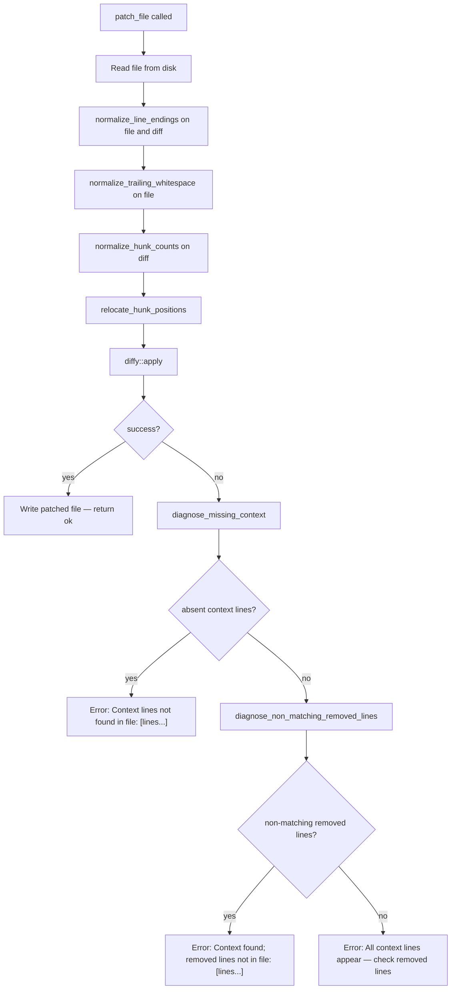

# Patch File Tool: Non-Matching Removed Line Diagnostics and Template Variable Test Coverage

## Raw Requirement

Signal 3a7c8e12-f4b5-4d2a-9c6e-1f8a3d5b7c91 (Error, Critical): patch_file returned "error applying hunk #1. All context lines appear in the file — check that the removed lines (-) exactly match the file content." when patching spec.skill.md. Recovery via write_file succeeded. The failure occurred because the diff's removed lines contained `{{run_id}}` rendered as the actual session UUID in the agent's context, while the file stored the literal template variable. The current diagnostic names absent context lines but not non-matching removed lines, leaving the agent with no specific guidance on which removed lines to correct. Proposed resolution: Investigate why patch_file fails when removed lines contain `{{run_id}}` template variables. Add a unit test covering patch_file on skill files with double-brace syntax.

## Description

The `diagnose_missing_context` helper introduced by `moeb.patch-file-context-match-hardening` identifies context lines (space-prefixed in the diff) that do not appear in the file. When all context lines are found but `diffy::apply` still fails — the scenario that produces the "All context lines appear in the file" branch — the current error gives no further guidance about which removed lines (`-` prefixed) are the source of the mismatch. An agent encountering this message cannot identify which lines to correct without re-reading the file.

The root cause of the specific failure: `start_spec` injects skill file content into the prompt after rendering template variables (e.g., `{{run_id}}` becomes the session UUID). An agent constructing a diff based on this rendered context writes a diff whose removed lines contain the rendered UUID rather than the literal `{{run_id}}` stored on disk. Context lines around the targeted section match the file, satisfying `diagnose_missing_context`, but the removed line carries the wrong value and `diffy::apply` fails.

This specification adds a `diagnose_non_matching_removed_lines` helper that scans removed lines in the failing diff and names those absent from the file, and updates the error handler to emit this information in the "all context present" failure branch. A unit test confirms that `patch_file` correctly applies a diff whose removed line contains literal double-brace syntax, verifying the tool itself is not the source of the failure.



## Backlinks

### Parents

| Label | Path | Purpose |
|-------|------|---------|
| Harness README | .moeb/README.md | Root specification index |
| Patch File Tool | specifications/moeb/moeb.patch-file-tool.md | Original patch_file implementation |
| Patch File: Apply-Failure Diagnostics | specifications/moeb/moeb.patch-file-context-match-hardening.md | Introduces diagnose_missing_context and the two-branch error handler |

## Steps

### Step 1 — Read current patch_file source files

Read `src/moeb/src/tools/patch_file.rs` and `src/moeb/src/tools/patch_file_tests.rs` in full to establish the current state before making any changes.

### Step 2 — Add `diagnose_non_matching_removed_lines` helper

In `src/moeb/src/tools/patch_file.rs`, locate the closing brace of `diagnose_missing_context`. Immediately after it, add:

```rust
/// Returns the removed lines (`-` prefix) from `relocated_diff` that do not appear
/// anywhere in `original` (using `.trim_end()` comparison, consistent with
/// `diagnose_missing_context`).  Called only when context lines all match but
/// `diffy::apply` still fails, to name the specific removed lines that differ from
/// the file content.
fn diagnose_non_matching_removed_lines<'a>(relocated_diff: &'a str, original: &str) -> Vec<&'a str> {
    let orig_lines: Vec<&str> = original.lines().collect();
    let mut non_matching = Vec::new();
    for line in relocated_diff.lines() {
        if !line.starts_with('-') {
            continue;
        }
        let content = &line[1..];
        let content_t = content.trim_end();
        if content_t.is_empty() {
            continue;
        }
        if !orig_lines.iter().any(|l| l.trim_end() == content_t) {
            non_matching.push(content);
        }
    }
    non_matching
}
```

### Step 3 — Update the error handler to call the new helper

In `PatchFileTool::execute`, locate the `if absent.is_empty()` branch inside the `diffy::apply` error mapping. It currently produces a single "All context lines appear in the file" message. Replace that branch only (not the surrounding closure or the `else` branch) with:

```rust
                if absent.is_empty() {
                    let non_matching = diagnose_non_matching_removed_lines(&relocated, &original);
                    if non_matching.is_empty() {
                        anyhow::anyhow!(
                            "patch_file: failed to apply diff to '{}': {}. \
                             All context lines appear in the file — check that the \
                             removed lines (-) exactly match the file content, and that \
                             no duplicate context block is selecting the wrong hunk. \
                             Re-read the file and regenerate the diff.",
                            path, e
                        )
                    } else {
                        anyhow::anyhow!(
                            "patch_file: failed to apply diff to '{}': {}. \
                             Context lines found; removed lines not in file: [{}]. \
                             Re-read the file and ensure the diff's removed lines (-) \
                             match the file content exactly.",
                            path, e,
                            non_matching.join("; ")
                        )
                    }
```

The `} else {` branch for absent context lines and the closing `})?;` are unchanged.

### Step 4 — Add unit tests

In `src/moeb/src/tools/patch_file_tests.rs`, append the following two tests after all existing tests:

**Test 1 — `patch_file` succeeds when removed line contains literal double-brace syntax:**

```rust
#[test]
fn patch_file_applies_when_removed_line_contains_double_brace() {
    // Skill files store literal {{run_id}} template variables.
    // patch_file must apply a diff whose removed line contains that exact text.
    let dir = temp_dir();
    let file = dir.path().join("spec.skill.md");
    std::fs::write(
        &file,
        "## Phase 8\nWrite to `.moeb/metrics/{{run_id}}.metrics.json`.\nNext section.\n",
    )
    .unwrap();

    let tool = PatchFileTool;
    let diff = "@@ -1,3 +1,3 @@\n ## Phase 8\n-Write to `.moeb/metrics/{{run_id}}.metrics.json`.\n+Write to `.moeb/metrics/{{run_id}}.metrics.json` (updated).\n Next section.\n";
    let args = serde_json::json!({"path": "spec.skill.md", "diff": diff});
    let result = tool.execute(&args, dir.path()).unwrap();

    assert!(result.contains("applied"), "expected success: {}", result);
    let content = std::fs::read_to_string(&file).unwrap();
    assert!(
        content.contains("(updated)"),
        "patched content must contain updated marker"
    );
    assert!(
        content.contains("{{run_id}}"),
        "template variable must be preserved in patched content"
    );
}
```

**Test 2 — diagnostic names the non-matching removed line when it contains a rendered value instead of the template variable:**

```rust
#[test]
fn patch_file_diagnostic_names_non_matching_removed_line() {
    // Agent produces a diff with a rendered UUID but the file stores {{run_id}}.
    // The error must name the specific non-matching removed line.
    let dir = temp_dir();
    let file = dir.path().join("spec.skill.md");
    std::fs::write(
        &file,
        "## Phase 8\nWrite to `.moeb/metrics/{{run_id}}.metrics.json`.\nNext section.\n",
    )
    .unwrap();

    let tool = PatchFileTool;
    // Removed line has a rendered UUID rather than the literal {{run_id}}
    let diff = "@@ -1,3 +1,3 @@\n ## Phase 8\n-Write to `.moeb/metrics/a735facc-5979-429f-8024-6e9f0fc0786a.metrics.json`.\n+Write to `.moeb/metrics/{{run_id}}.metrics.json` (updated).\n Next section.\n";
    let args = serde_json::json!({"path": "spec.skill.md", "diff": diff});
    let err = tool.execute(&args, dir.path()).unwrap_err();
    let msg = err.to_string();
    assert!(
        msg.contains("removed lines not in file"),
        "error must indicate non-matching removed lines: {}",
        msg
    );
    assert!(
        msg.contains("a735facc"),
        "error must name the non-matching removed line content: {}",
        msg
    );
}
```

### Step 5 — Verify

Run `cargo test -p moeb` and confirm all tests pass, including the two new tests added in Step 4. Run `cargo build --release` and confirm zero errors.

Confirm the new function is defined:

```
grep -n "fn diagnose_non_matching_removed_lines" src/moeb/src/tools/patch_file.rs
```

Expect exactly one match.

Confirm the function is called from `execute`:

```
grep -n "diagnose_non_matching_removed_lines" src/moeb/src/tools/patch_file.rs
```

Expect at least two matches (definition line + call site).

## Decisions

### Decision 1 — Add `diagnose_non_matching_removed_lines` alongside `diagnose_missing_context`

**Rationale:** `diagnose_missing_context` (Decision 3 of `moeb.patch-file-context-match-hardening`) handles the case where context lines are absent from the file. The symmetric failure mode — all context lines present but removed lines absent — is currently handled only with a generic message that names no specific lines. A complementary helper for removed lines closes the remaining actionable-information gap and follows the same structural pattern: a private function in `patch_file.rs` placed immediately after the existing diagnostic, independently testable and co-located with its single caller.

**Rejected alternatives:**

| Option | Reason Rejected |
|--------|-----------------|
| Extend `diagnose_missing_context` to also scan removed lines | The function name and docstring say "context lines"; changing scope without renaming violates self-documenting naming. A separate named function is grep-discoverable and independently testable |
| Fix the prompt rendering (not patch_file.rs) | Changing prompt rendering is a separate, higher-scope concern requiring its own spec. The diagnostic improvement is immediately actionable and complementary to any future prompt-rendering fix |
| Omit the new branch; just improve the existing message | Naming the specific non-matching removed lines gives the agent an exact target to fix; a general message leaves it guessing |

**Consequences:** One additional private function in `patch_file.rs`. The `execute` method's error handler gains one additional conditional on the failure path. No change to the success path or to existing error messages.

---

### Decision 2 — Unit test confirms `patch_file` itself is not at fault for double-brace content

**Rationale:** The signal's proposed resolution explicitly asks to investigate whether `patch_file` is the source of the failure. Test 1 (`patch_file_applies_when_removed_line_contains_double_brace`) characterises the tool's behaviour with literal `{{run_id}}`: if it passes, the failure originates at the agent-context level (rendered template variables in the preloaded skill content), not in `patch_file.rs`. The test also guards against future normalization pipeline changes that could accidentally special-case brace sequences.

**Rejected alternatives:**

| Option | Reason Rejected |
|--------|-----------------|
| No test; assume diffy handles braces correctly | Leaves the investigation open and unverified; a future normalisation step could accidentally introduce brace handling |
| Test only the failure diagnostic, not the success case | The success case is the primary characterisation of root cause; omitting it leaves the investigation conclusion implicit rather than executable |

**Consequences:** Two new test functions in `patch_file_tests.rs`. No production code change beyond Steps 2–3.

---

### Decision 3 — Three-branch error handler: absent context / non-matching removed / neither

**Rationale:** The three branches map to three distinct root causes with three distinct corrective actions: (1) context lines absent → re-read and use verbatim context; (2) removed lines absent → re-read and fix removed lines; (3) neither → mismatch at position level, re-read and regenerate. Keeping the "all context lines appear" message as the innermost default preserves backward compatibility for callers that pattern-match on that string.

**Rejected alternatives:**

| Option | Reason Rejected |
|--------|-----------------|
| Two branches only (combine cases 2 and 3) | An agent cannot determine from a combined message whether to fix removed lines or the overall diff structure |
| Combine all three into one message | A combined message is longer but less actionable; the branching structure gives the agent a precise next step |

**Consequences:** The failure-path code is two nesting levels deeper. The success path is unchanged.

## Rubric

### Structured

| Name | Description | Threshold | Pass Condition |
|------|-------------|-----------|----------------|
| `tool-errors` | No ToolHandler errors were recorded during this command invocation. Covers all tool calls on both CLI and MCP paths via `RealToolExecutor::execute`. Applies to every moeb command. | Zero tool errors | Kernel-authoritative: injected by `verify_rubrics` from `RunState.tool_errors`. Do not supply a verdict — any agent-supplied entry is overridden. |
| `rubric-qualification` | No Pass verdicts with acknowledged failures were issued during this command invocation. An agent that observes a failure but passes a criterion must populate `acknowledged_failures` in the verdict object. Applies to every moeb command. | Zero qualified Pass verdicts | Kernel-authoritative: injected by `verify_rubrics` by scanning `acknowledged_failures` on incoming Pass verdicts. Do not supply a verdict — any agent-supplied entry is overridden. |
| `skill-mandatory-phases` | The skill loaded for this run contains all mandatory phase headings. The agent checks its own prompt context (the loaded skill content is already present) for the exact strings: "Verify", "End-of-Skill Review", "Metrics Recording", "Commit", "Tag", "Complete". No file read is required. | All six mandatory headings present | Agent scans skill content in its loaded context; fails if any mandatory heading string is absent |
| `no-drift` | The specification does not violate any decision recorded in a linked parent specification | Zero contradictions | Manual review of every decision in every parent spec listed in Backlinks |
| `spec-schema-compliance` | All required frontmatter fields and body sections are present and correctly ordered | 100% of required fields and sections | Validation in `domain/spec.rs` exits 0 during `moeb spec` |
| `ai-first-org` | The specification's Steps prescribe file layouts, naming, and helper placement that satisfy the four AI-first organisation principles: one concern per file, context locality, grep-discoverable names, no cross-cutting helpers. | All four principles followed | Manual review: no step produces a file that mixes concerns, no name is generic across the codebase, all helpers are co-located with their callers or promoted to a precisely named module |
| `kernel-thin-and-parity` | No domain-specific or workflow-specific coordination logic may be placed in kernel Rust code when it can live in skill markdown or role files. Every tool registered in the CLI tool registry must also be registered in the MCP stdio server tool list. | Zero violations | Spec review: no proposed step places review/coordination logic in Rust; Run review: grep confirms no skill-specific logic in kernel tools; tool lists in tools/mod.rs and the MCP server match exactly |
| `moeb-tool-origin` | All tool calls made during this invocation must originate from moeb's own tool registry. If an external tool was used, the agent must write a MissingMoebTool signal immediately after each such call. The criterion always fails when any external tool is used. | Zero external tool calls | Agent reviews the conversation for calls to non-moeb tools. Supplies Pass if none were made. If external tools were used with MissingMoebTool signals, supplies Fail with `acknowledged_failures`. |
| `all-tests-pass` | `cargo test -p moeb` exits 0 after applying all changes | Zero failures | `cargo test -p moeb` exits 0 |
| `binary-builds` | `cargo build --release` exits 0 after applying all changes | Zero errors | Build exits 0 |
| `diagnose-non-matching-defined` | `diagnose_non_matching_removed_lines` is defined in `patch_file.rs` | Exactly one definition | `grep -n "fn diagnose_non_matching_removed_lines" src/moeb/src/tools/patch_file.rs` returns 1 match |
| `diagnose-non-matching-called` | `diagnose_non_matching_removed_lines` is called in `PatchFileTool::execute` | At least 2 occurrences | `grep -n "diagnose_non_matching_removed_lines" src/moeb/src/tools/patch_file.rs` returns ≥ 2 matches |

### Qualitative

- `diagnose_non_matching_removed_lines` uses `.trim_end()` comparison, consistent with `diagnose_missing_context` and `find_closest_context`.
- `diagnose_non_matching_removed_lines` skips blank or whitespace-only removed lines to avoid false positives from empty-line diffs.
- The non-matching branch is only reached when `absent` from `diagnose_missing_context` is empty; the existing two-branch structure becomes a three-branch structure with the new middle case.
- The new error message names the specific non-matching removed line(s), giving the agent an exact target to correct.
- Test 1 passes, confirming `patch_file.rs` handles double-brace template variable content correctly; the failure root cause is at the agent-context rendering level, not in the tool.
- All pre-existing tests in `patch_file_tests.rs` pass without modification.
- Changes are strictly confined to `src/moeb/src/tools/patch_file.rs` and `src/moeb/src/tools/patch_file_tests.rs`.
