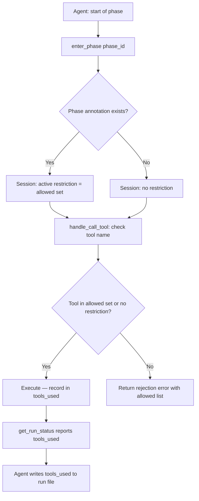

# Phase-Level Tool Restriction and Run-Report Tool Usage Tracking

## Raw Requirement

Add an `enter_phase` MCP tool that agents call at the start of each skill phase. Skill phase headings may declare a restricted tool list via an HTML comment annotation (`<!-- tools: read_file, write_file -->`); when `enter_phase` is called for an annotated phase, the harness rejects tool calls not in the declared set by returning an error response. Add `tools_used` tracking to `RunState`; expose it via `get_run_status` and include a sorted deduplicated `tools_used` array in the run file JSON and `RunMetrics` for all three invocation types: `run`, `spec`, and `fix_signal`. When no annotation is present, all tools remain available. Annotate `spec.skill.md` Phase 5 as the first concrete example of a restricted phase.

## Description

All moeb run sessions expose the full tool registry to the agent for the entire run duration. When multiple write tools are simultaneously available, the agent re-evaluates which to use at every write operation, producing repeated deliberation even when the correct tool is already determined by the skill instructions. Instruction-based guidance alone cannot reliably prevent this: the model reasons about tradeoffs regardless of text constraints. The only structural fix is to make the wrong tool unavailable for phases where the correct tool is already known.

The MCP tool-call handler enforces restrictions by checking the called tool name against the active phase's allowed set and returning a rejection error for disallowed calls. This requires no server-push notification support — enforcement is on the response path. The client may still advertise restricted tools in its UI, but any attempt to call them during a restricted phase fails immediately with an actionable error naming the allowed alternatives.

There are three components:

**`enter_phase` tool**: The agent calls it at the start of each phase with a `phase_id` string. The harness records `current_phase` in the session. If the skill's `phase_tool_map` contains an entry for that phase, all subsequent tool calls not in the allowed set return a rejection error. When `enter_phase` is called for a phase with no annotation, all tools are restored.

**Phase annotation syntax**: Skill phase headings include an HTML comment:
```
## Phase 5 — Link README <!-- tools: read_file, write_file -->
```
`start_run` parses the loaded skill content for this pattern, builds a `HashMap<String, Vec<String>>` keyed by normalised phase id (e.g. `"phase-5"`), and stores it in the session for the duration of the run.

**`tools_used` tracking**: `RunState` records every tool name on each successful call as a deduplicated sorted array. `get_run_status` reports it. The run file JSON and `RunMetrics` include a `tools_used` field populated by the agent from `get_run_status` output — consistent with how `rubric_score` is handled (kernel computes, agent retrieves and writes).



## Backlinks

### Parents
- [README.md](../../README.md)

### Related Specifications
- [moeb.deprecate-patch-file-as-default-write-path.md](moeb.deprecate-patch-file-as-default-write-path.md)
- [moeb.patch-file-exact-string-rewrite.md](moeb.patch-file-exact-string-rewrite.md)
- [moeb.kernel.md](moeb.kernel.md)

## Steps

### Step 1 — Add tools_used and current_phase to RunState

In `src/moeb/src/run_state.rs`:

- Add field `tools_used: std::collections::HashSet<String>`.
- Add field `current_phase: Option<String>`.
- Add method `record_tool_used(&mut self, name: &str)` that inserts `name` into `tools_used`.
- Add method `set_current_phase(&mut self, phase_id: Option<String>)` that sets `current_phase`.
- Add method `sorted_tools_used(&self) -> Vec<String>` that returns a sorted, deduplicated `Vec<String>` from `tools_used`.

### Step 2 — Add phase_tool_map to McpSession

In `src/moeb/src/mcp/session.rs`, inspect the `McpSession` struct and add:

- Field `phase_tool_map: std::collections::HashMap<String, Vec<String>>`.
- Method `set_phase_tool_map(&mut self, map: std::collections::HashMap<String, Vec<String>>)`.
- Method `allowed_tools_for_phase(&self, phase_id: &str) -> Option<&Vec<String>>`.

`McpSession` must also expose access to `current_phase` from `RunState`. If `McpSession` holds a `SharedRunState`, read `current_phase` from there. If it does not, add a `current_phase: Option<String>` field to `McpSession` and keep it in sync via `enter_phase` calls.

### Step 3 — Parse phase annotations in start_run

In `src/moeb/src/tools/start_run.rs`, after `skill_content` is loaded and before the prompt template is rendered:

Parse phase tool annotations using this pattern (applied per line):
```
## Phase <label>[^\n]*<!-- tools: <tool_list> -->
```
where `<tool_list>` is a comma-separated list of tool names (whitespace around commas is trimmed).

Normalise each phase label to a phase id: take the first token after `Phase` (e.g. `5`), lowercase it, prefix with `"phase-"` → `"phase-5"`.

Build a `HashMap<String, Vec<String>>` from the parsed annotations and call `session.set_phase_tool_map(map)`.

`start_run` currently returns a `String` (the rendered prompt) rather than interacting with a session directly. Examine how `start_run` is called in the MCP handler and pass the session reference (or return the map alongside the prompt) so the session can be updated. Follow the existing pattern for how other tools with session-level side effects are handled.

### Step 4 — Create enter_phase tool

Create `src/moeb/src/tools/enter_phase.rs`:

**Parameters** (`ToolDef`):
```json
{
  "type": "object",
  "properties": {
    "phase_id": {
      "type": "string",
      "description": "The identifier of the phase being entered, e.g. 'phase-5'. Normalised to lowercase with spaces replaced by hyphens."
    }
  },
  "required": ["phase_id"]
}
```

**ToolDef description**:
> Declare the start of a skill phase. If the skill annotates this phase with a tool restriction, all subsequent tool calls not in the allowed set will return a rejection error until enter_phase is called for another phase. Call this as the first action at the start of every phase in the skill.

**Execution logic**:
1. Normalise `phase_id`: lowercase, spaces → hyphens.
2. Update `current_phase` in `RunState` (or `McpSession`, per Step 2).
3. Look up the normalised id in `session.phase_tool_map`:
   - If found: return `"enter_phase: now in '{}'. Restricted to: [{}].", phase_id, allowed.join(", ")`.
   - If not found: return `"enter_phase: now in '{}'. No tool restrictions.", phase_id`.

The tool needs access to `SharedRunState` and/or `McpSession`. Follow the constructor pattern used by `GetRunStatusTool` for state access.

Add `enter_phase` to `ToolRegistry::standard()` and all registries derived from it (including `mcp`, `mcp_with_adapter`, `with_query_agent`). Do not add it to `sub_agent()`.

Add `pub mod enter_phase;` to `src/moeb/src/tools/mod.rs`.

### Step 5 — Enforce restrictions in handle_call_tool

In `src/moeb/src/mcp/server.rs`, in the `do_call_tool` function (or `handle_call_tool`), immediately before the `executor.execute(tool_name, args, working_dir)` call:

```rust
// Phase-level tool restriction
if let Some(phase_id) = session.current_phase() {
    if let Some(allowed) = session.allowed_tools_for_phase(phase_id) {
        if !allowed.contains(&tool_name.to_string()) {
            return Ok(format!(
                "tool '{}' is not available in phase '{}'. Available tools: [{}].",
                tool_name,
                phase_id,
                allowed.join(", ")
            ));
        }
    }
}
```

`enter_phase` itself must never be blocked by this check — it is always permitted regardless of restrictions. Add an explicit bypass: if `tool_name == "enter_phase"`, skip the restriction check.

### Step 6 — Record tool usage

In `src/moeb/src/mcp/server.rs` `do_call_tool`, after a successful `executor.execute` call (i.e. the call did not return a rejection error from Step 5 and did not return an `Err` result):

```rust
state.lock().unwrap().record_tool_used(tool_name);
```

Do not record `enter_phase` in `tools_used` — it is a harness bookkeeping call, not a productive tool use. Add an explicit exclusion: if `tool_name == "enter_phase"`, skip recording.

### Step 7 — Expose tools_used in get_run_status

In `src/moeb/src/tools/get_run_status.rs`, extend the `execute` output to include a `tools_used` line:

```
tools used: read_file, write_file, create_task_list
```

(sorted, comma-separated). If `tools_used` is empty, output `tools used: none`.

### Step 8 — Include tools_used in run file and RunMetrics

The run file is written by the skill agent. Extend the run file template instruction in `run.skill.md` Phase 6 Part A step 3, `spec.skill.md` Phase 8 Part A step 3, and `fix_signal.skill.md` Phase 8 to include `tools_used`. For `run` and `spec` run files:

```json
{
  "run_id": "{{run_id}}",
  "timestamp": "<ISO 8601 start time>",
  "command": "run",
  "spec_path": "...",
  "signals_path": "...",
  "metrics_path": "...",
  "rubric_score": <from verify_rubrics output>,
  "end_review_error_count": <count of Critical signals>,
  "tools_used": <sorted array from get_run_status>
}
```

For `fix_signal` run files, add `tools_used` after `end_review_error_count` in the existing JSON template.

Add this note below the JSON block in all three skill files:
> `tools_used`: call `get_run_status` immediately before writing the run file and extract the `tools used:` line as a sorted JSON array.

Extend the `RunMetrics` assembly instruction in all three skill files to include:
> `tools_used`: sorted array of tool names from `get_run_status`.

### Step 9 — Annotate spec.skill.md Phase 5

In `src/moeb/internal/skills/spec.skill.md`, update the Phase 5 heading from:

```
## Phase 5 — Link README
```

to:

```
## Phase 5 — Link README <!-- tools: read_file, write_file -->
```

Immediately after the updated heading, add as the first instruction:

> Call `enter_phase` with `phase_id: "phase-5"` as the first action in this phase.

### Step 10 — Add enter_phase calls to all fix_signal.skill.md sections

In `src/moeb/internal/skills/fix_signal.skill.md`, add `enter_phase` calls as the first instruction in every phase and every prose section that represents a discrete stage. No tool-restriction annotations are required at this time; the calls provide phase tracking for `tools_used` correlation and future annotation.

The numbered phases (add `Call enter_phase with phase_id: "phase-N"` as first instruction):
- Phase 1 — Scan
- Phase 2 — Select
- Phase 3 — Mark
- Phase 4 — Branch
- Phase 5 — Emit Event
- Phase 6 — Verify
- Phase 7 — End-of-Skill Review
- Phase 8 — Metrics Recording

The Commit, Tag, Signal Tag, and Complete sections are currently unnumbered. Assign them sequential phase ids and add `enter_phase` calls:
- Commit section → `enter_phase("phase-commit")`
- Tag section → `enter_phase("phase-tag")`
- Signal Tag section → `enter_phase("phase-signal-tag")`
- Complete section → `enter_phase("phase-complete")`

### Step 11 — Compile and test

Run `cargo test` in `src/moeb/` with zero new failures. Write at least one test in a new `src/moeb/src/tools/enter_phase_tests.rs` covering:

- `enter_phase` for an annotated phase → returns message listing restricted tools; subsequent calls to a restricted tool return a rejection error.
- `enter_phase` for an unannotated phase → returns unrestricted message; all tools callable.

## Decisions

### Decision 1 — Enforcement via tool-call rejection rather than MCP notifications

**Rationale**: The current MCP server is request-response only with no server-push notification support. Implementing `notifications/tools/list_changed` would require a transport layer change of its own. Rejection at call time achieves equivalent enforcement: the model receives a clear, actionable error and cannot proceed with the restricted tool. The error names the allowed tools so the model corrects on the first attempt.

**Rejected alternatives**:
- MCP `notifications/tools/list_changed`: requires server-push support not present in the current architecture. Deferred to a future spec.
- Rubric-only enforcement: the QA Architect surfaces violations post-hoc as signals, but the disallowed call has already executed. Rejection at call time prevents execution entirely.

**Consequences**: The MCP client's tool list advertisement remains unchanged (all tools are listed). The model may attempt a restricted call and receive a rejection before switching to an allowed tool. This is acceptable: the error is clear and recovery is immediate.

### Decision 2 — tools_used as agent-retrieved field (consistent with rubric_score pattern)

**Rationale**: `get_run_status` already provides a live view of session state. Having the agent retrieve `tools_used` from it before writing the run file is consistent with how `rubric_score` is handled — the kernel computes it (via `verify_rubrics`), the agent retrieves it and writes it. No new injection mechanism is needed.

**Rejected alternatives**:
- Kernel post-write injection: would require parsing and modifying the JSON file after the agent writes it, adding complexity. The `get_run_status` retrieval pattern is already established and sufficient.

**Consequences**: If the agent omits the `tools_used` field, the run file is incomplete. The QA Architect should surface this as a signal if it occurs. The spec rubric includes `tools-used-in-run-file` to catch omissions.

### Decision 3 — HTML comment annotation syntax

**Rationale**: HTML comments are invisible in rendered markdown, do not affect skill prose readability, and are trivially parseable with a single regex. The annotation is co-located with the phase heading, so the restriction and the phase definition are always in sync.

**Rejected alternatives**:
- YAML frontmatter per phase: requires structured phase blocks rather than freeform headings; incompatible with the current skill format.
- A separate restrictions section: creates distance between the restriction and the phase it applies to, increasing drift risk.

**Consequences**: Any skill phase heading that accidentally contains `<!-- tools: ... -->` will be treated as a restriction. Authors must use this syntax only intentionally.

### Decision 4 — spec.skill.md Phase 5 as first annotated phase

**Rationale**: Phase 5 (Link README) requires only `read_file` and `write_file`. It is the phase that historically produced the most write-tool deliberation. Annotating it provides an immediate concrete benefit and demonstrates the mechanism end-to-end.

**Consequences**: An agent executing `spec.skill.md` will receive a rejection error if it attempts `patch_file` during Phase 5. This is the intended behaviour.

### Decision 5 — enter_phase excluded from tools_used tracking

**Rationale**: `enter_phase` is a harness bookkeeping call, not a productive operation on the work product. Including it in `tools_used` would obscure the signal — the purpose of the field is to record which productive tools were invoked.

**Consequences**: The `tools_used` array never includes `enter_phase`. Enforcement logic must explicitly bypass the restriction check for `enter_phase` calls.

## Rubric

### Structured

| Criterion | Description | Pass Condition | Verification Method |
|-----------|-------------|----------------|---------------------|
| `no-preferred-patch-file` | No skill, prompt, or role file written or modified during this run instructs agents to call `patch_file` by preference or by default for writing new file content | Zero violations | grep for instructional `patch_file` references in all skill, prompt, and role files written during this run |
| `context-budget` | No implementation file exceeds 300 lines; no `*_tests.rs` file exceeds 400 lines | All files within budget | Count lines in all new and modified source files |
| `enter-phase-tool-registered` | `enter_phase` is present in `ToolRegistry::standard()` and all derivative registries except `sub_agent` | Tool registered correctly | grep for `enter_phase` in `tools/mod.rs` and registry constructors |
| `restriction-enforcement` | Calling a disallowed tool during an annotated phase returns a rejection error naming the allowed tools | Rejection error returned | Inspect enforcement block in `do_call_tool` |
| `enter-phase-always-permitted` | `enter_phase` is never blocked by the restriction check, regardless of active phase annotations | No self-blocking | Inspect bypass condition in enforcement block |
| `tools-used-in-run-file` | Run files for all three invocation types (`run`, `spec`, `fix_signal`) include a `tools_used` sorted array | Field present in all three skill file run-file templates | Inspect JSON schema instructions in `run.skill.md`, `spec.skill.md`, and `fix_signal.skill.md` |
| `phase-5-annotated` | `spec.skill.md` Phase 5 heading includes `<!-- tools: read_file, write_file -->` and calls `enter_phase` at phase start | Both present | grep in `spec.skill.md` |
| `fix-signal-enter-phase` | All fix_signal.skill.md phases and prose sections (Commit, Tag, Signal Tag, Complete) call `enter_phase` as their first instruction | `enter_phase` calls present in all twelve sections | grep in `fix_signal.skill.md` |
| `kernel-thin-and-parity` | `enter_phase` registered in both CLI and MCP server tool lists; no workflow logic placed in Rust beyond what is described in Steps | No violations | Inspect tool registration sites |
| `cargo-tests-pass` | `cargo test` passes with zero new failures | All tests green | Run `cargo test` in `src/moeb/` |

### Qualitative

- The rejection error message from Step 5 must name the allowed tools so the model knows immediately what to use.
- The `tools_used` array in the run file must be sorted alphabetically and deduplicated.
- The annotation parser in `start_run` must handle missing or empty `phase_tool_map` gracefully — unannotated phases impose no restriction.
