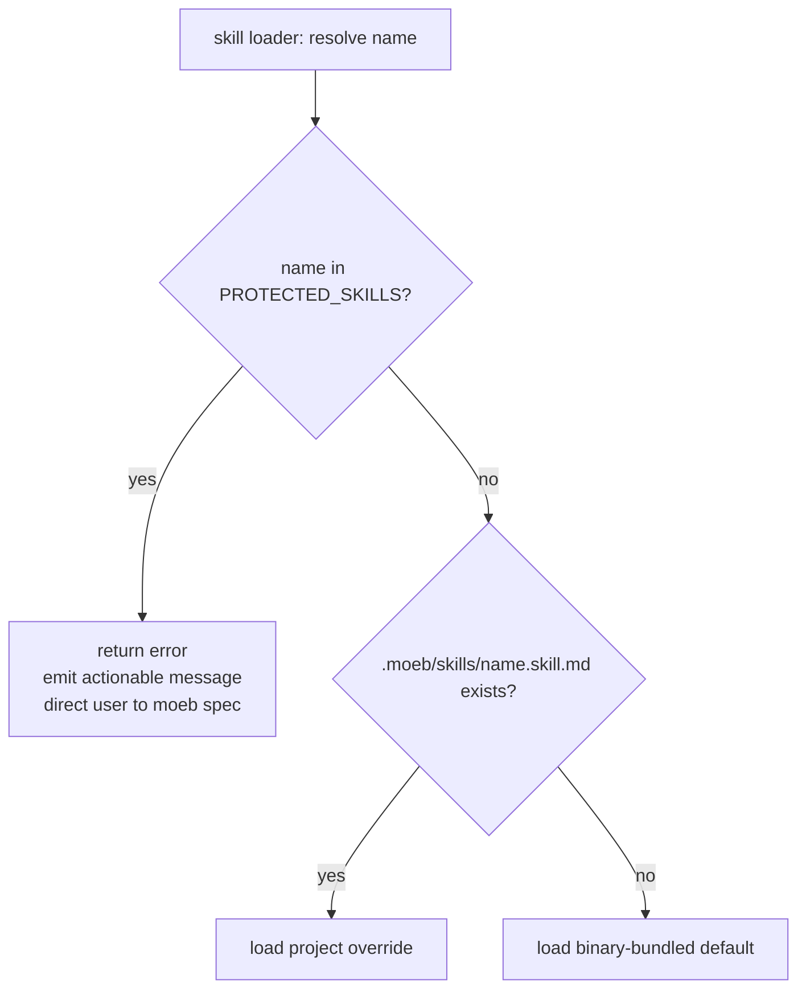

# Protected Baseline Skills

## Raw Requirement

Introduce a kernel-level protection mechanism that prevents project-level skill files in
`.moeb/skills/` from overriding the three protected baseline skills: `spec`, `run`, and
`fix_signal`. When the kernel discovers a file named `spec.skill.md`, `run.skill.md`, or
`fix_signal.skill.md` inside `.moeb/skills/`, it must refuse to load the override and emit
a clear error message directing the user to propose changes via `moeb spec` targeting
`src/moeb/internal/skills/` instead. The protected skill list must be maintained as a shared
constant so it can be referenced from both the loader and any future validation paths. No
existing project skill behaviour for non-protected names is affected.

## Description

The skill file system (introduced in `moeb.agent-skills.md`) allows projects to customise
agent workflow by placing `.skill.md` files in `.moeb/skills/`. However, the three baseline
skills — `spec`, `run`, and `fix_signal` — form the structural backbone of the moeb harness
workflow. They implement the phase contracts (Verify, End-of-Skill Review, Metrics Recording,
Commit, Tag, Complete) that the kernel and rubric system depend on. Silent override of these
skills creates a divergence between the kernel contract and the agent prompt that is difficult
to detect and can produce undefined harness behaviour.

This specification introduces a hardcoded `PROTECTED_SKILLS` constant in
`src/moeb/internal/constants.rs`. The skill loader, when resolving a project-level override,
checks the candidate skill name against this constant. If a match is found, the loader returns
an error with an actionable message before any file read is attempted. Non-protected skill names
are unaffected.



## Backlinks

### Parents
- [README.md](../README.md)
- [specifications/moeb/moeb.agent-skills.md](specifications/moeb/moeb.agent-skills.md)

## Steps

### Step 1 — Add or extend constants.rs with PROTECTED_SKILLS

Locate `src/moeb/internal/constants.rs`. If the file does not exist, create it. Add the
following public constant:

```rust
pub const PROTECTED_SKILLS: &[&str] = &["spec", "run", "fix_signal"];
```

The values must be the canonical skill names without the `.skill.md` suffix, in the order
listed above.

If `constants.rs` is new, declare it as a public module in the parent `mod.rs`:

```rust
pub mod constants;
```

Verify the module compiles (`cargo check`) before proceeding.

### Step 2 — Guard the skill loader against protected-skill overrides

Locate the function in `src/moeb/` that resolves whether to load a project-level override
from `.moeb/skills/<name>.skill.md` or the binary-bundled default. This function accepts the
skill name as a string and returns the skill file content.

Insert the following guard as the very first operation, before any filesystem access:

```rust
use crate::internal::constants::PROTECTED_SKILLS;

if PROTECTED_SKILLS.contains(&name.as_str()) {
    return Err(anyhow::anyhow!(
        ".moeb/skills/{name}.skill.md overrides a protected baseline skill.\n\
         Protected skills (spec, run, fix_signal) cannot be customised at the project level.\n\
         To propose a change, run `moeb spec` and target the source at\n\
         src/moeb/internal/skills/{name}.skill.md."
    ));
}
```

Use whatever error type the loader already propagates (e.g. `anyhow::Error`,
`Box<dyn std::error::Error>`, or a domain-specific error enum). The error must propagate
to the CLI entry point where it is printed to stderr and causes a non-zero exit code.

The guard must execute **before** any call to check whether the project file exists.
Non-protected skill names must be unaffected — the existing fallback logic (project file
→ bundled default) continues unchanged for them.

### Step 3 — Update harness README skills policy

In `.moeb/README.md`, in the **Skills** paragraph under the Repository layers or Policies
section, append the following sentence after the existing override description:

> The skills `spec`, `run`, and `fix_signal` are protected baseline skills and cannot be
> overridden via `.moeb/skills/`. To propose a change to a protected skill, run `moeb spec`
> and target `src/moeb/internal/skills/`.

Use `patch_file` with a minimal unified diff targeting only the insertion point in that
paragraph.

## Decisions

### Decision 1 — Hardcoded constant, not configuration

The protected skill list is a compile-time constant rather than a configuration file entry,
a frontmatter flag in the skill file itself, or a per-project allowlist.

**Rationale**: Protection is a kernel-contract invariant, not a per-project preference. Any
mechanism that allows the list to be changed via project-controlled files defeats the purpose
— a malicious or erroneous project config could remove the protection silently.

**Rejected alternatives**:
- `protected: true` frontmatter in the baseline skill file — readable by the agent but not
  enforced by the kernel; a project override could simply omit the field.
- `.moeb/settings.json` allowlist — the project author could add the skill name to the list.
- Runtime config key via `moeb configure` — creates an administrative surface for disabling
  kernel safety guarantees.

**Consequences**: Adding a new protected skill requires a Rust change and a new spec. This is
intentional — protected skills are rare kernel-contract skills, not user-extensible entry
points.

### Decision 2 — Error with propagation rather than process::exit in the loader

The loader returns an error via the existing error-propagation mechanism rather than calling
`std::process::exit(1)` directly inside the loader function.

**Rationale**: Calling `process::exit` inside a domain function violates the hexagonal
architecture constraint (`moeb.hex-architecture.md`): domain code must not have OS-level
side effects. The CLI entry point is the correct location to translate a fatal error into an
exit code.

**Rejected alternatives**:
- `process::exit(1)` in the loader — violates hexagonal boundary; also prevents unit tests
  from asserting the error without spawning a subprocess.
- Warn and fall back to bundled default — the erroneous override file persists and keeps
  producing warnings; the divergence is never forced to resolution.
- Warn and use the override — actively dangerous; allows the uncontrolled divergence.

**Consequences**: The CLI entry point must already handle errors from the skill loader with a
non-zero exit. If it does not, an additional error-to-exit mapping must be added there.

### Decision 3 — Constant placed in constants.rs, not inline in the loader

`PROTECTED_SKILLS` lives in `src/moeb/internal/constants.rs` rather than as an inline
literal inside the loader function.

**Rationale**: The requirement explicitly states the list must be referenceable from future
validation paths (e.g. a startup scan, a rubric check, or a `moeb lint` command). A
named module-level constant supports that without coupling future callers to the loader's
import chain.

**Rejected alternatives**:
- Inline `&["spec", "run", "fix_signal"]` in the loader — cannot be imported elsewhere
  without duplication; violates grep-discoverability for future audit paths.

**Consequences**: If `constants.rs` does not already exist it must be created and declared
in the parent `mod.rs`. The module must be kept narrow — only cross-cutting kernel constants
belong here, not domain-specific values.

## Rubric

### Structured

| Name | Description | Threshold | Pass Condition |
|------|-------------|-----------|----------------|
| `tool-errors` | No ToolHandler errors were recorded during this command invocation. Covers all tool calls on both CLI and MCP paths via `RealToolExecutor::execute`. Applies to every moeb command. | Zero tool errors | Kernel-authoritative: injected by `verify_rubrics` from `RunState.tool_errors`. Do not supply a verdict — any agent-supplied entry is overridden. |
| `rubric-qualification` | No Pass verdicts with acknowledged failures were issued during this command invocation. | Zero qualified Pass verdicts | Kernel-authoritative: injected by `verify_rubrics` by scanning `acknowledged_failures` on incoming Pass verdicts. Do not supply a verdict — any agent-supplied entry is overridden. |
| `skill-mandatory-phases` | The skill loaded for this run contains all mandatory phase headings. | All six mandatory headings present | Agent scans skill content in its loaded context; fails if any mandatory heading string is absent |
| `no-drift` | The specification does not violate any decision recorded in a linked parent specification. | Zero contradictions | Manual review: `moeb.agent-skills.md` permits project overrides for all skills; this spec narrows that scope to non-protected skills only — additive constraint, not a contradiction |
| `spec-schema-compliance` | All required frontmatter fields and body sections are present and correctly ordered. | 100% of required fields and sections | Frontmatter has domain, slug, status; all eight required sections present in order |
| `ai-first-org` | Steps prescribe focused, grep-discoverable file changes with no cross-cutting helpers. | All four principles followed | Step 1 adds one constant to one file; Step 2 modifies one guard in one function; Step 3 patches README — each file has one concern, names are grep-discoverable |
| `kernel-thin-and-parity` | No workflow logic in Rust; tool lists in CLI and MCP server remain in sync. | Zero violations | Steps add only a constant and a guard check in Rust — no new tools registered, no skill-specific logic introduced to kernel |
| `moeb-tool-origin` | All tool calls made during this invocation originate from moeb's own tool registry. | Zero external tool calls | Agent reviews conversation for calls to non-moeb tools; supplies Pass if none were made |
| `protected-skill-guard-fires` | The loader rejects any protected skill name and returns an error; the CLI exits with a non-zero code. | 100% | Run review: a unit test asserts that `PROTECTED_SKILLS` contains `"spec"`, `"run"`, and `"fix_signal"`, and that the loader returns `Err` for each |
| `no-silent-fallback` | Detection of a protected-skill override never falls through silently to the bundled default. | Zero silent fallbacks | Code review: the guard path returns `Err(...)` unconditionally — no `continue`, `return Ok(bundled)`, or other bypass |

### Qualitative

- The error message must name the offending skill file, state that protected skills cannot be
  overridden at the project level, and give the exact path (`src/moeb/internal/skills/`) for
  proposing changes via `moeb spec`.
- The constant must use canonical skill names without the `.skill.md` suffix.
- The guard must be placed before any filesystem access — the protected check must not require
  the project file to exist in order to fire.
- No changes to the binary-bundled skill content itself are part of this specification.
