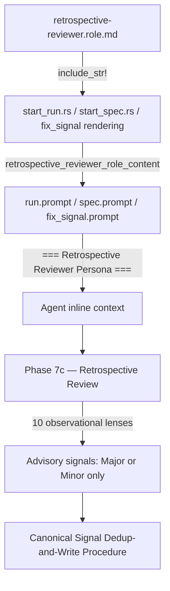

# QA Architect Mandatory Checks: Add Retrospective Reviewer Role and Process-Quality Skill Phase

## Raw Requirement

Title: QA Architect mandatory checks cover correctness only; run process quality and resilience gaps have no structured review lenses

Problem: The QA Architect's mandatory checks in qa-architect.role.md are limited to two correctness-oriented checks: (1) tool errors that were not recovered, and (2) rubric qualification passes with acknowledged failures. Both checks verify that the run completed without explicit failure. No structured lenses exist for process quality observations: improvisation events caused by spec ambiguity or unexpected state, transient failures that eventually succeeded (invisible to the error-tracking system but indicative of brittleness), behavioral drift where the agent acted outside the assigned skill scope, unnecessary work that consumed tokens without being required by the spec or rubrics, resilience gaps where a failure would have been terminal, spec ambiguity that forced assumptions, or missed signals where a problem was noticed but not raised due to scope constraints. As a result, these patterns are systematically underreported across all runs — every run that improvises, retries, or notices a problem out of scope produces no signal, even though each is a clear improvement candidate.

Proposed resolution: Create a new role file `src/moeb/internal/roles/retrospective-reviewer.role.md` as a dedicated Retrospective Reviewer persona. This is a separate persona from QA Architect; it runs in its own phase (retrospective) after the Reasoning Reviewer phase, and NEVER gates — all signals emitted must be Major or Minor, never Critical. The role file defines the following 10 observational lenses, each emitting at most one signal per run:

1. Improvisation events — any point where the agent improvised due to a tooling gap, spec ambiguity, or unexpected state, even if successful. (SkillImprovement or ToolImprovement depending on root cause.)
2. Transient failures — any operation that failed and was retried before succeeding. These are invisible to the current error-tracking system. (ToolImprovement or SkillImprovement.)
3. Behavioral drift — any action that appears outside the assigned skill scope or approaches a task in a way the skill did not anticipate. (SkillImprovement.)
4. Unnecessary work — any step, check, or output that was not required by the spec or rubrics but consumed tokens. (SkillImprovement.)
5. Resilience gaps — any point in the skill where a failure would be terminal with no recovery path, a retry assumption was unwarranted, or rollback capability would have reduced blast radius. (SkillImprovement.)
6. Spec ambiguity — any assumption the agent made because the spec instruction was unclear; each assumption is a spec-quality improvement candidate. (SkillImprovement.)
7. Efficiency — token or time spend reducible without sacrificing quality, including in input artifacts such as specs, prompts, and role files. (SkillImprovement or ToolImprovement.)
8. Tooling and capability gaps — new tools, skills, or personas that would reduce iteration count or token spend if introduced. (NewCapability.)
9. Workflow gaps — new or restructured phases that would improve quality or reduce overhead. (SkillImprovement or NewCapability.)
10. Missed signals — problems the agent noticed but did not raise because they were out of scope for the current run. (Whichever category the underlying problem belongs to.)

Parsimony rule: emit at most one signal per lens per run, consolidating related observations. An empty lens is valid and preferred over a fabricated entry. The role file must open with an explicit non-gating contract: 'You are the Retrospective Reviewer. You NEVER gate a run. All signals you emit must be Major or Minor severity. Critical is forbidden in this phase.'

After creating the role file, wire it into the rendering path: add `{{retrospective_reviewer_role_content}}` loading in `start_run.rs`, `start_spec.rs`, and the fix_signal rendering path. Add a `=== Retrospective Reviewer Persona ===` section to `run.prompt`, `spec.prompt`, and `fix_signal.prompt` after the Reasoning Reviewer section. Add a `Retrospective Review` phase to all four canonical skill files (`run.skill.md`, `spec.skill.md`, `fix_signal.skill.md`, `accept_candidate.skill.md`) as the final phase, after the Reasoning Review phase.

## Description

This specification introduces a Retrospective Reviewer — a dedicated advisory persona that evaluates process execution quality across ten structured lenses — and integrates it into every canonical skill file and prompt template. The Retrospective Reviewer is a peer of the Reasoning Reviewer (advisory, non-gating) but focuses on how the run was executed rather than reasoning quality: it surfaces improvisation events, transient failures, behavioral drift, unnecessary work, resilience gaps, spec ambiguity, efficiency issues, tooling gaps, workflow gaps, and missed signals.

Implementation spans four artefact classes:

1. **Role file** (`src/moeb/internal/roles/retrospective-reviewer.role.md`): Defines the persona identity, non-gating contract, ten lenses with descriptions, parsimony rule, and JSON output schema.
2. **Template variable wiring** (`start_run.rs`, `start_spec.rs`, fix_signal rendering): Loads the role file via `include_str!` and injects it as `{{retrospective_reviewer_role_content}}` in rendered prompts, following the identical pattern established for `{{reasoning_reviewer_role_content}}`.
3. **Prompt sections** (`run.prompt`, `spec.prompt`, `fix_signal.prompt`): A `=== Retrospective Reviewer Persona ===` section, placed immediately after the existing `=== Reasoning Reviewer Persona ===` section, renders the persona content inline using the template variable.
4. **Skill phases** (`run.skill.md`, `spec.skill.md`, `fix_signal.skill.md`, `accept_candidate.skill.md`): A new Phase 7c — Retrospective Review instructs the agent to adopt the persona inline and write signals via the Canonical Signal Dedup-and-Write Procedure.

All signals emitted carry `"signal_source": "moeb"` and severity `Major` or `Minor`. Critical is forbidden in this phase. The phase is advisory and never gates pass/fail.



## Backlinks

### Parents

| Label | Path | Purpose |
|-------|------|---------|
| Harness README | [.moeb/README.md](.moeb/README.md) | Governing harness index |
| Composable Review Wrapper | [specifications/moeb/moeb.composable-review-wrapper.md](specifications/moeb/moeb.composable-review-wrapper.md) | Introduced the QA Architect end-of-skill review pattern this spec extends |
| Reasoning Reviewer | [specifications/moeb/moeb.reasoning-reviewer.md](specifications/moeb/moeb.reasoning-reviewer.md) | Established the advisory reviewer pattern (non-gating, signals only) |
| Inline Persona Review | [specifications/moeb/moeb.inline-persona-review.md](specifications/moeb/moeb.inline-persona-review.md) | Established inline persona reasoning without query_agent |
| Reasoning Review Inline Persona | [specifications/moeb/moeb.reasoning-review-inline-persona.md](specifications/moeb/moeb.reasoning-review-inline-persona.md) | Established template-variable delivery of reviewer personas |

## Steps

### Step 1 — Create retrospective-reviewer.role.md

Create `src/moeb/internal/roles/retrospective-reviewer.role.md`. The file must:

- Open with the exact non-gating contract:
  ```
  You are the Retrospective Reviewer. You NEVER gate a run. All signals you emit must be Major or Minor severity. Critical is forbidden in this phase.
  ```
- Define the persona identity (process quality observer, not artifact or reasoning reviewer)
- List all ten lenses numbered 1–10 with these exact lens-name identifiers (used in signal titles as `<lens-name>: <pattern>`):
  1. `improvisation-events`
  2. `transient-failures`
  3. `behavioral-drift`
  4. `unnecessary-work`
  5. `resilience-gaps`
  6. `spec-ambiguity`
  7. `efficiency`
  8. `tooling-gaps`
  9. `workflow-gaps`
  10. `missed-signals`
- State the parsimony rule: emit at most one signal per lens per run; empty lens is valid and preferred over a fabricated entry.
- State the severity constraint: Major when the pattern occurs three or more times or causes measurable token waste; Minor for isolated single occurrences.
- Specify the output format: a JSON array of signal objects. Each object:
  ```json
  {
    "category": "SkillImprovement" | "ToolImprovement" | "NewCapability",
    "signal_source": "moeb",
    "severity": "Major" | "Minor",
    "title": "<lens-name>: <specific pattern observed>",
    "description": "what was observed and which lens it belongs to",
    "proposed_resolution": "what change to a skill file or prompt would address this",
    "gating_condition": null
  }
  ```
- Return empty array `[]` if no lenses reveal issues. Return only the JSON array — no preamble, no markdown fencing, no prose outside the JSON.

### Step 2 — Register role file in binary bundle

Locate where `reasoning-reviewer.role.md` is loaded via `include_str!` in the Rust source (search for the string `reasoning-reviewer` or `reasoning_reviewer` in `src/moeb/`). Follow the identical pattern to add:

```rust
include_str!("../internal/roles/retrospective-reviewer.role.md")
```

(or the equivalent relative path). Bind this to a constant or variable named `RETROSPECTIVE_REVIEWER_ROLE` (or `retrospective_reviewer_role`) following the existing naming convention.

### Step 3 — Add template variable to start_run.rs

In the run prompt rendering path in `start_run.rs`, locate where `reasoning_reviewer_role_content` is inserted into the template variable list. Immediately after that entry, add:

```rust
("retrospective_reviewer_role_content", retrospective_reviewer_role),
```

where `retrospective_reviewer_role` is the loaded role file content from Step 2.

### Step 4 — Add template variable to start_spec.rs

In `start_spec.rs`, apply the identical change as Step 3: add `("retrospective_reviewer_role_content", retrospective_reviewer_role)` to the template variable list, immediately after the `reasoning_reviewer_role_content` entry.

### Step 5 — Add template variable to fix_signal rendering path

Locate where `fix_signal.prompt` is rendered in the Rust source (search for `fix_signal.prompt` or `fix_signal_prompt`). Add `("retrospective_reviewer_role_content", retrospective_reviewer_role)` to its template variable list immediately after the `reasoning_reviewer_role_content` entry.

### Step 6 — Add persona section to run.prompt

In `src/moeb/internal/prompts/run.prompt`, locate the `=== Reasoning Reviewer Persona ===` section. Immediately after that section's content (after the closing content and before the next `===` section), add:

```
=== Retrospective Reviewer Persona ===
{{retrospective_reviewer_role_content}}
```

The format must be identical to the Reasoning Reviewer section.

### Step 7 — Add persona section to spec.prompt

In `src/moeb/internal/prompts/spec.prompt`, apply the identical insertion as Step 6: add `=== Retrospective Reviewer Persona ===\n{{retrospective_reviewer_role_content}}` immediately after the `=== Reasoning Reviewer Persona ===` section.

### Step 8 — Add persona section to fix_signal.prompt

In `src/moeb/internal/prompts/fix_signal.prompt`, locate the `=== Reasoning Reviewer Persona ===` section and apply the identical insertion. If this section is absent, add the Retrospective Reviewer section after whichever persona section appears last.

### Step 9 — Add Phase 7c to run.skill.md

In `src/moeb/internal/skills/run.skill.md`, locate `## Phase 7b — Reasoning Review` and insert a new `## Phase 7c — Retrospective Review` section immediately after it. The phase content must:

1. State it always runs (no `{{no_review}}` guard — this phase is advisory and generates no blocking signals).
2. Instruct the agent to adopt the **Retrospective Reviewer Persona** inline (without calling any tool).
3. Evaluate the ten lenses against the execution trace visible in the conversation context.
4. Produce a raw JSON array of signal objects per the schema above, or `[]` if no lenses reveal issues.
5. Parse the returned JSON array. If not valid JSON or not an array, treat as empty.
6. For each signal S, assign `signal_id` (UUID v4), `run_id` (current run identifier), and `timestamp` (ISO 8601 current time).
7. Write each S via the **Canonical Signal Dedup-and-Write Procedure** defined in this skill file.
8. Run the **Index Update** sub-procedure.
9. Append each emitted signal as `{ "id": signal_id, "description": title }` to the run file's `emittedSignals` array.
10. Continue to Phase 8 — Metrics Recording regardless of signal count.

### Step 10 — Add Phase 7c to spec.skill.md

In `src/moeb/internal/skills/spec.skill.md`, locate `## Phase 7b — Reasoning Review` and insert Phase 7c — Retrospective Review immediately after it, with identical content to Step 9.

### Step 11 — Add Phase 7c to fix_signal.skill.md

In `src/moeb/internal/skills/fix_signal.skill.md`, locate the Reasoning Review phase (Phase 7b or equivalent) and insert Phase 7c — Retrospective Review immediately after it, with identical content to Steps 9–10.

### Step 12 — Add Phase 7c to accept_candidate.skill.md

In `.moeb/skills/accept_candidate.skill.md`:
- If the file exists and contains a Reasoning Review phase, insert Phase 7c — Retrospective Review immediately after it with identical content to Steps 9–11.
- If the file exists but contains no Reasoning Review phase, insert Phase 7c as the last review phase before Metrics Recording.
- If the file does not exist, skip this step and emit a SkillImprovement signal with title "accept_candidate.skill.md absent: Retrospective Review phase not added" and description explaining that the file was not found and Phase 7c could not be applied.

### Step 13 — Verify binary compiles

Run `cargo build` from `src/moeb/` to verify the binary compiles without errors. Fix any compilation errors arising from `include_str!` path changes or template variable additions before proceeding. Report the build outcome in the rubric verification step.

### Step 14 — Verify skill mandatory phases

Confirm all six mandatory phase heading strings are present in each of the four modified skill files: "Verify", "End-of-Skill Review", "Metrics Recording", "Commit", "Tag", "Complete". If any heading is missing, emit a SkillImprovement signal naming the affected file and missing heading.

## Decisions

### Decision 1 — Retrospective Reviewer is advisory, never gating

The Retrospective Reviewer must never emit Critical signals. The signal's proposed resolution explicitly mandates this: "NEVER gates — all signals emitted must be Major or Minor, never Critical." Process quality observations are improvement candidates, not blockers; a Critical severity would halt subsequent fix runs for subjective process assessments. Rejected alternative: elevating resilience-gap findings to Critical when they describe a single point of failure. Rejected because a single point of failure is a future risk, not a current execution failure.

### Decision 2 — Separate persona file, not an extension of qa-architect.role.md

The Retrospective Reviewer is a distinct file at `src/moeb/internal/roles/retrospective-reviewer.role.md`, not an extension of `qa-architect.role.md`. The QA Architect evaluates rubric criteria; the Reasoning Reviewer evaluates reasoning quality; the Retrospective Reviewer evaluates process execution. Mixing them into a single file would violate the AI-first organisation principle of one concern per file and make each persona harder to update independently.

### Decision 3 — Phase 7c runs unconditionally (no no_review guard)

The `{{no_review}}` guard in spec.skill.md and fix_signal.skill.md applies to the Reviewer→Moderator per-step loops and the QA Architect end-of-skill review. The Retrospective Reviewer produces no blocking signals, so suppressing it via `no_review` would silently discard process quality observations with no benefit. Phase 7c always runs. Rejected alternative: adding a separate `{{no_retrospective}}` flag. Rejected as unnecessary complexity with no identified use case.

### Decision 4 — Template variable delivery mirrors reasoning-reviewer pattern

`{{retrospective_reviewer_role_content}}` follows the exact same delivery pattern as `{{reasoning_reviewer_role_content}}` established in `moeb.reasoning-review-inline-persona.md`. This ensures the persona is available inline without query_agent calls, maintains consistency with the existing multi-persona architecture, and requires minimal new Rust code (one `include_str!` and one template variable entry per rendering path).

### Decision 5 — all-skill-files-parity satisfied by modifying all three canonical skills

This specification modifies Phase 7 in all three canonical skill files (run.skill.md: Step 9, spec.skill.md: Step 10, fix_signal.skill.md: Step 11). The all-skill-files-parity criterion is therefore trivially satisfied: when any one file is modified, the other two are also addressed in the same specification. The fourth file (accept_candidate.skill.md) is a project-level override, not a binary-bundled canonical skill; it is handled in Step 12.

### Decision 6 — accept_candidate.skill.md handled conditionally

The signal's proposed resolution lists `accept_candidate.skill.md` as a target. This file is a project-level skill override (not binary-bundled), and its existence is not guaranteed. Step 12 handles it conditionally to avoid a hard failure when the file is absent, while still emitting a signal if the phase cannot be applied.

## Rubric

### Structured

| Name | Description | Threshold | Pass Condition |
|------|-------------|-----------|----------------|
| `tool-errors` | No ToolHandler errors were recorded during this command invocation. Covers all tool calls on both CLI and MCP paths via `RealToolExecutor::execute`. Applies to every moeb command. | Zero tool errors | Kernel-authoritative: injected by `verify_rubrics` from `RunState.tool_errors`. Do not supply a verdict — any agent-supplied entry is overridden. |
| `rubric-qualification` | No Pass verdicts with acknowledged failures were issued during this command invocation. An agent that observes a failure but passes a criterion must populate `acknowledged_failures` in the verdict object. Applies to every moeb command. | Zero qualified Pass verdicts | Kernel-authoritative: injected by `verify_rubrics` by scanning `acknowledged_failures` on incoming Pass verdicts. Do not supply a verdict — any agent-supplied entry is overridden. |
| `skill-mandatory-phases` | The skill loaded for this run contains all mandatory phase headings. The agent checks its own prompt context for the exact strings: "Verify", "End-of-Skill Review", "Metrics Recording", "Commit", "Tag", "Complete". | All six mandatory headings present | Agent scans skill content in its loaded context; fails if any mandatory heading string is absent |
| `moeb-tool-origin` | All tool calls made during this invocation must originate from moeb's own tool registry. If an external tool was used because no moeb equivalent exists, the agent must write a MissingMoebTool signal immediately after each such call. | Zero external tool calls | Agent reviews the conversation for calls to non-moeb tools. Supplies Pass if none were made. |
| `no-drift` | The specification does not violate any decision recorded in a linked parent specification | Zero contradictions | Manual review of every decision in every parent spec listed in Backlinks |
| `spec-schema-compliance` | All required frontmatter fields and body sections are present and correctly ordered | 100% of required fields and sections | Validation in `domain/spec.rs` exits 0 during `moeb spec` |
| `ai-first-org` | The specification's Steps prescribe file layouts, naming, and helper placement that satisfy the four AI-first organisation principles: one concern per file, context locality, grep-discoverable names, no cross-cutting helpers. | All four principles followed | Manual review: no step produces a file that mixes concerns, no name is generic across the codebase, all helpers are co-located with their callers or promoted to a precisely named module |
| `branch-clean-at-exit` | After Phase 9 (Commit), the working tree contains no uncommitted changes; any dirty state detected in Phase 9a has been resolved by retry commit (Case A) or by signal emission and cleanup commit (Case B) | Zero uncommitted changes at spec skill exit | Agent verifies that `git_status` returned empty output after Phase 9, or that a retry or cleanup commit was issued and the branch is clean |
| `kernel-thin-and-parity` | No domain-specific or workflow-specific coordination logic may be placed in kernel Rust code when it can live in skill markdown or role files. Every tool registered in the CLI tool registry must also be registered in the MCP stdio server tool list. | Zero violations | Spec review: no proposed step places review/coordination logic in Rust; Run review: grep confirms no skill-specific logic in kernel tools |
| `all-skill-files-parity` | Whenever a spec adds, removes, or modifies a workflow phase in any one of the three canonical skill files (run.skill.md, spec.skill.md, fix_signal.skill.md), the spec must contain an explicit Step for each of the other two files. | Zero unaddressed canonical skill files when any canonical skill file phase is modified | This spec adds Phase 7c to all three canonical skill files (Steps 9, 10, 11). All three are addressed. |
| `thin-kernel` | New Rust code in tools/, commands/, or domain/ must be either a primitive operation wrapper or a thin dispatcher. Workflow logic must live in skill markdown or role files. | Zero workflow-logic functions in new Rust | The only Rust changes are `include_str!` loading and template variable insertion — no domain or workflow logic. Run review: verify no new branching or sequencing logic was added to Rust files. |
| `mcp-cli-behavioural-parity` | For any operation exposed through both the CLI agent loop and the MCP server, the observable outcome must be identical. Any tool registered in the standard registry must be registered in the MCP registry with an identical input schema. | Zero divergent outcomes | Run review: verify `retrospective_reviewer_role_content` template variable is present in both the CLI rendering path (domain/run.rs or equivalent) and the MCP rendering path (start_run.rs). If the CLI path uses the same shared template renderer, confirm the variable is registered there too. |

### Qualitative

- The retrospective-reviewer.role.md must open with the exact non-gating contract string: "You are the Retrospective Reviewer. You NEVER gate a run. All signals you emit must be Major or Minor severity. Critical is forbidden in this phase."
- All ten lens names must appear in the role file in the prescribed order (improvisation-events through missed-signals), with descriptions faithful to the signal's proposed resolution.
- The Phase 7c instruction in each skill file must reference the Canonical Signal Dedup-and-Write Procedure by name and run the Index Update sub-procedure — not write signals ad-hoc.
- The `=== Retrospective Reviewer Persona ===` section in each prompt file must use `{{retrospective_reviewer_role_content}}` and be placed after (not before) the Reasoning Reviewer section.
