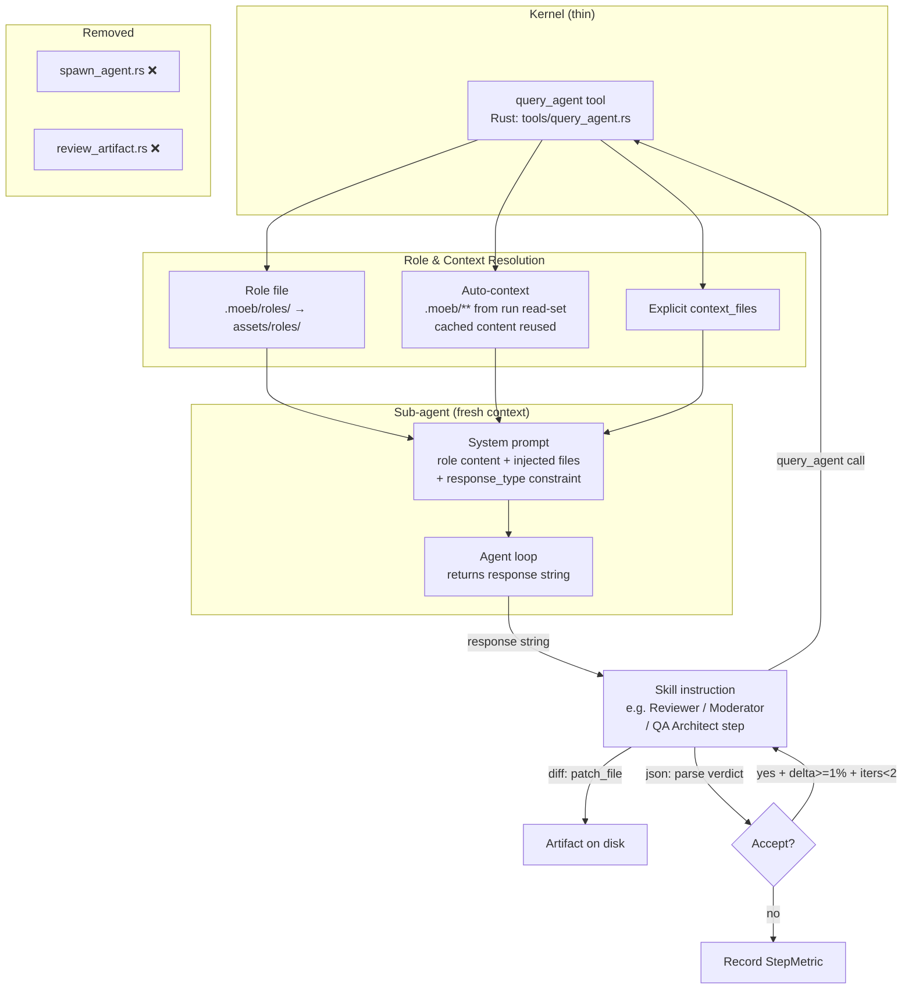

# Query Agent Tool

## Raw Requirement

Introduce a generic `query_agent` kernel tool and remove `spawn_agent` and
`review_artifact`, based on the following requirements:

Replace the kernel-heavy `review_artifact` tool (from moeb.composable-review-wrapper)
and the `spawn_agent` tool (from moeb.sub-agent-spawning) with a single, thin, generic
`query_agent` kernel tool. Move all sub-agent coordination logic (Reviewer, Moderator,
QA Architect) out of compiled Rust and into skill markdown instructions. `spawn_agent`
is fully superseded and its Rust implementation removed. `review_artifact` is removed;
the Writer→Reviewer→Moderator triangle is preserved in skill instructions using
`query_agent` calls.

`query_agent` parameters: `role: string`, `prompt: string`,
`expected_response_type: "text" | "diff" | "json"`, `context_files: string[]` (optional).
Auto-includes all `.moeb/**` files read in the current run. Runs with a fresh context
window; no parent conversation history. Read-only from the kernel's perspective.
Available in both CLI and MCP serve modes.

Additionally: add a "kernel thin and CLI/serve parity" criterion to the global baseline
rubric and a "no dead code" criterion to the run baseline rubric.

## Description

This specification introduces `query_agent`, a thin generic kernel tool that runs an
isolated sub-agent and returns its response as a string. It replaces two purpose-built
tools (`spawn_agent` and `review_artifact`) with a single composable primitive. All
review-loop coordination (Reviewer, Moderator, QA Architect) moves from compiled Rust
into skill markdown instructions, keeping the kernel as a thin runtime.

`query_agent` accepts a role name, a prompt, an expected response type, and an optional
list of additional context files. The kernel resolves the role file using the existing
`.moeb/roles/` → `assets/roles/` resolution order. It automatically injects all `.moeb/**`
files already read in the current run (reusing the read-tracking set from
`moeb.run-file-scope-enforcement.md` and cached content from `moeb.content-deduplication.md`)
into the sub-agent's initial context, avoiding redundant reads. The sub-agent runs with a
fresh conversation context — no parent history — receiving only the role content, injected
file contents, and the prompt. An `expected_response_type` constraint is appended to the
system prompt as a hard output instruction.

`spawn_agent.rs` and `review_artifact.rs` are deleted. Their registrations are removed
from the tool registry and MCP server. The skill files (`run.skill.md`, `spec.skill.md`)
are updated to replace all `spawn_agent` / `review_artifact` calls with `query_agent`
calls, preserving the Writer→Reviewer→Moderator triangle and QA Architect invocation.

Two rubric criteria are added to binary-bundled baseline files: a global criterion
enforcing kernel thinness and CLI/serve parity, and a run-time criterion requiring
removal verification for all items a spec explicitly deletes.



## Backlinks

### Parents

| Label | Path | Purpose |
|-------|------|---------|
| Harness README | README.md | Root index |
| Sub-Agent Spawning | specifications/moeb/moeb.sub-agent-spawning.md | Superseded: spawn_agent removed and replaced by query_agent |
| Composable Review Wrapper | specifications/moeb/moeb.composable-review-wrapper.md | Superseded Decision 1: review_artifact removed; triangle preserved via query_agent in skill instructions |
| Agent Roles | specifications/moeb/moeb.agent-roles.md | Role file resolution order reused by query_agent |
| Run-Time File Scope Enforcement | specifications/moeb/moeb.run-file-scope-enforcement.md | Read-tracking set reused to populate auto-context |
| Content Deduplication for File Reads | specifications/moeb/moeb.content-deduplication.md | Cached file content reused in auto-context injection |
| MCP Stdio Server | specifications/moeb/moeb.mcp-stdio-server.md | Tool list updated: query_agent added, spawn_agent and review_artifact removed |
| Rubric Context Layers | specifications/moeb/moeb.rubric-context-layers.md | global.rubrics.md and run.rubrics.md extended with new criteria |

## Steps

### Step 1 — Create `src/moeb/src/tools/query_agent.rs`

Create a new file implementing the `query_agent` tool handler. The tool is thin: it
resolves role and context, constructs a system prompt, runs a sub-agent loop, and
returns the response string.

**Tool name:** `"query_agent"`

**Input schema (JSON):**

```json
{
  "role": "string — role name; resolved to <role>.role.md via .moeb/roles/ then assets/roles/",
  "prompt": "string — the task prompt for the sub-agent",
  "expected_response_type": "\"text\" | \"diff\" | \"json\"",
  "context_files": ["string — optional additional file paths to include"]
}
```

**Return value:** `ToolResult` containing the sub-agent's response as a plain string.
If `expected_response_type` is `"json"` and the response is not valid JSON, prepend
`[PARSE_WARNING] ` to the returned string so the caller can detect and handle the
failure gracefully without panicking.

**Implementation:**

1. **Role resolution.** Attempt to load `.moeb/roles/<role>.role.md`; if absent, load
   `assets/roles/<role>.role.md` (bundled via the same mechanism as existing role files
   per `moeb.agent-roles.md`). If neither exists, return a `ToolResult` error:
   `"query_agent error: role file not found for role '<role>'"`.

2. **Auto-context assembly.** Access the current run's read-set (the same set maintained
   by `RealToolExecutor` for write-scope enforcement per `moeb.run-file-scope-enforcement.md`).
   Filter to paths whose string representation starts with `.moeb/`. For each matching
   path, retrieve its content from the deduplication cache (`moeb.content-deduplication.md`)
   if available; otherwise read it from disk. Collect as a list of `(path, content)` pairs.

3. **Explicit context files.** For each path in `context_files`, read content from disk
   (do not apply read-scope enforcement — `query_agent` is a query tool, not a write
   precondition). Collect as additional `(path, content)` pairs.

4. **System prompt construction.** Build the system prompt in this order:
   ```
   <role file content>

   ## Context files

   The following files are provided as read-only reference context:

   ### <path1>
   <content1>

   ### <path2>
   <content2>
   ...

   ## Output constraint

   <response_type_instruction>
   ```
   Where `<response_type_instruction>` is:
   - `"diff"`: `"Return a unified diff (--- / +++ / @@ hunk headers) or an empty string if no changes are proposed. Output the diff only — no preamble, no explanation."`
   - `"json"`: `"Return valid JSON only. No preamble, no markdown fencing, no explanation — just the raw JSON object or array."`
   - `"text"`: `"Respond in plain text."` (minimal constraint; role file governs format)

5. **Sub-agent loop.** Instantiate a fresh agent context (empty conversation history).
   Pass the constructed system prompt and the `prompt` parameter as the initial user
   message. Run the agent loop using the current run's configured adapter. The sub-agent
   has access to no tools — it is a pure text-completion call, not a tool-using agent.
   Capture the final assistant response text.

6. **Return.** If `expected_response_type` is `"json"`: attempt `serde_json::from_str`
   on the response; if it fails, return `format!("[PARSE_WARNING] {}", response)`.
   Otherwise return the response string as-is.

### Step 2 — Delete `src/moeb/src/tools/spawn_agent.rs`

Delete the file `src/moeb/src/tools/spawn_agent.rs`. Verify deletion before proceeding.

### Step 3 — Delete `src/moeb/src/tools/review_artifact.rs`

Delete the file `src/moeb/src/tools/review_artifact.rs`. Verify deletion before
proceeding.

### Step 4 — Update `src/moeb/src/tools/mod.rs`

Read `src/moeb/src/tools/mod.rs`. Make the following changes in a single `patch_file`
call:

- Add `mod query_agent;` alongside the existing tool module declarations.
- Remove `mod spawn_agent;`
- Remove `mod review_artifact;`
- In the tool registration block, register `query_agent` using the same pattern as
  other registered tools.
- Remove the registrations for `spawn_agent` and `review_artifact`.

### Step 5 — Update MCP stdio server tool list

Read the MCP stdio server implementation file (locate via `grep_files` for
`spawn_agent` or the tool list registration in the serve command). In a single
`patch_file` call:

- Add `query_agent` to the tool list with its input schema (matching Step 1).
- Remove `spawn_agent` from the tool list.
- Remove `review_artifact` from the tool list.

### Step 6 — Update `assets/skills/run.skill.md`

Read `assets/skills/run.skill.md`. Replace all occurrences of `spawn_agent` and
`review_artifact` calls with `query_agent` calls. Apply the following substitutions
in a single `patch_file` call:

**Per-Step Review Sub-Loop (replacing review_artifact calls):**

Replace the existing sub-loop instruction block with:

```markdown
### Per-Step Review Sub-Loop

Skip this sub-loop entirely if `{{no_review}}` is `"true"`.

After every `write_file` or `patch_file` call within a step:

1. **Reviewer call.** Call `query_agent` with:
   - `role`: `"reviewer"`
   - `prompt`: Provide the artifact path, its current content, the step intent
     (title + description), rubric criteria (explicit rows from the spec's
     `## Rubric / ### Structured` table applicable to this artifact; empty string
     if none apply), and the iteration history as JSON.
     Instruct the Reviewer: "Propose a unified diff of improvements if any are
     needed. Return an empty string if the artifact fully satisfies all criteria."
   - `expected_response_type`: `"diff"`

2. If the returned diff is empty or whitespace: terminate sub-loop. Record StepMetric
   with `iteration_count = 0`, `acceptance_rate = 1.0`, `delta_scores = []`.

3. **Moderator call.** Call `query_agent` with:
   - `role`: `"moderator"`
   - `prompt`: Provide the artifact's current content, the proposed diff from step 1,
     the rubric criteria, and the iteration history as JSON.
     Instruct the Moderator: "Score the expected quality improvement from this diff on
     a scale 0.0–1.0. Accept only if the change is a genuine, measurable improvement
     (not stylistic or speculative). Return JSON: { \"accepted\": bool,
     \"delta_score\": float, \"rationale\": string }"
   - `expected_response_type`: `"json"`

4. Parse the Moderator JSON. If `[PARSE_WARNING]` prefix is present, treat as
   `{ "accepted": false, "delta_score": 0.0, "rationale": "Moderator parse failure" }`.

5. If `accepted = true` and `delta_score >= 0.01` and `iteration_count < 2`:
   - Apply the diff: `patch_file` with the proposed diff on the artifact path.
   - Append `{ "delta_score": <score>, "accepted": true }` to iteration history.
   - Return to step 1.

6. Otherwise: terminate sub-loop.

7. Record StepMetric:
   - `step_id`: current step identifier
   - `iteration_count`: length of iteration history
   - `acceptance_rate`: if history empty → `1.0`; else accepted-count / total-count
   - `delta_scores`: `[entry.delta_score for each entry]`

8. Evaluate any spec rubric criteria applicable to this artifact now (e.g. `no-drift`
   immediately after a spec file is written) and note the result before continuing.
```

**End-of-Skill Review phase (replacing spawn_agent call):**

Replace the `spawn_agent` invocation in the End-of-Skill Review phase with:

```markdown
Call `query_agent` with:
- `role`: `"qa-architect"`
- `prompt`: Provide the paths and contents of all artifacts produced in this run,
  the accumulated StepMetrics as JSON, and the active specification's full `## Rubric`
  section. Instruct the QA Architect to return a ReviewSignalReport JSON as defined
  in `qa-architect.role.md`.
- `expected_response_type`: `"json"`

If `[PARSE_WARNING]` prefix is present in the response, treat it as a Critical error
signal: append a signal with title "QA Architect response parse failure" and
description containing the raw response, then continue.
```

### Step 7 — Update `assets/skills/spec.skill.md`

Apply the same substitutions as Step 6 to `spec.skill.md`. The Per-Step Review
Sub-Loop instructions are identical. The End-of-Skill Review `query_agent` call is
identical. The recursion guard (do not call `start_spec` from within an auto-generated
resolution spec's own End-of-Skill Review) is unchanged.

### Step 8 — Update `assets/rubrics/global.rubrics.md`

Read `assets/rubrics/global.rubrics.md`. Append the following row to the criteria
table using `patch_file`:

```
| `kernel-thin-and-parity` | No domain-specific or workflow-specific coordination logic may be placed in kernel Rust code when it can live in skill markdown or role files. Every tool registered in the CLI tool registry must also be registered in the MCP stdio server tool list. | Zero violations | Spec review: no proposed step places review/coordination logic in Rust; Run review: grep confirms no skill-specific logic in kernel tools; tool lists in tools/mod.rs and the MCP server match exactly |
```

This criterion applies at both `spec` authoring time (design check) and `run` time
(implementation check), so it belongs in the global baseline.

### Step 9 — Update `assets/rubrics/run.rubrics.md`

Read `assets/rubrics/run.rubrics.md`. Append the following row to the criteria table
using `patch_file`:

```
| `no-dead-code` | When a specification explicitly removes a tool, function, module, or file, the implementing agent must verify that the removed item no longer exists in the codebase before marking the run complete. | Zero removed items remaining | grep_files confirms absence of each deleted file path and each deleted symbol name listed in the spec's removal steps |
```

### Step 10 — Mark `moeb.sub-agent-spawning.md` as superseded in `.moeb/README.md`

Read `.moeb/README.md`. Locate the row for `moeb.sub-agent-spawning.md` in the
`### moeb` section. Change its `Status` column value from `active` to `superseded`
using `patch_file`.

## Decisions

### Decision 1 — Single generic `query_agent` replacing `spawn_agent` and `review_artifact`

**Rationale:** `spawn_agent` was constrained to returning unified diffs, making it
unsuitable for the Moderator (which must return a JSON verdict) without adding a
mode parameter that would widen its contract. `review_artifact` encoded review-specific
logic in Rust, violating the kernel-thin principle. `query_agent` is a minimal
primitive: role + prompt + response type → string. All coordination logic lives in
skill instructions. A single tool eliminates the inconsistency between two
purpose-built tools with overlapping concerns.

**Rejected alternatives:**
- Extend `spawn_agent` with a `mode: "report"` parameter: contaminates a focused tool
  with a second return-type contract and still leaves review coordination in Rust.
- Keep both tools, add a third for JSON responses: three sub-agent tools with partially
  overlapping semantics creates unnecessary surface area.
- Move coordination to a Rust `review_artifact` tool with injectable prompts: still
  Rust-side coordination, still fails MCP parity if `spawn_agent` infrastructure is
  CLI-only.

**Consequences:** Skill instructions become slightly more verbose (Reviewer and
Moderator steps are written out explicitly). This is the correct trade-off: verbosity
in skill markdown is visible and editable; verbosity in Rust is compiled and opaque.

### Decision 2 — Auto-include `.moeb/**` reads; exclude parent conversation history

**Rationale:** The `.moeb/` files (README, rubrics, skill files, specs) are the shared
infrastructure context that any sub-agent reasoning about the harness needs. They have
already been read and cached; re-reading them in the sub-agent would be redundant.
Parent conversation history is excluded to avoid colouring the sub-agent's assessment
with the coordinator's framing — independence is the point of the sub-agent call.

**Rejected alternatives:**
- Caller specifies all context files explicitly: correct files may be omitted by
  distracted coordinators; auto-inclusion is the safe default.
- Include all files read in the run (not just `.moeb/`): would pass source files from
  `src/` to QA Architect and Reviewer sub-agents that don't need them, expanding
  context unnecessarily. `.moeb/` is the correct boundary.
- Include parent conversation history: defeats the independence rationale; the Moderator
  would be swayed by the Reviewer's framing already visible to the coordinator.

**Consequences:** Sub-agents always receive current `.moeb/` state. If a `.moeb/` file
is written during the run (e.g. a spec file) and subsequently read, it is included.

### Decision 3 — Pure text-completion sub-agent (no tools)

**Rationale:** The Reviewer, Moderator, and QA Architect sub-agents are analysis tasks.
They do not need to write files, read additional files, or call any tool. Removing
tool access simplifies the sub-agent loop, eliminates the risk of recursive tool calls
from within a sub-agent, and makes the latency predictable (single adapter call,
no tool-use round-trips).

**Rejected alternatives:**
- Give sub-agents read tools: would allow them to fetch additional context, but the
  auto-context mechanism already provides the relevant files. Granting tool access
  opens the door to unbounded reads and recursive `query_agent` calls.
- Give sub-agents the full tool set: clearly out of scope; sub-agents must not write.

**Consequences:** Sub-agents rely entirely on the context injected by the coordinator.
If a sub-agent needs information not in the auto-context or `context_files`, the
coordinator must fetch and include it explicitly in the `prompt`.

### Decision 4 — `[PARSE_WARNING]` prefix for JSON parse failures instead of error

**Rationale:** Returning an error from `query_agent` on a JSON parse failure would
abort the skill run at a tool-call boundary. The calling skill can handle a degraded
Moderator verdict more gracefully (treat as reject, record the failure in StepMetric)
than it can handle a hard tool error. The `[PARSE_WARNING]` prefix is detectable by
a simple string prefix check and does not require structural changes to the return type.

**Rejected alternatives:**
- Return a Rust `Err` from the tool handler: forces the kernel to decide recovery
  strategy, removing that decision from the skill where it belongs.
- Silently return `{ accepted: false }` on parse failure: hides the failure from the
  skill's observability path; the skill cannot log the raw response for diagnosis.

**Consequences:** Callers must check for `[PARSE_WARNING]` prefix when
`expected_response_type` is `"json"`. Both skill files document this check.

### Decision 5 — Remove `spawn_agent` entirely rather than retain as an alias

**Rationale:** `spawn_agent` is unused after the review loop and QA Architect migrate
to `query_agent`. Retaining it as an alias would violate the `no-dead-code` rubric
being introduced by this same spec. Keeping dead tools in the registry also widens
the surface area for MCP clients and risks confusion for future spec authors who might
use it despite its parity problems.

**Rejected alternatives:**
- Deprecate `spawn_agent` with a warning: creates a transition period with no benefit,
  since there are no external consumers to protect.
- Retain as a thin wrapper around `query_agent`: adds indirection with no use case.

**Consequences:** `moeb.sub-agent-spawning.md` is marked superseded. Any future need
for a diff-returning sub-agent call is served by `query_agent` with
`expected_response_type: "diff"`.

### Decision 6 — `kernel-thin-and-parity` added to global baseline, `no-dead-code` to run baseline

**Rationale:** The kernel-thin principle applies to spec authoring (don't propose
kernel-heavy designs) and to run implementation (don't write coordination logic into
Rust). Global baseline is the correct layer — it fires on every command. The no-dead-code
criterion is a run-time implementation check only: spec authoring cannot know whether
removed items actually remain on disk. Run baseline is the correct layer.

**Rejected alternatives:**
- Both criteria in global baseline: `no-dead-code` is not meaningful at spec time; the
  spec lists what to remove, not whether it has been removed.
- Both criteria in per-command baselines: redundant duplication across `run.rubrics.md`
  and `spec.rubrics.md` for `kernel-thin-and-parity`.

**Consequences:** Every future `moeb run` checks that no removed items remain, and every
future `moeb spec` and `moeb run` checks that no kernel-specific coordination logic was
introduced. These are permanent guardrails.

## Rubric

### Structured

| Name | Description | Threshold | Pass Condition |
|------|-------------|-----------|----------------|
| `no-drift` | The specification does not violate any decision recorded in a linked parent specification | Zero contradictions | Manual review of every decision in every parent spec listed in Backlinks |
| `spec-schema-compliance` | All required frontmatter fields and body sections are present and correctly ordered | 100% of required fields and sections | Validation in `domain/spec.rs` exits 0 during `moeb spec` |
| `ai-first-org` | The specification's Steps prescribe file layouts, naming, and helper placement that satisfy the four AI-first organisation principles: one concern per file, context locality, grep-discoverable names, no cross-cutting helpers. | All four principles followed | Manual review: no step produces a file that mixes concerns, no name is generic across the codebase, all helpers are co-located with their callers or promoted to a precisely named module |
| `query-agent-schema-complete` | The `query_agent` tool input schema and return value are fully specified with types, semantics, and failure modes for every field | All fields typed, described, and failure modes documented | Manual review of Step 1: role, prompt, expected_response_type, context_files all have stated types; return value and PARSE_WARNING behaviour are documented |
| `removal-verified` | Steps explicitly removing spawn_agent.rs and review_artifact.rs include a verification instruction | Both deletions include verify step | Steps 2 and 3 each contain "Verify deletion before proceeding" |
| `parity-enforced` | query_agent is registered in both CLI tool registry and MCP stdio server tool list; removed tools are deregistered from both | Both lists updated atomically | Step 4 and Step 5 each touch both registrations; grep confirms spawn_agent and review_artifact absent from both files after run |
| `skill-files-updated` | Both run.skill.md and spec.skill.md replace all spawn_agent/review_artifact calls with query_agent calls maintaining the Writer→Reviewer→Moderator triangle | Zero remaining spawn_agent or review_artifact references | grep_files for spawn_agent and review_artifact in assets/skills/ returns no matches after run |
| `rubric-baselines-updated` | global.rubrics.md gains kernel-thin-and-parity; run.rubrics.md gains no-dead-code | Both files updated | Read both files after run; confirm new rows are present and correctly formatted |

### Qualitative

- The `query_agent` implementation in `query_agent.rs` contains no review-specific
  logic — no references to "reviewer", "moderator", or "delta_score". All such
  terminology lives exclusively in skill markdown.
- The `[PARSE_WARNING]` handling in both skill files is identical in wording, ensuring
  consistent degraded-mode behaviour across `run` and `spec` contexts.
- After this spec is applied, `grep_files` for `spawn_agent` and `review_artifact`
  across the entire repository returns zero matches outside of the two superseded
  specification files themselves.
