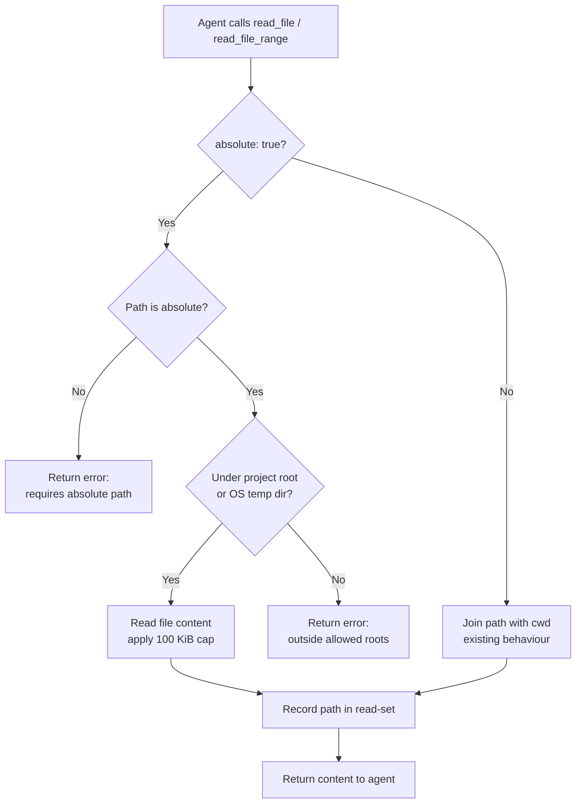

# read_file Absolute Path Support

## Raw Requirement

Title: read_file does not support absolute paths outside the project working directory

Problem: mcp__moeb__read_file and read_file_range operate relative to the project working directory. Agents frequently need to read files at absolute paths outside the working directory: overflow result files written to temp paths, system paths, and MCP session output files. Using Claude Code's native Read tool for these is a compliance bypass. This signal consolidates 22 prior signals that individually reported 'Missing moeb tool: Read' for various contexts — all of those are now superseded since read_file covers in-project reads. The genuine remaining gap is absolute-path access only.

Proposed resolution: Add an optional 'absolute' mode to read_file (or a separate read_file_absolute tool) that accepts a full filesystem path and bypasses the cwd-relative restriction. Scope enforcement should still apply: the path must be within a configurable allow-list (e.g. the moeb temp/overflow output directory and the project root). Add regression test covering absolute-path read of a file outside the project cwd.

## Description

This specification extends `read_file` and `read_file_range` with an optional `absolute: bool` parameter (default `false`). When `absolute: true` is supplied, the tool resolves the provided path as a literal filesystem path rather than joining it against the cwd. An allowed-roots guard restricts absolute reads to two locations: the project working directory (cwd at tool-executor initialisation) and the OS temp directory (`std::env::temp_dir()`), which is where the moeb kernel writes all overflow/run-output files. Paths outside both roots are rejected with a deterministic error. The existing 100 KiB per-file cap and read-set recording (for run-time write-scope enforcement) apply unchanged. The MCP server tool registry is updated to include the `absolute` parameter alongside the CLI registry update, preserving MCP/CLI parity. Two integration tests are added: one confirming a successful absolute read of a temp-dir file, and one confirming rejection of a path outside both allowed roots.

## Backlinks

### Parents

| Label | Path | Purpose |
|-------|------|---------|
| Harness README | README.md | Parent specification index governing all moeb specifications |
| Targeted File Reads: Line-Range Access Tool | specifications/moeb/moeb.read-file-range.md | Introduces read_file_range — this spec extends it with the absolute parameter |
| Run-Time File Scope Enforcement | specifications/moeb/moeb.run-file-scope-enforcement.md | Establishes read-set tracking for write-gating — absolute reads must be recorded in the same read-set |
| Run Stability: Trace Finalize Visibility and File Read Truncation | specifications/moeb/moeb.trace-finalize-and-read-cap.md | Establishes the 100 KiB per-file cap — this cap applies equally to absolute-path reads |

## Steps

### Step 1 — Add `absolute` parameter to `read_file` tool JSON schema

In `src/moeb/tools/read_file.rs`, locate the `ToolHandler` implementation for `read_file`. Add an optional `absolute` boolean field to the tool's JSON schema `properties` object with `"default": false` and description: `"When true, treat path as a literal filesystem path rather than relative to the working directory. The path must be absolute and must fall under the project root or the OS temp directory."`. Also update the `required` array to leave `absolute` absent (optional field).

### Step 2 — Implement absolute path resolution in `read_file::execute`

In the `execute` method of the `read_file` handler, after deserialising the input:

1. Extract `absolute: bool` from the input (default `false`).
2. If `absolute` is `false`: existing cwd-relative path-join behaviour is unchanged.
3. If `absolute` is `true`:
   a. Parse the `path` string as a `PathBuf`. Verify it is absolute (`.is_absolute()` returns `true`). If not, return the error string: `"Absolute mode requires an absolute path; got relative path: <path>"`.
   b. Canonicalise the path with `std::fs::canonicalize`. If canonicalisation fails (file not found), return the OS error message.
   c. Compute the two allowed roots:
      - `project_root`: the cwd passed to `RealToolExecutor::new`, canonicalised.
      - `temp_root`: `std::env::temp_dir()`, canonicalised (best-effort; fall back to raw if canonicalise fails).
   d. Check that the canonicalised path starts with `project_root` or `temp_root`. If neither matches, return the error string: `"Absolute path <canonical_path> is outside allowed roots (project root: <project_root>, temp dir: <temp_root>)"`.
   e. Use the canonicalised path as the file path for reading.
4. Read the file content and apply the existing 100 KiB cap.
5. Record the resolved (canonicalised) path in the read-set via the existing scope-enforcement mechanism.

### Step 3 — Add `absolute` parameter to `read_file_range` tool JSON schema and execution

In `src/moeb/tools/read_file_range.rs` (or the equivalent handler file), apply the same changes as Steps 1–2:

1. Add the `absolute: bool` parameter (default `false`) to the JSON schema.
2. In `execute`, after extracting `start_line` and `end_line`, apply the same absolute-path resolution logic: check `.is_absolute()`, canonicalise, validate against allowed roots, then proceed with the line-range read. The existing 300-line cap and read-set recording are unaffected.

### Step 4 — Store project root in `RealToolExecutor` for allowed-roots check

Verify that `RealToolExecutor` already stores the project working directory. If the `project_root` field does not exist, add it: capture `std::env::current_dir().unwrap_or_default()` during `RealToolExecutor::new` and store it as a `PathBuf` field. Both `read_file` and `read_file_range` handlers receive the executor context; use the stored `project_root` rather than calling `current_dir()` at read time to avoid TOCTOU inconsistency.

### Step 5 — Update MCP server tool registry

In the MCP stdio server tool list (the file that defines MCP-exposed tool schemas, typically `src/moeb/serve/` or `src/moeb/mcp/`), locate the schema definitions for `read_file` and `read_file_range`. Add the `absolute` boolean parameter to each schema's `properties` object with the same description and `"default": false` as the CLI registry. The `required` array must not include `absolute` in either schema. This ensures MCP/CLI schema parity.

### Step 6 — Add integration tests

In the test file for `read_file` (e.g. `src/moeb/tools/read_file_tests.rs` or the inline `#[cfg(test)]` block in `read_file.rs`):

**Test `read_file_absolute_path_in_temp_dir_succeeds`:**
1. Create a `TempDir` (using the `tempfile` crate already in use by the project).
2. Write a file `test_content.txt` with content `"hello absolute"` into it.
3. Construct the absolute path of that file.
4. Instantiate a `RealToolExecutor` (or call the handler directly) with a project root that does NOT contain the temp dir path.
5. Call `read_file` with `path` = the absolute path string and `absolute = true`.
6. Assert the result contains `"hello absolute"`.

**Test `read_file_absolute_path_outside_allowed_roots_is_rejected`:**
1. Construct an absolute path that is outside both the project root and `std::env::temp_dir()`. On all platforms, a well-known non-existent root-level path (e.g. `/not_a_real_moeb_path_xyzzy`) will satisfy this.
2. Call `read_file` with that path and `absolute = true`.
3. Assert the result is an error string containing `"outside allowed roots"`.

### Step 7 — Update `run.prompt` tool usage guidance (if applicable)

If `src/moeb/internal/prompts/run.prompt` (or the equivalent bundled prompt template) contains a section describing `read_file` tool usage or lists its parameters, append a usage note: `"Pass absolute: true to read a file by its full filesystem path (must be under the project root or the OS temp directory; use this for overflow result files written to temp paths by moeb)."` If no such section exists, no change is required.

## Decisions

### Decision 1 — Extend `read_file` and `read_file_range` with an `absolute` parameter rather than introducing a separate tool

**Rationale**: A separate `read_file_absolute` tool would double the registry surface area without adding new capability — the distinction is expressible as a single boolean parameter. Extending the existing tools keeps the schema minimal, makes the capability discoverable at the existing tool's description, and avoids duplicating the 100 KiB cap and read-set recording logic.

**Rejected alternative**: New `read_file_absolute` tool. Rejected because it inflates registry size and requires symmetric MCP/CLI registration of a tool that is architecturally identical to `read_file` except for path resolution.

**Consequence**: The `read_file` and `read_file_range` JSON schemas each gain one optional boolean field. Existing calls without `absolute` are unaffected (default `false`).

### Decision 2 — Two allowed roots: project cwd and OS temp directory; no configuration key

**Rationale**: The signal names the moeb temp/overflow output directory as the primary use case. The kernel writes all run-output overflow files to OS temp paths (`std::env::temp_dir()`). Using the OS temp directory as the second allowed root covers this case without requiring a new configuration key. The project root covers all in-project absolute reads. Adding a configuration key for an allow-list would add authoring and operational complexity for a boundary that is already deterministic.

**Rejected alternative**: Configurable allow-list in `config.toml`. Rejected because no currently-identified use case requires reading from paths outside the project root or OS temp directory. If such a use case arises, a follow-up spec can introduce the configuration key.

**Consequence**: Absolute reads to arbitrary system paths (e.g. `/etc/passwd`, `C:\Windows\System32`) are rejected. Agents reading overflow files at OS temp paths and any project-root file via absolute addressing are supported.

### Decision 3 — Absolute-path reads are recorded in the read-set

**Rationale**: The run-time write-scope enforcement (`moeb.run-file-scope-enforcement.md`) gates `write_file` calls on whether the target path was read during the current run. Recording absolute-path reads ensures the gate is satisfied when an agent reads a project file via its absolute path and later writes it. Omitting absolute reads from the read-set would create a bypass: the same file could be read (absolute) and written (relative) without tripping the gate.

**Rejected alternative**: Exclude absolute reads from the read-set (treat them as ephemeral external reads). Rejected because it silently undermines scope enforcement for any project file accessible by absolute path.

**Consequence**: The read-set may contain both relative and absolute canonical forms. The write-gate check should canonicalise the incoming write path before comparing against the read-set; if it does not already do so, a follow-up spec is required.

### Decision 4 — The 100 KiB cap applies to absolute reads

**Rationale**: The cap from `moeb.trace-finalize-and-read-cap.md` prevents unbounded context growth. Overflow result files — the primary motivation for this feature — can be arbitrarily large. The cap is more important for absolute reads than for in-project reads. Agents needing more than 100 KiB from an overflow file must use `read_file_range` with `absolute: true` to read specific line ranges.

**Rejected alternative**: Remove the cap for absolute reads. Rejected because the cap exists precisely to protect context budgets from large files; overflow files are a prime example of potentially large content.

**Consequence**: Overflow files larger than 100 KiB are truncated. This is expected and consistent with in-project read behaviour.

## Rubric

### Structured

| Name | Description | Threshold | Pass Condition |
|------|-------------|-----------|----------------|
| `tool-errors` | No ToolHandler errors were recorded during this command invocation. Covers all tool calls on both CLI and MCP paths via `RealToolExecutor::execute`. Applies to every moeb command. | Zero tool errors | Kernel-authoritative: injected by `verify_rubrics` from `RunState.tool_errors`. Do not supply a verdict — any agent-supplied entry is overridden. |
| `rubric-qualification` | No Pass verdicts with acknowledged failures were issued during this command invocation. An agent that observes a failure but passes a criterion must populate `acknowledged_failures` in the verdict object. Applies to every moeb command. | Zero qualified Pass verdicts | Kernel-authoritative: injected by `verify_rubrics` by scanning `acknowledged_failures` on incoming Pass verdicts. Do not supply a verdict — any agent-supplied entry is overridden. |
| `skill-mandatory-phases` | The skill loaded for this run contains all mandatory phase headings. The agent checks its own prompt context (the loaded skill content is already present) for the exact strings: "Verify", "End-of-Skill Review", "Metrics Recording", "Commit", "Tag", "Complete". No file read is required. | All six mandatory headings present | Agent scans skill content in its loaded context; fails if any mandatory heading string is absent |
| `moeb-tool-origin` | All tool calls made during this invocation must originate from moeb's own tool registry. If an external tool (not in the moeb registry) was used because no moeb equivalent exists, the agent must write a MissingMoebTool signal immediately after each such call. The criterion always fails when any external tool is used, whether or not a signal was written. | Zero external tool calls | Agent reviews the conversation for calls to non-moeb tools (e.g. Bash, Edit, Write, Read, Glob, Grep, WebFetch, WebSearch in Claude Code MCP mode). Supplies Pass if none were made. If external tools were used with MissingMoebTool signals, supplies Fail with `acknowledged_failures` listing each signal title. If external tools were used without signals, supplies Fail with the unlogged tool names in the note. |
| `no-drift` | The specification does not violate any decision recorded in a linked parent specification | Zero contradictions | Manual review of every decision in every parent spec listed in Backlinks |
| `spec-schema-compliance` | All required frontmatter fields and body sections are present and correctly ordered | 100% of required fields and sections | Validation in `domain/spec.rs` exits 0 during `moeb spec` |
| `ai-first-org` | The specification's Steps prescribe file layouts, naming, and helper placement that satisfy the four AI-first organisation principles: one concern per file, context locality, grep-discoverable names, no cross-cutting helpers. | All four principles followed | Manual review: no step produces a file that mixes concerns, no name is generic across the codebase, all helpers are co-located with their callers or promoted to a precisely named module |
| `branch-clean-at-exit` | After Phase 9 (Commit), the working tree contains no uncommitted changes; any dirty state detected in Phase 9a has been resolved by retry commit (Case A) or by signal emission and cleanup commit (Case B) | Zero uncommitted changes at spec skill exit | Agent verifies that `git_status` returned empty output after Phase 9, or that a retry (Case A) or cleanup commit (Case B) was issued and the branch is clean |
| `kernel-thin-and-parity` | No domain-specific or workflow-specific coordination logic may be placed in kernel Rust code when it can live in skill markdown or role files. Every tool registered in the CLI tool registry must also be registered in the MCP stdio server tool list. | Zero violations | Spec review: no proposed step places review/coordination logic in Rust; Run review: grep confirms no skill-specific logic in kernel tools; tool lists in tools/mod.rs and the MCP server match exactly |
| `all-skill-files-parity` | Whenever a spec adds, removes, or modifies a workflow phase in any one of the three canonical skill files (run.skill.md, spec.skill.md, fix_signal.skill.md), the spec must contain an explicit Step for each of the other two files — either applying the equivalent change or documenting with rationale why that file is intentionally excluded. | Zero unaddressed canonical skill files when any canonical skill file phase is modified | Run agent reviews the steps of the spec under implementation. If no canonical skill file phase is added, removed, or modified, mark `na`. If one or more canonical skill file phases are modified, verify that the spec contains a step for each of the other two canonical skill files (addressing the equivalent change or stating an exclusion rationale). Fail if any of the other two files has neither a qualifying step nor a documented exclusion rationale. |
| `thin-kernel` | New Rust code in tools/, commands/, or domain/ must be either (a) a primitive operation wrapper (filesystem, git, or HTTP with no domain logic) or (b) a thin dispatcher that calls into skills, tools, or agents and returns the result unchanged. Workflow logic must live in skill markdown or role files, not in compiled Rust. | Zero workflow-logic functions in new Rust | Spec review: no Step proposes placing sequencing or conditional workflow logic in Rust when a skill-file change would suffice; Run review: every new function in tools/ or commands/ either wraps a single OS/VCS/HTTP call or contains no domain-specific branching |
| `mcp-cli-behavioural-parity` | For any operation exposed through both the CLI agent loop and the MCP server, the observable outcome must be identical: same file mutations, same tool result string format, same rendered prompt template. Any tool registered in the standard registry must be registered in the MCP registry with an identical input schema and result contract. | Zero divergent outcomes | Run review: for every tool added or modified, both ToolRegistry::standard() and the MCP server carry identical registrations; input schema for `absolute` parameter is identical in both registries |

### Qualitative

- The `absolute` parameter description in the JSON schema clearly states the two allowed roots (project root and OS temp directory) and the rejection error format, so agents understand what paths are valid without needing to read source code.
- Error messages for invalid absolute paths include the rejected path and both allowed roots to enable self-diagnosis without a follow-up tool call.
- The 100 KiB cap behaviour is mentioned in the `read_file` tool description so agents reading large overflow files know to use `read_file_range` with line offsets rather than expecting full content.
- Integration tests cover both the success path (temp-dir file read) and the rejection path (outside-allowed-roots error), providing regression coverage for the allowed-roots guard.
