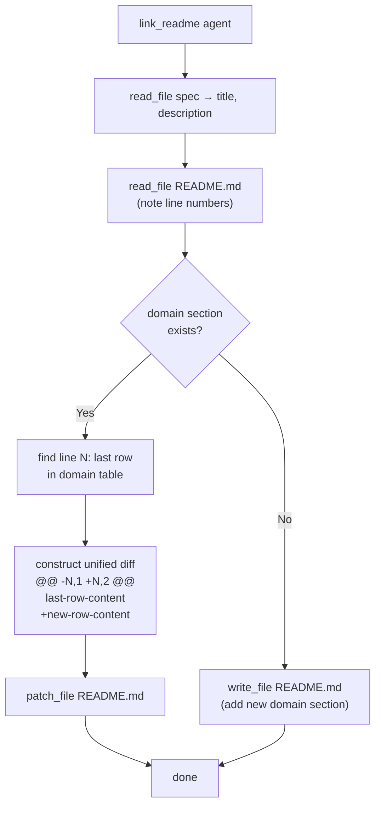

# README Link Agent: Enforce Correct Unified Diff Format for Table Row Appends

## Raw Requirement

> patches ought to be more efficient, we would want to enforce patch return into the correct
> format instead.

Decision 3 of `moeb.spec-failure-mode-fixes` prohibited `patch_file` in `readme-link.prompt`
because the agent was producing malformed diffs. The correct resolution is to enforce the right
format rather than fall back to sending the entire file.

## Description

`moeb.spec-failure-mode-fixes` Decision 3 chose `write_file` over `patch_file` for README
registration on the grounds that generating a correct unified diff is error-prone. This is
the wrong trade-off: as the specification index grows, `write_file` sends the entire README on
every link step while `patch_file` sends a constant-size diff of two to four lines. The cost
difference grows linearly with the index length.

The failure mode — "unable to parse hunk header" — indicates the link agent produced a diff
without `@@` hunk headers. The root cause is that `readme-link.prompt` never described the
required diff format. The fix is to replace the vague step 5 with explicit unified diff
construction guidance including a worked example, so the agent always produces a parseable
hunk.

The updated `readme-link.prompt` instructs the agent to:
1. Read the spec file for title and description.
2. Read `README.md` and note the exact line number of the last row in the domain table.
3. Construct the new table row including the required `Status` column (the original prompt
   omitted this column, producing malformed rows).
4. Call `patch_file` with a hunk that uses one context line (the last existing row) before
   the insertion. When the domain section does not yet exist, fall back to `write_file` with
   the full updated content since no stable insertion anchor exists.

## Diagram



## Backlinks

### Parents

| Label | Path | Purpose |
|-------|------|---------|
| README | [README.md](../../README.md) | Root index |
| Spec Failure Mode Fixes | [specifications/moeb/moeb.spec-failure-mode-fixes.md](specifications/moeb/moeb.spec-failure-mode-fixes.md) | Source spec whose Decision 3 this supersedes; Steps 1 and 2 of that spec remain active |
| Patch File Tool | [specifications/moeb/moeb.patch-file-tool.md](specifications/moeb/moeb.patch-file-tool.md) | Defines the `patch_file` tool and its unified diff format requirement |

### External

*(none)*

## Steps

### Step 1 — Replace `src/prompts/readme-link.prompt`

Read `src/prompts/readme-link.prompt` in full. Replace its entire content with:

```
You are a harness maintenance agent. A new specification has just been written to:

  {{spec_path}}

Your task is to register it in the Specification index inside README.md.

## Step 1 — Read the spec

Call read_file on "{{spec_path}}". Extract:
- The specification title from the level-1 heading (# Title).
- A one-sentence description from the opening of the ## Description section.

## Step 2 — Read README.md

Call read_file on "README.md". The response includes line numbers. Locate the
`### {{domain}}` section under the Specification index and note the line number
of its last data row. You need this line number to construct the patch hunk in Step 5.

## Step 3 — Determine write strategy

If the `### {{domain}}` section does not exist in README.md, use write_file (see Step 5b).

If the `### {{domain}}` section exists, use patch_file (see Step 5a).

## Step 4 — Construct the new table row

Format the row exactly as (four pipe-separated columns):

  | <title> | <one-sentence description> | [{{spec_path}}]({{spec_path}}) | active |

## Step 5a — Apply patch (existing domain section)

Call patch_file on "README.md" with a unified diff that inserts the new row after the
last existing data row in the `### {{domain}}` table.

The diff MUST use a `@@` hunk header. Use the last existing row as a single context line
before the insertion. Example — if the last existing row is at line N:

  @@ -N,1 +N,2 @@
   | last existing row content |
  +| <title> | <description> | [{{spec_path}}]({{spec_path}}) | active |

Rules:
- The hunk header counts must be accurate: `-N,1` means 1 line starting at N in the
  original; `+N,2` means 2 lines starting at N in the result (the original row plus the
  new row).
- The context line (space-prefixed) must be copied verbatim from the file — any mismatch
  causes the patch to be rejected.
- Do not include `--- a/file` / `+++ b/file` header lines; the hunk is sufficient.

## Step 5b — Full file write (new domain section)

If the `### {{domain}}` section did not exist, insert a new domain subsection in the
correct alphabetical position within the Specification index. The section must follow
the pattern of existing domain sections:

  ### {{domain}}

  | Name | Description | Path | Status |
  |------|-------------|------|--------|
  | <title> | <description> | [{{spec_path}}]({{spec_path}}) | active |

Call write_file on "README.md" with the complete updated content.

Do not alter any other content in README.md. When done, respond with a single sentence
describing what you added.
```

### Step 2 — Verify

Run `cargo build --release` — zero errors. Run `cargo test` — all existing tests pass.

Confirm the prompt contains both the `patch_file` instruction and the `write_file` fallback:

```
grep -c "patch_file\|write_file" src/prompts/readme-link.prompt
```

Should return at least 2. Confirm the `@@` hunk example is present:

```
grep "@@" src/prompts/readme-link.prompt
```

Should return a match.

## Decisions

### Decision 1 — Use `patch_file` for existing domain sections, `write_file` only for new sections

**Rationale:** A single table-row append produces a diff of two to four lines regardless of
README length. Sending the full README with `write_file` is O(index size) per link step;
`patch_file` is O(1). The original Decision 3 of `moeb.spec-failure-mode-fixes` treated
the format difficulty as a reason to avoid `patch_file` entirely; the correct response is
to eliminate the format ambiguity through explicit prompt guidance. `write_file` is retained
only for the new-domain case because no stable insertion anchor exists for a targeted patch.

**Alternatives:**

| Option | Reason Rejected |
|--------|-----------------|
| Always `write_file` (original Decision 3) | Sends the entire README on every link step; cost grows linearly with index length |
| Always `patch_file`, including new-domain case | No well-defined single insertion point when a new `###` section must be created in the right alphabetical position |

**Consequences:** The link agent must read README.md, identify the exact line number of the
last existing row, and produce a hunk with accurate counts. The prompt's worked example makes
the format unambiguous.

---

### Decision 2 — One context line (last existing row) is sufficient for the hunk

**Rationale:** The `diffy` crate locates the hunk by matching context lines against the file.
One context line — the last existing table row — uniquely identifies the insertion point in
practice because table rows are distinct strings. Using more context lines would increase diff
size without improving patch reliability; using zero context lines produces an invalid unified
diff that `diffy` rejects.

**Alternatives:**

| Option | Reason Rejected |
|--------|-----------------|
| Zero context lines | Invalid unified diff format; causes the "unable to parse hunk header" error that motivated this spec |
| Two or more context lines | Increases diff size; couples the hunk to more surrounding content that may change independently |

**Consequences:** The hunk counts in the example are `-N,1 +N,2`. The agent must copy the last
existing row verbatim as the context line; any deviation causes `diffy::apply` to return a
context-mismatch error.

---

### Decision 3 — Fix missing `Status` column in the row format

**Rationale:** The README Specification index table has four columns: Name, Description, Path,
Status. The original `readme-link.prompt` generated only three columns (no Status), producing
malformed rows. Since the prompt is being rewritten, the correct four-column format is included
in the new row template.

**Alternatives:**

| Option | Reason Rejected |
|--------|-----------------|
| Leave Status column absent to match original behaviour | The rows it produced were already malformed; fixing the column count is the correct repair |

**Consequences:** All rows appended by the link agent after this spec is implemented will carry
the `| active |` status column, consistent with the table header.

## Rubric

### Structured

| Name | Description | Threshold | Pass Condition |
|------|-------------|-----------|----------------|
| `binary-builds` | `cargo build --release` exits 0 | Zero errors | CI build exits 0 |
| `all-tests-pass` | `cargo test` exits 0 | Zero failures | `cargo test` exits 0 |
| `readme-link-uses-patch` | `readme-link.prompt` instructs `patch_file` for existing domain tables | Present | `grep "patch_file" src/prompts/readme-link.prompt` returns a match in the instruction context |
| `hunk-header-example-present` | The prompt contains a worked `@@` hunk example with accurate count notation | Present | `grep "@@" src/prompts/readme-link.prompt` returns a match |
| `write-file-fallback-present` | `readme-link.prompt` instructs `write_file` for new domain sections | Present | `grep "write_file" src/prompts/readme-link.prompt` returns a match |
| `four-column-row-format` | The new row template includes the `Status` column | Present | The prompt contains `\| active \|` at the end of the row template |

### Qualitative

- **Diff legibility:** The worked `@@` example uses realistic placeholders and explains the count semantics (`-N,1 +N,2`) so the agent can adapt it without guessing.
- **Backward compatibility:** The `write_file` fallback preserves correctness when a domain section is being introduced for the first time.
- **Error recovery guidance:** The context-line verbatim-copy rule is stated explicitly so that if `diffy::apply` rejects the patch, the agent knows the cause and how to fix it.
