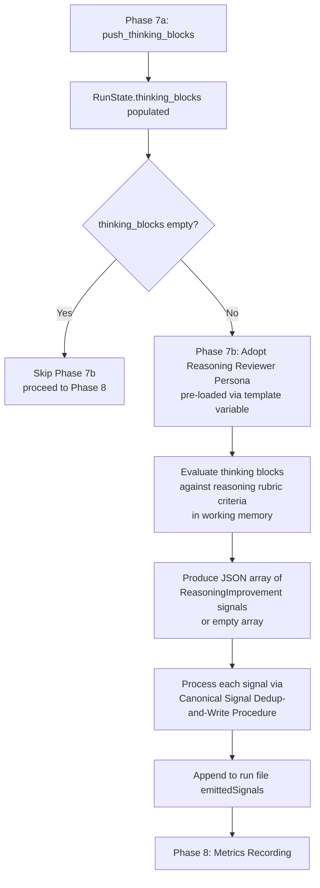

# Reasoning Review: Inline Persona Replaces query_agent in Phase 7b

## Raw Requirement

Replace the query_agent call in Phase 7b (Reasoning Review) of all three canonical binary-bundled skill files (run.skill.md, spec.skill.md, fix_signal.skill.md) with an inline Reasoning Reviewer Persona that evaluates accumulated thinking blocks in-context and produces the advisory ReasoningImprovement signal JSON array without calling any external adapter. The inline persona must follow the same output contract as the existing reasoning-reviewer role file. Additionally, add a skill-level guard to each skill file that skips the query_agent call entirely when running in MCP/inline mode or when no adapter is configured, replacing the tool error with a graceful no-op. The fix removes the adapter dependency from an advisory-only phase that must never block or fail a run regardless of adapter state.

## Description

Phase 7b (Reasoning Review) currently calls `query_agent` with `role: "reasoning-reviewer"`. In MCP mode — where the spec and run agent IS the model running inline — `query_agent` invokes a separately configured adapter (Anthropic or OpenAI). When no adapter is configured, this produces a tool error that is logged but does not block the run. The fix aligns Phase 7b with the existing inline persona pattern used by Phase 1 (Reviewer), Phase 3 (Moderator), and Phase 7 (QA Architect): the persona is pre-loaded into the prompt context as a template variable and the agent adopts it in-context without any tool call.

Two changes are required. First, a `{{reasoning_reviewer_persona}}` template variable is added to `spec.prompt` and `run.prompt` alongside the existing `{{reviewer_persona}}`, `{{moderator_persona}}`, and `{{qa_architect_persona}}` substitutions; the kernel loads the `reasoning-reviewer.role.md` content (project override or binary-bundled default) and injects it. Second, Phase 7b in all three skill files is rewritten to adopt the inline Reasoning Reviewer Persona instead of calling `query_agent`. The `push_thinking_blocks` phase (7a) is unchanged; thinking blocks are still captured and available to the inline persona. The advisory nature of Phase 7b is preserved: its output feeds the signal queue but cannot block or fail a run.



## Backlinks

### Parents

| Label | Path | Purpose |
|-------|------|---------|
| Harness README | README.md | Root index and policy source |
| Reasoning Reviewer | specifications/moeb/moeb.reasoning-reviewer.md | Introduced Phase 7b Reasoning Review with `query_agent`; this spec replaces that call with an inline persona |
| MCP Mode Thinking Block Capture | specifications/moeb/moeb.mcp-thinking-block-capture.md | Extended Phase 7a/7b to all three canonical skill files; Phase 7b changes in this spec apply to the same three files |
| Inline Persona Review: In-Context Reviewer and Moderator Reasoning | specifications/moeb/moeb.inline-persona-review.md | Established the inline persona pattern via template variables that this spec extends to the Reasoning Reviewer |
| Reviewer and Moderator Role Files | specifications/moeb/moeb.reviewer-and-moderator-roles.md | Defined the template variable and output contract pattern for inline personas |

## Steps

### Step 1 — Add {{reasoning_reviewer_persona}} substitution in start_spec.rs and start_run.rs

In `src/moeb/src/tools/start_spec.rs`, locate the block that loads role file content for the existing inline personas (reviewer, moderator, qa_architect). Add loading of the `reasoning-reviewer` role file using the same pattern (project override at `.moeb/roles/reasoning-reviewer.role.md` falling back to the binary-bundled asset). Add `{{reasoning_reviewer_persona}}` to the template substitution call alongside the existing persona substitutions.

Apply the identical change to `src/moeb/src/tools/start_run.rs`.

If `fix_signal` has its own prompt rendering path, apply the same pattern there as well.

### Step 2 — Add {{reasoning_reviewer_persona}} section to spec.prompt and run.prompt

In `src/prompts/spec.prompt`, locate the section that contains `=== QA Architect Persona ===`. Immediately after that section's closing content, append:

```
=== Reasoning Reviewer Persona ===
{{reasoning_reviewer_persona}}
```

Apply the identical change to `src/prompts/run.prompt`.

If `fix_signal` uses a prompt template, apply the same addition there.

### Step 3 — Replace Phase 7b in spec.skill.md

In `src/moeb/internal/skills/spec.skill.md`, locate Phase 7b — Reasoning Review. Replace the entire body of Phase 7b (keeping the phase heading and the `{{no_review}}` skip condition) with the following:

```markdown
## Phase 7b — Reasoning Review

This phase runs when `{{no_review}}` is `"false"` (the default). Skip ONLY if
`{{no_review}}` is the exact string `"true"`.

This review is advisory — its findings are emitted as signals to the improvement
queue but do not affect the rubric verdict or run pass/fail.

1. If `RunState.thinking_blocks` is empty, skip this phase entirely and proceed to
   Phase 8.

2. Without calling any tool, adopt the **Reasoning Reviewer Persona** pre-loaded in
   your context. Evaluate the accumulated thinking block strings from this run against
   the reasoning quality criteria. Produce a raw JSON array of signal objects (each
   with `"category": "ReasoningImprovement"`) in working memory, or an empty array
   `[]` if no improvements are identified.

3. Parse the returned JSON array. If it is not valid JSON or is not an array, treat it
   as an empty array and proceed.

4. For each signal S in the array, assign:
   - `signal_id`: a fresh UUID v4
   - `run_id`: the current run identifier (`{{run_id}}`)
   - `timestamp`: ISO 8601 current time

   Then write S via the **Canonical Signal Dedup-and-Write Procedure** defined in
   this skill file.

5. After all signals are processed, run the Index Update sub-procedure.

6. Append each emitted signal's `{ "id": signal_id, "description": title }` to the
   run file's `emittedSignals` array.

Continue to Phase 8 — Metrics Recording regardless of signal count.
```

### Step 4 — Replace Phase 7b in run.skill.md

Apply the identical Phase 7b replacement from Step 3 to `src/moeb/internal/skills/run.skill.md`. The only permitted difference is the run_id token name if the run skill uses a different variable.

### Step 5 — Replace Phase 7b in fix_signal.skill.md

If `src/moeb/internal/skills/fix_signal.skill.md` contains a Phase 7b or Reasoning Review phase that calls `query_agent`, apply the identical replacement from Step 3.

If fix_signal.skill.md does not have a Phase 7b, no change is required for that file.

### Step 6 — Add MCP mode note to all three skill files

In each of the three canonical skill files, immediately after the Phase 7b heading, add the following comment before the `{{no_review}}` skip condition:

```markdown
> **MCP/inline mode note:** Do not call `query_agent` in this phase. When running
> inline (via `start_spec` or `start_run` MCP tools), the agent IS the model and must
> use only inline persona reasoning. The Reasoning Reviewer Persona is pre-loaded in
> your context for exactly this purpose.
```

### Step 7 — Build and test

From `src/moeb/`:
1. `cargo build` — confirm compilation without errors or warnings.
2. `cargo test` — confirm all tests pass. The template substitution for `{{reasoning_reviewer_persona}}` must not produce an empty string when the role file exists.

## Decisions

### Decision 1 — Inline persona via template variable, not embedded in skill file

**Rationale:** The existing Reviewer, Moderator, and QA Architect personas are loaded as template variables (`{{reviewer_persona}}`, etc.) and appear as pre-loaded context sections in the rendered prompt. The agent adopts them at the top-level prompt layer, not from skill file text. Consistency with this established pattern means the Reasoning Reviewer persona should be injected the same way. A persona embedded in the skill file body would be harder to locate and update independently of the skill workflow.

**Rejected alternative:** Embedding the full persona content directly in the skill file — rejected because the skill file describes workflow phases, not agent identity. Mixing persona definitions into phase instructions reduces context locality and makes the persona harder to find via grep. The existing pattern (role files + template variables) is the correct abstraction boundary.

**Consequences:** The Rust rendering code in `start_spec.rs` and `start_run.rs` gains one additional role file load. This is a primitive filesystem operation with no domain logic, consistent with `thin-kernel`.

### Decision 2 — Remove query_agent from Phase 7b entirely; no mode-detection guard

**Rationale:** The cleanest fix for a tool that must not be called is to not call it. Adding a mode-detection guard (`if MCP mode: skip; else: call query_agent`) requires the skill to know what mode it is running in — a form of environmental coupling. Replacing the implementation with an inline persona eliminates the coupling entirely. If `query_agent` is genuinely needed for other phases in non-MCP CLI runs, those phases will call it explicitly; Phase 7b is not one of them.

**Rejected alternative:** Adding a guard that checks the adapter state before calling `query_agent` — rejected because it leaves `query_agent` in the skill as a conditional dead branch in MCP mode, and requires the skill to detect its own execution context (which is not a skill concern). The guard note added in Step 6 is documentation, not a conditional branch.

**Consequences:** `query_agent` is no longer called in Phase 7b under any execution mode. CLI-mode runs that previously used a configured adapter for reasoning review will now use the inline persona. The quality of the review is not degraded — the inline model has full context; the query_agent sub-agent had only the files explicitly passed as `context_files`.

### Decision 3 — Advisory nature of Phase 7b is preserved unconditionally

**Rationale:** Reasoning review was always advisory — its signals improve future runs but cannot cause a rubric failure or run abort. The inline persona change does not alter this property. The `if thinking_blocks empty: skip` guard is retained so that runs that produce no thinking blocks (e.g., non-Anthropic adapters) do not spend tokens on an empty review.

**Rejected alternative:** Making reasoning review non-advisory (i.e., blocking on Critical signals) was considered. Rejected because the reasoning-reviewer role was explicitly designed as an improvement signal emitter, not a gatekeeper. The inline persona produces the same category of advisory output.

**Consequences:** Critical signals from the Reasoning Reviewer (if any) are still emitted to the queue and visible in the index, but do not increment `end_review_error_count` or cause verify_rubrics to fail. This is unchanged from the prior behaviour.

## Rubric

### Structured

| Name | Description | Threshold | Pass Condition |
|------|-------------|-----------|----------------|
| `tool-errors` | No ToolHandler errors were recorded during this command invocation. Covers all tool calls on both CLI and MCP paths via `RealToolExecutor::execute`. Applies to every moeb command. | Zero tool errors | Kernel-authoritative: injected by `verify_rubrics` from `RunState.tool_errors`. Do not supply a verdict — any agent-supplied entry is overridden. |
| `rubric-qualification` | No Pass verdicts with acknowledged failures were issued during this command invocation. An agent that observes a failure but passes a criterion must populate `acknowledged_failures` in the verdict object. Applies to every moeb command. | Zero qualified Pass verdicts | Kernel-authoritative: injected by `verify_rubrics` by scanning `acknowledged_failures` on incoming Pass verdicts. Do not supply a verdict — any agent-supplied entry is overridden. |
| `skill-mandatory-phases` | The skill loaded for this run contains all mandatory phase headings. | All six mandatory headings present | Agent scans skill content in its loaded context; fails if any mandatory heading string is absent |
| `no-drift` | The specification does not violate any decision recorded in a linked parent specification. | Zero contradictions | Manual review of every decision in every parent spec listed in Backlinks |
| `spec-schema-compliance` | All required frontmatter fields and body sections are present and correctly ordered. | 100% of required fields and sections | Validation in `domain/spec.rs` exits 0 during `moeb spec` |
| `ai-first-org` | The specification's Steps prescribe file layouts, naming, and helper placement satisfying the four AI-first organisation principles. | All four principles followed | Template variable loading is a single-concern primitive; phase instructions are co-located in skill files; no cross-cutting helpers introduced |
| `kernel-thin-and-parity` | No domain-specific or workflow-specific coordination logic in kernel Rust code. Every tool registered in the CLI tool registry must also be registered in the MCP stdio server tool list. | Zero violations | Spec review: Rust change is one additional role file load (primitive filesystem operation); no workflow logic added to Rust |
| `moeb-tool-origin` | All tool calls made during this invocation must originate from moeb's own tool registry. | Zero external tool calls | Agent reviews the conversation for calls to non-moeb tools; supplies Pass if none were made |
| `thin-kernel` | New Rust code must be a primitive operation wrapper or thin dispatcher. | Zero workflow-logic functions in new Rust | Run review: the new role file load in start_spec.rs and start_run.rs is a filesystem read with no domain branching |
| `no-query-agent-in-phase-7b` | After this run, Phase 7b in all three canonical skill files must not contain a `query_agent` call. | Zero `query_agent` calls in Phase 7b across all three skill files | Run review: `grep_files query_agent src/moeb/internal/skills/` confirms no remaining `query_agent` reference in Phase 7b sections |
| `reasoning-reviewer-persona-loaded` | `{{reasoning_reviewer_persona}}` is substituted in both `spec.prompt` and `run.prompt`, and its value is non-empty at render time. | Template variable present and non-empty | Run review: rendered prompt output contains `=== Reasoning Reviewer Persona ===` followed by non-empty content |

### Qualitative

- The Phase 7b replacement text must be verbatim-identical across all three skill files (modulo the run_id token name if it differs between skills).
- The advisory property of Phase 7b must be preserved: no signal from the inline Reasoning Reviewer may cause rubric failure, increment `end_review_error_count`, or block progression to Phase 8.
- The `{{no_review}}` skip condition and the empty-thinking-blocks guard must be retained in the updated Phase 7b.
- The MCP mode note added in Step 6 is documentation — it must not introduce a conditional branch or tool call.
