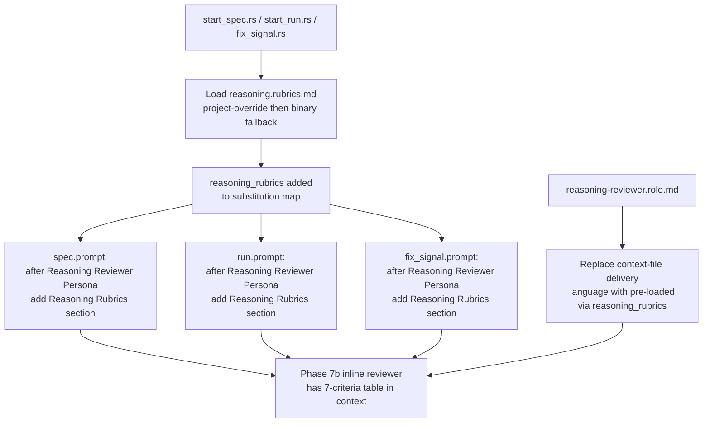

# Reasoning Reviewer: Inject reasoning.rubrics.md Content via Template Variable

## Raw Requirement

Title: Reasoning reviewer inline persona missing canonical rubrics table in context

Problem: During the signal-status-lifecycle-tracking run (caa3bb83), Phase 7b adopted the Reasoning Reviewer inline persona and explicitly stated: 'I don't have the actual rubric file in context, but based on the Reasoning Reviewer Persona, I'm evaluating whether these decisions measurably reduce future token consumption, improve decision linearity, or reduce repeated re-derivations.' The reviewer improvised an informal two-criterion summary rather than evaluating against the seven canonical criteria (decision-linearity, spec-citation-discipline, tool-selection-directness, scope-containment, context-retention, confidence-calibration, proportionality) defined in src/moeb/internal/rubrics/reasoning.rubrics.md.

Root cause: the reasoning-review-inline-persona spec converted Phase 7b from a query_agent call to an inline persona via the `{{reasoning_reviewer_persona}}` template variable, but the reasoning.rubrics.md content was never added as a second template variable. The role file was written for query_agent mode and says the reviewer 'will receive the contents of reasoning.rubrics.md as a context file' — that delivery mechanism ceased to exist when query_agent was removed. No corresponding `{{reasoning_rubrics}}` variable was added to spec.prompt, run.prompt, or fix_signal.prompt.

Proposed resolution: 1. In start_spec.rs and start_run.rs, add loading of reasoning.rubrics.md using the same project-override-with-binary-fallback pattern used for the existing role files. 2. Add a `{{reasoning_rubrics}}` substitution alongside `{{reasoning_reviewer_persona}}` in the template substitution call. 3. In spec.prompt, run.prompt, and fix_signal.prompt, append the rubrics content immediately after the `=== Reasoning Reviewer Persona ===` section. 4. Update reasoning-reviewer.role.md to replace the 'context file' delivery language with 'pre-loaded in your context via `{{reasoning_rubrics}}`'.

## Description

This specification closes the rubrics delivery gap introduced by `moeb.reasoning-review-inline-persona`: the Reasoning Reviewer inline persona lacks access to the seven canonical evaluation criteria because `{{reasoning_rubrics}}` was never introduced as a template variable alongside `{{reasoning_reviewer_persona}}`.

The fix has four coordinated parts: (a) load `reasoning.rubrics.md` in `start_spec.rs`, `start_run.rs`, and the fix_signal prompt rendering path using the project-override-then-binary-fallback pattern already established for role files; (b) inject the loaded content as `{{reasoning_rubrics}}` into all three prompt templates (`spec.prompt`, `run.prompt`, `fix_signal.prompt`) immediately after the Reasoning Reviewer Persona section under a new `=== Reasoning Rubrics ===` header; (c) update `reasoning-reviewer.role.md` to replace the now-dead "context file" delivery language with "pre-loaded in your context via `{{reasoning_rubrics}}`"; (d) ensure `reasoning.rubrics.md` is registered in the binary asset bundle if it is not already bundled.

After this fix, the inline Reasoning Reviewer in Phase 7b will have the full seven-criteria table in context and can evaluate thinking blocks against named criteria rather than improvising surrogate criteria.



## Backlinks

### Parents

| Label | Path | Purpose |
|-------|------|---------|
| Harness README | .moeb/README.md | Parent index governing all specifications |
| Reasoning Review Inline Persona | specifications/moeb/moeb.reasoning-review-inline-persona.md | The spec that introduced the inline persona but omitted rubrics injection — the direct parent of this fix |
| Reasoning Reviewer | specifications/moeb/moeb.reasoning-reviewer.md | Original spec introducing reasoning-reviewer.role.md and the rubrics file |
| MCP Thinking Block Capture | specifications/moeb/moeb.mcp-thinking-block-capture.md | Introduced push_thinking_blocks and Phase 7b Reasoning Review in all three canonical skills |

## Steps

### Step 1 — Confirm reasoning.rubrics.md is bundled in binary assets

In `src/moeb/internal/`, locate `rubrics/reasoning.rubrics.md`. Confirm it is embedded in the binary via the same `include_str!` or asset-registration mechanism used by `global.rubrics.md`, `spec.rubrics.md`, and `run.rubrics.md` (typically in `src/moeb/internal/assets.rs` or an equivalent asset map). If `reasoning.rubrics.md` is absent from the asset registration, add it using the identical pattern to the other bundled rubric files.

### Step 2 — Add `{{reasoning_rubrics}}` loading in `start_spec.rs`

In `src/moeb/commands/start_spec.rs`:

1. Locate the block where role and rubric files are loaded with the project-override-then-binary-fallback pattern (e.g. the code that loads `reviewer_persona`, `moderator_persona`, `qa_architect_persona`, or the inline rubrics content).
2. Immediately after the last such load, add an equivalent load for `reasoning.rubrics.md`:
   - First attempt: read `.moeb/rubrics/reasoning.rubrics.md` from the project directory.
   - Fallback: use the binary-bundled `reasoning.rubrics.md` asset retrieved from the asset map.
3. Bind the resulting string to a local variable named `reasoning_rubrics`.
4. Insert `("reasoning_rubrics", reasoning_rubrics.as_str())` (or the equivalent key-value pair type used by the substitution map) into the template substitution map before the template is rendered.

### Step 3 — Add `{{reasoning_rubrics}}` loading in `start_run.rs`

Apply the identical change in `src/moeb/commands/start_run.rs`:

1. Locate the same project-override-then-binary-fallback loading block.
2. Add the `reasoning.rubrics.md` load (project override → binary fallback).
3. Bind to `reasoning_rubrics`.
4. Add `("reasoning_rubrics", reasoning_rubrics.as_str())` to the substitution map before template rendering.

### Step 4 — Add `{{reasoning_rubrics}}` loading in the fix_signal prompt rendering path

Locate the file that renders `fix_signal.prompt` (expected: `src/moeb/commands/fix_signal.rs` or whichever file constructs the fix_signal initial prompt). Apply the same load as Steps 2 and 3:

1. Load `reasoning.rubrics.md` with project-override-then-binary-fallback.
2. Bind to `reasoning_rubrics`.
3. Add to the substitution map before `fix_signal.prompt` is rendered.

### Step 5 — Update `spec.prompt` to inject `{{reasoning_rubrics}}`

In `src/moeb/internal/prompts/spec.prompt` (binary-bundled template), locate the `=== Reasoning Reviewer Persona ===` section. Immediately after the final line of that section's content (before the next `===` header or end of file), insert:

```
=== Reasoning Rubrics ===
{{reasoning_rubrics}}
```

The new section must appear between the Reasoning Reviewer Persona block and whatever follows it, so the inline reviewer model reads the criteria immediately after its identity and values are established.

### Step 6 — Update `run.prompt` to inject `{{reasoning_rubrics}}`

Apply the same insertion in `src/moeb/internal/prompts/run.prompt`:

Locate `=== Reasoning Reviewer Persona ===`. Immediately after its closing block, insert:

```
=== Reasoning Rubrics ===
{{reasoning_rubrics}}
```

### Step 7 — Update `fix_signal.prompt` to inject `{{reasoning_rubrics}}`

Apply the same insertion in `src/moeb/internal/prompts/fix_signal.prompt`:

Locate `=== Reasoning Reviewer Persona ===`. Immediately after its closing block, insert:

```
=== Reasoning Rubrics ===
{{reasoning_rubrics}}
```

If `fix_signal.prompt` does not currently include a `{{reasoning_reviewer_persona}}` section, do not add the rubrics section either — instead emit a `SkillImprovement` signal noting that fix_signal.prompt is missing the Reasoning Reviewer Persona injection entirely.

### Step 8 — Update `reasoning-reviewer.role.md`

In `src/moeb/internal/roles/reasoning-reviewer.role.md`, replace the "Criteria source" paragraph:

Old text (exact):
```
Criteria source: You will receive the contents of
src/moeb/internal/rubrics/reasoning.rubrics.md as a context file. Each row in the
Criteria table defines one criterion by Name, Description, Ideal, and Signal-when
columns. Evaluate each criterion against all provided thinking blocks.
```

New text:
```
Criteria source: The contents of reasoning.rubrics.md are pre-loaded in your context
via {{reasoning_rubrics}}. Each row in the Criteria table defines one criterion by
Name, Description, Ideal, and Signal-when columns. Evaluate each criterion against
all provided thinking blocks.
```

Use `patch_file` for this targeted replacement. Fall back to `write_file` with the complete file content only if `patch_file` fails.

### Step 9 — Update unit tests that assert on prompt output

If any unit test in `src/moeb/` asserts on the exact rendered output of `spec.prompt`, `run.prompt`, or `fix_signal.prompt`, update those tests to account for the new `=== Reasoning Rubrics ===` section and the expanded content. Run `cargo test` to confirm no regression.

## Decisions

### Decision 1 — `{{reasoning_rubrics}}` as the template variable name

**Rationale:** The existing pattern uses `{{<content_name>_persona}}` for persona files. Rubric tables are not personas. Using `{{reasoning_rubrics}}` avoids conflation with `{{reasoning_reviewer_persona}}` and mirrors the naming pattern of other injected rubric blocks. Future spec authors reading the prompt template will immediately understand that this variable carries rubric table content for the Reasoning Reviewer.

**Rejected alternatives:**
- Embedding the rubrics content directly in `reasoning-reviewer.role.md`: rejected because the role file and the rubrics file serve different concerns (identity vs. evaluation criteria). Merging them violates the single-concern-per-file principle and requires a new spec every time the rubrics evolve.
- Passing rubrics via the `push_thinking_blocks` input JSON: rejected because it conflates evaluation metadata with the input being evaluated, making both the prompt and the data payload harder to read.

**Consequences:** A new key `reasoning_rubrics` must be present in the substitution maps of `start_spec.rs`, `start_run.rs`, and the fix_signal prompt rendering path.

### Decision 2 — Project-override-with-binary-fallback for `reasoning.rubrics.md`

**Rationale:** All rubric and role files in this harness follow the project-override-then-binary-fallback pattern. Applying the same pattern to `reasoning.rubrics.md` ensures projects can customise the reasoning evaluation criteria without modifying the binary. Consistency with the established pattern reduces the cognitive load for maintainers.

**Rejected alternatives:**
- Hard-coding the binary content as a static `&str` constant in `start_spec.rs`: rejected because it bypasses the project-override mechanism and removes the content from the discoverable `.moeb/rubrics/` directory.

**Consequences:** The load pattern is identical to all other rubric/role file loads. No new mechanism is introduced.

### Decision 3 — Inject rubrics immediately after Reasoning Reviewer Persona in prompt templates

**Rationale:** The Reasoning Reviewer Persona section establishes the reviewer's identity, values, and output contract. Placing the rubrics criteria immediately after (under a distinct `=== Reasoning Rubrics ===` header) means the model reads the evaluation criteria while the reviewer persona is active and fresh, reducing the probability that criteria are missed. The header makes the boundary machine-scannable for future tooling.

**Rejected alternatives:**
- Injecting rubrics before the persona: rejected because the persona context must be established before the criteria it governs are presented.
- Appending rubrics at the end of the prompt: rejected because distance from the persona block increases the risk that the model fails to associate the criteria with the reviewer role.

**Consequences:** Three prompt template files gain a new two-line block. Template substitution maps in three Rust files must include the new key.

### Decision 4 — fix_signal.prompt included in scope

**Rationale:** `moeb.mcp-thinking-block-capture.md` added Phase 7b Reasoning Review to all three canonical skill files including `fix_signal.skill.md`. `moeb.reasoning-review-inline-persona.md` replaced the `query_agent` call in Phase 7b of all three canonical files with an inline persona. Therefore `fix_signal.prompt` is equally affected by the missing rubrics delivery. Excluding fix_signal.prompt would leave the same defect in one of three affected code paths.

**Rejected alternatives:**
- Excluding fix_signal.prompt and addressing it in a separate spec: rejected because the root cause and fix are identical across all three prompts; a single spec is cleaner and keeps the delivery gap closed atomically.

**Consequences:** Step 7 covers `fix_signal.prompt`. Step 4 covers the corresponding Rust rendering path.

### Decision 5 — Update role file "Criteria source" paragraph only

**Rationale:** The role file's "Criteria source" paragraph actively misleads by describing a "context file" delivery mechanism that no longer exists. All other sections of the role file (identity, values, output schema, severity guidance) remain correct for inline mode. A surgical replacement of only the Criteria source paragraph preserves the working content and corrects the false statement.

**Rejected alternatives:**
- Leaving the role file unchanged and adding a clarifying comment in the prompt template: rejected because the role file remains the canonical source of truth for the Reasoning Reviewer identity, and a false statement there will mislead future spec authors.

**Consequences:** One patch_file replacement in `reasoning-reviewer.role.md`.

## Rubric

### Structured

| Name | Description | Threshold | Pass Condition |
|------|-------------|-----------|----------------|
| `tool-errors` | No ToolHandler errors were recorded during this command invocation. Covers all tool calls on both CLI and MCP paths via `RealToolExecutor::execute`. Applies to every moeb command. | Zero tool errors | Kernel-authoritative: injected by `verify_rubrics` from `RunState.tool_errors`. Do not supply a verdict — any agent-supplied entry is overridden. |
| `rubric-qualification` | No Pass verdicts with acknowledged failures were issued during this command invocation. An agent that observes a failure but passes a criterion must populate `acknowledged_failures` in the verdict object. Applies to every moeb command. | Zero qualified Pass verdicts | Kernel-authoritative: injected by `verify_rubrics` by scanning `acknowledged_failures` on incoming Pass verdicts. Do not supply a verdict — any agent-supplied entry is overridden. |
| `skill-mandatory-phases` | The skill loaded for this run contains all mandatory phase headings. The agent checks its own prompt context (the loaded skill content is already present) for the exact strings: "Verify", "End-of-Skill Review", "Metrics Recording", "Commit", "Tag", "Complete". No file read is required. | All six mandatory headings present | Agent scans skill content in its loaded context; fails if any mandatory heading string is absent |
| `moeb-tool-origin` | All tool calls made during this invocation must originate from moeb's own tool registry. If an external tool (not in the moeb registry) was used because no moeb equivalent exists, the agent must write a MissingMoebTool signal immediately after each such call. The criterion always fails when any external tool is used, whether or not a signal was written. | Zero external tool calls | Agent reviews the conversation for calls to non-moeb tools (e.g. Bash, Edit, Write, Read, Glob, Grep, WebFetch, WebSearch in Claude Code MCP mode). Supplies Pass if none were made. If external tools were used with MissingMoebTool signals, supplies Fail with `acknowledged_failures` listing each signal title. If external tools were used without signals, supplies Fail with the unlogged tool names in the note. |
| `no-drift` | The specification does not violate any decision recorded in a linked parent specification | Zero contradictions | Manual review of every decision in every parent spec listed in Backlinks |
| `spec-schema-compliance` | All required frontmatter fields and body sections are present and correctly ordered | 100% of required fields and sections | Validation in `domain/spec.rs` exits 0 during `moeb spec` |
| `ai-first-org` | The specification's Steps prescribe file layouts, naming, and helper placement that satisfy the four AI-first organisation principles: one concern per file, context locality, grep-discoverable names, no cross-cutting helpers. | All four principles followed | Manual review: no step produces a file that mixes concerns, no name is generic across the codebase, all helpers are co-located with their callers or promoted to a precisely named module |
| `branch-clean-at-exit` | After Phase 9 (Commit), the working tree contains no uncommitted changes; any dirty state detected in Phase 9a has been resolved by retry commit (Case A) or by signal emission and cleanup commit (Case B) | Zero uncommitted changes at spec skill exit | Agent verifies that `git_status` returned empty output after Phase 9, or that a retry (Case A) or cleanup commit (Case B) was issued and the branch is clean |
| `kernel-thin-and-parity` | No domain-specific or workflow-specific coordination logic may be placed in kernel Rust code when it can live in skill markdown or role files. Every tool registered in the CLI tool registry must also be registered in the MCP stdio server tool list. | Zero violations | Spec review: no proposed step places review/coordination logic in Rust; Run review: grep confirms no skill-specific logic in kernel tools; tool lists in tools/mod.rs and the MCP server match exactly |
| `all-skill-files-parity` | Whenever a spec adds, removes, or modifies a workflow phase in any one of the three canonical skill files (run.skill.md, spec.skill.md, fix_signal.skill.md), the spec must contain an explicit Step for each of the other two files — either applying the equivalent change or documenting with rationale why that file is intentionally excluded. | Zero unaddressed canonical skill files when any canonical skill file phase is modified | Run agent: no canonical skill file phase is added, removed, or modified by this spec — all changes are in prompt template files and Rust rendering code. Mark `na`. |
| `thin-kernel` | New Rust code in tools/, commands/, or domain/ must be either (a) a primitive operation wrapper (filesystem, git, or HTTP with no domain logic) or (b) a thin dispatcher that calls into skills, tools, or agents and returns the result unchanged. Workflow logic must live in skill markdown or role files, not in compiled Rust. | Zero workflow-logic functions in new Rust | Spec review: every new Rust line in this spec reads a file and inserts its content into a string map — a primitive OS operation with no domain branching. Run review: new code in start_spec.rs, start_run.rs, fix_signal.rs contains no conditionals beyond the project-override fallback already established for all other assets. |
| `mcp-cli-behavioural-parity` | For any operation exposed through both the CLI agent loop and the MCP server, the observable outcome must be identical: same file mutations, same tool result string format, same rendered prompt template. Any tool registered in the standard registry must be registered in the MCP registry with an identical input schema and result contract. | Zero divergent outcomes | Run review: start_spec.rs and start_run.rs are shared rendering paths used by both CLI and MCP. The `reasoning_rubrics` key added to the substitution map is visible to both paths identically. Confirm no MCP-only or CLI-only code path gates the new substitution. |

### Qualitative

- The `{{reasoning_rubrics}}` substitution must resolve to the full content of `reasoning.rubrics.md` at render time; an empty string substitution is equivalent to the original defect and must not be treated as acceptable.
- The `reasoning-reviewer.role.md` update must be a targeted replacement of the "Criteria source" paragraph only; the output schema (JSON array), identity section, values section, severity guidance, and parsimony rules must not be altered.
- Steps must specify the exact insertion point in each prompt template (immediately after the Reasoning Reviewer Persona closing block) so that a run agent can locate it without grep-ing for the persona content.
- The `=== Reasoning Rubrics ===` section header must appear between the Reasoning Reviewer Persona block and the next `===` section header (or end of template), making it machine-scannable.
