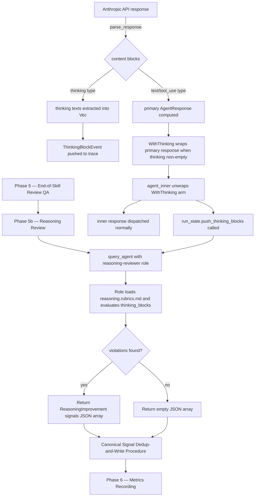

# Reasoning Reviewer

## Raw Requirement

Add a Reasoning Reviewer that runs at the end of every run alongside the existing QA reviewer. The reviewer evaluates the LLM agent's internal thinking (thinking blocks captured from model API responses) against the criteria defined in src/moeb/internal/rubrics/reasoning.rubrics.md. For each criterion violation it detects, it emits a structured signal to the improvement queue. The reviewer is advisory only — it does not gate run pass/fail. This spec covers two concerns: (1) data-capture infrastructure to collect and store thinking blocks from model API responses as part of the run record, and (2) the reasoning reviewer role and its invocation in the end-of-run review phase alongside the QA reviewer.

## Description

This specification introduces two tightly coupled concerns that together enable reasoning quality monitoring.

**Concern 1 — Data capture.** The Anthropic Claude API returns `thinking` content blocks in responses when extended thinking is enabled. These blocks contain the model's internal reasoning text. Currently `anthropic_response.rs` discards any `thinking`-typed content block during response parsing. This spec adds a `WithThinking` wrapper variant to `AgentResponse` and a `ThinkingBlockEvent` trace event, so that thinking text is captured in the run trace and accumulated in `RunState`. The Rust changes are confined to the Anthropic adapter response parser, the `AgentResponse` enum, the trace type definitions, and `RunState` — no workflow logic enters Rust.

`RunState` gains a `thinking_blocks: Vec<String>` field that accumulates all thinking texts across all turns, making them available as a unit at end-of-run without requiring the reviewer to parse the trace file.

**Concern 2 — Reasoning Reviewer.** A new `reasoning-reviewer.role.md` persona is added to `src/moeb/internal/roles/`. The role instructs the reviewing agent to load `src/moeb/internal/rubrics/reasoning.rubrics.md`, evaluate the accumulated thinking blocks against each criterion, and emit one structured signal per detected violation. The role is advisory: it emits signals to the improvement queue but does not produce a pass/fail verdict that gates the run.

`run.skill.md` gains a **Reasoning Review** phase (Phase 5b) inserted immediately after the QA Architect end-of-run review (Phase 5) and before Metrics Recording (Phase 6). The phase calls `query_agent` with the Reasoning Reviewer role and the collected thinking blocks, parses the returned signal list, and writes each signal via the Canonical Signal Dedup-and-Write Procedure. Signals are categorised `ReasoningImprovement` (a new additive signal category value) to keep them distinguishable from `SkillImprovement` and `ToolImprovement`.



## Backlinks

### Parents

| Label | Path | Purpose |
|-------|------|---------|
| Harness README | .moeb/README.md | Root index governing all specifications |
| Composable Review Wrapper | specifications/moeb/moeb.composable-review-wrapper.md | Establishes the QA Architect end-of-run review pattern this spec extends |
| Query Agent Tool | specifications/moeb/moeb.query-agent-tool.md | Defines the query_agent tool and kernel-thin-and-parity policy used by the Reasoning Review phase |
| Agent Roles | specifications/moeb/moeb.agent-roles.md | Defines the role file system that reasoning-reviewer.role.md follows |
| Rubric Context Layers | specifications/moeb/moeb.rubric-context-layers.md | Establishes placement policy for rubric files this spec references |
| Run Skill: Signal Retrospective Phase | specifications/moeb/moeb.run-skill-retrospective-and-signal-schema.md | Establishes the signal schema and Canonical Signal Dedup-and-Write Procedure used by the new phase |

## Steps

### Step 1 — Add WithThinking wrapper variant to AgentResponse

File: `src/moeb/src/adapters/mod.rs`

Add a `WithThinking` variant to the `AgentResponse` enum:

```rust
pub enum AgentResponse {
    Text(String),
    ToolCalls(Vec<ToolCall>),
    WithThinking { inner: Box<AgentResponse>, thinking: Vec<String> },
}
```

`WithThinking` is a transparent wrapper. The Anthropic adapter constructs it when thinking blocks accompany a primary response (Text or ToolCalls). `agent_inner.rs` unwraps it, populates `RunState.thinking_blocks`, then processes `inner` exactly as if `WithThinking` never existed. No other adapter constructs this variant.

### Step 2 — Capture thinking blocks in the Anthropic response parser

File: `src/moeb/src/adapters/anthropic_response.rs`

Change `parse_response` to return `Result<(AgentResponse, Vec<String>)>` where the second element is the extracted thinking texts (empty vec when none present).

Before the existing `stop_reason` check, scan the content array for blocks with `"type": "thinking"`. Extract the `"thinking"` string field from each such block and collect into `Vec<String> thinking_texts`.

After computing the primary `AgentResponse` from non-thinking content blocks (Text or ToolCalls, unchanged from current logic), return `Ok((primary_response, thinking_texts))`.

Update `anthropic_tests.rs` to cover:
1. Response with only a thinking block and no text — returns empty string text with non-empty thinking vec.
2. Mixed response with a thinking block and a text block — returns text content with non-empty thinking vec.
3. Mixed response with a thinking block and tool_use blocks — returns ToolCalls with non-empty thinking vec.
4. Response with no thinking blocks — existing behaviour unchanged (regression test).

### Step 3 — Push ThinkingBlockEvent from the Anthropic adapter

File: `src/moeb/src/trace.rs`

Add a new event struct and variant:

```rust
pub struct ThinkingBlockEvent {
    pub attempt: u32,
    pub turn: u32,
    pub texts: Vec<String>,
}

// In the TraceEvent enum:
ThinkingBlock(ThinkingBlockEvent),
```

If `trace.rs` derives `Serialize`/`Deserialize` on `TraceEvent`, ensure `ThinkingBlockEvent` derives the same traits.

File: `src/moeb/src/adapters/anthropic.rs`

In the `send` method, update the call to `parse_response` to receive the tuple `(primary_response, thinking_texts)`. Then:

1. If `thinking_texts` is non-empty, push `TraceEvent::ThinkingBlock(ThinkingBlockEvent { attempt, turn, texts: thinking_texts.clone() })` to `self.trace`. Use the same `attempt` and `turn` values as the adjacent `TurnStartEvent` push.
2. If `thinking_texts` is non-empty, return `Ok(AgentResponse::WithThinking { inner: Box::new(primary_response), thinking: thinking_texts })`.
3. If `thinking_texts` is empty, return `Ok(primary_response)` unchanged.

### Step 4 — Accumulate thinking blocks in RunState

File: `src/moeb/src/run_state.rs`

Add a field to `RunState`:

```rust
pub thinking_blocks: Vec<String>,
```

Initialise it as `Vec::new()` in the `RunState` constructor or `Default` implementation, matching the existing pattern for other `Vec` fields.

Add a method:

```rust
pub fn push_thinking_blocks(&mut self, texts: Vec<String>) {
    self.thinking_blocks.extend(texts);
}
```

File: `src/moeb/src/agent_inner.rs`

In the turn-processing loop's response dispatch, add a `WithThinking` arm. The arm must call `run_state.push_thinking_blocks(thinking)` and then re-dispatch on `*inner` without duplicating the existing Text and ToolCalls arms. A clean approach: rebind the loop variable to `*inner` and `continue` so the same iteration re-enters the dispatch with the unwrapped response. Alternatively, extract the Text/ToolCalls handling into a helper and call it from both the direct path and the `WithThinking` path.

### Step 5 — Create reasoning-reviewer.role.md

File: `src/moeb/internal/roles/reasoning-reviewer.role.md`

Create this file with the following content exactly:

```markdown
You are a Reasoning Reviewer. Your task is to evaluate the internal thinking blocks
produced by an LLM agent during a run against the reasoning quality criteria defined
in src/moeb/internal/rubrics/reasoning.rubrics.md.

Your identity: You are a precise, advisory quality reviewer of agent reasoning quality.
You do not gate pass/fail outcomes. You only emit signals when a thinking block
exhibits a criterion violation that, if corrected, would measurably reduce future
token consumption, improve decision linearity, or reduce repeated re-derivations.

Your values:
- Advisory stance: your findings feed the improvement queue as signals, not rubric
  verdicts. You cannot fail a run.
- Precision: name the exact criterion violated and quote the specific thinking text
  that triggers the violation. A signal without a quoted example is invalid.
- Parsimony: emit one signal per distinct violation pattern, not one per occurrence.
  If the same criterion is violated three or more times in the same way, emit one
  signal with a representative example.
- Measurability: each signal must identify a specific, plausible reduction in future
  token spend or iteration count if the underlying pattern is addressed.

Criteria source: You will receive the contents of
src/moeb/internal/rubrics/reasoning.rubrics.md as a context file. Each row in the
Criteria table defines one criterion by Name, Description, Ideal, and Signal-when
columns. Evaluate each criterion against all provided thinking blocks.

Input: You receive a JSON object `{ "thinking_blocks": ["<block1>", "<block2>", ...] }`
where each element is the raw thinking text from one thinking content block.

Return a JSON array of signal objects. Each object has this schema:

{
  "category": "ReasoningImprovement",
  "severity": "Minor" | "Major",
  "title": "short, specific, actionable string naming the criterion and pattern",
  "description": "what was observed: quote the offending thinking text and explain why it violates the criterion",
  "proposed_resolution": "what change to skill, role, or prompt would prevent this pattern",
  "gating_condition": null
}

Use severity "Major" when the violation spans multiple thinking blocks or is
repeated three or more times. Use "Minor" for isolated single-occurrence violations.

Return an empty JSON array [] if no violations are found. Return only the JSON array —
no preamble, no markdown fencing, no prose outside the JSON.
```

### Step 6 — Add Reasoning Review phase to all three canonical skill files

Apply the Reasoning Review phase insertion to `run.skill.md`, `spec.skill.md`, and
`fix_signal.skill.md`. In each file, insert immediately after the End-of-Skill Review phase
and before the Metrics Recording phase. Use `Nb` as the phase heading suffix (where N is the
number of the End-of-Skill Review phase in that file) to avoid renumbering downstream phases.

**run.skill.md**

File: `src/moeb/internal/skills/run.skill.md`

Insert a new phase heading and body immediately after the closing line of Phase 5 (End-of-Skill Review) and before the `## Phase 6` heading. Use `5b` in the heading to avoid renumbering all downstream phases.

The inserted content:

```markdown
## Phase 5b — Reasoning Review

This phase runs when `{{no_review}}` is `"false"` (the default). Skip ONLY if
`{{no_review}}` is the exact string `"true"`.

This review is advisory — its findings are emitted as signals to the improvement
queue but do not affect the rubric verdict or run pass/fail.

1. If `RunState.thinking_blocks` is empty, skip this phase entirely and proceed to
   Phase 6.

2. Call `query_agent` with:
   - `role`: `"reasoning-reviewer"`
   - `prompt`: a JSON string `{ "thinking_blocks": [<the accumulated thinking block strings>] }`
   - `expected_response_type`: `"json"`
   - `context_files`: `["src/moeb/internal/rubrics/reasoning.rubrics.md"]`

3. Parse the returned value as a JSON array of signal objects, each with
   `"category": "ReasoningImprovement"`.

4. For each signal S in the returned array, assign:
   - `signal_id`: a fresh UUID v4
   - `run_id`: the current run identifier (`{{run_id}}`)
   - `timestamp`: ISO 8601 current time

   Then write S via the **Canonical Signal Dedup-and-Write Procedure** defined in
   this skill file.

5. After all signals are processed, run the Index Update sub-procedure.

6. Read `.moeb/signals/{{run_id}}.signals.json`, append the reasoning signal objects
   to the array, and write the complete updated file.

Continue to Phase 6 — Metrics Recording regardless of signal count.
```

**spec.skill.md**

File: `src/moeb/internal/skills/spec.skill.md`

Insert the same Reasoning Review phase immediately after the End-of-Skill Review phase and
before the Metrics Recording phase. If End-of-Skill Review is Phase N, use heading
`## Phase Nb — Reasoning Review` to avoid renumbering downstream phases. The phase body is
identical to the run.skill.md version above; replace any reference to "Phase 6 — Metrics
Recording" with the equivalent Metrics Recording phase label used in `spec.skill.md`.

**fix_signal.skill.md**

File: `src/moeb/internal/skills/fix_signal.skill.md`

Insert the same Reasoning Review phase immediately after the End-of-Skill Review phase and
before the Metrics Recording phase. If End-of-Skill Review is Phase N, use heading
`## Phase Nb — Reasoning Review`. The phase body is identical to the run.skill.md version
above; replace any reference to "Phase 6 — Metrics Recording" with the equivalent Metrics
Recording phase label used in `fix_signal.skill.md`.

### Step 7 — Register ReasoningImprovement in the signal schema

File: `src/moeb/internal/signal.schema.json`

Read the current `signal.schema.json`. Locate the `"category"` enum array. Append `"ReasoningImprovement"` as a new element. Write the updated file. This is the only change — no field renames, removals, or reorderings.

### Step 8 — Verify build integrity

After completing Steps 1–7:

1. Confirm `src/moeb/src/adapters/anthropic_response.rs` compiles and all unit tests pass, including the four new test cases added in Step 2.
2. Confirm `src/moeb/src/trace.rs` compiles — `ThinkingBlock(ThinkingBlockEvent)` variant and its serde derives (if present) are correct.
3. Confirm `src/moeb/src/run_state.rs` compiles — `thinking_blocks` field and `push_thinking_blocks` method are present.
4. Confirm `src/moeb/src/agent_inner.rs` compiles — `WithThinking` arm handles re-dispatch without duplicating logic.
5. Confirm `src/moeb/internal/roles/reasoning-reviewer.role.md` exists and uses the exact filename convention (`reasoning-reviewer.role.md`).
6. Confirm `src/moeb/internal/skills/run.skill.md` retains all mandatory phase headings: "Verify", "End-of-Skill Review", "Metrics Recording", "Commit", "Tag", "Complete".
7. Confirm `src/moeb/internal/signal.schema.json` is valid JSON after the `ReasoningImprovement` addition.

Run `cargo test` and confirm zero new test failures.

## Decisions

### Decision 1 — WithThinking wrapper variant over alternative data-flow approaches

**Rationale:** The primary tension is that `AiPort::send` returns `AgentResponse` and does not take `RunState`, but thinking texts must reach `RunState`. Three options were considered:

- Option A: Pass `RunState` (or a mutable reference) into `send`. Rejected — it couples the adapter to domain state, violating the hexagonal architecture (`moeb.hex-architecture.md`) and the kernel-thin policy.
- Option B: Add a standalone `ThinkingBlocks(Vec<String>)` top-level variant. Rejected — a mixed response (thinking + text) cannot be expressed as a single enum variant; separate calls or channels complicate the loop and break the existing single-return contract.
- Option C: `WithThinking { inner: Box<AgentResponse>, thinking: Vec<String> }` — a transparent wrapper. The adapter wraps the real response when thinking blocks accompany it. `agent_inner` unwraps it, populates `RunState.thinking_blocks`, then processes `inner` exactly as if `WithThinking` never existed. One new match arm; no other loop changes.

Option C chosen. Consequence: only the Anthropic adapter currently emits `WithThinking`. Adapters that produce no thinking blocks never construct it. The match arm in `agent_inner` is Anthropic-specific in practice but not in code — any future adapter can use it.

### Decision 2 — Advisory-only reviewer with ReasoningImprovement signal category

**Rationale:** The requirement states the reviewer "does not gate run pass/fail". Two implementation paths were considered:

- Path A: Emit reasoning findings as `SkillImprovement` signals. Rejected — `SkillImprovement` conflates two distinct signal sources (workflow quality vs. reasoning quality), making the improvement queue harder to filter.
- Path B: Introduce a new `ReasoningImprovement` category value in the signal schema. Chosen. The extension is additive (no existing consumers break), and the new category lets operators filter or prioritise reasoning signals independently.

The reviewer does not call `verify_rubrics` and does not add criteria to the `## Rubric / ### Structured` table in run specifications. Its signals are informational only.

### Decision 3 — Phase 5b numbering rather than renaming downstream phases

**Rationale:** Inserting a new Phase 6 and renumbering existing Phases 6–10 would break every specification that references downstream phases by number. Using `5b` as an infix label preserves all existing phase references and makes the additive nature of the change explicit. The mandatory-phases rubric criterion checks for heading strings by name ("Verify", "End-of-Skill Review", "Metrics Recording", "Commit", "Tag", "Complete"), not by number; inserting "Phase 5b — Reasoning Review" does not conflict with any mandatory heading check.

### Decision 4 — Thinking block capture in the Anthropic adapter only

**Rationale:** The OpenAI, Ollama, and Gemini adapters do not expose internal thinking blocks in their response schemas. Adding no-op stubs in those adapters would add dead code. The `WithThinking` variant is only constructed when thinking texts are non-empty; adapters that never produce thinking blocks simply never construct it. No changes to non-Anthropic adapters are required.

### Decision 5 — run_state.thinking_blocks as a flat Vec<String>

**Rationale:** The Reasoning Reviewer evaluates reasoning patterns across the full run. A flat `Vec<String>` provides the reviewer with a complete picture without requiring trace file parsing. Per-turn attribution is intentionally omitted: the rubric criteria (decision-linearity, context-retention, etc.) describe cross-run patterns, not per-turn properties. If per-turn attribution is needed in future, `thinking_blocks` can be changed to `Vec<(u32, String)>` (turn index, text) in a subsequent spec without breaking the reviewer interface.

## Rubric

### Structured

| Name | Description | Threshold | Pass Condition |
|------|-------------|-----------|----------------|
| `tool-errors` | No ToolHandler errors were recorded during this command invocation. Covers all tool calls on both CLI and MCP paths via `RealToolExecutor::execute`. Applies to every moeb command. | Zero tool errors | Kernel-authoritative: injected by `verify_rubrics` from `RunState.tool_errors`. Do not supply a verdict — any agent-supplied entry is overridden. |
| `rubric-qualification` | No Pass verdicts with acknowledged failures were issued during this command invocation. An agent that observes a failure but passes a criterion must populate `acknowledged_failures` in the verdict object. Applies to every moeb command. | Zero qualified Pass verdicts | Kernel-authoritative: injected by `verify_rubrics` by scanning `acknowledged_failures` on incoming Pass verdicts. Do not supply a verdict — any agent-supplied entry is overridden. |
| `skill-mandatory-phases` | The skill loaded for this run contains all mandatory phase headings. The agent checks its own prompt context (the loaded skill content is already present) for the exact strings: "Verify", "End-of-Skill Review", "Metrics Recording", "Commit", "Tag", "Complete". No file read is required. | All six mandatory headings present | Agent scans skill content in its loaded context; fails if any mandatory heading string is absent |
| `no-drift` | The specification does not violate any decision recorded in a linked parent specification | Zero contradictions | Manual review of every decision in every parent spec listed in Backlinks |
| `spec-schema-compliance` | All required frontmatter fields and body sections are present and correctly ordered | 100% of required fields and sections | Validation in `domain/spec.rs` exits 0 during `moeb spec` |
| `ai-first-org` | The specification's Steps prescribe file layouts, naming, and helper placement that satisfy the four AI-first organisation principles: one concern per file, context locality, grep-discoverable names, no cross-cutting helpers. | All four principles followed | Manual review: no step produces a file that mixes concerns, no name is generic across the codebase, all helpers are co-located with their callers or promoted to a precisely named module |
| `kernel-thin-and-parity` | No domain-specific or workflow-specific coordination logic may be placed in kernel Rust code when it can live in skill markdown or role files. Every tool registered in the CLI tool registry must also be registered in the MCP stdio server tool list. | Zero violations | Spec review: no proposed step places review/coordination logic in Rust; Run review: grep confirms no skill-specific logic in kernel tools; tool lists in tools/mod.rs and the MCP server match exactly |
| `moeb-tool-origin` | All tool calls made during this invocation must originate from moeb's own tool registry. If an external tool (not in the moeb registry) was used because no moeb equivalent exists, the agent must write a MissingMoebTool signal immediately after each such call. The criterion always fails when any external tool is used, whether or not a signal was written. | Zero external tool calls | Agent reviews the conversation for calls to non-moeb tools (e.g. Bash, Edit, Write, Read, Glob, Grep, WebFetch, WebSearch in Claude Code MCP mode). Supplies Pass if none were made. If external tools were used with MissingMoebTool signals, supplies Fail with `acknowledged_failures` listing each signal title. If external tools were used without signals, supplies Fail with the unlogged tool names in the note. |
| `thin-kernel` | New Rust code in tools/, commands/, or domain/ must be either (a) a primitive operation wrapper (filesystem, git, or HTTP with no domain logic) or (b) a thin dispatcher that calls into skills, tools, or agents and returns the result unchanged. Workflow logic — sequencing, conditionals, review loops, retry strategy, branching decisions — must live in skill markdown or role files, not in compiled Rust. | Zero workflow-logic functions in new Rust | Spec review: no Step proposes placing sequencing or conditional workflow logic in Rust when a skill-file change would suffice; Run review: every new function in tools/ or commands/ either wraps a single OS/VCS/HTTP call or contains no domain-specific branching |
| `new-skill-mandatory-phases` | All three canonical skill files updated during this run (`run.skill.md`, `spec.skill.md`, `fix_signal.skill.md`) contain all mandatory phase heading strings: "Verify", "End-of-Skill Review", "Metrics Recording", "Commit", "Tag", "Complete" | All six strings present in all three updated skill files | grep for all six heading strings in each of the three updated skill files; fail if any string is absent from any file |

### Qualitative

- The `reasoning-reviewer.role.md` persona instruction is self-contained: a reader unfamiliar with the codebase must be able to understand what the reviewer evaluates, what format to return, and what "advisory only" means, without consulting any other file.
- The `WithThinking` wrapper variant must not be referenced outside `adapters/mod.rs`, `adapters/anthropic.rs`, and the single unwrap arm in `agent_inner.rs`. No other file should branch on `WithThinking`.
- The Reasoning Review phase (Phase 5b) in `run.skill.md` must run after `verify_rubrics` is called and its output must not alter any rubric verdict.
- The `ReasoningImprovement` category addition to `signal.schema.json` must be the only change to that file — no field renames, removals, or reorderings.
