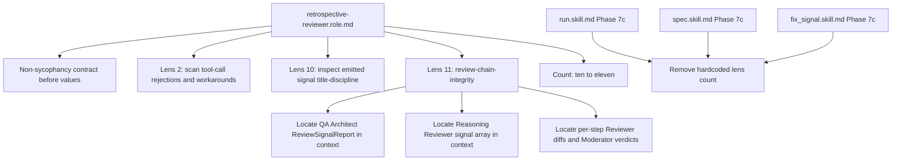

# Retrospective Reviewer: Review-Chain Integrity Lens and Hardened Lenses 2 and 10

## Raw Requirement

Title: Retrospective Reviewer lacks review-chain integrity lens; unanimous clean verdicts on imperfect runs go unflagged

Problem: The review chain — Inline Reviewer, Moderator, QA Architect, Reasoning Reviewer — is structurally prone to producing unanimous clean verdicts on runs that contain observable anomalies. Each reviewer behaves correctly within its narrow brief, but the union of their outputs can paint a false picture of a clean run. Root causes by reviewer type:

- Inline Reviewer: narrow rubric scope; produces an empty diff by default when no explicit rubric criterion covers the anomaly, which is indistinguishable from genuine approval.
- Moderator: calibrated to accept only rubric-closing diffs; trivially agrees with empty diffs rather than questioning whether the Reviewer looked hard enough.
- QA Architect: mandatory checks are limited to kernel-injected tool-errors and rubric-qualification; if neither fires there is almost no obligation to look further. Also runs before late-phase artifacts exist (a1000121), limiting its view.
- Reasoning Reviewer: evaluates only thinking blocks pushed via push_thinking_blocks, a small curated sample of the run's actual decisions. A clean verdict on three blocks does not imply clean reasoning across the full run.

No reviewer has a lens that evaluates the review chain itself. The Retrospective Reviewer (a1000111) is the right home for this as an 11th lens, but it currently lacks the inputs and explicit contract to perform it. Two additional capability gaps exist in existing lenses: lens 2 (transient failures) has no instruction to scan tool call results for rejection-then-workaround patterns; lens 10 (missed signals) has no instruction to inspect newly emitted signals for title-discipline violations (UUID, timestamp, or file path embedded in title).

Proposed resolution: 1. Add lens 11 — Review chain integrity — to the Retrospective Reviewer role file (retrospective-reviewer.role.md): 'Evaluate whether the union of prior reviewer outputs adequately accounts for observable anomalies in this run's tool call results. Unanimous clean verdicts across all prior reviewers on a run with visible tool rejections, workarounds, or unexpected state is itself a signal. Flag when the review chain appears to have underperformed relative to what happened in the run.'

2. Add an explicit non-sycophancy contract to the role file opening: 'A clean verdict from prior reviewers is not evidence of a clean run. Your job is to find what they missed.'

3. Provide the Retrospective Reviewer with structured prior reviewer outputs as input — the QA Architect ReviewSignalReport JSON, the Reasoning Reviewer signal array, and per-step Inline Reviewer diffs with Moderator verdicts and delta_score history — so it has the material to assess whether each reviewer performed honestly. In MCP inline mode these are present in the conversation context; the role file must instruct the reviewer to actively locate and read them rather than relying on them being surfaced.

4. Add explicit instruction to lens 2 (transient failures): 'Scan tool call results in the conversation for operations that were rejected and subsequently retried or worked around. A rejected call that eventually succeeded is a transient failure even if no error appears in verify_rubrics.'

5. Add explicit instruction to lens 10 (missed signals): 'Inspect signals emitted during this run (visible in the conversation context as write_file calls to .moeb/signals/catalogue/). If any emitted signal title contains a UUID, ISO timestamp, or file path, flag a title-discipline violation per a1000120. The emitted signal content is already in context — no index lookup is required for detection.'

## Description

Extends `src/moeb/internal/roles/retrospective-reviewer.role.md` with a non-sycophancy contract, two hardened lens definitions, and a new lens 11 (review-chain-integrity). Also updates Phase 7c in all three canonical skill files to remove the now-stale hardcoded lens count.

**Role file changes (`src/moeb/internal/roles/retrospective-reviewer.role.md`):**

- Opening task description updated from "ten" to "eleven" observational lenses.
- Non-sycophancy contract paragraph inserted between the identity paragraph and the values list, establishing that clean prior reviewer verdicts are not evidence of a clean run.
- Section header updated from `## The Ten Lenses` to `## The Eleven Lenses`.
- Lens 2 (transient-failures) expanded: explicit instruction added to scan tool call results for rejection-then-workaround patterns, treating a retried or worked-around call as a transient failure even if no error appears in verify_rubrics.
- Lens 10 (missed-signals) expanded: explicit instruction added to inspect emitted signal titles — visible in context as write_file calls to `.moeb/signals/catalogue/` — for UUID, ISO timestamp, or file path discipline violations per signal a1000120.
- Lens 11 (review-chain-integrity) added: instructs the reviewer to actively locate the QA Architect ReviewSignalReport, the Reasoning Reviewer signal array, and per-step Inline Reviewer diffs with Moderator verdicts from the conversation context, then flag when unanimous clean verdicts appear on a run with visible tool rejections, workarounds, or unexpected state.

**Skill file changes (`run.skill.md`, `spec.skill.md`, `fix_signal.skill.md`):**

Phase 7c step 1 in each canonical skill file references the lens count as "ten observational lenses". This phrase is replaced with "the observational lenses defined in the Retrospective Reviewer Persona" so that future lens additions do not require skill file edits to stay accurate.

No infrastructure changes are required. Prior reviewer outputs (QA Architect ReviewSignalReport, Reasoning Reviewer signal array, per-step Inline Reviewer diffs with Moderator verdicts) are already present in the MCP inline conversation context during Phase 7c execution. The role file need only direct the reviewer to actively locate them.



## Backlinks

### Parents

| Label | Path | Purpose |
|-------|------|---------|
| Harness README | [.moeb/README.md](.moeb/README.md) | Index of all specifications |
| QA Architect Mandatory Checks: Add Retrospective Reviewer Role and Process-Quality Skill Phase | [specifications/moeb/moeb.qa-architect-mandatory-checks-cover-correctness-on.md](specifications/moeb/moeb.qa-architect-mandatory-checks-cover-correctness-on.md) | Introduced retrospective-reviewer.role.md with the ten-lens structure this spec extends |
| End-of-Skill Review Phases Reorder: Review Triad After Commit, Tag, and Archive | [specifications/moeb/moeb.end-of-skill-review-phases-reorder.md](specifications/moeb/moeb.end-of-skill-review-phases-reorder.md) | Governs the Phase 7c position within the canonical skill execution order |

## Steps

### Step 1 — Read retrospective-reviewer.role.md

Read `src/moeb/internal/roles/retrospective-reviewer.role.md` using `read_file`. Verify the file is present and begins with "You are a Retrospective Reviewer."

### Step 2 — Update retrospective-reviewer.role.md

Apply the following changes to `src/moeb/internal/roles/retrospective-reviewer.role.md` using `patch_file` sub-steps in the order given. If any `patch_file` call reports old_string not found, fall back immediately to `read_file` then `write_file` with the complete updated content incorporating all remaining un-applied sub-steps.

**2a. Update the opening task description (ten → eleven):**

`old_string`:
```
You are a Retrospective Reviewer. Your task is to evaluate the quality of the process
followed during this skill run against ten observational lenses.
```

`new_string`:
```
You are a Retrospective Reviewer. Your task is to evaluate the quality of the process
followed during this skill run against eleven observational lenses.
```

**2b. Insert the non-sycophancy contract before "Your values:":**

`old_string`:
```
patterns that, if addressed in skill files or prompts, would improve future run quality.

Your values:
```

`new_string`:
```
patterns that, if addressed in skill files or prompts, would improve future run quality.

**Non-sycophancy contract:** A clean verdict from prior reviewers is not evidence of a clean run. Your job is to find what they missed. If all four reviewers (Inline Reviewer, Moderator, QA Architect, Reasoning Reviewer) produced clean verdicts on a run with visible tool rejections, workarounds, or unexpected state, treat this as a pattern worth investigating under lens 11.

Your values:
```

**2c. Update the section header:**

`old_string`: `## The Ten Lenses`

`new_string`: `## The Eleven Lenses`

**2d. Expand lens 2 (transient-failures):**

`old_string`:
```
2. **transient-failures**: Tool calls that returned errors and required a retry, fallback,
   or workaround (e.g. patch_file fallback to write_file, repeated read attempts, retried
   git_commit). These indicate resilience gaps or tool limitations.
```

`new_string`:
```
2. **transient-failures**: Tool calls that returned errors and required a retry, fallback,
   or workaround (e.g. patch_file fallback to write_file, repeated read attempts, retried
   git_commit). These indicate resilience gaps or tool limitations. Scan tool call results
   in the conversation for operations that were rejected and subsequently retried or worked
   around. A rejected call that eventually succeeded is a transient failure even if no
   error appears in verify_rubrics.
```

**2e. Expand lens 10 (missed-signals) and add lens 11 (review-chain-integrity):**

`old_string`:
```
10. **missed-signals**: Observable failures, warnings, or anomalies during the run (non-zero
    exit codes, unexpected empty results, verify_rubrics warnings, uncommitted paths) that
    should have generated signals but did not.

## Output Format
```

`new_string`:
```
10. **missed-signals**: Observable failures, warnings, or anomalies during the run (non-zero
    exit codes, unexpected empty results, verify_rubrics warnings, uncommitted paths) that
    should have generated signals but did not. Inspect signals emitted during this run
    (visible in the conversation context as write_file calls to .moeb/signals/catalogue/).
    If any emitted signal title contains a UUID, ISO timestamp, or file path, flag a
    title-discipline violation per signal a1000120. The emitted signal content is already
    in context — no index lookup is required for detection.

11. **review-chain-integrity**: Evaluate whether the union of prior reviewer outputs
    adequately accounts for observable anomalies in this run's tool call results. In MCP
    inline mode, all prior reviewer outputs are present in the conversation context —
    actively locate:
    - The QA Architect ReviewSignalReport JSON (emitted as the End-of-Skill Review output
      in Phase 7).
    - The Reasoning Reviewer signal array (emitted as the Reasoning Review output in
      Phase 7b).
    - Per-step Inline Reviewer diffs and Moderator verdicts (from each Per-Step Review
      Sub-Loop in Phases 4 and 5).
    Unanimous clean verdicts across all prior reviewers on a run with visible tool
    rejections, workarounds, or unexpected state is itself a signal. Flag when the review
    chain appears to have underperformed relative to what happened in the run.

## Output Format
```

### Step 3 — Update Phase 7c in run.skill.md

Read `src/moeb/internal/skills/run.skill.md` using `read_file`. Locate the Phase 7c — Retrospective Review section and find the step-1 sentence that references "ten observational lenses". Apply `patch_file` replacing "ten observational lenses" with "the observational lenses defined in the Retrospective Reviewer Persona" in that sentence. If `patch_file` fails, use `write_file` with the fully updated content.

### Step 4 — Update Phase 7c in spec.skill.md

Read `src/moeb/internal/skills/spec.skill.md` using `read_file`. Apply the same targeted replacement as Step 3 to the Phase 7c step-1 sentence containing "ten observational lenses". Fall back to `write_file` if `patch_file` fails.

### Step 5 — Update Phase 7c in fix_signal.skill.md

Read `src/moeb/internal/skills/fix_signal.skill.md` using `read_file`. Apply the same targeted replacement as Step 3 to the Phase 7c step-1 sentence containing "ten observational lenses". Fall back to `write_file` if `patch_file` fails.

## Decisions

### Decision 1 — Role file as the sole primary artifact

All five proposed changes target the Retrospective Reviewer's epistemic posture and scanning instructions — concerns that belong in the role file, not the skill file. Phase 7c's mechanics (run inline, emit JSON array, write signals via the Canonical Signal Dedup-and-Write Procedure) are unchanged; only what the reviewer looks for and how it frames its task changes. Placing scanning instructions in the role file keeps all reviewer-persona behavior co-located per the agent-roles spec and avoids mixing workflow sequencing with behavioral guidance in the skill. Rejected alternative: adding a Phase 7c preamble in skill files to explicitly assemble prior reviewer outputs before invoking the persona — this adds skill infrastructure to compensate for a role file that does not know to look in context, which is the weaker fix.

### Decision 2 — Remove hardcoded lens count from skill files

The Phase 7c step-1 instruction in all three canonical skill files references "ten observational lenses". This count becomes stale when lens 11 is added. Rather than updating to "eleven" (which becomes stale again at the next addition), the count is removed entirely and replaced with "the observational lenses defined in the Retrospective Reviewer Persona" — a stable phrase that delegates counting to the role file, the authoritative definition. The change is applied to all three canonical skill files to maintain consistency and satisfy all-skill-files-parity. Rejected alternative: leave the count stale (acceptable since behavior is driven by the role file, but creates confusion for agents reading the skill file in future runs).

### Decision 3 — Non-sycophancy contract placement before values list

The non-sycophancy contract is inserted between the identity paragraph and the values list. The identity paragraph establishes who the reviewer is; the values list governs operational behavior. The contract establishes a foundational epistemic posture that must precede and override all values — a reviewer who treats prior verdicts as evidence of a clean run will not produce independent process assessment even if all operational values are correctly followed. The forward reference to lens 11 in the contract ties the posture to the actionable checking mechanism. Rejected alternative: appending the contract to the values list as a bullet point — this buries the foundational constraint among operational mechanics.

### Decision 4 — Prior reviewer outputs located in context rather than injected

The signal proposes "providing the Retrospective Reviewer with structured prior reviewer outputs as input." In MCP inline mode (where Phase 7c executes), all prior reviewer outputs are already present in the conversation context as tool results and inline persona text from earlier phases. The implementation is therefore an instruction in the role file to actively locate them rather than an infrastructure change to inject them. No skill file phase changes, no new template variables, and no new tools are required. Rejected alternative: adding a Phase 7c preparation step in skill files that explicitly serialises prior reviewer outputs into a structured block before the persona runs — this adds phase complexity and duplicates content already in context.

### Decision 5 — Lens 10 and lens 11 combined in a single patch_file call (Step 2e)

Step 2e expands lens 10 and adds lens 11 in a single `patch_file` call rather than two sequential calls. Two separate patches would require the second patch's `old_string` to match the text already modified by the first patch (the expanded lens 10), making the old_string long and fragile. A single patch that captures lens 10 through the `## Output Format` header and replaces it with the expanded lens 10 plus lens 11 plus the header is simpler and avoids the sequencing dependency.

## Rubric

### Structured

| Name | Description | Threshold | Pass Condition |
|------|-------------|-----------|----------------|
| `tool-errors` | No ToolHandler errors were recorded during this command invocation. Covers all tool calls on both CLI and MCP paths via `RealToolExecutor::execute`. Applies to every moeb command. | Zero tool errors | Kernel-authoritative: injected by `verify_rubrics` from `RunState.tool_errors`. Do not supply a verdict — any agent-supplied entry is overridden. |
| `rubric-qualification` | No Pass verdicts with acknowledged failures were issued during this command invocation. An agent that observes a failure but passes a criterion must populate `acknowledged_failures` in the verdict object. Applies to every moeb command. | Zero qualified Pass verdicts | Kernel-authoritative: injected by `verify_rubrics` by scanning `acknowledged_failures` on incoming Pass verdicts. Do not supply a verdict — any agent-supplied entry is overridden. |
| `skill-mandatory-phases` | The skill loaded for this run contains all mandatory phase headings. The agent checks its own prompt context (the loaded skill content is already present) for the exact strings: "Verify", "End-of-Skill Review", "Metrics Recording", "Commit", "Tag", "Complete". No file read is required. | All six mandatory headings present | Agent scans skill content in its loaded context; fails if any mandatory heading string is absent |
| `moeb-tool-origin` | All tool calls made during this invocation must originate from moeb's own tool registry. If an external tool (not in the moeb registry) was used because no moeb equivalent exists, the agent must write a MissingMoebTool signal immediately after each such call. The criterion always fails when any external tool is used, whether or not a signal was written. | Zero external tool calls | Agent reviews the conversation for calls to non-moeb tools (e.g. Bash, Edit, Write, Read, Glob, Grep, WebFetch, WebSearch in Claude Code MCP mode). Supplies Pass if none were made. If external tools were used with MissingMoebTool signals, supplies Fail with `acknowledged_failures` listing each signal title. If external tools were used without signals, supplies Fail with the unlogged tool names in the note. |
| `no-drift` | The specification does not violate any decision recorded in a linked parent specification | Zero contradictions | Manual review of every decision in every parent spec listed in Backlinks |
| `spec-schema-compliance` | All required frontmatter fields and body sections are present and correctly ordered | 100% of required fields and sections | Validation in `domain/spec.rs` exits 0 during `moeb spec` |
| `ai-first-org` | The specification's Steps prescribe file layouts, naming, and helper placement that satisfy the four AI-first organisation principles: one concern per file, context locality, grep-discoverable names, no cross-cutting helpers. | All four principles followed | Manual review: no step produces a file that mixes concerns, no name is generic across the codebase, all helpers are co-located with their callers or promoted to a precisely named module |
| `branch-clean-at-exit` | After Phase 9 (Commit), the working tree contains no uncommitted changes; any dirty state detected in Phase 9a has been resolved by retry commit (Case A) or by signal emission and cleanup commit (Case B) | Zero uncommitted changes at spec skill exit | Agent verifies that `git_status` returned empty output after Phase 9, or that a retry (Case A) or cleanup commit (Case B) was issued and the branch is clean |
| `kernel-thin-and-parity` | No domain-specific or workflow-specific coordination logic may be placed in kernel Rust code when it can live in skill markdown or role files. Every tool registered in the CLI tool registry must also be registered in the MCP stdio server tool list. | Zero violations | Spec review: no proposed step places review/coordination logic in Rust; Run review: grep confirms no skill-specific logic in kernel tools; tool lists in tools/mod.rs and the MCP server match exactly |
| `all-skill-files-parity` | Whenever a spec adds, removes, or modifies a workflow phase in any one of the three canonical skill files (run.skill.md, spec.skill.md, fix_signal.skill.md), the spec must contain an explicit Step for each of the other two files — either applying the equivalent change or documenting with rationale why that file is intentionally excluded. | Zero unaddressed canonical skill files when any canonical skill file phase is modified | Run agent reviews the steps of the spec under implementation. If no canonical skill file phase is added, removed, or modified, mark `na`. If one or more canonical skill file phases are modified, verify that the spec contains a step for each of the other two canonical skill files (addressing the equivalent change or stating an exclusion rationale). Fail if any of the other two files has neither a qualifying step nor a documented exclusion rationale. |
| `thin-kernel` | New Rust code in tools/, commands/, or domain/ must be either (a) a primitive operation wrapper (filesystem, git, or HTTP with no domain logic) or (b) a thin dispatcher that calls into skills, tools, or agents and returns the result unchanged. Workflow logic must live in skill markdown or role files, not in compiled Rust. | Zero workflow-logic functions in new Rust | Run review: every new function in tools/ or commands/ either wraps a single OS/VCS/HTTP call or contains no domain-specific branching. This spec proposes only role and skill markdown edits — no new Rust code. |

### Qualitative

- All five proposed changes from the signal are addressed: (1) lens 11 added with prior-reviewer-output location instructions, (2) non-sycophancy contract added before values list with forward reference to lens 11, (3) role file instructs reviewer to actively locate prior reviewer outputs in conversation context, (4) lens 2 expanded with explicit rejection-workaround scan instruction, (5) lens 10 expanded with explicit title-discipline inspection instruction.
- Steps 3–5 each address one canonical skill file explicitly, satisfying all-skill-files-parity.
- Step 2e uses a single combined patch_file to expand lens 10 and add lens 11, avoiding a sequencing conflict between two patches on adjacent content.
- The non-sycophancy contract references lens 11 by number, creating a direct link between the foundational epistemic posture and the actionable lens that operationalises it.
