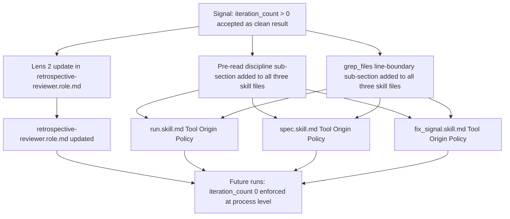

# Retrospective Reviewer: iteration_count > 0 as Improvement Signal, Pre-Read Discipline, and grep_files Line-Boundary Guidance

## Raw Requirement

Title: Retrospective Reviewer treats iteration_count > 0 as acceptable rather than as an improvement signal

Problem: The baseline for any step metric is iteration_count = 0: the agent found and applied the change correctly on the first attempt. An iteration_count > 0 means the agent had to retry or work around a failure before producing a good result — something in the process caused unnecessary rework. Accepting iteration_count = 1 with acceptance_rate = 1.0 as a clean pass conflates 'eventually correct' with 'process is sound'.

In the run 0606670c-e9be-4c08-b3f2-9549fc08c6c8 (retrospective-reviewer-review-chain-integrity-lens), two steps recorded iteration_count = 1:
- patch-run-skill (iteration_count=1): patch_file was rejected because run.skill.md had not been read via read_file in the current session. The agent had to call read_file first and retry. Root cause: the spec steps did not include an explicit pre-read of target files before Phase 3 patching.
- patch-fix-signal-skill (iteration_count=1): grep_files found no match for the target phrase because it spans two lines in the file. The agent fell back to read_file_range to locate the text. Root cause: grep is line-based and cannot match phrases that cross line boundaries; the agent did not verify via read_file_range before attempting the patch.

The Retrospective Reviewer's lens 2 (transient-failures) correctly identifies these as transient failures but stops short of flagging them as improvement signals requiring follow-up. The review chain (QA Architect, Reasoning Reviewer, Retrospective Reviewer) all described these as 'correctly handled' without proposing concrete improvements.

Proposed resolution: 1. Update lens 2 (transient-failures) in retrospective-reviewer.role.md: add explicit instruction that iteration_count > 0 in step metrics is an improvement signal, not a clean result. For each step with iteration_count > 0, the reviewer must identify the root cause and propose a specific improvement. Zero iterations is the expected baseline.
2. For the two root causes found in this run: (a) Add a pre-read step to spec/run flows that touch multiple files via patch_file — read all target files at the start of the implement phase so scope enforcement is satisfied before any patch is attempted. (b) Add a note to run.skill.md or spec.skill.md Phase 3 guidance that grep_files is line-based; if a target phrase may span lines, use read_file_range to confirm the exact text before calling patch_file.

## Description

This specification addresses three related process improvements surfaced by the signal above.

**Lens 2 hardening.** `retrospective-reviewer.role.md` lens 2 (`transient-failures`) is extended with an explicit `iteration_count` baseline clause: `iteration_count = 0` is the expected outcome for every step metric. Any step with `iteration_count > 0` is a process failure. The updated lens requires the Retrospective Reviewer to identify the root cause and emit a `SkillImprovement` or `ToolImprovement` signal for each such step, regardless of whether the step ultimately succeeded.

**Pre-read discipline.** Before calling `patch_file` on any file, the agent must have read that file via `read_file` or `read_file_range` in the current session. When this precondition is unmet, the file tool layer rejects the patch with a scope-enforcement error, forcing an unplanned retry. The Tool Origin Policy section of all three canonical skill files (`run.skill.md`, `spec.skill.md`, `fix_signal.skill.md`) is extended with a dedicated **Pre-Read Discipline** sub-section that mandates this read-before-patch requirement.

**grep_files line-boundary limitation.** `grep_files` operates on single lines and cannot match phrases that span two or more lines. When such a phrase is used as `old_string` in `patch_file`, the grep returns no match and the agent must fall back to `read_file_range`. The Tool Origin Policy section of all three canonical skill files is extended with a **grep_files Line-Boundary Limitation** sub-section that directs agents to use `read_file_range` when a target phrase may span lines, before attempting a `patch_file` call.

The two skill-level sub-sections are textually identical across all three canonical skill files to prevent future divergence.

## Diagram



## Backlinks

### Parents

| Label | Path | Purpose |
|-------|------|---------|
| Harness README | [.moeb/README.md](.moeb/README.md) | Parent specification index governing all moeb specifications |
| Retrospective Reviewer Introduction | [specifications/moeb/moeb.qa-architect-mandatory-checks-cover-correctness-on.md](specifications/moeb/moeb.qa-architect-mandatory-checks-cover-correctness-on.md) | Introduced retrospective-reviewer.role.md and Phase 7c Retrospective Review across all three canonical skill files |
| Retrospective Reviewer: Review-Chain Integrity Lens | [specifications/moeb/moeb.retrospective-reviewer-review-chain-integrity-lens.md](specifications/moeb/moeb.retrospective-reviewer-review-chain-integrity-lens.md) | Most recent update to retrospective-reviewer.role.md; defines current lens 2 structure and introduces lens 11 |

## Steps

### Step 1 — Update `src/moeb/internal/roles/retrospective-reviewer.role.md`: add iteration_count baseline to lens 2

Read `src/moeb/internal/roles/retrospective-reviewer.role.md`. Locate the lens 2 definition in **## The Eleven Lenses**. The lens 2 block ends with the sentence: "A rejected call that eventually succeeded is a transient failure even if no error appears in verify_rubrics."

After that sentence (before the blank line separating lens 2 from lens 3), append the following paragraph using `patch_file` with `old_string` set to the exact last sentence of lens 2 and `new_string` set to that sentence followed by the new paragraph:

```
   **iteration_count baseline.** `iteration_count = 0` is the expected outcome for every step metric. Any step with `iteration_count > 0` is a process failure — the agent had to retry or work around a failure that should not have occurred. For each step where `iteration_count > 0` appears in the run's StepMetrics, the reviewer must: (a) identify the specific root cause (e.g. scope-enforcement rejection, grep no-match, tool parse error); (b) propose a concrete improvement to a skill file, role, or prompt that would reduce `iteration_count` to 0 in future runs; and (c) emit a `SkillImprovement` or `ToolImprovement` signal for that step. An `acceptance_rate = 1.0` combined with `iteration_count > 0` means 'eventually correct', not 'process is sound'. Do not suppress the signal on the basis that the step ultimately succeeded.
```

### Step 2 — Update `src/moeb/internal/skills/run.skill.md`: add Pre-Read Discipline and grep_files Line-Boundary Limitation sub-sections

Read `src/moeb/internal/skills/run.skill.md`. Locate the **## Tool Origin Policy** section. The section contains a numbered list and the ToolSearch exemption paragraph ending with: "The moeb-tool-origin boundary applies from Phase 1 onwards for all other external tools that have moeb equivalents (e.g. Read → read_file, Bash → run_command, Glob → list_directory/search_files, Grep → grep_files)."

After that paragraph (before the next `##` heading), insert the following two sub-sections using `patch_file` with `old_string` set to the exact end of the ToolSearch exemption paragraph and `new_string` set to that paragraph followed by the new sub-sections:

```markdown
### Pre-Read Discipline

Before calling `patch_file` on any file, that file must have been read via `read_file` or `read_file_range` earlier in the current session. If a file that will be patched has not been read, call `read_file` on it first. Skipping this step causes a scope-enforcement rejection that forces an unplanned retry and inflates `iteration_count`.

### grep_files Line-Boundary Limitation

`grep_files` matches within single lines only. If the text you intend to use as `old_string` in a `patch_file` call may span two or more lines in the file, `grep_files` will return no match. Before calling `patch_file` with a multi-line `old_string`, use `read_file_range` to retrieve and confirm the exact text (including whitespace, indentation, and line endings) from the file. Do not call `patch_file` based solely on a grep result when the target phrase is known or suspected to span lines.
```

### Step 3 — Update `src/moeb/internal/skills/spec.skill.md`: add identical sub-sections

Read `src/moeb/internal/skills/spec.skill.md`. Apply the same two sub-sections from Step 2 (identical text) to the **## Tool Origin Policy** section, in the same position relative to the ToolSearch exemption paragraph (before the next `##` heading).

**Parity rationale:** `spec.skill.md` uses `patch_file` in Phase 5 (README row insertion) and Phase 5a (signal status update), and uses `grep_files` to locate exact row text before patching. The same root causes apply.

### Step 4 — Update `src/moeb/internal/skills/fix_signal.skill.md`: add identical sub-sections

Read `src/moeb/internal/skills/fix_signal.skill.md`. Apply the same two sub-sections from Step 2 (identical text) to the **## Tool Origin Policy** section, in the same position relative to the ToolSearch exemption paragraph (before the next `##` heading).

**Parity rationale:** `fix_signal.skill.md` uses `patch_file` for signal catalogue writes and index updates, and uses `grep_files` to locate rows before patching. The same root causes apply.

## Decisions

### Decision 1 — Append to lens 2 rather than rewrite it

**Rationale:** The existing lens 2 definition correctly identifies retried tool calls as transient failures. The gap is not in detection but in the mandatory response: the reviewer must emit a signal with root cause and a specific improvement proposal. Appending an explicit `iteration_count` baseline paragraph addresses the gap without altering the detection clause.

**Rejected alternative:** Replacing the entire lens 2 definition. Rejected because the existing detection wording is correct; rewriting risks regression in detection coverage and would require superseding the decisions in `moeb.retrospective-reviewer-review-chain-integrity-lens.md` without justification.

**Consequences:** The lens 2 definition grows by one paragraph. Future additions to lens 2 should append rather than replace.

### Decision 2 — Place new sub-sections in Tool Origin Policy, not in phase descriptions

**Rationale:** The Tool Origin Policy section is the established home for tool-usage discipline instructions in all three canonical skill files. Pre-read discipline and grep_files line-boundary awareness are tool-usage constraints that apply across multiple phases in each skill file. A single policy-level statement is more discoverable and less likely to be missed than per-phase repetitions scattered through the skill.

**Rejected alternative:** Adding the guidance at the phase where `patch_file` is first called (e.g. Phase 3 for run.skill.md). Rejected because multiple phases in each skill call `patch_file`, so a single phase injection would leave later phases uncovered.

**Consequences:** The Tool Origin Policy section in each canonical skill file grows by two named sub-sections.

### Decision 3 — Update all three canonical skill files, not just run.skill.md and spec.skill.md

**Rationale:** The proposed resolution in the signal mentions "run.skill.md or spec.skill.md." However, `fix_signal.skill.md` also uses `patch_file` and `grep_files` in its signal catalogue and index update steps. The `all-skill-files-parity` rubric criterion mandates that any phase-level modification to one canonical skill file is mirrored across all three. Excluding `fix_signal.skill.md` would cause a rubric failure at run time.

**Rejected alternative:** Limiting changes to run.skill.md and spec.skill.md as suggested in the proposed resolution. Rejected because `fix_signal.skill.md` faces the same root-cause risks and the parity criterion is mandatory.

**Consequences:** All three canonical skill files are modified, satisfying `all-skill-files-parity`.

## Rubric

### Structured

| Name | Description | Threshold | Pass Condition |
|------|-------------|-----------|----------------|
| `tool-errors` | No ToolHandler errors were recorded during this command invocation. Covers all tool calls on both CLI and MCP paths via `RealToolExecutor::execute`. Applies to every moeb command. | Zero tool errors | Kernel-authoritative: injected by `verify_rubrics` from `RunState.tool_errors`. Do not supply a verdict — any agent-supplied entry is overridden. |
| `rubric-qualification` | No Pass verdicts with acknowledged failures were issued during this command invocation. An agent that observes a failure but passes a criterion must populate `acknowledged_failures` in the verdict object. Applies to every moeb command. | Zero qualified Pass verdicts | Kernel-authoritative: injected by `verify_rubrics` by scanning `acknowledged_failures` on incoming Pass verdicts. Do not supply a verdict — any agent-supplied entry is overridden. |
| `skill-mandatory-phases` | The skill loaded for this run contains all mandatory phase headings. The agent checks its own prompt context (the loaded skill content is already present) for the exact strings: "Verify", "End-of-Skill Review", "Metrics Recording", "Commit", "Tag", "Complete". No file read is required. | All six mandatory headings present | Agent scans skill content in its loaded context; fails if any mandatory heading string is absent |
| `moeb-tool-origin` | All tool calls made during this invocation must originate from moeb's own tool registry. If an external tool (not in the moeb registry) was used because no moeb equivalent exists, the agent must write a MissingMoebTool signal immediately after each such call. The criterion always fails when any external tool is used, whether or not a signal was written. | Zero external tool calls | Agent reviews the conversation for calls to non-moeb tools (e.g. Bash, Edit, Write, Read, Glob, Grep, WebFetch, WebSearch in Claude Code MCP mode). Supplies Pass if none were made. If external tools were used with MissingMoebTool signals, supplies Fail with `acknowledged_failures` listing each signal title. If external tools were used without signals, supplies Fail with the unlogged tool names in the note. |
| `no-drift` | The specification does not violate any decision recorded in a linked parent specification | Zero contradictions | Manual review of every decision in every parent spec listed in Backlinks |
| `spec-schema-compliance` | All required frontmatter fields and body sections are present and correctly ordered | 100% of required fields and sections | Validation in `domain/spec.rs` exits 0 during `moeb spec` |
| `ai-first-org` | The specification's Steps prescribe file layouts, naming, and helper placement that satisfy the four AI-first organisation principles: one concern per file, context locality, grep-discoverable names, no cross-cutting helpers. | All four principles followed | Manual review: no step produces a file that mixes concerns, no name is generic across the codebase, all helpers are co-located with their callers or promoted to a precisely named module |
| `branch-clean-at-exit` | After Phase 9 (Commit), the working tree contains no uncommitted changes; any dirty state detected in Phase 9a has been resolved by retry commit (Case A) or by signal emission and cleanup commit (Case B) | Zero uncommitted changes at spec skill exit | Agent verifies that `git_status` returned empty output after Phase 9, or that a retry (Case A) or cleanup commit (Case B) was issued and the branch is clean |
| `kernel-thin-and-parity` | No domain-specific or workflow-specific coordination logic may be placed in kernel Rust code when it can live in skill markdown or role files. Every tool registered in the CLI tool registry must also be registered in the MCP stdio server tool list. | Zero violations | Spec review: no proposed step places review/coordination logic in Rust; Run review: grep confirms no skill-specific logic in kernel tools; tool lists in tools/mod.rs and the MCP server match exactly |
| `all-skill-files-parity` | Whenever a spec adds, removes, or modifies a workflow phase in any one of the three canonical skill files (run.skill.md, spec.skill.md, fix_signal.skill.md), the spec must contain an explicit Step for each of the other two files — either applying the equivalent change or documenting with rationale why that file is intentionally excluded. | Zero unaddressed canonical skill files when any canonical skill file phase is modified | Run agent reviews the steps of the spec under implementation. If no canonical skill file phase is added, removed, or modified, mark `na`. If one or more canonical skill file phases are modified, verify that the spec contains a step for each of the other two canonical skill files (addressing the equivalent change or stating an exclusion rationale). Fail if any of the other two files has neither a qualifying step nor a documented exclusion rationale. |

### Qualitative

- **Lens 2 precision:** The updated lens 2 must unambiguously state that `iteration_count = 0` is the expected baseline and that `iteration_count > 0` requires a signal with root cause and improvement proposal. A reader must not need to infer these requirements; they must be stated explicitly.
- **Guidance placement:** The Pre-Read Discipline and grep_files Line-Boundary Limitation sub-sections must appear in the Tool Origin Policy section of each skill file, not embedded in individual phase descriptions, so they govern all patch operations across the entire skill.
- **Textual parity:** The two guidance sub-sections must be textually identical across all three canonical skill files to prevent divergence.
