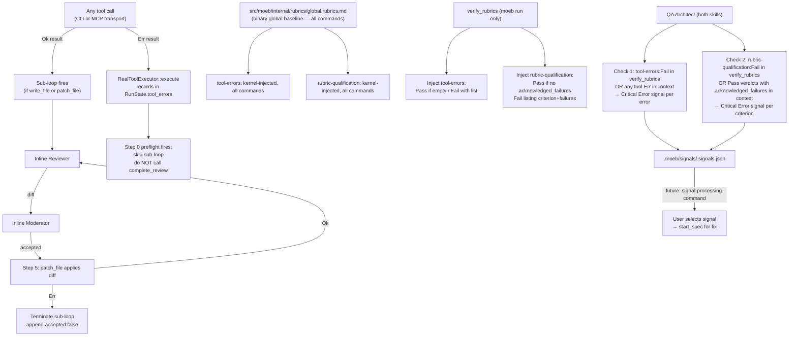

# Review Process: Tool Error Enforcement, Rubric Qualification Detection, and Signal-Only Processing

## Raw Requirement

A consistent failure has been the with the patch tool supplied by moeb, this was not
raised by our current review process but should be. Another failure was in the tests,
deemed non-regression and thus allowed to pass, however this again should have been
caught by the review process. Update the review process to enable capture of both of
these failures such that they be signaled out.

## Description

The patch tool failures and test regression misclassification are two instances of
broader review-process gaps. This specification addresses both patterns generally,
plus a third workflow concern raised during authoring:

**Gap 1 — Tool call failures not surfaced by the review process.** When any tool call
returns an error, the review process has no systematic mechanism to detect and surface
it. The agent sees the error string in context but may proceed without acknowledging it;
`verify_rubrics` has no visibility into tool failures because they are not tracked in
`RunState`; the QA Architect has no instruction to scan for them. A patch tool failure
is one example — the same gap exists for write failures, VCS failures, or any other
tool. This gap affects both `moeb run` (where `verify_rubrics` is called) and `moeb spec`
(where it is not but should be), and both CLI and MCP execution paths.

**Gap 2 — Rubric verdicts weakened by agent qualification.** When a run produces an
observable failure (test failures, build errors, tool errors), the agent can mark the
corresponding rubric criterion Pass by qualifying the failure as acceptable — e.g.,
"pre-existing", "non-regression", "newly introduced in this run", "out of scope". This
pattern weakens the rubric's effectiveness without contradicting it literally. The current
review process has no mechanism to surface qualified passes; relying on natural-language
string matching in notes is fragile and evadable. The fix is structural: add an explicit
`acknowledged_failures` field to the verdict schema, require agents to populate it when
they observe failures but issue a Pass, and have `verify_rubrics` inject a
kernel-authoritative `rubric-qualification` verdict from it — the same pattern as
`tool-errors`. The agent cannot hide a qualified pass by choosing different wording;
it must explicitly declare the failures it is acknowledging.

**Gap 3 — Auto-spec generation on Critical signals.** The current `run.skill.md` and
`spec.skill.md` End-of-Skill Review call `start_spec` automatically for every Critical
signal. The intended workflow is signal-write-only: signals are written to
`.moeb/signals/` and consumed by the user or a dedicated command (to be introduced in a
future specification). Auto-generation bypasses user curation and can create runaway
spec chains when a run produces multiple Critical signals.

**Fixes:**

1. **Kernel-tracked tool errors, uniform across all executors, registered globally.**
   `RunState` gains a `tool_errors` list. `RealToolExecutor::execute` records every
   tool-handler `Err` result at dispatch time — this single method is shared between CLI
   and MCP paths, so recording is uniform with no transport-specific conditioning.
   `verify_rubrics` injects a kernel-authoritative `tool-errors` verdict (Pass/Fail) from
   this list, parallel to `write-review-compliance`. The `tool-errors` criterion is
   declared in `src/moeb/internal/rubrics/global.rubrics.md` (binary global baseline) so
   it applies to every moeb command across all projects. For `moeb spec` invocations
   (which do not call `verify_rubrics`), the QA Architect scans context directly for tool
   error results.

2. **Explicit qualified-pass schema field, kernel-injected `rubric-qualification` verdict,
   registered globally.** The rubric verdict input struct gains `acknowledged_failures:
   Vec<String>` (serde default empty). Agents are instructed: when issuing a Pass verdict
   for a criterion where failures were observed, list those failures in
   `acknowledged_failures`. At `verify_rubrics` call time, the kernel scans all incoming
   Pass verdicts for non-empty `acknowledged_failures` and injects a kernel-authoritative
   `rubric-qualification` criterion (Pass if none found, Fail listing each criterion and
   its declared failures). The `rubric-qualification` criterion is declared in
   `src/moeb/internal/rubrics/global.rubrics.md` alongside `tool-errors`. For `moeb spec`
   invocations (no `verify_rubrics`), the QA Architect scans verdict objects in context
   directly for Pass entries with non-empty `acknowledged_failures`.

3. **Signal-only End-of-Skill Review in both skills.** The `start_spec` auto-generation
   block is removed from both `run.skill.md` and `spec.skill.md`. Signals are written
   to `.moeb/signals/<run_id>.signals.json` and consumed by a future signal-processing
   command.

4. **Per-Step Review Sub-Loops hardened in both skills.** Step-0 preflight generalised
   to any preceding file-modification tool error; step-5 apply-failure terminates the
   iteration cycle rather than silently re-entering step 1.



## Backlinks

### Parents

| Label | Path | Purpose |
|-------|------|---------|
| Harness README | .moeb/README.md | Root index |
| Write→Review Compliance Enforcement | specifications/moeb/moeb.write-review-compliance.md | Established the RunState / verify_rubrics injection pattern that tool-error tracking follows exactly |
| Inline Persona Review | specifications/moeb/moeb.inline-persona-review.md | Defined the inline reasoning mechanism and current run.skill.md and spec.skill.md sub-loop structure this spec updates |
| Composable Review Wrapper | specifications/moeb/moeb.composable-review-wrapper.md | Established the End-of-Skill Review phase including the auto-spec generation block removed here from both skills |
| Task-List Tools | specifications/moeb/moeb.task-list-tools.md | Established the SharedRunState injection pattern for tools that this spec extends for error tracking |
| MCP Stdio Server | specifications/moeb/moeb.mcp-stdio-server.md | MCP execution path; tool error recording applies uniformly to both CLI and MCP through RealToolExecutor::execute |
| Run Prompt: Non-Regression and Rubric Verification Enforcement | specifications/moeb/moeb.run-prompt-non-regression-and-rubric-verification.md | Established the no-test-regression rubric whose weakening-via-qualification this spec detects generally |
| Patch File Tool | specifications/moeb/moeb.patch-file-tool.md | Motivating example for tool error detection; errors now tracked generically rather than by tool name |
| Agent Skills | specifications/moeb/moeb.agent-skills.md | Skill file system governing run.skill.md and spec.skill.md, both updated in this spec |

## Steps

### Step 1 — Extend `RunState` with tool-error tracking

In `src/moeb/src/run_state.rs`, add a `ToolError` struct and extend `RunState`:

```rust
#[derive(Debug, Clone, serde::Serialize)]
pub struct ToolError {
    pub tool_name: String,
    pub message: String,
}
```

Add the field to `RunState` alongside `pending_reviews`:

```rust
pub tool_errors: Vec<ToolError>,
```

Initialise it to `Vec::new()` in `RunState::new()` (and via `Default`). Add one public
method:

```rust
pub fn record_tool_error(&mut self, tool_name: &str, message: &str) {
    self.tool_errors.push(ToolError {
        tool_name: tool_name.to_string(),
        message: message.to_string(),
    });
}
```

`ToolError` derives `serde::Serialize` so it can be serialised into the `verify_rubrics`
Fail note as compact JSON, making errors machine-readable for future signal-processing
tooling.

### Step 2 — Record tool errors in `RealToolExecutor`

Read `src/moeb/src/ports/tool_executor.rs` in full. Locate the `RealToolExecutor::execute`
implementation and the block that calls `handler.execute(args, working_dir)` and handles
its result.

In the `Err(e)` branch — the branch that currently formats and returns the error string
to the caller — add a call to `record_tool_error` on the shared state before returning:

```rust
Err(e) => {
    let msg = e.to_string();
    self.state.lock().unwrap().record_tool_error(name, &msg);
    format!("{}: {}", name, msg)
}
```

Adapt to the exact existing code structure as needed: the principle is that every `Err`
from a `ToolHandler` is recorded in `RunState` at dispatch time before the error string
is returned. `RealToolExecutor::execute` is the single dispatch method used for both
CLI (`moeb run`) and MCP (`moeb serve`) paths — no transport-specific conditioning is
required.

### Step 3 — Inject `tool-errors` and `rubric-qualification` verdicts in `verify_rubrics`

Read `src/moeb/src/tools/verify_rubrics.rs` in full.

**3a — Extend the agent verdict input struct.**

Locate the struct used to deserialise agent-supplied verdict entries (the struct whose
fields include `name`, `status`/`verdict`, and `note`). Add one field with a serde
default so existing callers that omit it continue to work:

```rust
#[serde(default)]
pub acknowledged_failures: Vec<String>,
```

`#[serde(default)]` causes the field to deserialise as an empty `Vec` when absent,
preserving backwards compatibility.

**3b — Inject `tool-errors` verdict.**

Before building the final `verifications` list from agent-supplied criteria, read
`tool_errors` from `RunState`:

```rust
let tool_errors: Vec<crate::run_state::ToolError> = {
    let state = self.state.lock().unwrap();
    state.tool_errors.clone()
};
```

After processing the agent-supplied criteria array, remove any agent-supplied entry
whose `name` field equals `"tool-errors"` (the kernel value is authoritative), then
append one kernel-injected entry:

- If `tool_errors` is empty:
  `RubricVerification { name: "tool-errors", status: Pass, note: Some("No tool errors recorded".to_string()) }`
- Otherwise:
  `RubricVerification { name: "tool-errors", status: Fail, note: Some(format!("Tool errors recorded: {}", serde_json::to_string(&tool_errors).unwrap_or_default())) }`

**3c — Inject `rubric-qualification` verdict.**

After the `tool-errors` injection, collect all incoming Pass verdicts that have a
non-empty `acknowledged_failures` list:

```rust
let qualified_passes: Vec<(String, Vec<String>)> = agent_criteria
    .iter()
    .filter(|c| matches!(c.status, RubricStatus::Pass) && !c.acknowledged_failures.is_empty())
    .map(|c| (c.name.clone(), c.acknowledged_failures.clone()))
    .collect();
```

Remove any agent-supplied entry whose `name` equals `"rubric-qualification"`, then
append one kernel-injected entry:

- If `qualified_passes` is empty:
  `RubricVerification { name: "rubric-qualification", status: Pass, note: Some("No qualified Pass verdicts recorded".to_string()) }`
- Otherwise:
  `RubricVerification { name: "rubric-qualification", status: Fail, note: Some(format!("Pass verdicts with acknowledged failures: {}", serde_json::to_string(&qualified_passes).unwrap_or_default())) }`

Update the pass/fail/na counters to reflect both injected entries. Both injections follow
the identical pattern used for `write-review-compliance` injection in the same file.

### Step 4 — Register `tool-errors` and `rubric-qualification` in the binary global rubric

Read `src/moeb/internal/rubrics/global.rubrics.md` in full. This file is currently empty;
this step is its first population.

Write the file with the following content:

```markdown
| Name | Description | Threshold | Pass Condition |
|------|-------------|-----------|----------------|
| `tool-errors` | No ToolHandler errors were recorded during this command invocation. Covers all tool calls on both CLI and MCP paths via `RealToolExecutor::execute`. Applies to every moeb command. | Zero tool errors | Kernel-authoritative: injected by `verify_rubrics` from `RunState.tool_errors`. Do not supply a verdict — any agent-supplied entry is overridden. |
| `rubric-qualification` | No Pass verdicts with acknowledged failures were issued during this command invocation. An agent that observes a failure but passes a criterion must populate `acknowledged_failures` in the verdict object. Applies to every moeb command. | Zero qualified Pass verdicts | Kernel-authoritative: injected by `verify_rubrics` by scanning `acknowledged_failures` on incoming Pass verdicts. Do not supply a verdict — any agent-supplied entry is overridden. |
```

`global.rubrics.md` applies across all moeb commands (`moeb run`, `moeb spec`, and any
future commands). This is distinct from `run.rubrics.md` (criteria specific to `moeb run`,
e.g. `context-budget`) and `spec.rubrics.md` (criteria specific to `moeb spec`, e.g.
`no-drift`, `spec-schema-compliance`). Project-level overrides live in
`.moeb/rubrics/global.rubrics.md`; the binary baseline is the default for all projects.
The kernel injection in `verify_rubrics` is unconditional and cannot be overridden by
rubric file content alone.

### Step 5 — Update `src/moeb/internal/skills/run.skill.md`

Read `src/moeb/internal/skills/run.skill.md` in full.

**5a — Remove auto-spec generation from End-of-Skill Review.** Locate the block
beginning `Parse the returned ReviewSignalReport JSON:`. Replace the entire block with:

```
Parse the returned ReviewSignalReport JSON:

1. Assign each signal:
   - `signal_id`: a fresh UUID v4
   - `run_id`: the current run identifier
   - `timestamp`: ISO 8601 current time

2. Write the complete array of signals to `.moeb/signals/<run_id>.signals.json`.

3. Do not fail or abort the skill if critical signals are present. Continue to the
   Metrics Recording phase.
```

The previous step 1 (calling `start_spec` for Critical signals and recording
`auto_spec_path`) is entirely removed. Signals are written to file only.

**5b — Add step-0 preflight to the Per-Step Review Sub-Loop.** Immediately before the
existing step 1 (`**Inline Reviewer.**`), insert a new step 0 (steps 1–9 are not
renumbered; step 0 short-circuits the loop):

Replace:

```
1. **Inline Reviewer.** Without calling any tool, adopt the **Reviewer Persona**
   pre-loaded in your context. Evaluate the artifact against the step intent and the
   applicable rubric criteria. Produce a unified diff if improvements are needed, or
   an empty string if the artifact fully satisfies all criteria. Hold this result in
   working memory — do not output it as a standalone message before continuing.
```

with:

```
0. **Error preflight.** If the tool call immediately preceding this sub-loop invocation
   was a file-modification tool (`write_file` or `patch_file`) and its result indicates
   a failure (the result string contains "failed", "error", or "could not"):
   - Record StepMetric with `iteration_count = 0`, `acceptance_rate = 1.0`, `delta_scores = []`.
   - Do NOT call `complete_review` for this path.
   - Proceed to the next task. The kernel-injected `tool-errors` criterion records
     a Fail for this call when `verify_rubrics` is invoked.
   Skip steps 1–9 below for this invocation.

1. **Inline Reviewer.** Without calling any tool, adopt the **Reviewer Persona**
   pre-loaded in your context. Evaluate the artifact against the step intent and the
   applicable rubric criteria. Produce a unified diff if improvements are needed, or
   an empty string if the artifact fully satisfies all criteria. Hold this result in
   working memory — do not output it as a standalone message before continuing.
```

**5c — Update step 5 to handle reviewer-diff apply failure.** Replace the existing step 5:

```
5. If `accepted = true` and `delta_score >= 0.01` and `iteration_count < 2`:
   - Apply the diff: `patch_file` with the proposed diff on the artifact path.
   - Append `{ "delta_score": <score>, "accepted": true }` to iteration history.
   - Return to step 1.
```

with:

```
5. If `accepted = true` and `delta_score >= 0.01` and `iteration_count < 2`:
   - Apply the diff: `patch_file` with the proposed diff on the artifact path.
   - If `patch_file` returns an error result, terminate the sub-loop immediately —
     do not return to step 1. Append `{ "delta_score": 0.0, "accepted": false }` to
     iteration history and proceed to step 6. The kernel records this as a tool error.
   - Otherwise append `{ "delta_score": <score>, "accepted": true }` to iteration
     history and return to step 1.
```

**5d — Update Phase 4 for kernel-injected verdicts.** In the `For each criterion,
evaluate pass, fail, or na:` block, after the `context-budget` bullet and before the
`All other criteria:` bullet, insert:

```
- `tool-errors`: This criterion is injected by the kernel from `RunState.tool_errors`.
  Do not supply a verdict — any agent-supplied entry is silently overridden. You may
  include it for completeness; the kernel replaces it.

- `rubric-qualification`: This criterion is injected by the kernel from the
  `acknowledged_failures` fields in your verdict objects. Do not supply this criterion
  directly — any agent-supplied entry is silently overridden. When you observe a failure
  but judge it acceptable for a Pass verdict, you MUST populate `acknowledged_failures`
  with a brief description of each failure. The kernel reads this field and produces the
  `rubric-qualification` verdict; the QA Architect surfaces it as a Critical signal.
  Do not leave `acknowledged_failures` empty when a failure was observed — omission is
  treated as "no failures observed" and the qualification will not be surfaced.
```

### Step 6 — Update `src/moeb/internal/skills/spec.skill.md`

Read `src/moeb/internal/skills/spec.skill.md` in full.

**6a — Remove auto-spec generation from End-of-Skill Review.** Locate the block
beginning `Parse the returned \`ReviewSignalReport\` JSON:` in the
`## Phase — End-of-Skill Review` section. Replace the entire block with:

```
Parse the returned `ReviewSignalReport` JSON:

1. Assign `signal_id`, `run_id`, `timestamp` to each signal.

2. Write signals to `.moeb/signals/<run_id>.signals.json`.

3. Continue to Metrics Recording regardless of critical signal presence.
```

The previous step 1 (calling `start_spec` for Critical signals with the recursion guard)
is entirely removed.

**6b — Add step-0 preflight to the Per-Step Review Sub-Loop (spec file).** In the
`### Per-Step Review Sub-Loop (spec file)` section (Phase 4), immediately before the
existing step 1, insert:

```
0. **Error preflight.** If the `write_file` call immediately preceding this sub-loop
   returned an error result (result string contains "failed", "error", or "could not"):
   - Record StepMetric with `step_id: "spec-file"`, `iteration_count = 0`,
     `acceptance_rate = 1.0`, `delta_scores = []`.
   - Do NOT call `complete_review` for this path.
   - Proceed to Phase 5. The error is recorded in RunState.tool_errors.
   Skip steps 1–8 below for this invocation.
```

**6c — Update step 5 of the spec-file sub-loop to handle apply failure.** Replace the
existing step 5:

```
5. If `accepted = true` and `delta_score >= 0.01` and `iteration_count < 2`:
   - Apply the diff: `patch_file` with the proposed diff on the spec file path.
   - Append `{ "delta_score": <score>, "accepted": true }` to iteration history.
   - Return to step 1.
```

with:

```
5. If `accepted = true` and `delta_score >= 0.01` and `iteration_count < 2`:
   - Apply the diff: `patch_file` with the proposed diff on the spec file path.
   - If `patch_file` returns an error result, terminate the sub-loop immediately —
     do not return to step 1. Append `{ "delta_score": 0.0, "accepted": false }` to
     iteration history and proceed to step 6. The error is recorded in RunState.tool_errors.
   - Otherwise append `{ "delta_score": <score>, "accepted": true }` to iteration
     history and return to step 1.
```

**6d — Add step-0 preflight to the Per-Step Review Sub-Loop (README patch).** In the
`### Per-Step Review Sub-Loop (README patch)` section (Phase 6), immediately before
the existing step 1, insert:

```
0. **Error preflight.** If the `patch_file` call on `.moeb/README.md` immediately
   preceding this sub-loop returned an error result (result string contains "failed",
   "error", or "could not"):
   - Record StepMetric with `step_id: "readme-link"`, `iteration_count = 0`,
     `acceptance_rate = 1.0`, `delta_scores = []`.
   - Call `complete_review` with `.moeb/README.md` (no-op at kernel level; included for
     symmetry).
   - Proceed to Phase — End-of-Skill Review. The error is recorded in RunState.tool_errors.
   Skip steps 1–5 below for this invocation.
```

**6e — Update step 4 of the README sub-loop to handle apply failure.** Replace the
existing step 4:

```
4. Parse Moderator JSON. Apply diff via `patch_file` if `accepted = true` and
   `delta_score >= 0.01` and `iteration_count < 2`. Record StepMetric for
   `step_id: "readme-link"`.
```

with:

```
4. Parse Moderator JSON. If `accepted = true` and `delta_score >= 0.01` and
   `iteration_count < 2`:
   - Apply the diff: `patch_file` on `.moeb/README.md` with the proposed diff.
   - If `patch_file` returns an error result, terminate the sub-loop immediately.
     Append `{ "delta_score": 0.0, "accepted": false }` to iteration history.
     The error is recorded in RunState.tool_errors. Proceed to step 5.
   - Otherwise append `{ "delta_score": <score>, "accepted": true }` to iteration
     history and return to step 1.
   Record StepMetric for `step_id: "readme-link"` when the loop terminates.
```

**6f — Add `acknowledged_failures` instruction to rubric self-assessment.** Locate the
section in `spec.skill.md` where the agent constructs rubric verdict objects during the
End-of-Skill Review (the section that describes assembling the `verify_rubrics` call or
producing self-assessed verdicts for the QA Architect). Add the following instruction:

```
When issuing a Pass verdict for a criterion where failures were observed but judged
acceptable, populate `acknowledged_failures` with a brief description of each failure:

  "acknowledged_failures": ["cargo test: 2 failures in pre-existing suite", "..."]

Do not leave this field empty when a failure was observed. The QA Architect scans
verdict objects in context for Pass entries with non-empty `acknowledged_failures` and
raises a Critical signal for each. This mechanism replaces qualification language in
`note` as the surface for declared-but-passing failures — the note field should remain
a criterion evaluation; failure acknowledgement goes in `acknowledged_failures`.
```

### Step 7 — Update `src/moeb/internal/roles/qa-architect.role.md`

Read `src/moeb/internal/roles/qa-architect.role.md` in full.

Locate the line `You will receive:` and the paragraph beginning `Return a JSON object`.
Insert the following block immediately after the last bullet of the `You will receive:`
list and before the `Return a JSON object` paragraph:

```

Mandatory signal checks — apply regardless of artifact quality scores and regardless
of which skill is running:

1. **Tool errors.** First check whether a `verify_rubrics` tool result is visible in
   this run's conversation context and shows `tool-errors: Fail`. If so, raise one
   Critical Error signal per recorded tool error listed in the note. If `verify_rubrics`
   was not called in this run (as in `moeb spec`), scan the full conversation context
   directly for tool call results from file-modification tools (`write_file`, `patch_file`,
   `git_commit`) that contain error indicators ("failed", "error", "could not"). Raise one
   Critical Error signal per distinct error found:
   - `category`: `"Error"`, `severity`: `"Critical"`
   - `title`: `"Tool error not recovered: <tool_name>"`
   - `description`: the verbatim error result from context
   - `proposed_resolution`: `"Investigate why <tool_name> failed and whether the
     intended operation completed. If a file write was not applied, a write_file fallback
     or retry is required before the next run succeeds."`
   - `gating_condition`: `null`

2. **Rubric qualification.** First check whether a `verify_rubrics` tool result is
   visible in this run's conversation context and shows `rubric-qualification: Fail`.
   If so, raise one Critical Error signal per qualified-pass criterion listed in the
   note (the note contains a JSON array of `[criterion_name, [failure, ...]]` pairs).
   If `verify_rubrics` was not called in this run (as in `moeb spec`), scan the
   conversation context directly for rubric verdict objects that have `verdict: Pass`
   and a non-empty `acknowledged_failures` array. Raise one Critical Error signal per
   such entry:
   - `category`: `"Error"`, `severity`: `"Critical"`
   - `title`: `"Rubric criterion Pass with acknowledged failures: <criterion-name>"`
   - `description`: list the acknowledged failures verbatim from the `acknowledged_failures`
     array
   - `proposed_resolution`: `"Re-run with the criterion evaluated strictly. A failure is
     a Fail regardless of whether it is attributed to prior work or the current change.
     If the failure is genuinely pre-existing, fix it in a separate targeted run first."`
   - `gating_condition`: `null`
```

### Step 8 — Verify

Run `cargo build --release` — zero errors.

Run `cargo test` — all existing tests pass.

Confirm `RunState` changes:
```
grep "tool_errors" src/moeb/src/run_state.rs
grep "record_tool_error" src/moeb/src/run_state.rs
```
Both return matches.

Confirm executor records errors:
```
grep "record_tool_error" src/moeb/src/ports/tool_executor.rs
```
Returns a match.

Confirm `verify_rubrics` injects both criteria:
```
grep "tool-errors" src/moeb/src/tools/verify_rubrics.rs
grep "rubric-qualification" src/moeb/src/tools/verify_rubrics.rs
grep "acknowledged_failures" src/moeb/src/tools/verify_rubrics.rs
```
All three return matches.

Confirm both criteria are registered in the binary global baseline:
```
grep "tool-errors" src/moeb/internal/rubrics/global.rubrics.md
grep "rubric-qualification" src/moeb/internal/rubrics/global.rubrics.md
```
Both return matches.

Confirm `run.skill.md` has no auto-spec calls and has all sub-loop updates:
```
grep "start_spec" src/moeb/internal/skills/run.skill.md
```
Returns zero matches in the End-of-Skill Review section.
```
grep "Error preflight" src/moeb/internal/skills/run.skill.md
grep "acknowledged_failures" src/moeb/internal/skills/run.skill.md
```
Both return matches.

Confirm `spec.skill.md` has no auto-spec calls and has all sub-loop updates:
```
grep "start_spec" src/moeb/internal/skills/spec.skill.md
```
Returns zero matches in the End-of-Skill Review section.
```
grep "Error preflight" src/moeb/internal/skills/spec.skill.md
grep "acknowledged_failures" src/moeb/internal/skills/spec.skill.md
```
Both return two matches (one per sub-loop / one per instruction block).

Confirm `qa-architect.role.md` has both mandatory checks:
```
grep "Mandatory signal checks" src/moeb/internal/roles/qa-architect.role.md
grep "rubric-qualification" src/moeb/internal/roles/qa-architect.role.md
```
Both return matches.

## Decisions

### Decision 1 — Kernel-tracked tool errors over agent self-report

**Rationale:** An agent under context pressure may not notice a tool error string or
rationalise it as non-critical. Tracking errors in `RunState` at the executor dispatch
level means the kernel sees every `Err` result regardless of what the agent does with it.
`verify_rubrics` injection follows the pattern established by `write-review-compliance`
and is authoritative: agents cannot self-certify `tool-errors`. `ToolHandler::execute`
already returns `Result<String>` via anyhow — the only new code is `record_tool_error`
in the existing `Err` branch and the `RunState` field.

**Rejected alternatives:**

| Option | Reason Rejected |
|--------|-----------------|
| Agent-scan rubric criterion (prompt only) | Agent can miss or rationalise errors; self-certification defeats the purpose of detecting gaps the agent failed to surface |
| Tool-level error flag in each ToolHandler | Individual tools already return `Err`; interception at the executor handles all tools uniformly without per-tool changes |
| Full structured error type at MCP protocol level | Requires changes to MCP schema and all client-facing contracts; executor-level interception achieves the same detection scope with minimal surface area |

**Consequences:** Every `Err` from any `ToolHandler` is recorded in `tool_errors`.
Future specifications may add a `suppress_tool_error()` call for verified expected
failures (e.g., a deliberate existence check). For this spec, all recorded errors
surface via the QA Architect or `verify_rubrics`.

### Decision 2 — Uniform tool error recording across CLI and MCP executors

**Rationale:** `RealToolExecutor::execute` is the single dispatch method used for both
CLI (`moeb run`) and MCP (`moeb serve`) execution paths. Adding `record_tool_error` to
the `Err` branch applies uniformly through one code change with no transport-specific
conditioning. The original concern — that MCP coordinators issue exploratory tool calls
where errors are expected — does not hold during moeb skill execution: when Claude Code
drives a run via MCP, all tool calls are deterministic skill workflow calls. Restricting
recording to CLI mode would leave MCP-mode runs (the primary usage mode) without error
tracking, defeating the purpose of the feature.

**Rejected alternatives:**

| Option | Reason Rejected |
|--------|-----------------|
| CLI-only recording via a mode flag in RealToolExecutor | Adds coordination logic to a thin component; the transport is an architectural detail the executor dispatch should not need to inspect |
| Separate MCP executor with error recording opt-in | Duplicates executor logic; the CLI/MCP distinction is about adapter presence, not tool dispatch behaviour |

**Consequences:** All `Err` results from any `ToolHandler` are recorded regardless of
transport. In MCP mode, `verify_rubrics` is called by the coordinator as part of the
skill workflow, at which point it reads `tool_errors` and injects the verdict. The QA
Architect covers `moeb spec` invocations where `verify_rubrics` is not called.

### Decision 3 — QA Architect scans context directly for spec invocations

**Rationale:** `spec.skill.md` does not include a Verify phase calling `verify_rubrics`.
Adding one would be a workflow change outside this spec's scope. Instead, the QA
Architect mandatory checks use the `verify_rubrics` output when present (run skill) and
fall back to direct context inspection when absent (spec skill). For tool errors this
means scanning tool result strings; for rubric qualification this means scanning verdict
objects for non-empty `acknowledged_failures`. Both paths are explicit in the role file
so a reader understands the coverage without consulting the skill files.

**Rejected alternatives:**

| Option | Reason Rejected |
|--------|-----------------|
| Add a Verify phase to spec.skill.md | Out of scope for this spec; the spec skill's rubric model (retry-based, not criterion-based) may warrant a separate design decision |
| QA Architect checks only verify_rubrics output | Leaves spec invocations without systematic detection — the primary failure mode this spec is fixing occurred in MCP-driven spec invocations |

**Consequences:** The QA Architect context scan for tool errors is a secondary detection
path. For rubric qualification, the context scan inspects structured `acknowledged_failures`
fields rather than natural language, giving it the same machine-readable reliability as
the `verify_rubrics` path.

### Decision 4 — Signal-only End-of-Skill Review; auto-spec generation removed from both skills

**Rationale:** The intended workflow is: command invocation → signals written → user or a
dedicated command selects and processes signals → `start_spec` is called for the chosen
fix. Auto-generating specs for every Critical signal bypasses user curation, produces
runaway spec chains when an invocation produces multiple Critical signals, and creates
specs from signal descriptions that may be too brief to produce a useful implementation.
The `proposed_resolution` field retains intent for what a fixing spec should accomplish;
it is consumed by the future processing command, not acted on automatically.

**Rejected alternatives:**

| Option | Reason Rejected |
|--------|-----------------|
| Keep auto-spec with a recursion guard | The guard prevents infinite chains but does not restore user curation; the root issue is auto-generation itself |
| Remove from run.skill.md only | spec.skill.md has the same block and the same problem; consistency requires both skills to align on the signal-only model |

**Consequences:** After this spec, no `start_spec` call is made automatically during any
moeb command invocation. All Critical signals remain in `.moeb/signals/` awaiting
processing. A future specification will introduce the signal-processing command and
define the `start_spec` invocation protocol.

### Decision 5 — Explicit `acknowledged_failures` schema field over natural-language string matching

**Rationale:** The previous approach (QA Architect scanning Pass verdict notes for
phrases like "pre-existing", "non-regression") is fragile: detection quality varies with
the QA Architect's reasoning quality and the phrasing the agent happened to use. An agent
can evade detection by choosing different words, or the QA Architect can produce false
positives on legitimate explanations that use similar language. The root problem is that
qualification language is implicit — it must be inferred from free-text.

The fix is structural: add `acknowledged_failures: Vec<String>` to the verdict schema and
require agents to populate it when they observe failures but issue a Pass. The kernel then
inspects this field in `verify_rubrics` and injects a `rubric-qualification` verdict —
exactly the same pattern as `tool-errors`. The agent cannot evade detection by using
different phrasing; it must explicitly declare the failures it is acknowledging. Omission
is treated as "no failures observed", which is auditable: if the QA Architect later sees
evidence of a failure not declared in `acknowledged_failures`, that is itself a signal gap.

**Rejected alternatives:**

| Option | Reason Rejected |
|--------|-----------------|
| Natural-language string matching in QA Architect | Fragile; evadable; false positives on legitimate explanations; depends on consistent QA Architect phrasing |
| Keyword-match in verify_rubrics on Pass notes | Same fragility as QA Architect approach, now in Rust; legitimate rationale may use the same terms |
| Require a separate evidence field for observable failures | Addresses the same problem but less directly; `acknowledged_failures` is self-documenting and maps 1:1 to the `rubric-qualification` injection |

**Consequences:** Qualification detection now relies on agent compliance with the
`acknowledged_failures` schema contract rather than on language inference. An agent that
observes a failure and passes the criterion without populating `acknowledged_failures`
is not directly detected by this mechanism — the `tool-errors` kernel criterion provides
a harder backstop for moeb-tool-observable failures, and the QA Architect tool-error check
covers the remainder. The qualification gap narrows to failures the agent chooses to
omit entirely from context, which is a distinct and smaller class of evasion.

### Decision 6 — Criteria declared in `global.rubrics.md`, not in command-specific rubric files

**Rationale:** `tool-errors` and `rubric-qualification` are cross-cutting enforcement
criteria that apply to every moeb command invocation — both `moeb run` and `moeb spec`,
and any future commands. The binary rubric file layout separates command-specific criteria
(`run.rubrics.md` for `moeb run`, `spec.rubrics.md` for `moeb spec`) from invocation-wide
criteria (`global.rubrics.md`). Registering in `run.rubrics.md` would exclude `moeb spec`
invocations; registering in both `run.rubrics.md` and `spec.rubrics.md` would duplicate
the declarations and create a maintenance burden when criteria descriptions change.
`global.rubrics.md` is the correct layer: it applies once, to everything.

Note: the word "run" in `run.rubrics.md` refers to the `moeb run` CLI command, not to the
broader concept of a moeb command invocation (which includes both `moeb run` and
`moeb spec`). This naming ambiguity — where "a run" can colloquially mean any moeb
command execution — is a known source of confusion in the codebase and is worth a
dedicated naming-clarification spec in future work.

**Rejected alternatives:**

| Option | Reason Rejected |
|--------|-----------------|
| Register in `run.rubrics.md` only | Excludes `moeb spec` invocations; `tool-errors` and `rubric-qualification` must apply to both |
| Register in both `run.rubrics.md` and `spec.rubrics.md` | Duplicates declarations; divergence risk when descriptions are updated |
| Document only in `verify_rubrics.rs` source comments | Not visible to agents consulting rubric files or to run authors reading the rubric contract |

**Consequences:** Any moeb command that reads the binary global baseline sees
`tool-errors` and `rubric-qualification` as declared criteria. Projects may override
the description or threshold text in `.moeb/rubrics/global.rubrics.md`, but the kernel
injection in `verify_rubrics` is unconditional and cannot be overridden by rubric file
content alone.

## Rubric

### Structured

| Name | Description | Threshold | Pass Condition |
|------|-------------|-----------|----------------|
| `no-drift` | No contradiction with parent spec decisions | Zero contradictions | Manual review of every decision in every parent spec listed in Backlinks |
| `spec-schema-compliance` | All required frontmatter fields and body sections present and correctly ordered | 100% | Validation in `domain/spec.rs` exits 0 during `moeb spec` |
| `thin-kernel` | `record_tool_error` in `RunState` is a single state mutation; the call in `RealToolExecutor` is a single line in the existing Err branch; `verify_rubrics` injections each read state or input and append one entry — no branching beyond empty/non-empty | Zero workflow-logic functions in new Rust | Code review: each new Rust construct is one operation with no conditional sequencing beyond the existing pattern |
| `mcp-cli-behavioural-parity` | No new tool registered; `tool-errors` and `rubric-qualification` are kernel-injected via `verify_rubrics` only | Zero new tools | grep for `tool-errors` and `rubric-qualification` returns matches only in `verify_rubrics.rs`, skill files, and `global.rubrics.md`; no new entry in `ToolRegistry::standard()` |
| `auto-spec-removed` | Neither `run.skill.md` nor `spec.skill.md` End-of-Skill Review contains a `start_spec` call or reference to `auto_spec_path` | Zero auto-spec calls in both files | `grep "start_spec"` returns zero matches in the End-of-Skill Review section of both skill files |
| `tool-errors-injection-complete` | `verify_rubrics` injects `tool-errors` from `RunState.tool_errors`; any agent-supplied entry is removed and replaced | Both mechanisms present | Code review: `verify_rubrics.rs` reads `tool_errors`, removes agent-supplied entry, appends kernel entry |
| `rubric-qualification-injection-complete` | `verify_rubrics` injects `rubric-qualification` from Pass verdicts with non-empty `acknowledged_failures`; any agent-supplied entry is removed and replaced | Both mechanisms present | Code review: `verify_rubrics.rs` scans `acknowledged_failures` on Pass verdicts, removes agent-supplied entry, appends kernel entry; `grep "rubric-qualification"` returns matches in `verify_rubrics.rs` |
| `global-rubrics-registered` | Both `tool-errors` and `rubric-qualification` have rows in `src/moeb/internal/rubrics/global.rubrics.md` | Two rows present | `grep "tool-errors" src/moeb/internal/rubrics/global.rubrics.md` and `grep "rubric-qualification" src/moeb/internal/rubrics/global.rubrics.md` both return matches |
| `run-skill-sub-loop-updated` | `run.skill.md` Per-Step Review Sub-Loop has step-0 preflight and step-5 error handling | Both present | `grep "Error preflight"` returns one match; `grep "The kernel records this as a tool error"` returns one match in `run.skill.md` |
| `spec-skill-sub-loops-updated` | `spec.skill.md` has step-0 preflight in both Per-Step Review Sub-Loops and step-5/step-4 error handling in each | All four changes present | `grep "Error preflight"` returns two matches in `spec.skill.md`; `grep "The error is recorded in RunState.tool_errors"` returns matches in both sub-loops |
| `qa-architect-checks-present` | `qa-architect.role.md` contains both mandatory checks; check 2 uses `rubric-qualification` kernel verdict (not string matching) with direct verdict-object fallback for spec invocations | Both present, check 2 uses structured field | `grep "Mandatory signal checks"` and `grep "rubric-qualification"` both return matches in `qa-architect.role.md`; no string like `"pre-existing"` or `"non-regression"` appears as a detection target in check 2 |

### Qualitative

- The `ToolError` struct derives `serde::Serialize` so the `verify_rubrics` Fail note
  contains structured JSON rather than a formatted string, making errors machine-readable
  for future signal-processing tooling.
- The step-0 preflight in both skills must reference file-modification tools generally
  ("write_file or patch_file") rather than a specific tool name, so it remains valid if
  new file-modification tools are added.
- The QA Architect mandatory checks must explicitly cover both the `verify_rubrics`
  output path (run skill) and the direct context inspection path (spec skill) for both
  check 1 (tool errors) and check 2 (rubric qualification) — a reader of the updated
  role file must see both paths described without needing to consult the skill files.
- A reader of the updated End-of-Skill Review section in either skill file must find no
  reference to `start_spec`, `auto_spec_path`, or `auto_generated` — all three are fully
  removed.
- The `record_tool_error` call in `RealToolExecutor` must be in the existing `Err`
  branch, not in a new branch, so that the error string returned to the agent is
  unchanged — the kernel records the error without altering what the agent sees.
- The `acknowledged_failures` field must use `#[serde(default)]` so existing callers
  that omit the field continue to function without schema changes — the field is additive
  and backwards-compatible.
- The instruction to populate `acknowledged_failures` must appear in both `run.skill.md`
  (Phase 4 verdict block) and `spec.skill.md` (rubric self-assessment section) so the
  contract is enforced regardless of which skill is executing.
- The binary global rubric rows for `tool-errors` and `rubric-qualification` must
  explicitly state that agents must not supply a verdict for these criteria, so any
  agent reading the rubric knows to omit them from its own assessment and rely on kernel
  injection.
