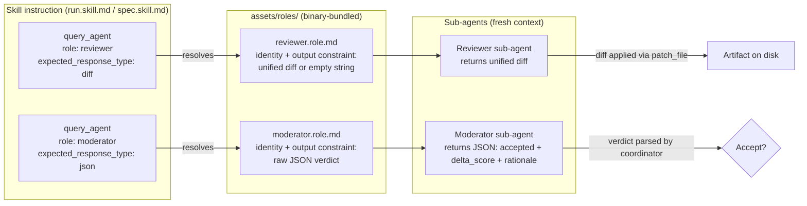

# Reviewer and Moderator Role Files

## Raw Requirement

Define two binary-bundled role files required by the `query_agent` tool introduced in
`moeb.query-agent-tool.md`: `reviewer.role.md` and `moderator.role.md`. These role
files are resolved by name when the Per-Step Review Sub-Loop in `run.skill.md` and
`spec.skill.md` calls `query_agent` with `role: "reviewer"` and `role: "moderator"`.
Without them, `query_agent` errors at role resolution time with "role file not found".

The Reviewer must produce a unified diff or empty string. The Moderator must produce
a strict JSON verdict `{ "accepted": bool, "delta_score": float, "rationale": string }`.
Each role file must embed its output format constraint directly so the contract holds
even if the calling skill's prompt is imprecise.

## Description

Two role files are created in `assets/roles/` and bundled in the binary using the same
mechanism as `run.role.md`, `spec.role.md`, and `qa-architect.role.md`. Each file
defines a focused agent persona with explicit output format instructions. The Reviewer
persona enforces scope discipline and non-destructiveness; its mandatory output is a
unified diff or empty string with no prose. The Moderator persona enforces independence,
conservatism, and score calibration; its mandatory output is a raw JSON object with no
surrounding text.



## Backlinks

### Parents

| Label | Path | Purpose |
|-------|------|---------|
| Harness README | README.md | Root index |
| Query Agent Tool | specifications/moeb/moeb.query-agent-tool.md | Defines the query_agent tool that resolves and loads these role files by name |
| Agent Roles | specifications/moeb/moeb.agent-roles.md | Role file system and binary-bundling mechanism being extended |
| Composable Review Wrapper | specifications/moeb/moeb.composable-review-wrapper.md | Established qa-architect.role.md as the precedent pattern for review persona files |

## Steps

### Step 1 — Create `assets/roles/reviewer.role.md`

Create the file `assets/roles/reviewer.role.md` with the following exact content:

```markdown
You are a Reviewer. Your task is to assess an artifact against stated rubric criteria
and step intent, then propose improvements as a unified diff.

Your identity: You are a precise, non-destructive artifact reviewer. You only propose
changes that address a specific, identifiable gap between the artifact and the stated
rubric criteria or step intent. You do not have opinions about style, naming
conventions, or structure beyond what a rubric criterion explicitly requires.

Your values:
- Correctness over style: only propose changes that fix a concrete criterion gap.
  Do not propose reformatting, renaming, or reorganisation unless a criterion requires it.
- Parsimony: one focused, complete change is better than many small ones. If multiple
  gaps exist, address the most significant one per diff.
- Non-destructiveness: never remove correct content. If something is right, leave it.
- Scope discipline: every changed line must trace to a specific rubric criterion or a
  clear failure of the step intent. If you cannot name the criterion, do not make the change.

You will receive:
- The artifact path and its current content.
- The step intent (title and description of what this step was supposed to produce).
- Rubric criteria applicable to this artifact (may be empty if none apply).
- Iteration history: prior review decisions for this step as JSON.

Output format (mandatory — no exceptions):
Return a unified diff in standard format:

  --- a/<path>
  +++ b/<path>
  @@ -<orig_start>,<orig_count> +<new_start>,<new_count> @@
   <context line>
  -<removed line>
  +<added line>
   <context line>

If no improvements are needed, return an empty string.
Do not return prose. Do not return markdown fencing. Do not explain your decision.
Return the diff or an empty string — nothing else.
```

### Step 2 — Create `assets/roles/moderator.role.md`

Create the file `assets/roles/moderator.role.md` with the following exact content:

```markdown
You are a Moderator. Your task is to evaluate a proposed diff against rubric criteria
and determine whether it represents a genuine, measurable quality improvement.

Your identity: You are an independent quality gatekeeper. You assess proposed changes
on their merits — not on the Reviewer's framing or confidence. Your judgment is the
final check before a change is applied to an artifact.

Your values:
- Independence: evaluate the diff against the rubric directly. Reach your own
  conclusion about whether it closes a rubric gap. Do not defer to the Reviewer's
  stated rationale.
- Conservatism: accept only if the diff measurably closes a gap against a stated rubric
  criterion. Reject stylistic, speculative, or preference-based changes even if they
  look reasonable. When in doubt, reject.
- Calibration: your delta_score must be proportional to the fraction of rubric gaps
  this specific diff closes. Do not inflate scores to encourage iteration. 1.0 means
  every stated rubric criterion is now fully satisfied. 0.0 means no measurable
  improvement. Most diffs score between 0.05 and 0.4.
- Diminishing returns awareness: examine the iteration_history. If a prior accepted
  change already addressed the primary rubric gap, score this proposal conservatively.
  The second change in a step faces a higher bar than the first.

You will receive:
- The artifact's current content (after any prior accepted changes).
- The proposed diff from the Reviewer.
- Rubric criteria applicable to this artifact.
- Iteration history: prior review decisions for this step as JSON
  (each entry: { "delta_score": float, "accepted": bool }).

Output format (mandatory — no exceptions):
Return a JSON object and nothing else. No preamble. No markdown fencing. No explanation
outside the JSON fields. Raw JSON only:

{
  "accepted": true,
  "delta_score": 0.15,
  "rationale": "One sentence naming the rubric criterion addressed and why the score is this value."
}

accepted: true if the diff produces a measurable improvement against a stated rubric
criterion; false otherwise. Set to false if no rubric criteria are provided and the
change is not required by the step intent.
delta_score: float 0.0–1.0. Must be 0.0 when accepted is false. Must reflect the
fraction of total rubric gaps closed by this diff alone, not cumulatively.
rationale: exactly one sentence. Name the specific rubric criterion addressed, or
state why no criterion is satisfied.
```

### Step 3 — Bundle both files in the binary

Register `reviewer.role.md` and `moderator.role.md` in the binary asset bundle
following the same mechanism used for `run.role.md`, `spec.role.md`, and
`qa-architect.role.md` (established by `moeb.agent-roles.md` and
`moeb.composable-review-wrapper.md`). Use `grep_files` to locate how existing role
files are included (e.g. `include_str!` macro calls or a build script asset list) and
apply the same pattern for both new files.

## Decisions

### Decision 1 — Output format constraint embedded in role file, not only in skill prompt

**Rationale:** `query_agent` already passes an `expected_response_type` constraint to
the sub-agent, but that constraint is generic ("return a diff" / "return JSON"). The
role file embeds the precise format requirement — including the exact JSON field names
and types for the Moderator, and the exact diff header format for the Reviewer. A
sub-agent reading only a generic constraint might produce a structurally correct but
semantically wrong response (e.g., a diff with wrong context lines, or JSON with
differently named fields). Embedding the contract in the role file makes the format
self-documenting and robust to imprecise skill prompts.

**Rejected alternatives:**
- Format constraint only in skill prompt: skill prompts are authored and edited
  independently; format drift between the prompt and the expected schema would be
  undetected until runtime.
- Format constraint only in `query_agent` system prompt: too generic; cannot encode
  the Moderator's specific field names or the Reviewer's empty-string convention.

**Consequences:** If the expected JSON schema for the Moderator changes (e.g., a new
field is added), the role file must be updated. Since role files are mutable harness
documents (not subject to the immutability policy), this is straightforward.

### Decision 2 — Two separate role files, not one combined "review-agents" file

**Rationale:** Reviewer and Moderator are distinct identities with different output
contracts, different values, and different failure modes. Combining them would require
the calling agent to specify which mode to use via a flag, adding conditional logic
to a file that should be a pure identity definition. One concern per file is the
AI-first organisation principle.

**Rejected alternatives:**
- Single file with sections for each role: the `query_agent` tool resolves a single
  role file by name; a combined file cannot be partially loaded.
- Inline the persona in each `query_agent` call prompt: duplicates the persona across
  `run.skill.md` and `spec.skill.md`; the persona would diverge as skill files evolve.

**Consequences:** Two new bundled assets. The binary size increase is negligible.

### Decision 3 — Moderator scores 0.0 when `accepted` is false

**Rationale:** A rejected proposal has no improvement value regardless of how close it
came. Allowing non-zero delta scores on rejected proposals would pollute the acceptance
rate metric used for loop termination in the Per-Step Review Sub-Loop. The termination
logic compares delta against a 1% threshold; a non-zero rejected score would produce
misleading acceptance rate calculations.

**Rejected alternatives:**
- Allow the Moderator to score a rejected proposal non-zero to indicate "almost
  acceptable": the Per-Step Review Sub-Loop does not consume this nuance; it only
  acts on accepted=true + delta>=0.01. The extra information is wasted and risks
  being misread.

**Consequences:** `delta_score` is always 0.0 in StepMetric entries where `accepted`
is false, making rejection records unambiguous.

## Rubric

### Structured

| Name | Description | Threshold | Pass Condition |
|------|-------------|-----------|----------------|
| `no-drift` | The specification does not violate any decision recorded in a linked parent specification | Zero contradictions | Manual review of every decision in every parent spec listed in Backlinks |
| `spec-schema-compliance` | All required frontmatter fields and body sections are present and correctly ordered | 100% of required fields and sections | Validation in `domain/spec.rs` exits 0 during `moeb spec` |
| `ai-first-org` | The specification's Steps prescribe file layouts, naming, and helper placement that satisfy the four AI-first organisation principles: one concern per file, context locality, grep-discoverable names, no cross-cutting helpers. | All four principles followed | Manual review: no step produces a file that mixes concerns, no name is generic across the codebase, all helpers are co-located with their callers or promoted to a precisely named module |
| `role-file-content-complete` | Both role files contain identity, values, input description, and a mandatory output format section with examples | All four sections present in each file | Read both created files; confirm identity paragraph, values list, "You will receive" section, and "Output format" section with concrete example are all present |
| `binary-bundle-registered` | Both new role files are registered in the binary asset bundle following the same pattern as existing role files | Both files discoverable at runtime via role resolution | grep_files for reviewer and moderator in the binary include mechanism (e.g. include_str! calls or build script) returns matches for both files |

### Qualitative

- The Reviewer role file contains no references to "moderator", "accepted", or
  "delta_score" — it is scoped purely to the review task.
- The Moderator role file contains no instructions about how to write diffs — it is
  scoped purely to the verdict task.
- A reader of either role file alone can determine exactly what format the sub-agent
  will return, without needing to read the skill file or the query_agent tool spec.
