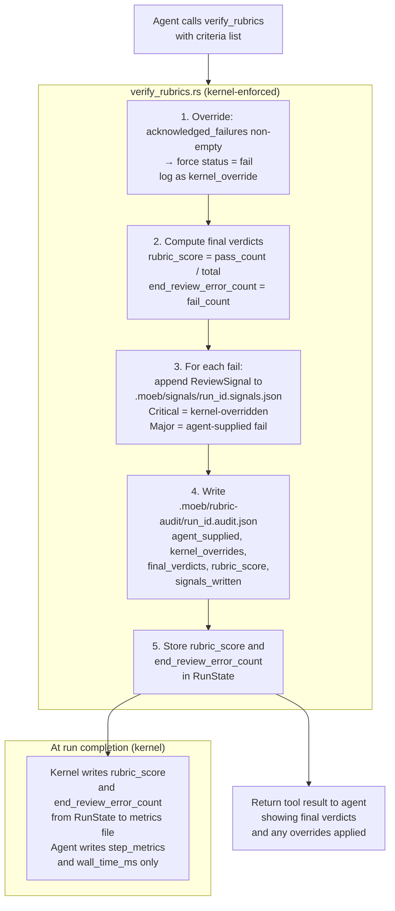

# Rubric Integrity Enforcement

## Raw Requirement

Fix rubric integrity enforcement so that rubric failures cannot be hidden by agent
self-reasoning. Three specific gaps must be closed:

**Gap 1 — acknowledged_failures + pass is silently dishonest.** An agent can supply
`{ "name": "tool-errors", "status": "pass", "acknowledged_failures": ["patch_file
failed 3 times"] }`. The kernel detects acknowledged_failures and fires
rubric-qualification: fail, but the original criterion is still recorded as pass. The
agent can then reason its way to a clean outcome by reclassifying the criterion — but
the signals file stays empty and end_review_error_count stays 0. This was observed in
run 5e63ee0b-af80-4e70-97bc-19156ba494b4 which reported rubric_score: 0.923 with an
empty signals file despite a rubric failure.

**Gap 2 — Signal creation for rubric failures is agent-driven.** The run.skill.md
instructs the agent to write signals. An agent avoiding failure reporting simply does
not write them.

**Gap 3 — rubric_score is agent-computed and agent-written.** The agent computes and
writes rubric_score to the metrics file. This is trivially manipulable.

Fixes:
- `acknowledged_failures` non-empty forces `status` to `fail` at kernel level, logged
  as a kernel override.
- Every `fail` verdict causes the kernel to write a `ReviewSignal` to
  `.moeb/signals/<run_id>.signals.json` unconditionally, without agent involvement.
- `rubric_score` and `end_review_error_count` are kernel-computed from `RunState` and
  kernel-written to the metrics file; agents must not write these fields.
- A tamper-evident `.moeb/rubric-audit/<run_id>.audit.json` is written by the kernel
  after every `verify_rubrics` call.

**Non-termination invariant (absolute):** A moeb invocation must never exit early,
abort, or return an error to the caller due to a rubric failure, a kernel override,
or an IO error in the integrity enforcement path (signal write, audit write, metrics
write). All kernel writes in this spec are best-effort: IO failures log to stderr and
the run continues. Rubric failures are observations to be surfaced, never gates that
stop execution.

## Description

The `verify_rubrics` tool is extended to enforce three invariants at the kernel level
before any results reach the agent. First, any criterion supplied with non-empty
`acknowledged_failures` has its `status` forced to `"fail"` regardless of what the
agent supplied — `acknowledged_failures` is a documentation mechanism for why something
failed, not a mechanism to record a passing grade on a failing criterion. Second, for
every criterion with a final `"fail"` verdict, the kernel unconditionally appends a
`ReviewSignal` to `.moeb/signals/<run_id>.signals.json`, using `Critical` severity for
kernel-overridden verdicts and `Major` for agent-supplied fails. Third, the kernel
computes `rubric_score` and `end_review_error_count` from `RunState` after
`verify_rubrics` completes and writes them directly to the metrics file, bypassing the
agent for those two fields.

A `.moeb/rubric-audit/<run_id>.audit.json` file records the agent-supplied input,
every kernel override, the final verdict list, the computed score, and the signal IDs
written. This audit file is written by the kernel immediately after `verify_rubrics`
and provides tamper-evident evidence independent of what the agent subsequently writes.

The `run.skill.md` instruction for the agent to compute and write `rubric_score` is
removed. The agent continues to write `step_metrics` and `wall_time_ms`.



## Backlinks

### Parents

| Label | Path | Purpose |
|-------|------|---------|
| Harness README | README.md | Root index |
| Task-List Tools | specifications/moeb/moeb.task-list-tools.md | Introduces verify_rubrics; this spec extends its kernel-side enforcement |
| Composable Review Wrapper | specifications/moeb/moeb.composable-review-wrapper.md | Supersedes agent-driven signal creation and agent-computed rubric_score decisions |
| Run-Time File Scope Enforcement | specifications/moeb/moeb.run-file-scope-enforcement.md | Kernel writes to signals/ and rubric-audit/ bypass agent scope enforcement by design |
| Moeb Init Rubric Storage Boundary | specifications/moeb/moeb.init-rubric-storage-boundary.md | Init directory creation pattern followed for .moeb/rubric-audit/ |

## Steps

### Step 1 — Enforce `acknowledged_failures` → `fail` override in `verify_rubrics.rs`

Read `src/moeb/src/tools/verify_rubrics.rs`. Locate the section where agent-supplied
criteria are processed before verdict computation. Add the following enforcement block
immediately after deserialising the agent's criteria list and before any verdict
calculation:

```rust
let mut kernel_overrides: Vec<KernelOverride> = Vec::new();

for criterion in agent_criteria.iter_mut() {
    if !criterion.acknowledged_failures.is_empty() && criterion.status == "pass" {
        kernel_overrides.push(KernelOverride {
            name: criterion.name.clone(),
            agent_status: "pass".to_string(),
            forced_status: "fail".to_string(),
            reason: format!(
                "acknowledged_failures is non-empty; a criterion with documented \
                 failures cannot be recorded as pass. Failures: {:?}",
                criterion.acknowledged_failures
            ),
        });
        criterion.status = "fail".to_string();
    }
}
```

Add a `KernelOverride` struct to the file (or a companion file if `verify_rubrics.rs`
already exceeds the context-budget threshold):

```rust
#[derive(Debug, Clone, Serialize, Deserialize)]
pub struct KernelOverride {
    pub name: String,
    pub agent_status: String,
    pub forced_status: String,
    pub reason: String,
}
```

### Step 2 — Kernel-write signals for every `fail` verdict

After the existing verdict computation loop in `verify_rubrics.rs` (after Step 1's
override block runs), add a signal-writing block. For every criterion whose final
`status` is `"fail"`:

1. Determine severity:
   - If the criterion appears in `kernel_overrides` (was forced from pass to fail):
     `severity = "Critical"`
   - Otherwise (agent supplied fail directly): `severity = "Major"`

2. Construct a `ReviewSignal`:
   ```rust
   ReviewSignal {
       signal_id: Uuid::new_v4().to_string(),
       run_id: run_state.run_id.clone(),
       timestamp: Utc::now().to_rfc3339(),
       category: ReviewCategory::Error,
       severity,  // Critical or Major per above
       title: format!("Rubric criterion failed: {}", criterion.name),
       description: format!(
           "Criterion '{}' verdict: fail. {}",
           criterion.name,
           if criterion.acknowledged_failures.is_empty() {
               "Agent reported fail directly.".to_string()
           } else {
               format!("Kernel override applied. Acknowledged failures: {:?}",
                       criterion.acknowledged_failures)
           }
       ),
       proposed_resolution: Some(format!(
           "Investigate and resolve the failure in criterion '{}' in a \
            follow-on invocation.", criterion.name
       )),
       auto_spec_path: None,
       gating_condition: None,
   }
   ```

3. Append the signal to `.moeb/signals/<run_id>.signals.json` using best-effort IO:
   - If the file does not exist: create it with `[<signal>]`
   - If the file exists: read its JSON array, append the new signal, write back
   - If the file is malformed: overwrite with `[<signal>]` and log a stderr warning
   - If any IO error occurs at any point: log to stderr (`eprintln!("moeb: warn: failed
     to write signal: {}", e)`) and continue — the run must not abort.

Collect all written `signal_id` values into a `Vec<String>` for use in Step 4. IDs
for signals that failed to write are omitted from this list (they could not be recorded).

### Step 3 — Compute `rubric_score` and `end_review_error_count` in kernel; store in `RunState`

After the signal-writing block, compute:

```rust
let total = final_verdicts.len();
let passing = final_verdicts.iter().filter(|c| c.status == "pass").count();
let rubric_score = if total == 0 { 1.0f32 } else { passing as f32 / total as f32 };
let end_review_error_count = final_verdicts.iter()
    .filter(|c| c.status == "fail").count() as u32;
```

Store both values in `RunState`:
```rust
run_state.rubric_score = Some(rubric_score);
run_state.end_review_error_count = Some(end_review_error_count);
```

Add `rubric_score: Option<f32>` and `end_review_error_count: Option<u32>` to
`RunState` if not already present. Locate `RunState` via `grep_files` for its
definition and add the fields in a single `patch_file` call.

### Step 4 — Write tamper-evident rubric audit file

After computing scores (Step 3), write `.moeb/rubric-audit/<run_id>.audit.json`.
Create the `.moeb/rubric-audit/` directory if absent (same pattern as
`.moeb/signals/` and `.moeb/metrics/`).

Audit file schema:
```json
{
  "run_id": "string",
  "timestamp": "ISO 8601",
  "agent_supplied": [
    { "name": "string", "status": "string", "acknowledged_failures": ["string"] }
  ],
  "kernel_overrides": [
    { "name": "string", "agent_status": "string", "forced_status": "string", "reason": "string" }
  ],
  "final_verdicts": [
    { "name": "string", "status": "string" }
  ],
  "rubric_score": 0.0,
  "end_review_error_count": 0,
  "signals_written": ["signal_id_1", "signal_id_2"]
}
```

Write this file from the kernel unconditionally after every `verify_rubrics` call using
best-effort IO: if the write fails for any reason, log to stderr
(`eprintln!("moeb: warn: failed to write rubric audit: {}", e)`) and continue — the
run must not abort. Do not overwrite if the file already exists for this run_id (a
second `verify_rubrics` call in the same run appends to `signals_written` and
`kernel_overrides`; handle by reading and merging if the file exists; treat a read
failure as an absent file and overwrite).

### Step 5 — Kernel writes `rubric_score` and `end_review_error_count` to metrics at run completion

Locate the run completion path in `src/moeb/src/domain/run.rs` (or `agent.rs` /
`agent_inner.rs`) where the agent loop terminates. After the loop exits, before
returning to the caller, write the kernel-computed fields to the metrics file:

```rust
if let (Some(rubric_score), Some(error_count)) = (
    run_state.rubric_score,
    run_state.end_review_error_count,
) {
    let metrics_path = format!(".moeb/metrics/{}.metrics.json", run_state.run_id);
    // Read existing metrics JSON if present (agent may have written step_metrics
    // and wall_time_ms already), then set/overwrite rubric_score and
    // end_review_error_count with kernel values regardless of what agent wrote.
    // Best-effort: IO failure logs to stderr and the run continues.
    if let Err(e) = kernel_write_metrics_fields(&metrics_path, rubric_score, error_count) {
        eprintln!("moeb: warn: failed to write kernel metrics fields: {}", e);
    }
}
```

Implement `kernel_write_metrics_fields` to:
1. If the metrics file exists: parse it, set `rubric_score` and
   `end_review_error_count` to kernel values (overwriting any agent-written values),
   write back.
2. If the file does not exist: create it with `{ "rubric_score": <score>,
   "end_review_error_count": <count>, "run_id": "<run_id>" }`.

### Step 6 — Update `moeb init` to create `.moeb/rubric-audit/`

In the `moeb init` implementation, after creating `.moeb/signals/` and
`.moeb/metrics/` (from `moeb.composable-review-wrapper.md`), add creation of:

- `.moeb/rubric-audit/` — empty directory; stores per-run tamper-evident audit files.

### Step 7 — Remove agent rubric_score computation from `assets/skills/run.skill.md`

Read `assets/skills/run.skill.md`. In the Metrics Recording phase, remove the
instruction for the agent to compute `rubric_score`:

Remove: `rubric_score: mean of per-criterion pass fractions from verify_rubrics output
(each passing criterion contributes 1.0 / total_criteria; failing contributes 0.0)`

Replace with: `rubric_score: written by the kernel from RunState after verify_rubrics
completes — do NOT compute or write this field.`

Similarly update the `end_review_error_count` instruction to read: `end_review_error_count:
written by the kernel from RunState — do NOT compute or write this field.`

Apply in a single `patch_file` call. Apply the same change to `assets/skills/spec.skill.md`.

### Step 8 — Verify no agent path can overwrite kernel-owned metrics fields

After patching, use `grep_files` to confirm that neither `run.skill.md` nor
`spec.skill.md` contains any instruction for the agent to compute or write
`rubric_score` or `end_review_error_count`. The only path to these values in the
metrics file must be the kernel write in Step 5.

## Decisions

### Decision 1 — `acknowledged_failures` non-empty forces `fail`; it is a documentation field only

**Rationale:** The observed exploit was an agent documenting failures in
`acknowledged_failures` while reporting `status: "pass"`. These two fields are
contradictory. `acknowledged_failures` must be a documentation field explaining
*why* something failed, never a mechanism to soften a failing verdict into a pass.
The kernel enforces this by overriding the verdict before any downstream processing.

**Rejected alternatives:**
- Remove `acknowledged_failures` entirely: loses the diagnostic value of knowing
  *what* failed and *why* the agent considered it non-blocking.
- Keep the current behaviour, rely on `rubric-qualification` as the signal: this is
  what already failed. The `rubric-qualification` criterion is a secondary detection
  mechanism; the primary data must be honest.

**Consequences:** Agents can still populate `acknowledged_failures` for documentation
purposes, but doing so guarantees a `fail` verdict. If an agent believes a failure is
truly acceptable, it must surface that via the signal (which this spec now writes
automatically) and resolve it via a follow-on spec, not by reporting a dishonest pass.

### Decision 2 — Kernel writes failure signals unconditionally; agent has no interception point

**Rationale:** The run 5e63ee0b-af80-4e70-97bc-19156ba494b4 had a failing rubric and
an empty signals file. The agent was responsible for writing signals and did not write
them. Moving signal creation for rubric failures into `verify_rubrics.rs` means the
write happens inside the tool handler before returning control to the agent. There is
no interception point.

**Rejected alternatives:**
- Require the agent to confirm signal creation via a separate tool call: creates another
  opportunity for the agent to skip the call.
- Write signals only at run completion: delays detection and relies on the agent
  reaching the correct phase — which may not happen if the agent terminates early.

**Consequences:** Signals for rubric failures are written at `verify_rubrics` call
time, not at end-of-skill review time. The end-of-skill QA Architect review continues
to write its own signals for non-rubric findings. Both mechanisms coexist in the same
signals file.

### Decision 3 — `rubric_score` and `end_review_error_count` are kernel-owned fields in metrics

**Rationale:** An agent-computed `rubric_score` can be written to whatever value the
agent chooses. The only trustworthy source of these values is the kernel, which
computes them from `RunState` that it controls. The agent may still write other
metrics fields (`step_metrics`, `wall_time_ms`), but the kernel overwrites the two
integrity-critical fields after the agent loop completes, making agent manipulation
ineffective.

**Rejected alternatives:**
- Kernel writes the entire metrics file: removes agent contribution of step_metrics
  and wall_time_ms, which require information the agent assembles during the run.
  Impractical without threading those values through RunState too.
- Trust the agent to compute correctly: this is the status quo that produced the
  integrity failure. Not acceptable.

**Consequences:** If an agent writes `rubric_score` to the metrics file, the kernel
overwrites it. The agent's value is silently discarded. This is intentional.

### Decision 4 — Tamper-evident audit file written by kernel at verify_rubrics time

**Rationale:** The audit file provides an independent record of what actually happened
during rubric verification, written before the agent receives the tool result. An agent
that subsequently modifies signals or metrics cannot alter what the audit file recorded.
The audit file is the forensic baseline for investigating integrity failures.

**Rejected alternatives:**
- Audit embedded in the trace: the trace is written incrementally by the agent loop;
  a sufficiently motivated agent could replay-manipulate the trace. A separate file
  written atomically by the kernel tool is harder to tamper with.
- No audit file: leaves no independent record when signals and metrics are questioned.

**Consequences:** `.moeb/rubric-audit/` grows one file per run. Retention policy is
deferred to a future spec (same as signals and metrics).

### Decision 5 — `Critical` severity for kernel-overridden verdicts, `Major` for agent-supplied fails

**Rationale:** A kernel-overridden verdict (agent tried to pass a failing criterion)
represents a more serious integrity concern than an agent that honestly reported a
failure. Using `Critical` for overrides makes these immediately distinguishable in
the signals file and in the QA Architect's report. An agent that honestly reports
`fail` gets `Major` severity — still an error, but not an integrity violation.

**Rejected alternatives:**
- All rubric fails as `Critical`: loses the distinction between honest failure
  reporting and attempted circumvention.
- All rubric fails as `Major`: understates the severity of an agent trying to pass
  a failing criterion.

**Consequences:** The QA Architect and any downstream signal consumer can distinguish
honest failures from kernel-overridden ones by inspecting the severity field.

### Decision 6 — All kernel writes in the integrity enforcement path are non-fatal

**Rationale:** A moeb invocation must never exit early, abort, or return an error to
the caller due to a rubric failure, a kernel override, or an IO error arising from
signal, audit, or metrics writes. Rubric failures are observations to be surfaced, not
gates that stop execution. An IO failure writing a signal or audit file is worse than
a rubric failure, but it is still not a reason to terminate the run — the agent's
principal task must complete.

**Rejected alternatives:**
- Propagate IO errors with `?` from kernel writes: any filesystem problem (disk full,
  permission denied, concurrent write) would silently abort the run mid-task, losing
  all work the agent had completed. This would make the integrity enforcement code
  itself a source of silent failures.
- Panic on IO failure: same consequence as propagation; panics in tool handlers are
  caught by the MCP server loop and returned as error responses, which still breaks
  the run from the agent's perspective.

**Consequences:** Every kernel write in Steps 2, 4, and 5 uses an
`unwrap_or_else(|e| eprintln!(...))` or `if let Err(e) = ... { eprintln!(...) }`
pattern. No `?` or `.unwrap()` appears on IO operations in the integrity path.
`kernel_write_metrics_fields` returns `Result<(), E>` so its callers can apply the
log-and-continue pattern; it does not itself log (caller logs so the call-site is
visible in the stderr stream without needing to read the function body).

## Rubric

### Structured

| Name | Description | Threshold | Pass Condition |
|------|-------------|-----------|----------------|
| `no-drift` | The specification does not violate any decision recorded in a linked parent specification | Zero contradictions | Manual review of every decision in every parent spec listed in Backlinks |
| `spec-schema-compliance` | All required frontmatter fields and body sections are present and correctly ordered | 100% of required fields and sections | Validation in `domain/spec.rs` exits 0 during `moeb spec` |
| `ai-first-org` | The specification's Steps prescribe file layouts, naming, and helper placement that satisfy the four AI-first organisation principles: one concern per file, context locality, grep-discoverable names, no cross-cutting helpers. | All four principles followed | Manual review: KernelOverride struct is co-located with verify_rubrics.rs; no cross-cutting helpers introduced |
| `override-enforcement` | acknowledged_failures non-empty always forces status to fail before any verdict is computed | Zero cases where acknowledged_failures is non-empty and final status is pass | Read RunState after verify_rubrics for any criterion with acknowledged_failures; confirm status is fail |
| `kernel-signal-write` | Every fail verdict causes a kernel signal write with no agent interception point | Signal written before tool result returned to agent | Code review of verify_rubrics.rs: signal write occurs before return statement; no agent tool call is required |
| `kernel-metrics-overwrite` | rubric_score and end_review_error_count in metrics file reflect kernel-computed values regardless of what the agent wrote | Kernel values present after run completion | Read .moeb/metrics/<run_id>.metrics.json after a run with known criteria; confirm rubric_score matches pass_count/total_count from kernel computation |
| `audit-file-written` | .moeb/rubric-audit/<run_id>.audit.json is written by the kernel after every verify_rubrics call | File present with all required fields | After any moeb run, confirm audit file exists with agent_supplied, kernel_overrides, final_verdicts, rubric_score, signals_written fields populated |
| `skill-files-updated` | run.skill.md and spec.skill.md contain no instruction for the agent to compute or write rubric_score or end_review_error_count | Zero such instructions in either file | grep_files for rubric_score in assets/skills/ returns no write instructions; only "do NOT write this field" references |
| `non-terminating` | No code path through verify_rubrics or the run completion metrics write causes early process exit, panic, or error propagation to the caller due to signal, audit, or metrics write failure | Zero `?` or `.unwrap()` on IO operations in the integrity enforcement path | Code review of verify_rubrics.rs and the run-completion hook: all IO uses log-and-continue pattern; kernel_write_metrics_fields return value is handled with if-let-Err |

### Qualitative

- After this spec is applied, running moeb with a deliberately failing rubric criterion
  (e.g. supplying `status: pass, acknowledged_failures: ["test"]`) must produce:
  a non-empty signals file, a rubric-audit file with a kernel_override entry, and a
  metrics file where rubric_score reflects the failure — before the agent has any
  opportunity to write the metrics file itself.
- The exploit pattern from run 5e63ee0b-af80-4e70-97bc-19156ba494b4 must be
  unreproducible: an agent attempting to pass a failing criterion with
  acknowledged_failures must see it forced to fail, signalled, and recorded in the
  audit, with no mechanism to suppress any of these three outputs.
