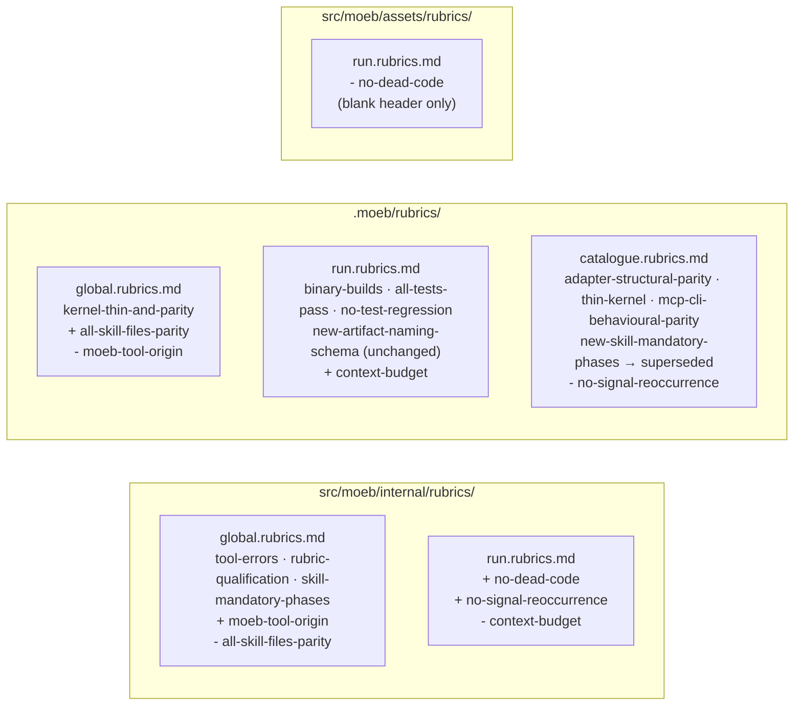

# Rubric Layer Placement Cleanup: Separate Moeb-Invocation from Moeb-Project Criteria

## Raw Requirement

Rubric files conflate moeb-project and moeb-invocation criteria because moeb acts on itself. Five contamination events have been identified: two moeb-project rubrics (`all-skill-files-parity`, `context-budget`) have leaked into binary-bundled internal files; three moeb-invocation rubrics (`moeb-tool-origin`, `no-signal-reoccurrence`, `no-dead-code`) are either misplaced in a project file or in the assets template rather than internal. One duplicate criterion (`new-skill-mandatory-phases`) must be retired. One previously suspected contamination (`new-artifact-naming-schema`) is evaluated and found correctly placed.

## Description

The placement invariant established by `moeb.rubric-context-layers.md` and `moeb.kernel-thin-and-mcp-parity-rubrics.md` is: `src/moeb/internal/rubrics/` holds criteria baked into the binary and injected unconditionally into every moeb invocation on any project; `.moeb/rubrics/` holds criteria that apply only while moeb operates on the moeb codebase; `src/moeb/assets/rubrics/` holds blank table templates copied to new projects by `moeb init`.

This specification corrects five misplacements and retires one duplicate by moving rows between these three locations. No criterion is added, renamed, or reworded. Only file membership changes.

## Diagram



## Backlinks

### Parents

| Label | Path | Purpose |
|-------|------|---------|
| README | [README.md](../../README.md) | Root index |
| Rubric Context Layers | [specifications/moeb/moeb.rubric-context-layers.md](specifications/moeb/moeb.rubric-context-layers.md) | Established internal/ as home for binary-bundled invocation rubrics |
| Kernel Thinness and MCP/CLI Parity Rubrics | [specifications/moeb/moeb.kernel-thin-and-mcp-parity-rubrics.md](specifications/moeb/moeb.kernel-thin-and-mcp-parity-rubrics.md) | Established the internal/ vs assets/ placement policy |
| Add all-skill-files-parity Rubric Criterion | [specifications/moeb/moeb.all-skill-files-parity-rubric.md](specifications/moeb/moeb.all-skill-files-parity-rubric.md) | Placed all-skill-files-parity in internal/global — corrected here |
| Query Agent Tool | [specifications/moeb/moeb.query-agent-tool.md](specifications/moeb/moeb.query-agent-tool.md) | Placed no-dead-code in assets/run — corrected here |

### External

*(none)*

## Steps

### Step 1 — Update `src/moeb/internal/rubrics/global.rubrics.md`

Read the current file. Write the complete updated content: add `moeb-tool-origin` and remove `all-skill-files-parity`. The file must contain exactly these four rows:

```
| Name | Description | Threshold | Pass Condition |
|------|-------------|-----------|----------------|
| `tool-errors` | No ToolHandler errors were recorded during this command invocation. Covers all tool calls on both CLI and MCP paths via `RealToolExecutor::execute`. Applies to every moeb command. | Zero tool errors | Kernel-authoritative: injected by `verify_rubrics` from `RunState.tool_errors`. Do not supply a verdict — any agent-supplied entry is overridden. |
| `rubric-qualification` | No Pass verdicts with acknowledged failures were issued during this command invocation. An agent that observes a failure but passes a criterion must populate `acknowledged_failures` in the verdict object. Applies to every moeb command. | Zero qualified Pass verdicts | Kernel-authoritative: injected by `verify_rubrics` by scanning `acknowledged_failures` on incoming Pass verdicts. Do not supply a verdict — any agent-supplied entry is overridden. |
| `skill-mandatory-phases` | The skill loaded for this run contains all mandatory phase headings. The agent checks its own prompt context (the loaded skill content is already present) for the exact strings: "Verify", "End-of-Skill Review", "Metrics Recording", "Commit", "Tag", "Complete". No file read is required. | All six mandatory headings present | Agent scans skill content in its loaded context; fails if any mandatory heading string is absent |
| `moeb-tool-origin` | All tool calls made during this invocation must originate from moeb's own tool registry. If an external tool (not in the moeb registry) was used because no moeb equivalent exists, the agent must write a MissingMoebTool signal immediately after each such call. The criterion always fails when any external tool is used, whether or not a signal was written. | Zero external tool calls | Agent reviews the conversation for calls to non-moeb tools (e.g. Bash, Edit, Write, Read, Glob, Grep, WebFetch, WebSearch in Claude Code MCP mode). Supplies Pass if none were made. If external tools were used with MissingMoebTool signals, supplies Fail with `acknowledged_failures` listing each signal title. If external tools were used without signals, supplies Fail with the unlogged tool names in the note. |
```

### Step 2 — Update `src/moeb/internal/rubrics/run.rubrics.md`

Read the current file. Write the complete updated content: remove `context-budget`, add `no-dead-code` and `no-signal-reoccurrence`. The file must contain the following content (two data rows):

```
| Name | Description | Threshold | Pass Condition |
|------|-------------|-----------|----------------|
| `no-dead-code` | When a specification explicitly removes a tool, function, module, or file, the implementing agent must verify that the removed item no longer exists in the codebase before marking the run complete. | Zero removed items remaining | grep_files confirms absence of each deleted file path and each deleted symbol name listed in the spec's removal steps |
| `no-signal-reoccurrence` | No canonical signal in `.moeb/signals/catalogue/` has `status: reopened` due to this run | Zero reopened signals introduced by this run | Run review: scan `.moeb/signals/index.md`; confirm no entry carries `status: reopened` as a result of changes made during this run. Mark `na` if `.moeb/signals/` does not exist in the project. |
```

### Step 3 — Update `src/moeb/assets/rubrics/run.rubrics.md`

Read the current file. Write the complete file content as a blank table template with no data rows:

```
| Name | Description | Threshold | Pass Condition |
|------|-------------|-----------|----------------|
```

### Step 4 — Update `.moeb/rubrics/global.rubrics.md`

Read the current file. Write the complete updated content: remove `moeb-tool-origin` and add `all-skill-files-parity`. Preserve the preamble heading and descriptive paragraph unchanged. The table must contain exactly these two rows:

```
## Project global rubric criteria

The following criteria apply to every `moeb` command executed in this project. Include them
in your `verify_rubrics` call along with any criteria in the specification's own `## Rubric`
section.

| Name | Description | Threshold | Pass Condition |
|------|-------------|-----------|----------------|
| `kernel-thin-and-parity` | No domain-specific or workflow-specific coordination logic may be placed in kernel Rust code when it can live in skill markdown or role files. Every tool registered in the CLI tool registry must also be registered in the MCP stdio server tool list. | Zero violations | Spec review: no proposed step places review/coordination logic in Rust; Run review: grep confirms no skill-specific logic in kernel tools; tool lists in tools/mod.rs and the MCP server match exactly |
| `all-skill-files-parity` | Whenever a spec adds, removes, or modifies a workflow phase in any one of the three canonical skill files (run.skill.md, spec.skill.md, fix_signal.skill.md), the spec must contain an explicit Step for each of the other two files — either applying the equivalent change or documenting with rationale why that file is intentionally excluded. | Zero unaddressed canonical skill files when any canonical skill file phase is modified | Run agent reviews the steps of the spec under implementation. If no canonical skill file phase is added, removed, or modified, mark `na`. If one or more canonical skill file phases are modified, verify that the spec contains a step for each of the other two canonical skill files (addressing the equivalent change or stating an exclusion rationale). Fail if any of the other two files has neither a qualifying step nor a documented exclusion rationale. |
```

### Step 5 — Update `.moeb/rubrics/run.rubrics.md`

Read the current file. Write the complete updated content: add `context-budget`. Do not remove or alter `new-artifact-naming-schema` — per Decision 7, it is correctly placed here. The table must contain exactly these five rows:

```
## Project run rubric criteria

The following criteria apply to every `moeb run` execution in this project. Include them
in your `verify_rubrics` call along with the baseline criteria above and any criteria
in the specification's own `## Rubric` section.

| Name | Description | Threshold | Pass Condition |
|------|-------------|-----------|----------------|
| `binary-builds` | `cargo build --release` completes without error | Zero errors | CI build exits 0 |
| `all-tests-pass` | `cargo test` completes without failure | Zero failures | `cargo test` exits 0 |
| `no-test-regression` | All tests present before this change pass without modification to test code | Zero failures | `cargo test` exits 0; no test file edited |
| `new-artifact-naming-schema` | Any specification that introduces a new persisted artifact type must ship with a machine-readable naming schema in `src/moeb/internal/schemas/` whose `filename_convention` field documents the exact file naming pattern. | One schema file per new artifact type | Run review: confirm `src/moeb/internal/schemas/<artifact>.schema.json` exists for each new artifact type and its `filename_convention` field is present and non-empty |
| `context-budget` | All implementation files created or modified during this run are ≤ 300 lines; `*_tests.rs` companion files are ≤ 400 lines. If any file exceeds budget, refactor it before passing this criterion. | Zero over-budget files after any required refactoring | Agent checks line counts of every file written; refactors any over-budget file, then marks pass only after all files meet the budget |
```

### Step 6 — Update `.moeb/rubrics/catalogue.rubrics.md`

Read the current file. Write the complete updated content with two changes:

1. Remove the `no-signal-reoccurrence` row entirely.
2. Change the `new-skill-mandatory-phases` row's `Status` cell from `active` to `superseded — duplicate of skill-mandatory-phases in src/moeb/internal/rubrics/global.rubrics.md`.

The `adapter-structural-parity`, `thin-kernel`, and `mcp-cli-behavioural-parity` rows are unchanged.

### Step 7 — Verify placements

Call `grep_files` with pattern `moeb-tool-origin` scoped to `src/moeb/internal/rubrics/global.rubrics.md` — must match. Call `grep_files` with pattern `moeb-tool-origin` scoped to `.moeb/rubrics/global.rubrics.md` — must not match.

Call `grep_files` with pattern `all-skill-files-parity` scoped to `.moeb/rubrics/global.rubrics.md` — must match. Call `grep_files` with pattern `all-skill-files-parity` scoped to `src/moeb/internal/rubrics/global.rubrics.md` — must not match.

Call `grep_files` with pattern `context-budget` scoped to `.moeb/rubrics/run.rubrics.md` — must match. Call `grep_files` with pattern `context-budget` scoped to `src/moeb/internal/rubrics/run.rubrics.md` — must not match.

Call `grep_files` with pattern `no-dead-code` scoped to `src/moeb/internal/rubrics/run.rubrics.md` — must match. Call `grep_files` with pattern `no-dead-code` scoped to `src/moeb/assets/rubrics/run.rubrics.md` — must not match.

## Decisions

### Decision 1 — `moeb-tool-origin` is a universal invocation rubric

**Rationale:** This criterion governs which tools the orchestrating agent may call — a runtime property of how moeb runs, not of which project it operates on. Placing it in `.moeb/rubrics/` meant it was absent from every project's baseline except moeb's own.

**Alternatives:**

| Option | Reason Rejected |
|--------|-----------------|
| Keep in `.moeb/rubrics/global.rubrics.md` | Too narrow; should apply to all moeb projects |
| Move to `src/moeb/assets/rubrics/global.rubrics.md` | Assets are blank init templates; criteria here pollute new projects |

**Consequences:** `moeb-tool-origin` is injected via the binary into every moeb command's rubric baseline across all projects.

---

### Decision 2 — `all-skill-files-parity` is a moeb-project rubric

**Rationale:** The criterion description explicitly names `run.skill.md`, `spec.skill.md`, and `fix_signal.skill.md` — moeb's own canonical skill files. No other project would have these three files in this role. Applied universally, this criterion would fail spuriously or trivially pass for every non-moeb project.

**Alternatives:**

| Option | Reason Rejected |
|--------|-----------------|
| Keep in `src/moeb/internal/rubrics/global.rubrics.md` | References moeb-specific files; not universally applicable |
| Parameterise the canonical skill file names | Adds kernel complexity to solve a single-project concern |

**Consequences:** `all-skill-files-parity` moves to `.moeb/rubrics/global.rubrics.md` and applies to every command in the moeb project only.

---

### Decision 3 — `context-budget` is a moeb-project rubric

**Rationale:** The 300/400-line limits are moeb's own code quality standards chosen to keep source files within AI agent context windows. Imposing these limits universally via internal rubrics would block projects with legitimately larger files from using moeb's run skill.

**Alternatives:**

| Option | Reason Rejected |
|--------|-----------------|
| Keep in `src/moeb/internal/rubrics/run.rubrics.md` | Forces moeb's internal architecture standards onto all projects |
| Make configurable per project | Scope is wrong regardless of configurability |

**Consequences:** `context-budget` moves to `.moeb/rubrics/run.rubrics.md` and applies only to moeb run invocations.

---

### Decision 4 — `no-dead-code` belongs in `internal/run`, not `assets/run`

**Rationale:** Verifying that removed artifacts are actually absent is universally sound for any moeb-governed project. Placing it in assets caused it to be written into new project rubric templates as a project criterion rather than injected by the binary. Signal `a1000034-0601-4000-8000-000000000034` already identified this assets pollution pattern.

**Alternatives:**

| Option | Reason Rejected |
|--------|-----------------|
| Keep in `src/moeb/assets/rubrics/run.rubrics.md` | Assets are blank init templates; criteria here pollute new projects |

**Consequences:** `no-dead-code` moves to `internal/run.rubrics.md` and is injected into every run. The assets file becomes a blank table.

---

### Decision 5 — `no-signal-reoccurrence` belongs in `internal/run`

**Rationale:** Any project using moeb's signal infrastructure should enforce that a run does not reopen previously resolved signals. The criterion is a property of how moeb manages quality tracking across runs, not a moeb-codebase-specific constraint. Projects without `.moeb/signals/` can mark it `na`.

**Alternatives:**

| Option | Reason Rejected |
|--------|-----------------|
| Keep in `.moeb/rubrics/catalogue.rubrics.md` | Applied only to the moeb project via catalogue selection; should be universal |

**Consequences:** `no-signal-reoccurrence` moves to `internal/run.rubrics.md` with a `na`-if-absent escape clause for projects without the signal infrastructure.

---

### Decision 6 — `new-skill-mandatory-phases` is retired as superseded

**Rationale:** `new-skill-mandatory-phases` in the catalogue and `skill-mandatory-phases` in `internal/global` test the same property. The internal entry is the correct home. The catalogue entry is retired to prevent redundant evaluation and wording divergence.

**Alternatives:**

| Option | Reason Rejected |
|--------|-----------------|
| Keep both | Redundant evaluation; divergence risk as wording evolves independently |
| Retire the internal entry | Internal is the correct home for a universal invocation rubric |

**Consequences:** `new-skill-mandatory-phases` row in the catalogue carries `superseded` status. The internal `skill-mandatory-phases` entry remains authoritative.

---

### Decision 7 — `new-artifact-naming-schema` stays in `.moeb/rubrics/run.rubrics.md`

**Rationale:** The criterion's pass condition references `src/moeb/internal/schemas/` — a moeb-specific path. Applied to another project, it would incorrectly require files under moeb's own source tree. Signal `a1000080` listed this for moving, but that assessment was incorrect. The criterion is correctly placed as a moeb-project rubric.

**Alternatives:**

| Option | Reason Rejected |
|--------|-----------------|
| Move to `internal/run` | Pass condition references moeb-specific path; would misfire on all non-moeb projects |
| Generalise the path in the criterion | Requires rewording, which is outside this specification's scope |

**Consequences:** `new-artifact-naming-schema` remains in `.moeb/rubrics/run.rubrics.md` unchanged.

## Rubric

### Structured

| Name | Description | Threshold | Pass Condition |
|------|-------------|-----------|----------------|
| `tool-errors` | No ToolHandler errors were recorded during this command invocation. Covers all tool calls on both CLI and MCP paths via `RealToolExecutor::execute`. Applies to every moeb command. | Zero tool errors | Kernel-authoritative: injected by `verify_rubrics` from `RunState.tool_errors`. Do not supply a verdict — any agent-supplied entry is overridden. |
| `rubric-qualification` | No Pass verdicts with acknowledged failures were issued during this command invocation. An agent that observes a failure but passes a criterion must populate `acknowledged_failures` in the verdict object. Applies to every moeb command. | Zero qualified Pass verdicts | Kernel-authoritative: injected by `verify_rubrics` by scanning `acknowledged_failures` on incoming Pass verdicts. Do not supply a verdict — any agent-supplied entry is overridden. |
| `skill-mandatory-phases` | The skill loaded for this run contains all mandatory phase headings. The agent checks its own prompt context (the loaded skill content is already present) for the exact strings: "Verify", "End-of-Skill Review", "Metrics Recording", "Commit", "Tag", "Complete". No file read is required. | All six mandatory headings present | Agent scans skill content in its loaded context; fails if any mandatory heading string is absent |
| `no-drift` | The specification does not violate any decision recorded in a linked parent specification | Zero contradictions | Manual review of every decision in every parent spec listed in Backlinks |
| `spec-schema-compliance` | All required frontmatter fields and body sections are present and correctly ordered | 100% of required fields and sections | Validation in `domain/spec.rs` exits 0 during `moeb spec` |
| `ai-first-org` | The specification's Steps prescribe file layouts, naming, and helper placement that satisfy the four AI-first organisation principles: one concern per file, context locality, grep-discoverable names, no cross-cutting helpers. | All four principles followed | Manual review: no step produces a file that mixes concerns, no name is generic across the codebase, all helpers are co-located with their callers or promoted to a precisely named module |
| `branch-clean-at-exit` | After Phase 9 (Commit), the working tree contains no uncommitted changes; any dirty state detected in Phase 9a has been resolved by retry commit (Case A) or by signal emission and cleanup commit (Case B) | Zero uncommitted changes at spec skill exit | Agent verifies that `git_status` returned empty output after Phase 9, or that a retry (Case A) or cleanup commit (Case B) was issued and the branch is clean |
| `kernel-thin-and-parity` | No domain-specific or workflow-specific coordination logic may be placed in kernel Rust code when it can live in skill markdown or role files. Every tool registered in the CLI tool registry must also be registered in the MCP stdio server tool list. | Zero violations | Spec review: no proposed step places review/coordination logic in Rust; Run review: grep confirms no skill-specific logic in kernel tools; tool lists in tools/mod.rs and the MCP server match exactly |
| `moeb-tool-origin` | All tool calls made during this invocation must originate from moeb's own tool registry. If an external tool (not in the moeb registry) was used because no moeb equivalent exists, the agent must write a MissingMoebTool signal immediately after each such call. The criterion always fails when any external tool is used, whether or not a signal was written. | Zero external tool calls | Agent reviews the conversation for calls to non-moeb tools (e.g. Bash, Edit, Write, Read, Glob, Grep, WebFetch, WebSearch in Claude Code MCP mode). Supplies Pass if none were made. If external tools were used with MissingMoebTool signals, supplies Fail with `acknowledged_failures` listing each signal title. If external tools were used without signals, supplies Fail with the unlogged tool names in the note. |
| `all-skill-files-parity` | Whenever a spec adds, removes, or modifies a workflow phase in any one of the three canonical skill files (run.skill.md, spec.skill.md, fix_signal.skill.md), the spec must contain an explicit Step for each of the other two files — either applying the equivalent change or documenting with rationale why that file is intentionally excluded. | Zero unaddressed canonical skill files when any canonical skill file phase is modified | Run agent reviews the steps of the spec under implementation. If no canonical skill file phase is added, removed, or modified, mark `na`. If one or more canonical skill file phases are modified, verify that the spec contains a step for each of the other two canonical skill files (addressing the equivalent change or stating an exclusion rationale). Fail if any of the other two files has neither a qualifying step nor a documented exclusion rationale. |
| `placement-verified` | After implementation, each moved criterion exists in exactly its destination file and not in its source file | Zero criteria present in both source and destination | Step 7 grep_files calls confirm correct placement for all four moved criteria |
| `catalogue-superseded-row` | `new-skill-mandatory-phases` row in `.moeb/rubrics/catalogue.rubrics.md` carries `superseded` in its Status cell | One superseded row | File read confirms the Status cell reads `superseded` for `new-skill-mandatory-phases` |

### Qualitative

- **No criteria reworded:** Every moved criterion must be reproduced verbatim in its new location. An implementing agent must not alter description, threshold, or pass condition text while relocating the row.
- **Blank assets template:** `src/moeb/assets/rubrics/run.rubrics.md` must contain only the table header row — no data rows.
