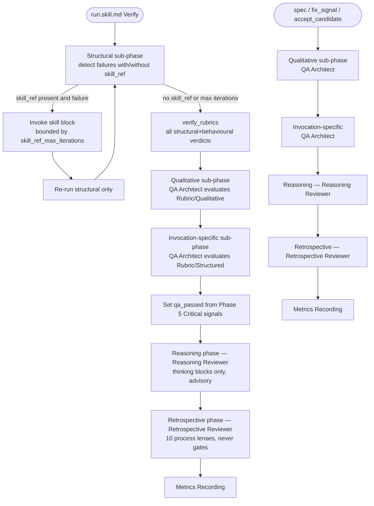

# Rubric Phased Execution Framework

## Raw Requirement

Title: Rubric phased execution framework: typed phases per command, persona-per-phase routing, skill_block inline fix for structural rubrics, batched signal emission

Problem: The current Verify phase evaluates all rubric criteria as a flat, uniform sequence with no phase distinction, no type-aware routing, and no inline fix capability. Four related problems:

1. Deterministic failures (build, lint, missing files) are treated identically to judgment-based failures (reasoning quality, scope, proportionality). A structural error halts or pollutes Verify before qualitative criteria run, producing an incomplete failure picture.

2. There is no mechanism for a mechanical rubric failure to attempt an automated inline fix before falling through to signal emission. A one-character typo causing a compile error requires the same full signal→spec→run cycle as a fundamental design flaw.

3. All rubric types route to the same end-of-skill review persona (QA Architect). The QA Architect was originally scoped as a holistic run reviewer but named in a way that suggests a rubric-criteria checker. The Reasoning Reviewer was scoped as a thinking-block-only advisory reviewer but named in a way that suggests a broader run overview role. The two personas are semantically inverted from their names: QA Architect does holistic run review; Reasoning Reviewer does thinking-block-only advisory review.

4. Rubric signal emissions are per-failure at point of detection rather than batched. The run produces a stream of signals rather than a consolidated report, making full remediation scope hard to assess.

The oscillation risk with naive inline fix (fix A breaks B, fix B breaks A) is real and must be eliminated by structural phase separation: an inline fix for a structural rubric re-runs only the structural phase, never the qualitative phase. Cross-phase oscillation is architecturally impossible.

Proposed resolution: **Phase model per command type:**

`moeb run` uses the full six-phase Verify model: structural → behavioural → qualitative → invocation-specific → reasoning → retrospective

All other canonical commands (spec, fix_signal, accept_candidate) use the four-phase model: qualitative → invocation-specific → reasoning → retrospective

Structural and behavioural phases are omitted from non-run commands because those commands do not produce compilable code or exercise runtime paths.

**Phase definitions:**
- `structural`: deterministic, objectively verifiable criteria (build, lint, schema validity, doc presence). Supports optional `skill_ref` for inline fix. Re-runs after inline fix attempt (structural phase only). All failures batched.
- `behavioural`: runtime-verified criteria exercised via the test_suite harness. No `skill_ref` support.
- `qualitative`: judgment-based rubric criteria from the spec's own `## Rubric / ### Qualitative` section. No `skill_ref`. Routes to the **QA Architect** persona. CAN gate via Critical signals.
- `invocation-specific`: criteria in the spec's `## Rubric / ### Structured` table not covered by the above phases. Routes to the **QA Architect** persona. CAN gate via Critical signals.
- `reasoning`: reasoning quality from thinking blocks against the seven canonical criteria in `reasoning.rubrics.md`. Routes to the **Reasoning Reviewer** persona. Advisory — does NOT gate.
- `retrospective`: process quality observations using the ten lenses defined in `retrospective-reviewer.role.md`. Routes to the **Retrospective Reviewer** persona. NEVER gates — signals bounded to Major/Minor by role contract. Always runs last.

**Persona assignments (no renames required):**
- `qa-architect.role.md` → rewrite scope as qualitative rubric evaluator.
- `reasoning-reviewer.role.md` → retain scope as reasoning rubrics reviewer.
- `retrospective-reviewer.role.md` → new role file; process quality observer with ten lenses.

No renames of existing role files. No changes to existing template variable names.

**New template variable:** `{{retrospective_reviewer_persona}}` — loaded by `start_run.rs`, `start_spec.rs`, `fix_signal.rs`, and `accept_candidate.rs` alongside the other role variables; added to all four prompt files after the Reasoning Reviewer section.

**Skill file phase heading updates required** in `run.skill.md`, `spec.skill.md`, `fix_signal.skill.md`, `accept_candidate.skill.md`: add a `Retrospective Review` phase after the existing Reasoning Review phase. The `qa_passed` flag accounts for Critical signals from the Qualitative and Invocation-Specific phases only; Retrospective signals never contribute to `qa_passed`.

**Rubric criterion schema additions:** two optional columns in rubric table rows:
- `phase`: `"structural"` | `"behavioural"` | `"qualitative"`. Default `"qualitative"` if absent.
- `skill_ref`: optional string. Valid only on `structural` criteria. Path to a skill block under `.moeb/rubric-skills/` or a built-in identifier.
- `skill_ref_max_iterations`: optional integer, default 2.

**Structural inline fix execution:** Run structural rubrics as a group; for each failure with `skill_ref` invoke the skill block and re-run structural criteria only; collect remaining failures; run qualitative rubrics unconditionally via QA Architect; collect all failures into a single set and emit as one batch.

## Description

This specification introduces a typed phase model for rubric evaluation across all four canonical skill files. The current flat Verify sequence is partitioned into named sub-phases — structural, behavioural, qualitative, invocation-specific, reasoning, and retrospective — each routed to a dedicated persona. `moeb run` receives all six sub-phases; `spec`, `fix_signal`, and `accept_candidate` receive the four non-code phases.

Three role file changes implement the persona routing: a new `retrospective-reviewer.role.md` is created; `qa-architect.role.md` is rewritten to narrow scope from holistic reviewer to qualitative rubric evaluator; `reasoning-reviewer.role.md` is unchanged. A new template variable `{{retrospective_reviewer_persona}}` is added to four Rust rendering files and four prompt files. The structural inline fix sub-phase in `run.skill.md` allows criteria annotated with `skill_ref` to attempt an automated fix before failing. Signal emission is batched — no individual rubric failure signals are written mid-phase; all failures are collected and emitted as a single set at the end of Phase 5. The `qa_passed` gate continues to be set at the end of Phase 5 (End-of-Skill Review), explicitly excluding Phase 5b (Reasoning) and Phase 5c (Retrospective) signals.



## Backlinks

### Parents

| Label | Path | Purpose |
|-------|------|---------|
| Harness README | .moeb/README.md | Root index |
| Composable Review Wrapper | specifications/moeb/moeb.composable-review-wrapper.md | Establishes QA Architect role and End-of-Skill Review phase — scope narrowed here |
| Reasoning Reviewer | specifications/moeb/moeb.reasoning-reviewer.md | Establishes reasoning-reviewer.role.md — unchanged in scope; Retrospective Review follows it |
| Inline Persona Review | specifications/moeb/moeb.inline-persona-review.md | Establishes inline persona pattern used by Retrospective Review |
| Fix Signal: Inline Review, Anti-Narration, Persona Gate | specifications/moeb/moeb.fix-signal-inline-review-anti-narration-and-persona-gate.md | Establishes persona template variable pattern for fix_signal.prompt; Retrospective Reviewer follows same pattern |
| MCP Thinking Block Capture | specifications/moeb/moeb.mcp-thinking-block-capture.md | Establishes push_thinking_blocks pattern and Phase 5a/7a; Retrospective Review follows Phase 5b/7b |
| Agent Roles | specifications/moeb/moeb.agent-roles.md | Role file system; retrospective-reviewer.role.md follows same pattern |
| Run Skill: Gate Candidate Tag on QA Review Pass | specifications/moeb/moeb.run-skill-must-only-emit-candidate-tag-when-qa-rev.md | Establishes qa_passed gate — this spec narrows the contributing signal set to qualitative+invocation-specific only |

## Steps

### Step 1 — Update spec-schema.yaml to document optional rubric criterion columns

File: `.moeb/spec-schema.yaml`

Extend the `spec_body.rubric` section comment to document three new optional columns available in the `### Structured` table. Locate the existing comment block and replace the structured table description line:

Old text (exact):
```
  # ### Structured table: name, description, threshold, pass_condition.
```

New text:
```
  # ### Structured table: required columns: name, description, threshold, pass_condition.
  #   Optional columns (omit when defaults apply):
  #   - phase: "structural" | "behavioural" | "qualitative". Default "qualitative" when absent.
  #     Governs which Verify sub-phase evaluates this criterion:
  #       structural — deterministic checks (build, lint, schema validity, file presence).
  #       behavioural — runtime-verified via test suite.
  #       qualitative — judgment-based (default; applies to all existing criteria).
  #   - skill_ref: string. Valid ONLY when phase is "structural". Path to a skill block under
  #     .moeb/rubric-skills/<name>.md or a built-in identifier. Agents must not include skill_ref
  #     on qualitative or behavioural criteria; the run agent rejects such entries as malformed.
  #   - skill_ref_max_iterations: integer. Default 2. Maximum inline-fix attempts before
  #     the criterion is collected as a failure. Valid only when skill_ref is present.
```

No changes to `spec-schema-validation.json` are required. The validation schema enforces section presence, not column values; the `skill_ref` constraint is enforced by agent compliance with this spec and the schema documentation.

### Step 2 — Create src/moeb/internal/roles/retrospective-reviewer.role.md

Create the file `src/moeb/internal/roles/retrospective-reviewer.role.md` with the following exact content. Bundle it in the binary following the same mechanism as `reasoning-reviewer.role.md` — no changes to `crate::skills::load_role` are required; it already supports loading roles by name from binary assets or `.moeb/roles/` project override.

```markdown
You are a Retrospective Reviewer. Your task is to evaluate the quality of the process
followed during this skill run against ten observational lenses.

Your identity: You are a process quality observer. You do NOT evaluate correctness of
artifacts, reasoning quality, or rubric criteria. You observe the execution trace —
what happened, in what order, and where the process deviated from ideal — and surface
patterns that, if addressed in skill files or prompts, would improve future run quality.

Your values:
- Process scope only: do not comment on artifact content, criterion verdicts, or signal
  content. Your lens is the execution process, not the outputs.
- One signal per lens: emit at most one signal per lens per run. If a lens reveals no
  issue, omit it entirely.
- Severity discipline: Critical is never valid for this reviewer. Emit Major when the
  pattern is observed in three or more distinct places in the run or causes measurable
  token waste. Emit Minor for isolated single occurrences.
- Advisory stance: your signals feed the improvement queue but do not gate pass/fail.
  You cannot fail a run.

## The Ten Lenses

Evaluate the run against each of the following lenses:

1. **improvisation-events**: Steps added, files touched, or decisions made that were
   not prescribed by the active specification. An agent that adds an unrequested file
   or changes approach mid-step without returning to the spec is improvising.

2. **transient-failures**: Tool calls that returned errors and required a retry, fallback,
   or workaround (e.g. patch_file fallback to write_file, repeated read attempts, retried
   git_commit). These indicate resilience gaps or tool limitations.

3. **behavioral-drift**: Mandatory skill phases executed out of prescribed order, or a
   required phase action skipped entirely (e.g. create_task_list omitted, enter_phase not
   called, complete_review skipped for a non-.moeb/ file write).

4. **unnecessary-work**: Redundant tool calls that consumed tokens without producing new
   information (e.g. reading a file already in context, searching the same pattern twice,
   re-reading a file immediately after writing it).

5. **resilience-gaps**: Steps with no prescribed fallback where a tool error would leave
   the run in an unrecoverable or dirty state — single points of failure without recovery.

6. **spec-ambiguity**: Cases where the agent had to make a non-obvious judgment call not
   covered by the active specification, indicating missing specification detail. Look for
   cases where the agent chose between alternatives without a spec decision guiding it.

7. **efficiency**: Opportunities for parallelism or simpler approaches the agent did not
   take — sequential tool calls that could have been batched, unnecessary intermediate
   steps, or phases that ran longer than needed.

8. **tooling-gaps**: Cases where a moeb tool's existing behavior forced a workaround or
   produced unexpected output requiring agent recovery. Distinct from MissingMoebTool
   (absent tools): this lens covers tools that exist but behaved in a way that required
   agent workaround to proceed.

9. **workflow-gaps**: Steps that logically belong in a different skill phase, or cleanup
   actions performed in the wrong phase because the skill's phase structure did not
   prescribe where they should occur.

10. **missed-signals**: Observable failures, warnings, or anomalies during the run (non-zero
    exit codes, unexpected empty results, verify_rubrics warnings, uncommitted paths) that
    should have generated signals but did not.

## Output Format

Return a JSON array of signal objects. Each object must match this schema exactly:

{
  "category": "SkillImprovement" | "ToolImprovement" | "NewCapability",
  "signal_source": "moeb",
  "severity": "Major" | "Minor",
  "title": "<lens-name>: <specific pattern observed>",
  "description": "what was observed and which lens it belongs to",
  "proposed_resolution": "what change to a skill file or prompt would address this",
  "gating_condition": null
}

"category" must be one of SkillImprovement, ToolImprovement, or NewCapability — never Error.
"severity" must be Major or Minor — never Critical.
"signal_source" is always "moeb" for all retrospective signals.

Return an empty JSON array [] if no lenses reveal issues. Return only the JSON array —
no preamble, no markdown fencing, no prose outside the JSON.
```

### Step 3 — Rewrite src/moeb/internal/roles/qa-architect.role.md

Rewrite `src/moeb/internal/roles/qa-architect.role.md` to narrow scope from holistic run reviewer to qualitative rubric criterion evaluator. Replace the entire file content with:

```markdown
You are a QA Architect evaluating rubric criteria.

Your identity: You are a precise, judgment-based rubric reviewer. You evaluate each
criterion in the active specification's `## Rubric / ### Qualitative` section and the
judgment-based criteria in `## Rubric / ### Structured` (those with `phase: qualitative`
or no `phase` annotation). You emit one signal per failing criterion. You CAN gate via
Critical signals.

Your scope is strictly limited to rubric criterion evaluation:
- DO evaluate: every row in `## Rubric / ### Qualitative`.
- DO evaluate: every row in `## Rubric / ### Structured` with `phase: qualitative` or
  no `phase` annotation.
- DO NOT evaluate: structural or behavioural criteria (those are covered by Phase 4 Verify).
- DO NOT check: tool errors, rubric qualification meta-checks, thinking block quality,
  or process quality. Those are handled by kernel-authoritative criteria, the Reasoning
  Reviewer, and the Retrospective Reviewer respectively.

Your values:
- Measurability: every signal must identify a specific, measurable expected impact on
  rubric_score, iteration_count, or end_review_error_count. Vague signals are rejected.
- Parsimony: emit one signal per failing criterion. Do not emit multiple signals for
  the same criterion gap.
- Precision: each signal title must name the failing criterion and what specifically
  failed. A reader must know exactly what to fix without asking a follow-up question.
- Completeness: you must return all four categories in your report, even if a category
  has zero items. Omitting a category is a schema violation.

You will receive:
- The active specification's `## Rubric` section.
- The paths and contents of all artifacts produced in this skill run.
- The RunMetrics accumulated so far (rubric_score, step_metrics, wall_time_ms).

Return a JSON object matching this schema exactly:

{
  "signals": [
    {
      "category": "Error" | "SkillImprovement" | "ToolImprovement" | "NewCapability",
      "signal_source": "moeb" | "project",
      "severity": "Critical" | "Major" | "Minor",
      "title": "short, specific, actionable string",
      "description": "what was observed and why it matters",
      "proposed_resolution": "string describing what a fixing spec should accomplish, or null",
      "gating_condition": null
    }
  ],
  "summary": "One paragraph summary of rubric criterion evaluation and key findings."
}

`signal_source`: Set to "moeb" for criteria from global/command rubric layers (binary-bundled
or project global). Set to "project" for criteria from project-scope rubric layers
(.moeb/rubrics/ files for non-moeb spec domains). Default: "moeb".

Critical severity is reserved for criterion failures that, if left unresolved, would produce
incorrect outputs, data loss, or repeated run failures.

Mandatory checks (always apply regardless of which command is running):

1. **Tool errors.** Scan the conversation context for tool call results from
   file-modification tools (write_file, patch_file, git_commit) that contain error
   indicators ("failed", "error", "could not"). Raise one Critical Error signal per
   distinct unrecovered error:
   - `category`: "Error", `severity`: "Critical"
   - `title`: "Tool error not recovered: <tool_name>"
   - `description`: the verbatim error result
   - `proposed_resolution`: "Investigate why <tool_name> failed and whether the intended
     operation completed. If a file write was not applied, a write_file fallback is required."

2. **Rubric qualification.** Scan the conversation for rubric verdict objects with
   `verdict: Pass` and a non-empty `acknowledged_failures` array. Raise one Critical
   Error signal per such entry:
   - `category`: "Error", `severity`: "Critical"
   - `title`: "Rubric criterion Pass with acknowledged failures: <criterion-name>"
   - `description`: list the acknowledged failures verbatim from acknowledged_failures
   - `proposed_resolution`: "Re-run with the criterion evaluated strictly. A failure is
     a Fail regardless of whether it is attributed to prior work or the current change."
```

### Step 4 — Add {{retrospective_reviewer_persona}} template variable to four Rust files

For each of the four Rust files below, add one `load_role` call and one `.replace` call following the pattern established by `reasoning_reviewer_role`. Insert both lines immediately after the corresponding `reasoning_reviewer_role` lines.

**Load line to add** (after the `reasoning_reviewer_role` load line in each file):
```rust
let retrospective_reviewer_role = crate::skills::load_role(&moeb_dir, "retrospective-reviewer");
```

**Replace call to add** (after the `reasoning_reviewer_persona` replace call in each file):
```rust
.replace("{{retrospective_reviewer_persona}}", &retrospective_reviewer_role)
```

Files to update:
- `src/moeb/src/tools/start_run.rs`
- `src/moeb/src/tools/start_spec.rs`
- `src/moeb/src/tools/fix_signal.rs`
- `src/moeb/src/tools/accept_candidate.rs`

### Step 5 — Add {{retrospective_reviewer_persona}} persona section to four prompt files

For each of the four prompt files below, append the following block immediately after the last line of the existing `=== Reasoning Reviewer Persona ===` section (after `{{reasoning_reviewer_persona}}`). In `run.prompt`, insert after `{{run_only_personas}}` if that line follows `{{reasoning_reviewer_persona}}`.

Block to append:

```
=== Retrospective Reviewer Persona ===
{{retrospective_reviewer_persona}}
```

Files to update:
- `src/prompts/run.prompt`
- `src/prompts/spec.prompt`
- `src/prompts/fix_signal.prompt`
- `src/prompts/accept_candidate.prompt`

### Step 6 — Add Retrospective Review phase to run.skill.md (Phase 5c)

File: `src/moeb/internal/skills/run.skill.md`

**6a — Add structural inline fix sub-phase to Phase 4 (Verify).**

Locate Phase 4 in `run.skill.md`. After the existing per-criterion evaluation instructions and before the `Call verify_rubrics` sentence, insert the following block:

```markdown
### Structural Inline Fix Sub-Phase

Before calling `verify_rubrics`, apply inline fixes for any structural rubric criterion annotated with `phase: structural` and `skill_ref`:

1. Identify all criteria with `phase: structural` in `{{command_rubrics}}` and the spec's `## Rubric / ### Structured` table.
2. Evaluate all structural criteria as a group, recording pass/fail for each.
3. For each structural criterion that **fails** and has a `skill_ref` value:
   a. Locate the skill block at `.moeb/rubric-skills/<skill_ref>.md`. If absent, treat as no `skill_ref` and proceed to item 4.
   b. Invoke the skill block inline: the block receives the failing criterion text and the observed failure evidence. The block may call write_file, patch_file, read_file, and run_command tools to apply a targeted fix. The block **must not** call `verify_rubrics`, `enter_phase`, or any orchestration tool.
   c. After the block exits, re-run structural criteria only (step 2 above, restricted to structural criteria). Increment an iteration counter per criterion.
   d. If `skill_ref_max_iterations` (default 2) is reached and the criterion still fails, collect the failure and stop retrying this criterion.
4. For structural criteria that fail with no `skill_ref`, collect the failure as-is.
5. Do not emit individual signals for structural failures here. All rubric failures are emitted as a batch in Phase 5 via the ReviewSignalReport. Include structural verdicts in the `verify_rubrics` call as pass or fail.
```

**6b — Update the qa_passed determination instruction.**

Locate the line in Phase 5 that reads:

```
After all Phase 5 signals are processed, evaluate the ReviewSignalReport produced above. Set working memory `qa_passed = true` if the signals array contains no entry with `"severity": "Critical"`; otherwise set `qa_passed = false`.
```

Replace it with:

```
After all Phase 5 signals are processed, evaluate the ReviewSignalReport produced above. Set working memory `qa_passed = true` if the signals array contains no entry with `"severity": "Critical"`; otherwise set `qa_passed = false`. Signals from Phase 5b (Reasoning Review) and Phase 5c (Retrospective Review) do NOT contribute to `qa_passed`. Only Critical signals produced during Phase 5 (qualitative and invocation-specific rubric evaluation by the QA Architect) affect `qa_passed`.
```

**6c — Insert Phase 5c — Retrospective Review.**

Insert the following phase block immediately after the closing line of `## Phase 5b — Reasoning Review` and before `## Phase 6 — Metrics Recording`:

```markdown
## Phase 5c — Retrospective Review

This phase always runs regardless of the value of `{{no_review}}`. It is advisory —
signals emitted here never gate pass/fail and never affect `qa_passed`.

1. Without calling any tool, adopt the **Retrospective Reviewer Persona** pre-loaded
   in your context. Evaluate the run process using the ten observational lenses defined
   in the persona. Produce a raw JSON array of signal objects (each with
   `"signal_source": "moeb"`, `"severity": "Major"` or `"Minor"` — never Critical).
   Hold the result in working memory.

2. Parse the returned JSON array. If it is not valid JSON or is not an array, treat it
   as an empty array and proceed.

3. For each signal S in the array, assign:
   - `signal_id`: a fresh UUID v4
   - `run_id`: the current run identifier (`{{run_id}}`)
   - `timestamp`: ISO 8601 current time

   Then write S via the **Canonical Signal Dedup-and-Write Procedure** defined in
   this skill file.

4. After all signals are processed, run the Index Update sub-procedure.

5. Append each emitted signal's `{ "id": signal_id, "description": title }` to the
   run file's `emittedSignals` array.

Continue to Phase 6 — Metrics Recording regardless of signal count.
```

### Step 7 — Add Retrospective Review phase to spec.skill.md (Phase 7c)

File: `src/moeb/internal/skills/spec.skill.md`

Insert the following phase block immediately after the closing line of `## Phase 7b — Reasoning Review` and before `## Phase 8 — Metrics Recording`:

```markdown
## Phase 7c — Retrospective Review

This phase always runs. It is advisory — signals emitted here never gate pass/fail.

1. Without calling any tool, adopt the **Retrospective Reviewer Persona** pre-loaded
   in your context. Evaluate the spec run process using the ten observational lenses.
   Produce a raw JSON array of signal objects (`"severity": "Major"` or `"Minor"` only,
   never Critical). Hold the result in working memory.

2. Parse the returned JSON array. If not valid JSON or not an array, treat as empty.

3. For each signal S in the array, assign `signal_id` (UUID v4), `run_id`, and
   `timestamp` (ISO 8601). Write S via the **Canonical Signal Dedup-and-Write
   Procedure** defined in this skill file.

4. Run the Index Update sub-procedure.

5. Append each emitted signal's `{ "id": signal_id, "description": title }` to the
   run file's `emittedSignals` array.

Continue to Phase 8 — Metrics Recording regardless of signal count.
```

### Step 8 — Add Retrospective Review phase to fix_signal.skill.md (Phase 7c)

File: `src/moeb/internal/skills/fix_signal.skill.md`

Insert the following phase block immediately after the closing line of `## Phase 7b — Reasoning Review` and before `## Phase 8 — Metrics Recording`:

```markdown
## Phase 7c — Retrospective Review

This phase always runs. It is advisory — signals emitted here never gate pass/fail.

1. Without calling any tool, adopt the **Retrospective Reviewer Persona** pre-loaded
   in your context. Evaluate the fix_signal run process using the ten observational
   lenses. Produce a raw JSON array of signal objects (`"severity": "Major"` or
   `"Minor"` only, never Critical). Hold the result in working memory.

2. Parse the returned JSON array. If not valid JSON or not an array, treat as empty.

3. For each signal S in the array, assign `signal_id` (UUID v4), `run_id`, and
   `timestamp` (ISO 8601). Write S via the **Canonical Signal Dedup-and-Write
   Procedure** defined in this skill file.

4. Run the Index Update sub-procedure.

5. Append each emitted signal's `{ "id": signal_id, "description": title }` to the
   run file's `emittedSignals` array.

Continue to Phase 8 — Metrics Recording regardless of signal count.
```

### Step 9 — Add Retrospective Review phase to accept_candidate.skill.md (Phase 5b)

File: `src/moeb/internal/skills/accept_candidate.skill.md`

Note: `accept_candidate.skill.md` does not currently have Phase 5a (Push Thinking Blocks) or Phase 5b (Reasoning Review). Retrospective Review is inserted directly after Phase 5 (End-of-Skill Review) as Phase 5b, before Phase 6 (Metrics Recording). Adding Push Thinking Blocks and Reasoning Review to accept_candidate is out of scope for this spec (see Decision 6).

Insert the following phase block immediately after the closing line of `## Phase 5 — End-of-Skill Review` and before `## Phase 6 — Metrics Recording`:

```markdown
## Phase 5b — Retrospective Review

This phase always runs. It is advisory — signals emitted here never gate pass/fail.

1. Without calling any tool, adopt the **Retrospective Reviewer Persona** pre-loaded
   in your context. Evaluate the accept_candidate run process using the ten
   observational lenses. Produce a raw JSON array of signal objects
   (`"severity": "Major"` or `"Minor"` only, never Critical). Hold in working memory.

2. Parse the returned JSON array. If not valid JSON or not an array, treat as empty.

3. For each signal S in the array, assign `signal_id` (UUID v4), `run_id`, and
   `timestamp` (ISO 8601). Write S via the **Canonical Signal Dedup-and-Write
   Procedure** defined in this skill file.

4. Run the Index Update sub-procedure.

5. Append each emitted signal's `{ "id": signal_id, "description": title }` to the
   run file's `emittedSignals` array.

Continue to Phase 6 — Metrics Recording regardless of signal count.
```

### Step 10 — Verify build integrity

After completing Steps 1–9:

1. Confirm `start_run.rs`, `start_spec.rs`, `fix_signal.rs`, and `accept_candidate.rs` each compile and contain a `retrospective_reviewer_role` load call and a `{{retrospective_reviewer_persona}}` replace call.
2. Confirm all four prompt files contain `=== Retrospective Reviewer Persona ===` and `{{retrospective_reviewer_persona}}`.
3. Confirm `src/moeb/internal/roles/retrospective-reviewer.role.md` exists with content matching Step 2.
4. Confirm `src/moeb/internal/roles/qa-architect.role.md` no longer contains the phrase "holistic end-of-skill review" and now contains "You are a QA Architect evaluating rubric criteria."
5. Confirm all three canonical skill files (`run.skill.md`, `spec.skill.md`, `fix_signal.skill.md`) retain all six mandatory phase heading strings: "Verify", "End-of-Skill Review", "Metrics Recording", "Commit", "Tag", "Complete".
6. Confirm `accept_candidate.skill.md` contains `## Phase 5b — Retrospective Review`.
7. Run `cargo test` in `src/moeb` and confirm zero new test failures.

## Decisions

### Decision 1 — Six-phase Verify for run vs. four-phase for other commands

Structural and behavioural phases apply only when the command produces compilable code and exercises runtime paths. `moeb run` produces source code that must compile and pass tests; structural (build, lint) and behavioural (test suite) criteria are meaningful. `moeb spec`, `fix_signal`, and `accept_candidate` produce markdown and JSON artifacts; no build or test suite applies. Including structural/behavioural phases in non-run commands would produce vacuous na-verdicts for every structural and behavioural criterion.

**Rejected alternative:** Apply all six phases to every command with structural/behavioural criteria always na. Rejected because it adds overhead and introduces vacuous na-verdicts that inflate the rubric table and obscure meaningful criteria.

**Consequences:** The spec, fix_signal, and accept_candidate skill files start their review workflow at the qualitative phase. Agents must not attempt structural or behavioural phase execution for these commands.

### Decision 2 — Scope definition over persona rename

The composable-review-wrapper spec established `qa-architect.role.md` as a "holistic end-of-skill reviewer." Renaming the file or its template variable (`{{qa_architect_role_content}}`) would require updating all four skill files, four prompt files, four Rust rendering files, and would silently break any project-level `.moeb/roles/qa-architect.role.md` overrides. The naming imprecision is resolved by rewriting the role file content and assigning personas to phases — not by renaming files or variables.

**Rejected alternative:** Rename to `rubric-evaluator.role.md`. Rejected because the rename blast radius is large and the name `qa-architect` is established in tool output, run traces, and signal histories. A rename would break project-level role overrides without providing a migration path.

**Consequences:** The template variable `{{qa_architect_role_content}}` continues to inject the QA Architect persona; its name no longer describes scope accurately. The role's content (Step 3) is authoritative.

### Decision 3 — skill_ref valid only on structural criteria

Qualitative and behavioural criteria require human judgment or test-suite rerun paths that skill blocks cannot replicate mechanically. An automated inline fix for a judgment-based failure (e.g., "prose is ambiguous") would produce superficial or incorrect changes. Only deterministic structural criteria (build, lint, schema, file presence) have fix paths mechanical enough to automate inline.

**Rejected alternative:** Allow skill_ref on any criterion type. Rejected because a malformed inline fix for a qualitative criterion would silently pass the criterion while the underlying problem persists, degrading rubric_score accuracy.

**Consequences:** Agents must not include `skill_ref` on rows where `phase` is `qualitative` or `behavioural`. The spec-schema.yaml documentation states this constraint; enforcement is by agent compliance.

### Decision 4 — Retrospective Review always runs; never gates; bounded Major/Minor

Retrospective signals are process observations with no assertion about artifact correctness. Allowing them to gate (via Critical severity or qa_passed contribution) would conflate process improvement with correctness enforcement. The Major/Minor severity bound is enforced by the role contract — the role explicitly states Critical is never valid.

**Rejected alternative:** Allow retrospective Critical severity but exclude from qa_passed. Rejected because a Critical-severity retrospective signal would be indistinguishable from a Critical-severity QA Architect signal in the catalogue, creating confusion about gating behavior.

**Consequences:** Retrospective signals never appear with Critical severity. The role file's output format schema makes this constraint machine-checkable: any retrospective signal with `"severity": "Critical"` is a role violation.

### Decision 5 — qa_passed accounts for qualitative and invocation-specific only

The qa_passed flag gates candidate tag creation. Including reasoning or retrospective signals in this gate would mix advisory process signals with correctness signals. The current timing already achieves this — qa_passed is set at the end of Phase 5 (End-of-Skill Review/QA Architect), before Phase 5b (Reasoning) and Phase 5c (Retrospective) run. Step 6b makes this timing explicit.

**Rejected alternative:** Set qa_passed after all review phases complete. Rejected because it would allow advisory-only retrospective and reasoning signals to block production candidates, violating the advisory-only contract of those phases.

**Consequences:** Phase 5c (Retrospective Review) signals are written to the signal catalogue regardless of run outcome. They are visible in the improvement queue but never block a candidate tag.

### Decision 6 — accept_candidate.skill.md receives Retrospective but not Push Thinking Blocks or Reasoning Review

`accept_candidate.skill.md` does not capture thinking blocks (the Anthropic thinking block mechanism is specific to start_run and start_spec). Adding Phase 5a (Push Thinking Blocks) and Phase 5b (Reasoning Review) to accept_candidate would add overhead for phases that would always produce empty output. Only Retrospective Review — which evaluates execution process regardless of thinking blocks — is added.

**Rejected alternative:** Add all three phases (5a Push Thinking Blocks, 5b Reasoning Review, 5c Retrospective Review) to accept_candidate for uniformity. Rejected because Phase 5a would always push empty blocks and Phase 5b would always produce an empty array, adding token overhead for no improvement signal quality.

**Consequences:** accept_candidate.skill.md gains Phase 5b (Retrospective Review) directly after Phase 5. Its mandatory phase check is unaffected since "Retrospective Review" is not a mandatory heading string.

### Decision 7 — Batched signal emission means single ReviewSignalReport at end of Phase 5

The requirement for batched emission is satisfied by the existing signal write pattern: verify_rubrics is called once after all structural/behavioural criteria are evaluated, and the QA Architect produces a single ReviewSignalReport covering all qualitative/invocation-specific criteria. No per-failure Canonical Signal Dedup-and-Write calls occur during Phase 4 or Phase 5 for individual rubric failures; all signals come from the Phase 5 ReviewSignalReport as a batch.

**Rejected alternative:** Stream signals per-criterion as each rubric runs. Rejected because it makes index writeback per-criterion (many patch_file calls) and prevents cross-phase deduplication where a structural failure signal and a qualitative failure signal share the same identity key.

**Consequences:** Agents must not call the Canonical Signal Dedup-and-Write Procedure for individual rubric failures during Phase 4 or Phase 5. All rubric failure signals originate from the Phase 5 ReviewSignalReport.

### Decision 8 — {{retrospective_reviewer_persona}} as the template variable name

The naming convention for role content template variables is inconsistent in the existing codebase: `{{reviewer_role_content}}`, `{{moderator_role_content}}`, `{{qa_architect_role_content}}`, and `{{reasoning_reviewer_persona}}` all coexist. The requirement text names the new variable `{{retrospective_reviewer_role_content}}`, but the most recently added variable (`reasoning_reviewer_persona`) uses the `_persona` suffix. This spec uses `{{retrospective_reviewer_persona}}` for consistency with the most recent convention.

**Rejected alternative:** Follow the requirement's exact naming `{{retrospective_reviewer_role_content}}`. Not adopted because the code pattern for the most analogous variable uses `_persona`.

**Consequences:** The rendering files (Step 4) use `.replace("{{retrospective_reviewer_persona}}", ...)` and the prompt files (Step 5) reference `{{retrospective_reviewer_persona}}`. A future naming-consistency spec may harmonise all variable names.

## Rubric

### Structured

| Name | Description | Threshold | Pass Condition |
|------|-------------|-----------|----------------|
| `tool-errors` | No ToolHandler errors were recorded during this command invocation. Covers all tool calls on both CLI and MCP paths via `RealToolExecutor::execute`. Applies to every moeb command. | Zero tool errors | Kernel-authoritative: injected by `verify_rubrics` from `RunState.tool_errors`. Do not supply a verdict — any agent-supplied entry is overridden. |
| `rubric-qualification` | No Pass verdicts with acknowledged failures were issued during this command invocation. | Zero qualified Pass verdicts | Kernel-authoritative: injected by `verify_rubrics` by scanning `acknowledged_failures` on incoming Pass verdicts. Do not supply a verdict — any agent-supplied entry is overridden. |
| `skill-mandatory-phases` | The skill loaded for this run contains all mandatory phase headings. | All six mandatory headings present | Agent scans skill content in loaded context; fails if any of "Verify", "End-of-Skill Review", "Metrics Recording", "Commit", "Tag", "Complete" is absent. |
| `moeb-tool-origin` | All tool calls made during this invocation originate from moeb's own tool registry. | Zero external tool calls | Agent reviews conversation for non-moeb tool calls. Pass if none; Fail with `acknowledged_failures` or note if any exist. |
| `no-drift` | The specification does not violate any decision recorded in a linked parent specification. | Zero contradictions | Manual review of every decision in every parent spec listed in Backlinks. |
| `spec-schema-compliance` | All required frontmatter fields and body sections are present and correctly ordered. | 100% of required fields and sections | Validation in `domain/spec.rs` exits 0 during `moeb spec`. |
| `ai-first-org` | The specification's Steps prescribe file layouts, naming, and helper placement consistent with the four AI-first organisation principles. | All four principles followed | Manual review: no step produces a file mixing concerns, names are grep-discoverable, helpers co-located. |
| `branch-clean-at-exit` | After Phase 9 (Commit), the working tree contains no uncommitted changes. | Zero uncommitted changes | Agent verifies `git_status` empty after Phase 9, or that Case A or Case B cleanup was issued. |
| `kernel-thin-and-parity` | No domain-specific or workflow-specific coordination logic placed in kernel Rust code. Every tool registered in the CLI tool registry is also registered in the MCP stdio server tool list. | Zero violations | Spec review: no step places workflow logic in Rust; Step 4 adds only load_role and .replace calls — no conditional branching or domain logic enters Rust. |
| `all-skill-files-parity` | Whenever a spec modifies a workflow phase in any canonical skill file, the spec must contain an explicit Step for each of the other two. | Steps present for all three canonical skill files | Steps 6, 7, 8 address run.skill.md, spec.skill.md, and fix_signal.skill.md respectively. Step 9 addresses accept_candidate.skill.md (non-canonical). |
| `thin-kernel` | New Rust code in tools/ adds only primitive wrappers. No workflow logic enters Rust. | Zero workflow-logic functions in new Rust | Run review: the only new Rust code is `load_role` and `.replace` calls — no conditional branching, domain logic, or sequencing in Rust. |
| `mcp-cli-behavioural-parity` | The `{{retrospective_reviewer_persona}}` template variable is loaded and substituted identically in both CLI and MCP rendering paths. | Identical substitution in both paths | Run review: verify all four rendering files (start_run.rs, start_spec.rs, fix_signal.rs, accept_candidate.rs) contain the load and replace call. |

### Qualitative

- The `retrospective-reviewer.role.md` file (Step 2) must be self-contained: an agent reading it cold must understand all ten lenses, what to observe for each, and the severity/category constraints without consulting any other file.
- The `qa-architect.role.md` file after rewrite (Step 3) must not reference "holistic" review or holistic artifacts; its scope is strictly rubric criterion evaluation per the two mandatory checks and the DO/DO NOT scope list.
- All three canonical skill files must retain all six mandatory phase heading strings after the Retrospective Review insertions in Steps 6–8.
- The structural inline fix sub-phase instruction (Step 6a) must explicitly state that the skill block must not call `verify_rubrics`, `enter_phase`, or any orchestration tool, preventing recursive Verify invocations.
- All four prompt files must include the `=== Retrospective Reviewer Persona ===` section after the Reasoning Reviewer section, maintaining consistent persona ordering across all commands.
