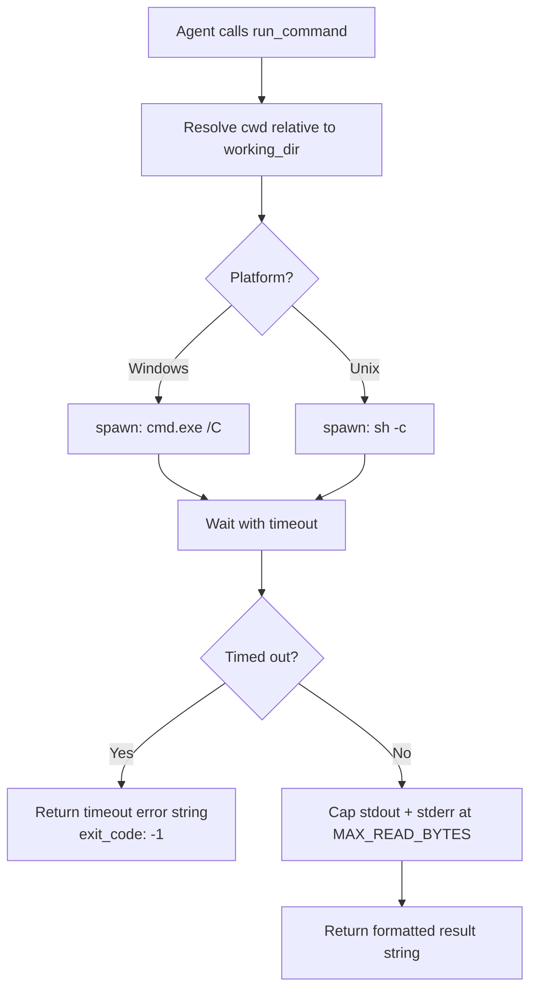

# run_command Tool

## Raw Requirement

Every moeb run that verifies compilation or tests is forced to use the external Bash tool
because no moeb-native shell execution tool exists. This has produced 14 distinct
occurrences across 9 separate signals, all collapsing to the same root gap. Narrow
language-specific tools (cargo_build, cargo_test) were considered and rejected: moeb is
project-agnostic, so baking in Rust-specific tooling would require parallel npm_test,
pytest, go_test, etc. tooling indefinitely. A generic run_command tool is the correct
abstraction. The security concern around arbitrary shell execution is not a meaningful
objection — the orchestrating agent already has Bash access through the MCP session;
run_command does not expand the blast radius, it merely routes the call through moeb's
tool registry to satisfy the moeb-tool-origin rubric.

## Description

Introduces a `run_command` tool that executes an arbitrary shell command and returns its
stdout, stderr, and exit code as a formatted string result. The tool is registered in
`ToolRegistry::standard()`, which causes it to appear in both the CLI tool registry and
the MCP server tool list automatically, satisfying the `kernel-thin-and-parity` criterion.

The tool accepts three parameters: a required `command` string, an optional `cwd` path
(resolved relative to the project working directory), and an optional `timeout_ms`
integer (default 300,000 ms). Output streams are capped at `MAX_READ_BYTES` (100 KiB)
each, consistent with the cap applied to file-read tools.

A non-zero exit code is returned as data in the result string, not as a Rust error. Rust
errors are reserved for OS-level failures such as the shell binary not being found or a
permission denial that prevents the child process from spawning.



## Backlinks

### Parents

| Label | Path | Purpose |
|-------|------|---------|
| Tool Executor Extraction | specifications/moeb/moeb.tool-executor-extraction.md | Establishes ToolHandler trait, ToolRegistry, and the single-extension-point rule |
| Kernel Thinness and MCP/CLI Parity Rubrics | specifications/moeb/moeb.kernel-thin-and-mcp-parity-rubrics.md | Requires every tool in standard() to also appear in the MCP server list |
| Run Stability: Trace Finalize and Read Cap | specifications/moeb/moeb.trace-finalize-and-read-cap.md | Establishes MAX_READ_BYTES as the per-tool output cap |
| MCP/CLI Tool Origin Rubric | specifications/moeb/moeb.moeb-tool-origin-rubric.md | Establishes the pressure that drives this tool into existence |

## Steps

### Step 1 — Create `src/moeb/src/tools/run_command.rs`

Create the file `src/moeb/src/tools/run_command.rs` with the following content:

```rust
use std::path::{Path, PathBuf};
use std::process::Command;
use std::time::Duration;

use anyhow::Result;
use serde_json::Value;

use crate::adapters::ToolDef;
use crate::tools::{truncate_to_byte_limit, MAX_READ_BYTES, ToolHandler};

pub struct RunCommandTool;

impl ToolHandler for RunCommandTool {
    fn name(&self) -> &'static str {
        "run_command"
    }

    fn definition(&self) -> ToolDef {
        ToolDef {
            name: "run_command".to_string(),
            description: "Execute a shell command and return its stdout, stderr, and exit code. \
                Non-zero exit codes are returned as data, not as errors. \
                stdout and stderr are each capped at 100 KiB."
                .to_string(),
            parameters: serde_json::json!({
                "type": "object",
                "properties": {
                    "command": {
                        "type": "string",
                        "description": "The shell command to execute."
                    },
                    "cwd": {
                        "type": "string",
                        "description": "Working directory for the command. Relative paths are resolved from the project working directory. Defaults to the project working directory."
                    },
                    "timeout_ms": {
                        "type": "integer",
                        "description": "Timeout in milliseconds. Defaults to 300000 (5 minutes)."
                    }
                },
                "required": ["command"]
            }),
        }
    }

    fn execute(&self, args: &Value, working_dir: &Path) -> Result<String> {
        let command = args["command"]
            .as_str()
            .ok_or_else(|| anyhow::anyhow!("run_command: 'command' must be a string"))?;

        let cwd: PathBuf = match args.get("cwd").and_then(|v| v.as_str()) {
            Some(c) => {
                let p = Path::new(c);
                if p.is_absolute() {
                    p.to_path_buf()
                } else {
                    working_dir.join(p)
                }
            }
            None => working_dir.to_path_buf(),
        };

        let timeout_ms = args
            .get("timeout_ms")
            .and_then(|v| v.as_u64())
            .unwrap_or(300_000);

        #[cfg(target_os = "windows")]
        let mut child = Command::new("cmd")
            .args(["/C", command])
            .current_dir(&cwd)
            .stdout(std::process::Stdio::piped())
            .stderr(std::process::Stdio::piped())
            .spawn()?;

        #[cfg(not(target_os = "windows"))]
        let mut child = Command::new("sh")
            .args(["-c", command])
            .current_dir(&cwd)
            .stdout(std::process::Stdio::piped())
            .stderr(std::process::Stdio::piped())
            .spawn()?;

        // Wait with timeout using a thread to avoid blocking the executor indefinitely.
        let timeout = Duration::from_millis(timeout_ms);
        let start = std::time::Instant::now();

        let output = loop {
            match child.try_wait()? {
                Some(_) => break child.wait_with_output()?,
                None => {
                    if start.elapsed() >= timeout {
                        let _ = child.kill();
                        let _ = child.wait();
                        return Ok(format!(
                            "exit_code: -1\n\nstdout:\n(timed out after {}ms)\n\nstderr:\n(timed out after {}ms)",
                            timeout_ms, timeout_ms
                        ));
                    }
                    std::thread::sleep(Duration::from_millis(50));
                }
            }
        };

        let exit_code = output.status.code().unwrap_or(-1);
        let stdout_raw = String::from_utf8_lossy(&output.stdout).into_owned();
        let stderr_raw = String::from_utf8_lossy(&output.stderr).into_owned();

        let stdout = truncate_to_byte_limit(stdout_raw, MAX_READ_BYTES);
        let stderr = truncate_to_byte_limit(stderr_raw, MAX_READ_BYTES);

        Ok(format!(
            "exit_code: {}\n\nstdout:\n{}\n\nstderr:\n{}",
            exit_code,
            if stdout.is_empty() { "(empty)" } else { &stdout },
            if stderr.is_empty() { "(empty)" } else { &stderr },
        ))
    }
}

#[cfg(test)]
mod tests {
    use super::*;
    use std::path::PathBuf;

    fn wd() -> PathBuf {
        std::env::current_dir().unwrap()
    }

    #[test]
    fn run_command_exit_zero() {
        let tool = RunCommandTool;
        #[cfg(target_os = "windows")]
        let args = serde_json::json!({ "command": "echo hello" });
        #[cfg(not(target_os = "windows"))]
        let args = serde_json::json!({ "command": "echo hello" });
        let result = tool.execute(&args, &wd()).unwrap();
        assert!(result.contains("exit_code: 0"), "result: {}", result);
        assert!(result.contains("hello"), "result: {}", result);
    }

    #[test]
    fn run_command_nonzero_exit_is_not_rust_error() {
        let tool = RunCommandTool;
        #[cfg(target_os = "windows")]
        let args = serde_json::json!({ "command": "exit 1" });
        #[cfg(not(target_os = "windows"))]
        let args = serde_json::json!({ "command": "exit 1" });
        let result = tool.execute(&args, &wd()).unwrap();
        assert!(result.contains("exit_code: 1"), "result: {}", result);
    }

    #[test]
    fn run_command_stderr_captured() {
        let tool = RunCommandTool;
        #[cfg(target_os = "windows")]
        let args = serde_json::json!({ "command": "echo err 1>&2" });
        #[cfg(not(target_os = "windows"))]
        let args = serde_json::json!({ "command": "echo err >&2" });
        let result = tool.execute(&args, &wd()).unwrap();
        assert!(result.contains("exit_code: 0"), "result: {}", result);
        assert!(result.contains("err"), "result: {}", result);
    }

    #[test]
    fn run_command_missing_command_arg_is_error() {
        let tool = RunCommandTool;
        let args = serde_json::json!({});
        let err = tool.execute(&args, &wd()).unwrap_err();
        assert!(err.to_string().contains("command"), "err: {}", err);
    }
}
```

### Step 2 — Register `run_command` in `tools/mod.rs`

Read `src/moeb/src/tools/mod.rs` first to confirm current state.

**2a — Add module declaration.** At the top of the file alongside the other `pub mod` declarations, add:

```rust
pub mod run_command;
```

Place it in alphabetical order among the existing `pub mod` lines (after `pub mod read_files;`, before `pub mod search_files;`).

**2b — Register in `ToolRegistry::standard()`.** In the `standard()` method body, add the registration after the existing file-read tools and before the task-list tools. Use `write_file` to rewrite the file with both changes applied simultaneously, not two separate `patch_file` calls.

The registration line to add:

```rust
r.register(Box::new(run_command::RunCommandTool));
```

**2c — Add to `definitions()` order array.** In the `definitions()` method, add `"run_command"` to the `order` array. Place it after `"read_file_range"` and before `"create_task_list"`, keeping it with the file-operation tools:

```rust
"read_file", "write_file", "patch_file", "list_directory",
"search_files", "grep_files", "read_files", "read_file_range", "run_command",
"create_task_list", ...
```

Apply all three changes (2a, 2b, 2c) in a single `write_file` call on `tools/mod.rs` to avoid multiple patch failures on this large file.

### Step 3 — Verify

Confirm the following using `grep_files`:

1. `pub mod run_command;` appears in `src/moeb/src/tools/mod.rs`.
2. `RunCommandTool` appears in `ToolRegistry::standard()` in `src/moeb/src/tools/mod.rs`.
3. `"run_command"` appears in the `definitions()` order array in `src/moeb/src/tools/mod.rs`.
4. `run_command.rs` exists under `src/moeb/src/tools/`.

The implementing agent must run `cargo build --release` (via Bash or the new `run_command` tool once available — Bash is acceptable here since `run_command` does not yet exist) and `cargo test` to confirm zero compilation errors and all tests pass.

## Decisions

### Decision 1 — Generic `run_command` over language-specific tools

**Rationale:** moeb is project-agnostic. Implementing `cargo_build` and `cargo_test`
would close the gap for Rust projects but immediately open equivalent gaps for every
other build system (npm, pytest, gradle, make, etc.). A single `run_command` tool closes
the entire class of gaps in one spec. Any future project using moeb benefits from the
same tool regardless of its build system.

**Rejected alternative:** Language-specific tools (`cargo_build`, `cargo_test`). Rejected
because it creates an unbounded set of build-system-specific tools that moeb would need
to maintain and that would pollute the tool registry with project-type concerns.

**Consequence:** The tool is general-purpose. Skill files remain the right layer for
build-system-specific guidance ("use `cargo test` to verify"), while `run_command` is
the mechanism.

### Decision 2 — Platform shell dispatch: `cmd.exe /C` on Windows, `sh -c` on Unix

**Rationale:** Agents write shell commands in conventional shell syntax (pipes, redirects,
environment variables). Passing the command string directly to `std::process::Command`
without a shell would require splitting arguments, handling quoting, and losing shell
features. Using the platform's default command interpreter is the minimal correct choice.
`cmd.exe /C` is universally available on Windows; `sh` is universally available on POSIX
systems. PowerShell is more capable than `cmd.exe` but adds a startup cost, has different
syntax for common operations, and is not guaranteed present on all Windows variants.

**Rejected alternatives:**
- `powershell -Command`: slower startup, different syntax for pipes and redirects, not
  universally available.
- Direct `Command::new` without a shell: requires argument splitting; cannot handle
  pipes, redirects, or compound commands.
- Configurable shell via a `shell` parameter: adds complexity; agents do not need to
  choose a shell — they need commands to work.

**Consequence:** Agents must write commands in `cmd.exe`-compatible syntax on Windows
(`echo hello`, `dir`, etc.) and POSIX sh syntax on Unix. The skill instructions for
using `run_command` should note this.

### Decision 3 — Non-zero exit code returned as data, not as Rust error

**Rationale:** From the agent's perspective, a `cargo test` that reports failing tests is
a successful tool call — the agent receives actionable information (which tests failed)
and can decide how to proceed. Converting a non-zero exit to an `anyhow::Error` would
force the agent to handle a tool error rather than inspect the output, removing the
stdout/stderr content from its context.

**Rejected alternative:** Return `Err` for any non-zero exit. Rejected because it
discards stdout/stderr at the Rust level, leaving the agent with no failure detail.

**Consequence:** Agents must check `exit_code` in the returned string to determine
success. Skill instructions for verification steps should include: "If exit_code is
non-zero, read the stderr section and diagnose the failure."

### Decision 4 — Output capped at `MAX_READ_BYTES` per stream

**Rationale:** Build output from large projects can exceed hundreds of megabytes. Passing
unbounded output into the agent's context window would exhaust the context budget and
trigger compaction, losing earlier context. The 100 KiB cap per stream (consistent with
`read_file` and `read_files`) keeps individual tool results bounded while preserving
enough output to diagnose most failures.

**Rejected alternative:** No cap. Rejected because a single `cargo test` on a large
workspace can produce several megabytes of output, consuming the entire context budget
in one tool call.

**Consequence:** Very verbose build or test output may be truncated. The truncation
marker `[... truncated: N of M chars shown ...]` (produced by `truncate_to_byte_limit`)
signals to the agent that output was cut. Agents should prefer targeted commands (e.g.
`cargo test specific_crate`) over broad commands when full output is needed.

### Decision 5 — Timeout implemented via poll loop, not via separate thread

**Rationale:** A separate thread approach (spawn a thread that kills the child after N
ms) requires cross-thread `Child` sharing, which requires `Arc<Mutex<Child>>`. The poll
loop (`try_wait` every 50 ms until timeout) is simpler, requires no additional
synchronisation primitives, and is adequate for the polling granularity needed
(build/test timeouts are measured in minutes, not milliseconds).

**Rejected alternative:** Spawn a watchdog thread that kills the child after timeout.
Rejected because it adds `Arc<Mutex>` complexity for a scenario where 50ms polling
granularity is perfectly acceptable.

**Consequence:** The effective timeout granularity is ±50ms, which is acceptable for all
plausible use cases (build verification, test suites). The 50ms sleep is not observable
in practice.

### Decision 6 — `run_command` registered in `standard()`, not added as a separate registry method

**Rationale:** `standard()` is the canonical set of tools available to agents running
moeb specs and runs. Since `mcp()` calls `standard()` as its base, registration in
`standard()` automatically satisfies the `kernel-thin-and-parity` requirement that every
CLI tool also appear in the MCP tool list. Adding a separate method (e.g.
`with_run_command()`) would require calling it explicitly at every `ToolRegistry`
construction site and would risk omission from the MCP registry.

**Rejected alternative:** Register `run_command` only in `mcp()`, not in `standard()`.
Rejected because CLI agents also need the tool (spec runs verify compilations), and
`mcp()` builds on `standard()` — adding to `mcp()` alone would leave CLI registries
without the tool.

**Consequence:** `run_command` is available in all moeb agent contexts (CLI run, MCP run,
spec). It is deliberately absent from `sub_agent()` because sub-agents are review-only
roles (Reviewer, Moderator, QA Architect) that must not execute shell commands.

## Rubric

### Structured

| Name | Description | Threshold | Pass Condition |
|------|-------------|-----------|----------------|
| `no-drift` | The specification does not violate any decision recorded in a linked parent specification | Zero contradictions | Manual review of every decision in every parent spec listed in Backlinks |
| `spec-schema-compliance` | All required frontmatter fields and body sections are present and correctly ordered | 100% of required fields and sections | Validation in domain/spec.rs exits 0 during moeb spec |
| `ai-first-org` | One concern per file, context locality, grep-discoverable names, no cross-cutting helpers | All four principles followed | Single file run_command.rs; RunCommandTool name is grep-discoverable; no helpers shared with other tools |
| `kernel-thin-and-parity` | No workflow logic in Rust; run_command registered in both standard() and (via standard) mcp() | Zero violations | grep confirms RunCommandTool in standard(); mcp() inherits via standard() |
| `binary-builds` | cargo build --release exits 0 after implementing this spec | Zero errors | Build exits 0 |
| `all-tests-pass` | cargo test exits 0 after implementing this spec | Zero failures | Test suite exits 0 |
| `tool-registered-in-standard` | RunCommandTool appears in ToolRegistry::standard() | Present | grep_files for RunCommandTool in tools/mod.rs returns a match in standard() |
| `definitions-order-updated` | "run_command" appears in the definitions() order array | Present | grep_files for "run_command" in tools/mod.rs returns a match in the order array |

### Qualitative

- An agent following this spec must be able to execute `cargo build --release` and `cargo test` in `src/moeb/` without using any external tool (Bash, PowerShell, etc.), by using `run_command` with `cwd: "src/moeb"`.
- The result format (`exit_code: N\n\nstdout:\n...\n\nstderr:\n...`) must be consistent enough that agent instructions in skill files can reference it mechanically (e.g. "check that exit_code is 0").
- The Decision 2 platform dispatch choice must be explicitly noted in run.skill.md and spec.skill.md Tool Origin Policy sections so agents know which shell syntax to use.
