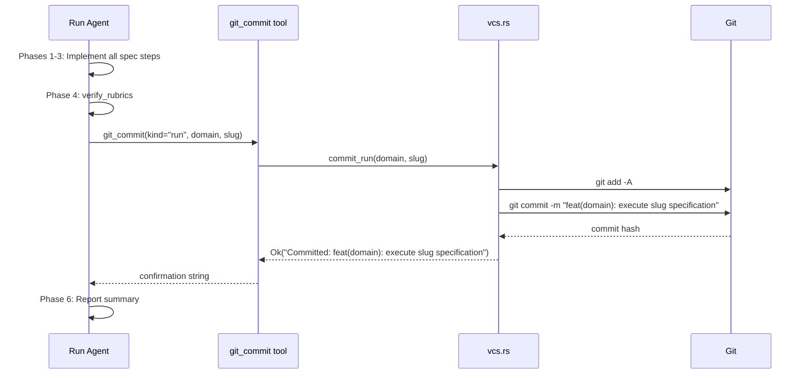

# Run Command: Post-Completion Git Commit

## Raw Requirement

> When moeb run completes and has made all required code changes (so as the last step), like spec does, commit the changes, we will already be on the correct branch for the spec, you should use the same specification as spec does for the commit message, this should be implemented in the same way as spec handles committing to git, ideally we can reuse the code

## Description

After `moeb run` completes all code changes required by the active specification, it must automatically commit those changes to git. This extends the agent-driven VCS pattern established by `moeb.serve-cli-parity.md`, in which `moeb spec` calls the `git_commit` tool as its final workflow phase (Phase 7 of `spec.skill.md`).

The `git_commit` tool (`src/moeb/src/tools/git_commit.rs`) is extended with an optional `kind` parameter (`"spec"` | `"run"`, defaulting to `"spec"`). When `kind = "run"`, the tool stages all working-tree changes (`git add -A`) and commits with the message `feat(<domain>): execute <slug> specification`. The `spec_path` and `readme_path` parameters are moved from required to optional and are ignored when `kind = "run"`. The `vcs.rs` module gains a `commit_run(domain, slug)` function sharing the git-execution infrastructure already used by `commit_spec` via two private helpers extracted from the existing inline git invocations.

The bundled `run.skill.md` receives a new Phase 5 (Commit) inserted between the existing Phase 4 (Verify) and the renamed Phase 6 (Complete). The new phase instructs the run agent to extract `domain` and `slug` from the active spec's YAML frontmatter and call `git_commit` with `kind: "run"`. The commit message mirrors the spec convention: `docs(<domain>): add <slug> specification` for spec → `feat(<domain>): execute <slug> specification` for run.



## Backlinks

### Parents

| Label | Path | Purpose |
|-------|------|---------|
| README | [README.md](../../README.md) | Root harness index |
| MCP Serve / CLI Parity | [specifications/moeb/moeb.serve-cli-parity.md](specifications/moeb/moeb.serve-cli-parity.md) | Introduced `git_commit` tool and established agent-driven VCS for spec; this spec extends the same pattern to run |
| Agent Skills | [specifications/moeb/moeb.agent-skills.md](specifications/moeb/moeb.agent-skills.md) | Introduced `run.skill.md` with Phases 1-5; this spec inserts Phase 5 (Commit) and renumbers Complete to Phase 6 |
| Specification Creation: Branch Type Correction to `feat/` | [specifications/vcs/vcs.spec-branch-type-feat.md](specifications/vcs/vcs.spec-branch-type-feat.md) | Established that `feat/` branches span spec and implementation commits; confirms run commits belong on the same branch |

### External

*(none)*

## Steps

### Step 1 — Extend `git_commit.rs`: add `kind` parameter and branch on it

Read `src/moeb/src/tools/git_commit.rs` in full.

In `definition()`, update the JSON schema:
- Remove `"spec_path"` and `"readme_path"` from the `"required"` array. They remain as optional string properties in the `"properties"` object with their existing descriptions.
- Add a new optional string property `"kind"` with description `"Commit kind: \"spec\" stages spec_path and readme_path with a docs commit; \"run\" stages all working-tree changes with a feat commit. Defaults to \"spec\"."` and an `"enum"` constraint of `["spec", "run"]`.
- `"domain"` and `"slug"` remain in the `"required"` array.

In `execute()`, extract the `kind` argument defaulting to `"spec"` when absent. Branch on `kind`:

- When `kind = "spec"`: resolve `spec_path` and `readme_path` from args (return an informative error string if either is absent). Resolve each against `working_dir` to an absolute path. Call `crate::vcs::commit_spec(&abs_spec, &abs_readme, domain, slug)`.
- When `kind = "run"`: call `crate::vcs::commit_run(domain, slug)`.

Return the `Ok` confirmation string or surface the `Err` string as a tool error in both branches.

### Step 2 — Add `commit_run` to `vcs.rs` and extract shared helpers

Read `src/moeb/src/vcs.rs` in full.

Extract the git invocations currently inline in `commit_spec` into two private helper functions at the bottom of the same file:

```rust
fn git_add_files(paths: &[&std::path::Path]) -> Result<(), String> {
    // run: git add <path1> <path2> ...
    // return Err with stderr on non-zero exit
}

fn git_commit_with_message(message: &str) -> Result<String, String> {
    // run: git commit -m <message>
    // return Ok("Committed: <message>") on success
    // return Err with stderr on non-zero exit
}
```

Refactor `commit_spec` to call these helpers:

```rust
pub fn commit_spec(spec_path: &std::path::Path, readme_path: &std::path::Path, domain: &str, slug: &str) -> Result<String, String> {
    git_add_files(&[spec_path, readme_path])?;
    let message = format!("docs({}): add {} specification", domain, slug);
    git_commit_with_message(&message)
}
```

Add a third private helper used only by `commit_run`:

```rust
fn git_stage_all() -> Result<(), String> {
    // run: git add -A
    // return Err with stderr on non-zero exit
}
```

Add the new public function:

```rust
pub fn commit_run(domain: &str, slug: &str) -> Result<String, String> {
    git_stage_all()?;
    let message = format!("feat({}): execute {} specification", domain, slug);
    git_commit_with_message(&message)
}
```

`commit_spec` and `commit_run` share `git_commit_with_message`; they differ only in staging strategy and commit type.

### Step 3 — Update `run.skill.md`: insert Phase 5 (Commit) and renumber Complete to Phase 6

Read the current `run.skill.md`. The canonical path after `moeb.agent-skills.md` is `src/moeb/assets/skills/run.skill.md`; check `.moeb/skills/run.skill.md` first and prefer it if present.

Locate the boundary between the current Phase 4 (Verify) block and the current Phase 5 (Complete) block. Insert the following text between them, verbatim:

```markdown
## Phase 5 — Commit

Extract `domain` and `slug` from the YAML frontmatter at the top of the active
specification (the content between the opening `---` and closing `---` markers). Call
`git_commit` with:
- `kind`: `"run"`
- `domain`: the value of the `domain` field from the frontmatter
- `slug`: the value of the `slug` field from the frontmatter

Do not pass `spec_path` or `readme_path` — they are not used for run commits. The tool
stages all working-tree changes and commits with the message
`feat(<domain>): execute <slug> specification`.

```

Change the heading of the old Phase 5 from `## Phase 5 — Complete` to `## Phase 6 — Complete`. No other content in the file changes.

### Step 4 — Update `git_commit_tests.rs`

Read `src/moeb/src/tools/git_commit_tests.rs` in full.

Add two new test functions:

1. **`git_commit_run_kind_missing_domain_returns_error`**: construct an args map with `kind = "run"` and `slug` present but no `domain`. Call `execute()`. Assert the returned string is an error containing `"domain"`.

2. **`git_commit_spec_kind_missing_spec_path_returns_error`**: construct an args map with `kind = "spec"`, `domain` and `slug` present, but no `spec_path`. Call `execute()`. Assert the returned string is an error containing `"spec_path"`.

### Step 5 — Verify

Run `cargo build --release` — zero errors. Run `cargo test` — all tests pass including the two new tests. Confirm the phase headings in `run.skill.md`:

```
grep "## Phase 5 — Commit" <path-to-run.skill.md>
grep "## Phase 6 — Complete" <path-to-run.skill.md>
```

Both must return a match.

## Decisions

### Decision 1 — `kind` parameter on the existing `git_commit` tool rather than a new tool

**Rationale:** The requirement explicitly requests code reuse. A `kind` parameter satisfies this: both spec and run share the tool entry point, argument extraction scaffolding, and the underlying `git_commit_with_message` helper. A separate `git_commit_run` tool would duplicate tool definition boilerplate and registration without adding clarity.

**Alternatives:**

| Option | Reason Rejected |
|--------|-----------------|
| New `git_commit_run` tool | Duplicates definition and registration boilerplate with no semantic gain |
| Rust post-processing in `domain/run.rs` after the agent loop | Contradicts the agent-driven VCS principle from `moeb.serve-cli-parity.md`; the requirement explicitly asks for parity with how spec handles committing |

**Consequences:** The `git_commit` tool schema changes: `spec_path` and `readme_path` move from required to optional. Existing `spec.skill.md` callers pass them explicitly and remain unaffected. Absent `kind` defaults to `"spec"` so all existing calls are backward-compatible.

### Decision 2 — Commit message: `feat(<domain>): execute <slug> specification`

**Rationale:** The run commit introduces application-feature code, making `feat` the correct Conventional Commits type. The `(<domain>)` scope and `<slug> specification` suffix mirror the spec commit pattern (`docs(<domain>): add <slug> specification`), giving `git log` a readable parallel entry for each spec's two-commit lifecycle on the `feat/` branch.

**Alternatives:**

| Option | Reason Rejected |
|--------|-----------------|
| Same message as spec (`docs(<domain>): add <slug> specification`) | Incorrect type; run commits contain implementation code, not documentation |
| `chore(<domain>): run <slug>` | `chore` is for maintenance; a spec implementation is new feature behaviour |
| Free-form (`Executed moeb.<slug>.md spec`) | Inconsistent with the established Conventional Commits harness format |

**Consequences:** `git log --oneline` will show a two-entry lifecycle per branch: the `docs` spec commit followed by the `feat` run commit. This is consistent with the `feat/` branch type established by `vcs.spec-branch-type-feat.md`, whose diagram explicitly shows both commits on the same branch before merge.

### Decision 3 — Stage all changes (`git add -A`) for run commits

**Rationale:** A `moeb run` agent modifies an unknown set of implementation files determined at runtime by the spec content. Requiring the agent to enumerate every path it has written is fragile: omission produces a silent partial commit. Staging all working-tree changes is safe because the run agent operates on a dedicated `feat/<domain>-<slug>` branch; any modified file on that branch is an artifact of the current run.

**Alternatives:**

| Option | Reason Rejected |
|--------|-----------------|
| Agent passes all written paths to `git_commit` | Fragile; agent must track every `write_file` call precisely; any omission creates a partial commit |
| Stage only files the agent read via `read_file` during the run | Misses files created from scratch (never read before writing) |

**Consequences:** Any file modified or created in the working tree at commit time is included. The existing HARD RULES (minimum diff, pre-write declaration) constrain the agent to only the files required by the spec, limiting the risk of spurious inclusions.

### Decision 4 — Phase in `run.skill.md` rather than Rust post-processing

**Rationale:** `moeb.serve-cli-parity.md` Decision 1 Consequences explicitly states: "`moeb run` agents will also see `create_branch` and `git_commit` in their tool list. These tools are harmless when unused; the run skill does not mention them and agents follow the skill." This spec is the planned extension that makes the run skill mention `git_commit`. Consistency with the spec pattern requires the commit to be agent-driven via the skill.

**Alternatives:**

| Option | Reason Rejected |
|--------|-----------------|
| Post-process in `domain/run.rs` after agent loop exits | Contradicts agent-driven VCS principle; creates asymmetry between spec and run workflows |

**Consequences:** If the agent loop exits before reaching Phase 5 (e.g. MAX_TURNS exceeded), no commit is made. This is correct behaviour: a partial run should not produce an automatic commit.

## Rubric

### Structured

| Name | Description | Threshold | Pass Condition |
|------|-------------|-----------|----------------|
| `no-drift` | The specification does not violate any decision recorded in a linked parent specification | Zero contradictions | Manual review of every decision in every parent spec listed in Backlinks |
| `spec-schema-compliance` | All required frontmatter fields and body sections are present and correctly ordered | 100% of required fields and sections | Validation in `domain/spec.rs` exits 0 during `moeb spec` |
| `ai-first-org` | The specification's Steps prescribe file layouts, naming, and helper placement that satisfy the four AI-first organisation principles: one concern per file, context locality, grep-discoverable names, no cross-cutting helpers. | All four principles followed | Manual review: no step produces a file that mixes concerns, no name is generic across the codebase, all helpers are co-located with their callers or promoted to a precisely named module |
| `binary-builds` | `cargo build --release` exits 0 after implementation | Zero errors | Build exits 0 |
| `all-tests-pass` | `cargo test` exits 0 after implementation | Zero test failures | `cargo test` exits 0 |
| `run-skill-phase-present` | `run.skill.md` contains `## Phase 5 — Commit` and `## Phase 6 — Complete` | Both headings present | `grep` for each heading in the canonical `run.skill.md` returns a match |
| `git-commit-kind-parameter` | `git_commit` tool `definition()` includes `kind` as an optional enum property | Present with enum `["spec", "run"]` | Code review of `git_commit.rs` `definition()` confirms `kind` property and enum values |

### Qualitative

- **Backward compatibility:** Existing `spec.skill.md` calls to `git_commit` (passing `spec_path`, `readme_path`, `domain`, `slug` without `kind`) must work identically. The tool must treat absent `kind` as `"spec"`.
- **Commit message format:** After a complete `moeb run`, `git log --format=%s -1` on the spec branch must match `^feat\(<domain>\): execute <slug> specification$`.
- **Shared execution path:** A code reviewer must confirm that `commit_spec` and `commit_run` both call `git_commit_with_message` — the commit invocation is not duplicated between them.
