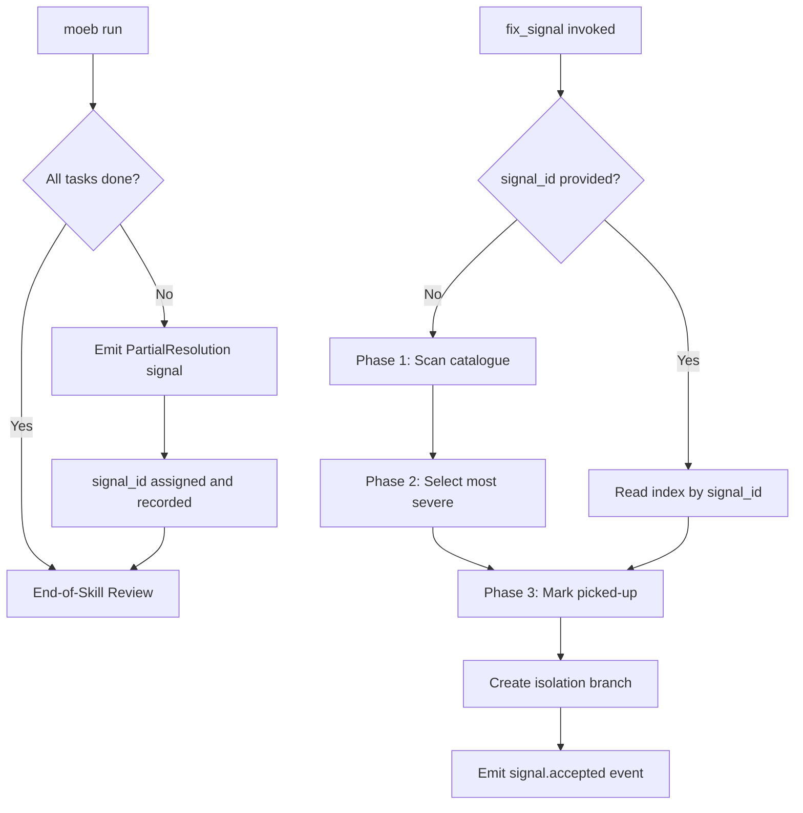

# Run Partial Resolution Recovery and Fix Signal Direct Invocation

## Raw Requirement

Partially resolved specifications in a run invocation must signal out with the remaining work or provide a mechanism of recovery. Additionally, fix_signal must support being invoked with a signal_id directly — given we know the signal chosen, it should effectively start off the branch etc. skipping any phases required to select a signal.

## Description

This specification addresses two coupled concerns that together form a complete recovery path for interrupted or partially completed `moeb run` invocations.

**Partial resolution detection (run.skill.md).** After the main implementation loop concludes, the run agent inspects its task list to identify any task not marked `done`. If any such task exists, the agent emits a `PartialResolution` signal via the canonical signal dedup-and-write procedure already present in run.skill.md. The signal's `proposed_resolution` records the assigned `signal_id` so that fix_signal can be invoked directly for recovery without re-selecting from the full catalogue.

**Direct fix_signal invocation (fix_signal tool + fix_signal.skill.md).** The `fix_signal` MCP tool gains an optional `signal_id` string parameter. When provided, the fix_signal skill reads the signal directly from the catalogue via the signal index, skipping Phase 1 (signal scanning) and Phase 2 (signal selection by severity). All subsequent phases — marking picked-up, isolation branch creation, event emission, commit, tag — execute unchanged, preserving the audit trail. When `signal_id` is absent, the existing autonomous selection behaviour is preserved.

No workflow-decision logic is added to Rust. The kernel only threads the `signal_id` template variable into fix_signal.skill.md, following the pattern established in `moeb.start-spec-from-signal`.



## Backlinks

### Parents

| Label | Path | Purpose |
|-------|------|---------|
| Harness README | README.md | Parent specification index |
| Signal Fix Command | specifications/moeb/moeb.signal-fix-command.md | Introduced fix_signal MCP tool and fix_signal.skill.md phases 1–4 |
| Fix Signal Event Emission | specifications/moeb/moeb.fix-signal-event-emission.md | Established event-emission-only pattern; Phase 4 branch is the definitive branch |
| Fix Signal Skill Hardening | specifications/moeb/moeb.fix-signal-skill-hardening.md | Added Per-Step Review sub-loops, unconditional Commit, Tag, and Signal Tag phases |
| Fix Signal Catalogue Alignment | specifications/moeb/moeb.fix-signal-catalogue-alignment.md | Migrated fix_signal to canonical signal dedup-and-write procedure |
| Task List Tools | specifications/moeb/moeb.task-list-tools.md | Introduced create_task_list and update_task for tracking run agent progress |
| start_spec Signal-ID Input | specifications/moeb/moeb.start-spec-from-signal.md | Established template-variable pattern for signal_id injection into skill prompts |

## Steps

### Step 1 — Add Partial Resolution Check phase to run.skill.md

Edit `src/moeb/internal/skills/run.skill.md`. Insert a new phase headed `## Partial Resolution Check` immediately before the existing `## End-of-Skill Review` phase heading. The phase content must instruct the run agent to:

1. Review the task list created at the start of this run. Identify any task whose status was never updated to `done`.
2. If all tasks are `done`, skip signal emission and proceed to End-of-Skill Review without further action.
3. If any task remains incomplete:
   a. Assemble a signal record:
      - `category`: `"Error"`
      - `severity`: `"Major"`
      - `title`: `"Partial resolution: <domain>/<slug>"`
      - `description`: `"Run <run_id> did not complete all tasks for specification <spec_path>. Incomplete tasks: <comma-separated list of incomplete task titles>."`
      - `proposed_resolution`: `"Resume by invoking fix_signal with signal_id=<signal_id_of_this_record>. The signal description records which tasks remain."`
      - `gating_condition`: `null`
   b. Write this record via the **Canonical Signal Dedup-and-Write Procedure** already present in run.skill.md. The UUID v4 assigned as `signal_id` during the procedure is the value to substitute into `proposed_resolution` before writing.
4. Continue to End-of-Skill Review regardless of whether a signal was emitted.

The phase heading string `## Partial Resolution Check` must appear verbatim so the phase is grep-discoverable by that string.

### Step 2 — Add optional signal_id parameter to the fix_signal Rust tool

Locate the Rust source file that registers the `fix_signal` MCP tool (use `grep_files` for the string `fix_signal` in `src/moeb/` to identify the handler). Make the following changes:

1. Add an optional `signal_id: Option<String>` field to the tool's JSON input struct (or equivalent serde-deserializable input type).
2. In the tool's handler function, extract the `signal_id` value and pass it to the prompt template renderer as a template variable named `signal_id`. When `signal_id` is `None`, render the variable as an empty string `""`.
3. Update the MCP server's JSON schema registration for `fix_signal` to include a `"signal_id"` property of type `"string"` with no `"required"` entry, making it optional.

### Step 3 — Update fix_signal.skill.md to support direct signal_id invocation

Edit `src/moeb/internal/skills/fix_signal.skill.md`. Add a **Signal Resolution Mode** section at the very start of the skill body (after any preamble text, before the first Phase heading). The section content must be:

```
## Signal Resolution Mode

Inspect `{{signal_id}}`:

**If `{{signal_id}}` is non-empty:**
1. Read `.moeb/signals/index.md`.
2. Find the table row whose `Signal ID` column equals `{{signal_id}}`.
3. Extract the file path from the `File` column of that row.
4. Read the signal record from that path.
5. Skip Phase 1 (signal scan) and Phase 2 (signal selection) below.
6. Proceed directly to Phase 3 (mark as picked up) with the loaded signal record.

**If `{{signal_id}}` is empty:**
Proceed with Phase 1 and Phase 2 as defined below.
```

All existing phases (Phase 1 onward) are unchanged in content; only the Signal Resolution Mode section is prepended.

### Step 4 — Verify parity of fix_signal tool registration

After completing Step 2, confirm whether `fix_signal` appears in `ToolRegistry::standard()` (the CLI registry) by using `grep_files`. If it does, add the `signal_id` field there too with the same optional schema. If `fix_signal` is MCP-only (consistent with Decision 1 of `moeb.signal-fix-command.md`), confirm only the MCP server registration was updated and document this in a comment adjacent to the registration.

## Decisions

### Decision 1 — Partial resolution is detected by agent task list introspection, not kernel state

The run agent has its task history in context from `create_task_list` and `update_task` calls made earlier in the same run. Reviewing this in-context history requires no new tool calls and no kernel changes. All detection logic lives in run.skill.md.

**Rejected:** Introducing a `get_task_list` kernel tool that returns RunState task completion data. Rejected because the agent already possesses this information in context; a new kernel tool would violate the kernel-thin principle by adding infrastructure for information the skill already has.

**Consequences:** Partial resolution detection depends on the agent faithfully updating its task list during the run. An agent that fails to call `update_task` cannot trigger partial resolution detection; this is acceptable because task list discipline is already a harness expectation.

### Decision 2 — PartialResolution signal uses Error category and Major severity

An incomplete specification implementation leaves the codebase in an inconsistent state relative to the spec's requirements, which qualifies as an Error. Major (not Critical) severity is assigned because the harness and existing committed code remain stable — forward progress on the specification is blocked but no data corruption has occurred.

**Rejected:** Minor severity. Rejected because incomplete specification execution is not merely informational; it represents a functional gap requiring active intervention.

**Rejected:** Critical severity. Rejected because Critical is reserved for errors producing incorrect outputs, data loss, or repeated run failures. A partial resolution is recoverable without data loss.

### Decision 3 — fix_signal skips only selection phases; all execution phases proceed

When `signal_id` is provided, Phase 1 (scan) and Phase 2 (selection) are bypassed. Phase 3 onward (mark picked-up, branch creation, event emission, commit, tag) execute unchanged. Every fix_signal invocation — autonomous or direct — produces identical artifacts: a marked signal, a branch, an event file, and a tagged commit.

**Rejected:** Skipping branch creation when signal_id is provided. Rejected because branch isolation is a hard contract of the fix_signal workflow (`moeb.fix-signal-event-emission.md` Decision 5) that must hold regardless of how the signal was identified.

**Rejected:** Skipping Phase 3 (mark as picked-up). Rejected because the `picked_up_at` marker prevents re-selection of the same signal by a subsequent autonomous fix_signal invocation; omitting it allows double-processing.

### Decision 4 — signal_id lookup uses the signal index, not grep over catalogue files

When `signal_id` is provided, the skill reads `.moeb/signals/index.md` and matches the `Signal ID` column to derive the canonical catalogue file path. This avoids unbounded directory traversal while providing deterministic lookup against the pre-maintained index.

**Rejected:** Grepping `.moeb/signals/catalogue/` for the UUID. Rejected because the signal index was specifically designed for this lookup; directory traversal adds unnecessary latency on large catalogues.

### Decision 5 — Workflow logic lives entirely in skill files; kernel threads signal_id as a template variable

The `signal_id` parameter is injected into fix_signal.skill.md as a template variable `{{signal_id}}`, following the identical pattern used by `start_spec` in `moeb.start-spec-from-signal`. No branching or selection logic is placed in Rust. This satisfies `kernel-thin-and-parity` and the `thin-kernel` catalogue criterion.

**Rejected:** Adding Rust-level branching to skip skill phases when signal_id is present. Rejected because phase sequencing is skill responsibility; the kernel's only role is to thread input values into templates.

**Consequences:** The Rust change is a thin two-line addition: accept the optional field, render it as a template variable. All recovery logic is skill-driven.

## Rubric

### Structured

| Name | Description | Threshold | Pass Condition |
|------|-------------|-----------|----------------|
| `tool-errors` | No ToolHandler errors were recorded during this command invocation. Covers all tool calls on both CLI and MCP paths via `RealToolExecutor::execute`. Applies to every moeb command. | Zero tool errors | Kernel-authoritative: injected by `verify_rubrics` from `RunState.tool_errors`. Do not supply a verdict — any agent-supplied entry is overridden. |
| `rubric-qualification` | No Pass verdicts with acknowledged failures were issued during this command invocation. An agent that observes a failure but passes a criterion must populate `acknowledged_failures` in the verdict object. Applies to every moeb command. | Zero qualified Pass verdicts | Kernel-authoritative: injected by `verify_rubrics` by scanning `acknowledged_failures` on incoming Pass verdicts. Do not supply a verdict — any agent-supplied entry is overridden. |
| `skill-mandatory-phases` | The skill loaded for this run contains all mandatory phase headings. The agent checks its own prompt context for the exact strings: "Verify", "End-of-Skill Review", "Metrics Recording", "Commit", "Tag", "Complete". No file read is required. | All six mandatory headings present | Agent scans skill content in its loaded context; fails if any mandatory heading string is absent |
| `no-drift` | The specification does not violate any decision recorded in a linked parent specification | Zero contradictions | Manual review of every decision in every parent spec listed in Backlinks |
| `spec-schema-compliance` | All required frontmatter fields and body sections are present and correctly ordered | 100% of required fields and sections | Validation in `domain/spec.rs` exits 0 during `moeb spec` |
| `ai-first-org` | The specification's Steps prescribe file layouts, naming, and helper placement that satisfy the four AI-first organisation principles: one concern per file, context locality, grep-discoverable names, no cross-cutting helpers. | All four principles followed | Manual review: no step produces a file that mixes concerns, all names are grep-discoverable, helpers are co-located with their callers |
| `kernel-thin-and-parity` | No domain-specific or workflow-specific coordination logic may be placed in kernel Rust code when it can live in skill markdown or role files. Every tool registered in the CLI tool registry must also be registered in the MCP stdio server tool list. | Zero violations | Spec review: no proposed step places review/coordination logic in Rust; Run review: grep confirms no skill-specific logic in kernel tools |
| `moeb-tool-origin` | All tool calls made during this invocation must originate from moeb's own tool registry. | Zero external tool calls | Agent reviews the conversation for calls to non-moeb tools. Supplies Pass if none were made; Fail with acknowledged_failures listing signal titles if external tools were used with MissingMoebTool signals. |
| `thin-kernel` | New Rust code in tools/, commands/, or domain/ must be either (a) a primitive operation wrapper or (b) a thin dispatcher. Workflow logic must live in skill markdown or role files. | Zero workflow-logic functions in new Rust | Spec review: no Step proposes placing sequencing or conditional workflow logic in Rust; Run review: every new or modified Rust function is a thin template renderer with no domain-specific branching |
| `mcp-cli-behavioural-parity` | For any operation exposed through both the CLI agent loop and the MCP server, the observable outcome must be identical. Any tool registered in the standard registry must be registered in the MCP registry with an identical input schema and result contract. | Zero divergent outcomes | Run review: fix_signal is MCP-only per moeb.signal-fix-command Decision 1; confirm standard() does not carry fix_signal and that the MCP schema update is consistent with the existing registration pattern |
| `no-signal-reoccurrence` | No canonical signal in `.moeb/signals/catalogue/` has `status: reopened` due to this run | Zero reopened signals introduced by this run | Run review: inspect catalogue after run for any signal with status reopened |

### Qualitative

- The PartialResolution signal's `proposed_resolution` must substitute the actual assigned `signal_id` UUID (not a placeholder string) before the signal record is written, making it immediately usable as a fix_signal input parameter without additional lookups.
- The Signal Resolution Mode section in fix_signal.skill.md must unambiguously make Phase 1 and Phase 2 conditional; a reader must be able to determine without ambiguity which phases are skipped when `{{signal_id}}` is non-empty.
- The Partial Resolution Check phase in run.skill.md must appear before `## End-of-Skill Review` so the emitted signal is visible to the QA Architect persona within the same run.
- The fix_signal skill's Phase 3 (mark as picked-up) must still execute when signal_id is provided directly, ensuring the `picked_up_at` field is written and double-processing is prevented.
