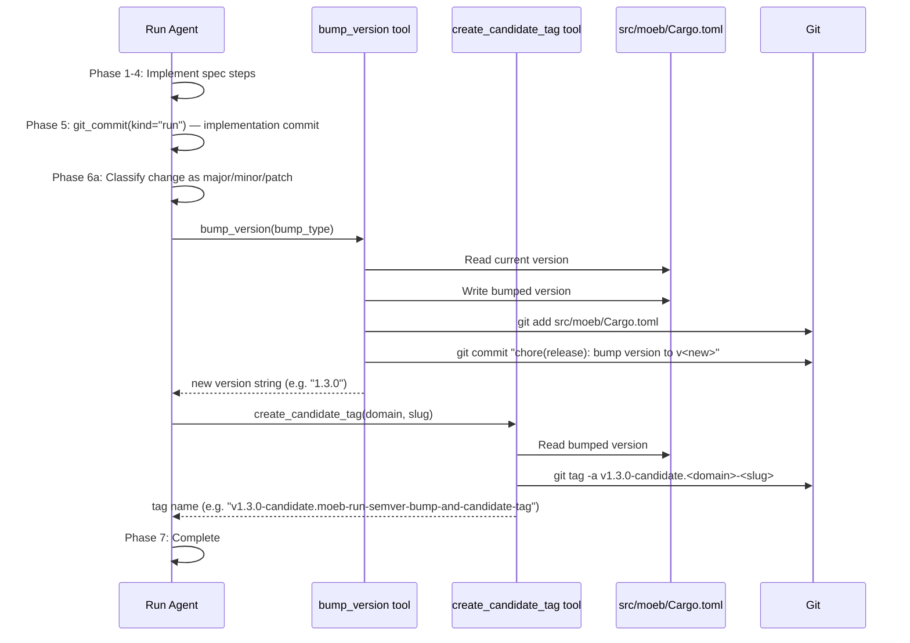

# Run Command: SemVer Version Bump and Candidate Tag

## Raw Requirement

> When a spec is executed, before we build to release, the version should be updated as per https://semver.org/spec/v2.0.0.html , we may need a tool that will review the changes and determine the type of upversion required. A tag for that version could be created on the run commit also denoting it as v<sem.ver>-candidate while also providing a unique factor to the tag to ensure multiple inflight candidate tagged branches do not clash

## Description

After `moeb run` commits the implementation changes (Phase 5 of `run.skill.md`, established by `moeb.run-git-commit.md`), a new Phase 6 is inserted before the Complete phase. Phase 6 instructs the run agent to:

1. Analyse the active specification's `## Description` and `## Steps` sections together with the nature of the changes implemented to classify the change as `"major"`, `"minor"`, or `"patch"` per SemVer 2.0.0.
2. Call the new `bump_version` tool with the determined bump class, which reads `src/moeb/Cargo.toml`, increments the version, writes the file back, and commits with `chore(release): bump version to v<new-version>`.
3. Call the new `create_candidate_tag` tool with `domain` and `slug` from the spec frontmatter, which reads the updated version from `Cargo.toml` and creates an annotated git tag `v<MAJOR.MINOR.PATCH>-candidate.<domain>-<slug>` on `HEAD`.

The `<domain>-<slug>` suffix mirrors the `feat/<domain>-<slug>` branch naming established by `vcs.spec-branch-type-feat.md`, guaranteeing no clash between concurrent inflight branches while keeping the tag visually traceable to its originating branch.

Two new single-concern kernel tool files are added to `src/moeb/src/tools/`:

- **`bump_version.rs`** — reads the current version from `src/moeb/Cargo.toml`, computes the bumped value per SemVer semantics, writes the file, and commits with `chore(release): bump version to v<new>`. Returns the new version string.
- **`create_candidate_tag.rs`** — reads the current version from `src/moeb/Cargo.toml` and creates (or force-updates) an annotated candidate git tag in the form `v<version>-candidate.<domain>-<slug>`. Returns the tag name.

The existing Complete phase is renumbered from Phase 6 to Phase 7.

## Diagram



## Backlinks

### Parents

| Label | Path | Purpose |
|-------|------|---------|
| README | [README.md](../../README.md) | Root harness index |
| Run Command: Post-Completion Git Commit | [specifications/moeb/moeb.run-git-commit.md](specifications/moeb/moeb.run-git-commit.md) | Established Phase 5 (Commit) and Phase 6 (Complete) in run.skill.md; this spec inserts Phase 6 (Version and Tag) and renumbers Complete to Phase 7 |
| Binary Release and Semantic Versioning | [specifications/moeb/moeb.binary-release-and-semver.md](specifications/moeb/moeb.binary-release-and-semver.md) | Established SemVer as the canonical versioning scheme for moeb; this spec adds automated pre-release bump and candidate tagging to the run workflow |
| Tool Executor Extraction | [specifications/moeb/moeb.tool-executor-extraction.md](specifications/moeb/moeb.tool-executor-extraction.md) | Established the tools/ module, ToolHandler trait, and ToolRegistry; new tools follow the same structure |
| Specification Creation: Branch Type Correction to `feat/` | [specifications/vcs/vcs.spec-branch-type-feat.md](specifications/vcs/vcs.spec-branch-type-feat.md) | Established feat/<domain>-<slug> branch naming; the tag suffix mirrors this convention to guarantee traceable, non-clashing candidate tags |

### External

| Label | URL | Purpose |
|-------|-----|---------|
| Semantic Versioning 2.0.0 | https://semver.org/spec/v2.0.0.html | Normative reference for MAJOR.MINOR.PATCH bump semantics and pre-release identifier rules |

## Steps

### Step 1 — Add `bump_version.rs` to `src/moeb/src/tools/`

Create `src/moeb/src/tools/bump_version.rs` containing a single public struct `BumpVersionTool` implementing `ToolHandler`.

**`definition()`** returns a `serde_json::Value` with:
- `name`: `"bump_version"`
- `description`: `"Reads the current version from src/moeb/Cargo.toml, increments it according to bump_type per SemVer 2.0.0 (major resets minor and patch to 0; minor resets patch to 0; patch increments only patch), writes the updated file, stages it, and commits with 'chore(release): bump version to v<new-version>'. Returns the new version string."`
- `input_schema`: a JSON Schema object with one required property:
  - `"bump_type"` (required, string, `"enum": ["major", "minor", "patch"]`): `"SemVer 2.0.0 increment class."`

**`execute(&self, args: &serde_json::Value, working_dir: &std::path::Path) -> String`**:

1. Extract `bump_type` as a string from `args["bump_type"]`. Return `"Error: bump_type is required and must be \"major\", \"minor\", or \"patch\""` if absent or not one of the three values.
2. Compute `cargo_path = working_dir.join("src/moeb/Cargo.toml")`.
3. Read `cargo_path` to a `String`. Return `"Error: could not read src/moeb/Cargo.toml: <io-error>"` on failure.
4. Apply the regex `r"(?m)^version\s*=\s*\"(\d+)\.(\d+)\.(\d+)\""` to find the first match (which appears in the `[package]` section for a standard Cargo.toml). Return `"Error: version field not found in src/moeb/Cargo.toml"` if no match.
5. Parse the three captured groups as `u32`. Return `"Error: version components are not valid integers"` on parse failure.
6. Compute `(new_major, new_minor, new_patch)` based on `bump_type`:
   - `"major"` → `(old_major + 1, 0, 0)`
   - `"minor"` → `(old_major, old_minor + 1, 0)`
   - `"patch"` → `(old_major, old_minor, old_patch + 1)`
7. Replace the matched version string in the file content: replace `version = "<OLD>"` with `version = "<NEW>"` for the first occurrence only.
8. Write the updated content back to `cargo_path`. Return `"Error: could not write src/moeb/Cargo.toml: <io-error>"` on failure.
9. Run `git add src/moeb/Cargo.toml` via `std::process::Command::new("git")` with `current_dir` set to `working_dir`. Capture stderr. Return `"Error: git add failed: <stderr>"` on non-zero exit.
10. Construct `commit_msg = format!("chore(release): bump version to v{}.{}.{}", new_major, new_minor, new_patch)`.
11. Run `git commit -m "<commit_msg>"` via `std::process::Command::new("git")` with `current_dir` set to `working_dir`. Capture stderr. Return `"Error: git commit failed: <stderr>"` on non-zero exit.
12. Return `format!("{}.{}.{}", new_major, new_minor, new_patch)`.

Add `#[cfg(test)] #[path = "bump_version_tests.rs"] mod tests;` at the bottom of the file per the convention from `moeb.test-file-separation.md`.

### Step 2 — Add `create_candidate_tag.rs` to `src/moeb/src/tools/`

Create `src/moeb/src/tools/create_candidate_tag.rs` containing a single public struct `CreateCandidateTagTool` implementing `ToolHandler`.

**`definition()`** returns a `serde_json::Value` with:
- `name`: `"create_candidate_tag"`
- `description`: `"Reads the current version from src/moeb/Cargo.toml and creates an annotated git tag v<version>-candidate.<domain>-<slug> on HEAD. The <domain>-<slug> suffix mirrors the feat/<domain>-<slug> branch name, ensuring no clash between concurrent inflight branches. Returns the created tag name."`
- `input_schema`: a JSON Schema object with three properties, two required:
  - `"domain"` (required, string): `"The spec domain (e.g. moeb, harness, vcs)."`
  - `"slug"` (required, string): `"The spec slug (e.g. run-semver-bump-and-candidate-tag)."`
  - `"force"` (optional, boolean): `"When true, force-update an existing tag with git tag -f. Defaults to false."`

**`execute(&self, args: &serde_json::Value, working_dir: &std::path::Path) -> String`**:

1. Extract `domain` and `slug` as strings. Return `"Error: domain is required"` or `"Error: slug is required"` if either is absent.
2. Extract `force` as a boolean, defaulting to `false` when absent or not a boolean.
3. Compute `cargo_path = working_dir.join("src/moeb/Cargo.toml")`.
4. Read `cargo_path`. Return `"Error: could not read src/moeb/Cargo.toml: <io-error>"` on failure.
5. Apply the same regex `r"(?m)^version\s*=\s*\"(\d+)\.(\d+)\.(\d+)\""` to extract `(major, minor, patch)`. Return `"Error: version field not found in src/moeb/Cargo.toml"` if absent.
6. Construct `tag_name = format!("v{}.{}.{}-candidate.{}-{}", major, minor, patch, domain, slug)`.
7. Construct `tag_message = format!("Release candidate: {}/{} at v{}.{}.{}", domain, slug, major, minor, patch)`.
8. Build the `git tag` argument list:
   - When `force` is `false`: `["tag", "-a", &tag_name, "-m", &tag_message]`
   - When `force` is `true`: `["tag", "-f", "-a", &tag_name, "-m", &tag_message]`
9. Run `git` with these args and `current_dir` set to `working_dir`. Capture stderr. Return `"Error: git tag failed: <stderr>"` on non-zero exit.
10. Return `tag_name`.

Add `#[cfg(test)] #[path = "create_candidate_tag_tests.rs"] mod tests;` at the bottom of the file.

### Step 3 — Register both tools in `src/moeb/src/tools/mod.rs`

Read `src/moeb/src/tools/mod.rs` in full.

Add two module declarations alongside the existing ones:

```rust
pub mod bump_version;
pub mod create_candidate_tag;
```

In the function that builds the `ToolRegistry`, register the two new handlers using the same pattern as existing tools (e.g. `git_commit::GitCommitTool`):

```rust
registry.register(Box::new(bump_version::BumpVersionTool));
registry.register(Box::new(create_candidate_tag::CreateCandidateTagTool));
```

### Step 4 — Update `run.skill.md`: insert Phase 6 (Version and Tag), renumber Complete to Phase 7

Read the current `run.skill.md`. Check `.moeb/skills/run.skill.md` first; fall back to `src/moeb/assets/skills/run.skill.md` if absent.

Locate the `## Phase 6 — Complete` heading. Insert the following block immediately before it:

```markdown
## Phase 6 — Version and Tag

Classify the change implemented in Phases 1–3 as one of `"major"`, `"minor"`, or
`"patch"` using SemVer 2.0.0 semantics:

- **major**: a publicly visible behaviour is removed or altered incompatibly (a tool is
  removed, an argument is renamed, a command changes its output format in a breaking way).
- **minor**: new capability is added without breaking existing behaviour (a new tool,
  command, flag, or workflow phase is introduced).
- **patch**: a bug fix, refactor, or internal improvement that does not alter the public
  interface.

Consult the active specification's `## Description` and `## Steps` sections to classify
correctly.

1. Call `bump_version` with the determined bump class:
   ```json
   { "bump_type": "<major|minor|patch>" }
   ```

2. Call `create_candidate_tag` with `domain` and `slug` from the spec frontmatter:
   ```json
   { "domain": "<domain>", "slug": "<slug>" }
   ```
   If the tool returns an error indicating the tag already exists, retry with
   `"force": true`:
   ```json
   { "domain": "<domain>", "slug": "<slug>", "force": true }
   ```

```

Rename the heading `## Phase 6 — Complete` to `## Phase 7 — Complete`. No other content in the file changes.

### Step 5 — Add test files

**`src/moeb/src/tools/bump_version_tests.rs`**:

Set up a helper function `setup_test_repo(version: &str) -> (tempfile::TempDir, std::path::PathBuf)` that:
1. Creates a `TempDir`.
2. Runs `git init`, `git config user.email`, and `git config user.name` in the temp dir.
3. Creates the directory `src/moeb/` and writes a minimal `Cargo.toml` containing `[package]\nname = \"moeb\"\nversion = \"<version>\"\n` into `src/moeb/Cargo.toml` within the temp dir.
4. Runs `git add -A` and `git commit -m "init"` to establish a HEAD (required for `git add` and `git commit` to succeed in subsequent tool calls).
5. Returns `(TempDir, working_dir_path)`.

Add test functions:

- **`bump_patch_increments_patch_only`**: call `setup_test_repo("1.2.3")`, execute `bump_version` with `bump_type = "patch"`. Assert return value is `"1.2.4"`. Assert the Cargo.toml content contains `version = "1.2.4"`.
- **`bump_minor_resets_patch`**: call `setup_test_repo("1.2.3")`, execute with `bump_type = "minor"`. Assert return is `"1.3.0"` and Cargo.toml contains `version = "1.3.0"`.
- **`bump_major_resets_minor_and_patch`**: call `setup_test_repo("1.2.3")`, execute with `bump_type = "major"`. Assert return is `"2.0.0"` and Cargo.toml contains `version = "2.0.0"`.
- **`bump_version_missing_bump_type_returns_error`**: execute with an empty args object. Assert the return string contains `"Error"` and `"bump_type"`.

**`src/moeb/src/tools/create_candidate_tag_tests.rs`**:

- **`create_candidate_tag_missing_domain_returns_error`**: execute with `{"slug": "some-slug"}`. Assert return contains `"Error"` and `"domain"`.
- **`create_candidate_tag_missing_slug_returns_error`**: execute with `{"domain": "moeb"}`. Assert return contains `"Error"` and `"slug"`.

### Step 6 — Verify

Run `cargo build --release` — zero errors. Run `cargo test` — all tests pass. Confirm phase headings in `run.skill.md`:

```
grep "## Phase 6 — Version and Tag" <path-to-run.skill.md>
grep "## Phase 7 — Complete" <path-to-run.skill.md>
```

Both must return a match.

## Decisions

### Decision 1 — Two separate tool files: `bump_version.rs` and `create_candidate_tag.rs`

**Rationale:** The AI-first organisation principle of one concern per file requires each tool to occupy its own file. `bump_version.rs` owns the read-increment-write-commit lifecycle for `Cargo.toml`; `create_candidate_tag.rs` owns the git-tag-creation operation. These are distinct concerns: one modifies a file and produces a commit, the other creates a VCS ref.

**Alternatives:**

| Option | Reason Rejected |
|--------|-----------------|
| Single `semver_tools.rs` with both implementations | Violates one-concern-per-file; an agent must read the entire file to locate either operation |
| A new `kind` parameter on the existing `git_commit` tool | `git_commit` already handles two commit kinds per `moeb.run-git-commit.md` Decision 1; adding version-bump and tagging adds a third and fourth concern, producing a multipurpose tool |

**Consequences:** Two new files and two ToolRegistry entries are added. Each tool is independently testable and discoverable by name.

### Decision 2 — `<domain>-<slug>` suffix as the unique factor for candidate tags

**Rationale:** The `feat/<domain>-<slug>` branch naming from `vcs.spec-branch-type-feat.md` guarantees that every active spec branch has a distinct `domain`+`slug` pair. Using this pair as the tag suffix ensures no two concurrent inflight branches produce the same candidate tag. It also makes the tag visually traceable to the originating branch without any external state.

**Alternatives:**

| Option | Reason Rejected |
|--------|-----------------|
| Timestamp suffix (e.g. `v1.2.3-candidate.20260522T1234`) | Theoretically unique but obscures the originating branch; two re-runs within the same second could collide |
| Short commit SHA (e.g. `v1.2.3-candidate.abc1234`) | Unique per commit but not human-traceable to the branch; makes force-update on re-run impossible without knowing the prior SHA |
| Branch name verbatim (e.g. `v1.2.3-candidate.feat-moeb-run-semver`) | The `feat/` prefix adds noise; `<domain>-<slug>` is the meaningful, harness-canonical part |

**Consequences:** The candidate tag name is deterministic and stable for the lifetime of a branch. Re-running the same spec on the same branch requires `force: true` to move the tag to the new HEAD.

### Decision 3 — The run agent classifies the bump type; no kernel-side heuristic

**Rationale:** The run agent is an AI model with access to the spec description, the steps it executed, and the broader context of the change. It is better positioned than any static heuristic to classify a change as major, minor, or patch. Keeping this reasoning in the agent avoids brittle keyword detection in the kernel and keeps the tool surface minimal.

**Alternatives:**

| Option | Reason Rejected |
|--------|-----------------|
| A dedicated `determine_version_bump` AI-powered kernel tool | The run agent already is an AI; embedding a nested AI call in a kernel tool creates a recursive adapter dependency and duplicates adapter error-handling |
| Parse Conventional Commits footers (`BREAKING CHANGE:`) | Relies on commit message discipline that moeb does not mandate |
| Always default to `patch` | Under-versions major and minor changes, defeating the purpose of SemVer |

**Consequences:** Classification quality depends on the agent's reasoning. The Phase 6 skill text provides explicit criteria (breaking change → major, additive → minor, fix/refactor → patch) to guide consistent classification.

### Decision 4 — Commit message `chore(release): bump version to v<new>` for the version bump

**Rationale:** The version bump is a housekeeping action, not a user-facing feature. `chore` is the correct Conventional Commits type. The `(release)` scope scopes it to the release pipeline and distinguishes it from the `feat(<domain>): execute <slug> specification` implementation commit.

**Alternatives:**

| Option | Reason Rejected |
|--------|-----------------|
| `feat(<domain>): bump version to v<new>` | Incorrect type; incrementing a version number is not a new user-facing capability |
| Include the version bump in the Phase 5 implementation commit | `git add -A` in `commit_run` would stage both implementation and version changes in one commit, losing separation between code change and release preparation; requires modifying `moeb.run-git-commit.md` decisions |

**Consequences:** The branch history has three commits per spec lifecycle: the spec commit (`docs`), the implementation commit (`feat`), and the version-bump commit (`chore`). The candidate tag points to the `chore` commit.

### Decision 5 — Read version exclusively from `src/moeb/Cargo.toml`

**Rationale:** `src/moeb/Cargo.toml` is the authoritative version source for the moeb binary per `moeb.binary-release-and-semver.md` Decision 2. Reading from a single canonical location prevents version skew between tool outputs and the actual published artifact.

**Alternatives:**

| Option | Reason Rejected |
|--------|-----------------|
| Accept version string as a tool argument | Caller could pass a version inconsistent with the actual Cargo.toml |
| Read from a separate `VERSION` file | Introduces a second version source that must be kept in sync |

**Consequences:** Both tools derive the version from the same file. `bump_version` writes the new value; `create_candidate_tag` reads it back after the write is committed.

## Rubric

### Structured

| Name | Description | Threshold | Pass Condition |
|------|-------------|-----------|----------------|
| `no-drift` | The specification does not violate any decision recorded in a linked parent specification | Zero contradictions | Manual review of every decision in every parent spec listed in Backlinks |
| `spec-schema-compliance` | All required frontmatter fields and body sections are present and correctly ordered | 100% of required fields and sections | Validation in `domain/spec.rs` exits 0 during `moeb spec` |
| `ai-first-org` | The specification's Steps prescribe file layouts, naming, and helper placement that satisfy the four AI-first organisation principles: one concern per file, context locality, grep-discoverable names, no cross-cutting helpers. | All four principles followed | Manual review: no step produces a file that mixes concerns, no name is generic across the codebase, all helpers are co-located with their callers or promoted to a precisely named module |
| `binary-builds` | `cargo build --release` exits 0 after implementation | Zero errors | Build exits 0 |
| `all-tests-pass` | `cargo test` exits 0 after implementation | Zero test failures | `cargo test` exits 0 |
| `run-skill-phases-present` | `run.skill.md` contains `## Phase 6 — Version and Tag` and `## Phase 7 — Complete` | Both headings present | `grep` for each heading in the canonical `run.skill.md` returns a match |
| `bump-version-tool-registered` | `BumpVersionTool` is registered in the `ToolRegistry` | Registered | Code review of `tools/mod.rs` confirms `bump_version::BumpVersionTool` in the registry initialisation |
| `create-candidate-tag-tool-registered` | `CreateCandidateTagTool` is registered in the `ToolRegistry` | Registered | Code review of `tools/mod.rs` confirms `create_candidate_tag::CreateCandidateTagTool` in the registry initialisation |

### Qualitative

- **Tag format adherence:** The created tag must conform to SemVer 2.0.0 pre-release syntax: `v<MAJOR>.<MINOR>.<PATCH>-candidate.<domain>-<slug>` where each pre-release identifier contains only alphanumerics and hyphens separated by dots.
- **Correct version source:** Both tools must read the version exclusively from `src/moeb/Cargo.toml`. No hardcoded version strings or alternative paths.
- **Phase ordering:** After a complete `moeb run`, `git log --oneline` on the spec branch must show three commits in order: `docs` (spec), `feat` (run implementation), `chore` (version bump). The candidate tag must point to the `chore` commit.
- **Backward compatibility:** Existing `moeb spec` flows and `moeb run` Phases 1–5 must be unaffected. The new tools and skill phase are purely additive.
