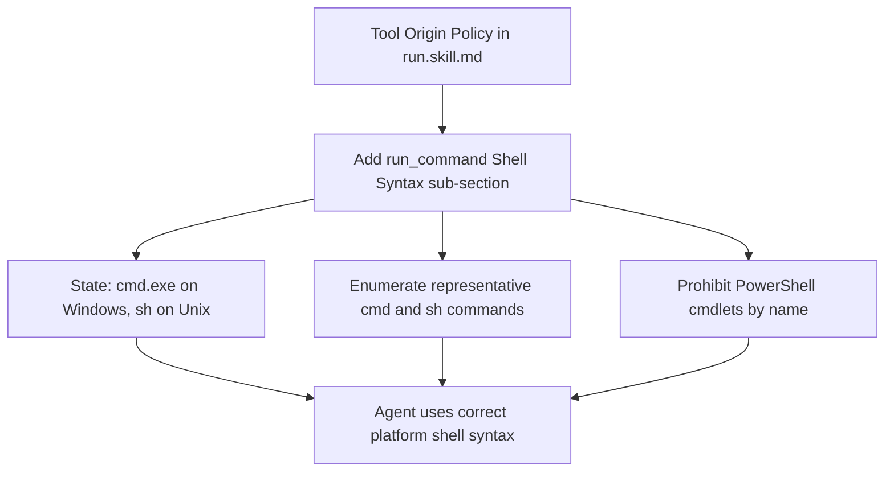

# Run Skill: Explicit Shell-Platform Guidance for run_command

## Raw Requirement

Add explicit guidance in run.skill.md (e.g. in Phase 3 tool-use notes or the Tool Origin Policy section) stating: run_command uses cmd.exe on Windows and sh on Unix. Agents must use shell-appropriate syntax — cmd commands on Windows (dir, type, findstr, etc.), sh-compatible commands on Unix — and must not use PowerShell cmdlets in run_command calls regardless of the host environment.

## Description

The `run_command` tool dispatches to `cmd.exe` on Windows and `sh` on Unix (established by `moeb.run-command-tool.md`). The current `run.skill.md` contains no guidance on which shell syntax agents must use when calling `run_command`. Without this guidance, agents operating on Windows — where training data favours PowerShell — issue cmdlets such as `Get-ChildItem`, `Test-Path`, and `Select-String` through `cmd.exe`, which does not interpret PowerShell syntax and returns a non-zero exit code or empty output. This specification adds a `run_command` Shell Syntax sub-section to the Tool Origin Policy in `src/moeb/internal/skills/run.skill.md`, explicitly stating the platform dispatch rule, enumerating representative shell commands per platform, and prohibiting PowerShell cmdlets by name. No Rust kernel changes are required.



## Backlinks

### Parents

| Label | Path | Purpose |
|-------|------|---------|
| Harness README | README.md | Governing harness policy and specification index |
| Run Command Tool | specifications/moeb/moeb.run-command-tool.md | Establishes that run_command dispatches to cmd.exe on Windows and sh on Unix — the foundational fact this guidance surfaces in the skill |

## Steps

### Step 1 — Read run.skill.md

Call `read_file` on `src/moeb/internal/skills/run.skill.md`. Identify the Tool Origin Policy section. Locate the exact last line of the introductory paragraph in that section (the line immediately before the MissingMoebTool JSON instruction block, or before the end of the section if no such block exists). This line serves as the `patch_file` anchor.

### Step 2 — Insert the run_command Shell Syntax sub-section

Call `patch_file` on `src/moeb/internal/skills/run.skill.md`. Set `old_string` to the anchor line identified in Step 1, and `new_string` to that anchor line followed immediately by the sub-section text below on the next line:

```
### run_command Shell Syntax

`run_command` dispatches to `cmd.exe` on Windows and `sh` on Unix. Always use shell-appropriate syntax in `run_command` calls:

- **Windows (`cmd.exe`):** use built-in cmd commands: `dir`, `type`, `findstr`, `echo`, `del`, `copy`, `move`, `md`, `rd`, `set`, `where`. Do not use PowerShell cmdlets.
- **Unix (`sh`):** use POSIX sh commands: `ls`, `cat`, `grep`, `find`, `echo`, `rm`, `cp`, `mv`, `mkdir`, `which`.

**Never use PowerShell cmdlets** (`Get-ChildItem`, `Test-Path`, `Select-String`, `Get-Content`, `Set-Content`, `Remove-Item`, `ForEach-Object`, `Where-Object`) in `run_command` calls regardless of the host platform. `cmd.exe` does not interpret PowerShell syntax and will return a non-zero exit code or produce no output.
```

If `patch_file` returns a result containing "failed", "error", or "could not", read the full file using `read_file`, incorporate the sub-section in working memory at the correct location, and write the complete updated content using `write_file`.

### Step 3 — Verify insertion

Call `grep_files` with pattern `run_command dispatches to` on path `src/moeb/internal/skills/run.skill.md`. If the match count is zero, the insertion did not persist. Read the full file with `read_file`, insert the sub-section text at the correct location in working memory, and write the complete updated content using `write_file`.

## Decisions

### Decision 1 — Tool Origin Policy is the correct insertion point

The Tool Origin Policy section is read before any phase-specific work begins, making it the highest-visibility location for a cross-cutting tool-use constraint. Shell syntax governs every `run_command` call throughout the entire run regardless of phase, so a phase-specific note (the alternative location named in the requirement) would reach the agent only mid-run after incorrect calls may already have been issued.

Rejected alternatives:
- *Phase 3 tool-use notes:* Lower visibility; cross-cutting constraints belong in the policy section applied before all phases begin.

Consequences: The guidance is available from the start of every run, before any `run_command` call is possible.

### Decision 2 — Representative command lists rather than exhaustive enumeration

Five to eight representative commands per platform anchor the agent's mental model without bloating the skill file. Exhaustive lists are brittle — any platform update would require a skill-file change — and consume unnecessary token budget on every run.

Rejected alternatives:
- *Exhaustive command lists:* Unmaintainable and token-expensive.
- *Principle only (no examples):* Too abstract; agents need concrete examples to avoid PowerShell drift.

Consequences: The command list may need to be extended if new commonly-misused commands emerge.

### Decision 3 — Explicit PowerShell cmdlet prohibition with named examples

Naming eight commonly misused cmdlets (`Get-ChildItem`, `Test-Path`, `Select-String`, `Get-Content`, `Set-Content`, `Remove-Item`, `ForEach-Object`, `Where-Object`) gives agents a recognisable pattern set. An abstract rule ("do not use PowerShell") is insufficient because agents may not recognise specific cmdlets as PowerShell-only without concrete counter-examples.

Rejected alternatives:
- *Abstract prohibition only:* Less effective; agents cannot pattern-match against unnamed cmdlets.

Consequences: The list may need extension if additional problematic cmdlets emerge in future runs.

### Decision 4 — Skill-only change; no Rust modification

Shell syntax guidance is workflow knowledge per the kernel-thin-and-parity principle and belongs in skill markdown. The `run_command` tool already dispatches correctly — only the agent's usage guidance is absent. Enforcing syntax at the kernel level would require pattern-matching shell commands in Rust, introducing workflow logic into the kernel in violation of the thin-kernel constraint.

Rejected alternatives:
- *Kernel-level syntax validation:* Violates thin-kernel; places workflow logic in compiled Rust.

Consequences: The fix is deployable by patching the skill file without a binary rebuild.

## Rubric

### Structured

| Name | Description | Threshold | Pass Condition |
|------|-------------|-----------|----------------|
| `tool-errors` | No ToolHandler errors were recorded during this command invocation. Covers all tool calls on both CLI and MCP paths via `RealToolExecutor::execute`. Applies to every moeb command. | Zero tool errors | Kernel-authoritative: injected by `verify_rubrics` from `RunState.tool_errors`. Do not supply a verdict — any agent-supplied entry is overridden. |
| `rubric-qualification` | No Pass verdicts with acknowledged failures were issued during this command invocation. An agent that observes a failure but passes a criterion must populate `acknowledged_failures` in the verdict object. Applies to every moeb command. | Zero qualified Pass verdicts | Kernel-authoritative: injected by `verify_rubrics` by scanning `acknowledged_failures` on incoming Pass verdicts. Do not supply a verdict — any agent-supplied entry is overridden. |
| `skill-mandatory-phases` | The skill loaded for this run contains all mandatory phase headings. The agent checks its own prompt context for the exact strings: "Verify", "End-of-Skill Review", "Metrics Recording", "Commit", "Tag", "Complete". No file read is required. | All six mandatory headings present | Agent scans skill content in its loaded context; fails if any mandatory heading string is absent |
| `no-drift` | The specification does not violate any decision recorded in a linked parent specification | Zero contradictions | Manual review of every decision in every parent spec listed in Backlinks |
| `spec-schema-compliance` | All required frontmatter fields and body sections are present and correctly ordered | 100% of required fields and sections | Validation in `domain/spec.rs` exits 0 during `moeb spec` |
| `ai-first-org` | The specification's Steps prescribe file layouts, naming, and helper placement that satisfy the four AI-first organisation principles: one concern per file, context locality, grep-discoverable names, no cross-cutting helpers. | All four principles followed | Manual review: no step produces a file that mixes concerns, no name is generic across the codebase, all helpers are co-located with their callers |
| `branch-clean-at-exit` | After Phase 9 (Commit), the working tree contains no uncommitted changes; any dirty state detected in Phase 9a has been resolved by retry commit (Case A) or by signal emission and cleanup commit (Case B) | Zero uncommitted changes at spec skill exit | Agent verifies that `git_status` returned empty output after Phase 9, or that a retry (Case A) or cleanup commit (Case B) was issued and the branch is clean |
| `kernel-thin-and-parity` | No domain-specific or workflow-specific coordination logic may be placed in kernel Rust code when it can live in skill markdown or role files. Every tool registered in the CLI tool registry must also be registered in the MCP stdio server tool list. | Zero violations | Spec review: no proposed step places review/coordination logic in Rust; Run review: grep confirms no skill-specific logic in kernel tools |
| `moeb-tool-origin` | All tool calls made during this invocation must originate from moeb's own tool registry. If an external tool (not in the moeb registry) was used because no moeb equivalent exists, the agent must write a MissingMoebTool signal immediately after each such call. The criterion always fails when any external tool is used, whether or not a signal was written. | Zero external tool calls | Agent reviews the conversation for calls to non-moeb tools. Supplies Pass if none were made. If external tools were used with MissingMoebTool signals, supplies Fail with `acknowledged_failures` listing each signal title. |

### Qualitative

- The guidance inserted into `run.skill.md` must be unambiguous: a reader can determine from it alone whether any given shell command is permissible in a `run_command` call without consulting any other document.
- The PowerShell prohibition must name at least four cmdlets, giving agents a recognisable pattern set rather than a vague rule.
- The inserted sub-section must not duplicate or contradict any existing guidance already present in `run.skill.md`.
- The sub-section heading `### run_command Shell Syntax` must be unique within `run.skill.md` and grep-discoverable.
