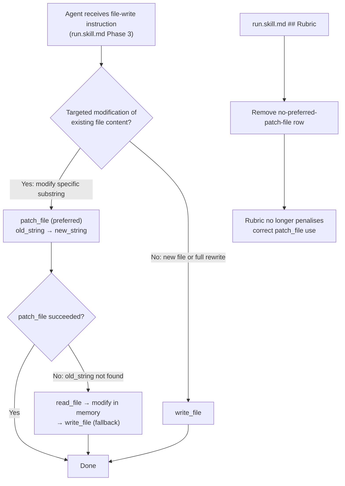

# Run Skill: Reinstate patch_file as Preferred Tool for Targeted Modifications and Remove Stale Rubric

## Raw Requirement

Remove the no-preferred-patch-file rubric criterion from run.skill.md's rubric section. Update Phase 3 guidance to recommend patch_file as the preferred tool for targeted modifications (changes to existing file content), reserving write_file for full file creation or complete rewrites. This aligns with patch_file's current exact-string semantics and eliminates the friction caused by the stale deprecation. Signal d1e2f3a4 (open, Major) is superseded by this signal and should be closed when this signal's spec is executed.

## Description

The `moeb.deprecate-patch-file-as-default-write-path` specification promoted `write_file` as the unconditional default for all file modifications in skill files after a series of `patch_file` failures under the old unified-diff implementation. Subsequently, `moeb.patch-file-exact-string-rewrite` replaced the fragile unified-diff mechanism with exact `old_string`/`new_string` substring replacement, making `patch_file` substantially more reliable.

The `no-preferred-patch-file` rubric criterion in `run.skill.md` is now a stale artifact of the deprecation era. It penalises agents for using `patch_file` even when that is the correct, minimal-impact choice for a targeted in-place modification. The Phase 3 write-path guidance in `run.skill.md` (currently instructing agents to use `write_file` as the unconditional default) should be updated to reflect the restored reliability of `patch_file` for targeted modifications.

This specification makes two targeted changes to `src/moeb/internal/skills/run.skill.md`:

1. **Remove `no-preferred-patch-file`** from the `## Rubric / ### Structured` table.
2. **Update Phase 3 write-path guidance** to designate `patch_file` as the preferred tool when modifying a specific substring of an existing file, and `write_file` when creating a new file or performing a complete content replacement.

No changes are made to `spec.skill.md` or `fix_signal.skill.md`. Those files' `write_file`-first postures remain intact.

## Backlinks

### Parents

| Label | Path | Purpose |
|-------|------|---------|
| README | [README.md](../../README.md) | Root harness index |
| Deprecate patch_file as Default Write Path | [specifications/moeb/moeb.deprecate-patch-file-as-default-write-path.md](specifications/moeb/moeb.deprecate-patch-file-as-default-write-path.md) | Spec whose Decision 1 this partially supersedes: introduced the write_file-unconditional-default policy and the no-preferred-patch-file rubric criterion in run.skill.md |
| Rewrite patch_file with Exact String Matching | [specifications/moeb/moeb.patch-file-exact-string-rewrite.md](specifications/moeb/moeb.patch-file-exact-string-rewrite.md) | Replaced the fragile unified-diff mechanism with exact old_string/new_string replacement — the implementation change that makes patch_file reliable enough to reinstate |
| Agent Skills | [specifications/moeb/moeb.agent-skills.md](specifications/moeb/moeb.agent-skills.md) | Establishes the skill file system containing run.skill.md |

## Steps

### Step 1 — Read run.skill.md in full

Read `src/moeb/internal/skills/run.skill.md` in full using `read_file`. This establishes the read-scope required for the subsequent `write_file` call.

### Step 2 — Remove the `no-preferred-patch-file` rubric row

In the content of `run.skill.md` held in context, locate the `## Rubric / ### Structured` table. Find the row whose Name cell contains `` `no-preferred-patch-file` ``. Remove that row entirely (the full pipe-delimited line and its trailing newline).

Use `patch_file` with:
- `old_string`: the exact text of the `no-preferred-patch-file` row as read from the file (including the leading newline that separates it from the preceding row, so the table remains well-formed)
- `new_string`: empty string

If `patch_file` fails, apply the removal in working memory to the full file content and write the complete updated content using `write_file`.

### Step 3 — Update Phase 3 write-path guidance

In `run.skill.md`, locate the phase or section that currently instructs agents to use `write_file` as the unconditional default for all file modifications (the section introduced by `moeb.deprecate-patch-file-as-default-write-path`).

Replace the unconditional `write_file` default instruction with a two-tier recommendation:

> **Preferred write path for targeted modifications:** When changing a specific substring of an existing file, use `patch_file` with the exact `old_string` and `new_string`. This is the preferred path for in-place edits.
>
> **Preferred write path for new files or complete rewrites:** When creating a new file or replacing the entire file content, use `write_file`.
>
> **Fallback:** If `patch_file` fails (old_string not found), read the file, apply the change in working memory, and write the complete updated content using `write_file`.

If the existing instruction is a single sentence or bullet, replace just that instruction. If it occupies a labelled sub-section, update the sub-section content. Use `patch_file` for this targeted replacement. If `patch_file` fails, apply the change in working memory and write the complete updated `run.skill.md` using `write_file`.

### Step 4 — Verify mandatory phase headings are intact

Use `grep_files` to confirm all six mandatory heading strings are still present in `src/moeb/internal/skills/run.skill.md` after modification:

- `Verify`
- `End-of-Skill Review`
- `Metrics Recording`
- `Commit`
- `Tag`
- `Complete`

All six must match. If any heading is absent, the file write introduced a regression — re-read the file, restore the missing heading, and write the corrected content using `write_file`.

### Step 5 — Verify no-preferred-patch-file row is absent

Use `grep_files` to search for the string `no-preferred-patch-file` in `src/moeb/internal/skills/run.skill.md`. The search must return zero matches. If matches remain, re-apply Step 2.

### Step 6 — Build and test

Run `cargo build --release` (via `run_command`) to confirm zero compilation errors. Run `cargo test` to confirm all existing tests pass. Skill markdown files are text assets; changes to them do not affect Rust compilation, but this step verifies no co-located asset loading code was inadvertently affected.

## Decisions

### Decision 1 — Partially supersede Decision 1 of moeb.deprecate-patch-file-as-default-write-path (run.skill.md scope only)

**Rationale:** Decision 1 of `moeb.deprecate-patch-file-as-default-write-path` promoted `write_file` as the unconditional default in response to repeated `patch_file` failures under the unified-diff implementation. That implementation has since been replaced by `moeb.patch-file-exact-string-rewrite`, which uses exact substring matching — a substantially more reliable mechanism. The original failure class (AI arithmetic errors in hunk headers, CRLF normalization, context line mismatch) does not apply to the new implementation. The `no-preferred-patch-file` rubric criterion in `run.skill.md` therefore penalises agents for correct, efficient behaviour.

This spec does NOT revert the `write_file`-first changes made to `spec.skill.md` or `fix_signal.skill.md`. Those changes address specific contexts (review sub-loop in-memory diff application, README links) where `write_file` remains the appropriate choice. Only `run.skill.md` Phase 3 guidance and the stale rubric criterion are addressed.

**Alternatives:**

| Option | Reason Rejected |
|--------|----------------|
| Leave run.skill.md unchanged | Perpetuates a stale rubric that penalises agents for correct patch_file use and misleads implementers about the tool's current reliability |
| Revert all three skill files to patch_file-as-default | Overly broad; the spec.skill.md and fix_signal.skill.md write_file postures address specific contexts not covered by this requirement |
| Remove patch_file from the tool registry | Opposite direction; patch_file is reliable under exact-string semantics and should remain available |

**Consequences:** Agents executing run.skill.md will use `patch_file` for targeted modifications rather than re-writing entire files, reducing token cost for surgical changes. The `no-preferred-patch-file` rubric criterion is no longer enforced for run agents.

---

### Decision 2 — Retain write_file as explicit fallback when patch_file fails

**Rationale:** Even with exact-string semantics, `patch_file` can fail when `old_string` is not found (due to whitespace differences or context drift after other edits). Providing an explicit `write_file` fallback path ensures agents are not blocked by a failed patch attempt. This preserves the reliability posture established in `moeb.deprecate-patch-file-as-default-write-path` without sacrificing the token efficiency of targeted writes.

**Alternatives:**

| Option | Reason Rejected |
|--------|----------------|
| Fail immediately on patch_file failure with no fallback | Regresses reliability for run skill file writes; the original deprecation was partly motivated by the absence of graceful degradation |

**Consequences:** Skill guidance documents a two-tier write path: `patch_file` first for targeted changes, `write_file` fallback on failure. This pattern is already present elsewhere in the harness (Phase 5 of spec.skill.md).

---

### Decision 3 — Scope change to run.skill.md only

**Rationale:** The requirement explicitly targets `run.skill.md`. The `no-preferred-patch-file` rubric criterion exists only in `run.skill.md`. Extending the scope to other skill files would exceed the requirement's minimal footprint and risk introducing regressions in files not under active investigation.

**Alternatives:**

| Option | Reason Rejected |
|--------|----------------|
| Update all three skill files to prefer patch_file | Exceeds requirement scope; spec.skill.md and fix_signal.skill.md changes are out of scope for this signal |

**Consequences:** One file modified. Signal d1e2f3a4 is closed with `status: resolved` by the implementing run agent after executing this specification.

## Rubric

### Structured

| Name | Description | Threshold | Pass Condition |
|------|-------------|-----------|----------------|
| `tool-errors` | No ToolHandler errors were recorded during this command invocation. Covers all tool calls on both CLI and MCP paths via `RealToolExecutor::execute`. Applies to every moeb command. | Zero tool errors | Kernel-authoritative: injected by `verify_rubrics` from `RunState.tool_errors`. Do not supply a verdict — any agent-supplied entry is overridden. |
| `rubric-qualification` | No Pass verdicts with acknowledged failures were issued during this command invocation. An agent that observes a failure but passes a criterion must populate `acknowledged_failures` in the verdict object. Applies to every moeb command. | Zero qualified Pass verdicts | Kernel-authoritative: injected by `verify_rubrics` by scanning `acknowledged_failures` on incoming Pass verdicts. Do not supply a verdict — any agent-supplied entry is overridden. |
| `skill-mandatory-phases` | The skill loaded for this run contains all mandatory phase headings. The agent checks its own prompt context (the loaded skill content is already present) for the exact strings: "Verify", "End-of-Skill Review", "Metrics Recording", "Commit", "Tag", "Complete". No file read is required. | All six mandatory headings present | Agent scans skill content in its loaded context; fails if any mandatory heading string is absent |
| `no-drift` | The specification does not violate any decision recorded in a linked parent specification | Zero contradictions | Manual review of every decision in every parent spec listed in Backlinks |
| `spec-schema-compliance` | All required frontmatter fields and body sections are present and correctly ordered | 100% of required fields and sections | Validation in `domain/spec.rs` exits 0 during `moeb spec` |
| `ai-first-org` | The specification's Steps prescribe file layouts, naming, and helper placement that satisfy the four AI-first organisation principles: one concern per file, context locality, grep-discoverable names, no cross-cutting helpers. | All four principles followed | Manual review: no step produces a file that mixes concerns, no name is generic across the codebase, all helpers are co-located with their callers or promoted to a precisely named module |
| `branch-clean-at-exit` | After Phase 9 (Commit), the working tree contains no uncommitted changes; any dirty state detected in Phase 9a has been resolved by retry commit (Case A) or by signal emission and cleanup commit (Case B) | Zero uncommitted changes at spec skill exit | Agent verifies that `git_status` returned empty output after Phase 9, or that a retry (Case A) or cleanup commit (Case B) was issued and the branch is clean |
| `kernel-thin-and-parity` | No domain-specific or workflow-specific coordination logic may be placed in kernel Rust code when it can live in skill markdown or role files. Every tool registered in the CLI tool registry must also be registered in the MCP stdio server tool list. | Zero violations | Spec review: no proposed step places review/coordination logic in Rust; Run review: grep confirms no skill-specific logic in kernel tools; tool lists in tools/mod.rs and the MCP server match exactly |
| `moeb-tool-origin` | All tool calls made during this invocation must originate from moeb's own tool registry. If an external tool (not in the moeb registry) was used because no moeb equivalent exists, the agent must write a MissingMoebTool signal immediately after each such call. The criterion always fails when any external tool is used, whether or not a signal was written. | Zero external tool calls | Agent reviews the conversation for calls to non-moeb tools (e.g. Bash, Edit, Write, Read, Glob, Grep, WebFetch, WebSearch in Claude Code MCP mode). Supplies Pass if none were made. If external tools were used with MissingMoebTool signals, supplies Fail with `acknowledged_failures` listing each signal title. If external tools were used without signals, supplies Fail with the unlogged tool names in the note. |
| `thin-kernel` | New Rust code in tools/, commands/, or domain/ must be either (a) a primitive operation wrapper (filesystem, git, or HTTP with no domain logic) or (b) a thin dispatcher that calls into skills, tools, or agents and returns the result unchanged. Workflow logic must live in skill markdown or role files, not in compiled Rust. | Zero workflow-logic functions in new Rust | Spec review: no Step proposes placing sequencing or conditional workflow logic in Rust when a skill-file change would suffice; Run review: every new function in tools/ or commands/ either wraps a single OS/VCS/HTTP call or contains no domain-specific branching |
| `mcp-cli-behavioural-parity` | For any operation exposed through both the CLI agent loop and the MCP server, the observable outcome must be identical: same file mutations, same tool result string format, same rendered prompt template. | Zero divergent outcomes | Run review: run.skill.md changes apply equally to both CLI and MCP execution paths; no MCP-only or CLI-only code path is introduced |
| `new-skill-mandatory-phases` | Any `*.skill.md` file written or modified during this run retains all mandatory phase heading strings: "Verify", "End-of-Skill Review", "Metrics Recording", "Commit", "Tag", "Complete" | All six strings present in every modified skill file | Agent verifies run.skill.md contains all six mandatory heading strings after modification using grep_files |
| `no-signal-reoccurrence` | No canonical signal in `.moeb/signals/catalogue/` has `status: reopened` due to this run | Zero reopened signals introduced by this run | Agent verifies no signal file has status: reopened after signal writes in this run complete |

### Qualitative

- **Minimal footprint**: Only `run.skill.md` is modified; `spec.skill.md` and `fix_signal.skill.md` are untouched.
- **Signal closure**: Signal d1e2f3a4 (the signal this spec was raised to address) is closed with `status: resolved` by the implementing run agent.
- **Skill coherence**: The updated `run.skill.md` presents a consistent two-tier write strategy: `patch_file` for targeted in-place edits, `write_file` for full rewrites and new file creation, with an explicit `write_file` fallback when `patch_file` fails.
- **No regression**: Cargo build and tests remain green after the skill file modification.
