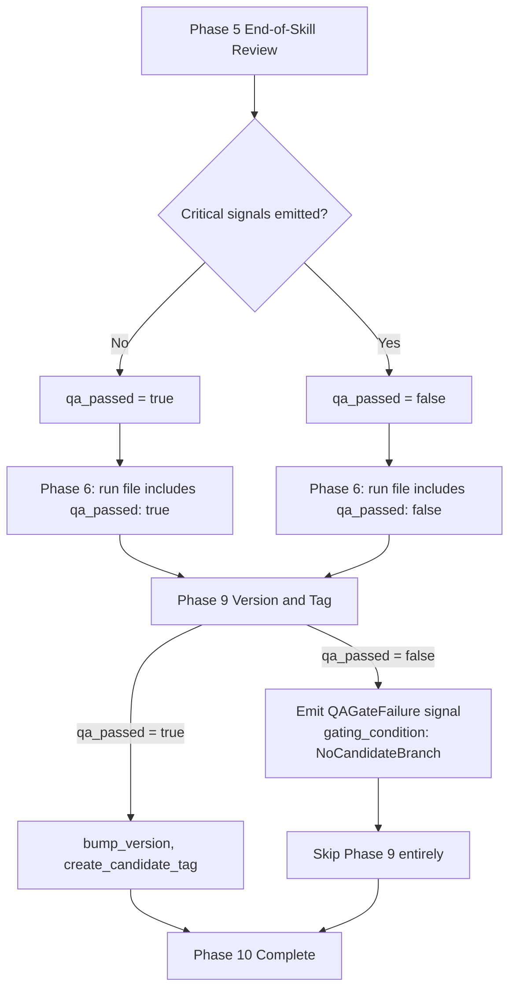

# Run Skill: Gate Candidate Tag on QA Review Pass

## Raw Requirement

Gate the create_candidate_tag call on a passing complete_review result. If QA does not pass, the run must exit without a candidate tag and emit a signal recording the QA failure reason and which rubrics were not satisfied. The run file should record qa_passed: true|false so the conductor can inspect it without re-reading the review output.

## Description

The run skill's Version and Tag phase currently calls `create_candidate_tag` unconditionally after the End-of-Skill Review phase. This specification adds a QA gate derived from the Phase 5 ReviewSignalReport: after the QA Architect produces and processes all signals, the agent sets working memory `qa_passed = true` if no Critical-severity signal was emitted, else `qa_passed = false`. Phase 6 (Metrics Recording) records this boolean as a top-level `qa_passed` field in the run file JSON. In Phase 9 (Version and Tag), if `qa_passed` is `false`, the agent emits a `QAGateFailure` signal via the Canonical Signal Dedup-and-Write Procedure and skips the entire Version and Tag phase (no `bump_version` or `create_candidate_tag` calls). All changes are confined to `src/moeb/internal/skills/run.skill.md`; no Rust kernel modifications are required.



## Backlinks

### Parents

| Label | Path | Purpose |
|-------|------|---------|
| Harness README | .moeb/README.md | Root specification index |
| Run Skill: SemVer Version Bump and Candidate Tag | specifications/moeb/moeb.run-semver-bump-and-candidate-tag.md | Defines the existing Version and Tag phase and `create_candidate_tag` call to which this specification adds a gate condition |
| Composable Review Wrapper | specifications/moeb/moeb.composable-review-wrapper.md | Defines the QA Architect End-of-Skill Review whose ReviewSignalReport output provides the gate input |
| Run File Artifact | specifications/moeb/moeb.run-file-artifact.md | Defines the run file format extended here with the `qa_passed` field |

## Steps

1. **Read `src/moeb/internal/skills/run.skill.md`** using `read_file` to locate:
   - The exact closing sentence of Phase 5 (End-of-Skill Review) that says "Continue to Phase 6 — Metrics Recording regardless of critical signal presence." (or similar).
   - The run file JSON template block in Phase 6 — Metrics Recording, specifically the line containing `"end_review_error_count"`.
   - The opening line of Phase 9 (Version and Tag), including its `##` heading.

2. **Patch Phase 5 — End-of-Skill Review** in `src/moeb/internal/skills/run.skill.md`:
   Locate the line "Continue to Phase 6 — Metrics Recording regardless of critical signal presence." (the final sentence of Phase 5 before the next `##` heading) and insert the following paragraph immediately before that line:

   ```
   After all Phase 5 signals are processed, evaluate the ReviewSignalReport produced above. Set working memory `qa_passed = true` if the signals array contains no entry with `"severity": "Critical"`; otherwise set `qa_passed = false`.
   ```

3. **Patch Phase 6 — Metrics Recording** in `src/moeb/internal/skills/run.skill.md`:
   In the run file JSON template, locate the line containing `"end_review_error_count"` and insert `"qa_passed": <qa_passed>,` on the line immediately following it. The value must be the working memory boolean (`true` or `false`), not a string.

4. **Patch Phase 9 — Version and Tag** in `src/moeb/internal/skills/run.skill.md`:
   Immediately after the `## Phase 9` heading line, insert the following block before any existing phase body content:

   ```
   **QA Gate.** Before proceeding, check working memory `qa_passed`. If `qa_passed` is `false`:
   1. Collect all Critical signals from the Phase 5 ReviewSignalReport. Format each as `"<title>"`.
   2. Emit a signal via the Canonical Signal Dedup-and-Write Procedure with:
      - `category`: `"Error"`
      - `severity`: `"Major"`
      - `title`: `"Candidate tag suppressed: QA gate failed"`
      - `description`: `"QA Architect review produced Critical signals; qa_passed is false. Failing signals: <comma-separated list of formatted Critical signal titles>."`
      - `proposed_resolution`: `"Resolve all Critical signals listed above and re-run to obtain a candidate tag."`
      - `gating_condition`: `"NoCandidateBranch"`
   3. Append this signal to the run file `emittedSignals` array.
   4. Skip the remainder of Phase 9 entirely (do not call `bump_version` or `create_candidate_tag`). Proceed directly to Phase 10 — Complete.
   ```

5. **Write** the complete updated `src/moeb/internal/skills/run.skill.md` using `write_file` with the full modified content.

## Decisions

### Decision 1 — Gate threshold is absence of Critical signals from Phase 5

The QA Architect persona uses severity "Critical" exclusively for errors that would produce incorrect outputs, data loss, or repeated run failures. These are the only conditions that justify suppressing a candidate release artifact. Minor and Major signals represent advisory improvements that do not invalidate the implementation output.

**Rejected alternatives:**
- Gate on `end_review_error_count > 0`: This kernel-written field counts Critical signals but is unavailable in working memory until after `verify_rubrics`, requiring an extra `get_run_status` call. The Phase 5 ReviewSignalReport is already in working memory; inspecting it directly avoids an extra tool call.
- Gate on `rubric_score < threshold`: Rubric score is an aggregate; a single Critical error could be masked by high scores on other criteria. Direct severity inspection is more precise and does not require choosing a threshold value.

**Consequences:** Runs with only Minor or Major signals receive a candidate tag. Conductors must inspect individual signals to assess run quality beyond the `qa_passed` boolean.

### Decision 2 — qa_passed recorded as a boolean in the run file

The requirement explicitly specifies `qa_passed: true|false`. A top-level boolean field in the run file JSON is the minimal representation that satisfies this. Using a boolean rather than a string avoids type-coercion bugs in conductors that compare JSON values.

**Rejected alternatives:**
- Store only in the metrics file: Metrics files are structured differently and the run file is the primary conductor-facing artifact per `moeb.run-file-artifact.md`.
- Store as a count `qa_failure_count`: A boolean is simpler; the requirement uses true/false language and a count of Critical signals is already available via the signal catalogue.

**Consequences:** Run files written before this spec lack the `qa_passed` field. Conductors must treat absence as unknown and should consult the signal catalogue for signal-based assessment of old runs.

### Decision 3 — QAGateFailure signal carries gating_condition: NoCandidateBranch

Using the existing `"NoCandidateBranch"` gating condition makes the suppression reason machine-readable and consistent with the signal schema already used in the QA Architect persona. Conductors that scan for `NoCandidateBranch` entries will surface this suppression without additional code changes.

**Rejected alternatives:**
- Custom gating condition string: Requires signal schema extension; `NoCandidateBranch` is already defined and semantically correct.
- Emit no signal: The requirement explicitly mandates a signal. Silent suppression is invisible to the improvement queue.

**Consequences:** Conductors that filter on `NoCandidateBranch` will surface QA-gate suppressions alongside other tag-blocking events. The signal description names the specific failing Critical signal titles, giving sufficient context to remediate.

### Decision 4 — Skill-only change; no Rust kernel modification

The gate logic is pure workflow coordination: check a working memory value, conditionally call tools. Per `kernel-thin-and-parity` and `thin-kernel`, this belongs in skill markdown, not compiled Rust. No new kernel tool is required.

**Rejected alternatives:**
- Add a `qa_gate_check` kernel tool that blocks `create_candidate_tag` if QA failed: Violates `kernel-thin-and-parity`; the condition check is workflow logic that must live in the skill.
- Add a parameter to `create_candidate_tag` that rejects the call when QA failed: Same violation; the gate decision belongs in the skill, not the tool.

**Consequences:** The gate is enforced by the agent following skill instructions. Adherence depends on the skill being executed faithfully; the kernel does not independently enforce it. This is consistent with all other conditional logic in run.skill.md.

### Decision 5 — The gate skips the entire Phase 9, not just create_candidate_tag

If QA fails, `bump_version` is also skipped. Committing a version bump for a run that does not produce a candidate tag leaves a dangling increment commit in the git history, misleading readers who might infer a release occurred.

**Rejected alternatives:**
- Call `bump_version` but skip only `create_candidate_tag`: Leaves a dangling version bump (modified `Cargo.toml` and uncommitted working-tree changes) for a run that produced no release artifact.

**Consequences:** On QA failure, the version number in `Cargo.toml` is not incremented. The next successful run will bump from the same base version, which is the correct behavior — no version is consumed by a failed run.

## Rubric

### Structured

| Name | Description | Threshold | Pass Condition |
|------|-------------|-----------|----------------|
| `tool-errors` | No ToolHandler errors were recorded during this command invocation. Covers all tool calls on both CLI and MCP paths via `RealToolExecutor::execute`. Applies to every moeb command. | Zero tool errors | Kernel-authoritative: injected by `verify_rubrics` from `RunState.tool_errors`. Do not supply a verdict — any agent-supplied entry is overridden. |
| `rubric-qualification` | No Pass verdicts with acknowledged failures were issued during this command invocation. An agent that observes a failure but passes a criterion must populate `acknowledged_failures` in the verdict object. Applies to every moeb command. | Zero qualified Pass verdicts | Kernel-authoritative: injected by `verify_rubrics` by scanning `acknowledged_failures` on incoming Pass verdicts. Do not supply a verdict — any agent-supplied entry is overridden. |
| `skill-mandatory-phases` | The skill loaded for this run contains all mandatory phase headings. The agent checks its own prompt context (the loaded skill content is already present) for the exact strings: "Verify", "End-of-Skill Review", "Metrics Recording", "Commit", "Tag", "Complete". No file read is required. | All six mandatory headings present | Agent scans skill content in its loaded context; fails if any mandatory heading string is absent. |
| `no-drift` | The specification does not violate any decision recorded in a linked parent specification. | Zero contradictions | Manual review of every decision in every parent spec listed in Backlinks. |
| `spec-schema-compliance` | All required frontmatter fields and body sections are present and correctly ordered. | 100% of required fields and sections | Validation in `domain/spec.rs` exits 0 during `moeb spec`. |
| `ai-first-org` | The specification's Steps prescribe file layouts, naming, and helper placement that satisfy the four AI-first organisation principles: one concern per file, context locality, grep-discoverable names, no cross-cutting helpers. | All four principles followed | Manual review: no step produces a file that mixes concerns, no name is generic across the codebase, all helpers are co-located with their callers or promoted to a precisely named module. |
| `kernel-thin-and-parity` | No domain-specific or workflow-specific coordination logic may be placed in kernel Rust code when it can live in skill markdown or role files. Every tool registered in the CLI tool registry must also be registered in the MCP stdio server tool list. | Zero violations | Spec review: no proposed step places review/coordination logic in Rust; Run review: grep confirms no skill-specific logic in kernel tools; tool lists in tools/mod.rs and the MCP server match exactly. |
| `moeb-tool-origin` | All tool calls made during this invocation must originate from moeb's own tool registry. If an external tool (not in the moeb registry) was used because no moeb equivalent exists, the agent must write a MissingMoebTool signal immediately after each such call. The criterion always fails when any external tool is used, whether or not a signal was written. | Zero external tool calls | Agent reviews the conversation for calls to non-moeb tools (e.g. Bash, Edit, Write, Read, Glob, Grep, WebFetch, WebSearch in Claude Code MCP mode). Supplies Pass if none were made. If external tools were used with MissingMoebTool signals, supplies Fail with `acknowledged_failures` listing each signal title. If external tools were used without signals, supplies Fail with the unlogged tool names in the note. |
| `thin-kernel` | New Rust code in tools/, commands/, or domain/ must be either (a) a primitive operation wrapper (filesystem, git, or HTTP with no domain logic) or (b) a thin dispatcher that calls into skills, tools, or agents and returns the result unchanged. Workflow logic — sequencing, conditionals, review loops, retry strategy, branching decisions — must live in skill markdown or role files, not in compiled Rust. If the same capability can be achieved by updating a skill file, that path is mandatory. | Zero workflow-logic functions in new Rust | Spec review: no Step proposes placing sequencing or conditional workflow logic in Rust when a skill-file change would suffice; Run review: every new function in tools/ or commands/ either wraps a single OS/VCS/HTTP call or contains no domain-specific branching. |
| `new-skill-mandatory-phases` | Any `*.skill.md` file written during this run contains all mandatory phase heading strings: "Verify", "End-of-Skill Review", "Metrics Recording", "Commit", "Tag", "Complete". | All six strings present in the written skill file | Grep the written `run.skill.md` for each of the six mandatory heading strings; pass if all six are present after the modifications. |
| `no-signal-reoccurrence` | No canonical signal in `.moeb/signals/catalogue/` has `status: reopened` due to this run. | Zero reopened signals introduced by this run | Scan `.moeb/signals/catalogue/` after writing all signals; pass if no signal written in this run has `status: reopened`. |

### Qualitative

- The gate condition (absence of Critical-severity signals from Phase 5 ReviewSignalReport) is determinable from working memory without additional tool calls.
- The QAGateFailure signal description names each failing Critical signal title, giving a human reviewer sufficient context to act.
- The `qa_passed` field is a boolean, not a string, making it directly comparable in JSON without type coercion.
- No step touches Rust source files; the entire change lives in `src/moeb/internal/skills/run.skill.md`.
- The complete Version and Tag phase (bump, commit, tag) is skipped on QA failure, preventing dangling version-bump commits.
